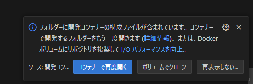
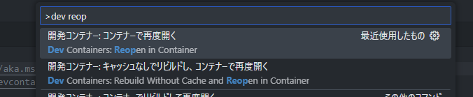

# ocitutorials-geekdocs

OCIチュートリアルの更新プロジェクト用のリポジトリです。test


## 環境設定手順 (Dev Containers編)
### 0. 環境情報（25/05/15時点）
**Hugo**
```
$ hugo version
hugo v0.147.3-05417512bd001c0b2cc0042dcc584575825b89b3 linux/amd64 BuildDate=2025-05-12T12:25:03Z VendorInfo=gohugoio
```

**go**
```
$ go version
go version go1.23.4 linux/amd64
```

### 1. 前準備
#### ● Dev Containers の準備
拡張機能から検索してインストール


#### ● Rancher Desktop を用意する
Rancher Desktopインストール後、起動しておく

### 2. セットアップ
適当なディレクトリで`git clone`して`ocitutorial-geekdocs`ディレクトリを作成

```
git clone https://github.com/oracle-japan/ocitutorial-geekdocs/
```

`ocitutorial-geekdocs`ディレクトリをVS Codeで開いた後、以下のポップアップがでてくるので、「コンテナーで再度開く」を選択



出てこなければ、コマンドパレットから実行


立ち上がり次第、hugoコマンドが使えるかを確認する
```
$ hugo version
hugo v0.147.3-05417512bd001c0b2cc0042dcc584575825b89b3 linux/amd64 BuildDate=2025-05-12T12:25:03Z VendorInfo=gohugoio
```


## 環境設定手順 (VM編)
### 0. 環境情報 (25/8/26時点)

**Instance**
- ubuntu 24.04
- VM.Standard.E4.Flex

**Hugo**
```
$ hugo version
hugo v0.148.2 linux/amd64 BuildDate=unknown
```

**go**
```
$ go version
go version go1.22.2 linux/amd64
```

### 1. 事前準備
goがインストールされているかを確認する。
```
$ go version
go version go1.22.2 linux/amd64
```

されていない場合、https://go.dev/doc/install を参考にgoをインストールする。  
次のコマンドでも可。
```
sudo apt install -y golang-go
```

### 2. セットアップ
次のコマンドでhugoをインストール
```
go install github.com/gohugoio/hugo@v0.148.2
```

goのパスを確認する。
```
$ go env GOPATH
/home/ubuntu/go 
```

`~/.bashrc` または `~/.bash_profile` に確認したgoのパスを参考に以下の行を追加（以下は一例）
```
export PATH=$PATH:/home/ubuntu/go/bin
```

次のコマンドを実行し、変更を反映させる
```
. .bashrc
```

無事hugoコマンドが使えるかを確認する
```
$ hugo version
hugo v0.148.2 linux/amd64 BuildDate=unknown
```


## テストサイトの作成
無事環境が作成できたら続くコマンドを実行。
```
hugo server
```
また、目的に応じて以下のオプションも使用する
+ `-D`: ドラフトにマークされたページも含める
+ `--poll 5000`: 5000msごとにファイルシステムに対してポーリングする。数字を小さくするとPCがめちゃ熱くなるので注意。

上記のコマンドはデフォルトでホットリロードされるようになっているが、Windows上のDev Containersで実行するとこの機能は正常に働かないことに留意しておく。（原因：https://github.com/microsoft/WSL/issues/4739）  

その他、`hugo server`コマンドオプションは以下リンクを参照  
+ https://gohugo.io/commands/hugo_server/


コマンドを実行すると以下のリンクにフォワーディングされるので、ブラウザでアクセスしてテストサイトを確認する。
```
http://127.0.0.1:1313/ocitutorials/
```
