<a id="anchor0"></a>

# はじめに

Oracle Exadataをベースに構成されるAutonomous Database(ADB)は、分析系の処理だけでなく、バッチ処理、OLTP（オンライン・トランザクション）処理といった様々なワークロードに対応可能です。

この章ではOracle Databaseのベンチマークツールとして利用されることの多いSwingbenchを利用し、OLTP処理をATPで動かしてみます。

併せて、データベースの負荷状況に応じて自動的にCPUをスケールさせる、自動スケーリング（Auto Scaling）の動作を確認します。

**目次**

- [1.Swingbenchをセットアップしよう](#anchor1)
    - [Swingbenchをダウンロード、データ生成](#anchor1-1)
    - [生成されたスキーマ・オブジェクトの確認](#anchor1-2)
- [2.Swingbenchを実行し、ECPUをスケールアップしてみよう](#anchor2)
    - [ECPU=2 (自動スケーリング無効)](#anchor2-1)
    - [ECPU=16 (自動スケーリング無効)](#anchor2-2)
    - [ECPU=16 (自動スケーリング有効)](#anchor2-3)

**前提条件**
+ ADBインスタンスが構成済みであること
    <br>※ADBインタンスの作成方法については、
    [101:ADBインスタンスを作成してみよう](../adb101-provisioning) を参照ください。

<br>

**所要時間:** 約1時間30分

<br>

<a id="anchor1"></a>

# 1.Swingbenchをセットアップしよう

<a id="anchor1-1"></a>

## Swingbenchをダウンロード、データ生成

まずはSwingbenchを仮想マシン上にダウンロードし、ベンチマーク・データをADBインスタンス内に生成しましょう。
OCIで仮想マシンを作成する場合は、こちらの[204: 開発者向け仮想マシンのセットアップ方法](../adb204-setup-VM/)を参考にしてください。

1. Terminalを起動し、仮想マシンに**opcユーザ**で**ログイン**後、**oracleユーザ**に切り替えます。

   ```
   ssh -i <秘密鍵のパス> opc@<仮想マシンのIPアドレス>
   ```

   ```
   sudo su - oracle
   ```

   

1. 作業用ディレクトリを作成します。
   ```
   mkdir -p labs/swingbench
   ```
   
1. **作業用ディレクトリ**に移動します。

   ```
   cd labs/swingbench
   ```

1. **Swingbench**を**ダウンロード**します。**wget**もしくは**curl**コマンドをご利用ください。（数分程度かかります。）

   ```
   wget https://github.com/domgiles/swingbench-public/releases/download/production/swingbench25052023.zip -O swingbenchlatest.zip
   ```
   OR
   ```
   curl https://github.com/domgiles/swingbench-public/releases/download/production/swingbench25052023.zip -o swingbenchlatest.zip
   ```

1. **展開**します。

   ```
   unzip swingbenchlatest.zip
   ```

   

   

1. ADBのウォレットを配置するディレクトリを作成します。
   
   ```
   mkdir /home/oracle/labs/wallets
   ```

1. ここにADBに接続するためのウォレットを配置し、sqlnet.oraを編集します。

1. （必要に応じて）念のため**環境変数**を設定します。

   ```
   locate libsqlplus.so
   ```

   exportコマンドで、得られたパスを環境変数LD_LIBRARY_PATHに格納します。 
   
   例えば、locate libsqlplus.so の出力結果が /usr/lib/oracle/21/client64/lib/libsqlplus.soだった場合は次のようになります。

   ```
   export LD_LIBRARY_PATH=/usr/lib/oracle/21/client64/lib
   ```

   ```
   export TNS_ADMIN=/home/oracle/labs/wallets
   ```

   もしくは、仮想マシンに再ログインしても上記の環境変数が保持されるように、**.bashrc**に環境変数を保存します。

   ```
   vi ~/.bashrc
   ```

   ```
   export LD_LIBRARY_PATH=/usr/lib/oracle/21/client64/lib
   export TNS_ADMIN=/home/oracle/labs/wallets
   ```

   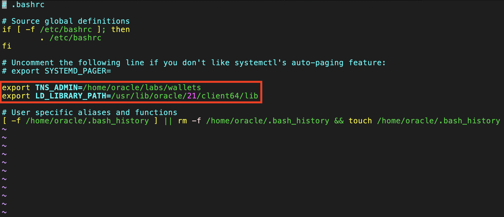   

1. 念のため**SQL*Plus**でログインできることを確認します。

   ```
   sqlplus admin/<ADMINユーザのパスワード>@<ADBの接続サービス>
   ```

   

1. データ生成用のスクリプトを編集・実行します。 viで**1install.sh**を開き、内容を確認、お使いの環境に応じて編集ください。

   ```
   vi 1install.sh
   ```
   
   **【1install.shの内容】**

   ```
      #!/bin/sh
      ./swingbench/bin/oewizard 
         -cf ~/labs/wallets/Wallet_atp01.zip \
         -cs atp01_tp \
         -ts DATA \
         -dbap Welcome12345# \
         -dba admin \
         -u soe \
         -p Welcome12345# \
         -async_off \
         -scale 5 \
         -hashpart \
         -create \
         -cl \
         -v
   ```

1. ファイルに**実行権限を付与**します。

   ```
   chmod +x 1install.sh
   ```

   

1. スクリプトを**実行**し、データを生成します。

   ```
   nohup ./1install.sh &
   ```

   

   >**NOTE**
   >
   > ADBインスタンス内にSOEスキーマが作成され、その中にSwingbenchで利用するオブジェクト、データが作成されます。
     データ増幅処理の処理時間短縮化のために、出来ればECPU数は多めに設定ください。
     またデータ生成には多少なり時間を要するため、nohupコマンドを利用します。こうすることで、仮想マシンとのネットワーク通信が万が一切断されたとしても、仮想マシン上で本スクリプトの実行を継続することが可能です。 

1. このままでは、実行状況が確認できないため、下記のコマンドで、**実行状況の確認**します。

   ```
   tail -f nohup.out
   ```

   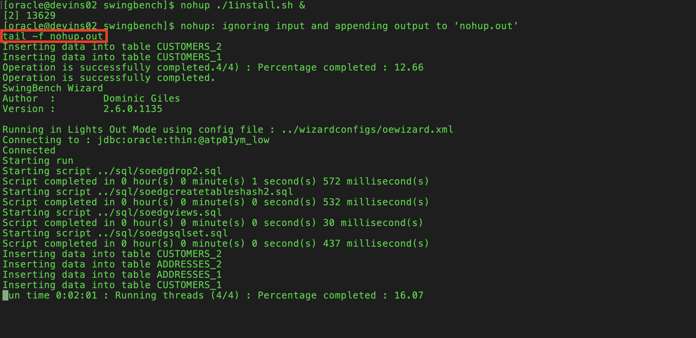


1. 以下のように**Schema Created**が表示されたらデータ増幅の処理は完了です。**CTRL+C** で nohupコマンドを終了してください。

   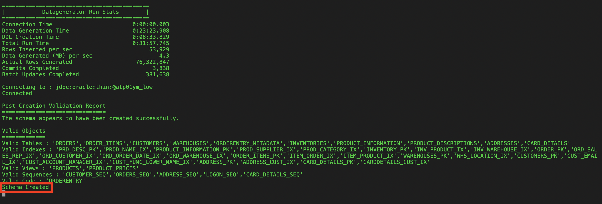

<a id="anchor1-2"></a>

## 生成されたスキーマ・オブジェクトの確認

次にセットアップしたデータに問題がないか確認します。

1. Terminalを起動し、仮想マシンに**opcユーザ**で**ログイン**後、**oracleユーザ**に切り替えます。

   ```
   ssh -i <秘密鍵のパス> opc@<仮想マシンのIPアドレス>
   ```

   ```
   sudo su - oracle
   ```

   


1. **作業用ディレクトリ**に移動します。

   ```
   cd /home/oracle/labs/swingbench
   ```

   

1. viで**2-1check.sh**を開き、内容を確認、必要に応じて編集ください。

   ```
   vi 2-1check.sh
   ```

   **【2-1check.shの内容】**

   ```
   #!/bin/sh
   ./swingbench/bin/sbutil -soe -cf ~/labs/wallets/Wallet_atp01.zip \
      -cs atp01_tp -u soe -p Welcome12345# \
      -val
   ./swingbench/bin/sbutil -soe -cf ~/labs/wallets/Wallet_atp01.zip \
      -cs atp01_medium -u soe -p Welcome12345# \ 
      -stats
   ./swingbench/bin/sbutil -soe -cf ~/labs/wallets/Wallet_atp01.zip \ 
      -cs atp01_medium -u soe -p Welcome12345# \
      -tables
   ```

1. ファイルに**実行権限**を付与します。

   ```
   chmod +x 2-1check.sh
   ```
   
   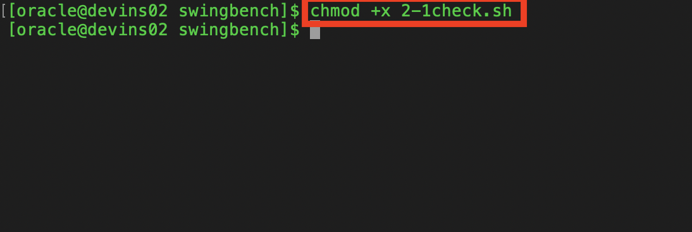

1. スクリプトを**実行**し、実行結果を確認します。（統計情報の再取得も実施しているため数分程度かかります。）

   ```
   ./2-1check.sh
   ```

   以下のように表示されればOKです。

   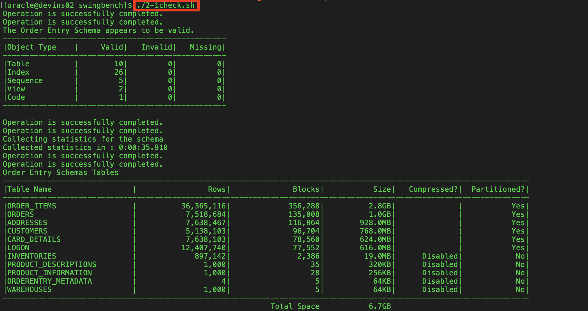

<br>

<a id="anchor2"></a>

# 2. Swingbenchを実行し、ECPUをスケールアップしてみよう

それではベンチマークツールを動かしてみましょう。**ECPUをオンラインでスケールアップできること**、スケールアップの前後で**TPS(秒間のトランザクション数)を比較**し、**TPSが向上**することを確認しましょう。

<a id="anchor2-1"></a>

## ECPU=2 (自動スケーリング無効)

1. ATPの詳細画面にて、**スケール・アップ/ダウン**を選択してください。ECPU数を**2**で自動スケーリングは**無効**であることを確認して下さい。

   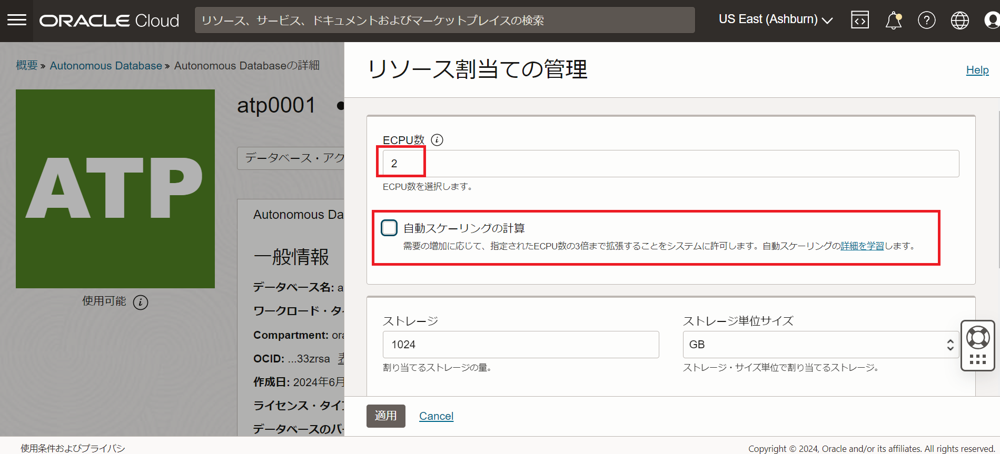

1. Terminalを起動し、仮想マシンに**opcユーザ**で**ログイン**後、**oracleユーザ**に切り替えます。

   ```
   ssh -i <秘密鍵のパス> opc@<仮想マシンのIPアドレス>
   ```

   ```
   sudo su - oracle
   ```

   


1. **作業用ディレクトリ**に移動します。

   ```
   cd /home/oracle/labs/swingbench
   ```

   

1. viで**3execute.sh**を開き、使用中の環境に合わせて、内容を確認・編集してください。

   ```
   vi 3execute.sh
   ```

   【3execute.shの内容 】

   ```
   #!/bin/sh
   ./swingbench/bin/charbench -c ~/labs/swingbench/swingbench/configs/SOE_Server_Side_V2.xml \
            -cf ~/labs/wallets/Wallet_atp01.zip \
            -cs atp01_tp -u soe -p Welcome12345# \
            -v users,tpm,tps,vresp \
            -intermin 0 \
            -intermax 0 \
            -min 0 \
            -max 0 \
            -uc 64 \
            -di SQ,WQ,WA
   ```

1. ファイルに実行権限を付与し、実行します。

   ```
   chmod +x 3execute.sh
   ./3execute.sh
   ```

   以下のように表示されればOKです。

   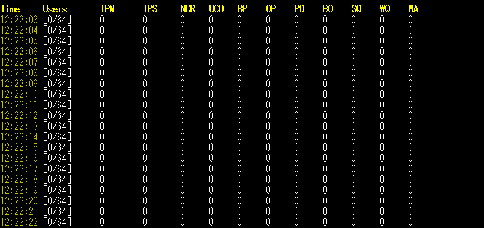

   左から4列目の**TPS(秒間のトランザクション数)**の数字に着目ください。

   安定するまで1分ほど待ちましょう。

1. 1分程度待って安定した時点での値を、この後の比較のためにメモしておきましょう。

   本環境でECPU**2**の自動スケーリング**無効**の条件では、TPSは**約500前後**ですね。

   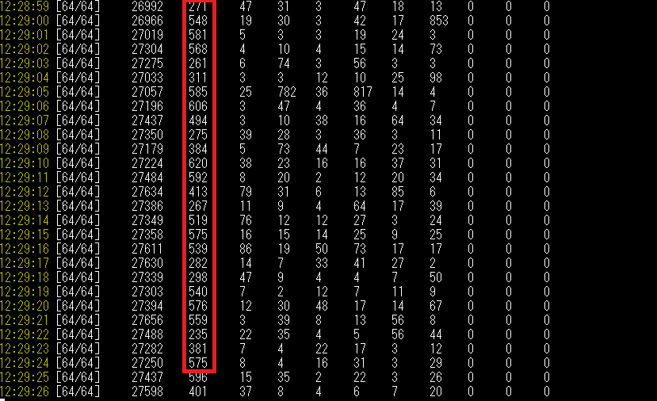

<a id="anchor2-2"></a>

## ECPU=16 (自動スケーリング無効)

1. ここで、ATPの詳細画面にて、**スケール・アップ/ダウン**を選択してください。ECPU数に**16**を入力し、自動スケーリングは**無効**のまま**更新**をクリックしてください。

   

1. Terminalに戻り、TPSを観察しているとECPU2からECPU16へECPUが増えてもオンラインで**アプリケーションにはエラーが発生しないこと**、ECPUにが増えた結果**TPSも向上していること**が確認できます

   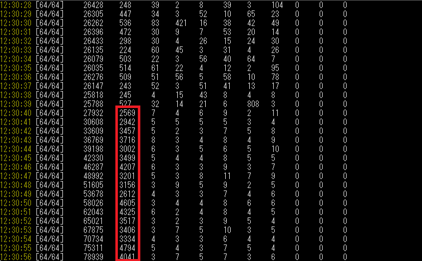

1. 1分程度待って安定した時点での値を、比較のためにメモしておきましょう。

   本環境でECPU**16**の自動スケーリング**無効**の条件では、TPSは**約3500前後**ですね。

   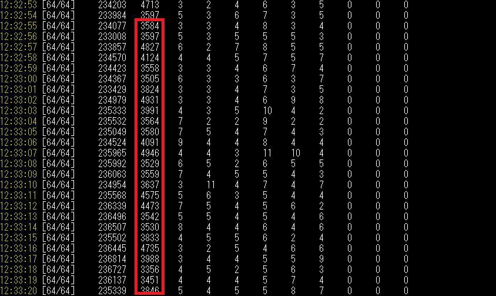

<a id="anchor2-3"></a>

## ECPU=16 (自動スケーリング有効)

1. ここで、ATPの詳細画面にて、**スケール・アップ/ダウン**を選択してください。ECPU数に**16**を入力し、自動スケーリングは**有効**にして**更新**をクリックしてください。

   自動スケーリングを有効にすると、データベースで、CPUの現在のベース数の3倍までいつでも使用できるようになります。

   

1. Terminalに戻り、TPSを観察していると自動スケーリングが有効になった結果、**TPSが向上していること**が確認できます

   

1. 1分程度待って安定した時点での値を、比較のためにメモしておきましょう。

   本環境でECPU**16**では、TPSは**約6400前後**ですね。

   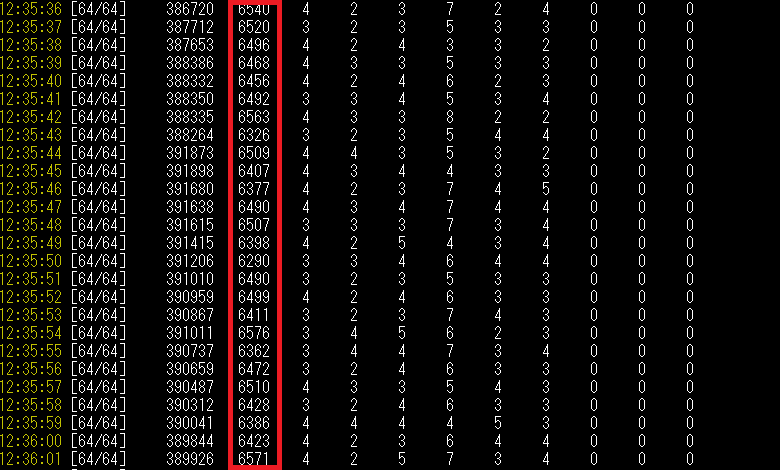

1. Swingbenchを終了するには、Enterキーを押して下さい。

Swingbenchが動いたままECPUを**オンラインでスケール**できること、そして、**ECPU数や自動スケーリング設定に応じてTPSが向上**していることが確認できました。

以上で、この章の作業は終了です。


<br>

[ページトップへ戻る](#anchor0)