<a id="anchor0"></a>
# はじめに
この記事は["Graph Studio: Find Circular Payment Chains with Graph Queries in Autonomous Database"](https://apexapps.oracle.com/pls/apex/r/dbpm/livelabs/view-workshop?wid=770&clear=RR,180&session=109952730335961)
の記事と補足事項を日本語で解説した内容になります。

# Graph Studioとは
Autonomous Databaseには、2021年の5月ごろより、プロパティグラフを取り扱うことのできるGraph Studioが標準機能として搭載されました。

Graph Studioでは下記のような機能を利用可能です。

- データベースに存在するグラフをメモリに読み込んで分析
- リレーショナル表からグラフのモデルを作成するための自動変換
- SQLのようにクエリができるPGQLでの分析アルゴリズム
- グラフの可視化機能

上記のような機能がGraph Studioには搭載されているため、簡単にクラウドのUI上で完結する形でプロパティグラフの作成や分析が可能になっています。

# この記事で確認できること

- CSVファイルのデータをAutonomous Databaseにアップロードする方法(SQL Developer Web (Database Actions SQL))
- Graph Studioへの接続方法
- PGQLクエリ(グラフクエリ言語)を用いたグラフ作成方法
- PGQLクエリを使ったノートブック上でグラフをクエリ&可視化方法

具体的な題材として、今回は金融トランザクションから、循環的な資金の流れを見つける分析を行います。

リレーショナル表からプロパティグラフへのデータの変換では、変換をほぼ自動で行ってくれる Graph Studio の機能を活用します。

**目次 :**
  + [1.Graph Studio用のユーザーを作成](#anchor1)
  + [2.データの準備(取込み)](#anchor2)
  + [3.データの準備(整形)](#anchor3)
  + [4.Graph Studioにてリレーショナル表からグラフを作成](#anchor4)
  + [5.ノートブック上のクエリ](#anchor5)

**前提条件 :**
 +  Oracle Cloudのアカウント
 + プロビジョニングしたAutonomous Database

<br>
上記環境が必要になります。

Always Freeの範囲内でも十分に確認できる題材となっているので、気軽にお試しください。

**所要時間 :** 約30分

<BR>

<a id="anchor1"></a>

# 1. Graph Studio用のユーザーを作成

1. OCIコンソール上でAutonomous Databaseのインスタンス詳細画面を開く

    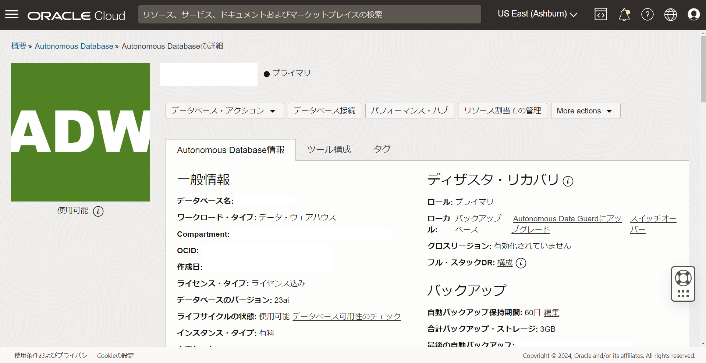

1. ツールタブに移動して、データベースアクションを開く

    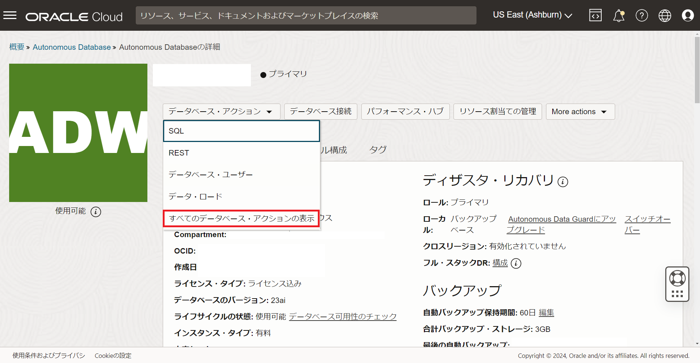


1. 管理より、データベースユーザー作成画面へ移動

    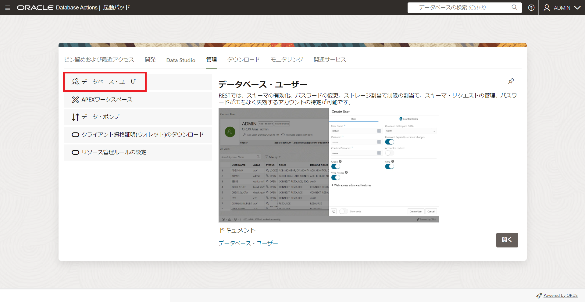

1. ユーザーの作成ボタンをクリック

    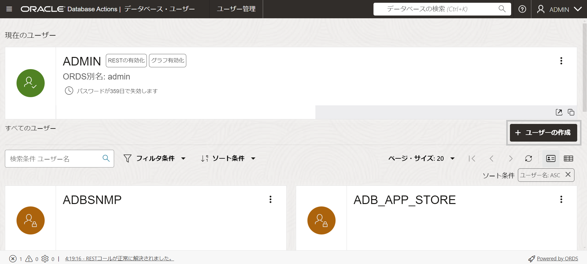

1. グラフ用のユーザを作成

    以下の様に設定します。
    - ユーザー設定
        - ユーザー名 - GRAPHUSER
        - パスワード - 任意（本チュートリアルでは、Welcome12345#とします）
        - 表領域 -  UNLIMITED
        - グラフ - 有効化
        - Webアクセス - 有効化

    - 権限
        - DWROLE - 付与済み、デフォルト

    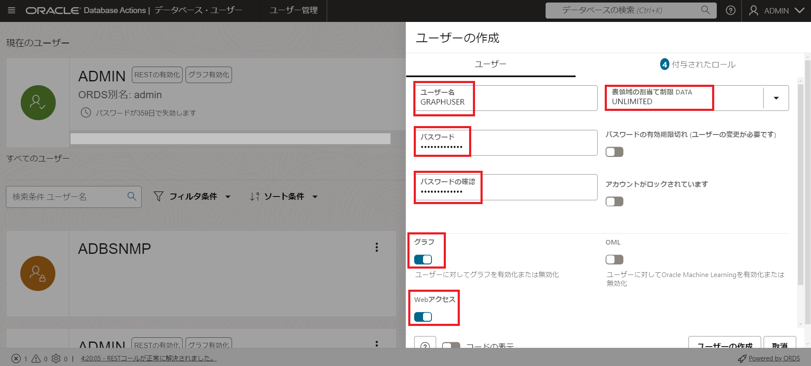

    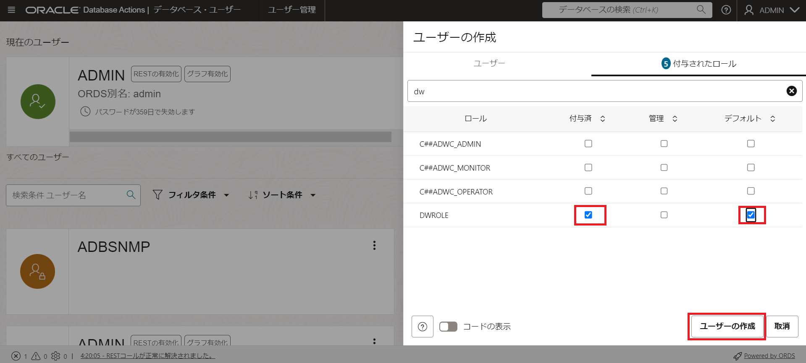

1. 一旦Data Actionsからサインアウトします。

    

1. 作成したGRAPHUSERとしてサインインします。

    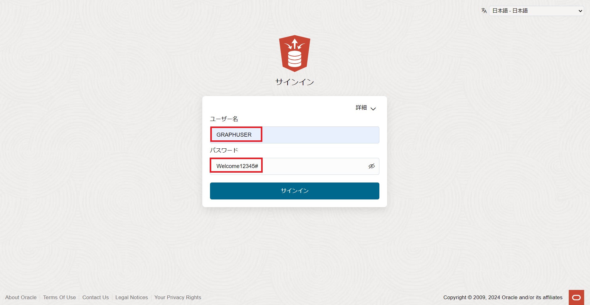

これで準備完了です。

<BR>

<a id="anchor2"></a>

# 2. データの準備(取込み)

サンプルデータをダウンロード後は、データベースアクションの画面から、csvファイルをデータベースに取り込んでいきます。

1. 必要データのダウンロード

    今回利用するワークショップ用のデータを[こちら](https://github.com/r-deguchi/random-acct-txn)から**random-acct-txn-data.zip**というファイルをダウンロードします。

    ダウンロードができたら、unzipしておきましょう。unzipすると下記のようなデータが確認可能となっており、mac OS用のデータも入っています。
    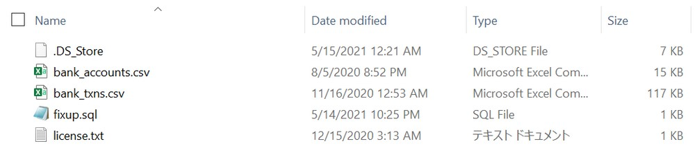

    これで、今回使用するデータのダウンロードが完了しました。
    
    入手したcsvファイルをデータベースアクション画面からデータベースへとロードしていきます。

1. データベースアクションのトップから、データロードの機能を選択

    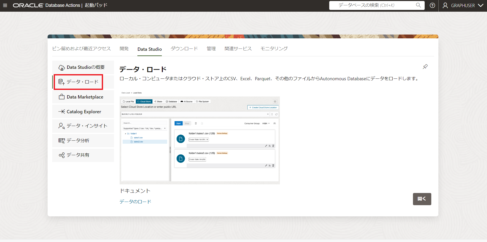

1. データのロードを選択し、次へ
    
    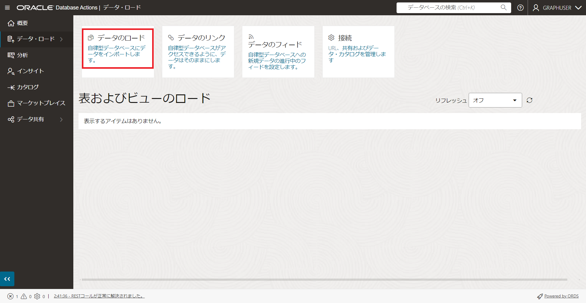

1. ファイルのアップロード
    ファイルの選択画面になるので、今回使用する二つのcsvデータを選択します。
    
    今回は以下の二つのファイルを同時にアップロードします。
    - bank_accounts.csv 
    - bank_txns.csv 

    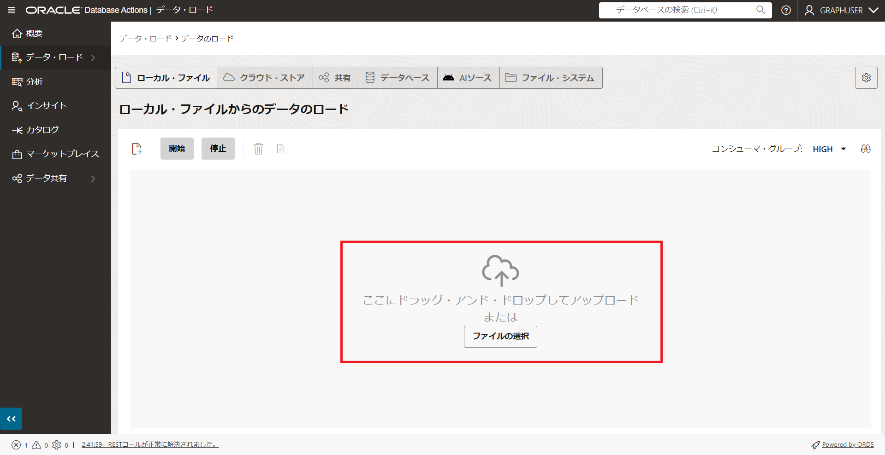
    
1. 開始ボタンを押して、データロードを実行

    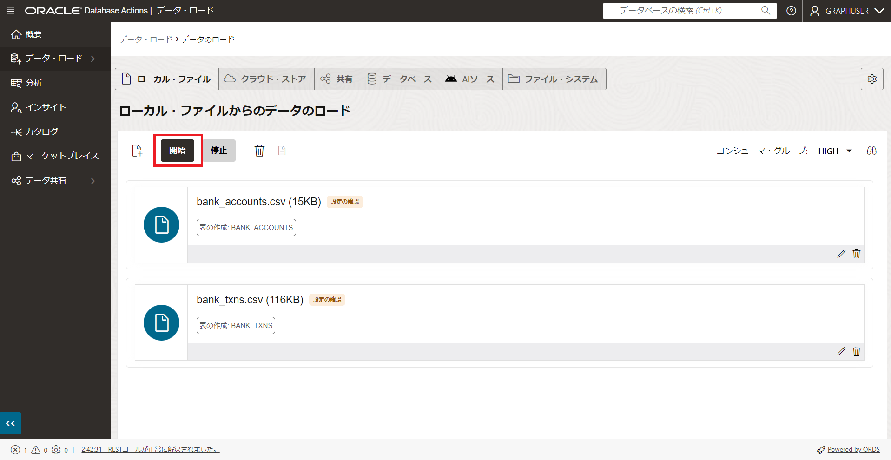

1. データが正常にロードされたことが確認後、右下の完了ボタンを押しデータのロードを終了

    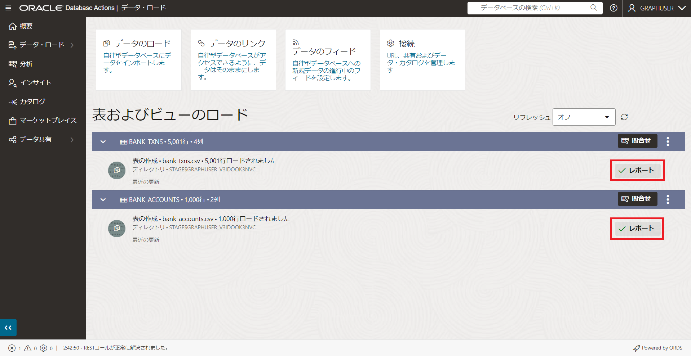


<a id="anchor3"></a>

# 3. データの準備(整形)
csvのデータをデータベースにアップロードすることが完了したので、次はそのデータに対して主キーや外部参照制約などを追加していきます。この操作もデータベースアクション上で実行可能です。

1. SQL問い合わせ画面を開く

    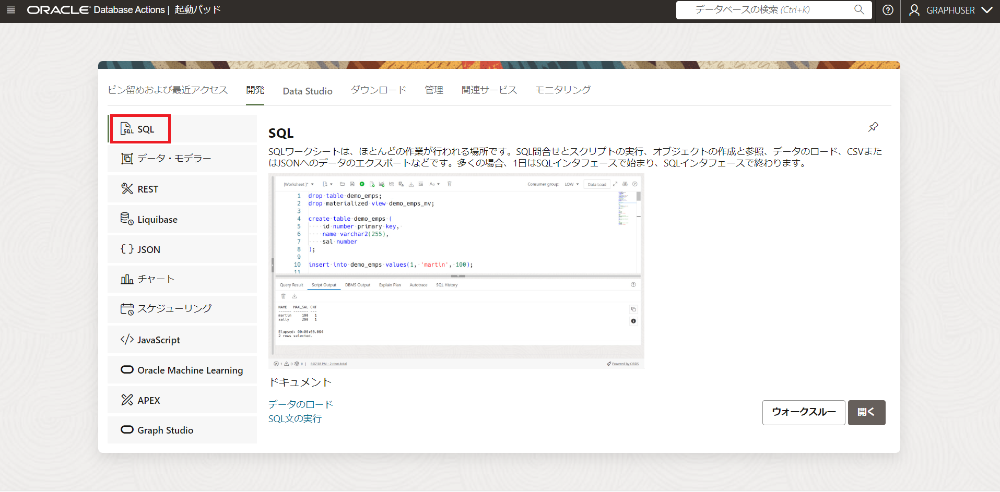


1. fixup.sqlファイルの内容を実行

    ダウンロードしたcsvファイルと共に、fixup.sqlというファイルが入っているので、そちらをSQLワークシート画面にアップロードするか、下記のクエリを実行してください。

    ```sql
    alter table bank_accounts add primary key (acct_id);

    alter table bank_txns add txn_id number;
    update bank_txns set txn_id = rownum;
    commit;

    alter table bank_txns add primary key (txn_id);
    alter table bank_txns modify from_acct_id references bank_accounts (acct_id);
    alter table bank_txns modify to_acct_id references bank_accounts (acct_id);

    desc bank_txns;

    select * from USER_CONS_COLUMNS where table_name in ('BANK_ACCOUNTS', 'BANK_TXNS');
    ```

1. 実行結果の確認

    下記のような実行結果になっていればクエリは成功しています。

    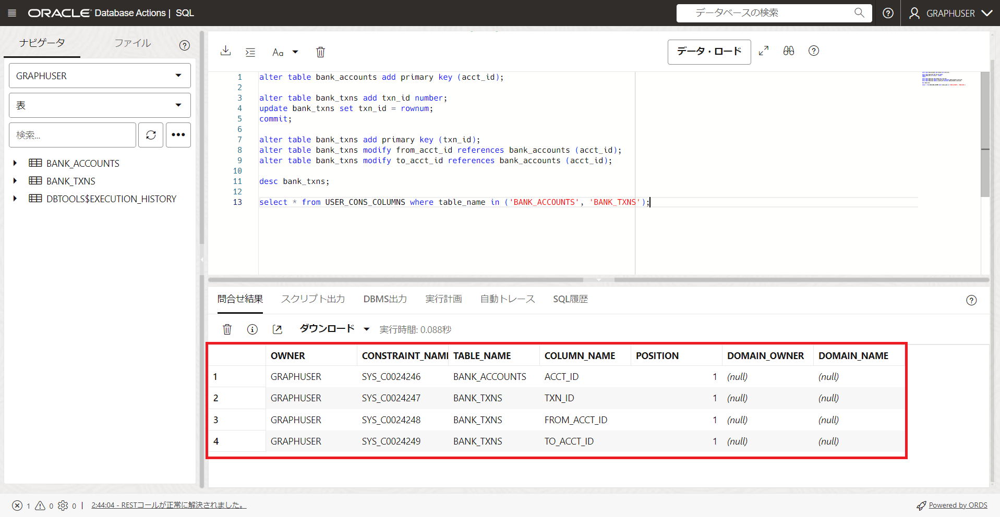

BANK_ACCOUNTSと、BANK_TXNSという二つのリレーショナル表から、次のステップではGraph Studioにてグラフを作成していきます。

<BR>

<a id="anchor4"></a>

# 4. Graph Studioにてリレーショナル表からグラフを作成

ロードした表を基に、グラフを作成していきます。

1. Autonomous Databaseの詳細から、ツールタブを開き、Graph Studioを開きます。

    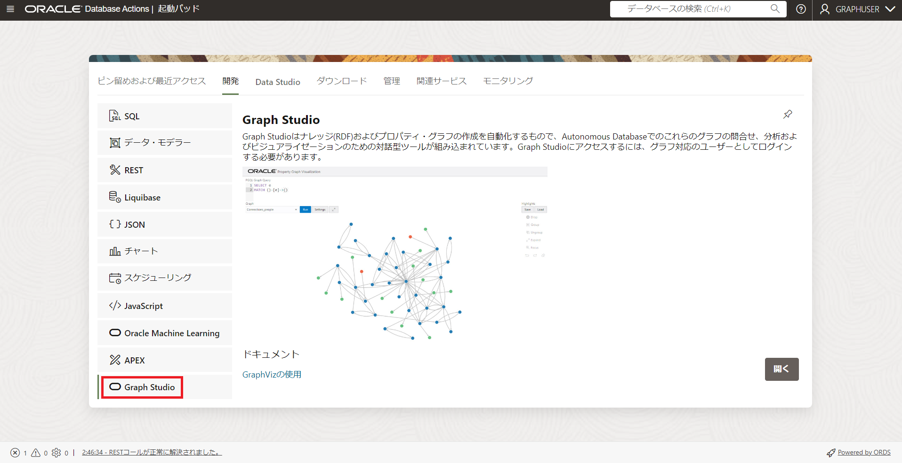

1. ADMINではGraph Studioには入れないので、作成したGraph用のユーザーでサインインをしましょう。

    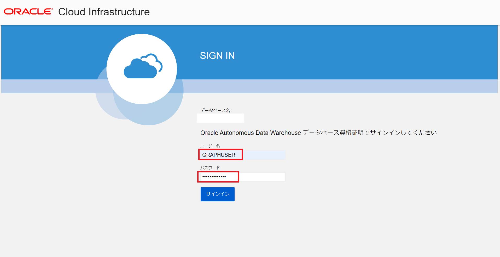

1. 左メニューの、上から2つ目のグラフアイコンをクリックして、モデリングをスタートします。

    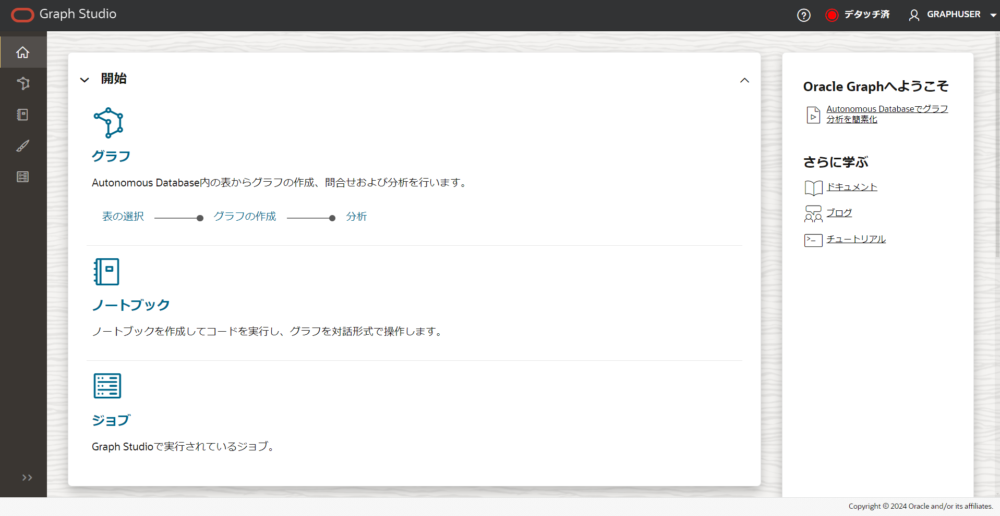   

1. グラフの作成をクリックします。

    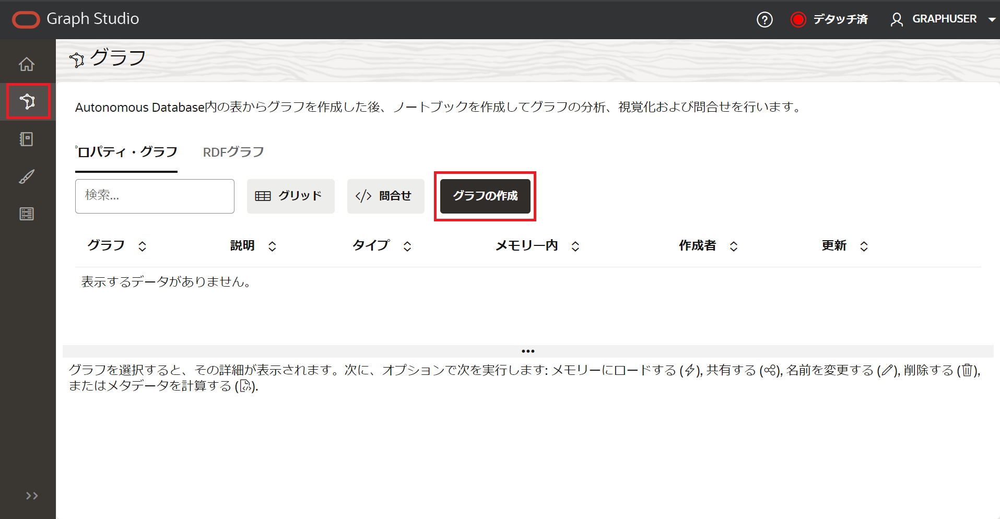

1. グラフ名を入力し、次へをクリック
    - グラフ名 - BANK_GRAPH

    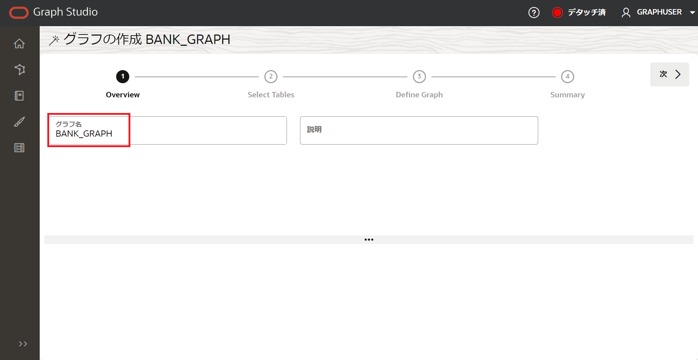

1. リレーショナル表一覧の確認
モデリングのページに移動すると、参照可能なデータベース上のリレーショナル表一覧が確認できます。今回のデータでは、BANK_ACCOUNTS と BANK_TXNS の表を使用するので選択して、真ん中の→アイコンを押して、右側の選択画面にデータを移動します。

    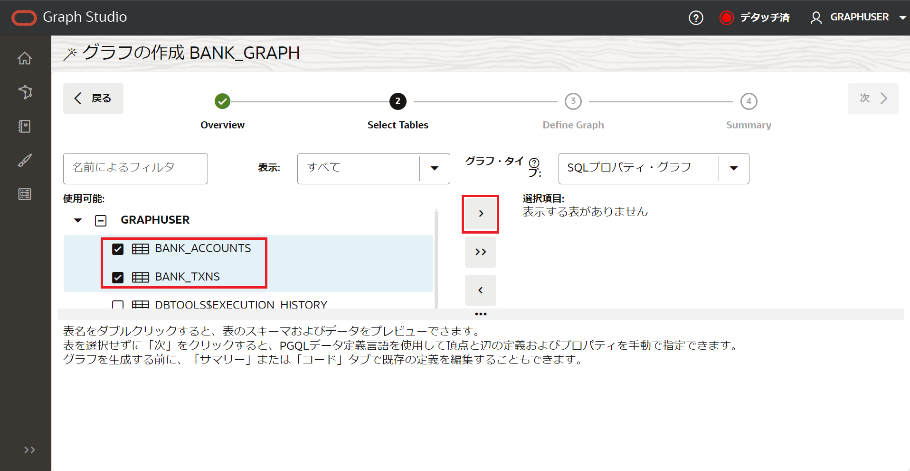

    準備ができたら、次ボタンを押して、次へ進みます。

    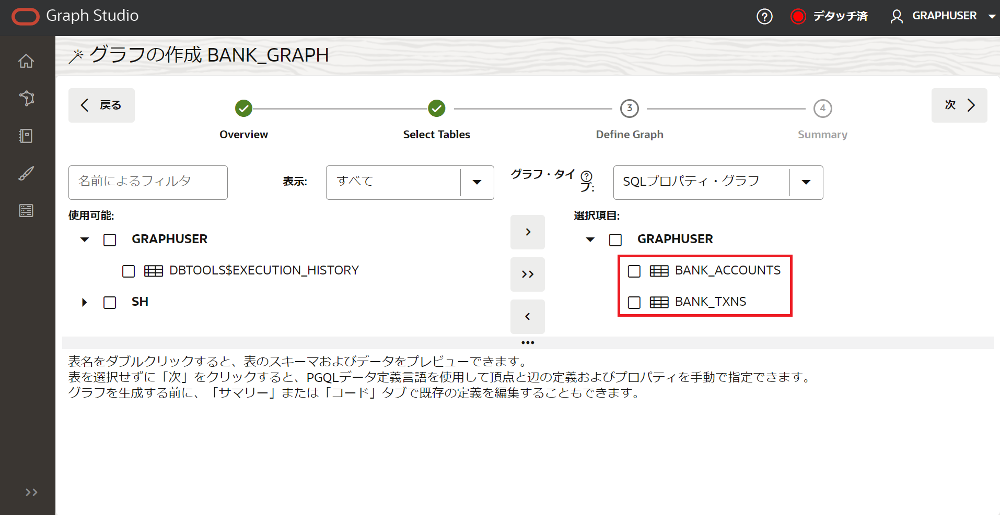


1. 選択した表のグラフへのマッピングを確認
    画面上半分の左側には元のリレーショナル表、右側にはマッピング予定のグラフが確認できます。Vertexはグラフの頂点で、Edgeはグラフの辺を表します。

    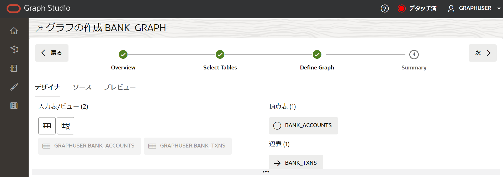

1. BANK_ACCOUNTSをクリックし、頂点ラベルをACCOUNTSに変更します。変更したらチェックマークを押して保存します。
    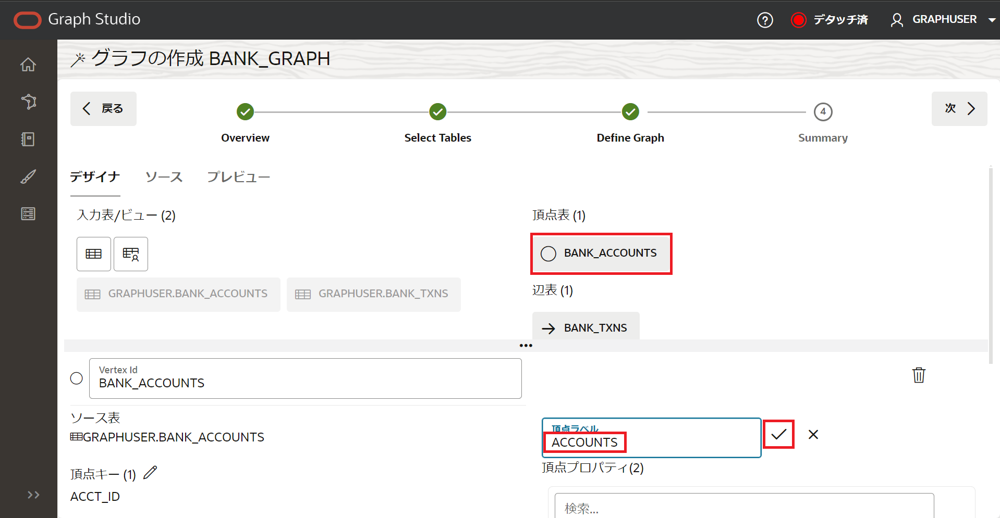

1. BANK_TXNSをクリックし、頂点ラベルをTRANSFERSに変更します。変更したらチェックマークを押して保存します。両方の頂点ラベルを変更したら、次ボタンを押します。

    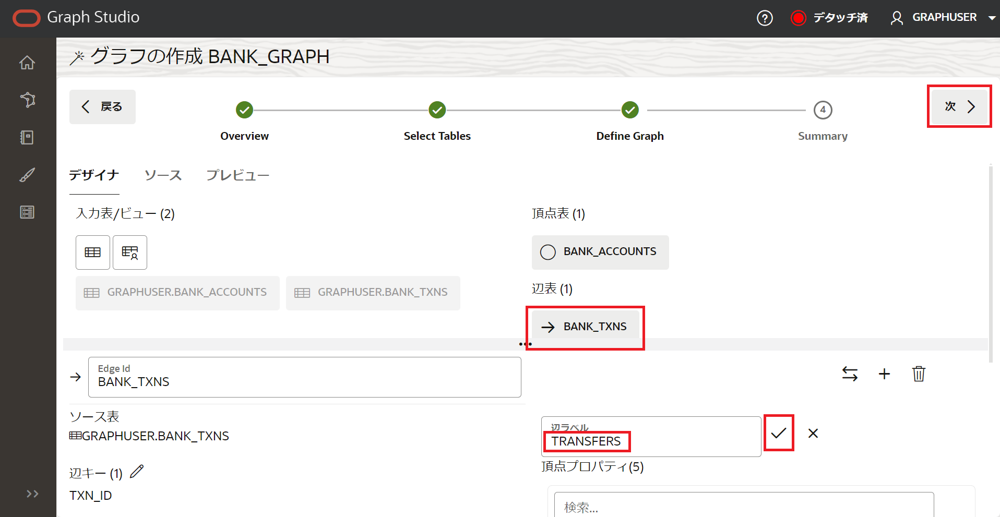

1. グラフの作成をクリックし、グラフを作成します。

    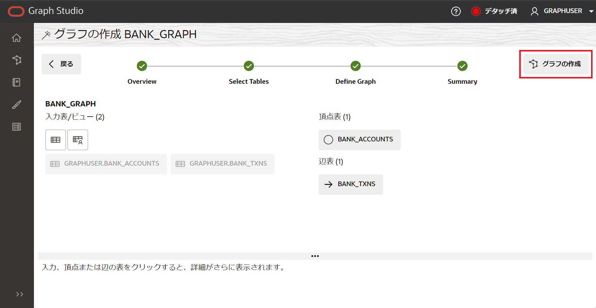

1. メモリーにロードはオンにしたままグラフの作成をクリックします。

    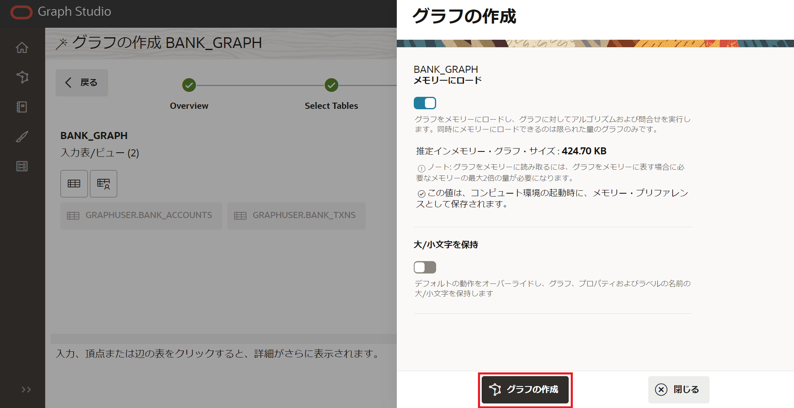

<a id="anchor5"></a>
# 5. ノートブック上でのクエリ

本チュートリアルでは、違法行為に使用された可能性のある銀行口座をグラフの技術を使用して特定してみたいと思います。

1. ノートブックの作成・インポート
    
    本チュートリアルでは、既に作成済みのノートブックを使用していきます。[こちら](../adb-data/BANK_GRAPH.dsnb)から**BANK_GRAPH.dsnb**というノートブックをダウンロードします。

    ノートブック画面へは左側のメニューバーから入ることができます。画面右上のインポートをクリックします。

    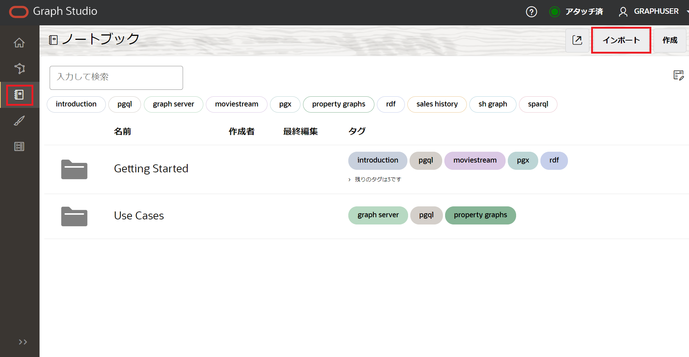

    ダウンロードしたノートブックをドラッグアンドドロップし、インポートします。

    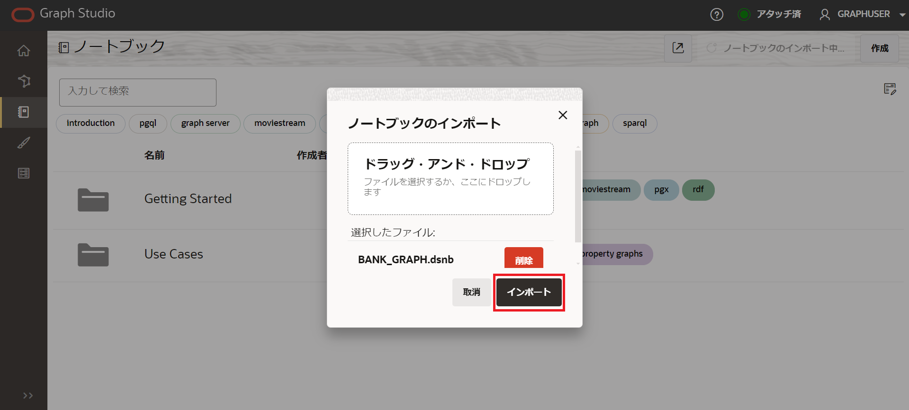

    これで、ノートブックのインポートが出来ました。
    
 
1. 最初に、グラフをインメモリ・グラフサーバにロードします。
以下のクエリを実行し、組み込みのセッションオブジェクトを使ってデータベースからグラフをメモリに読み込み、読み込まれたグラフを扱うPgXGraphオブジェクトを生成します。

    三角形の実行ボタンをクリックし、クエリを実行します。

    ```sql
    %python-pgx
    GRAPH_NAME="BANK_GRAPH"
    # try getting the graph from the in-memory graph server
    graph = session.get_graph(GRAPH_NAME)
    # if it does not exist read it into memory
    if (graph == None) :
        session.read_graph_by_name(GRAPH_NAME, "pg_view")
        print("Graph "+ GRAPH_NAME + " successfully loaded")
        graph = session.get_graph(GRAPH_NAME)
    else :
        print("Graph '"+ GRAPH_NAME + "' already loaded")
    ```

1. 先ずは、転送数が多い銀行口座の上位10口座を探してみます。
    以下のクエリを実行します。

        %pgql-pgx
        /* List 10 accounts with the most number of transactions (that is, incoming + outgoing edges) */
        SELECT a.acct_id, (in_degree(a) + out_degree(a)) AS num_transactions
        FROM MATCH (a) ON bank_graph
        ORDER BY num_transactions DESC
        LIMIT 10

    口座934と387がリストの上位にあることが分かります。

    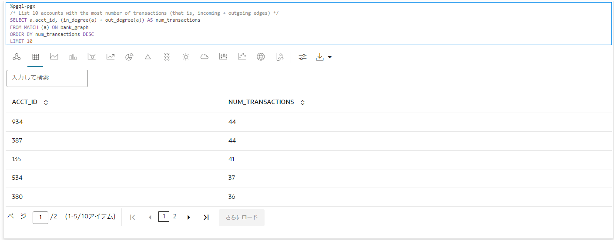

1. それでは転送数の多い、口座934を起点とする循環転送があるかどうかを確認してみます。
    以下のクエリを実行します。

        ```sql
        %pgql-pgx
        /* Check if there are any circular payment chains of length 4 from acct 934 */
        SELECT v,e,v2
        FROM MATCH ALL (a)-[:TRANSFERS]->{4}(b) ON bank_graph ONE ROW PER STEP (v,e,v2)
        WHERE a.acct_id=934 AND id(a) = id(b)
        LIMIT 100
        ```
    934で始まり、934で終わる長さ3ホップのサークルがあることが分かりました。
    
    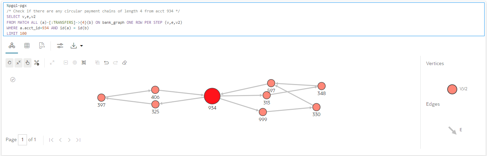

1. 上記のクエリを変更して、長さを5ホップにした場合の循環転送の数を確認してみます。
    資金が循環して動くときは詐欺の可能性があるので、循環転送の数が多い場合は違法行為をしている口座である場合が高くなります。
    以下のクエリを実行します。

        %pgql-pgx
        /* Check if there are any circular payment chains of length 5 from acct 934 */
        SELECT v,e,v2
        FROM MATCH ALL (a)-[:TRANSFERS]->{5}(b) ON bank_graph ONE ROW PER STEP (v,e,v2)
        WHERE a.acct_id=934 AND id(a) = id(b)
        LIMIT 100

    934で始まり、934で終わる循環転送の数が多いので、この口座が疑わしいということになります。

    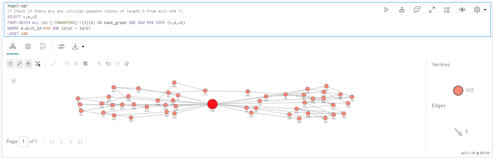

1. ShortestPathHopDist() という分析アルゴリズムを使用し、アカウント934とアカウント387に近接しているアカウントを調べます。ShortestPathHopDist()は、934、387とグラフ内の他のすべてのアカウント間の最小ホップ数を計算します。ホップ数が少ないほど、アカウントが違法行為に関与している可能性が高くなります。
    ```sql
    %python-pgx
    #By default this is property refers to account #934
    vertex = graph.get_vertex("BANK_ACCOUNTS(934)")
    analyst.shortest_path_hop_distance(graph, vertex, "hop_dist_from_934")

    %python-pgx
    vertex = graph.get_vertex("BANK_ACCOUNTS(387)")
    analyst.shortest_path_hop_distance(graph, vertex, "hop_dist_from_387")
    ```

1. 934と387から2ホップ以下で繋がっている口座のトランザクション数を見てみます。
    ```sql
        %pgql-pgx
        SELECT a.acct_id, a.hop_dist_from_934 AS hops, in_degree(a) + out_degree(a) AS num_transactions FROM MATCH (a) ON bank_graph
        WHERE hops > 0 AND hops <=2 
        ORDER BY num_transactions DESC

        %pgql-pgx
        SELECT a.acct_id, a.hop_dist_from_387 AS hops, in_degree(a) + out_degree(a) AS num_transactions FROM MATCH (a) ON bank_graph
        WHERE hops > 0 AND hops <=2 
        ORDER BY num_transactions DESC
    ```

    934と近い口座として135、そして387と近い口座として534が挙げられます。これらも違法行為に関与している可能性があります。

    


1. 循環転送の数等を調べる以外にも、DeepWalkというグラフ機械学習アルゴリズムを使って違法行為に使用された可能性のある銀行口座を探すことが出来ます。
以下のクエリを実行します。

        %python-pgx

        model = analyst.deepwalk_builder(
        learning_rate=0.002,
        num_epochs=30,
        seed=1,
        )

2. 機械学習アルゴリズムなので、モデルをトレーニングする必要があります。以下のクエリを実行します。

        %python-pgx
        import time
        start_ts = time.time()
        model.fit(graph)
        print("DeepWalk model training completed in {:.4f} seconds".format(time.time() - start_ts))

1. 先ずは、口座934に類似した口座を探してみます。

        %python-pgx
        similars_934 = model.compute_similars("BANK_ACCOUNTS(934)", 10)
        print("List of nodes most similar to node 934.")
        similars_934.print()
    
    口座387の他に、怪しいと思われている口座135、534が上位に表示されています。

    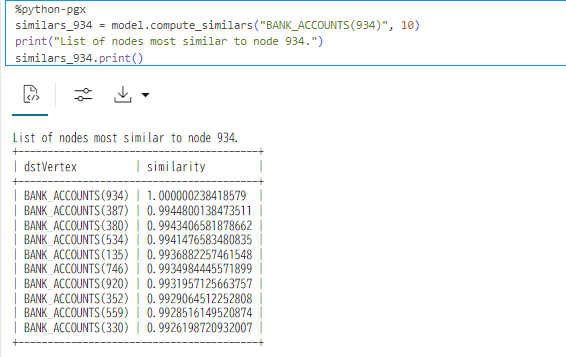

1. 次に、口座387に類似した口座を探してみます。

        %python-pgx
        similars_387 = model.compute_similars("BANK_ACCOUNTS(387)", 10)
        print("List of nodes most similar to node 387.")
        similars_387.print()
    
    口座934の他に、口座135、534が今回も上位に表示されました。
    この結果から、口座934、387、135、534が違法行為に関与している可能性が高いと言えます。

    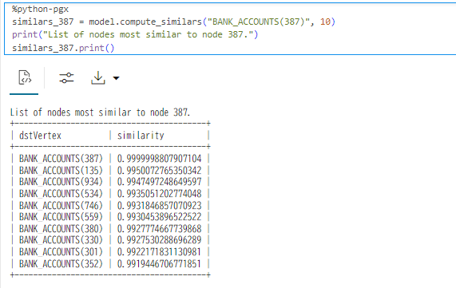

    グラフのアルゴリズムを活用し、違法行為に加担している可能性の高い口座を見つける事が出来ました。

# まとめ
今回の記事を実践いただき、Graph Studioの利用の始め方から簡単なクエリの方法までご理解いただけたかと思います。
グラフのアルゴリズムを活用することで、今までのリレーショナル表では分析が大変だったようなつながりも簡単にクエリが可能になっています。

今回の例は口座の取引について分析しましたが、サプライチェーン分析や人物関係等、他にもグラフを活用できる場面は多くあります。この記事の手順をご理解いただければ、すでに皆さんのリレーショナル表にある他のデータもグラフで分析することも可能になっているので、ぜひご活用ください。
<BR>

# 参考資料

+ Oracle LiveLabs
["Graph Studio: Find Circular Payment Chains with Graph Queries in Autonomous Database"](https://apexapps.oracle.com/pls/apex/r/dbpm/livelabs/view-workshop?wid=770&clear=RR,180&session=109952730335961)


<BR>

[ページトップへ戻る](#anchor0)