<a id="anchor0"></a>

# はじめに
**Oracle Cloud Infrastructure (OCI) GoldenGate**はフルマネージド型のリアルタイムデータレプリケーションサービスとなっています。
OCI GoldenGateサービスは、構成、ワークロード・スケーリング、パッチ適用などの多くの機能を自動化しており、従量課金制で利用することが可能です。そのため時間や場所を選ばずに、低コストでデータの連携、分析ができるようになります。

この章では、OCI GoldenGateの作成とBaseDBからADBへのデータ連携の設定について紹介します。
    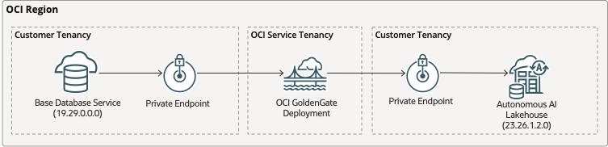

**目次 :**
  + [1.ソース・データベースの設定](#anchor1)
  + [2.ターゲット・データベースの設定](#anchor2)
  + [3.OCI GGデプロイメントの作成](#anchor3)
  + [4.接続の作成](#anchor4)
  + [5.Extractの作成](#anchor5)
  + [6.初期データのロード](#anchor6)
  + [7.Replicatの作成](#anchor7)
  + [8.データ連携の確認](#anchor8)


**前提条件 :**
本チュートリアルではBaseDB、ADBともにデータベースの作成が完了しており、初期データとしてHRスキーマがBaseDBに作成されていることを前提にしています。
各データベースの作成方法や初期データの作成方法は下記手順をご確認ください。

 + BaseDBの作成については、[「101: Oracle Cloud で Oracle Database を使おう(BaseDB)」](../../basedb/dbcs101-create-db/) をご参照ください。
 + データ連携用のサンプルデータはHRスキーマを使用しています。BaseDBでのHRスキーマ作成方法は、[「301: 移行元となるデータベースを作成しよう」](../adb301-create-source-db/) をご参照ください。
 + ADBの作成については、[「101:ADBインスタンスを作成してみよう」](../adb101-provisioning/) をご参照ください。

**所要時間 :** 約60分

<BR>

<a id="anchor1"></a>

# 1. ソース・データベースの設定
ソース・データベースであるBaseDBに対して下記の設定を行います。

1. GoldenGate管理者ユーザの作成

    ソース・データベースにGG管理ユーザを作成し、必要な権限を付与します。このスキーマにGG関連オブジェクトが作成されます。
    SQL*Plusを起動して以下を実行してください。PDBで実行します。

    ```sql
    -- ユーザを作成(PDBに作成します)
    create user ggadmin identified by Welcome#1Welcome#1 default tablespace users temporary tablespace temp quota unlimited on users;
    -- dba権限の付与
    grant dba to ggadmin; 
    -- GG実行権限の付与
    exec dbms_goldengate_auth.grant_admin_privilege('ggadmin');
    ```
    >**Note**
    >
    >DBAロールの付与は、すべてのユーザーに必須なわけではありません。権限は、ユーザーがデータベースで実行する必要がある操作に応じて付与する必要があります。たとえば、トランザクションを挿入、更新および削除するDML操作権限をggadminに付与するには、GRANT ANY INSERT/UPDATE/DELETE権限を使用し、さらに、DML操作の一部として表および索引を操作することをユーザーに許可するには、GRANT CREATE/DROP/ALTER ANY TABLE/INDEX権限を使用します。

1. アーカイブ・ログ・モードの確認

    GGのソース・データベースはアーカイブ・ログ・モードで運用されている必要があります。下記コマンドでアーカイブ・ログ・モードで運用されているか確認することができます。CDB$ROOTで実行します。

    ARCHIVELOGが有効になっているか確認します。

    ```sql
    ARCHIVE LOG LIST
    ```

    返される出力例：

    ```sql
    Database log mode	       Archive Mode
    Automatic archival	       Enabled
    Archive destination	       USE_DB_RECOVERY_FILE_DEST
    Oldest online log sequence     16501
    Next log sequence to archive   16503
    Current log sequence	       16503
    ```

    無効(Disabled)の場合、以下を実行して有効にします。

    ```sql
    SHUTDOWN IMMEDIATE
    STARTUP MOUNT
    ALTER DATABASE archivelog;
    ALTER DATABASE open;
    ```

1. ENABLE_GOLDENGATE_REPLICATIONパラメータの設定
    ENABLE_GOLDENGATE_REPLICATIONパラメータを設定して、GGが利用するデータベースの機能を有効化します。CDB$ROOTで実行します。

    ```sql
    -- ENABLE_GOLDENGATE_REPLICATIONパラメータの確認
    show parameter enable_goldengate_replication
    -- ENABLE_GOLDENGATE_REPLICATIONパラメータの有効化
    alter system set enable_goldengate_replication=true;
    ```

1. 最小のデータベース・レベルのサプリメンタル・ロギングの設定

    GGに必要な情報がREDOログに記録されるように、ソース・データベースに対して最小サプリメンタル・ロギングの設定を行います。

    下記コマンドで、サプリメンタル・ロギング・モードか、および強制ロギング・モードか確認します。CDB$ROOTで実行します。

    ```sql
    -- サプリメンタル・ロギング・モードか、および強制ロギング・モードか確認
    select supplemental_log_data_min, force_logging from v$database;
    ```

    返される出力例：

    ```sql
    SQL> select supplemental_log_data_min, force_logging from v$database;

    SUPPLEME FORCE_LOGGING
    -------- ---------------------------------------
    YES	     YES
    ```

    どちらかにNOがあった場合下記コマンドでモードを実行し、両方がYESになるように変更します。CDB$ROOTで実行します。

    ```sql
    -- サプリメンタル・ロギング・モードの設定
    alter database add supplemental log data;
    -- 強制ロギング・モードの設定
    alter database force logging;
    ```

    >**Note :サプリメンタル・ロギングとは**
    >
    >GoldenGateはREDOログから変更データを取得しますが、通常のREDOログの情報では足りないため、追加で必要な情報をREDOログ・ファイルに記録する必要があります。REDOログに追加の列を記録するためのデータベース機能をサプリメンタル・ロギングと呼びます。本ステップで追加しているのは、最小のデータベース・レベルのサプリメンタル・ロギングです。これにより、行連鎖情報をREDOログに追加できるようになります。なお、スキーマ・レベルや表レベルのサプリメンタル・ロギングの設定は、後述の手順で実施します。

これでソース・データベース側のすべての準備が整いました。
<BR>

<a id="anchor2"></a>

# 2. ターゲット・データベースの設定

1. ターゲット・データベースであるADBのggadminユーザのアンロックを行います。
    
    Autonomous DatabaseにはGoldenGate実行用のユーザがデータベース作成時点から用意されています。初期状態ではこのユーザはロックされていますので、アンロックを行っていきます。Aunotomous Databaseのデータベース・アクションを開きます。

    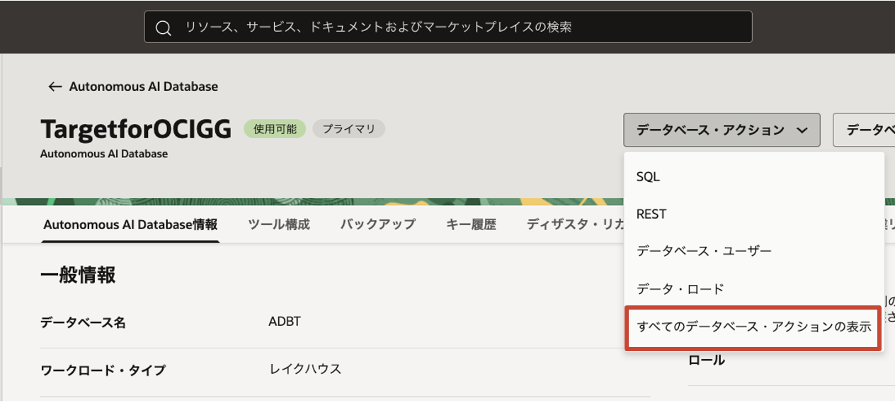

1. 管理タブを選択し、データベース・ユーザを選択します。

    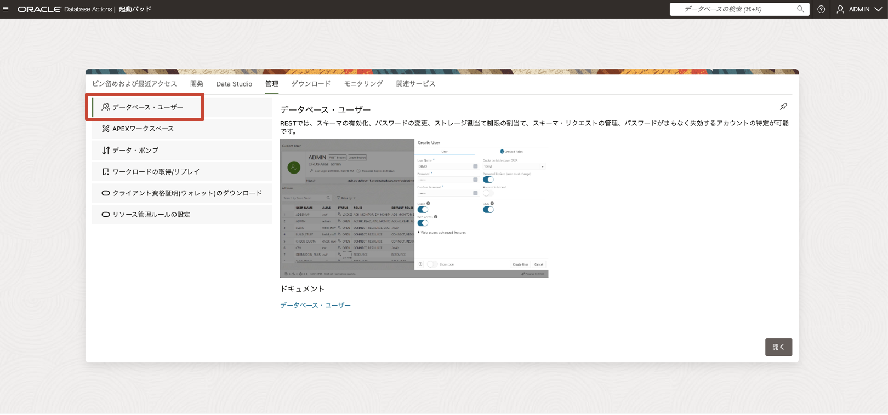

1. データベースのユーザ一覧が表示されます。既存で用意されているggadminユーザを見つけてください。

    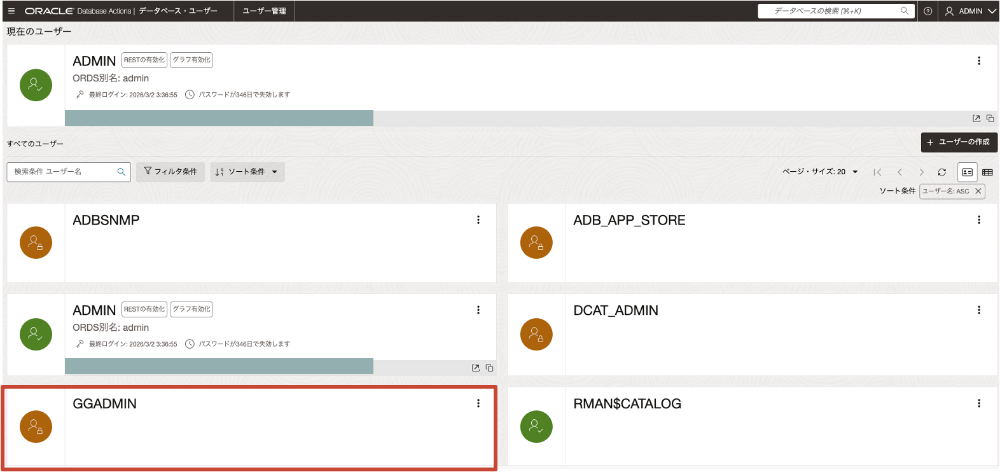

1. ggadminユーザのメニューボタンを開き **編集** を選択します。

    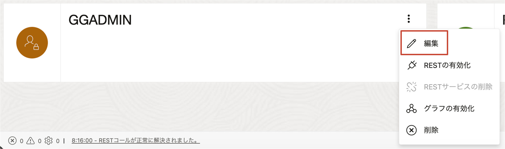

1. ggadminユーザのパスワードを設定し、アンロックします。

    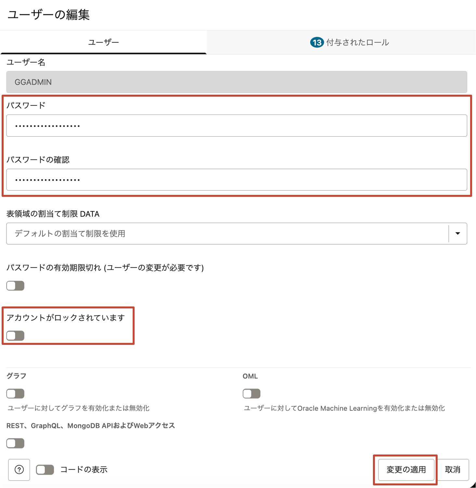

これでターゲット・データベース側のすべての準備が整いました。

<BR>

<a id="anchor3"></a>

# 3. OCI GGデプロイメントの作成
OCI GGデプロイメントを作成していきます。

1. OCIコンソール画面左上の **メニュー** をクリックし、サービス一覧から **Oracle AI Database**、**GoldenGate** を選択し、GoldenGateのサービス画面を表示します。

    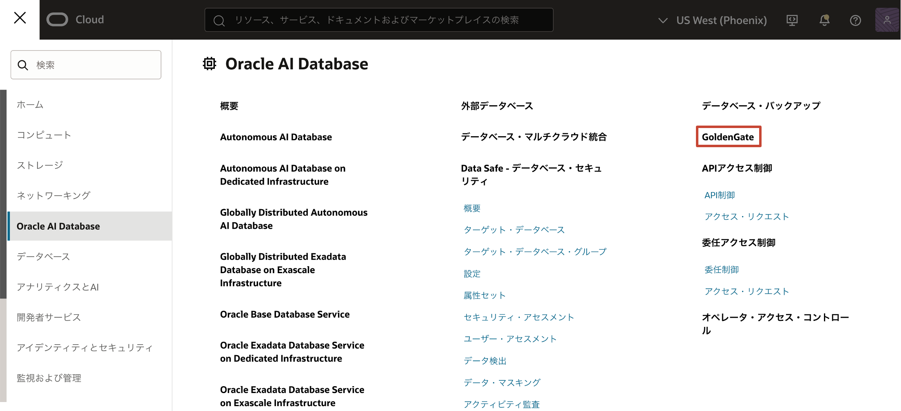

1. 画面左の**デプロイメント**というタブを選択し、**デプロイメントの作成** をクリックすると作成ウィンドウが立ち上がります。

    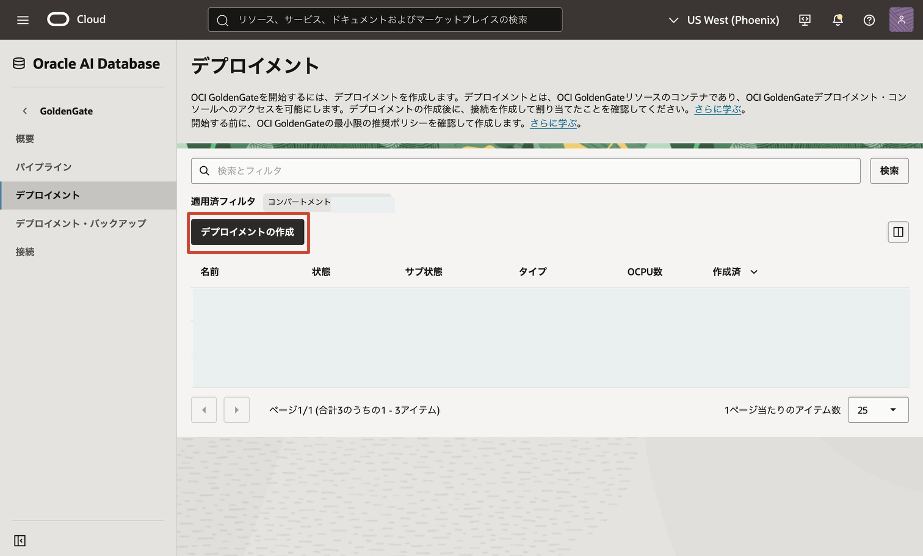

1. 以下の記載例を参考に各項目を入力します。
    - **名前** - 任意
    - **説明** - 任意
    - **コンパートメント** - 任意
    - **可用性ドメイン** - 任意
    - **フォルト・ドメイン** - 任意
    - **デプロイメント・タイプの選択** - データ・レプリケーションを選択してください。
    - **テクノロジの選択** - Oracle Databaseを選択してください。
    - **バージョン** - 任意
    - **ハードウェア構成** - 任意
    - **OCPUの選択** - 1から24までの値で選択してください。動作確認であれば1OCPUで構いません。<BR>実運用の参考値としてREDO生成量 60GB/h 程度であれば4OCPU＋自動スケーリングを選択してください。
    - **自動スケーリング** - 選択したOCPU数の最大3倍までの間でOCPUの利用率によって自動的にスケーリングされます。スケーリングはダウンタイムなくオンラインで実行され、<BR>1時間あたりに消費されたOCPUの実平均が課金対象となります。
    - **プライベート・サブネット** - 任意
    - **ライセンス・タイプの選択** - 任意
    - **GoldenGateインスタンス名** - 任意
    - **資格証明** - 任意（Oracle Cloud Infrastructure Identity and Access Management (OCI IAM)では、ユーザーの認証およびOCI全体のリソースにアクセスするための認可が提供されます。OCIユーザーがOCI GoldenGateにログインするには、IAMを選択します。ローカルのOCI GoldenGate資格証明ストアを使用してユーザーを管理するには、GoldenGateを選択します。本チュートリアルではGoldenGateを選択して案内します。）
    - **管理者ユーザー名** - ggadmin
    - **パスワード・シークレット** - 任意
    
    パスワード・シークレットがない場合は、**パスワード・シークレットの作成** をクリックし、次のステップにある手順を進めます。
    既にパスワード・シークレットがある場合は、次のステップにあるパスワード・シークレットの作成は必要ありません。
    **拡張オプション**をクリックし、**ネットワーク**をクリックします。
    - **GoldenGateコンソール・パブリック・アクセスの有効化** - 任意（本チュートリアルではボタンをクリックして有効化します。）
    - **ロード・バランサ・パブリック・サブネット** - 任意（本チュートリアルではパブリック・エンドポイントを作成するパブリック・サブネットを指定します。）<br>
    ※ パブリック・アクセスを有効化した場合、OCI GoldenGate側でユーザにかわってテナンシVCNにロード・バランサを作成します。デプロイメントおよびロード・バランサを正常に作成するには、適切なポリシー、割り当て制限および制限を設定する必要があります。OCI GoldenGateのポリシーの詳細については、[Oracle Cloud Infrastructure GoldenGateポリシー](https://docs.oracle.com/ja/cloud/paas/goldengate-service/rmrrr/index.html)をご参照ください。

    **作成**をクリックします。

    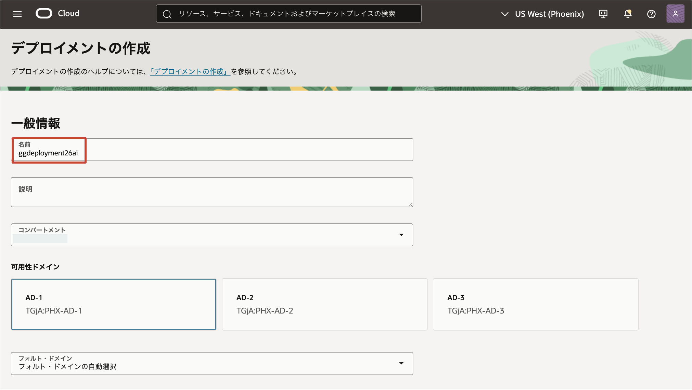
    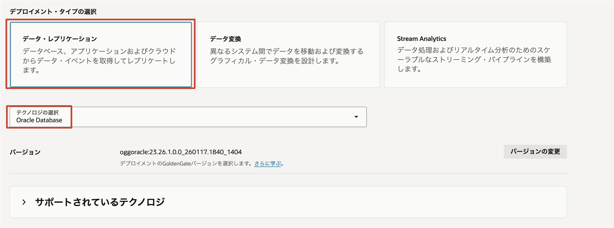
    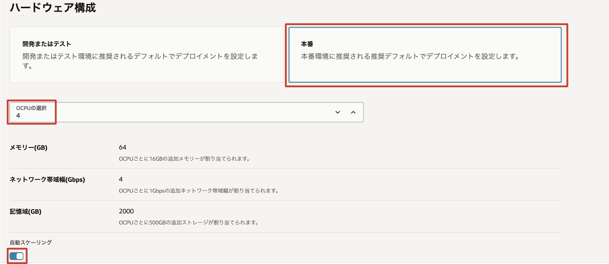
    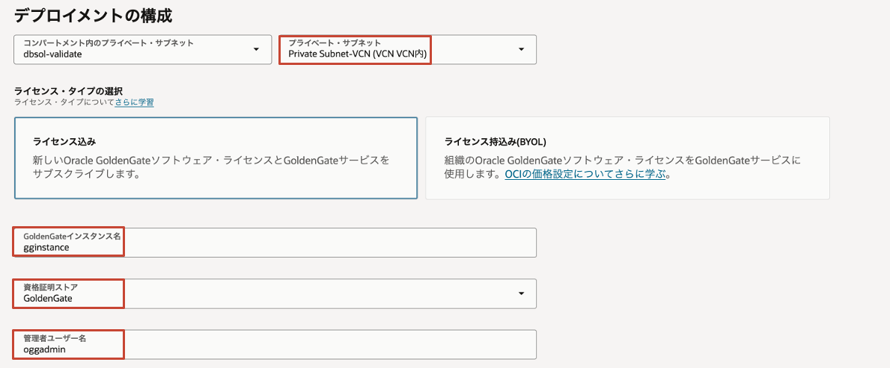
    
    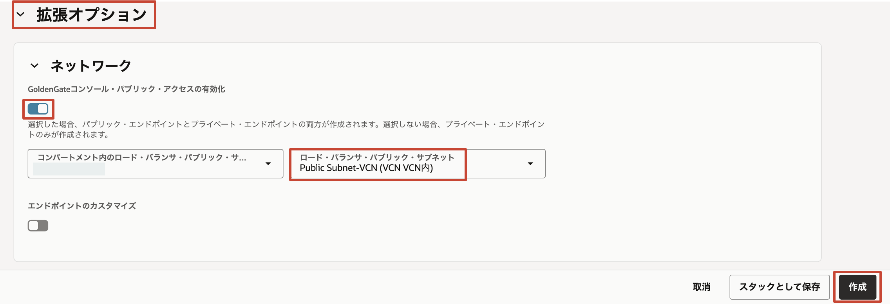

1. 以下の記載例を参考に各項目を入力します。
    - **名前** - 任意
    - **コンパートメント** - 使用したいシークレットが存在するコンパートメント
    - **ボールト** - 使用したいボールトを選択します。(存在しない場合は別途作成が必要です。) 
    - **暗号化キー** - 使用したい暗号化キーを選択します。(存在しない場合は別途作成が必要です。) 
    - **ユーザー・パスワード** - 任意 <br>
    OCIボールトとOCIシークレットの詳細については、[ボールトおよびキー管理の概要](https://docs.oracle.com/ja-jp/iaas/Content/KeyManagement/Concepts/keyoverview.htm)と[シークレット管理サービスの概要](https://docs.oracle.com/ja-jp/iaas/Content/secret-management/overview.htm)をご参照ください。

    **作成** をクリックします。

    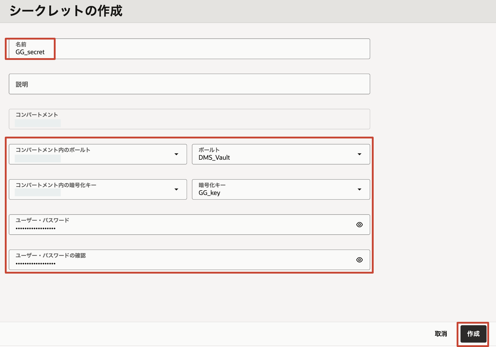

1. デプロイメントの作成が完了すると、デプロイメント名の横に**アクティブ**と表示されます。
今回は15分程度で完了しました。

    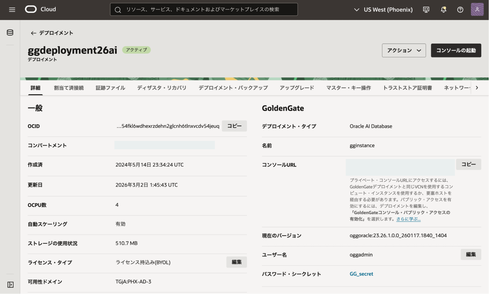

これでデプロイメントの作成は完了です。
<BR>

<a id="anchor4"></a>

# 4. 接続の作成
OCI GGではGoldenGateがソース・データベース、ターゲット・データベースにアクセスするために「接続」と呼ばれるリソースを使用して通信を確立します。
ソース・データベースとターゲット・データベースのそれぞれに使用する「接続」を作成します。

1. 画面左の**接続**というタブを選択し、**接続の作成** をクリックすると作成ウィンドウが立ち上がります。

    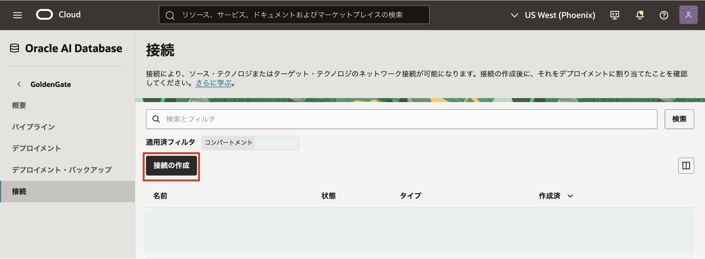

1. 一般情報入力欄に、各項目を入力します。まずはソースDBとなるBaseDBの接続を作成します。
    - **名前** - 任意
    - **データベース・タイプ** - 今回はOCI上のBaseDBをソースDBとして登録するため、**Oracle AI Database** を選択します。
    - **データベース詳細** -  データベースの選択
    - **データベース・システム** - 登録したいデータベース・システムを選択します。
    BaseDBの場合データベース・システムを選択することでデータベース接続文字列まで自動入力されます。
    - **データベース・ホーム** - 任意
    - **データベース** - 任意
    - **データベース・ユーザ名** - 任意（今回はあらかじめ作成しておいた **ggadmin** を指定します。）

    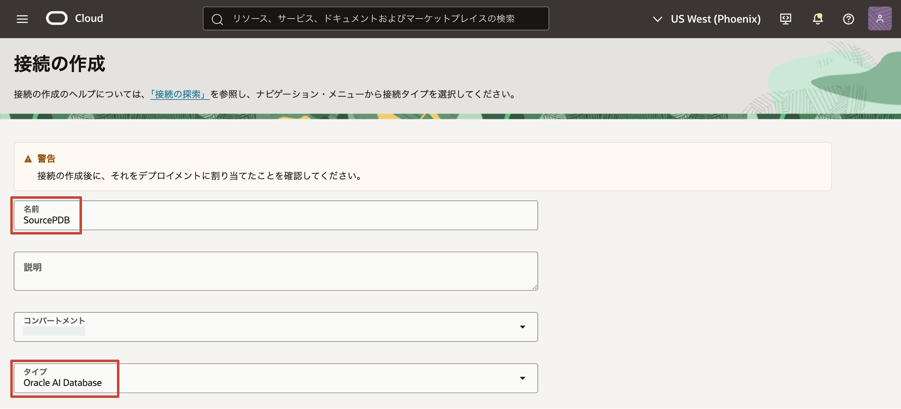
    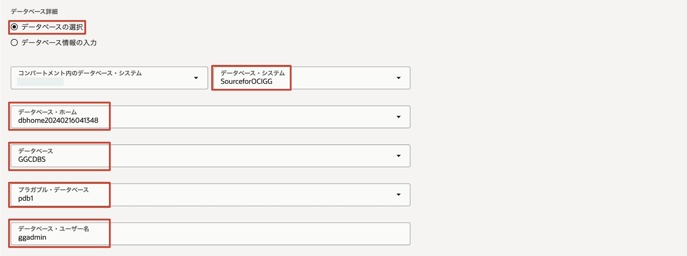

    **拡張オプション**をクリックし、**セキュリティ**をクリックします。以下の項目を入力します。
    - **ボールト・シークレットの使用** - 任意（今回はボタンをクリックして無効化にします。）
    - **暗号化キー・タイプ** - 任意（今回は**Oracle管理暗号化キーを使用**を選択します。）

    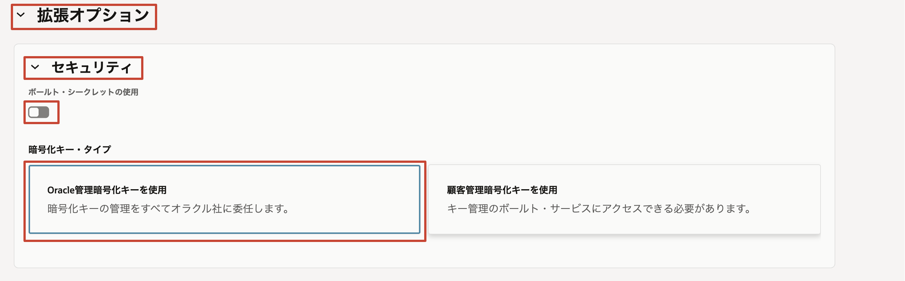

    上の設定項目に戻ります。各項目の入力後に**作成**をクリックします。
    - **データベース・ユーザ・パスワード** - 入力したデータベース・ユーザ(今回はggadmin)のパスワードを指定してください。
    - **データベース・ウォレット** - 任意

    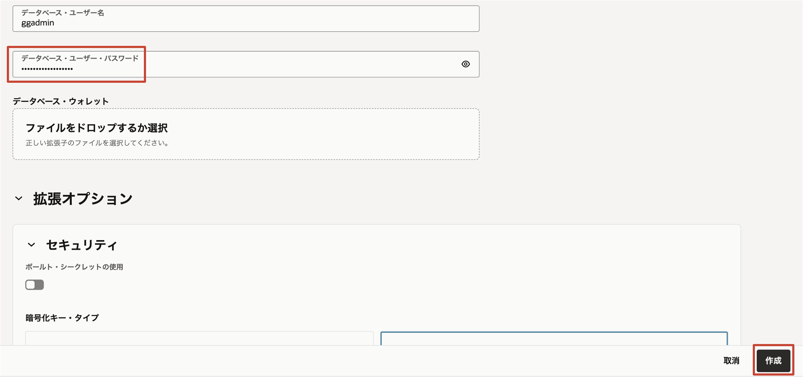

1. 作成した接続をデプロイメントに割当てます。接続の設定画面で**割当て済デプロイメント**のタブをクリックし、**デプロイメントの割当て**をクリックします。

    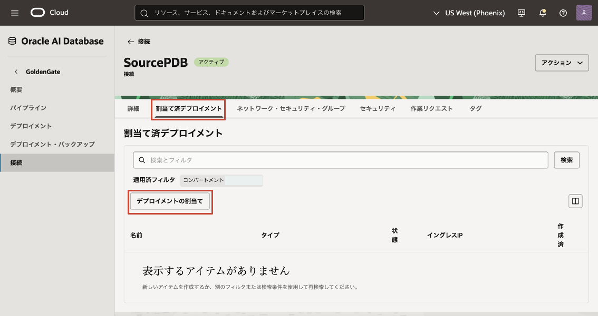

    以下の項目を入力後、**デプロイメントの割当て**をクリックします。
    - **デプロイメント** - [3.OCI GGデプロイメントの作成](#anchor3)で作成したデプロイメントを指定します。

    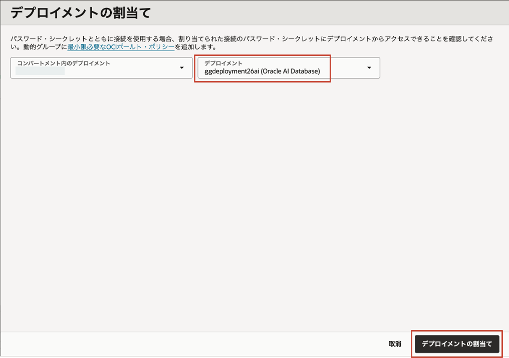

    割当てが成功すると、割当て済デプロイメントの一覧に割当てたデプロイメント名が表示されます。状態のステータスが**アクティブ**になっていることを確認します。
    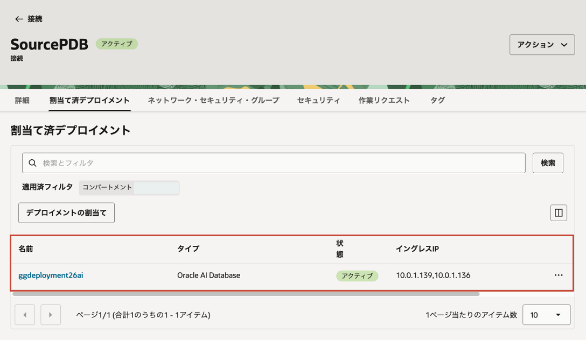

1. ターゲットとなるADBの接続も同様に作成します。
    
    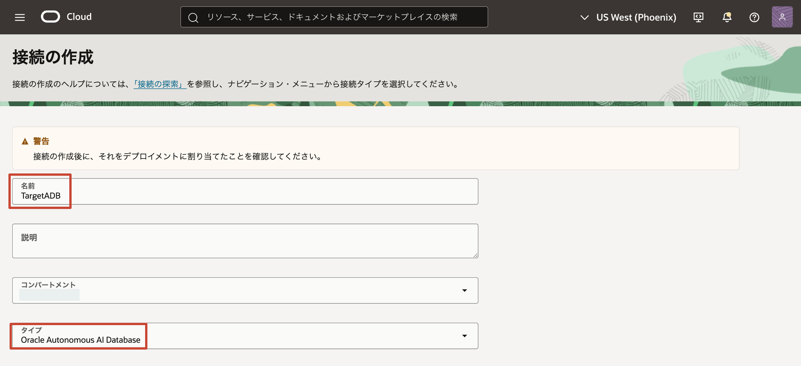
    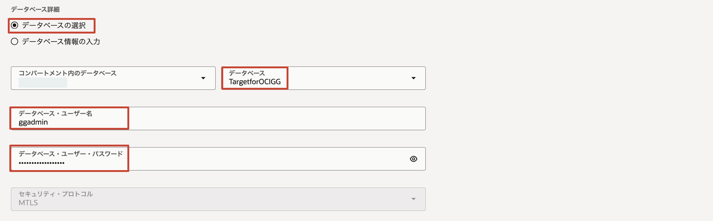
    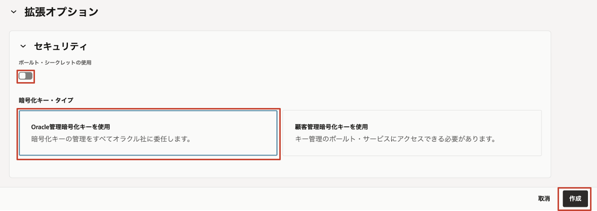
    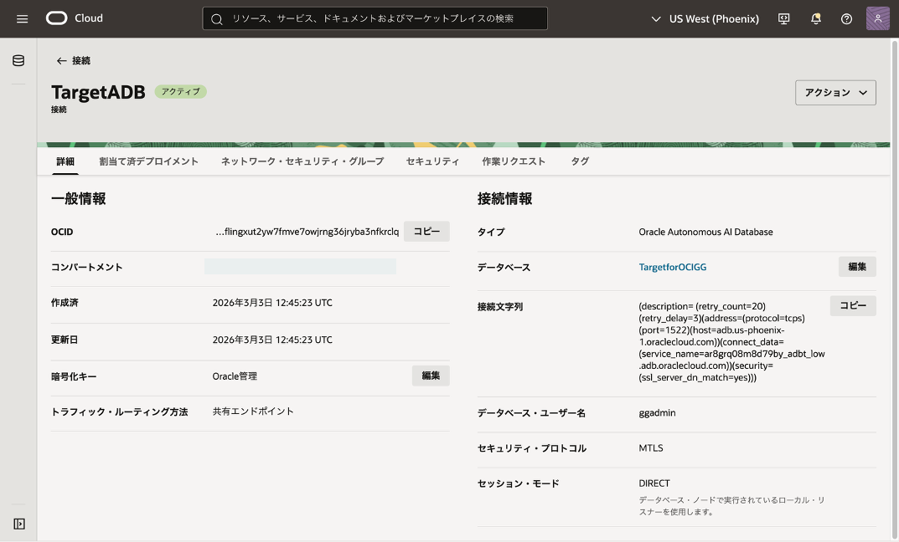

1. ターゲットとなるADBの接続も同様にデプロイメントに割当てます。

    
    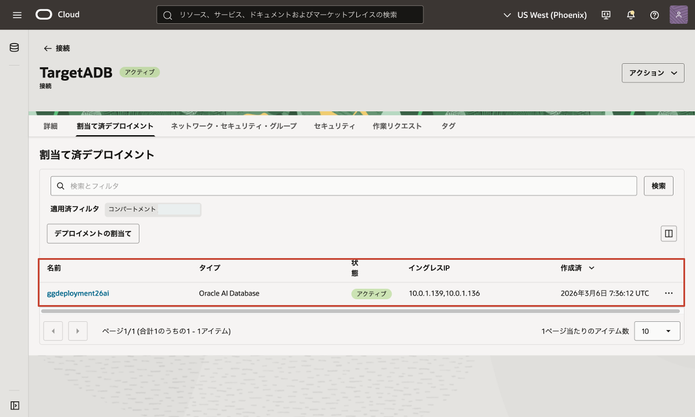

これで接続の作成は完了です。

<BR>

<a id="anchor5"></a>

<BR>

# 5. Extractの作成
ここからはOCI GGのコンソール画面に接続し、BaseDBからデータを抽出するためのExtractを作成していきます。GoldenGateによるダウンタイムを極小化した移行やリアルタイムなデータ連携を実現するためには、初期データ・ロードを開始する前に、Extractによるソース・データベースの更新データの抽出を開始(稼働)させておく必要があります。<br>
これにより、初期データ・ロードの実行中に発生したソース側の更新差分データを、漏らさずトレイル・ファイルに保持し続けることが可能になります。初期データ・ロード完了後に、蓄積された差分データをターゲット側へ反映することで、ソースとターゲットのデータを完全に同期させることができます。

1. デプロイメントの詳細画面から **コンソールの起動** を選択します。 
    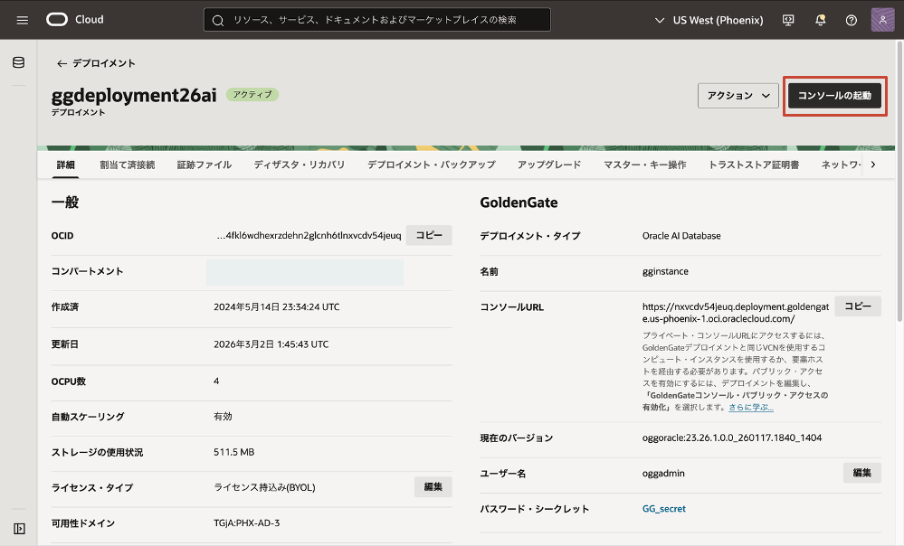

1. **Oracle GoldenGate管理サーバー** のサインイン画面にてデプロイメント作成時に指定したユーザ名、パスワードを入力してサインインします。 
    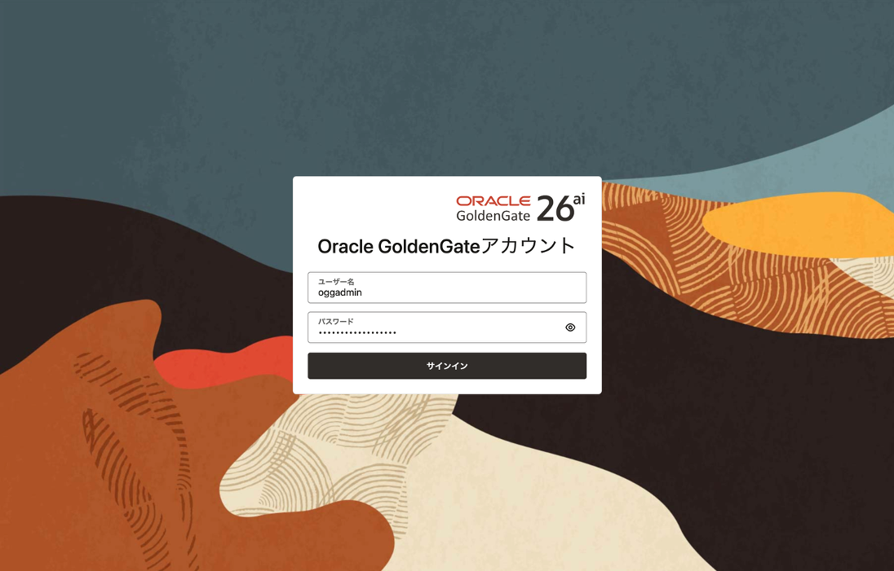

1. サインイン後、左のナビゲーション・メニューから **DB接続** をクリックします。
    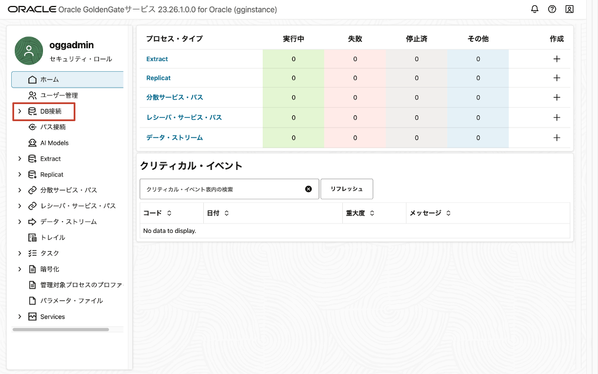

1. ソース・データベースのデータベース名をクリックし、**Trandata** をクリックします。(今回はソース・データベースである **SourcePDB** を選択します。)
    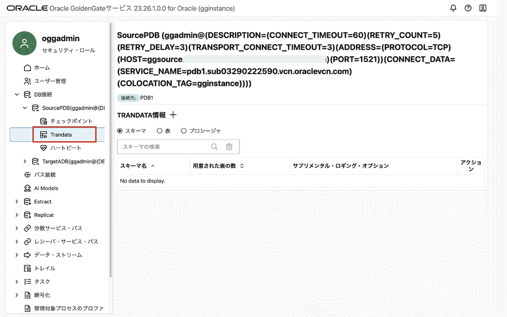

1. TRANDATA(トランザクション・データ)の追加

    TRANDATAを追加(ADD TRANDATAを実行)して、表およびスキーマ・レベルのサプリメンタル・ロギングを有効化します。<br>
    また、PREPARECSN(CSNモードの準備)を設定して、Data PumpのExportダンプ・ファイルにインスタンス化CSNが設定されるよう、ソースDBの表を自動的に準備します。
    >**Note :インスタンス化CSNとは**
    >
    >インスタンス化CSNは、Data Pumpのエクスポート実行時に、ソース・データベースにおける最新のコミット順序番号（CSN）をメタデータとして表ごとにダンプ・ファイル内へ自動記録する機能です。ターゲット側のReplicatはこの付与された情報に基づき、インポートされたCSN以降の差分データのみを自動で判別して適用を開始します。この仕組みにより、初期ロード・データと差分更新の重複や損失を排除し、厳密なデータの整合性を維持することが可能となります。

    スキーマ、表、プロシージャの中からサプリメンタル・ロギングを有効にするオブジェクト・レベルを選択し、TRANDATA情報の **＋** ボタンを選択します。本チュートリアルでは **スキーマ(Oracle推奨)** を選択します。
        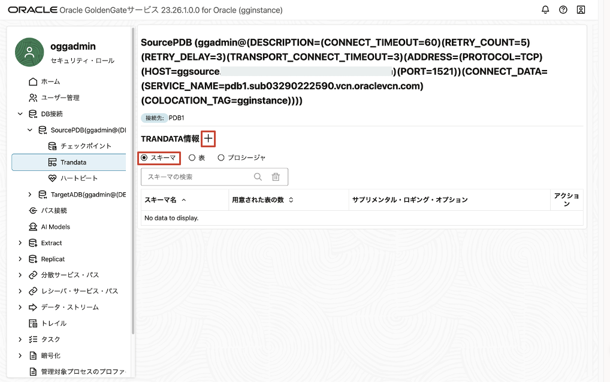

    以下の項目を入力後、 **発行** をクリックします。
    - **スキーマ名** - 連携対象のスキーマ名 (今回はHRと入力します。)
    - **サプリメンタル・ロギング・オプション** - 任意 (今回は **スケジュール列** と **すべての列** を選択します。)
    - **CSNモードの準備** - 任意 (今回はデフォルトの **nowait** を選択します。初期データのロードで **flashback_scn** を使用する場合、 **none** を選択します。)
    
    ※ ADD TRANDATAの設定項目に関する詳細については、[GoldenGateのマニュアル](https://docs.oracle.com/cd/G13662_01/gclir/add-trandata.html)をご参照ください。
    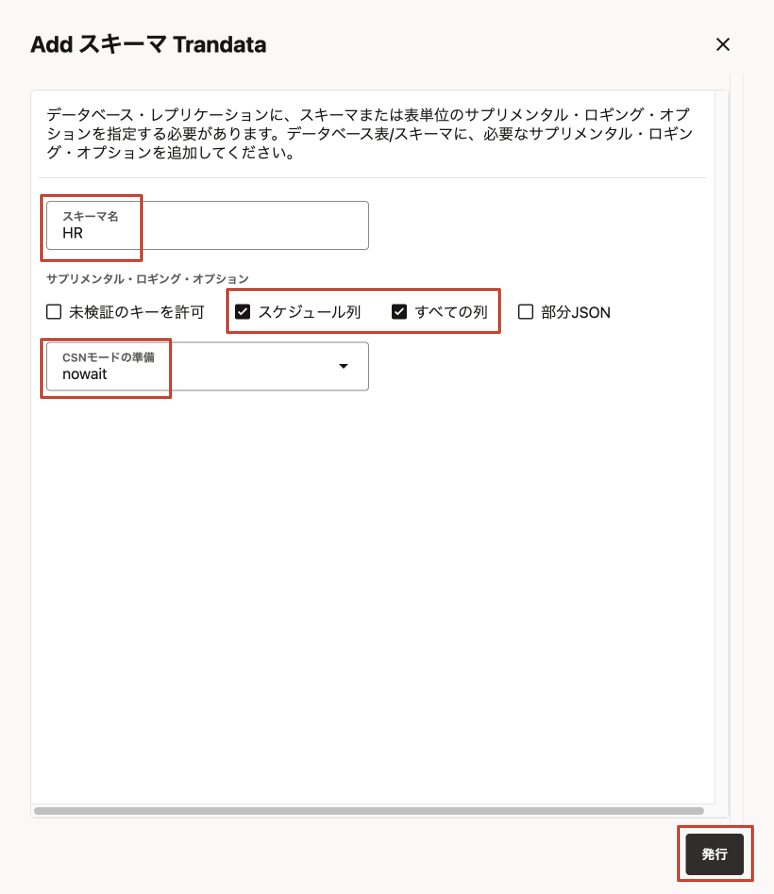

    完了後、検索バーにスキーマ名を指定して検索できます。
    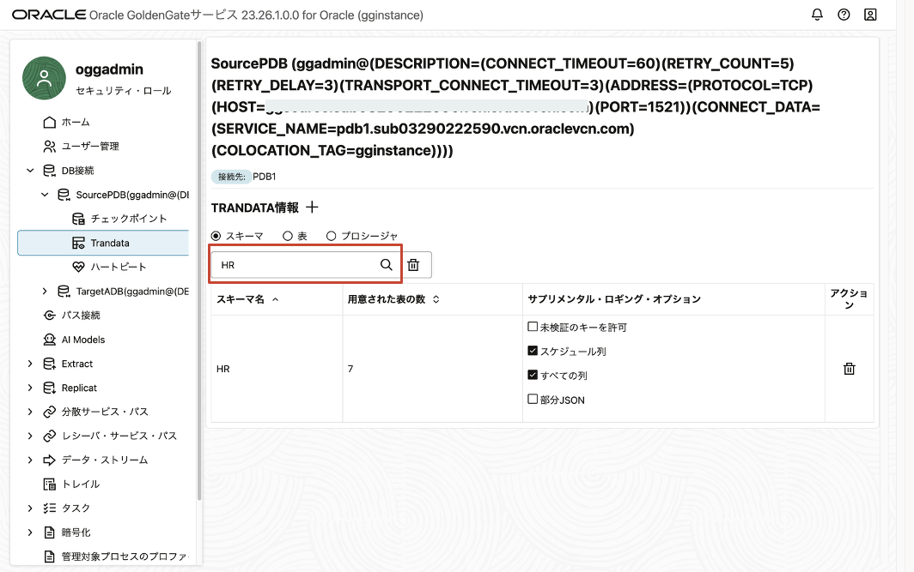

1. チェックポイント表の作成

    チェックポイント表を作成します。

    左のナビゲーション・メニューから **チェックポイント** を選択し、 **+** ボタンを選択します。
    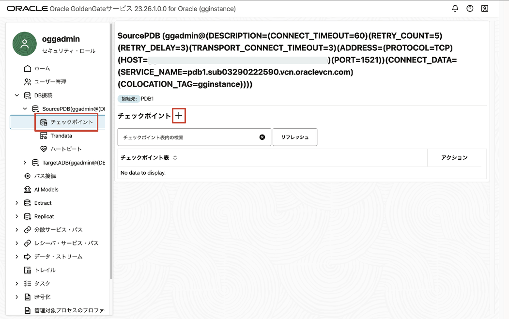

    以下の項目を入力後、 **発行** をクリックします。
    - **チェックポイント表** - 任意 (今回は **HR.SourcePDB_CHKPT** )
    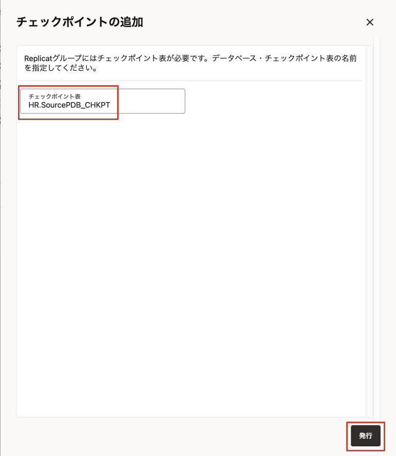

    >**Note :チェックポイント表とは**
    >
    >チェックポイント表とは、GoldenGateの処理におけるデータ・レプリケーションの進行状況（適用済みのトランザクションの位置など）を記録・管理するために使用される表です。

1. ハートビート表の作成

    左のナビゲーション・メニューから **ハートビート** を選択し、 **+** ボタンを選択します。
    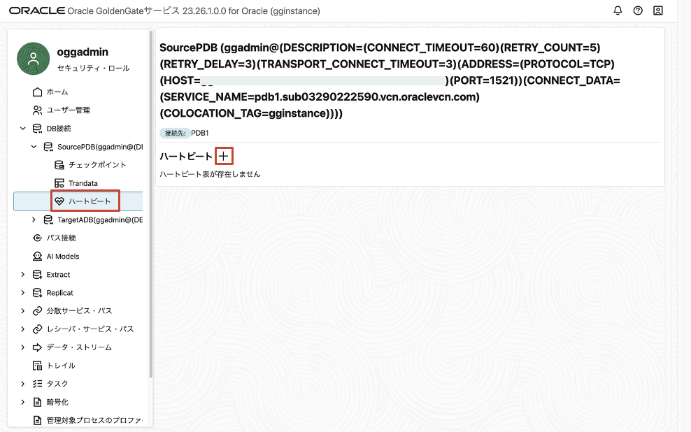

    以下の項目を入力後、 **発行** をクリックします。
    - **頻度** - 任意
    - **保存時間** - 任意
    - **パージ頻度** - 任意
    

    >**Note :ハートビート表とは**
    >
    >ハートビート表は、データ・レプリケーション・サイクル全体のラグをモニターするために使用される表です。ソースDBへ定期的にデータの更新を行い、定常的にターゲットDBへのデータ伝搬を発生させ、ターゲットDBでは伝搬されたデータを元に、伝搬時間を算出し、ターゲットDBで監視します。

1. Extractの追加

    左のナビゲーション・メニューから **Extract** を選択し、 **Extractの追加** をクリックします。
    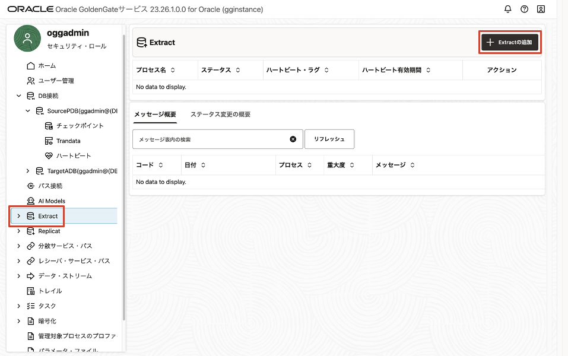

    以下の項目を入力後、 **次** をクリックします。
    - **抽出タイプ** - 統合Extract
    - **プロセス名** - EX_1
    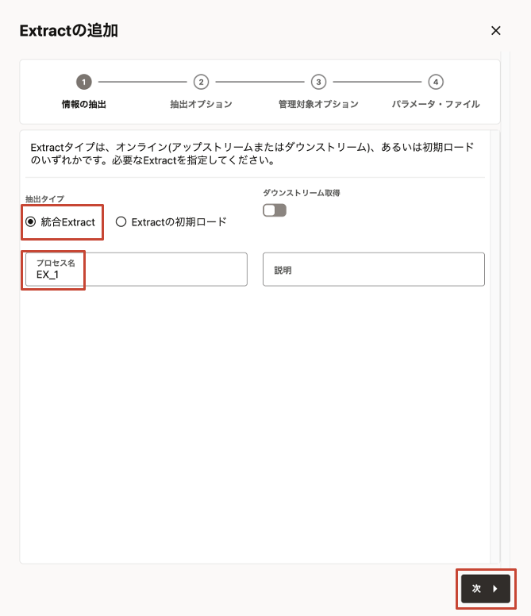

    以下の項目を入力後、 **次** をクリックします。
    本チュートリアルでは必須項目のみ入力していきます。
    - **ドメイン** - OracleGoldenGate
    - **別名** - ソースDBの接続名を選択します。 (今回は **SourcePDB** )
    
    その他の項目はすべてデフォルトのままにします。
    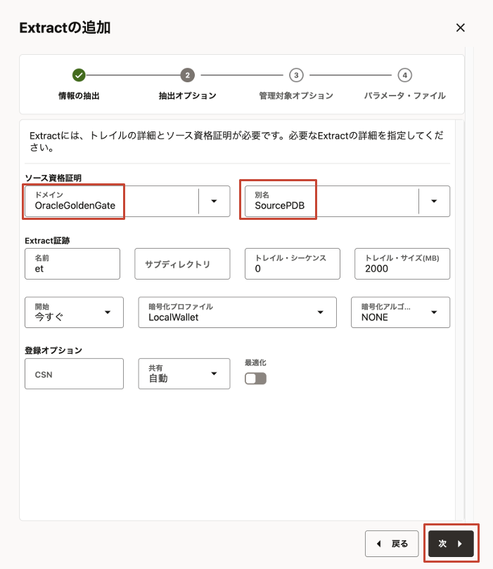

    以下の項目を入力後、 **次** をクリックします。
    - **プロファイル名** - カスタム
    - **自動再起動** - 有効化します。
    - **再試行の遅延(分)** - 任意 (今回は10)
    - **再試行期間(時間)** - 任意 (今回は2)
    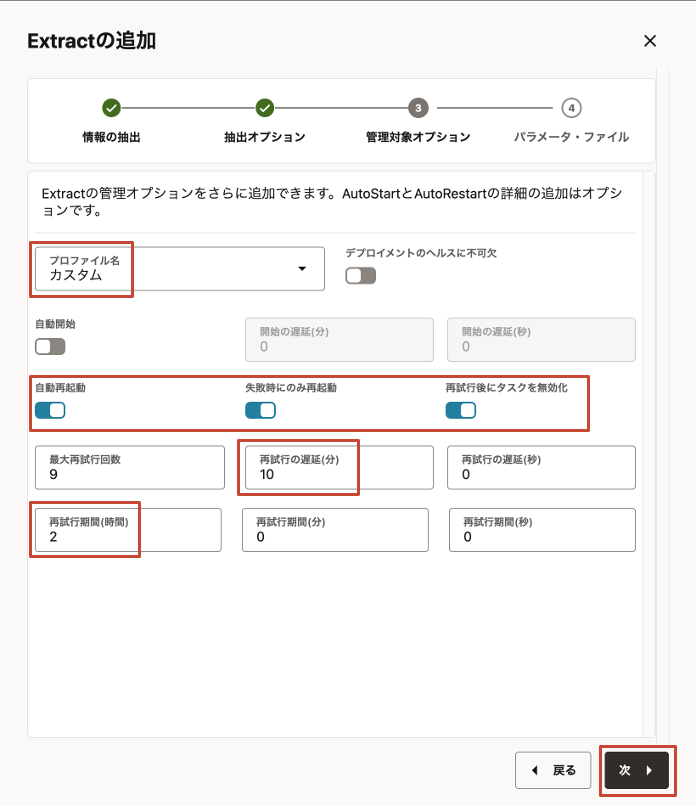

    パラメータ・ファイル入力欄にパラメータを入力します。
    自動入力された値に加えてTABLE句を記載する必要があります。
    また、今回は下記内容を追記しています。入力後、 **作成** をクリックします。

    ```sql
    TABLE HR.*;
    ```
    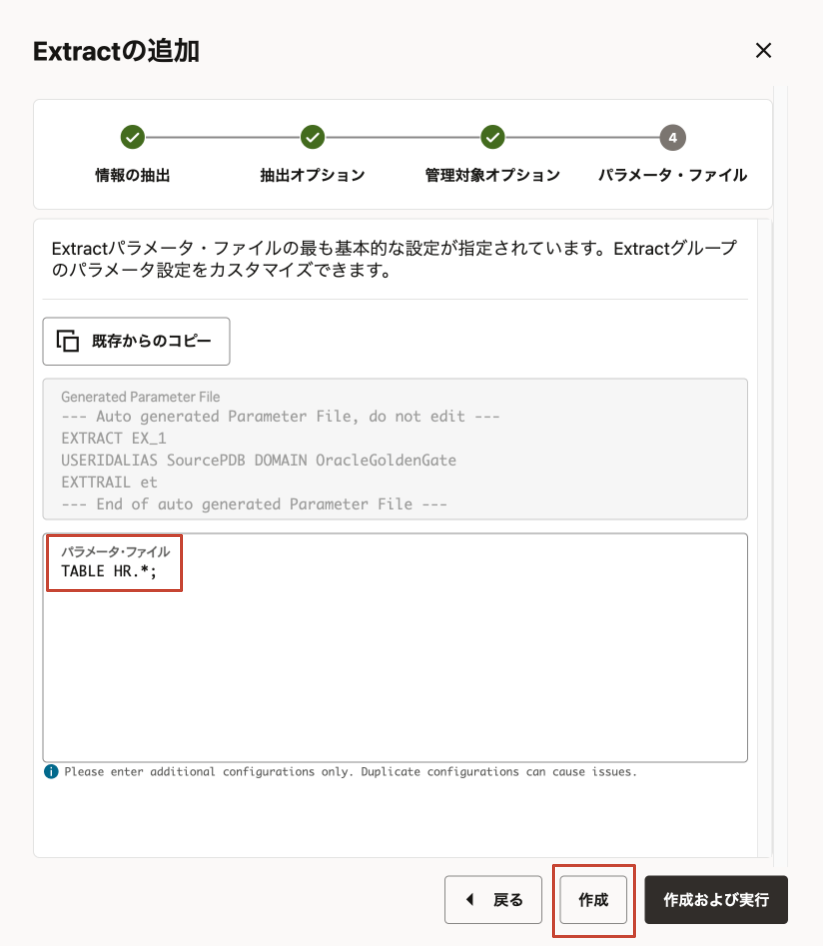

1. Extractの起動

    Extractが追加されたら、アクションの **▶︎** ボタンをクリックします。
    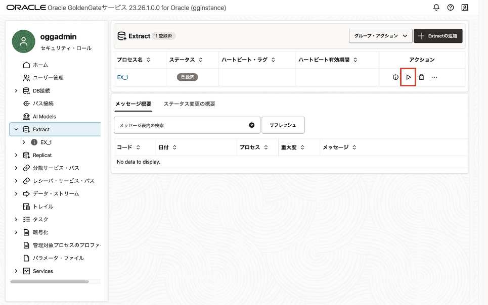

    ステータスが **実行中** と表示されたら成功です。
    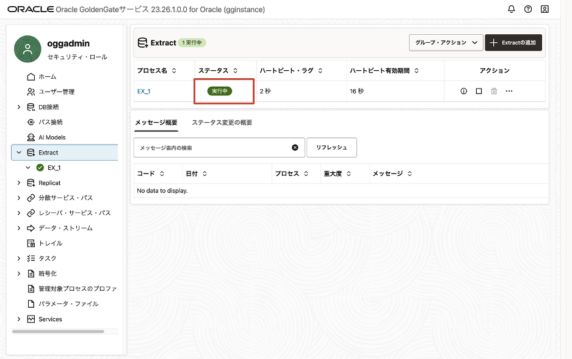

これでExtractの作成は完了です。

<BR>

<a id="anchor6"></a>

# 6. 初期データのロード
Data Pumpを使用してソースPDBからターゲットADBに初期データをロードしていきます。
ここでは、実行するexportコマンドとimportコマンドのみを紹介します。Data Pumpを使用した移行の詳細な手順については、[「303:Data Pumpを利用してデータを移行しよう」](../adb303-datapump/)をご参照ください。
また、本手順では **flashback_scn** を指定する方法で紹介していますが、 **インスタンス化CSNを利用する場合** は、**flashback_scn** の指定は不要です。

1. Exportの実行

    以下は、ソースPDBの環境で実行します。

    flashback_scnを指定するために必要なソースPDBの最新のSCNを確認します。

    ```sql
    select current_scn from v$database;
    ```

    実行結果:
    ```
    SQL> select current_scn from v$database;

    CURRENT_SCN
    -----------
    170553457
    ```

    HRスキーマのExportを実行します。

    Exportコマンド例:
    ```sql
    expdp hr/WelCome123#123#@pdb directory=dump_dir dumpfile=hr_init.dmp logfile=hr_exp.log schemas=hr flashback_scn=170553457
    ```
    ※ 後続のReplicatの作成で使用するため、ここで指定した **flashback_scn** の値（今回は170553457）を必ずメモしておいてください。インスタンス化CSNのみを利用する場合は不要です。

2. Importの実行

    ターゲットADBの環境で実行します。

    HRスキーマのImportを実行します。

    Importコマンド例:
    ```sql
    impdp admin/WelCome123#123#@adbt_high credential=GG_CRED schemas=HR directory=DATA_PUMP_DIR dumpfile=https://objectstorage.us-phoenix-1.oraclecloud.com/n/xxxxxx/b/gg_bucket/o/hr_init.dmp logfile=hr_imp.log parallel=4
    ```

これで初期データのロードは完了です。

<BR>

<a id="anchor7"></a>

# 7. Replicatの作成
続いて適用プロセスであるReplicatを作成していきます。

1. ハートビート表の作成

    左のナビゲーション・メニューから **DB接続** の下のターゲット・データベース名を選択し、 **ハートビート** を選択し、 **+** ボタンを選択します。
    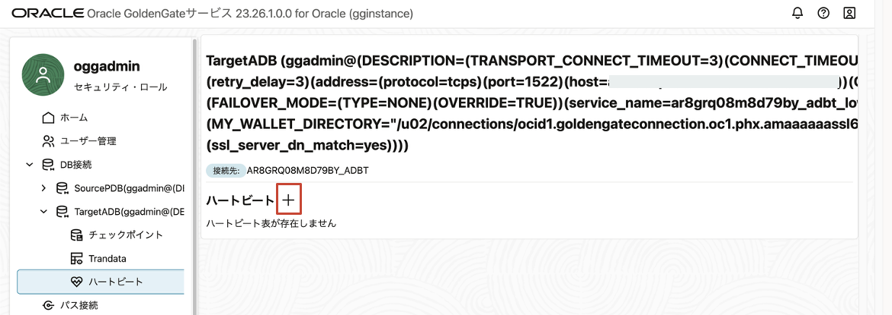

    以下の項目を入力後、 **発行** をクリックします。
    - **頻度** - 任意
    - **保存時間** - 任意
    - **パージ頻度** - 任意
    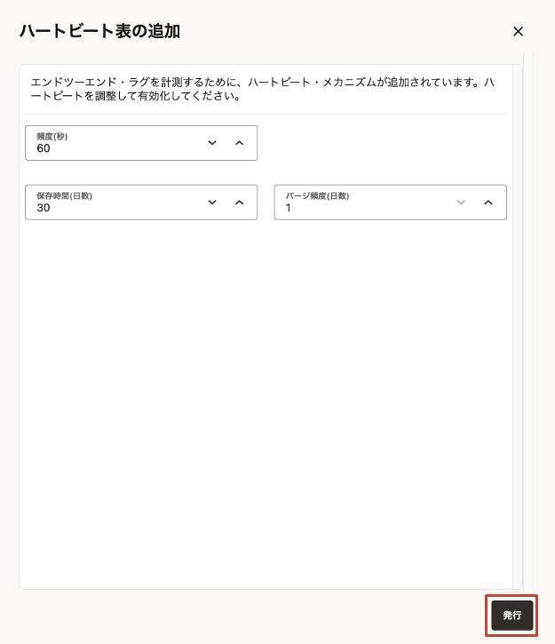

1. Replicatの追加

    OCI GoldenGateのコンソールの左のナビゲーション・メニューから、Replicatを選択し、 **Replicatの追加** ボタンを選択します。
    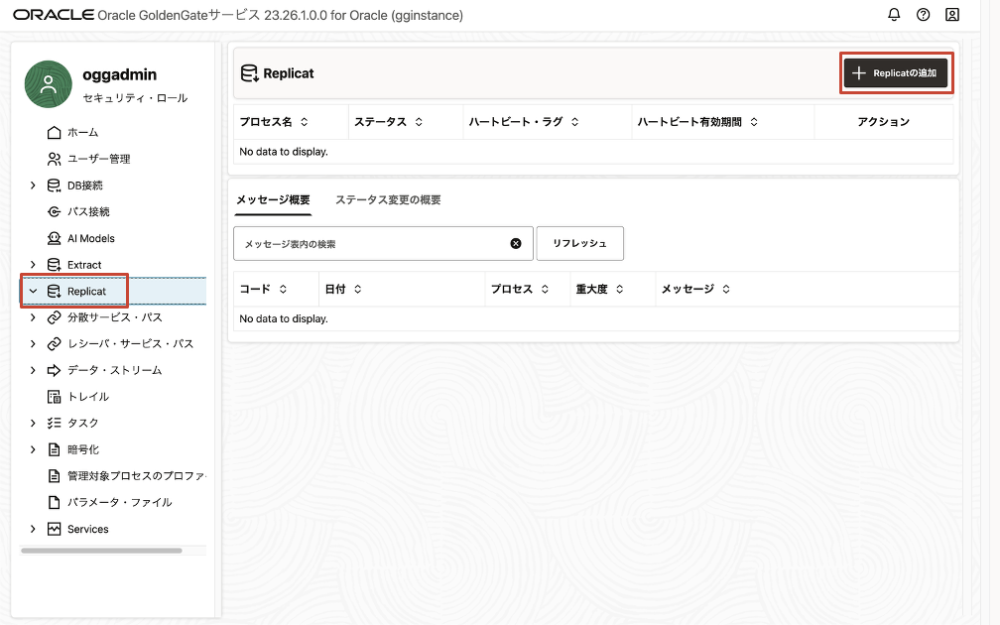

    以下の項目を入力後、 **次** をクリックします。
    - **Replicatタイプ** - パラレルReplicat
    - **パラレル・タイプのReplicat** - 非統合
    - **プロセス名** - RP_1
    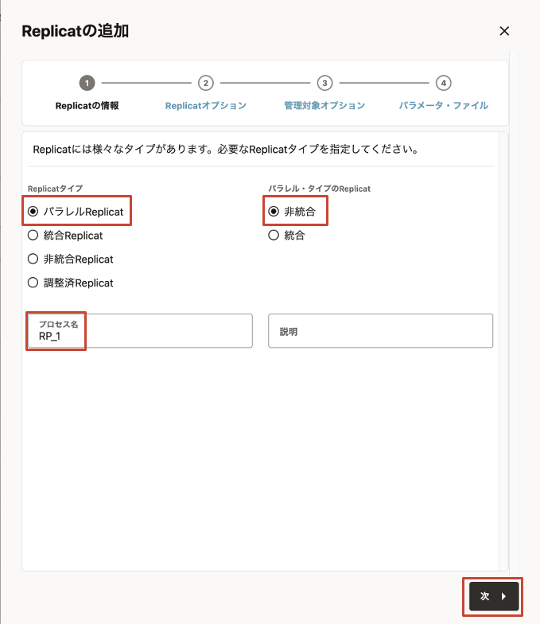

    以下の項目を入力後、 **次** をクリックします。`
    本チュートリアルでは必須項目のみ入力していきます。
    - **Replicatトレイル - 名前** - [5.Extractの作成](#anchor5)で指定したトレイル名を入力します。(今回は **et** )
    - **ドメイン** - OracleGoldenGate
    - **別名** - ターゲットDBの接続名を選択します。 (今回は **TargetADB** )
    - **チェックポイント表** - [5.Extractの作成](#anchor5)で作成したチェックポイント表を指定します。
    
    その他の項目はすべてデフォルトのままにします。
    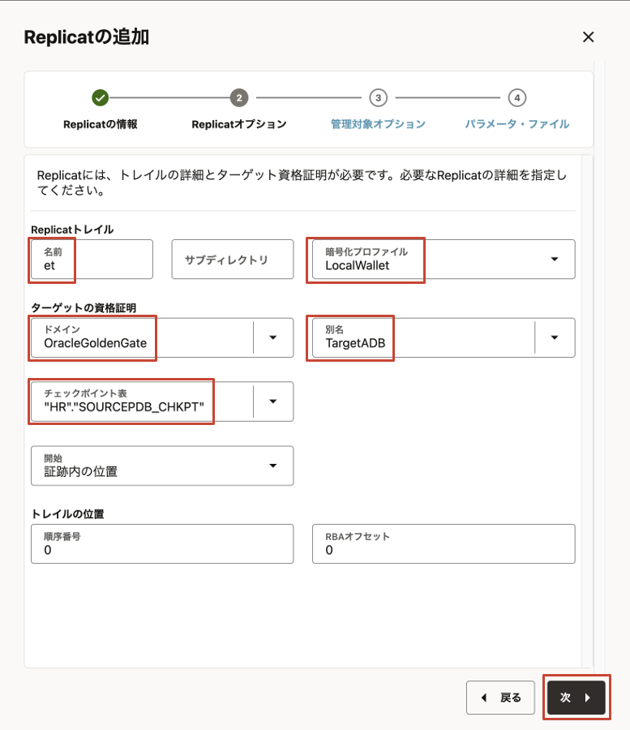

    以下の項目を入力後、 **次** をクリックします。
    - **プロファイル名** - カスタム
    - **自動再起動** - 有効化します。
    - **再試行の遅延(分)** - 任意 (今回は10)
    - **再試行期間(時間)** - 任意 (今回は2)
    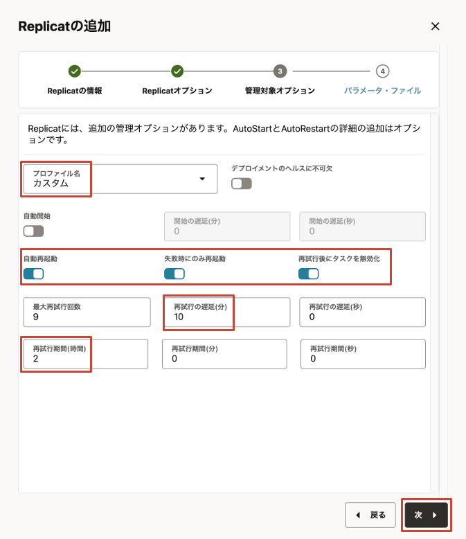

    パラメータ・ファイル入力欄にパラメータを入力します。
    自動入力された値に加えてMAP句を記載する必要があります。<br>
    **インスタンス化CSNを利用する場合**は、<br>
    DBOPTIONS ENABLE_INSTANTIATION_FILTERINGオプションを記載する必要があります。<br>
    入力後、 **作成** をクリックします。
    ```sql
    MAP HR.*, TARGET HR.*;
    DBOPTIONS ENABLE_INSTANTIATION_FILTERING
    ```
    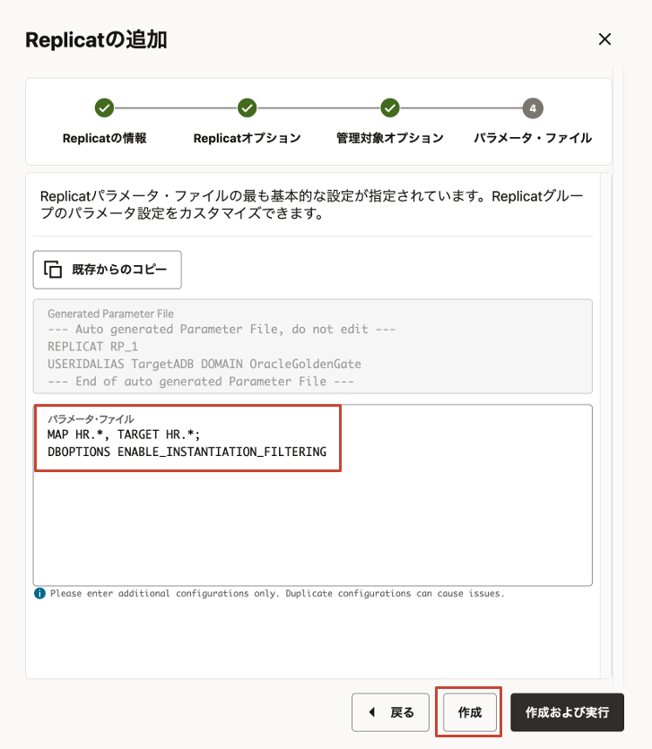

    >**Note :DBOPTIONS ENABLE_INSTANTIATION_FILTERINGオプションとは**
    >
    >Replicatは、DBOPTIONS ENABLE_INSTANTIATION_FILTERINGオプションによって、Data Pumpのインポート時に指定したCSN未満のレコードを自動で除外(フィルタ処理)し、データの重複を防ぐことができます。

1. Replicatの起動

    Replicatが追加されましたら、起動していきます。<br>
    **インスタンス化CSNを利用する場合** は、アクションの **▶︎** ボタンをクリックしてReplicatを起動し、次のステップへ進みます。<br>
    **flashback_scnを利用する場合** は、アクションの **・・・** ボタンをクリックし、 **オプションを使用して開始** をクリックします。
    
    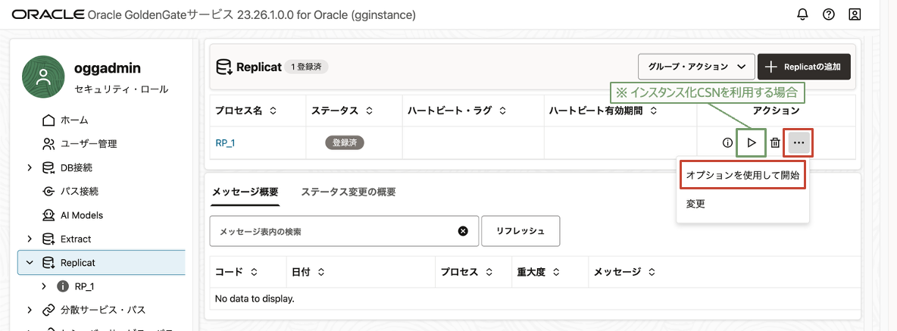

    以下の項目を入力後、 **発行** をクリックします。
    - **開始ポイント** - CSNより後
    - **CSN** - [6.初期データのロード](#anchor6)のExport実行時に指定したSCNを指定します。(今回は170553457)
    - **重複をフィルタ** - 有効化します。
    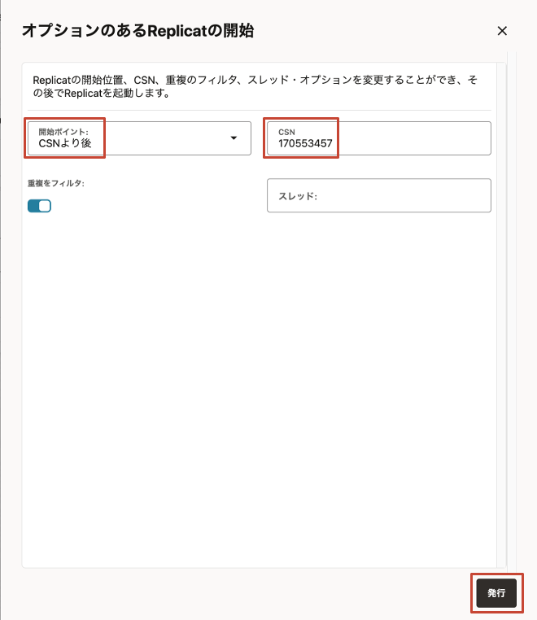

    ステータスが **実行中** と表示されたら成功です。
    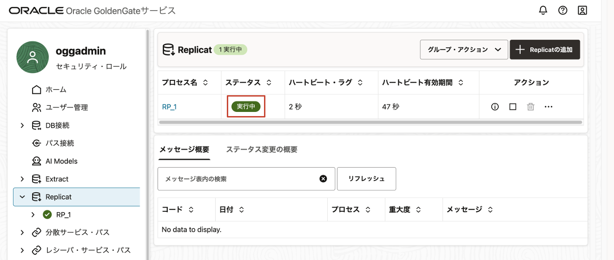

これでReplicatの作成は完了です。

<BR>
<a id="anchor8"></a>

# 8. データ連携の確認
Extract、Replicatの作成がそれぞれできました。最後にデータが連携されていることを確認しましょう。

1. ターゲット・データベースでの事前確認
    
    まず、ターゲット側のデータベースにまだ追加するデータが存在しないことを確認します。
    ```sql
    SELECT count(*) FROM hr.employees WHERE employee_id = 207;
    ```

    実行結果:
    ```
    SQL> SELECT count(*) FROM hr.employees WHERE employee_id = 207;

    COUNT(*)
    ----------
             0
    ```

1. ソース・データベースでのデータ追加

    ソース側のデータベースで新しい従業員データを1件追加(INSERT)し、処理を確定(COMMIT)させます。 

    ```sql
    INSERT INTO hr.employees (employee_id, first_name, last_name, email, hire_date, job_id, salary) VALUES (207, 'Test1', 'User', 'TUSER1', SYSDATE, 'IT_PROG', 5000);

    COMMIT;
    ```

1. ターゲットDBでの反映確認

    再びターゲット側のデータベースで同じデータを検索します。
    データ連携ができていればターゲット側でも更新が確認できます。

    ```sql
    SELECT employee_id, first_name, last_name, salary FROM hr.employees WHERE employee_id = 207;
    ```

    実行結果:    
    ```
    SQL> SELECT employee_id, first_name, last_name, salary FROM hr.employees WHERE employee_id = 207;

    EMPLOYEE_ID FIRST_NAME		 LAST_NAME		       SALARY
    ----------- -------------------- ------------------------- ----------
	207         Test1		 User				 5000

1. OCI GoldenGateのコンソールからも確認ができます。ナビゲーション・メニューのReplicat配下にある **統計** を選択することで確認できます。

    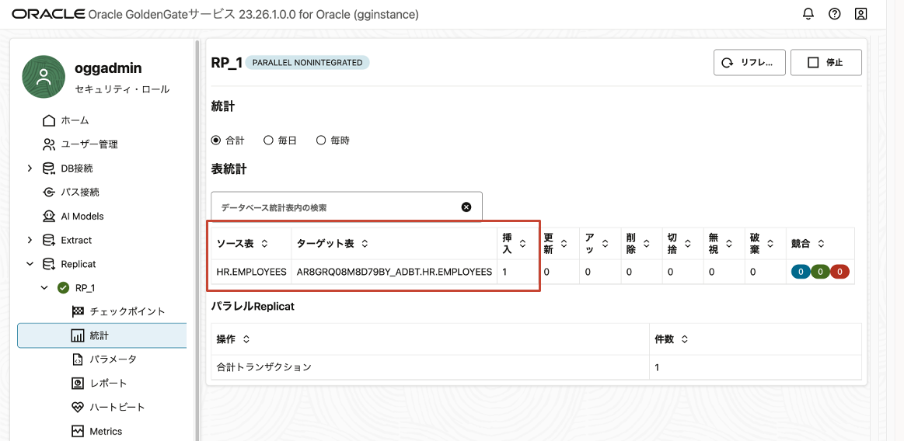

1. ナビゲーション・メニューのReplicat配下にある **ハートビート** を選択することで、伝搬ラグを確認することができます。
    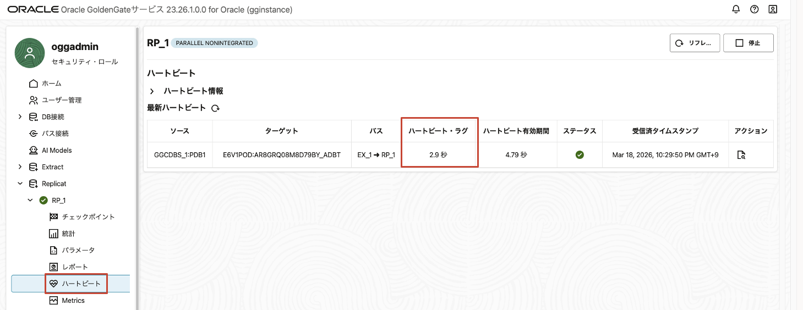

<a id="anchor9"></a>

<BR>

# 参考資料
OCI GoldenGate マニュアル
+ [Oracle Cloud Infrastructure GoldenGate](https://docs.oracle.com/cd/G41739_01/paas/goldengate-service/druyg/index.html)
+ [Oracle GoldenGate 26ai](https://docs.oracle.com/en/database/goldengate/core/26/index.html)

<BR>

[ページトップへ戻る](#anchor0)