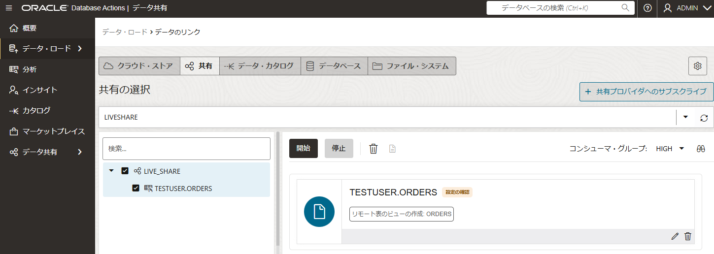

# はじめに

ライブ共有は、データベース・リンクに実装されているクラウド・リンクを介してデータを問い合せることによって機能します。 データベース・リンクを使用すると、外部マシンおよびスキーマ上のネットワークを介してオブジェクトを問い合せることができます。 このモードの利点は、問合せ時点のデータが最新であることです。

**目次 :**
  + [1.データ共有へのアクセス](#anchor1)
  + [2.共有の作成](#anchor2)
  + [3.共有の消費](#anchor3)
  + [4.共有の確認](#anchor4)
  + [5.おわりに](#anchor5)

**前提条件**
+ ADBインスタンスが構成済みであること
     ※ADBインタンスの作成方法については、
    [101:ADBインスタンスを作成してみよう](../adb101-provisioning) を参照ください。

+ ADBインスタンスがにデータ共有のユーザーが作成済みであること
     ※ADBインタンスにユーザー作成方法については、
    [101:ADBインスタンスを作成してみよう 3-2. データベース・ユーザーを作成してみよう](../adb101-provisioning/#3-2-%E3%83%87%E3%83%BC%E3%82%BF%E3%83%99%E3%83%BC%E3%82%B9%E3%83%A6%E3%83%BC%E3%82%B6%E3%83%BC%E3%82%92%E4%BD%9C%E6%88%90%E3%81%97%E3%81%A6%E3%81%BF%E3%82%88%E3%81%86database-actions) を参照ください。
    データ共有ツールを使うには、データベース・ユーザーに DWROLEロール が必要です。
  
 

**所要時間 :** 約10分

 

# 1. データ共有へのアクセスと有効化

データ共有ツールを使用してデータを共有または使用するには、Data Studioに移動し、データ共有ツールを起動して共有を有効にします。

## 1-1. データ共有へのアクセス

Database Action 起動パッドで Data Studio > データ共有 をクリックします。

   

## 1-2. 共有の提供

データ共有 で「共有の提供」をクリックします。

   

## 1-3. プロバイダ識別子の設定

共有の提供 で「プロバイダ識別子」クリックします。

   

## 1-4. プロバイダ識別子の設定

プロバイダ識別子 で プロバイダ識別子情報を入力し、保存をクリックします。

   

## 1-5. データ共有へのアクセスと有効化の完了

データ共有へのアクセスと有効化できました。

   

+ 詳しい手順は、[データ共有ツールへのアクセスおよび有効化](https://docs.oracle.com/cd/E83857_01/paas/autonomous-database/serverless/adbsb/access-adp-share.html) を参照ください。

 

# 2. 共有の作成

最新のデータベース・コミット時点のデータを、同じリージョンのAutonomous Databasesと共有できます。 受信者には常に最新のデータが表示されます。
ライブ共有データへのアクセス権を付与するには、データ共有を定義し、受信者にそれらを使用するアクセス権を付与する必要があります。 「共有の作成」ウィザードを使用して、ライブ・データの共有を作成および公開します。

## 2-1. 共有の作成

共有の提供 で「共有の作成」をクリックします。

   

## 2-2. 一般の設定

共有の作成 で一般の情報を入力し、次をクリックします。

   

## 2-2. 公開詳細の設定

公開詳細を「直接接続を使用したライブ・データの共有」を選択し、次をクリックします。

   

## 2-3. 表の選択

共有したい表を選択し、次をクリックします。

   

## 2-5. 受信者の選択

受信者を選択し（当記事では、MY_COMPARTMENT）、次をクリックします。

   

## 2-6. 共有の作成完了

共有の作成が完了しました。

   

+ 詳しい手順は、[ライブ共有の提供](https://docs.oracle.com/cd/E83857_01/paas/autonomous-database/serverless/adbsb/adp-provide-share.html#GUID-3A742879-F5DE-46C1-8E17-8DFCAB3A9494) を参照ください。

共有の提供ができました。

   

 

# 3. 共有の消費

受信者はデータベースからライブ・データを消費（検索）できます。
次からの作業は、**同じコンパートメントにある受信側のADB**から実行します。

## 3-1. 権限の付与

共有の消費をするために、権限を付与します。
Database Action 起動パッドで SQL をクリックし、以下のようなスクリプトを実行します。

USER_NAMEは共有を消費するユーザー名に書き換えてください。

    -- Request USER_NAME User to run this script
    begin
      C##ADP$SERVICE.DBMS_SHARE.ENABLE_SCHEMA(
          SCHEMA_NAME => 'USER_NAME',
          ENABLED => TRUE,
          PRIVILEGES => C##ADP$SERVICE.DBMS_SHARE.PRIV_CONSUME_ORACLE_SHARE
      );
    end;
    /
    
   

## 3-2. 共有の消費

 Database Action 起動パッドで Data Studio > データ共有 をクリックし、データの消費 をクリックします。

   

## 3-3. 共有プロバイダへのサブスクライブ

共有プロバイダへのサブスクライブ でのドロップダウンリストから ライブ共有プロバイダへのサブスクライブを選びます。

   

## 3-4. ソースの共有

共有プロバイダへのサブスクライブ で次をクリックします。

   

## 3-5. 共有の選択

使用可能な共有を選び、右の選択した共有に移動し、サブスクライブをクリックします。

   

## 3-6. データのリンクの開始

データのリンクで、共有を選び、右へドラッグ＆ドロップして、開始をクリックします。

   

クラウド・ストアからのリンクの開始で、実行をクリックします。

   

## 3-7. 共有の消費の完了

共有の消費ができました。

   

+ 詳しい手順は、 [ライブ共有の消費](https://docs.oracle.com/cd/E83857_01/paas/autonomous-database/serverless/adbsb/adp-consume-share.html#GUID-B9AE9AAA-691B-4D8C-B0D7-7C91F3E67E19) を参照ください。

画面上部に「ライブ共有プロバイダへのアクセス権がありあせん」と表示される場合、その文字をクリックすると表示されるスクリプトを実行権限のあるユーザー（ADMIN等）で実行します。

   

 

# 4. 共有の確認
ライブ共有の設定ができたので、実際にライブ共有の確認をします。はじめに、正しくライブ共有が見えるか確認し、データを変更して、その変更したデータが検索できるか確認します。共有元は、ORDERS表として作成しました。

## 4-1.共有の確認（データ変更前）

1. 共有先の Autonomous Database でデータロードの画面で、「問合せ」をクリックします。

     

1. 「分析」画面に遷移し、 データの内容を確認します。

     

## 4-2.データの変更

1. 共有元の Autonomous Database でデータロードの画面で、サンプルデータを追加し、更新します。

     

## 4-3.共有の確認（データ変更後）

1. 共有先の「分析」画面に遷移し、 データの内容を確認します。

     

データ変更前でライブ共有を確認し、共有元のデータを更新して、すぐに共有先でデータ変更を確認することができました。

 

# おわりに
ここではAutonomous Database のライブ共有について、紹介しました。ライブ共有の受信者はOracle表またはビューから直接データにアクセスします。 この共有は、受信者に最新のデータを提供します。 
データ共有時に最新のデータを必要する要件では、非常に便利ですので、ぜひ活用してみてください。

 

# 参考資料

* [Autonomous Database Cloud 技術詳細](https://speakerdeck.com/oracle4engineer/autonomous-database-cloud-ji-shu-xiang-xi)

 
以上でこの章は終了です。次の章にお進みください。

 

[ページトップへ戻る](#anchor0)