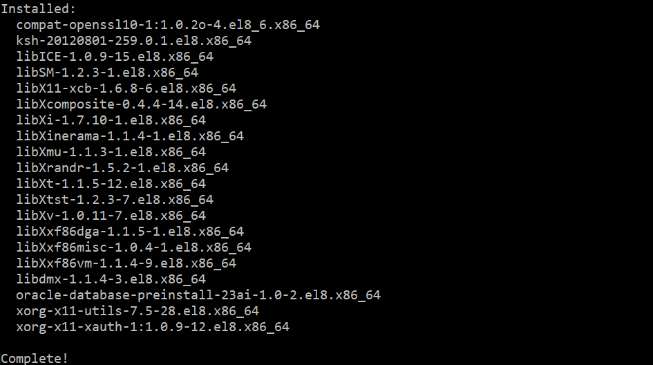
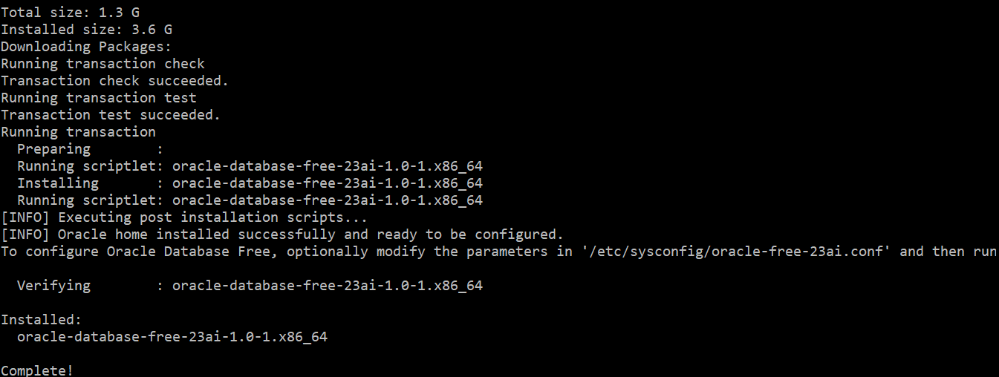

<a id="anchor0"></a>

# はじめに

Oracle AI Database Free は、Oracle Database 23ai を使いやすく、簡単にダウンロードできるようにパッケージ化され、無料で提供されています。Oracle AI Database Free の概要は[こちら](https://www.oracle.com/jp/database/free/)をご参照ください。

Oracle AI Database Free では、一部リソース制限がありますが、AI Vector Search の基本的な使い方を体験することができます。

本チュートリアルでは、Oracle AI Database Free を仮想マシンインスタンスへインストールする方法をご紹介します。

<br>

**前提条件 :**

- Oracle AI Database Free をインストールする仮想マシンインスタンスがプロビジョニング済みであること
  <br>※Oracle Cloud Infrastructure 上でプロビジョニングする場合は、[入門編-その 3 - インスタンスを作成する](/ocitutorials/beginners/creating-compute-instance)を参照ください。
  <br>[システム要件](https://docs.oracle.com/en/database/oracle/oracle-database/23/xeinl/requirements.html#GUID-427FACD2-F623-4BFA-AB3E-4FE283396547)を満たしていることをご確認ください。
  <br>**本チュートリアルは Oracle Linux 8 を前提にしています。**

**目次**

- [はじめに](#はじめに)
- [1. Oracle AI Database Free のインストール](#1-oracle-database-23ai-freeのインストール)
- [2. Oracle AI Database Free への接続](#2-oracle-database-23ai-freeへの接続)

<br>

**所要時間 :** 約 40 分

<a id="anchor1"></a>
<br>

# 1. Oracle AI Database Free のインストール

Oracle AI Database Free は、RPM パッケージを使用してインストールできます。

RPM ベースのインストールでは、インストール前のチェック、DB ソフトウェアの抽出、抽出したソフトウェアの所有権の事前設定済みユーザーおよびグループへの再割り当て、Oracle イ ンベントリの維持、Oracle Database ソフトウェアの構成に必要なすべての root 操作の実行が行われ、シングルインスタンスの Oracle Database の作成および構成が行われます。

RPM ベースのインストールでは、インストールの最小要件が満たされていない場合、それを検出し、これらの最小プレインストール要件を完了するよう促します。

1. root でログインします。

   ```sh
   sudo -s
   ```

1. Oracle Database Preinstallation RPM をインストールします。

   ```sh
   dnf -y install oracle-database-preinstall-23ai
   ```

   Oracle Database Preinstallation RPM は、Oracle インストールの所有者とグループを自動的に作成します。また、Oracle Database のインストールに必要なその他のカーネル構成設定も行います。
   

1. 以下を実行して Oracle AI Database Free の RPM(Oracle Linux 8 版)をダウンロードします。
   ```sh
   wget https://download.oracle.com/otn-pub/otn_software/db-free/oracle-database-free-23ai-1.0-1.el8.x86_64.rpm
   ```
1. DB ソフトウェアをインストールします。

   ```sh
   dnf -y install oracle-database-free-23ai-1.0-1.el8.x86_64.rpm
   ```

   

   これで Oracle Database のインストールは完了です。

   続いて Oracle Database の作成と構成を行っていきます。

1. 以下の構成スクリプトを実行して、プラガブル・データベース（FREEPDB1）を 1 つ持つコンテナ・データベース（FREE）を作成し、デフォルトのポート（1521）でリスナーを構成します。ここの手順は

   ```sh
   /etc/init.d/oracle-free-23ai configure
   ```

   SYS、SYSTEM、PDBADMIN 管理ユーザーのパスワードの設定を求められます。Oracle ではパスワードは少なくとも 8 文字以上で、少なくとも 1 つの大文字、1 つの小文字、1 桁の数字[0-9]を含むことを推奨しています。

   例: Welcome12345#

   

1. Oracle ユーザーにスイッチし、環境変数を設定します。

   ```sh
   sudo su - oracle
   export ORACLE_SID=FREE
   export ORAENV_ASK=NO
   . /opt/oracle/product/23ai/dbhomeFree/bin/oraenv
   ```

   

<a id="anchor1"></a>
<br>

# 2. Oracle AI Database Free への接続

1. 以下を実行し、SQL\*Plus でデータベースに接続します。

   ```sh
   sqlplus sys@localhost:1521/freepdb1 as sysdba
   ```

   先ほど設定した SYS のパスワードを入力します。

   

1. 表領域を作成します。

   ```sql
   Create bigfile tablespace tbs2 Datafile 'bigtbs_f2.dbf' SIZE 1G AUTOEXTEND ON next 32m maxsize unlimited extent management local segment space management auto;
   ```

   ```sql
   CREATE UNDO TABLESPACE undots2 DATAFILE 'undotbs_2a.dbf' SIZE 1G AUTOEXTEND ON RETENTION GUARANTEE;
   ```

   ```sql
   CREATE TEMPORARY TABLESPACE temp_demo TEMPFILE 'temp02.dbf' SIZE 1G reuse AUTOEXTEND ON next 32m maxsize unlimited extent management local uniform size 1m;
   ```

1. AI Vector Search 用のユーザー`VECTOR`を作成します。

   ```sql
   create user vector identified by vector default tablespace tbs2 quota unlimited on tbs2;
   ```

1. `Vector`に開発者用のロール`DB_DEVELOPER_ROLE`を付与します。

   ```sql
   grant DB_DEVELOPER_ROLE to vector;
   ```

   一度 OS に戻ります。

   ```
   exit
   ```

1. tnsnames.ora に PDB(freepdb1)のサービス名を追加します。

   ```sh
   vi $ORACLE_HOME/network/admin/tnsnames.ora
   ```

   サービス`FREE`のエントリをコピーし、`SERVICE_NAME`を**freepdb1**に修正します。

   

1. 以下のように`VECTOR`ユーザーで freepdb1 に接続できるようになります。

   ```sh
   sqlplus vector/vector@freepdb1
   ```

   

<br>
以上で、この章は終了です。  
次の章にお進みください。
