<a id="anchor0"></a>

# はじめに
チュートリアル103~108では、RAGを構成するためのベクトル検索機能について確認しました。ベクトル検索は、テキスト・画像・音声などの非構造データを数値の集合であるベクトルに変換し、ベクトル間の距離の大小を以て、意味的な類似度を計算する検索手法です。

一方全文検索は、特定のキーワードやフレーズをテキスト内で検索するための技術です。通常、インデックス(索引)を利用して、指定した単語が含まれる文書を高速に抽出するため、検索対象としては単語ベースになります。

RAGでは「意味の近いコンテンツを取ってくる」という点から主にベクトル検索(セマンティック検索)が使われてきました。しかしベクトル検索も万能ではなく、質問と意味は近いが内容のズレた情報を取得してしまうことや、厳密なキーワード一致を保証しないため、誤った関連情報を拾いハルシネーションを起こしてしまうことがあります。そういった中で、厳密なキーワード一致検索ができる全文検索が評価されてきています。またベクトル検索と全文検索を組み合わせたハイブリッド検索も注目されています。

本チュートリアルではその全文検索をOracle Databaseで実装する方法をご紹介します。

<BR>

# 0. 前提条件
+ [101:Always Freeで23aiのADBインスタンスを作成してみよう](/ocitutorials/ai-vector-search/ai-vector101-always-free-adb/)、または[101: ADBインスタンスを作成してみよう](/ocitutorials/adb/adb101-provisioning/)の記事を参考に、Autonomous Database(23ai)を作成済みであること。

+ 本チュートリアルで使用する以下のサンプルデータをダウンロード済みであること。
  + [TextSample1.csv](/ocitutorials/ai-vector-search/ai-vector109-oracletext/TextSample1.csv)
  + [TextSample2.csv](/ocitutorials/ai-vector-search/ai-vector109-oracletext/TextSample2.csv)

<BR>

**目次：**
- [はじめに](#はじめに)
- [0. 前提条件](#0-前提条件)
- [1. Oracle Textとは](#1-oracle-textとは)
- [2. Oracle Textで全文検索してみる](#2-oracle-textで全文検索してみる)
- [3. 参考資料](#3-参考資料)

<br>

**所要時間 :** 約40分

<BR>

<a id="anchor1"></a>

# 1. Oracle Textとは
Oracle Text は、Oracleカーネルに組み込まれた全文検索およびドキュメント分類のためのエンジンです。Oracle Database のすべてのエディションで無償でご利用いただける機能です。

Oracle Text では、PDFやテキスト形式など各種フォーマットのデータに対して索引付けを行うことができます。全文検索専用のテキスト索引を作成することで、検索対象ドキュメントを一つ一つ検索するよりも高速に検索が行えます。またテキスト索引を作成すると、索引付けしたデータを「トークン」という単位に分割して、トークン表の形でデータベース内で保持します。

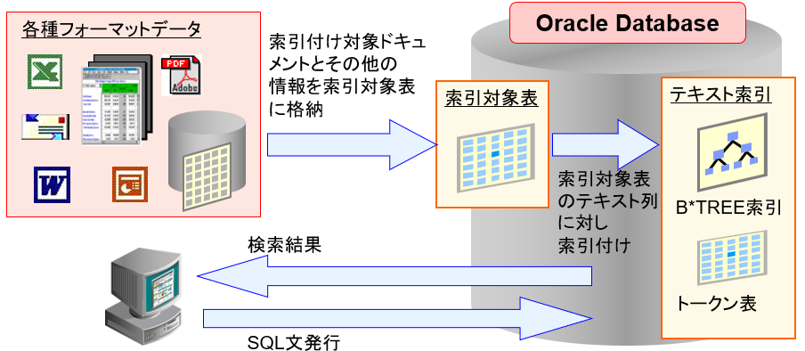

検索するときも検索ワードを同様にトークンに分割し、DB内で分割したトークンが連続して存在している場合に結果として返します。

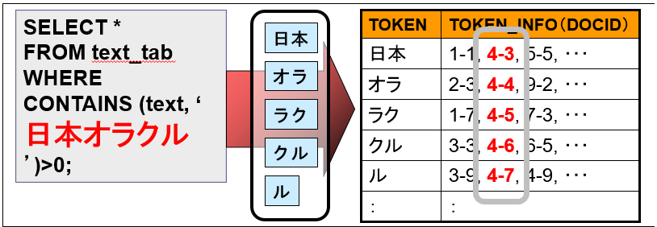

Oracle Text で全文検索を行うには、CONTAINSというSQL関数を利用します。

```sql
SELECT id FROM testtab WHERE CONTAINS (text, 'オラクル') > 0;
```

例えば上記のSQLでは、testtab表の`text`列に「オラクル」という文字列を含む全ての行のidが得られます。

検索条件は、**`CONTAINS (<列名>, '<検索条件>') > 0`** のように指定し、この式の返り値としては0以上100以下の整数となり、返り値が1以上のとき、全文検索の条件に一致することを意味します。

またCONTAINS関数内では、さまざまな問合せ演算子が利用できます。例えば「日本」と「オラクル」という2つの文字列が両方含まれている行を検索したい場合、
```sql
WHERE CONTAINS (text, '日本 and オラクル') > 0
--または
WHERE CONTAINS (text, '日本 & オラクル') > 0
```

上記のように記述します。同様に「日本」と「オラクル」のどちらか一方でも含まれている行を検索したい場合、
```sql
WHERE CONTAINS (text, '日本 or オラクル') > 0
--または
WHERE CONTAINS (text, '日本 | オラクル') > 0
```

上記のようになります。

これら以外にも指定されたキーワードの全てが含まれているものから高いスコアが割り当てられる`ACCUMulate`や、キーワードが含まれていなくても意味的に近いワードが含まれていればスコアが高くなる`ABOUT`などの演算子があります。

その他の演算子については、[こちら](https://docs.oracle.com/en/database/oracle/oracle-database/23/ccref/oracle-text-CONTAINS-query-operators.html#GUID-6410B783-FC9A-4C99-B3AF-9E0349AA43D1)をご参照ください。

<BR>
<a id="anchor2"></a>

# 2. Oracle Textで全文検索してみる
まずは本チュートリアルで操作を行うデータベース・ユーザーを作成していきます。

1．事前作成済みのAutonomous Databaseの詳細画面から、**データベース・アクション**>**データベース・ユーザー**をクリックします。
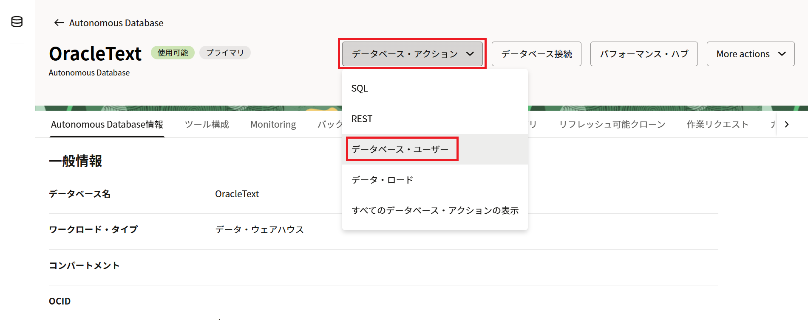

2．**ユーザーの作成**をクリックし、使用するデータベース・ユーザーをUI上から作成します。
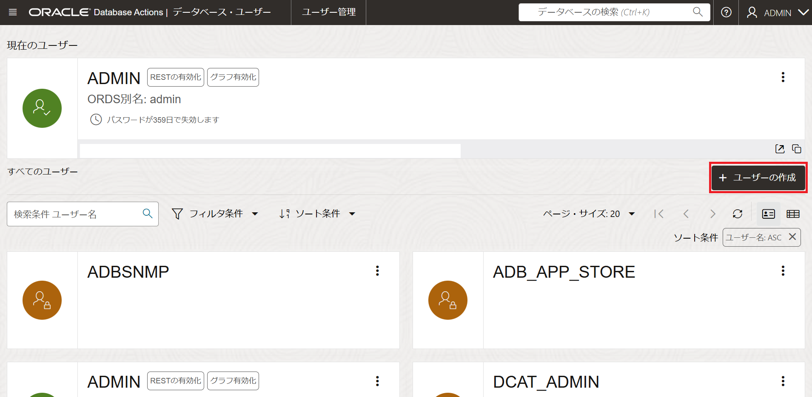

3．ユーザータブで以下の通りに入力をします。
- ユーザー名：TEXTUSER
- パスワード：任意（例：Welcome12345#）
- 表領域の割当て制限：UNLIMITED
- Webアクセス：オン

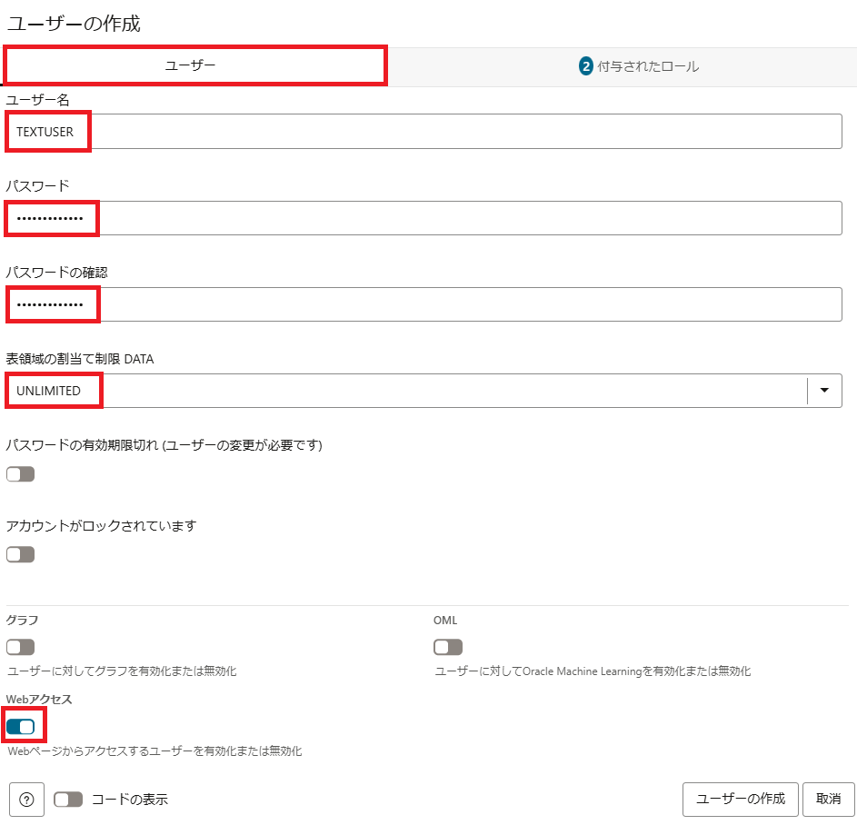

4．付与されたロールタブをクリックし、CTXAPPと検索します。CTXAPPというロールの付与済みとデフォルトにチェックを入れます。

CTXAPPロールを付与する事によって、Oracle Textが提供するPL/SQLパッケージの実行権限など、Oracle Textの索引作成に必要な権限が付与されます。

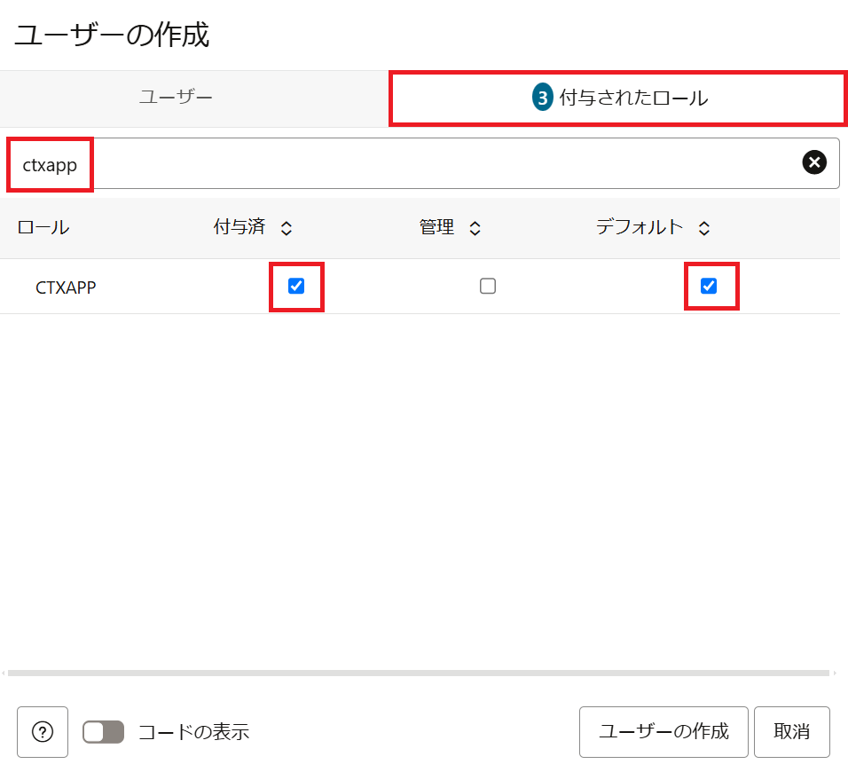

5．同じようにDWROLEと検索し、DWROLEも付与済みとデフォルトにチェックを入れます。付与されたロールの隣に4と表示されていることを確認し、ユーザーの作成をクリックします。

DWROLE内にデータ・ロードに必要な権限が含まれています。

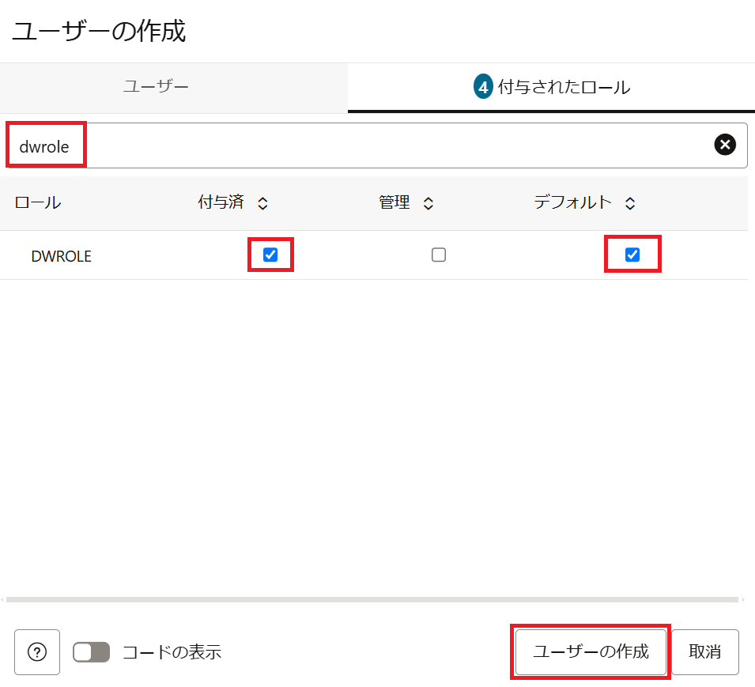

6．これでTEXTUSERを作成する事が出来ました。画面右上から**サインアウト**をクリックし、Database Actionsからサインアウトします。
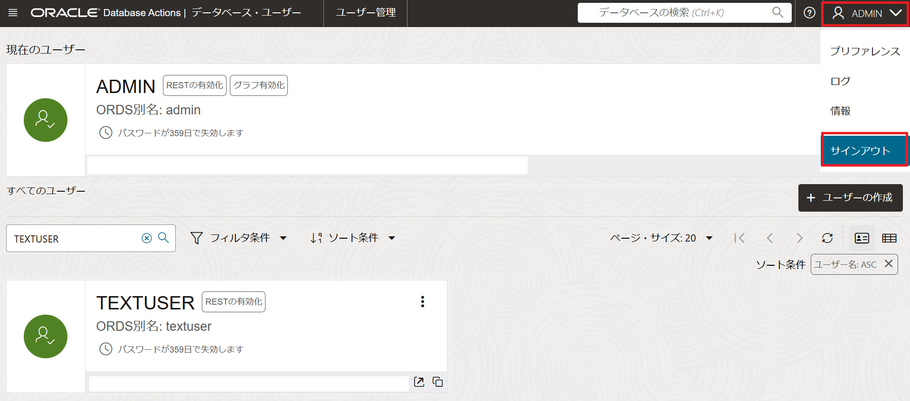

7．作成したTEXTUSERとしてDatabase Actionsへログインします。


8．**Data Studio**タブの**データ・ロード**をクリックします。
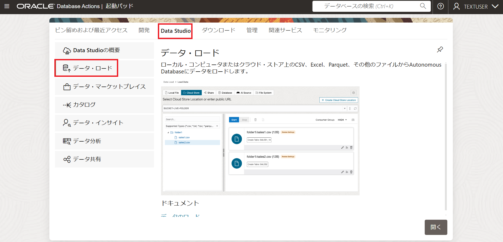

9．**データのロード**をクリックします。


10．CSVファイルから新規表を作成します。先程ダウンロードした以下のCSVファイルをアップロードし、**開始**をクリックします。

  + [TextSample1.csv](TextSample1.csv)
  + [TextSample2.csv](TextSample2.csv)

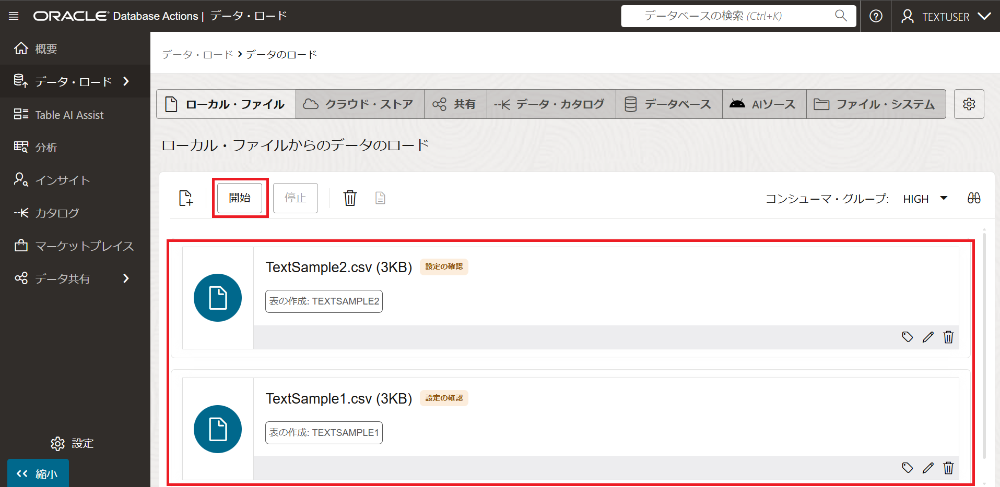

11．CSVファイルを基に表を２つ作成する事が出来ました。
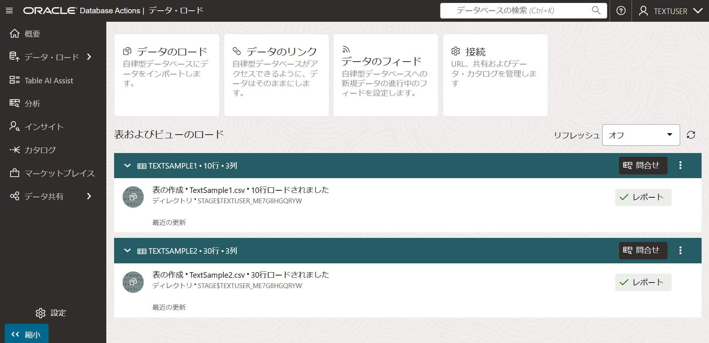

12．作成した表の中身を確認してみます。画面左上のメニューバーをクリックし、**SQL**を選択します。
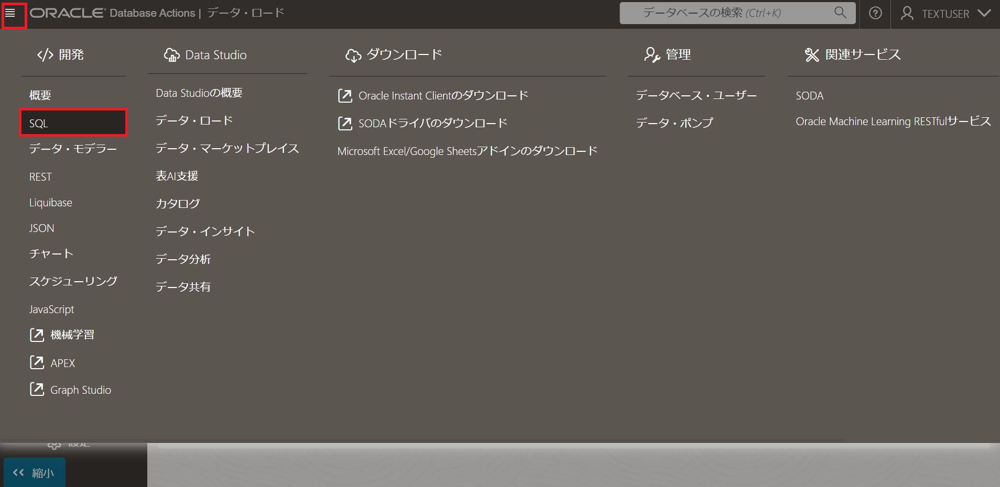

13．SQLワークシートが表示されるので、以下のクエリを貼り付け実行します。
```sql
SELECT
    PRODUCT_ID,
    PRODUCT_NAME,
    DESCRIPTION
FROM
    TEXTUSER.TEXTSAMPLE1;
```
出力：
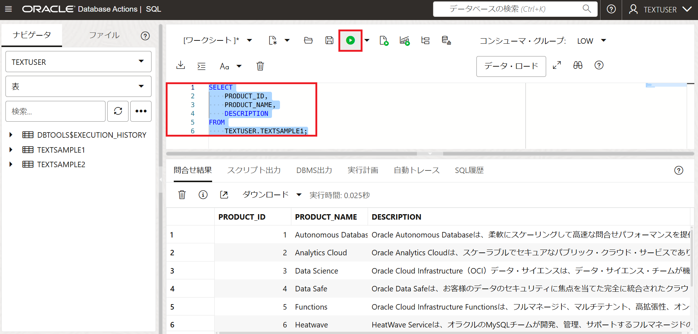

TEXTSAMPLE1表の中のデータを確認することが出来ました。Autonomous DatabaseやAnalytics Cloud等、オラクルの各製品の説明文が格納されています。

14．テキスト索引を作成する前に、まずはレクサーの設定を行います。
レクサーは文字列をトークンという細かい単位に分割してくれるものです。レクサーの選定は全文検索の精度に影響するため、非常に重要になります。

以下のPL/SQLプロシージャを実行：
```sql
begin
    ctx_ddl.create_preference('lexerpref1','JAPANESE_VGRAM_LEXER');
    ctx_ddl.set_attribute('lexerpref1','BIGRAM','TRUE');
end;
/
```
出力：
```sql
PL/SQLプロシージャが正常に完了しました。
経過時間: 00:00:00.613
```

本チュートリアルでは**JAPANESE_VGRAM_LEXER**を使用しますが、他にも**JAPANESE_LEXER**など使用する言語に合わせて様々なレクサーから選択することが出来ます。


15．次に、テキスト索引を作成します。データストア型を**DIRECT_DATASTORE**とし、単一列のドキュメントとして索引付けします。更新頻度は**COMMIT毎**と設定します。

以下のクエリを実行：
```sql
create search index SAMPLE_TXTIDX on TEXTSAMPLE1(DESCRIPTION) for text parameters('DATASTORE CTXSYS.DIRECT_DATASTORE LEXER lexerpref1 SYNC (ON COMMIT)');
```
出力：
```sql
Index SAMPLE_TXTIDXは作成されました。
経過時間: 00:00:04.036
```

16．索引を作成する事が出来たので、クエリしてみたいと思います。製品のDESCRIPTIONに**マネージド**という文字列のある製品を検索します。

以下のクエリを実行：
```sql
select PRODUCT_ID, PRODUCT_NAME, DESCRIPTION, score(1) from TEXTSAMPLE1 where contains (DESCRIPTION, 'マネージド',1) >0 order by score(1) desc;
```
出力:


文字列の中に**マネージド**と記載のある製品が表示されました。DESCRIPTIONを確認すると、全ての製品に**マネージド**という文字列が入っています。全ての製品に**マネージド**という文字列が1回ずつ入っているので、スコアは全ての製品で5になっています。

17．他の文字列で検索してみます。

以下のクエリを実行：
```sql
select PRODUCT_ID, PRODUCT_NAME, DESCRIPTION, score(1) from TEXTSAMPLE1 where contains (DESCRIPTION, 'セキュリティ',1) >0 order by score(1) desc;
```
出力:


文字列の中に**セキュリティ**と記載のある製品が表示されました。**Zero Trust Packet Routing**には**セキュリティ**という文字列が2回入っているので、**Zero Trust Packet Routing**のスコアは10になっています。


18．次に、1語以上のワードが組み合わさった文字列で検索を行います。製品のDESCRIPTIONに**OCIで使えるデータベース**と書いてある製品を検索します。

以下のクエリを実行：
```sql
select PRODUCT_ID, PRODUCT_NAME, DESCRIPTION, score(1) from TEXTSAMPLE1 where contains (DESCRIPTION, 'OCIで使えるデータベース',1) >0 order by score(1) desc;
```
出力:
```sql
データが見つかりません
```
製品のDESCRIPTIONに**OCIで使えるデータベース**と書いてある製品はありませんでした。


19．**OCI**と**データベース**で分けて、この２つの文字列を含む製品を探してみます。**AND**を使用して、**OCI**と**データベース**という２つの文字列を含む製品を検索します。

以下のクエリを実行：
```sql
select PRODUCT_ID, PRODUCT_NAME, DESCRIPTION, score(1) from TEXTSAMPLE1 where contains (DESCRIPTION, 'OCI and データベース',1) >0 order by score(1) desc;
```
出力:


製品のDESCRIPTIONに**OCI**と**データベース**という２つの文字列を含む製品を見つけることが出来ました。


20．ABOUT句を使用して、製品のDESCRIPTIONに**OCIで使えるデータベース**に近いことが書いてある製品を探してみます。

以下のクエリを実行：
```sql
select PRODUCT_ID, PRODUCT_NAME, DESCRIPTION, score(1) from TEXTSAMPLE1 where contains (DESCRIPTION, 'ABOUT(OCIで使えるデータベース)',1) > 50 order by score(1) desc;
```
出力:


**OCIで使えるデータベース**と書いてある製品はありませんが、それに近しい事が書かれている製品を見つけることが出来ました。このようにABOUT句を使うと、検索するキーワードが含まれていなくても意味的に近いワードでの検索が可能になります。

21．次に、TEXTSAMPLE2表を対象にテキスト索引を作成していきます。まずはTEXTSAMPLE2表の中身を確認します。

以下のSQLクエリを実行：
```sql
SELECT
    ID,
    TITLE,
    DESCRIPTION
FROM
    TEXTUSER.TEXTSAMPLE2;
```
出力:


22．今回は、複数列を検索対象とする**MULTI_COLUMN_DATASTORE**で索引作成を行います。TEXTSAMPLE2表のTITLE列とDESCRIPTION列の複数を定義したプリファレンスを定義します。

以下のPL/SQLプロシージャを実行：
```sql
BEGIN
ctx_ddl.create_preference('MY_MULTI',  'multi_column_datastore');
ctx_ddl.set_attribute('MY_MULTI',  'columns',  'TITLE, DESCRIPTION');
END;
/
```
出力:
```sql
PL/SQLプロシージャが正常に完了しました。

経過時間: 00:00:00.072
```


23．次に、TEXTSAMPLE2表にテキスト索引を作成します。作成したプリファレンスを指定し、更新頻度はCOMMIT毎と設定します。

以下のSQLクエリを実行：
```sql
create search index TEXTSAMPLE2_TXTIDX on TEXTSAMPLE2(DESCRIPTION) for text parameters('DATASTORE MY_MULTI LEXER lexerpref1 SYNC (ON COMMIT)');
```
出力:
```sql
Index TEXTSAMPLE2_TXTIDXは作成されました。

経過時間: 00:00:01.317
```

24．索引を作成する事が出来たので、クエリしてみたいと思います。コンテナという文字列のある製品を検索します。

```sql
select ID, TITLE, DESCRIPTION, score(1) from TEXTSAMPLE2 where contains (DESCRIPTION, 'コンテナ',1) >0 order by score(1) desc;
```
出力:


TITLE列とDESCRIPTION列の両方から検索できている事が分かります。


25．テキスト索引の同期頻度を確認してみます。1行レコードを挿入します。

以下のSQLクエリを実行：
```sql
INSERT INTO TEXTSAMPLE2 VALUES (31, 'データエンジニアリング入門', 'データパイプラインの設計とETLツールの活用方法を詳しく解説。');

commit;
```
出力:
```sql
1行挿入しました。
経過時間: 00:00:00.049


コミットが完了しました。
経過時間: 00:00:00.001
```


26．索引作成時に、索引の更新頻度をON COMMIT（コミット毎）と設定しているので、索引が更新されているはずです。

以下のSQLクエリを実行：
```sql
select ID, TITLE, DESCRIPTION, score(1) from TEXTSAMPLE2 where contains (DESCRIPTION, 'データエンジニアリング',1) >0 order by score(1) desc;
```
出力:


挿入したレコードが索引検索の結果として表示されました。

今回はON COMMITを選択しましたが、例えば大量更新を行う可能性のあるテーブルに対してテキスト索引を作るなら、MANUAL(手動更新、これがデフォルト)にしてデータ更新後にSYNC_INDEXを実行した方がテキスト索引の断片化を抑えられます。
断片化すると索引のサイズが必要以上に大きくなったり、検索性能も悪くなるため注意が必要です。


27．最後にOracle Text で上手く検索したいデータが検索されない場合は、分割されたトークンを確認できます。**DR$索引名$IテーブルのTOKEN_TEXT列**で確認できるので、もし検索したいワードがなければ、レクサーを変更してトークン分割の方法を変えてみるのも有効です。

以下のSQLクエリを実行：
```sql
SELECT
    TOKEN_TEXT
FROM
    TEXTUSER.DR$TEXTSAMPLE2_TXTIDX$I;
```
出力:


<BR>

本チュートリアルではOracle Database の全文検索機能であるOracle Text の基本的な使い方をご紹介しました。ここでご紹介した内容以外にも、ファイルをデータストアとしてテキスト索引を作成したり、類義語か関連語を定義して検索範囲を拡げられるシソーラス機能、VoC分析に使える感情分析機能などたくさんの機能が備わっています。ぜひ試してみてください。

<a id="anchor3"></a>

# 3. 参考資料

+ [Oracle Text 詳細解説](https://www.oracle.com/jp/a/tech/docs/technical-resources/oracletext-ver12.pdf)