## はじめに

**Oracle Base Database Service**（**BaseDB**）は、<br>Oracle Cloud Infrastructure 上で稼働する Oracle AI Database の PaaS サービスです。<br>

オンプレミスと同じ Oracle AI Database ソフトウェアをクラウド上で利用でき、<br>**従来通りすべてのデータベースサーバーの管理権限（OS の root 権限を含む）や、<br>データベース管理者権限を保持**できます。

この章では、既存の仮想クラウド・ネットワーク（VCN）に新たなデータベースサービスを作成する手順を紹介します。



- [Oracle Cloud Infrastructure チュートリアル](../../beginners/creating-vcn/) を参考に、<br>仮想クラウド・ネットワーク(VCN)の作成が完了していること
- BaseDB の作成にはサービス・ゲートウェイが VCN に作成されている必要があります。
  


チュートリアル内の画面ショットは、Oracle Cloud Infrastructure の現在のコンソール画面と異なる場合があります。

<br>

**所要時間 :** 約 30 分

<br>
<a id="anchor1"></a>

## 1. DB システムの作成

1. ナビゲーション・メニューから **Oracle AI Database → Oracle Base Database Service** を選択します。

   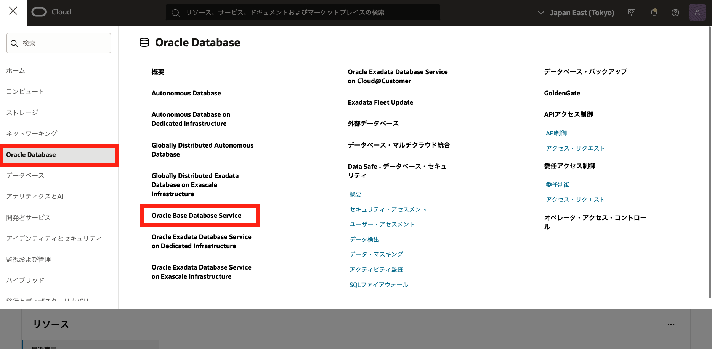

2. DB システムの一覧ページで有効な管理権限を持つコンパートメントとリージョンを選択し、**DB システムの作成** ボタンをクリックします。すると、BaseDB の作成画面に遷移します。

   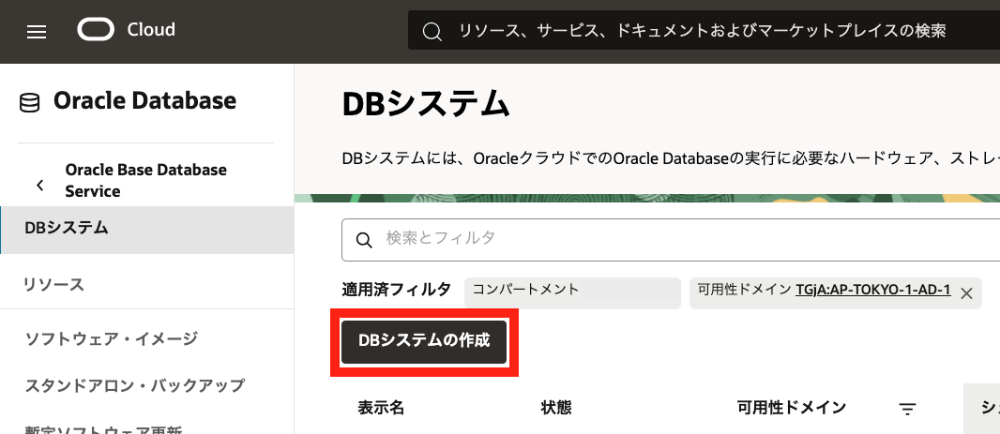

3. 表示された **DB システムの作成** ウィンドウに、以下の項目を入力します。  
   ※がついている入力項目は課金に関係する項目です。

   - **[必須] DB システム名** - 任意の名前を指定します。<br>DB システムの名称として表示され、プロビジョニング後の変更はできません。
   - **[必須] コンパートメント** - [必須] BaseDB を作成するコンパートメントを指定します。<br>（集合ハンズオン環境の場合は講師の指示に従ってください）
   - **[必須] 可用性ドメイン** - BaseDB を作成する可用性ドメインを指定します。<br>選択できる可用性ドメインはリージョンにより異なります。<br>（集合ハンズオン環境の場合は講師の指示に従ってください）
   - **[必須] Oracle AI Database ソフトウェア・エディション**   
     下記エディションより 1 つ選択します。利用できる機能はエディションごとに異なります。<br>プロビジョニング後の変更はできません。
     - **Standard Edition** - 標準的なエディションです。
     - **Enterprise Edition** - 拡張機能を含むエディションです。
     - **Enterprise Edition - High Performance** - 高性能向けのエディションです。
     - **Enterprise Edition - Extreme Performance** - 最高性能向けエディションです。
     - **Enterprise Edition - Developer** - 開発者向けのエディションです。
   - **[必須] シェイプ**  - 任意に選択できます。<br>（集合ハンズオン環境の場合は VM.Standard2.1 を指定してください）<br>選択したシェイプによりメモリやネットワーク帯域幅が自動決定されます。

     > **シェイプの選択時には、利用している環境のサービス・リミットにご注意ください。<br>初期状態でリミットが 0 の場合、作成できないシェイプもあります。<br>サービス・リミットについては [OCI コンソールにアクセスして基本を理解する - Oracle Cloud Infrastructure を使ってみよう (その 1)](../../beginners/getting-started/) の内容もご確認ください。**

     > **Real Application Clusters (RAC)** 環境を構築する場合は、<br>**Enterprise Edition - Extreme Performance**、**適切なシェイプ**、<br>**Grid Infrastructure** が必要です。<br>BaseDB では 2 ノード構成の RAC 環境を構築できます。

     その他シェイプの情報は[Oracle Base Database Service 技術詳細](https://speakerdeck.com/oracle4engineer/basedb-tech-detail?slide=8)も参照ください。

   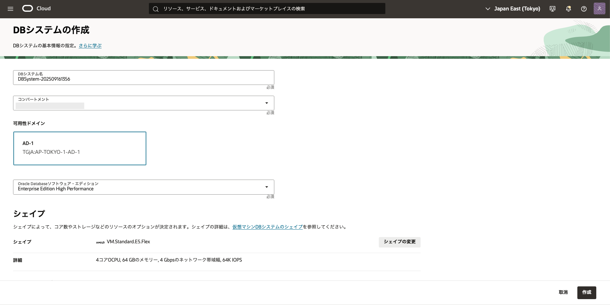

   - **[必須] ストレージ管理ソフトウェア** - 下記いずれかから選択します。

     - **論理ボリューム・マネージャ**<br>Linux 標準のボリューム管理です。高速な Single 構成に最適です。
     - **Oracle Grid Infrastructure**<br>Oracle のストレージ管理ソリューションです。一部エディションでは 2 ノード RAC 構成も可能です。

   - **[必須] ストレージのパフォーマンス**  - 下記のいずれかを選択します。

     - **より高いパフォーマンス**<br>大規模データベースなど、可能な限り高いパフォーマンスが必要な <br>IO 負荷の高いワークロード向けです。
     - **バランス**<br>ブートディスクや多くの標準的なワークロード向けで、ランダム I/O を含みます。

   - **[必須] 使用可能なデータ・ストレージ**  - データ・ストレージ容量を選択します。<br>今回はデフォルト値の**256**を指定してください。プロビジョニング後の変更はできません。

   - **[必須] DB システム構成**  - 1 または 2 を選択してノード数を指定します。<br>プロビジョニング後の変更不可。

     - Single 構成は**1**を、2 ノード RAC 構成は**2**を選択してください。

     > **Real Application Clusters (RAC)** 環境の構築には、<br>**Enterprise Edition - Extreme Performance**、適切なシェイプ、<br>Grid Infrastructure が必要です。BaseDB では 2 ノード構成の RAC も可能です。

   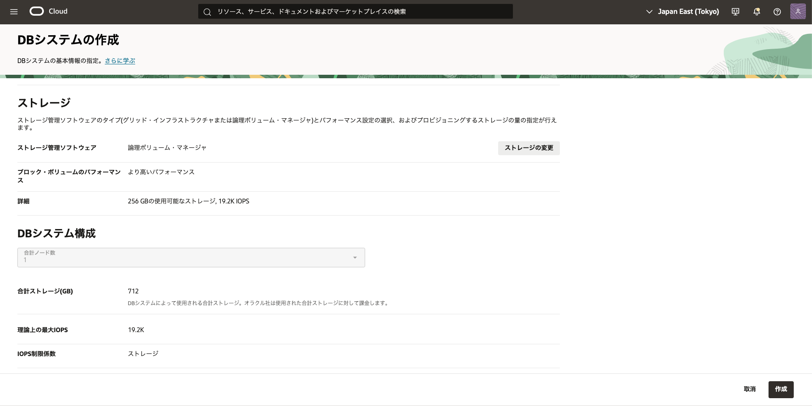

   - **[必須] SSH キー** - SSH 接続用の公開鍵・秘密鍵を登録または作成します。

     - **SSH キー・ペアの生成**<br>新規に生成する方法です。
     - **SSH キー・ファイルのアップロード**<br>お手持ちの公開鍵ファイルをアップロードできます。
     - **SSH キーの貼付け**<br>クリップボードから直接貼り付けできます。

   - **[必須] ライセンス・タイプ**  - 下記いずれかを選択します。

     - **ライセンス込み**<br>新規の Oracle AI Database ソフトウェア・ライセンスとデータベースサービスを<br>サブスクライブします。
     - **ライセンス持込み(BYOL)**<br>手持ちの Oracle AI Database ソフトウェア・ライセンスを利用できます。

   - **[必須] 仮想クラウド・ネットワーク**<br>第 2 章で作成した仮想クラウド・ネットワークを選択します。<br>プロビジョニング後に変更不可。
   - **[必須] クライアントのサブネット** - 任意のサブネットを選択します<br>（本ハンズオンではパブリックサブネットを選択してください)<br>プロビジョニング後の変更不可

   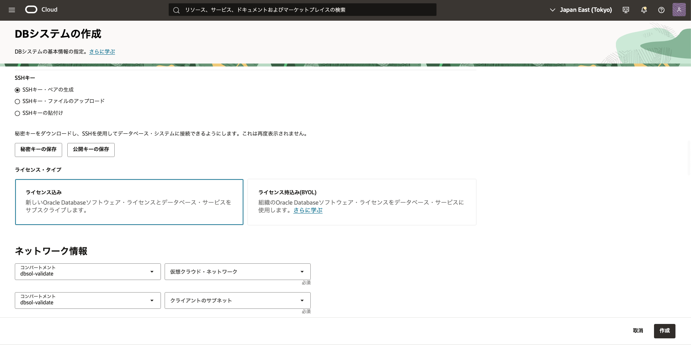

   - **[オプション] ネットワーク・セキュリティ・グループを使用してトラフィックを制御**<br>1 つ以上のネットワーク・セキュリティ・グループ(NSG)に BaseDB を追加する際に<br>利用します。今回はデフォルトのままオフにしてください。

   - **[必須] ホスト名接頭辞**<br>ホスト・ドメイン名の接頭辞として使う任意の文字列です（プロビジョニング後の変更不可）

   - **[自動] ホストおよびドメイン URL**<br>ホスト名接頭辞およびホスト・ドメイン名から自動表示されます。

   - **[必須] IPv4 アドレス割当て** - 下記から選択できます。

     - **サブネットから IPv4 アドレスを自動的に割り当てます**<br>サブネットから自動割当てされます。
     - **IPv4 アドレスの手動割当て**<br>手動で指定できます。

   - **[オプション] 診断収集** - 以下のいずれかを有効化できます。<br>ユーザーと Oracle Cloud Operations は、これにより問題の特定や解決が迅速になります。
     - **診断イベントの有効化**
     - **ヘルス・モニターを有効にする**
     - **インシデント・ログとトレース収集の有効化**

   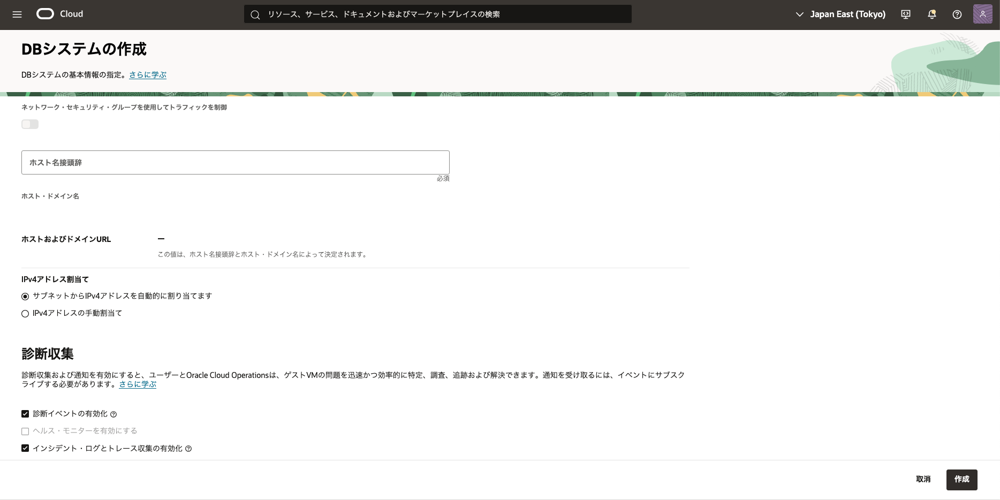

   - **[オプション] 拡張オプションの表示**<br>拡張オプションを表示することで、以下が設定できます。

     - **管理**<br>フォルト・ドメインやタイムゾーンの指定ができます。

     - **セキュリティ**<br>セキュリティ属性の追加や ZPR ポリシーでリソースへのアクセスを制御できます。

     - **タグ**<br>フリーフォーム・タグや定義済タグでリソースを整理できます。

   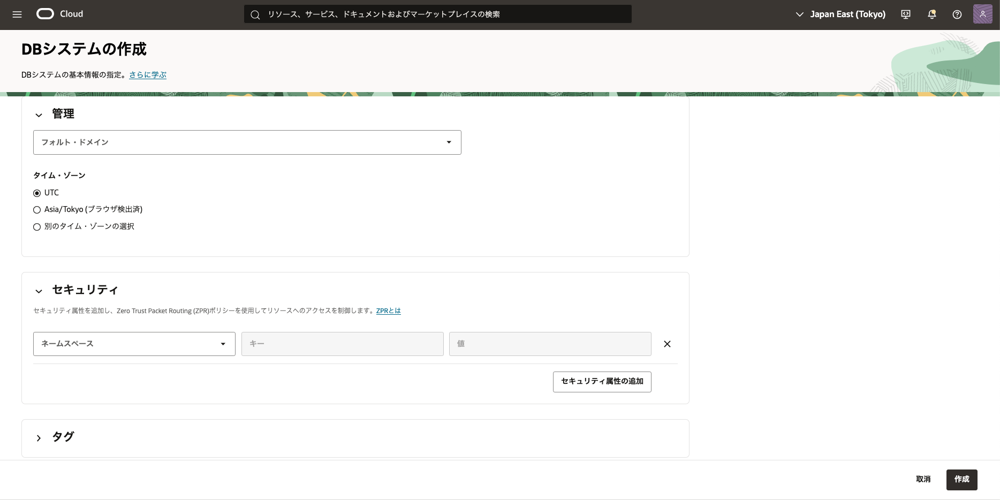

   - **[必須] データベース名**<br>任意のデータベース名を指定します（変更不可）

   - **[オプション] 一意のデータベース名の接尾辞**<br>DB_UNIQUE_NAME の接頭辞となる任意の名前を指定します（変更不可）

   - **[オプション] 統合監査**<br>統合監査を有効化するか選べます。<br>すべてのコンポーネントの監査証跡が統合されます。<br>今回は無効のままです。23ai を利用する場合は、自動でで有効化されます。

   - **[必須] データベースのバージョン**<br>バージョンを今回 19c としてください。<br>利用可能なバージョンはシェイプによって異なります。

   - **[必須] PDB 名**<br>プラガブル・データベースの名前を指定します（変更不可）

   - **[必須] パスワード**<br>任意のパスワードを設定します（sys スキーマ用。例: WelCome123#123# ※必ずメモしてください）

   - **[オプション] 管理者パスワードを TDE ウォレットに使用**<br>今回はデフォルト（有効）のままにします。

   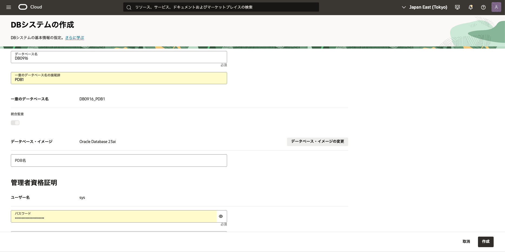

   - **[オプション] 自動バックアップの有効化** <br>Oracle AI Database の自動バックアップサービスです。<br>今回はオフのままとします（任意で有効化可能）
     > 詳しい手順は [107: Autonomous Recovery Service (RCV/ZRCV) をセットアップしよう](../dbcs104-backup/) をご確認ください。

   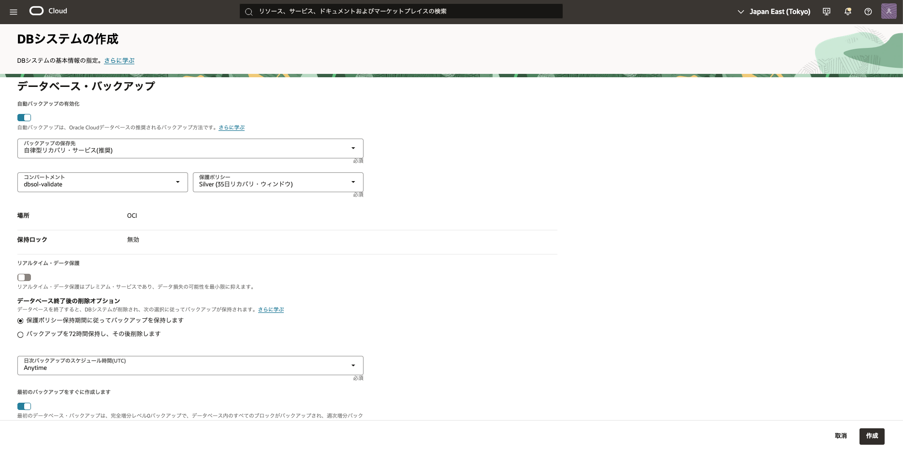

   - **[オプション] 拡張オプションの表示** - 押下すると下記の設定ができます（文字コードを選択できることを確認してください）。
     - **管理** - 文字セットや多国語文字セットを指定できます。
     - **暗号化** - キー管理方法（Oracle 管理キー/顧客管理キー）を選択できます。
     - **タグ** - フリーフォーム・タグや定義済タグでリソースを整理できます。

   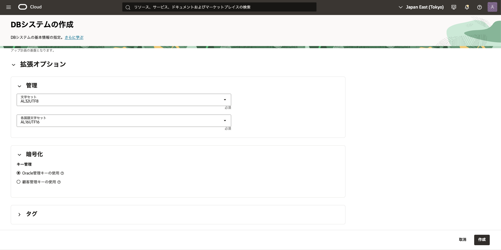

   すべての入力が完了したら、**作成**をクリックします。DB システムの作成がバックグラウンドで開始され、「プロビジョニング中」から「使用可能」に変われば準備完了です。

   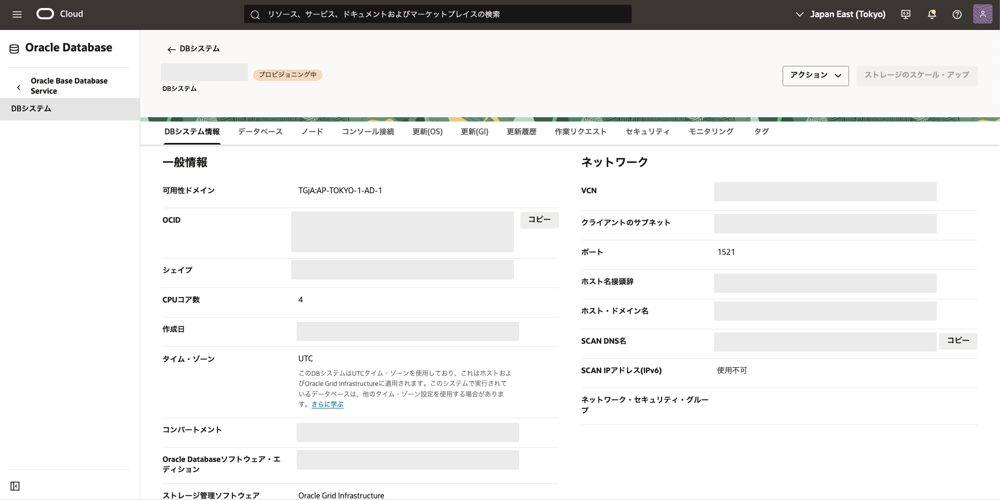

<br>

## 2. DB システムへのアクセス

作成した DB システムへ SSH でアクセスします。

1. DB システム詳細画面の「ノード」タブで、**パブリック IP アドレス**をメモします。

   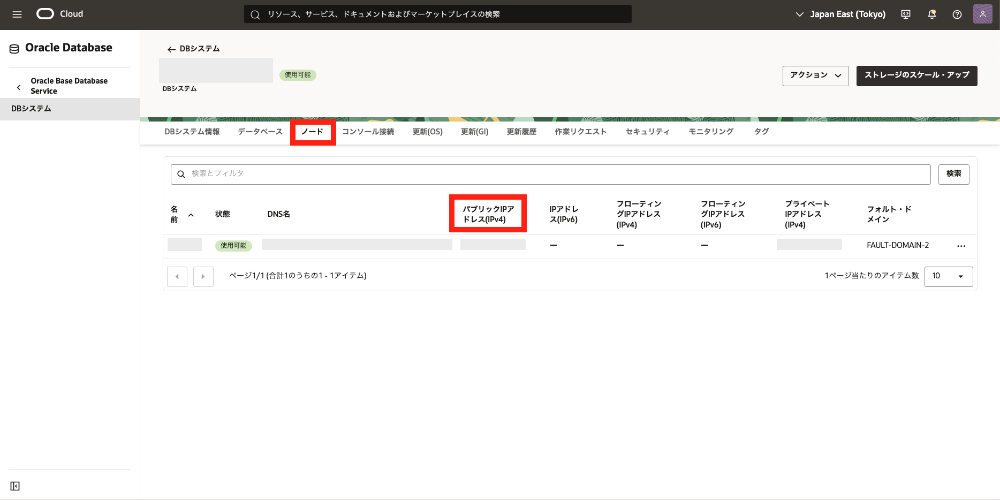

2. 任意のターミナルソフトを起動し、以下の情報で ssh 接続します。

   - **IP アドレス** - 上で確認したパブリック IP アドレス
   - **ポート** - 22 (デフォルト)
   - **ユーザー** - opc（DB システム作成時に準備されています）
   - **SSH 鍵** - 作成時に使用した秘密鍵（集合ハンズオンの場合は講師の案内する鍵を使用）
   - **パスフレーズ** - 秘密鍵にパスフレーズが設定されていれば入力してください（集合ハンズオンでは未設定です）

   接続が成功すると、下記のように opc ユーザーでインスタンスにログインできます。

   ```sh
   $ ssh opc@<IPアドレス> -i <秘密鍵ファイルのパス>
   Last login: Tue Sep 16 06:39:47 2025 from 58.157.55.63
   [opc@BaseDB ~]$
   ```

opc ユーザーは sudo で root 権限を取得可能です。
また、入力した情報にもとづき Oracle AI Database の作成・起動状況を確認できます。

```sh
[opc@BaseDB ~]$ sudo su -
Last login: Tue Sep 16 04:17:56 UTC 2025
Last failed login: Tue Sep 16 06:42:55 UTC 2025 from 193.46.255.244 on ssh:notty
There were 724 failed login attempts since the last successful login.
[root@BaseDB ~]# id
uid=0(root) gid=0(root) groups=0(root)
[root@BaseDB ~]# ps -ef | grep mon_
oracle   20648     1  0 03:32 ?        00:00:00 ora_pmon_DB0815
oracle   20712     1  0 03:32 ?        00:00:00 ora_smon_DB0815
oracle   20732     1  0 03:32 ?        00:00:00 ora_dmon_DB0815
oracle   20738     1  0 03:32 ?        00:00:00 ora_mmon_DB0815
oracle   20746     1  0 03:32 ?        00:00:00 ora_tmon_DB0815
root     45945 45684  0 06:44 pts/0    00:00:00 grep --color=auto mon_
[root@BaseDB ~]#
```

DB システムには管理用コマンド dbcli が用意されています。
root ユーザーの PATH には dbcli の場所が登録されています。
下記コマンドで DB システム情報を確認します。

```
[root@BaseDB ~]# dbcli describe-system

DbSystem Information
----------------------------------------------------------------
                     ID: 5377e621-xxxxxxxxxxxxxxxxxxxxxxxxxxx
               Platform: Vmdb
        Data Disk Count: 0
         CPU Core Count: 4
                Created: August 15, 2025 at 6:11:46 AM UTC

System Information
----------------------------------------------------------------
                   Name:
            Domain Name: sub10xxxxxxxxxxxxxxxxxxxxxxxxxxxxx.com
              Time Zone: UTC
             DB Edition:
            DNS Servers:
            NTP Servers: 169.xxx.xxx.xxx

Disk Group Information
----------------------------------------------------------------
DG Name                   Redundancy                Percentage
------------------------- ------------------------- ------------

[root@primary ~]#
```

また、以下のコマンドで、データベースの一覧を閲覧します。

```
[root@BaseDB ~]# dbcli list-databases

ID                                       DB Name    DB Type  DB Version           CDB        Class    Shape    Storage    Status        DbHomeID
---------------------------------------- ---------- -------- -------------------- ---------- -------- -------- ---------- ------------ ----------------------------------------
6a31exxxxxxxxxxxxxxxxxxxxxxxxxxxxxxx     DB0815     Si       19.28.0.0.0          true       Oltp              LVM        Configured   448f0xxxxxxxxxxxxxxxxxxxx
[root@BaseDB ~]#
```

dbcli のその他のコマンドの詳細については、dbcli --help または [Oracle AI Database CLI Reference](https://docs.oracle.com/ja-jp/iaas/Content/Database/References/dbacli.htm) をご確認ください。
<br>
<a id="anchor3"></a>

# 3. データベース（PDB）にアクセス

作成したデータベースにログインしてみましょう。

上記で作成した DB システムでは、1 つのコンテナ・データベース(CDB)上に、デフォルトで 1 つプラガブル・データベース（PDB）が作成されます。

ここでは、PDB 上にスキーマを一つ作成しましょう。

上記手順にて、BaseDB の OS に root ユーザーでログインしていることを前提にします。

1. root ユーザーから oracle ユーザにスイッチします。

```
[root@BaseDB ~]# su - oracle
Last login: Tue Sep 16 06:49:41 UTC 2025
[oracle@BaseDB ~]$
```

2. sys ユーザーで CDB にログインします。

```
[oracle@BaseDB ~]$ sqlplus / as sysdba

SQL*Plus: Release 19.0.0.0.0 - Production on Tue Sep 16 06:50:48 2025
Version 19.28.0.0.0

Copyright (c) 1982, 2025, Oracle.  All rights reserved.


Connected to:
Oracle Database 19c EE High Perf Release 19.0.0.0.0 - Production
Version 19.28.0.0.0

SQL>
```

3. デフォルトで作成されている PDB を確認後、PDB インスタンスに接続します。（例：PDB1）

```
SQL> show pdbs

    CON_ID CON_NAME			  OPEN MODE  RESTRICTED
---------- ------------------------------ ---------- ----------
	 2 PDB$SEED			  READ ONLY  NO
	 3 PDB1 			  READ WRITE NO

SQL> alter session set container = PDB1;

Session altered.

SQL>
```

4. PDB 上にスキーマを作成します。<br>尚、ここでは便宜上、最低限必要な権限を付与していますが、要件に応じて権限・ロールを付与するようにしてください。

```
SQL> create user TESTUSER identified by WelCome123#123# ;

User created.

SQL> grant CREATE SESSION,CONNECT,RESOURCE,UNLIMITED TABLESPACE to TESTUSER ;

Grant succeeded.

SQL> exit
Disconnected from Oracle Database 19c EE Extreme Perf Release 19.0.0.0.0 - Production
Version 19.28.0.0.0
[oracle@BaseDB ~]$
```

<br>

<a id="anchor4"></a>

# 4. PDB 上のスキーマにアクセスしましょう

次に作成したスキーマにアクセスしてみましょう。

一般的には tnsnames.ora にエントリを追加してログインされることが多いかと思いますが、ここでは便宜上、簡易接続方式を利用し、作成した PDB 上のスキーマに直接アクセスしてみます。

1.  OS ユーザを **grid** に変更し、接続情報（ポート番号、サービス名）を確認します。<br> 以下では、例として lsnrctl を利用していますが、他の方法で確認いただいても OK です。

```
lsnrctl status
```

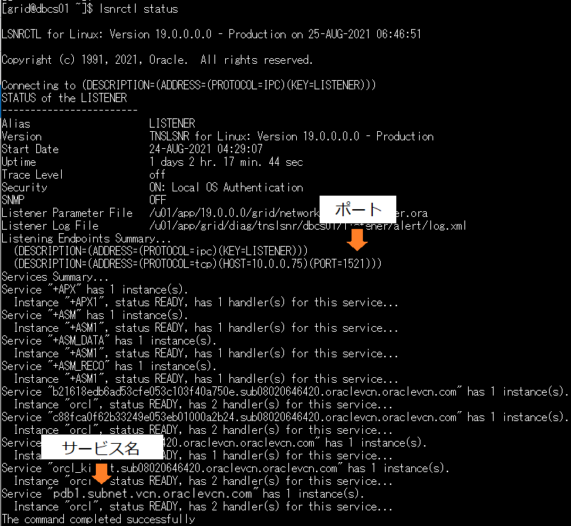

2.  上記で確認した値を利用して接続します。<br>SQL\*Plus を利用する場合は、以下のようにホスト名、ポート番号、サービス名を指定します。<br>
    （$ sqlplus <スキーマ名>/<パスワード>@<ホスト名>:<ポート>/<サービス名>）
    **<ホスト名>:<ポート>/<サービス名>**は DB システムの詳細画面 → データベースの詳細画面 →PDB の詳細画面 →PDB 接続を開き**簡易接続**からコピーできます。

```
[oracle@BaseDB ~]$ sqlplus testuser/WelCome123#123#@xxx.xxxxxxxx.xxxxivcn.oraclevcn.com:1521/PDB1.xxxxxx1xxxxx20.xxxxvcn.oraclevcn.com

SQL*Plus: Release 19.0.0.0.0 - Production on Tue Sep 16 07:07:02 2025
Version 19.28.0.0.0

Copyright (c) 1982, 2025, Oracle.  All rights reserved.


Connected to:
Oracle Database 19c EE Extreme Perf Release 19.0.0.0.0 - Production
Version 19.28.0.0.0

SQL> show user
USER is "TESTUSER"
SQL>
```

以上で、この章の作業は完了です。
