## はじめに

Oracle Base Database Service(BaseDB)では、Oracle Cloud Infrastructure 上で稼働する Oracle Database の PDB を OCI コンソールから停止や起動、既存 PDB からのクローン作成など、簡単に操作できます。この章では、実際にどのように操作するかを確認します。

<br>

**前提条件 :**

- [Oracle Cloud で Oracle Database を使おう](../dbcs101-create-db) を通じて Oracle Database の作成が完了していること

<br>

**注意**  
チュートリアル内の画面ショットは現在の画面と異なっている場合があります。

<br>

**目次**

- [1. PDB を起動・停止してみよう](#anchor1)
- [2. PDB を新規作成してみよう](#anchor2)
- [3. 既存 PDB からクローン PDB を作成してみよう](#anchor3)

<br>
**所要時間 :** 約15分

<a id="anchor1"></a>
<br>

## 1. PDB を起動・停止してみよう

まずは、コンソール上で作成済みの PDB を確認する画面への遷移、および PDB の起動・停止方法について確認しましょう。

<br>

1. コンソールメニューから **Oracle Database → Oracle Base Database Service** を選択し、操作したい PDB を持つ **DB システム** を選択します。

2. DB システムの一覧から対象のデータベースを選択します。

3. DB システムの詳細画面 → データベースの詳細画面へ進み、画面中央の **プラガブル・データベース** タブを選択します。  
   このタブ選択後、PDB 一覧画面が表示されます。この画面では **PDB1** が対象データベースに構成されています。

   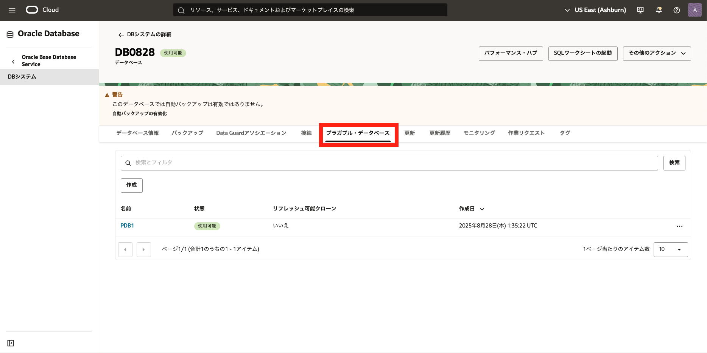

4. 操作したい PDB の右側にある「・・・」メニューから、起動や停止の操作ができます。  
   ※ここでは、**PDB1** の停止を行います。

   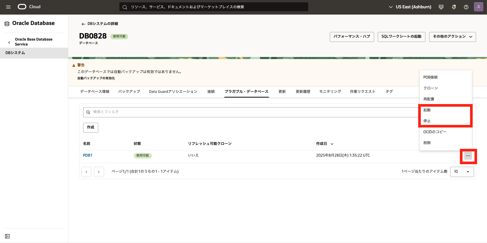

5. 確認画面が表示されるので、**PDB の停止**を選ぶと対象の PDB の **状態** が「更新中」になります。

   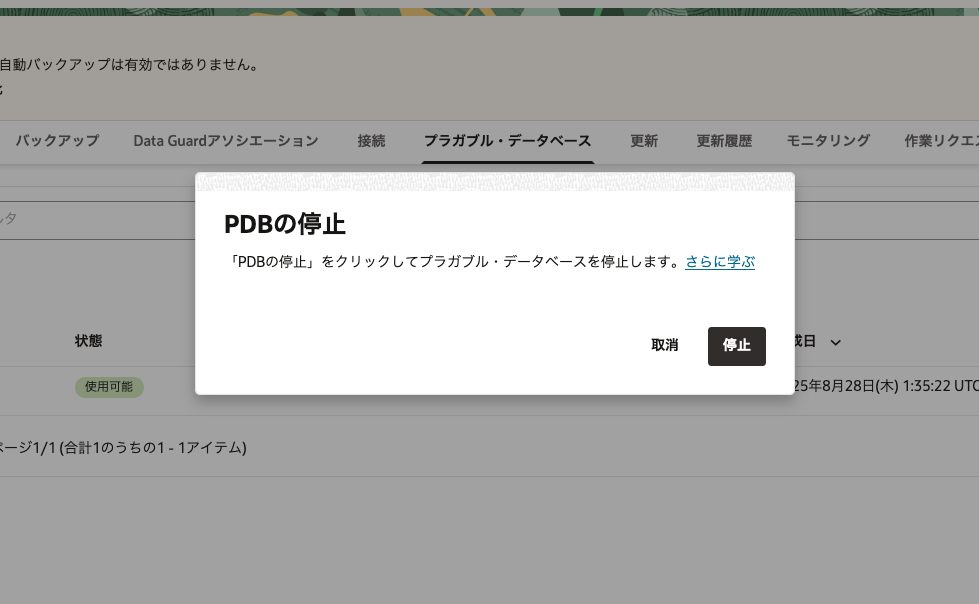

6. **状態** が「使用可能」に戻れば停止完了です。  
   同様の手順で「起動」を選択すると **PDB** を起動できます。

   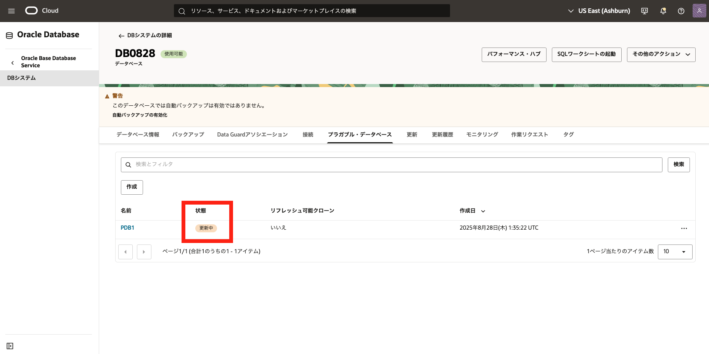

> なお、実際にデータベースへ接続して確認すると、**PDB1** が MOUNT 状態になっていることが分かります。
>
> ```
> SQL> show pdbs
>
>    CON_ID CON_NAME        OPEN MODE  RESTRICTED
> ---------- ------------------------------ ---------- ----------
>    2 PDB$SEED       READ ONLY  NO
>    3 PDB1           MOUNTED
> ```

<br>

<a id="anchor2"></a>

## 2. PDB を新規作成してみよう

次に、PDB を新規作成する手順を説明します。

1. 先ほどの画面から、**作成** を選択します。

   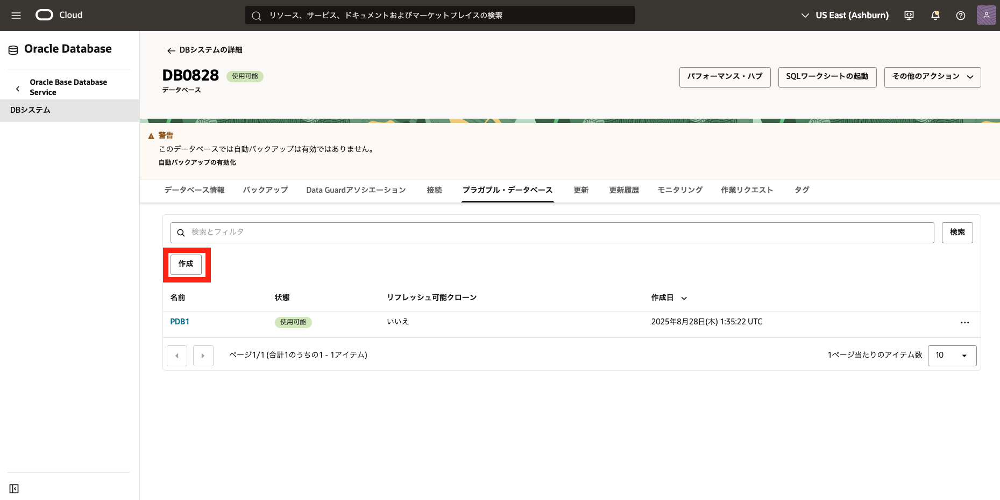

2. 表示された **プラガブル・データベースの作成** ウィンドウに以下の項目を入力します。

   - **PDB の名前** - 任意の名前を入力します（例 : pdb1）。
   - **PDB 管理パスワード** - 任意のパスワードを入力します（例 : WelCome123#123#）。
   - **データベースの TDE ウォレット・パスワード** - [101: Oracle Cloud で Oracle Database を使おう](../dbcs101-create-db) でデータベース作成時に設定したパスワードを入力します。

   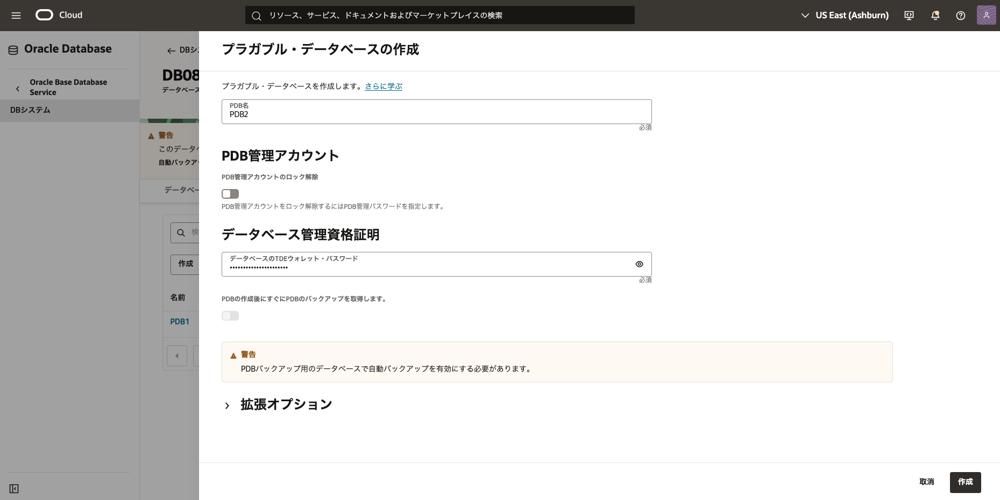

3. **プラガブル・データベースの作成** ボタンを押します。  
   （PDB の作成がバックエンドで開始し、作業完了後ステータスが「更新中」から「使用可能」に変わります）

   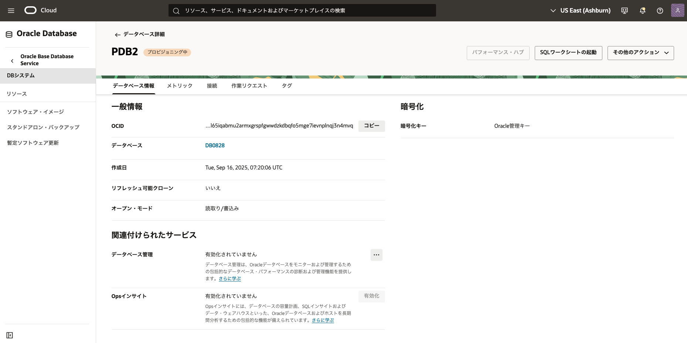

4. 画面上で新しい PDB の作成が確認できます（今回の例では PDB2 が追加されています）。

   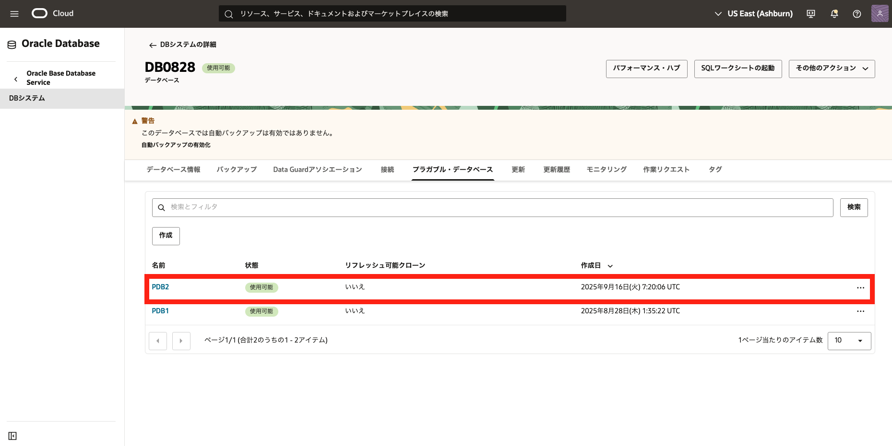

> データベースへ接続して確認すると、**PDB2** が READ WRITE モードで起動していることが分かります。
>
> ```
> SQL> show pdbs
>
>    CON_ID CON_NAME        OPEN MODE  RESTRICTED
> ---------- ------------------------------ ---------- ----------
>    2 PDB$SEED       READ ONLY  NO
>    3 PDB1           MOUNTED
>    4 PDB2           READ WRITE NO
> ```

<a id="anchor3"></a>

## 3. 既存 PDB からクローン PDB を作成してみよう

1. クローン元となる **PDB** の右側にある「・・・」メニューから、**クローン** を選択します。  
   ※この例では、**PDB2** をクローン元としています。

   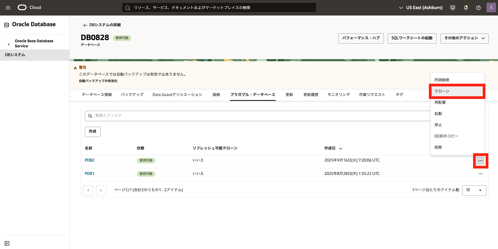

2. 表示された **PDB のクローニング** ウィンドウで下記項目を入力します。

   - **クローン・タイプ**
     - **ローカル・クローン** - 同じデータベース内にソース PDB のコピーを作成します。
     - **リモート・クローン** - 別のデータベースにソース PDB のコピーを作成します。
     - **リフレッシュ可能クローン** - 別のデータベースにソース PDB のリフレッシュ可能なコピーを作成します。
   - **宛先** - クローン先となるコンパートメントや DB システムの情報を選択します。
   - **PDB 名** - 任意の名前を入力します（例 : pdb3）。
   - **データベース SYS パスワード** - クローン対象 PDB の SYS パスワードを入力します（例 : WelCome123#123#）。
   - **データベースの TDE ウォレット・パスワード** - データベース作成時に設定したパスワードを入力します。

   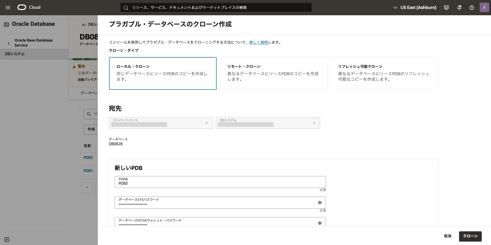

3. **PDB のクローニング** ボタンを押します。  
   （クローニングがバックエンドで開始され、作業完了後ステータスが「更新中」から「使用可能」に変わります）

   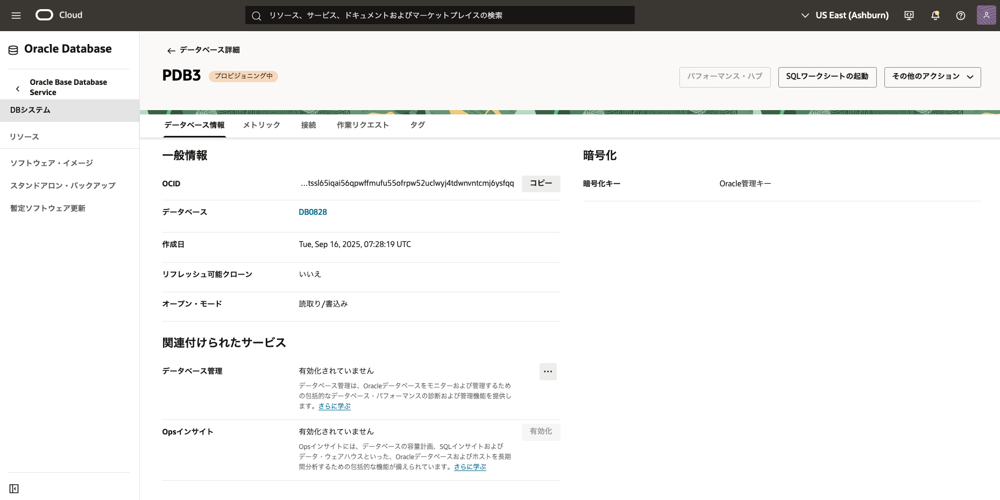

4. 画面上で新しくクローンされた PDB を確認できます（この例では PDB3 が作成されています）。

   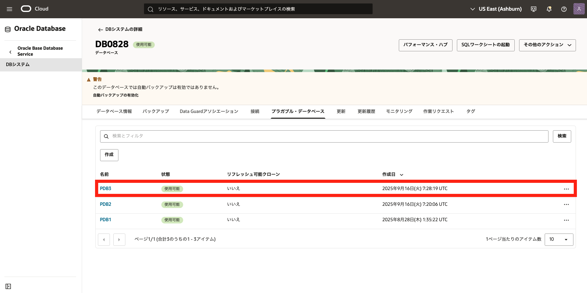

> 新規 PDB 作成時と同様にデータベースへ接続して確認すると、**PDB3** が READ WRITE モードで起動していることが分かります。
>
> ```
> SQL> show pdbs
>
>    CON_ID CON_NAME        OPEN MODE  RESTRICTED
> ---------- ------------------------------ ---------- ----------
>    2 PDB$SEED       READ ONLY  NO
>    3 PDB1           MOUNTED
>    4 PDB2           READ WRITE NO
>    5 PDB3           READ WRITE NO
> ```

以上で、この章の作業は終了です。

<br>
