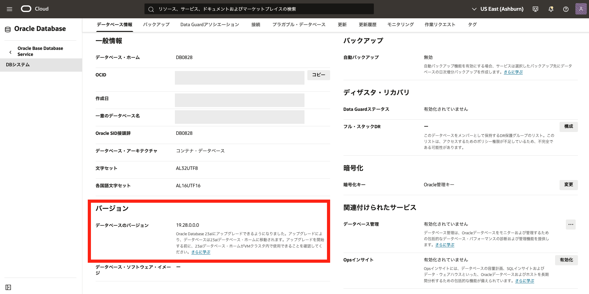

# はじめに

Oracle Base Database Service(BaseDB)では、OS 以上がユーザー管理となるため、ユーザー側でパッチ適用の計画と適用実施が可能です。
ここでは、**Grid Infrastructure**と**Oracle Database**に対するそれぞれのパッチ適用方法についてご紹介します。

 

**前提条件**

- [Oracle Cloud で Oracle Database を使おう](../dbcs101-create-db) を通じて Oracle Database の作成が完了していること

- パッチ適用対象の Oracle Database に対して最新 RU/RUR が適用されていないこと

**注意** チュートリアル内の画面ショットについては現在の画面と異なっている場合があります。

**所要時間:** 約 15 分

# 1. 現在のバージョンを確認しよう

まずは、コンソール上で作成済みの Grid Infrastructure と Oracle Database のバージョンを確認していきましょう。
 

1. ナビゲーション・メニューから **Oracle Database → Oracle Base Database Service** を選択します。 

2. DB システムの一覧から対象の DB システムを選択し、**DB システムの詳細** ページに移動します。  

3. DB システムの詳細ページの左下のセクションにある**バージョン**の**DB システム・バージョン** から**Grid Infrastructure**のバージョンを確認できます。

 

4. 次に**データベースのバージョン**を確認しましょう。 DB システムの詳細画面から「**データベース**」タブを開き、一覧表示されているデータベースの名前からバージョンを確認したいデータベースの名前を選択します。すると、**データベース詳細** ページに遷移します。 

   **データベース詳細** ページの左下**バージョン**セクションの**データベースのバージョン** から Oracle Database のバージョンを確認できます。
    

 

# 2. Grid Infrastructure にパッチを適用しよう

**Grid Infrastructure** の更新をしてみましょう。データベースの更新をする前に Grid Infrastructure の更新をすることが推奨されます。

1. **DB システムの詳細** ページで、「**更新**」のタブをを選択すると、適用可能な更新が表示されます。

2. 適用したい更新の右端の「・・・」を展開すると、「**事前チェック**」を選択できます。 
   この環境に適用できるかどうか(コンフリクトなど)をチェックが走ります。

**事前チェックの確認** 画面で「**事前チェックの実行**」をクリックすると事前チェックが開始されます。

事前チェック中は「**状態**」が「**チェック中**」となります。

チェックで問題がなければ、「**状態**」が**使用可能**になり、事前チェックを実施した日時が入力されます。

3. 事前チェックが成功したら、「**適用**」をしてみましょう。 
   適用したい更新の右端の「・・・」を展開し、「**パッチの適用**」をクリックします。 
   なお、Real Application Clusters で 2 ノード構成になっている場合は、ローリングで一台ずつ適用されます。 

更新の適用中は「**状態**」が「**適用中**」となります。

適用作業の進捗状況は「**作業リクエスト**」のタブから適用作業の進捗状況を見ることができます。 
より詳しい状況を確認したい場合は、「**操作**」の名前から詳細ページに遷移できます。

適用が完了すると DB システムの「**操作**」ステータス「**成功**」になります。 
DB システムも「使用可能」になり、**DB システム・バージョン**が適用した更新のバージョンに変わっている事が確認できます。

なお、DB システムに対する操作の履歴は「**変更履歴**」から確認できます。

 

# 3. Oracle Database にパッチを適用しよう

続いて、**Oracle Database** にパッチを適用していきましょう。

1. **DB システムの詳細**の「**データベース**」タブから更新したいデータベースの名前を選択し、**データベースの詳細画面**に遷移します。

2. **データベースの詳細画面**の左下の「**バージョン**」セクションの**データベースのバージョン**から現在のバージョンを確認できます。

3. **データベースの詳細画面** で、**更新**のタブをを選択すると、適用可能な更新が表示されます。

4. 適用したい更新の右端の「・・・」を展開すると、「**事前チェック**」を選択できます。 
   この環境に適用できるかどうか(コンフリクトなど)をチェックが走ります。

**事前チェックの確認** 画面で「**事前チェックの実行**」をクリックします。

事前チェック中は「**状態**」が「**チェック中**」となります。

チェックで問題がなければ、「**状態**」が**使用可能**になり、事前チェックを実施した日時が入力されます。

3. 事前チェックが成功したら、**適用**をしてみましょう。 適用したい更新の右端の「・・・」を展開し、「**データベース・ホーム更新の適用**」をクリックし、更新を適用します。 

「**確認**」画面から「**適用**」をクリックし、適用を開始します。 
なお、Real Application Clusters で 2 ノード構成になっている場合は、ローリングで一台ずつ適用されます。 

更新の適用中は「**状態**」が「**適用中**」となります。

適用の進捗状況は「**作業リクエスト**」のタブから適用作業の進捗状況を見ることができます。 
より詳しい状況を確認したい場合は、「**操作**」の名前から詳細ページに遷移できます。 

適用が完了すると DB システムの「**操作**」ステータス**成功**になります。
DB システムも「使用可能」になり、**DB システム・バージョン**が適用した更新のバージョンに変わっている事が確認できます。

なお、データベースに対する操作の履歴は「**変更履歴**」から確認できます。

# まとめ

BaseDB はパッチ適用のタイミングや適用するか否かの判断をユーザー側でできるという柔軟度はあります。 ただし、古いパッチのまま使い続けることはセキュリティ面や既知の不具合などのリスクや、環境の再作成が必要になった場合に古いイメージで新規作成ができないなどのリスクが考えられます。 その為、パッチを適用しない(塩漬け)でいいというわけではありませんので、定期的なパッチ適用を行っていただければ幸いです。

 
以上で、この章の作業は完了です。
