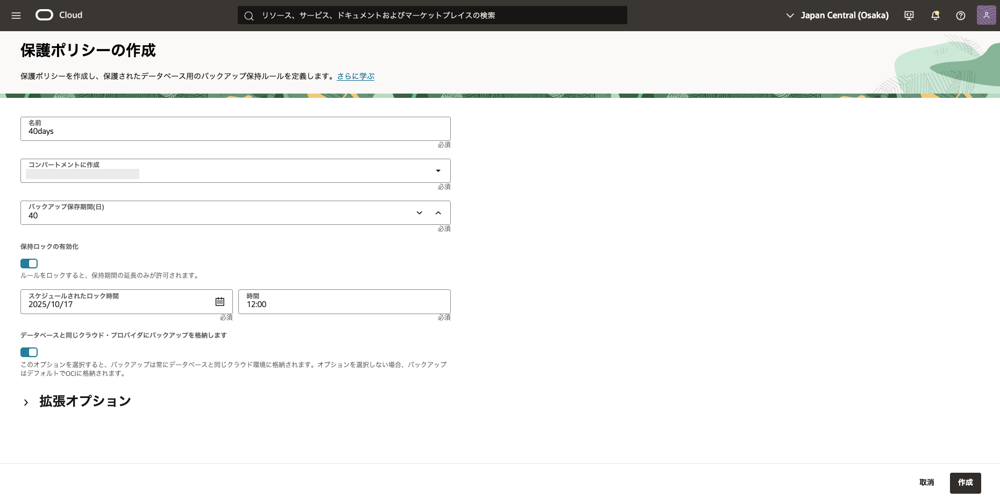
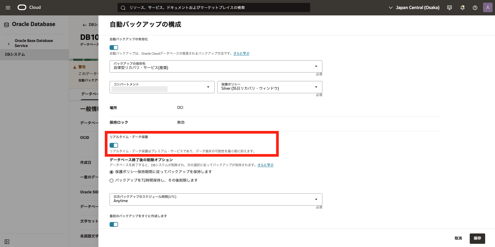

# はじめに

クラウドサービスを利用する際、万が一インスタンスやデータが損失・破損してしまった場合や、特定の時点にデータを戻したい場合に備えて、バックアップやリカバリの仕組みを確立することは非常に重要です。
BaseDB では、RMAN を利用した自動バックアップ機能により、最新の状態はもちろん、任意の過去の時点（Point in Time Recovery, PITR）へのリカバリが可能です。
さらに、**Oracle Database Autonomous Recovery Service（リカバリ・サービス）** は、Oracle Cloud Infrastructure (OCI) 上で Oracle AI Database 向けに設計されたフルマネージド型のデータ保護サービスです。オンプレミスの Zero Data Loss Recovery Appliance (RA) の技術を活用しつつ、クラウドならではの自動化とリアルタイム保護を実現し、業務継続性を強力にサポートします。

本章では、OCI コンソールから自動バックアップを構成するまでの手順についてご紹介します。
このチュートリアルでは、BaseDB にリカバリ・サービスを設定する手順についてご紹介します。  
このチュートリアルを完了すると、以下のような構成図となります。


<br>

**前提条件 :**
DB システム内(FRA)にとる場合など、CLI(dbcli)で設定する場合には、バックアップはコンソールからの管理対象外となります。

- [Oracle Cloud で Oracle AI Database を使おう](../dbcs101-create-db/index.md) を通じて Oracle AI Database の作成が完了していること

- Autonomous Recovery Service(RCV)を利用する場合、Oracle Database 19.16 以上

- Zero Data Loss Autonomous Recovery Service (ZRCV) を利用する場合、Oracle Database 19.18 以上

<br>

**注意** チュートリアル内の画面ショットについては現在の画面と異なっている場合があります。

<br>

<br>
**所要時間 :** 約40分
<br>

# 1. サービス制限の引き上げリクエスト


Autonomous Recovery Service (RCV/ZRCV) は全リージョンにデフォルトで以下のサービス制限が付与されています。 これらの容量以上にリソースが必要な場合は[1. サービス制限設定](#1-サービス制限設定)を実行してください。デフォルト付与される以上のリソースが必要でない場合、次のセクションは飛ばしてください。


**デフォルト付与されるサービス制限**

| 説明                                | 制限名                               | サービス制限 | 内容                                         |
| ----------------------------------- | ------------------------------------ | ------------ | -------------------------------------------- |
| Space Used for Recovery Window (GB) | protected-database-backup-storage-gb | 10,240       | データベースの回復ウィンドウに必要な GB 容量 |
| Protected Database Count            | protected-database-count             | 10           | 保護されたデータベース数                     |

<br>

**サービス制限設定**  
リカバリ・サービスのサービス制限の引き上げリクエストを申請します。

まず、OCI コンソールのナビゲーション・メニューで、ガバンスと管理をクリックし、[制限、割当ておよび使用状況]をクリックします。


次に、タイトルの下の文章に埋め込まれている「サービス制限の引き上げ」をクリックします。


<br>

クリックすると、サービス制限の更新リクエストを申請するフォームに遷移します。
以下の項目を選択し、必要な数の制限を申請します。

- Service Category：Autonomous Recovery Service
- Resource：Protected Database Count
- Resource：Space Used for Recovery Window (GB)


<br>

# 2. IAM ポリシーを設定しよう

次に、リカバリ・サービスおよび関連リソースへのアクセスを有効にするポリシーを設定します。

この設定をすると、サポートされている OCI データベース・サービスでデータ保護にリカバリ・サービスを使用できるようになります。

**リカバリ・サービスの使用に必要なポリシー・ステートメント**  
以下のポリシーを設定してきます。

| No. | ポリシー・ステートメント                                                           | 作成場所                 | 説明                                                                                                                                                                                               |
| --- | ---------------------------------------------------------------------------------- | ------------------------ | -------------------------------------------------------------------------------------------------------------------------------------------------------------------------------------------------- |
| 1   | Allow group <グループ名> to manage all-resources in compartment <コンパートメント> |                          | コンパートメント管理者ポリシー                                                                                                                                                                     |
| 2   | Allow service database to manage recovery-service-family in tenancy                | ルート・コンパートメント | リカバリ・サービス作成に必要なポリシー。OCI Database サービスは、コンパートメント内の保護されたデータベース、保護ポリシーおよびリカバリ・サービス・サブネットにアクセスできます。                  |
| 3   | Allow service database to manage tag-namespaces in tenancy                         | ルート・コンパートメント | リカバリ・サービス作成に必要なポリシー。OCI Database サービスでテナンシのタグ・ネームスペースにアクセスできます。                                                                                  |
| 4   | Allow service rcs to manage recovery-service-family in tenancy                     | ルート・コンパートメント | リカバリ・サービス作成に必要なポリシー。リカバリ・サービスが、コンパートメント内の保護されたデータベース、リカバリ・サービス・サブネットおよび保護ポリシーにアクセスして管理できるようにします。　 |
| 5   | Allow service rcs to manage virtual-network-family in tenancy                      | ルート・コンパートメント | リカバリ・サービス作成に必要なポリシー。リカバリ・サービスがコンパートメント内の各データベース VCN 内のプライベート・サブネットにアクセスして管理できるようにします。                              |
| 6   | Allow group <グループ名> to manage recovery-service-family in tenancy              | ルート・コンパートメント | 指定したグループのユーザーがすべてのリカバリ・サービス・リソースにアクセスできるようにします。                                                                                                     |

<br>

また、適切な影響範囲に応じて、下記のポリシーを追加設定することで、より細かな操作権限の制御も可能です
| No. | ポリシー・ステートメント | 作成場所 | 説明 |
| --- | ---------------------------------------------------------------------------------- | ------------------------ | -------------------------------------------------------------------------------------------------------------------------------------------------------------------------------------------------- |
| 7 | Allow group {group name} to manage recovery-service-policy in compartment {location}| 任意のコンパートメント | リカバリ・サービス作成に必要なポリシー。OCI Database サービスは、コンパートメント内の保護されたデータベース、保護ポリシーおよびリカバリ・サービス・サブネットにアクセスできます。 |
| 8 | Allow Group {group name} to manage recovery-service-subnet in compartment {location}| 任意のコンパートメント | 特定のコンパートメントユーザー/group のユーザーのみに RCV/ZRCV のリカバリ・サービス・サブネットを管理する権限を付与する場合に設定します。|

**ポリシー画面**

「ナビゲーション・メニュー」の「アイデンティティとセキュリティ」を選択し、「アイデンティティ」の「ポリシー」をクリックします。


「ポリシーの作成」ボタンをクリックし、ポリシーの作成をします。

- 名前：任意（スペースは使用できません。英字、数字、ハイフン、ピリオドまたはアンダースコアのみです。）
- 説明：任意
- ポリシー・ビルダー：「手動エディタの表示」を有効化し、以下のポリシーを入力します。

```sh
Allow group <グループ名> to manage all-resources in compartment <コンパートメント>
Allow service database to manage recovery-service-family in tenancy
Allow service database to manage tag-namespaces in tenancy
Allow service rcs to manage recovery-service-family in tenancy
Allow service rcs to manage virtual-network-family in tenancy
Allow group <グループ名> to manage recovery-service-family in tenancy
```


リカバリ・サービスの使用に必要なポリシー・ステートメントは**Root Compartment**へ作成する必要があることに注意してください。



<br>

# 3. サブネットおよびセキュリティ・ルールを設定しよう

リカバリ・サービスはリカバリ・サービス・サブネットという専用のサブネットを使用します。新規、既存、どちらのサブネットでもリカバリ・サービス・サブネットとして利用できます。

まず、データベースとリカバリ・サービス間のバックアップ・トラフィックを許可するために、データベースの VCN に以下のイングレス・ルールを追加します。
<br>

**リカバリ・サービスで使用されるプライベート・サブネットのサブネット・サイズ要件およびイングレス・ルール**

| イングレス・ルール                               | ソース CIDR                        | IP プロトコル | ソース・ポート範囲 | 宛先ポート範囲 |
| ------------------------------------------------ | ---------------------------------- | ------------- | ------------------ | -------------- |
| リカバリ・サービスからの HTTPS トラフィック許可  | データベースが存在する VCN の CIDR | TCP           | All                | 8005           |
| リカバリ・サービスからの SQLNet トラフィック許可 | データベースが存在する VCN の CIDR | TCP           | ALL                | 2484           |

<br>

**セキュリティ・リスト画面**


<br>

# 4. リカバリ・サービス・サブネットを登録しよう

次に、先ほどの VCN のサブネットをリカバリ・サービス・サブネットとして、リカバリ・サービス側に登録します。

複数の保護されたデータベースを作成したい場合は、リカバリ・サービス専用のサブネットを新規作成し、それを利用することを検討します。

まず、ナビゲーション・メニューで、[Oracle AI Database]をクリックし、[データベース・バックアップ]を選択します。


[データベース・バックアップ]ページが表示されたら、左のメニュー・バーにある[リカバリ・サービス・サブネット]をクリックします。
そして、「リカバリ・サービス・サブネットの登録」をクリックします。


次の内容を入力し、[登録]をクリックします。

- 名前：任意　リカバリ・サービス・サブネットの名前を入力します
- コンパートメント：リカバリ・サービス・サブネットを作成するコンパートメントを選択します
- 仮想クラウド・ネットワーク：使用したいサブネットが存在するデータベース VCN を選択します
- サブネット：データベース VCN のリカバリ・サービス操作に対して構成したプライベート・サブネットを選択します


リカバリ・サービス・サブネットの登録が完了すると、このような画面に遷移します。


<br>

# 5. 保護ポリシーを作成しよう

次に、保護ポリシーを作成していきます。
保護ポリシーは、リカバリ・サービスによって作成されたバックアップを保持する最大期間(日数)を決定します。ビジネス要件に基づいて、保護されているデータベースごとに個別のポリシーを割り当てるか、VCN 内のすべての保護されているデータベースにまたがって単一のポリシーを使用できます。
<br>

[データベース・バックアップ]画面の [保護ポリシー]を開き、[保護ポリシーの作成]をクリックします


次の項目を入力し、[作成]をクリックします。

- 名前：任意　ポリシーの名前を指定します
- コンパートメントに作成：保護ポリシーを作成するコンパートメントを選択します
- バックアップ保持期間(日)：このポリシーを使用してバックアップを保持する最大日数を指定します。最小 14 日間～最大 95 日間を指定できます。



作成が終わると、保護ポリシーが表示されます。


保護ポリシーの一覧を確認することもできます。


<br>

# 6. BaseDB でリカバリ・サービスを有効化しよう

コンソールを使用して、データベース・サービスに対して自動増分バックアップの有効化、オンデマンドでのフル・バックアップの作成、管理されたバックアップのリストの表示を行うことができます。
<br>

データベース・サービスにリカバリ・サービスを設定する方法は以下の 2 つあります。

**A：** データベース・サービスを新規作成すると同時に、リカバリ・サービスも有効化

**B：** 既存のデータベース・サービスにリカバリ・サービスを有効化
<br>

今回のチュートリアルでは B の手順を行いますが、参考として A の方法もご紹介します。
<br>

## A：データベース・サービスを新規作成すると同時に、リカバリ・サービスも有効化

データベース・サービスを新規作成する際に、リカバリ・サービスを設定し、有効化することが可能です。
<br>

データベース・サービスの作成画面の自動バックアップの有効化でリカバリ・サービスの設定をすることができます。この設定はプロビジョニング後でも変更可能です。

※前半でご紹介したリカバリ・サービス・サブネットやネットワークの事前準備が完了している必要があります。


データベース・サービスの新規作成方法は[Oracle Cloud で Oracle AI Database を使おう](../dbcs101-create-db)で学習できます。
<br>

## B：既存のデータベース・サービスにリカバリ・サービスを有効化

既存のデータベース・サービスの自動バックアップの取得先として、リカバリ・サービスを指定します。
<br>

ナビゲーション・メニューの「Oracle AI Database」をクリックし、「Oracle ベース・データベース・サービスをクリックします。


<br>

リカバリ・サービスを設定したい DB システムを選択し、データベース詳細画面に遷移します。

そして、「自動バックアップの構成」をクリックします。


<br>

次に、以下項目を入力し、[変更の保存]をクリックします。
<br>

<br>

**入力項目と入力内容**

- 自動バックアップの有効化: 有効化するためにチェック
- バックアップの保存先：「自律型リカバリ・サービス(推奨)」（デフォルト）を選択します
- 保護ポリシー：事前設定された保持期間のポリシー、または、事前定義したカスタム・ポリシーを選択します
- リアルタイム・データ保護： REDO 転送オプションの有無を選択します。


リカバリ・サービスには 2 種類のタイプがあります。Autonomous Recovery Service (RCV) と Zero Data Loss Autonomous Recovery Service (ZRCV) です。 この 2 種類の違いは、REDO 転送オプションの有無です。RCV は REDO 転送オプション無し、ZRCV が REDO 転送オプションありのタイプです。 REDO 転送オプションを有効化すると、リアルタイム REDO 転送が実施されるため、DB ストレージ上の REDO ログを損失する障害においても、0 に近いリカバリ・ポイント目標(RPO)が提供されます。




> - チェックボックスにチェックあり ＝ Zero Data Loss Autonomous Recovery Service (ZRCV) を利用
> - チェックボックスにチェックなし ＝ Autonomous Recovery Service (RCV) を利用
>   <br>

- データベース終了後の削除オプション：データベースの終了後に保護されたデータベース・バックアップを保持するために使用できるオプション。データベースに偶発的または悪意のある障害が発生した場合にバックアップからデータベースをリストアする場合にも役立ちます。
- 日次バックアップのスケジュール時間(UTC)：増分バックアップが開始される時間ウィンドウを指定します。
- 最初のバックアップをすぐに作成します：最初の完全バックアップを延期することを選択した場合、データベース障害が発生してもデータベースがリカバリできない可能性があります。

[変更の保存]をクリック後、データベースの詳細画面に入力した内容が表示されます。


「最初のバックアップをすぐに作成します」のチェックボックスにチェックを入れた場合、すぐにバックアップが開始されます。

また、「リアルタイム・データ保護: 有効」になっていると データ損失の危険性の項目は 0 秒になります。

<br>

バックアップが完了すると、取得されたバックアップが「リソース」の「バックアップ」に表示されていきます


<br>

# 7. 保護されたデータベースの詳細を確認しよう

リカバリ・サービスの有効後、保護されたデータベースの詳細を確認することができます。

データベースの詳細画面の「バックアップ」にある「自律型リカバリ・サービス」をクリックすると、保護されたデータベースの詳細画面に遷移します。


<br>

**保護されたデータベースの詳細画面**  
保護されたデータベースの詳細画面には以下の項目が表示されます。
<br>

**保護サマリー**

- ヘルス：保護されたデータベースのステータス
- リアルタイム保護：REDO 転送オプションの有無
- データ損失の可能性：最後の有効なバックアップ以降の時間（データ損失の可能性がある期間）
- 保護ポリシー：適用されている保護ポリシー
- 現在のリカバリ・ウィンドウ：現在の時刻から開始して、遡ってデータベースをリカバリできる期間
  <br>

**データベース・バックアップのサマリー**

- 最後に失敗したバックアップ：最後にバックアップに失敗した時刻
- 最後に完了したバックアップ：最後に完了したバックアップを取得した時刻
- 最終バックアップ期間：バックアップにかかった時間
  <br>

**保護されたデータベース**

- データベース詳細：保護されたデータベースの名前
- 一意のデータベース名：保護されたデータベースの一意のデータベース名
- データベースのバージョン：保護されたデータベースのバージョン
- コンパートメント：保護されたデータベースが存在するコンパートメント
  <br>

**領域使用量**

- リカバリ・ウィンドウに使用された領域：現在から遡ってデータベースをリカバリできる期間を満たすために、使用された領域
  <br>

※「リカバリ・ウィンドウに使用された領域」は現在と保護ポリシーに基づいた予測の 2 種類表示されます。



1. データベースのサイズ: 保護されたデータベースのサイズ 2) 週次仮想フルバックアップ: ZRCV のデータ保持期間の週数分のフルバックアップのサイズ 3) Redo ログサイズ: 随時出力される Redo サイズ 4) 日次増分バックアップ: 日次増分バックアップの日数分のサイズ  
   


保護されたデータベースの詳細画面を下にスクロールすると、「メトリック」が確認できます。
<br>

**メトリック**

- リカバリ・ウィンドウに使用された領域：保護されたデータベースのリカバリ・ウィンドウの目標を満たすために現在使用されているストレージ領域の量
- 保護されたデータベースのサイズ：保護されたデータベースによって消費されたストレージ領域の合計
- 保護されたデータベース・ヘルス：データベースの現在の保護ステータス
- データ損失の危険性：最後の有効なバックアップ以降の時間(データ損失の可能性がある期間)


<br>

# 8. 保護されたデータベースの一覧を確認しよう

同一コンパートメント内で保護されているデータベースの一覧を見ることができます。

保護されたデータベースの詳細画面の左上にある「保護されたデータベース」をクリックします。


すると、コンパートメント内で保護されているデータベースの一覧表示されます。
複数の保護されたデータベースの保護状態を 1 つの画面で確認できます。


<br>
以上で、この章の作業は完了です。

<br>

# 参考資料

- [製品サイト] [Oracle Database Autonomous Recovery Service](https://www.oracle.com/jp/database/zero-data-loss-autonomous-recovery-service/)

- [マニュアル] [Oracle Database Autonomous Recovery Service](https://docs.oracle.com/cd/E83857_01/paas/recovery-service/index.html)

- [ブログ] [Zero Data Loss Autonomous Recovery Service (ZRCV) を Exadata Cloud Service へ設定してみてみた](https://qiita.com/shirok/items/c257d52984442a7977f8)

- [ブログ] [Autonomous Recovery Service セットアップ・チェックリスト](https://blogs.oracle.com/oracle4engineer/post/autonomous-recovery-servicercvzrcv)
  <br>
