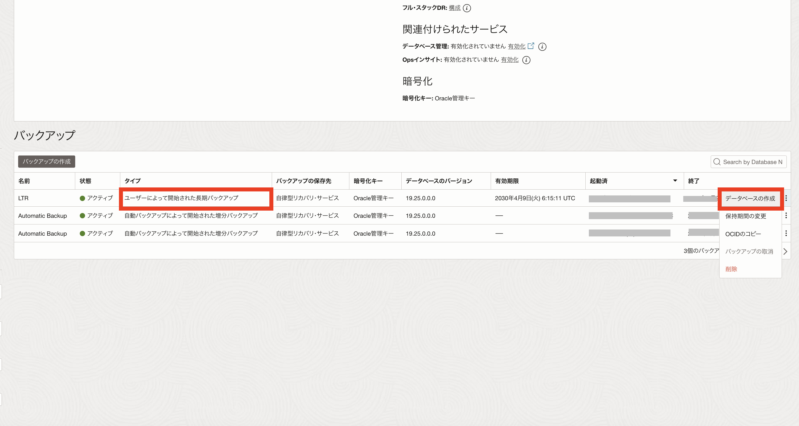

## はじめに

Oracle Database Autonomous Recovery Service（以下「リカバリ・サービス」）は、Oracle Cloud Infrastructure（OCI）上で稼働する Oracle Database 向けのフルマネージド型データ保護サービスです。

リカバリ・サービスでは、Oracle が自動で実行するバックアップに加えて、お客様自身で任意のタイミングでスタンドアロン・バックアップを取得できます。これらの操作は OCI コンソールから簡単に実行でき、取得したスタンドアロン・バックアップはリカバリ・サービスに安全に保管されます。また、スタンドアロン・バックアップを利用して新規の DB システムを作成することも可能です。

Base Database Service（BaseDB）では、長期保管要件への対応として、「長期保管バックアップ（LTR）」機能を利用し、リカバリ・サービスをバックアップ保存先として最大 10 年間バックアップを保存できます。多くの組織では法規制や社内規定により、たとえば毎月のバックアップデータを数年間保持する必要がありますが、LTR を活用することでこれらのコンプライアンス要件にも適合できます。

本チュートリアルでは、Base Database Service（BaseDB）で Oracle Database Autonomous Recovery Service（RCV/ZRCV）によるスタンドアロン・バックアップの取得方法、および長期保管バックアップ（LTR）の作成方法について解説します。

 

**前提条件 :**

- [104: 自動バックアップを構成しよう](../dbcs104-backup/index.md) を通じてリカバリ・サービスのセットアップが完了していること

 

**注意**  
チュートリアル内の画面ショットは現在の画面と異なる場合があります。

 

---

## 1. オンデマンド・バックアップを取得しよう

**所要時間 :** 約 30 分

自動バックアップとは別に、任意の時点でフルバックアップを取得できます。  
例えば、「大きな変更を加えた直後」や「別環境への複製やリストアのため」などにフルバックアップを取ることで、フル＋増分バックアップのリストアよりも、リストア時間を短縮できる場合があります。取得したバックアップはリカバリ・サービスに保存されます。

1. OCI コンソール・メニューから **Oracle Database** → **Oracle Base Database Service** に移動し、DB システムの詳細画面 → データベースの詳細画面からバックアップタブを選択します。

   

フル・バックアップ（オンデマンド・バックアップ）は、スタンドアロン・バックアップとして確認できます。

スタンドアロン・バックアップは、自動バックアップで設定されたスケジュールで削除されます。  
データベース削除後もバックアップを利用する可能性がある場合は、長期保管用バックアップ（LTR）を取得しておくと良いでしょう。

 

## 2. 取得したバックアップを確認しよう

「スタンドアロン・バックアップ」を選択すると、取得したスタンドアロン・バックアップの一覧が表示されます。  
これらのバックアップは、データベースの詳細画面のバックアップタブからも確認できます。

 

## 3. 長期保存バックアップ（LTR）を作成してみよう

**所要時間 :** 約 90 分

1. ナビゲーション・メニューから「Oracle Database」→「Oracle Database Services」をクリックします。

   

2. LTR を作成したい DB システムの名前をクリックします。

   

3. LTR を作成したいデータベースを選択します。

   

4. 「データベースの詳細」ページを下にスクロールし、「リソース」→「バックアップ」を選択し、「バックアップの作成」をクリックします。

   

5. 「バックアップの作成」画面で次の情報を入力します。

**入力項目と説明**

- **名前**：任意のバックアップの名前を入力します。
- **バックアップ保存期間**：LTR として作成する場合は「長期バックアップ保存期間の指定」を選択します。
- **バックアップ保持期間**：バックアップの保存期間を入力します。保持期間は日数（90 ～ 3,650）または年数（1 ～ 10）で指定してください。


Data Guard 構成では、プライマリ、スタンバイのどちらからも LTR を作成できます。


6. すべて入力し終えたら「作成」をクリックします。長期バックアップの作成状況は「作業リクエスト」から確認できます。


LTR はリカバリ・サービスから作成されるため、LTR 作成中も保護されたデータベースのステータスは「使用可能」となります。LTR は本番環境に負荷をかけず長期保管用のフルバックアップを作成します。


長期バックアップが作成されると、その詳細は「バックアップ」セクションに表示されます。

 

## 4. 長期バックアップ保持期間を変更してみよう

作成した LTR の保持期間を変更する手順を紹介します。

1. 「データベースの詳細」ページを下にスクロールし、「リソース」→「バックアップ」から、保持期間を変更したいバックアップを選択します。

2. 「バックアップ」セクションで「タイプ」が「ユーザーによって開始された長期バックアップ」になっているバックアップの右端にある三点リーダ（…）をクリックし、「保存期間の変更」を選択します。

   


保持期間は、長期バックアップ作成時点から計算されます。保持期間は日数（90 ～ 3,650）または年数（1 ～ 10）で指定してください。保存期間は短縮・延長どちらも可能です。


 

## 5. LTR を使用して新規データベースを作成してみよう

最後に、LTR を利用して新しいデータベースを作成する手順を紹介します。

1. 「データベースの詳細」ページを下にスクロールし、「リソース」→「バックアップ」を選択します。

2. 「タイプ」が「ユーザーによって開始された長期バックアップ」と表示されているバックアップの右端にある三点リーダ（…）をクリックし、「データベースの作成」を選択します。

   

3. 「バックアップからのデータベースの作成」ウィンドウで必要項目を入力します。  
   ※設定方法は新規作成時と同様です。入力項目は [101: Oracle Cloud で Oracle Database を使おう(BaseDB)](../dbcs101-create-db) をご参照ください。

   

4. 情報を入力し終えたら「データベースの作成」をクリックします。

   

データベースの作成が開始されます。新規データベース作成中は LTR に「リストア中」と表示されます。

作業が完了するとデータベースのステータスが「PROVISIONING...」から「AVAILABLE」に変わります。

以上で、この章の作業は完了です。

 

---

## 参考資料

- [製品サイト] [Oracle Database Autonomous Recovery Service](https://www.oracle.com/jp/database/zero-data-loss-autonomous-recovery-service/)
- [マニュアル] [Oracle Database Autonomous Recovery Service](https://docs.oracle.com/cd/E83857_01/paas/recovery-service/index.html)
- [Blog] [Autonomous Recovery Service で Oracle Database Services の長期保存バックアップにワンクリックで対応可能に](https://blogs.oracle.com/oracle4engineer/post/ja-recovery-service-ltr)
- [Blog] [Autonomous Recovery Service で長期保存バックアップのコストを半減](https://blogs.oracle.com/oracle4engineer/post/ja-zrcv-ltr-half-the-cost)
- [チュートリアル] [Create Long-Term Backups with Oracle Database Autonomous Recovery Service on Oracle Base Database Service](https://docs.oracle.com/en/learn/basedb-ltr-backup/index.html#introduction)
   
