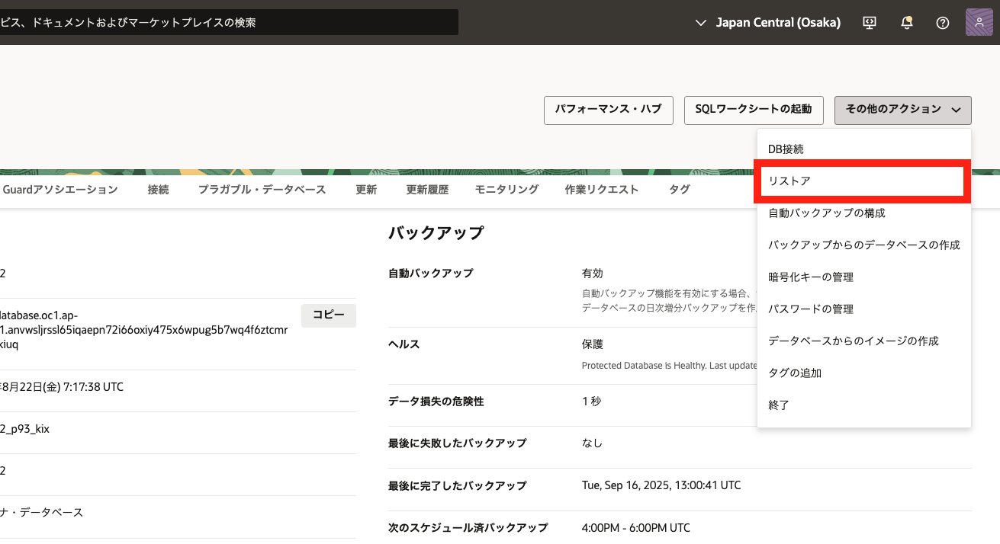
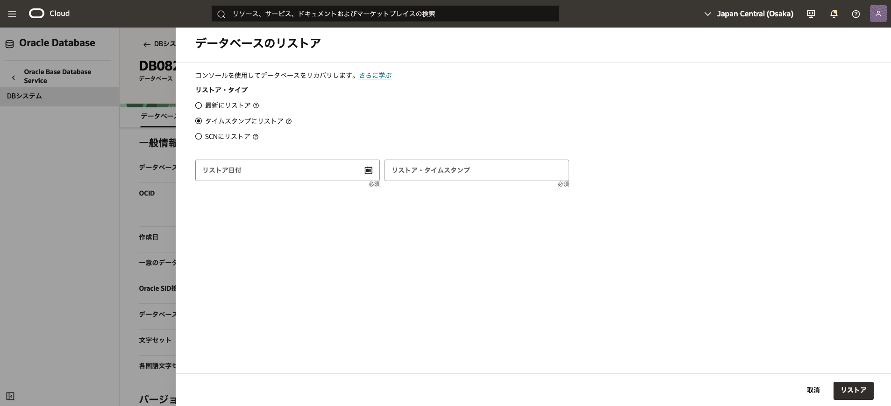
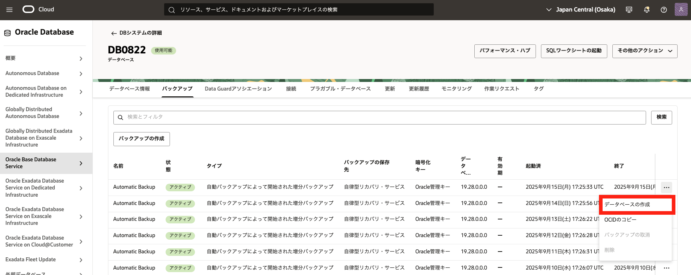
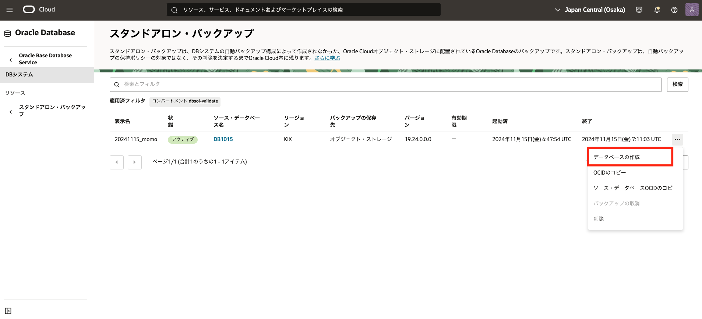
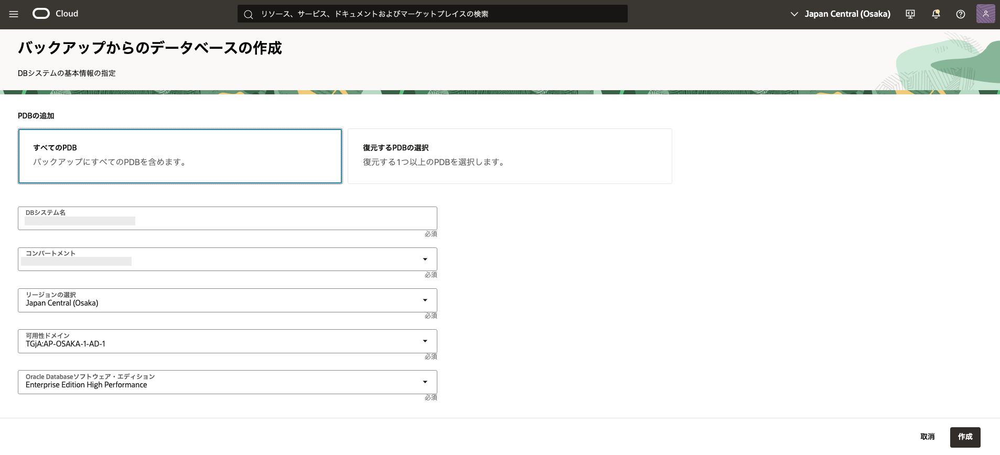

# はじめに

BaseDB では、自動バックアップに加え、お客様の任意のタイミングでオンデマンド・バックアップや長期保管用バックアップ（LTR）を取得することができます。さらに、自動バックアップやオンデマンドで取得したバックアップを活用することで、最新時点への復旧はもちろん、指定した時点までのポイント・イン・タイム・リカバリ（PITR）も可能です。

また、バックアップは元のデータベースにリストアできるだけでなく、別の DB システム上にもリストアできます。
本章では、OCI コンソールを利用したリストア手順についてご説明します。

 

**前提条件**

- [Oracle Cloud で Oracle Database を使おう](../dbcs101-create-db/index.md) を通じて Oracle Database の作成が完了していること

- [自動バックアップを設定しよう](../dbcs104-backup/index.md) を通じてバックアップを取得していること

 

**注意** チュートリアル内の画面ショットについては現在の画面と異なっている場合があります。

 

**目次**

- [1. バックアップ元のデータベースに対してリストア](#1-バックアップ元のデータベースに対してリストア)
- [2. バックアップから新規データベースとしてリストア](#2-バックアップから新規データベースとしてリストア)
- [3. オンデマンドバックアップを使用したリストア](#3-オンデマンドバックアップを使用したリストア)

 
**所要時間 :** 約30分
 

# 1. バックアップ元のデータベースに対してリストア

まずはバックアップ元のデータベースに対してリストアしてみましょう。
リストア方法には下記 3 つがありますので、リストアしたい地点に応じてどのリストア方法を利用するか検討してください。

- **最新にリストア**  
  データ損失の可能性が最も低い、直近の正常な状態にデータベースをリストアします。

- **タイムスタンプにリストア** 
  指定した日時にデータベースをリストアします。

- **SCN にリストア** 
  SCN を使用してデータベースをリストアします。 
  有効な SCN を指定する必要がありますので、データベース・ホストにアクセスして問い合せるか、オンラインまたはアーカイブ・ログにアクセスして使用する SCN 番号を確認してください。

1. コンソールメニューから **Oracle Database → Oracle Base Database Service** を選択し、有効な管理権限を持つコンパートメントを選択します

1. リストアしたい**DB システム**を選択します

1. DB システムの詳細画面から**データベース**を選択し、データベース一覧から対象のデータベース名を選択します

1. 画面右上部から**リストア**ボタンをクリックします

   

1. **データベースのリストア**画面がポップアップする為、リストア方法を選択します。

   

1. **データベースのリストア**ボタンをクリックします 
   リストア作業が完了するとステータスが**更新中**から**使用可能**に変わります
    

# 2. バックアップから新規データベースとしてリストア

続いて、取得したバックアップを利用して新規データベースとしてリストアする手順を紹介します。

1. 対象のデータベースの『データベースの詳細』ぺージの『バックアップ』をクリックします。

1. リストア対象のバックアップの右側にある・・・メニューから、「データベース作成」をクリックします。
   

1. **バックアップからのデータベースの作成**画面で、必要項目を入力し、**新規 DB システムの作成**を選択して「作成」をクリックします。※設定方法は新規作成時と同様ですので、入力項目は[Oracle Cloud で Oracle Database を使おう](../dbcs101-create-db)をご参照下さい。

新規作成時と異なる点として、ソース・データベースのパスワード入力が求められます。ソース・データベースのパスワードを入力し、「作成」をクリックする事で新規データベースとしてバックアップをリストアします。

1. **DB システムの作成** をクリックします。 
   DB システムの作成がバックエンドで開始します。作業が完了するとステータスが **更新中**から**使用可能**に変わります

# 3. オンデマンドバックアップを使用したリストア

1. コンソールメニューから**Oracle Database → Oracle Base Database**を選択し、**スタンドアロン・バックアップ**をクリックします。

1. 一覧から、リストアしたいバックアップ右側の・・・から、「データベースの作成」をクリックします。
   

1. **バックアップからのデータベースの作成**画面で、**新規 DB システムの作成**を選択して「作成」をクリックします。
   

1. 新規作成する**DB システム**の設定を行います。 
   ※設定方法は新規作成時と同様ですので、入力項目は[Oracle Cloud で Oracle Database を使おう](../dbcs101-create-db)をご参照下さい

1. 新規作成時と異なる点として、ソース・データベースのパスワード入力が求められます。 
   ソース・データベースのパスワードを入力し、「作成」をクリックする事で新規データベースとしてバックアップをリストアします。

1. **DB システムの作成** をクリックします。 
   DB システムの作成がバックエンドで開始します。作業が完了するとステータスが **PROVISIONING...** から **AVAILABLE** に変わります

 
以上で、この章の作業は完了です。
