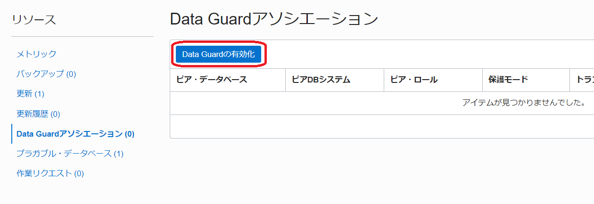
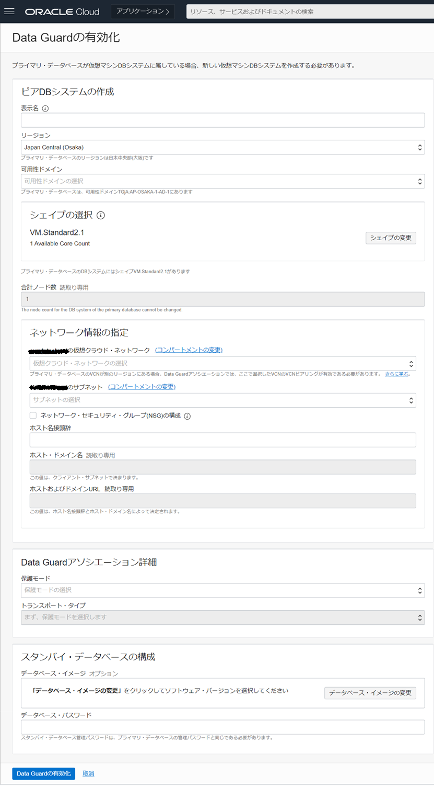
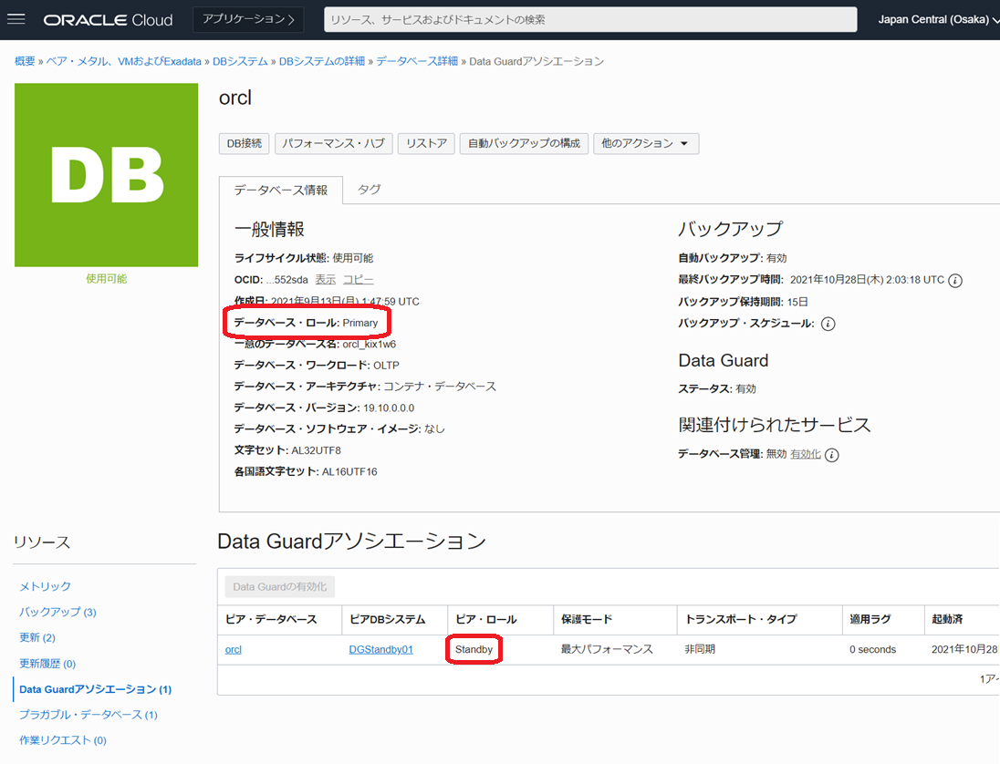
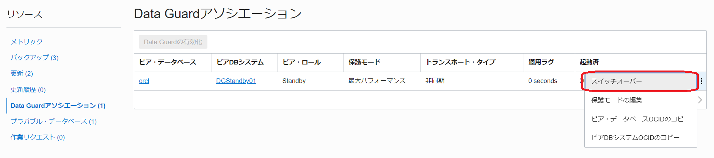
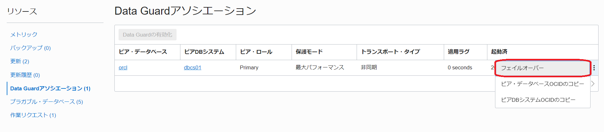
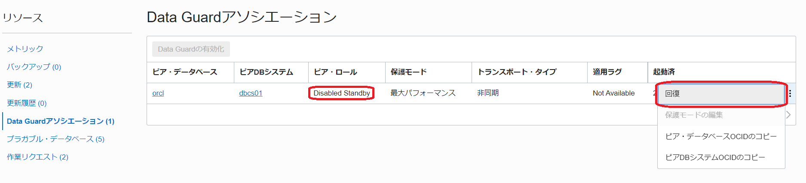

# はじめに

Data Guard は、Oracle Database 自身が持つレプリケーション機能です。
プライマリ DB の更新情報（REDO ログ）をスタンバイ DB に転送し、その REDO ログを使ってリカバリし続けることでプライマリ DB と同じ状態を維持します。 
リアルタイムに複製データベースを持つ事ができる為、データベース障害やリージョン障害などの RTO/RPO を短くすることができ、広範囲な計画停止(メンテナンス)においても切り替えることによって停止時間を極小化することが可能で、災害対策(DR)としてのデータ保護はもちろんのこと、移行やアップグレードの停止時間短縮といった利用用途もあります。 
また、参照専用として利用可能な Active Data Guard にしたり、一時的に読み書き可能なスナップショット・スタンバイとして利用したりと、普段から利用可能なスタンバイ DB を持つことができます。

ここでは、OCI コンソールから Data Guard を構成するまでの手順についてご紹介します。

 

**前提条件 :**

- [Oracle Cloud で Oracle Database を使おう](../dbcs101-create-db) を通じて Oracle Database の作成が完了していること

 

**注意** チュートリアル内の画面ショットについては現在の画面と異なっている場合があります。

 
**所要時間 :** 約60分
 

# 1. OCI 上での Data Guard 構成パターン

Oracle Cloud 上で Data Guard を利用する際の基本的な構成については、大きく分けて３つのパターンがあります。

1.  **同一リージョン内での Data Guard** : 主にデータベース障害や DB システム障害やメンテナンスなどを考慮したローカル・スタンバイ
1.  **別リージョン間での Data Guard** : 主にリージョン障害やメンテナンス時の切り替え先としてローカル・スタンバイ環境をを持たない場合のリモート・スタンバイ
1.  **ハイブリッド Data Guard** : オンプレミスとクラウド間で構成するハイブリッド型のオフサイト・スタンバイ

クラウドの画面上からは「同一リージョン内」と「別リージョン間での Data Guard」構成が簡単に構築・管理が可能です。 
ハイブリッドの場合は手動で構成が必要となりますので、手順を解説したホワイト・ペーパーをご参照ください。

BaseDB : Hybrid Data Guard to Oracle Cloud Infrastructure [英語](https://www.oracle.com/technetwork/database/availability/hybrid-dg-to-oci-5444327.pdf) / [日本語](https://www.oracle.com/technetwork/jp/database/availability/hybrid-dg-to-oci-5444327-ja.pdf)

# 2. Data Guard を構成する為の前提条件

Data Guard を構成するにあたり前提条件を確認してみましょう。

1. 必要なエディション  - Data Guard は Enterprise Edition 以上、Active Data Guard は Extream Performance が必要
    

1. Oracle Cloud のインフラ側の前提条件

   - 管理ユーザーの IAM サービス・ポリシーでの権限が付与済
   - プライマリ DB システムとスタンバイ DB システム間での通信設定(最低限 TCP のポート 1521 を有効化。別リージョン間であれば VCN 間のピアリング設定が必要)
      

1. DB システム側の前提条件 
   - 同一コンパートメント内
   - 同一 DB バージョン・パッチ間 (※Oracle Data Guard の前提条件)
   - 同一エディション同士
   - 同一サービス間
   - 作成・管理できるスタンバイは１つのフィジカル・スタンバイ

2 つ以上のスタンバイを持ちたい／BaseDB と ExaDB-D 間で構成したいなど、DB システム側の前提条件のみ満たせない場合は、手動で Data Guard を構成することも可能です。

 

# 3. Data Guard の構成手順

次に OCI コンソールから Data Guard を構成するまでの手順を紹介します。

1. コンソールメニューから **Oracle Database → Oracle Base Database (VM, BM) →「DB システム」→「DB システムの詳細」→「データベース詳細」** 画面へ遷移し、 **「Data Guard アソシエーション」** を選択します

1. **Data Guard の有効化** ボタンをクリックします

 

1. 表示される画面に下記を入力し、**Data Guard の有効化**ボタンをクリックします 

   - **表示名** - スタンバイ DB システムの表示名
   - **リージョン** - スタンバイ DB システムを作成するリージョン
   - **可用性ドメイン** - スタンバイ DB システムを作成する可用性ドメイン
   - **シェイプの選択** - スタンバイ DB システムのシェイプ
   - **ネットワーク情報の指定** - スタンバイ DB システムのネットワーク情報
   - **Data Guard アソシエーション詳細** - Data Guard のデータ保護モード(※) 
     ※システム要件に合わせて次の組み合わせから選択して下さい 
     - 最大パフォーマンス - 非同期 
     - 最大可用性 - 同期
   - **スタンバイ・データベースの構成** - プライマリ DB のパスワードと同じものを入力
   

   
   

    

1. 作成された構成を確認します 
   今回は同一リージョン内(大阪リージョン)で作成しています。 
   プライマリ DB システム側の **「Data Guard アソシエーション」** 画面にて、スタンバイ DB が構成されていることが確認可能です
   

   
   

    
   OCI コンソールの他にも OS 上のコマンドツールとして dbcli が用意されており、root ユーザーで Data Guard 関連の設定確認が可能です。
    
   

   
   

    
   コマンドの詳細は [データベース CLI での Oracle Data Guard の使用](https://docs.oracle.com/ja-jp/iaas/Content/Database/Tasks/usingDG.htm) をご確認ください。

 

# 4. Data Guard の切り替え

コンソールや CLI から、簡単に Data Guard の切り替え(スイッチオーバー、フェイルオーバー)が可能です。
また、フェイルオーバー実施後に旧プライマリ・データベースを簡単にスタンバイとして復旧する事が可能です。

1. スイッチオーバーの実行方法 
   スイッチオーバーは主にデータベースのメンテナンスなど計画停止時にプライマリとスタンバイを切り替える際に使用します。 
   スタンバイ DB に REDO を転送・適用をしきった状態でスタンバイ DB にプライマリ・ロールが引き継がれる為、Data Guard 構成を保った状態を維持する事が可能です。 
   スイッチオーバーは、プライマリ DB システムの **「Data Guard アソシエーション」** 画面から実行します。
   

   
   

    

1. フェイルオーバーの実行方法 
   フェイルオーバーはプライマリ側が利用できない状態など主に計画外停止時にスタンバイ側に切り替える際に使用します。 
   Data Guard のデータ保護モードとして『非同期』を設定している場合、未転送分の更新情報が反映されていない事によるデータ損失が発生する可能性があります。 
   また、基本的には切り替え後はスタンバイ DB がない構成となるので、フェイルオーバー後にも Data Guard での可用性構成を組むために再度スタンバイ DB を作成して Data Guard を構成する必要があります。 
   フェイルオーバーはスタンバイ DB システムの **「Data Guard アソシエーション」** 画面から実行します。
   

   
   

    

1. 回復 
   フェイルオーバー後、Flashback Database 機能を利用して旧プライマリを障害発生直前(フェイルオーバーによる切り替え前の時点)までフラッシュバックし、スタンバイにロールを変換して Data Guard 構成に組み直す事が可能です。
   フラッシュバックしたことで生じる差分も自動で同期されるため、一からスタンバイを構築し直す必要はありません。 
   BaseDB では、コンソール上の『回復』というボタンをクリックするだけで簡単に Data Guard が再構成する事が可能です。 
   回復は、フェイルオーバー後のプライマリ DB システムの **「Data Guard アソシエーション」** 画面から実行します。
   

   
   

    

 

# 5. Data Guard 構成に含まれる DB の削除方法

Data Guard アソシエーションに含まれるデータベース、もしくは DB システムを削除する場合、最初にスタンバイ DB(DB システム)を削除しましょう。 
スタンバイ DB が紐づけられている状態でプライマリ DB を削除しようとすると、エラーが表示され削除できません。 
もし、プライマリ DB の環境のみを削除したい場合は、一度ロールを切り替え、削除対象の DB をスタンバイ・ロールにしてから削除して下さい。

 
以上で、この章の作業は完了です。
