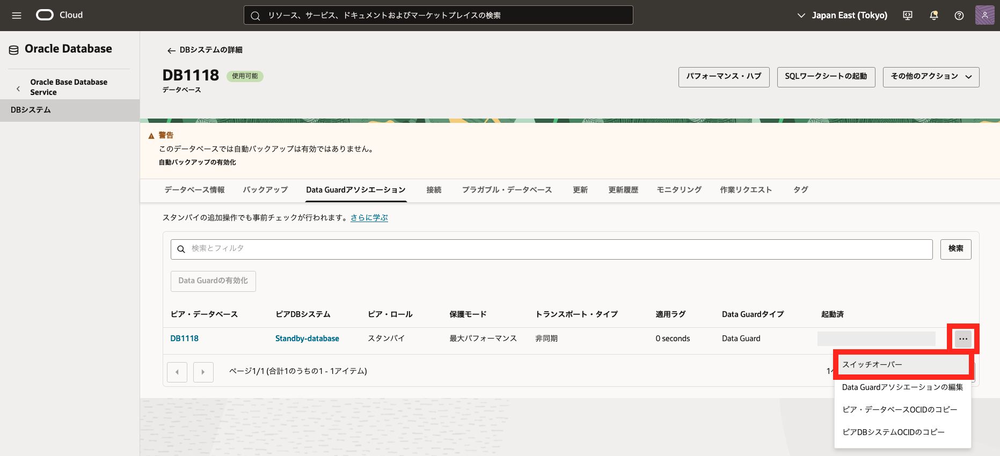

# はじめに

**Oracle Data Guard** は、**Oracle Database が標準で提供するレプリケーション機能**です。
**プライマリ・データベース**の更新情報（REDO ログ）を**スタンバイ・データベース**に転送し、その REDO ログを適用し続けることで、プライマリと同じデータの状態を維持します。  

リアルタイムで複製されたデータベースを保持できるため、**データベース障害やリージョン障害時の RTO（目標復旧時間）や RPO（目標復旧地点）を大幅に短縮**できます。また、計画メンテナンス中の切り替えによって、**サービスのダウンタイムも最小限**に抑えられます。 
これにより、**災害対策（DR）としてのデータ保護はもちろん、データベース移行やアップグレード時の停止時間短縮**にも活用できます。  

さらに、Active Data Guard を利用すれば、スタンバイ・データベースを参照専用で活用したり、一時的に読み書きが可能なスナップショット・スタンバイとして運用したりと、様々な用途でスタンバイ DB を有効活用できます。  

このチュートリアルでは、OCI コンソールを使用して Oracle Data Guard を構成する手順について、分かりやすくご紹介します。  

 

**前提条件 :**

- [Oracle Cloud で Oracle Database を使おう](../dbcs101-create-db) を通じて Oracle Database の作成が完了していること

**注意** チュートリアル内の画面ショットについては現在の画面と異なっている場合があります。

**所要時間 :** 約 60 分

 

# 1. OCI 上での Oracle Data Guard 構成パターン

Oracle Cloud 上で Oracle Data Guard を利用する際の基本的な構成については、大きく分けて３つのパターンがあります。

1.  **同一リージョン内での Oracle Data Guard** : 主にデータベース障害や DB システム障害やメンテナンスなどを考慮したローカル・スタンバイ
2.  **別リージョン間での Oracle Data Guard** : 主にリージョン障害やメンテナンス時の切り替え先としてローカル・スタンバイ環境をを持たない場合のリモート・スタンバイ
3.  **ハイブリッド Oracle Data Guard** : オンプレミスとクラウド間で構成するハイブリッド型のオフサイト・スタンバイ

クラウドの画面上からは「同一リージョン内」と「別リージョン間での Oracle Data Guard」構成が簡単に構築・管理が可能です。 
ハイブリッドの場合は手動で構成が必要となりますので、手順を解説したホワイト・ペーパーをご参照ください。

BaseDB : Hybrid Oracle Data Guard to Oracle Cloud Infrastructure [英語](https://www.oracle.com/technetwork/database/availability/hybrid-dg-to-oci-5444327.pdf) / [日本語](https://www.oracle.com/technetwork/jp/database/availability/hybrid-dg-to-oci-5444327-ja.pdf)

# 2. Oracle Data Guard を構成する為の前提条件

Oracle Data Guard を構成するにあたり前提条件を確認してみましょう。

1. **必要なエディション** 

- Oracle Data Guard は Enterprise Edition 以上
- Active Oracle Data Guard は Extream Performance が必要
   

1. **Oracle Cloud のインフラ側の前提条件**

- 管理ユーザーの IAM サービス・ポリシーでの権限が付与済
- プライマリ DB システムとスタンバイ DB システム間での通信設定(最低限 TCP のポート 1521 を有効化。別リージョン間であれば VCN 間のピアリング設定が必要)
   

1. **DB システム側の前提条件** 

- 同一コンパートメント内
- 同一 DB バージョン・パッチ間 (※Oracle Oracle Data Guard の前提条件)
- 同一エディション同士
- 同一サービス間
- 作成・管理できるスタンバイは１つのフィジカル・スタンバイ

2 つ以上のスタンバイを持ちたい／BaseDB と ExaDB-D 間で構成したいなど、DB システム側の前提条件のみ満たせない場合は、手動で Oracle Data Guard を構成することも可能です。

 

# 3. Oracle Data Guard の構成手順

次に OCI コンソールから Oracle Data Guard を構成するまでの手順を紹介します。

1. ナビゲーション・メニューから **Oracle Database → Oracle Base Database Service** を選択します。 「**DB システムの詳細**」から「**データベース**」タブを展開します。

2. Oracle Data Guard を有効化したいデータベースの名前を選択し、「**データベース詳細**」画面へ遷移します。

3. 「**データベース詳細**」画面の「**Oracle Data Guard アソシエーション**」 タブを選択し、「**Oracle Data Guard の有効化**」をクリックします 

４. 表示される画面に下記を入力します。 

- **DB システム名** - スタンバイ DB システムの表示名を指定します。分かりやすい名前にしましょう。
- **リージョン** - スタンバイ DB システムを作成するリージョンを選択します。
- **可用性ドメイン** - スタンバイ DB システムの可用性ドメイン（AD）を選択します。
- **シェイプの選択** - プライマリと同じシェイプが自動で指定されますが、必要に応じてシェイプをカスタマイズできます。
- **DB システム構成** - ノード数は自動入力されます（プライマリと同一ノード数となります）
- **ネットワーク情報の指定** - スタンバイ DB システムを配置する VCN やサブネット、必要な NSG（ネットワーク・セキュリティ・グループ）を選択します。
- **Oracle Data Guard アソシエーション詳細** - プライマリデータベースとスタンバイデータベース間のデータ保護モードを選択します。
  システム要件や業務上の要請に合わせて最適なモードを選んでください。
  - **最大パフォーマンス（非同期転送）** プライマリデータベースのパフォーマンスを優先し、REDO データを非同期でスタンバイデータベースに転送します。
  - **最大可用性（同期転送）** データ損失を防ぐことを最優先し、REDO データの同期転送を行うモードです。
- **スタンバイ・データベースの構成** - 管理者パスワードとして、プライマリ DB と同じものを入力します。
   

入力が完了したら、「**有効化**」をクリックしましょう。Oracle Data Guard の作成が開始されます。

5. 作成作業が完了すると、ステータスが「**使用可能**」になります。作成された構成を確認しましょう。 
   今回は同一リージョン内(大阪リージョン)で作成しています。 
   プライマリ DB システム側の 「**Oracle Data Guard アソシエーション**」 画面にて、スタンバイ DB が構成されていることが確認可能です

OCI コンソールの他にも OS 上のコマンドツールとして dbcli が用意されており、root ユーザーで Oracle Data Guard 関連の設定確認が可能です。

コマンドの詳細は [データベース CLI での Oracle Data Guard の使用](https://docs.oracle.com/ja-jp/iaas/Content/Database/Tasks/usingDG.htm) をご確認ください。

 

# 4. Oracle Data Guard の切り替え

コンソールや CLI から、簡単に Oracle Data Guard の切り替え(**スイッチオーバー、フェイルオーバー**)が可能です。
また、フェイルオーバー実施後に旧プライマリ・データベースを簡単にスタンバイとして復旧する事が可能です。

1. **スイッチオーバーの実行方法** 
   スイッチオーバーは主にデータベースのメンテナンスなど計画停止時にプライマリとスタンバイを切り替える際に使用します。 
   スタンバイ DB に REDO を転送・適用をしきった状態でスタンバイ DB にプライマリ・ロールが引き継がれる為、Oracle Data Guard 構成を保った状態を維持する事が可能です。 
   スイッチオーバーは、プライマリ DB システムの 「**Oracle Data Guard アソシエーション**」 画面から右端の「・・・」を展開し、実行します。

2. **フェイルオーバーの実行方法** 
   フェイルオーバーはプライマリ側が利用できない状態など主に計画外停止時にスタンバイ側に切り替える際に使用します。 
   Oracle Data Guard のデータ保護モードとして『非同期』を設定している場合、未転送分の更新情報が反映されていない事によるデータ損失が発生する可能性があります。 
   また、基本的には切り替え後はスタンバイ DB がない構成となるので、フェイルオーバー後にも Oracle Data Guard での可用性構成を組むために再度スタンバイ DB を作成して Oracle Data Guard を構成する必要があります。 
   フェイルオーバーはスタンバイ DB システムの 「**Oracle Data Guard アソシエーション**」 画面から右端の「・・・」を展開し、実行します。

3. **回復** 
   フェイルオーバー後、Flashback Database 機能を利用して旧プライマリを障害発生直前(フェイルオーバーによる切り替え前の時点)までフラッシュバックし、スタンバイにロールを変換して Oracle Data Guard 構成に組み直す事が可能です。
   フラッシュバックしたことで生じる差分も自動で同期されるため、一からスタンバイを構築し直す必要はありません。 
   BaseDB では、コンソール上の『回復』というボタンをクリックするだけで簡単に Oracle Data Guard が再構成する事が可能です。 
   回復は、フェイルオーバー後のプライマリ DB システムの 「**Oracle Data Guard アソシエーション**」 画面から実行します。

 

# 5. Oracle Data Guard 構成の編集

一度構成した Oracle Data Guard アソシエーションはコンソール上から設定変更できます。
DB システムの 「**Oracle Data Guard アソシエーション**」 画面から右端の「・・・」を展開し、「**Data Guard アソシエーションの編集**」を選択します。

編集画面で変更を加えた後、「**編集**」ボタンを押すと、変更が反映されます。

 

# 6. Oracle Data Guard 構成に含まれる DB の削除方法

Oracle Data Guard アソシエーションに含まれるデータベース、もしくは DB システムを削除する場合、最初にスタンバイ DB(DB システム)を削除しましょう。 
スタンバイ DB が紐づけられている状態でプライマリ DB を削除しようとすると、エラーが表示され削除できません。 
もし、プライマリ DB の環境のみを削除したい場合は、一度ロールを切り替え、削除対象の DB をスタンバイ・ロールにしてから削除して下さい。

 
以上で、この章の作業は完了です。
