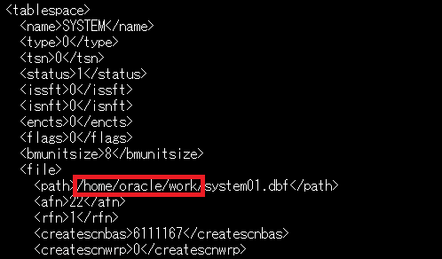

<a id="anchor0"></a>

# はじめに

Base Database Service (BaseDB)では、12c 以降のデータベースをプロビジョニングした場合、デフォルトでマルチテナント・コンテナ・データベース(CDB)で作成されます。
CDB で構成されているオンプレミスのデータベースから BaseDB へ移行する場合、PDB のアンプラグ・プラグを行う事で簡単に移行可能です。
その際、両データベースのバージョンに差異があった場合は autoupgrade 等のツールを利用する事で、バージョンアップも行う事が可能です。

ここでは、オンプレミスのデータベース(19.12.0.0.0)から BaseDB(19.12.0.0.0)へ PDB を移行する手順をご紹介します。

<br>

**前提条件 :**

- 移行元のデータベースが**CDB で構成されている**こと

- [Oracle Cloud で Oracle AI Database を使おう](../dbcs101-create-db) を通じて Oracle AI Database の作成が完了していること

<br>
**所要時間 :** 約1時間30分
<br>

# 1. 移行元のデータベースから PDB をアンプラグする

まずは移行元のデータベースから、移行対象の PDB をアンプラグします。
アンプラグは Database Configuration Assistant ツールを使って行う事も可能ですが、今回はコマンドでの実施手順を紹介します。

1. 対象 PDB の構成確認します
   PDB の移動にあたってデータファイルを BaseDB に持っていく必要があります。
   まずは下記 SELECT 文にて対象 PDB で使用しているデータファイルのディレクトリを確認します。

```
alter session set container=<pdb_name>;
select tablespace_name, file_name from dba_data_files;
```

（作業イメージ）

<div align="center">

</div>
<br>

1. 対象 PDB をクローズします

```
alter pluggable database <pdb_name> close;
```

1. 対象 PDB のアンプラグします

```
alter pluggable database testpdb unplug into '<任意のディレクトリ>/testpdb.xml';
```

1. 対象 PDB で使用しているデータファイル、及びアンプラグ時に生成された xml ファイルを BaseDB 上のディレクトリにコピーします

1. 移行元のデータベースにはアンプラグした PDB の情報が残りますので、必要に応じて削除して下さい。

以上で PDB のアンプラグ完了です。

# 2. BaseDB に PDB をプラグする

1. アンプラグ時に生成された xml ファイルを開き、データファイルのパスを BaseDB 上のパスに書き換えます<br>
   ※次の例では、データファイル及び xml ファイルを BaseDB 上の/home/oracle/work/ディレクトリ配下に配置しています。

- 書き換え前
    <div align="center">
    
    </div>
    <br>
- 書き換え後
    <div align="center">
    
    </div>
    <br>

1. CDB に接続し、PDB のプラグを実行します

```
create pluggable database <pdb_name> using '<xmlファイルのフルパス>'
file_name_convert = ('<データファイルの配置ディレクトリ>','<データファイルの再配置先>');
```

（作業イメージ）<br>
※testpdb2 という名前でプラグしており、ASM ディスクグループ上に再配置する為に"+DATA" を指定

<div align="center">

</div>
<br>

1. プラグした PDB をオープンします

```
alter pluggable database <pdb_name> open;
```

1. PDB_PLUG_IN_VIOLATIONS ビューを確認し、TYPE 列値が'ERROR'となっているものがないか確認します<br>
   ※TYPE 列='ERROR'となっている項目がある場合、ACTION 列の内容に従ってエラーを解消する必要があります

```
select * from pdb_plug_in_violations where status ='RESOLVED';
```

# 3. 表領域の暗号化を行う

BaseDB 上のデータベースでは、セキュリティ観点から表領域の暗号化を強く推奨しており、非暗号化の表領域を新規作成する事ができません。
移行元のデータベースで表領域を暗号化していない場合、プラグ後の PDB も表領域は暗号化されていない為、次の手順にて暗号化する事が可能です。

1. プラグした PDB 用の TDE マスター暗号化鍵を生成します

```
alter session set container=<PDB_NAME>;
administer key management set key force keystore identified by "<TDE wallet password>" with backup;
```

1. 表領域の暗号化変換を行います

```
alter session set container=<PDB_NAME>;
alter tablespace <TABLESPACE_NAME> encryption online encrypt;
```

1. PDB を再起動し、pdb_plug_in_violations ビューに"PENDING"となっている項目がない事を確認します

```
select * from pdb_plug_in_violations where status <> 'RESOLVED';
```

<br>
なお、プラグしたPDBがOCIコンソール上に表示されるまでタイムラグがありますので、暫くお待ち頂いてからご確認下さい。
<br>

以上で、この章の作業は完了です。
