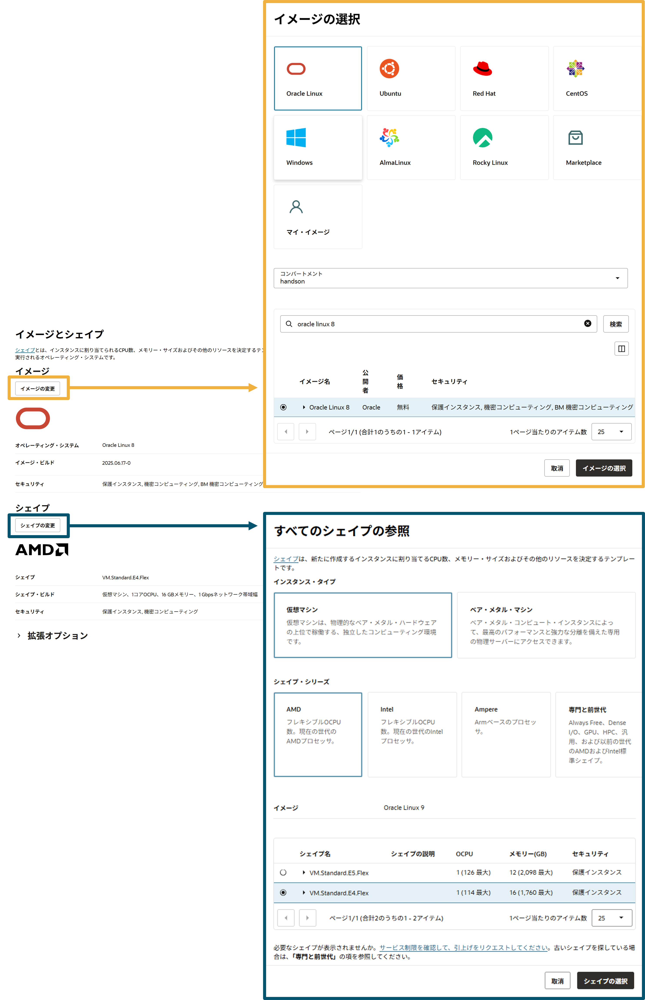
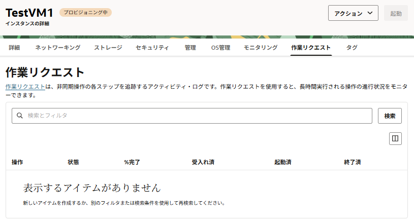
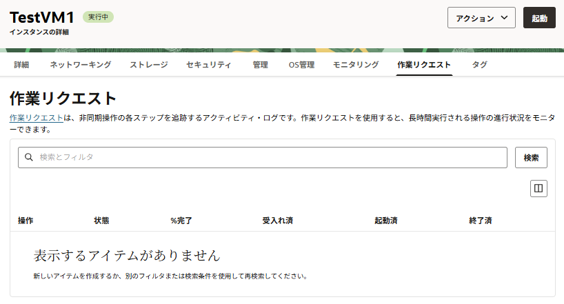
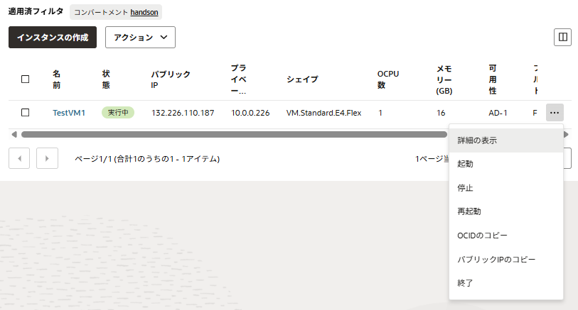
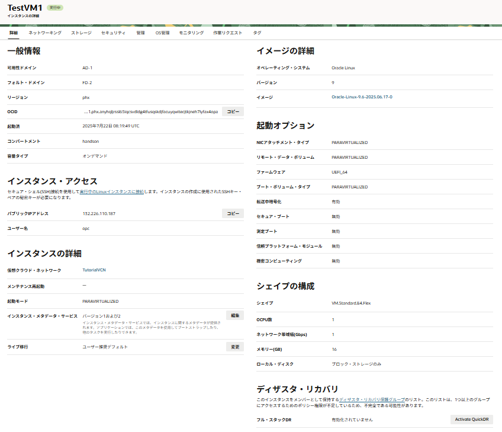
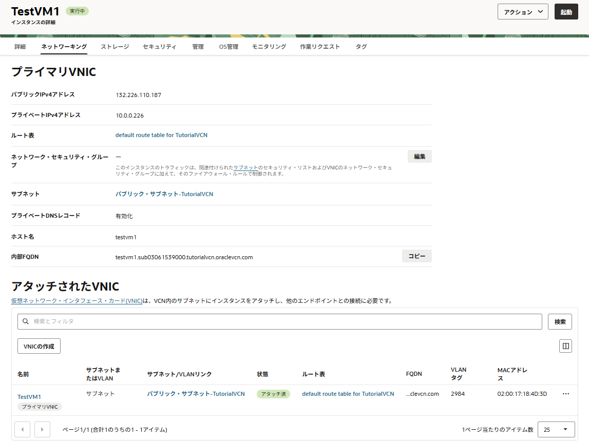
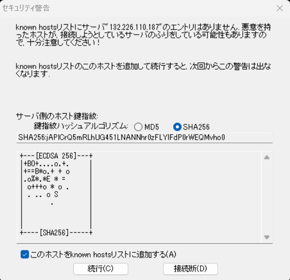
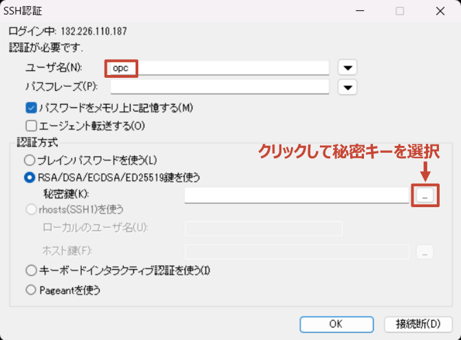
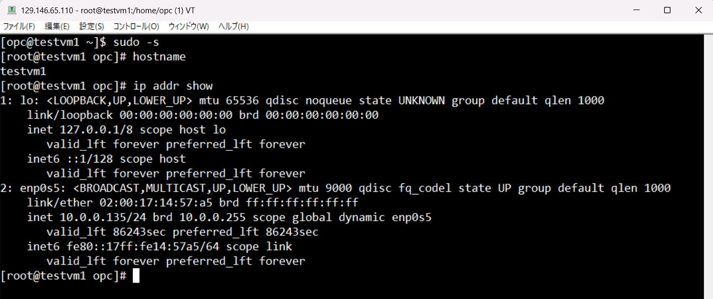

**チュートリアル一覧に戻る :** [Oracle Cloud Infrastructure チュートリアル](../..)

この章では、作成済みの仮想クラウド・ネットワーク（VCN）の中にコンピュート・インスタンスを作成していきます。

**所要時間 :** 約20分

**前提条件 :**

- [その2 - クラウドに仮想ネットワーク(VCN)を作る](../creating-vcn) を通じて仮想クラウド・ネットワーク(VCN)の作成が完了していること

**注意 :** チュートリアル内の画面ショットについては Oracle Cloud Infrastructure の現在のコンソール画面と異なっている場合があります

**目次：**

* [1. 新規仮想マシンインスタンスの作成](#anchor1)
* [2. 作成したインスタンス詳細情報の確認](#anchor2)
* [3. インスタンスへの接続](#anchor3)

**参考動画：** 本チュートリアルの内容をベースとした定期ハンズオンWebinarの録画コンテンツです。操作の流れや解説を動画で確認したい方はご参照ください。

- [Oracle Cloud Infrastructure ハンズオン - 3.コンピュート・インスタンス](https://videohub.oracle.com/media/Oracle+Cloud+Infrastructure+%E3%83%8F%E3%83%B3%E3%82%BA%E3%82%AA%E3%83%B3+-+3.%E3%82%B3%E3%83%B3%E3%83%94%E3%83%A5%E3%83%BC%E3%83%88%E3%83%BB%E3%82%A4%E3%83%B3%E3%82%B9%E3%82%BF%E3%83%B3%E3%82%B9/1_ij6z49l8)

# 1. 新規仮想マシンインスタンスの作成

第2章で作成した仮想コンピュート・ネットワーク（VCN）に、新しくインスタンスを作成していきます。

今回はコンソールから、一番小さなシェイプ（1 OCPU）の仮想マシン（VM）タイプの Oracle Linux 8 のインスタンスを1つ作成します。

1. コンソールメニューから **`コンピュート`** → **`インスタンス`** を選択し、**`インスタンスの作成`** ボタンを押します

2. 立ち上がった “コンピュート・インスタンスの作成” ウィンドウに 以下の項目を入力し、**`作成`** ボタンを押下します

    - **名前** - 作成するインスタンスの名前として、任意の値を設定します。（画面は TestVM1 として入力しています）
    - **コンパートメントに作成** - デフォルトで現在のコンパートメントが選択されています。別のコンパートメントに作成したい場合はリストから選択します。

    

    - **配置**
      - **可用性ドメイン** - 任意の可用性ドメインを選択できます。集合ハンズオン環境を利用している場合は、講師の指示に従って選択してください。 

        > **Note**
        >
        > 日本のリージョン（Tokyo, Osaka）は AD 1 つのみです。

      - 拡張オプションを表示させると以下の設定が可能
        - 容量タイプ - デフォルト（オンデマンド容量）のまま
        - クラスタ配置グループ - OFF のまま
        - フォルト・ドメイン - クリックすると、任意のフォルト・ドメインを指定できます。集合ハンズオン環境を利用している場合は、講師の指示に従って選択してください。

    

    - **イメージとシェイプ**
      - **イメージ** -  **`イメージの変更`** をクリックし、Oracle Linux 8 の最新のイメージを選択  
        > **Note**
        >
        > **Oracle Linux 9** を選択する場合、RHEL9系でSHA1が使用不可になったため、後の項目 “SSHキーの追加” でキーのダウンロードを選択すると、**Tera Termのver.4ではSSH接続ができなくなる**ため注意してください。

      - **シェイプ** - **`シェイプの変更`** をクリックし、以下のインスタンス・タイプ、シェイプ・シリーズ、シェイプを選択します。
        - インスタンス・タイプ - **仮想マシン**
      - シェイプ・タイプ - **AMD**
        - シェイプ - **VM.Standard.E4.Flex**  
          > **Note**
          >
          > フレキシブル・シェイプ（.Flex とついているもの）では、OCPU数とメモリサイズをそれぞれ任意の値に設定できます。

      - **拡張オプション** - デフォルトのまま（任意で Cloud-initスクリプトの設定 や、モニタリングの有効/無効化 などが行えます）

      

    - **セキュリティ**
      - OFF のまま

      

    - **ネットワーキング**
      - **VNIC名** - 空欄のまま
      - **プライマリ・ネットワーク** - “既存の仮想クラウド・ネットワークを選択”
        - **仮想クラウド・ネットワークコンパートメント** - 第1章で作成したコンパートメントを選択 (画面は handson を選択しています)
        - **仮想クラウド・ネットワーク** - 第2章で作成した仮想クラウド・ネットワークを選択 (画面は TutorialVCN を選択しています)
      - **サブネット** - “既存のサブネットを選択”
        - **サブネットコンパートメント** - 第1章で作成したコンパートメントを選択 (画面は handson を選択しています)
        - **サブネット** - 第2章で作成した**パブリック・サブネット**を選択 (画面は パブリック・サブネット-TutorialVCN を選択しています)
      - **プライマリVNIC IPアドレス**
        - **プライベートIPv4アドレス** - “プライベートIPv4アドレスの自動割り当て” を選択
        - **パブリックIPv4アドレスの割当て** - ON のまま
        - **IPv6アドレス** - OFF のまま
 
      > **Note**
      >
      > 2章でVCNウィザードで作成したVCNには、プライベート・サブネットとパブリック・サブネットがあります。このチュートリアルでは、このあとインターネット経由でSSH接続を行うため、必ず **パブリック・サブネットを選択** するようにしてください。

      > **Note**
      >
      > “プライベートIPアドレス” の項で “プライベートIPv4アドレスの自動割り当て” を選択すると、DHCPによりアドレス番号の小さい空きアドレスから順番に振られます。任意の固定IPアドレスを指定したい場合、“プライベートIPv4アドレスの手動割り当て” から指定することが出来ます。

      

     
    - **SSHキーの追加** - "キー・ペアを自動で生成" を選択し、**`秘密キーのダウンロード`**、**`公開キーのダウンロード`** ボタンをそれぞれ押下します。秘密キー “ssh-key-yyyy-MM-dd.key”、公開キー “ssh-key-yyyy-MM-dd.key.pub” というファイルがそれぞれダウンロードされます。
      
      > **Note**
      >
      > “イメージとシェイプ” の項目で **Oracle Linux 9** を選択した場合、RHEL9系でSHA1が使用不可になったため、キーのダウンロードを選択すると、**Tera Termのver.4ではSSH接続ができなくなる**ため注意してください。
      > これを回避するには、いくつかの方法があります：
      > 1. RHEL9系以外のシェイプを使用する
      > 2. Tera Term ver.4以外の端末からSSH接続する
      > 3. “SSHキーの追加” で “公開キー・ファイル(.pub)のアップロード” または “公開キーの貼付け” を選択し、RSA以外の署名アルゴリズムのキーを追加（サポートされるキー・タイプについて：[OCIドキュメント『Linuxインスタンスでのキー・ペアの管理』](https://docs.oracle.com/ja-jp/iaas/Content/Compute/Tasks/managingkeypairs.htm#Managing_Key_Pairs_on_Linux_Instances)）
      
      > **Note**
      >
      > SSHキーの取得漏れや、設定したキー・ペアを紛失した場合は、[こちらのチュートリアル](https://community.oracle.com/tech/welcome/discussion/4474277/%E3%82%B7%E3%83%AA%E3%82%A2%E3%83%AB-%E3%82%B3%E3%83%B3%E3%82%BD%E3%83%BC%E3%83%AB%E3%81%A7ssh%E3%81%A7%E3%81%8D%E3%81%AA%E3%81%84%E3%82%A4%E3%83%B3%E3%82%B9%E3%82%BF%E3%83%B3%E3%82%B9%E3%81%AE%E3%83%88%E3%83%A9%E3%83%96%E3%83%AB%E3%82%B7%E3%83%A5%E3%83%BC%E3%83%88%E3%82%92%E3%81%99%E3%82%8B-oracle-cloud-infrastructure%E3%82%A2%E3%83%89%E3%83%90%E3%83%B3%E3%82%B9%E3%83%89) を参考にトラブルシュートを行うか、再作成を行う必要があります。
 
      > **Note**
      >
      > ユーザーが作成したキー・ペアを登録することも可能です。その場合は、“公開キー・ファイル(.pub)のアップロード” を選択して「ファイルをドロップするか選択」から、ローカルPCにある生成済みのキー・ペアのうち **公開キー** を選択するか、“公開キーの貼付け” を選択してローカルPCにある生成済みのキー・ペアのうち **公開キー** の中身を直接貼り付けてください。
 
      

    - **ブート・ボリューム**
      - **カスタム・ブート・ボリューム・サイズを指定します** - OFF のまま
      - **転送中暗号化の使用** - ON のまま
      - **自分が管理するキーでこのボリュームを暗号化** - OFF のまま
    - **ブロック・ボリューム** - なしのまま
      

3. **`作成`** ボタン押下後、インスタンスの作成が開始され、ステータスが **プロビジョニング中** になっていることを確認します

   >**Note**
   >
   >Linux系インスタンスの作成には約1～2分程、Windows系インスタンスの作成には約5～6分程かかります

    

   

4. インスタンスの作成が完了すると、ステータス表示が 実行中 に変わります

    

# 2. 作成したインスタンス詳細情報の確認

作成したインスタンスの詳細情報を確認し、インスタンスに関する理解を深めます。

1. インスタンスの一覧画面から、**TestVM1** リンクをクリックするか、右側の トリコロン から **詳細の表示** を選択し、インスタンス詳細画面を開きます
   
    

2. “詳細” タブの **“一般情報”** や **“シェイプの構成”** にて、インスタンス作成時に入力した情報が表示されていることを確認します
   
    

3. また、“ネットワーキング” タブの **“プライマリVNIC”** には、インスタンスにアタッチされた仮想ネットワーク・インタフェースの情報が表示されています
  初期状態では、指定したサブネットの中からプライベートIPアドレスがひとつアサインされ (画面では 10.0.0.226)、グローバルIPアドレスもひとつアサインされている (画面では 132.226.110.187) ことがわかります。
  このグローバルIPアドレスは後ほどアクセスに使用しますので、手元にメモしておいてください。

    

# 3. インスタンスへの接続

作成したインスタンスに対し、sshで接続をします。

1. 任意のターミナルソフトを起動し、以下の情報でssh接続します。

  - **IPアドレス** - 先程のステップで確認したインスタンスの **パブリックIPアドレス** （上記例だと 132.226.110.187）

  - **ポート** - 22（デフォルト）

  - **ユーザー** - opc（Oracleが作成した Oracle Linux インスタンスは、接続用に予め opc というユーザーが用意されています）

  - **SSH鍵** - インスタンスを作成する際に使用した公開鍵と対になる秘密鍵

    ※集合ハンズオン・セミナーの場合は講師から指示される鍵を使用してください

  - **パスフレーズ** - 秘密鍵にパスフレーズを設定している場合は指定してください。

    ※集合ハンズオン・セミナーの場合は未設定です。

  
    下記はTera Termを利用した場合の接続の設定例です。

    
    
    
    
2. 接続が成功すると、以下のように opc ユーザーでインスタンスにログインできます。
  opc ユーザーは、sudo により root 権限を取得することが可能です。

    

## OS上のファイアウォール・ルールの設定

Oracle提供イメージの場合、デフォルトでOS上のファイアウォール・ルールが設定されています。LinuxではSSHアクセスのみを許可するファイアウォール・ルールが存在します。

必要に応じて、利用するプロトコルの通信を許可するよう設定を行ってください。Oracle提供のLinuxイメージでのOSの設定については [こちら](https://docs.oracle.com/cd/E97706_01/Content/Compute/References/images.htm#one) を参考にしてください。

これで、この章の作業は完了です。

**目次に戻る :** [チュートリアル : Oracle Cloud Infrastructure を使ってみよう](https://oracle-japan.github.io/ocitutorials/)