**チュートリアル一覧に戻る :** [Oracle Cloud Infrastructure チュートリアル](../..)

このチュートリアルでは、コンソール画面から**仮想クラウド・ネットワーク(Virtual Cloud Network : VCN)** を1つ作成し、その構成について確認してくことで、OCIのネットワークに対する理解を深めます。 
**注意 :** チュートリアル内の画面ショットについては Oracle Cloud Infrastructure の現在のコンソール画面と異なっている場合があります

**所要時間 :** 約15分

**前提条件 :**
1. Oracle Cloud Infrastructure の環境(無料トライアルでも可) と、管理権限を持つユーザーアカウントがあること
2. [その1 - OCIコンソールにアクセスして基本を理解する](../getting-started)を完了していること

**目次：**
---
- [1. 仮想クラウドネットワーク(VCN)とは?](#1-仮想クラウドネットワークvcnとは)
- [2. 複数のコンポーネント含めたVCNをウィザードで一括作成する](#2-複数のコンポーネント含めたvcnをウィザードで一括作成する)
- [3 作成されたリソースを確認する](#3-作成されたリソースを確認する)
- [4. インターネットからインスタンスへSSH接続するときのパケットの動き](#4-インターネットからインスタンスへssh接続するときのパケットの動き)

   **参考動画：** 本チュートリアルの内容をベースとした定期ハンズオンWebinarの録画コンテンツです。操作の流れや解説を動画で確認したい方はご参照ください。

   - [Oracle Cloud Infrastructure ハンズオン - 2.仮想クラウドネットワーク](https://videohub.oracle.com/media/Oracle+Cloud+Infrastructure+%E3%83%8F%E3%83%B3%E3%82%BA%E3%82%AA%E3%83%B3+-+2.%E4%BB%AE%E6%83%B3%E3%82%AF%E3%83%A9%E3%82%A6%E3%83%89%E3%83%8D%E3%83%83%E3%83%88%E3%83%AF%E3%83%BC%E3%82%AF/1_wkkm6sru)

## 1. 仮想クラウドネットワーク(VCN)とは? 
**仮想クラウド・ネットワーク(Virtual Cloud Network : VCN)** とは、Oracle Cloud Infrastructure内に作成するソフトウェア定義のプライベートなネットワークです。 
VCNというネットワーク空間を作ることで、インスタンスやストレージなどのコンポーネントをネットワーク上に配置し、それらが通信できるようになります。

**VCNのコンポーネント**
---

仮想クラウドネットワーク(VCN)は以下のようなコンポーネントから構成されています。 
① **VCN (Virtual Cloud Network)**  
② **サブネット**  
③ **ゲートウェイ**  
④ **ルート表**  
⑤ **セキュリティリスト**  
 
*その他のリソース :* VNIC、IPアドレス、ネットワークセキュリティグループ、プライベートDNSなど 

   


・上記①〜⑤が主要コンポーネント   ・このコンポーネントの役割を理解する  ・さらにこれらリソースがどのリソースと紐づいているかを意識する 


## 2. 複数のコンポーネント含めたVCNをウィザードで一括作成する 
- **左上のナビゲーションメニュー → ネットワーキング → 「仮想クラウド・ネットワーク」を選択** 

   

- **白い「アクション」タブ→「VCNウィザードの起動」をクリック** （「VCNの作成」ボタンはVCNしか作成されません）
- **「インターネット接続性を持つVCNの作成」** が選択されていることを確認して、VCNウィザードの起動をクリック
    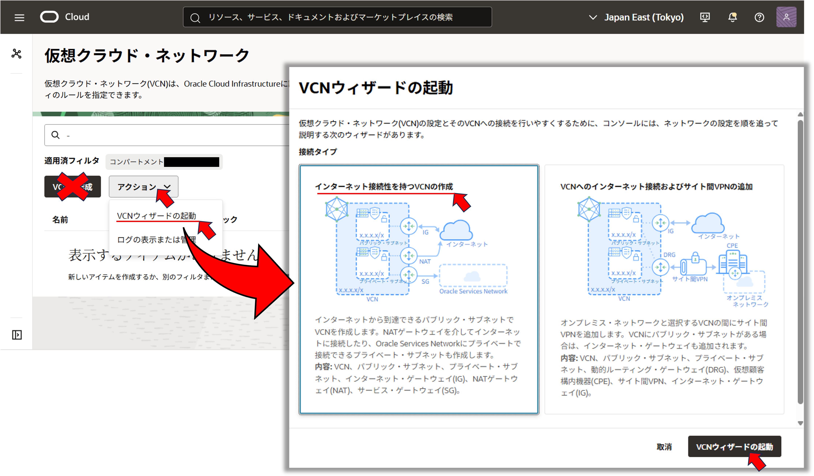

- 「VCN名」に任意の名前を入力して 下の**次**をクリック （この名前は他の自動で作成されるコンポーネントにも使われます。）
- コンパートメントには現在のコンパートメントが表示されています。別のコンパートメントに作成する場合は変更できます。

    

- 作成されるリソース一覧を確認して **作成** 

    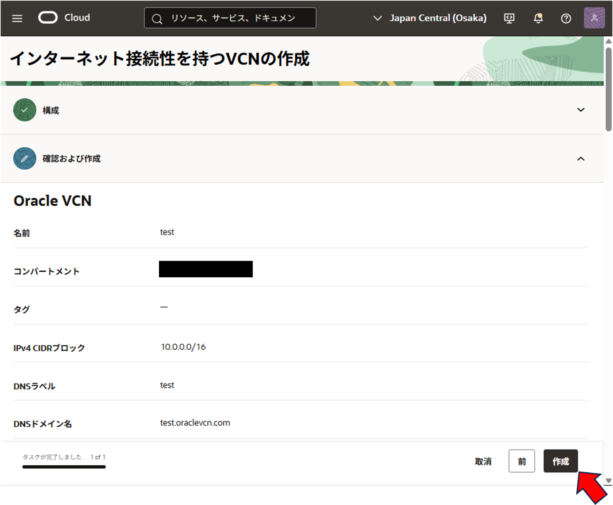

- *結果:* インターネットからアクセス可能な環境が自動生成されました。

    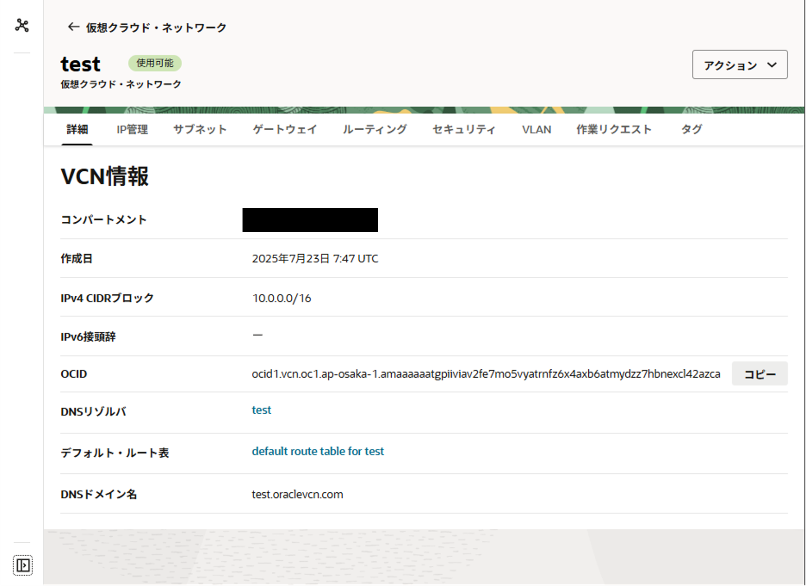

## 3. 作成されたリソースを確認する
ここからはインターネットへの接続設定が構成されているVCNとその中にあるコンポーネントを確認していきます。 

## ① VCN 
- CIDR 範囲: `10.0.0.0/16` (ウィザードでデフォルトで入っていた値) 
- このVCNで使われるDNSドメイン名は <名前>.oraclevcn.com であることを確認します

    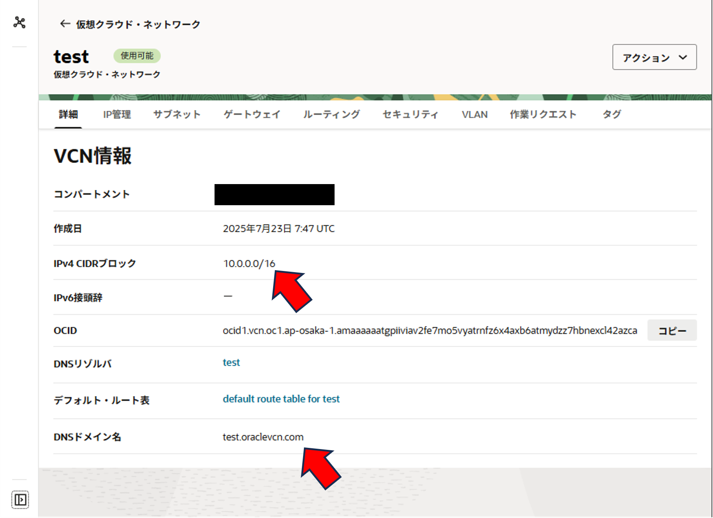

## ② サブネット
サブネットはVCNを分割して作成されるネットワークです。 
VCN詳細画面の上の「サブネット」の欄を見ます。 10.0.0.0/16というネットワークから10.0.0.0/24と10.0.1.0/24の小さなネットワークを切り出しています。

   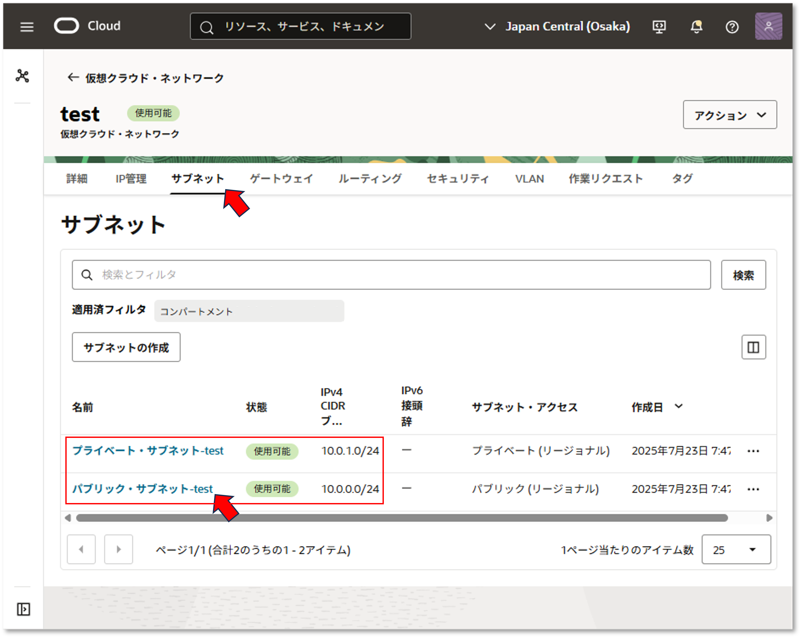

サブネットには2つの種類があります。

| 種類 | サブネット名 | CIDR | 備考　|
|------|------|------|------|
| パブリックサブネット | パブリック・サブネット-<入力名> | 例:`10.0.0.0/24` |パブリックIPが使えます|
| プライベートサブネット | プライベート・サブネット-<入力名> | 例:`10.0.1.0/24` |プライベートIPのみが使えます|

この二種類の違いについてはパブリックIPアドレスを付与できるかできないかの違いで覚えておきましょう。 パブリックIPアドレスとは全世界で被らないIPアドレスなので、インターネットから到達することができます。

## ③ ゲートウェイ
ゲートウェイはVCNのネットワークの境界に位置し、ネットワークの出入り口となるコンポーネントです。 
ウィザードによって3つのゲートウェイが作成されています。

   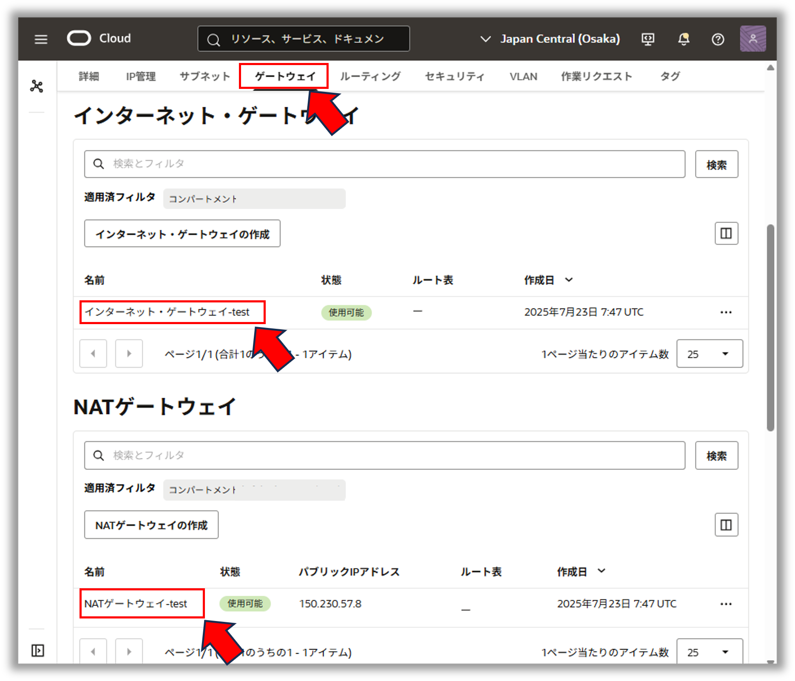

| 種類 | ゲートウェイ名 | 用途 |
|------|------|------|
| インターネットゲートウェイ | インターネット・ゲートウェイ-<入力名> | パブリックサブネットからインターネットへ行くため |
|NATゲートウェイ |NATゲートウェイ-<入力名> |プライベートサブネットからインターネットへ行くため|
|サービスゲートウェイ|サービスゲートウェイ-<入力名> |Oracle Services Networkというリージョン内サービスへ行くため| 

 ウィザードでは作成されませんが、他のゲートウェイとして動的ルーティングゲートウェイ (DRG) やローカル・ピアリング・ゲートウェイがあります。

## ④ ルート表 
ルート表はサブネット内から出ていく通信が次にどこへ行くかを示すコンポーネントです。 

ウィザードによって2つのルート表が作成されており、この2つのルート表はそれぞれパブリックサブネットとプライベートサブネットに紐づいています。

   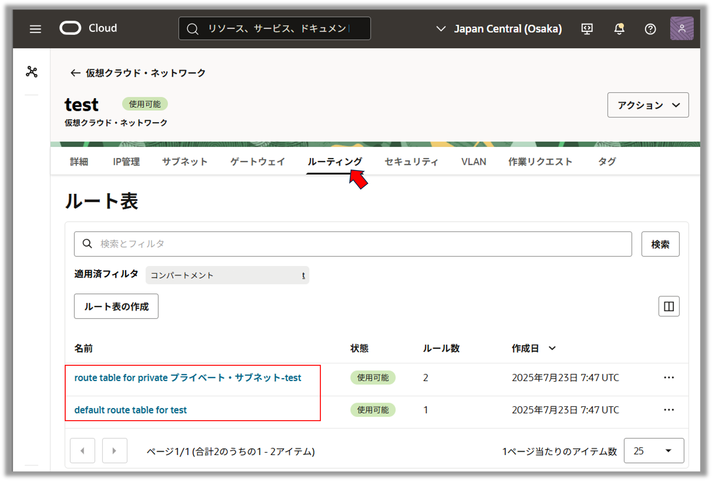

| ルート表の名前 | 紐づくサブネット | 適用される通信 |
|------|------|------|
| default route table for <入力名> | パブリックサブネット | パブリックサブネットから出ていく通信 |
| route table for private プライベート・サブネット-<入力名> | プライベートサブネット | プライベートサブネットから出ていく通信 |

次にパブリックサブネットに紐づくdefault route tableの中身を見てみましょう。
- 宛先：`0.0.0.0/0`
- ターゲット：インターネットゲートウェイ

つまり、パブリックサブネット内のインスタンスからサブネットの外に出るとき、全ての通信（0.0.0.0/0）がインターネットゲートウェイへ行くことになります。 
同様にプライベートサブネットに紐づくルート表はNATゲートウェイとサービスゲートウェイへのルートルールがあります。

   

ちなみに、ルート表がどのサブネットに紐づいているかを確認するには、サブネットの詳細画面から確認します。
default route table for <入力名>はパブリックサブネットに紐づいています。プライベートサブネット用のルート表も同様にプライベートサブネットの詳細画面から確認できます。

## ⑤ セキュリティリスト 
セキュリティリストはファイアウォールのようなコンポーネントで許可する通信を記述します。 
セキュリティリストはサブネットに紐づいてます。
ウィザードによって2つのセキュリティリストが作成されています。

   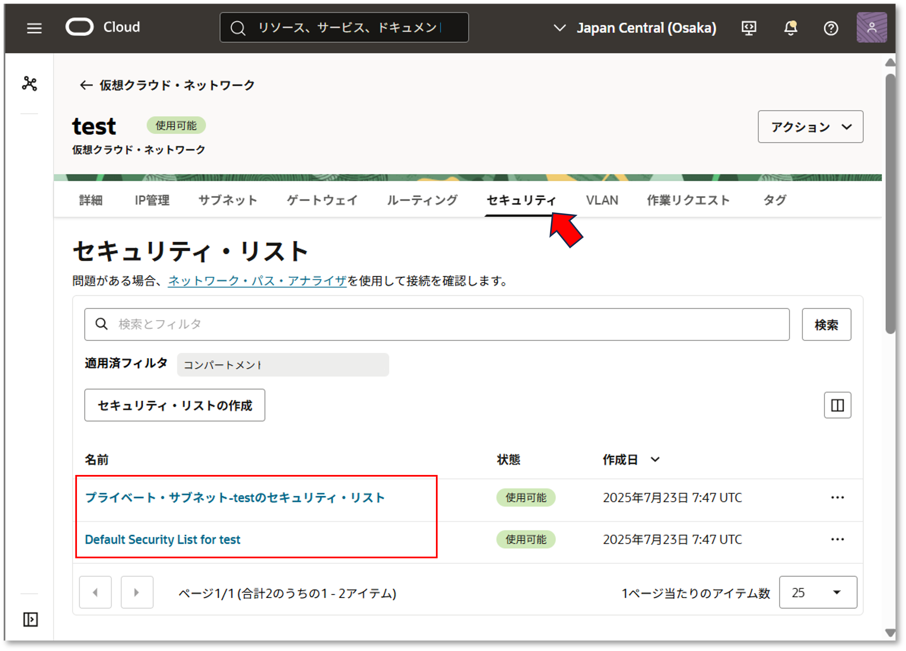

| 名前 | 紐づくサブネット | 備考 |
|------|---------|------|
| Default Security List for test <入力名> | パブリックサブネット | パブリックサブネット内のVNICに適用されるルール |
| プライベート・サブネット-<入力名>のセキュリティ・リスト | プライベートサブネット | プライベートサブネット内のVNICに適用されるルール |

セキュリティリストがどのサブネットに紐づいているかは、サブネットの詳細画面から確認できます。

   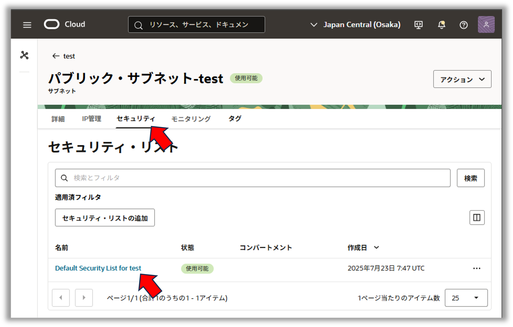

**セキュリティリストのルール記述要素**
---
セキュリティリストのルールには以下の要素がセットとなって記述されています。
- イングレス方向 / エグレス方向 
- 送信元CIDR/宛先CIDR、プロトコル、ポート番号 
- ステートフル / ステートレス 

Default Security List for test <入力名> と書かれたパブリックサブネットに紐づくセキュリティリストを見ていきましょう。 

   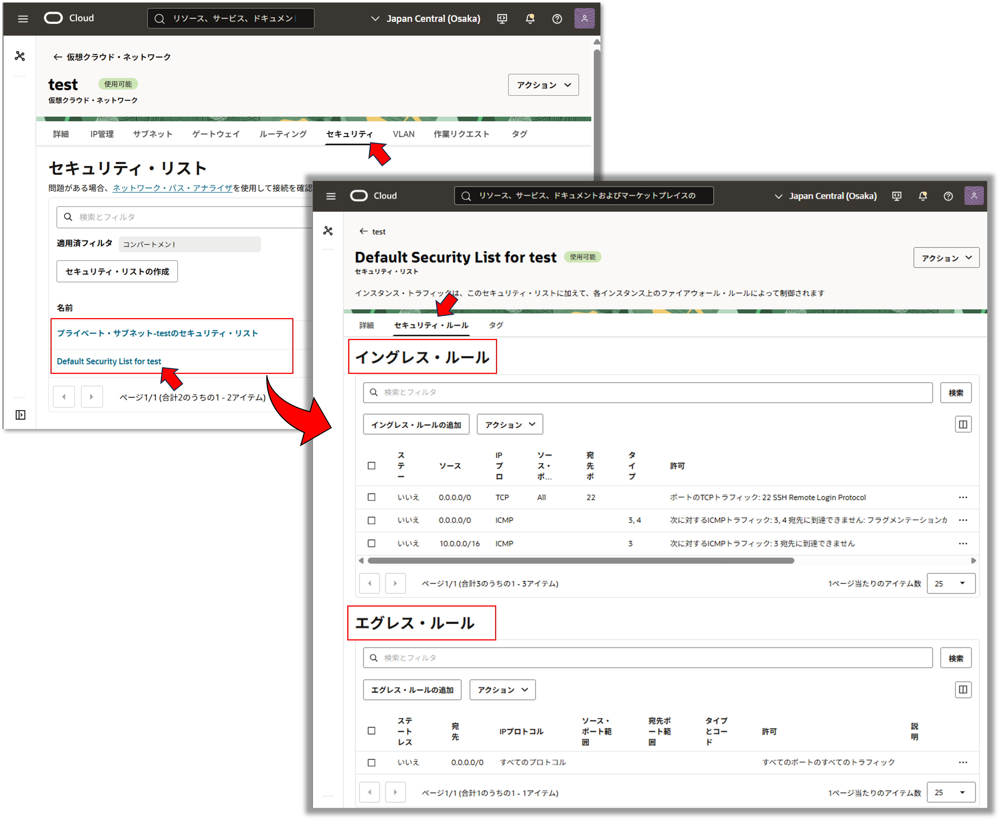

**例: デフォルトのセキュリティリスト (パブリック) のイングレスルール**

| ステートレス  | 送信元 | プロトコル | ポート|
|------|------|------|------|
|いいえ|`0.0.0.0/0` |TCP|22 (SSH通信)|

- ステートレスがいいえ→ステートフル 
ステートフルというのは状態を保持するという意味があるので、例えば行きの通信でイングレスルールに合致したものは、その帰りの通信も自動的に許可されます。
ステートレスルールでは片方向で許可されたとしても、帰りの方向でも許可されていないと通信ができません。 
例えばイングレスルールでSSH通信がステートレスで許可された時、帰っていく通信はエグレスルールでも記述する必要があります。
- 送信元0.0.0.0/0 
すべてのIPアドレスを指します。つまり、送信元がどこでもという意味です。
- TCP22番ポ―ト 
これはsshというリモートログインするプロトコルです。

他にもICMPの一部タイプとコードがデフォルトで設定されています。

**例: デフォルトのセキュリティリスト (パブリック) のエグレスルール**

| ステートレス  | 送信元 | プロトコル |
|------|------|------|
|いいえ|`0.0.0.0/0` |全てのポートすべてのプロトコル|

- 宛先が0.0.0.0/0、つまり全ての宛先への通信が許可されています。
- ステートフルとなっているため、出ていった通信が帰ってくる時にも自動的に許可されます。

つまり、通信の起点がVNICから出ていく方向の通信は全て許可されていて、帰りの通信もステートフルルールによって許可されます。


セキュリティリストは許可する通信のみを記述していくホワイトリスト方式です。
何も書いていない場合、セキュリティリストに適用されたVNICでパケットがブロックされるため通信はできません。  


**（参考） ネットワークセキュリティグループ (NSG)**
 これは⑤のセキュリティリストと役割は同じになります。 
異なる点は紐づくリソースとセキュリティルールが適用される範囲です。

| 比較項目 | 紐づくリソース | 適用範囲 |
|----------|------------------|-----|
|セキュリティリスト | サブネット | サブネット内の全VNIC |
|ネットワークセキュリティグループ| VNIC |紐づけたVNICのみ|


セキュリティリストとネットワークセキュリティグループの両方を使った場合 **OR** 条件で許可される。
通常は片方のみを使って運用。 


## 4. インターネットからインスタンスへSSH接続するときのパケットの動き 
ネットワークはパケットと呼ばれる小さな小包でやり取りされています。
パケットの気持ちになって順番にどのリソースを経由していくのか見ていきましょう。お使いのPCからインターネットを経由してクラウド内のインスタンスにsshを行う場合を考えてましょう。 
次の章のコンピュートインスタンスを作成してSSH接続するものと同じです。

   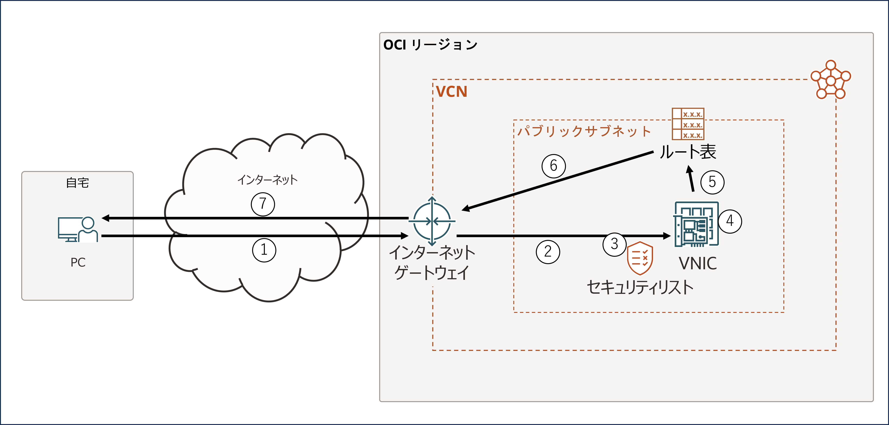

1. ノートPC → インスタンスのパブリックIPが目的地として**インターネットゲートウェイ** へ 
2. インターネットゲートウェイ →インスタンスのIPアドレスにルーティングされます
3. **VNIC** に到達すると**セキュリティリスト** で許可確認 (TCP 22) 
4. インスタンス (OpenSSH) に接続 
5. VNICから出ていく戻りパケットは3のステートフルルールで自動的に許可される 
6. ルート表 `0.0.0.0/0 → インターネットゲートウェイ`というルートルールからインターネットゲートウェイへ向かう 
7. インターネット経由でノートPCへ戻る

---

これで、この章の作業は終了です。

**チュートリアル一覧に戻る :** [Oracle Cloud Infrastructure チュートリアル](../..)