**チュートリアル一覧に戻る :** [入門編 - Oracle Cloud Infrastructure を使ってみよう](..)

**＜その7 - オブジェクト・ストレージを使う＞** では、コンソール画面から**オブジェクト・ストレージ**と呼ばれるストレージを作成し、スタンダード・バケットの作成やオブジェクトのアップロード、ダウンロードなどの基本的な操作、また事前認証リクエストを作成して一般ユーザー向けにダウンロードリンクを生成する手順について学習します。<br>


**所要時間 :** 約10分

**前提条件 :**
- **権限** : 適切なコンパートメント(ルート・コンパートメントでもOKです)と、そこに対する適切なオブジェクト・ストレージの管理権限がユーザーに付与されていること

**注意 :** チュートリアル内の画面ショットについては Oracle Cloud Infrastructure の現在のコンソール画面と異なっている場合があります


**目次：**
---
- [1. オブジェクト・ストレージとは](#1_ObjectStorage_about)
- [2. コンソール画面の確認とバケットの作成](#2_console_bucket)
- [3 オブジェクトのアップロード、ダウンロード](#3_upload_download)
- [4. 事前認証済リクエストの作成](#4_PAR)


- **参考動画：** 本チュートリアルの内容をベースとした定期ハンズオンWebinarの録画コンテンツです。操作の流れや解説を動画で確認したい方はご参照ください。

  - [Oracle Cloud Infrastructure ハンズオン - 7.オブジェクト・ストレージ](https://videohub.oracle.com/media/Oracle+Cloud+Infrastructure+%E3%83%8F%E3%83%B3%E3%82%BA%E3%82%AA%E3%83%B3+-+7.%E3%82%AA%E3%83%96%E3%82%B8%E3%82%A7%E3%82%AF%E3%83%88%E3%83%BB%E3%82%B9%E3%83%88%E3%83%AC%E3%83%BC%E3%82%B8/1_fngpu5mo)


<a id="1_ObjectStorage_about"></a>
## 1. オブジェクト・ストレージとは

**オブジェクト・ストレージ**は、高い信頼性と高い費用対効果を両立するスケーラブルなクラウドストレージです。
オブジェクト・ストレージを利用すると、分析用のビッグ・データや、イメージやビデオ等のリッチ・メディア・コンテンツなど、あらゆるコンテンツ・タイプの非構造化データを無制限に保管できます。


オブジェクト・ストレージはリージョン単位のサービスで、コンピュート・インスタンスからは独立して動作します。オブジェクト・ストレージはOracle Services Network（OSN）にエンドポイントがあり、VCN内からサービスゲートウェイを経由したりインターネットを経由したりしてこのエンドポイントにアクセスすることができます。
OCIのIdentity and Access Management(IAM)機能を利用した適切なアクセスコントロールや、リソース・リミットを設定することも可能です。

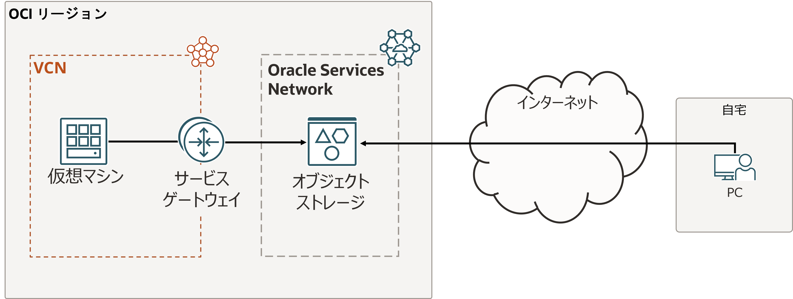


<a id="2_console_bucket"></a>

## 2. コンソール画面の確認とバケットの作成
<br>
**オブジェクト・ストレージの主要用語**
- **バケット（Bucket）:**
    データ（オブジェクト）を保存するための入れ物。すべてのオブジェクトはバケット内に格納される。
- **オブジェクト（Object）:**
    バケットに保存される個々のデータ（ファイル）。ファイル本体とメタデータで構成される
- **ストレージ層:**
    保存データの利用頻度や保存コストに応じて選ぶことができ、以下の3つの層がある。
    - スタンダード層（頻繁にアクセスするデータ）
    - 頻度の低いアクセス層（たまに使うデータ）
    - アーカイブ層（長期間保存・ほとんどアクセスしないデータ）
    
<br>
まず、コンソール画面からバケットを作成していきます。

1. コンソールメニューから **ストレージ → オブジェクト・ストレージとアーカイブ・ストレージ → バケット** を選択し、**バケットの作成** ボタンを押します

2. 以下の項目を入力し、**バケットの作成** ボタンを押します。指定がないものは任意の値でOKです。
    - **バケット名** - 任意の文字列 (このバケット名はテナンシの中で一意である必要があるため同じテナンシで複数のユーザがいる場合は調整する)
    - **デフォルト・ストレージ層** - *標準* を選択
    - **自動階層化の有効化** - チェックなし
    - **オブジェクト・バージョニングの有効化** - チェックなし
    - **オブジェクト・イベントの出力**  - チェックなし
    - **コミットされていないマルチパート・アップロードのクリーンアップ** - チェックなし
    - **暗号化** - *Oracle管理キーを使用した暗号化* を選択  
    
    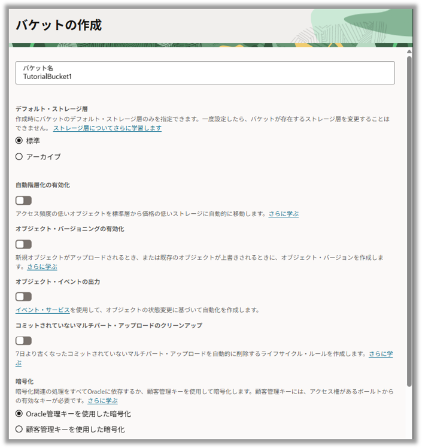


3. バケットの作成が完了し、コンソールに表示されていることを確認します
    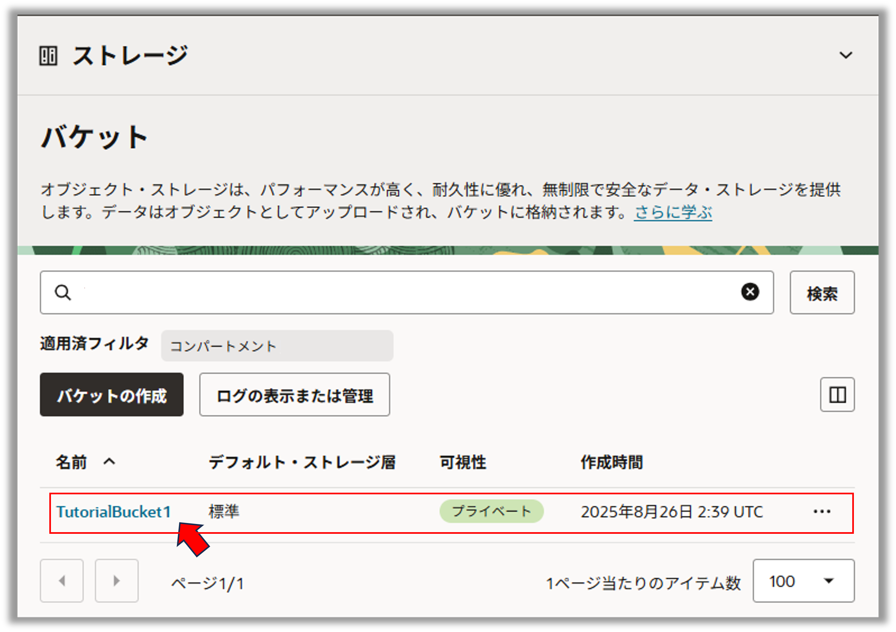


<a id="3_upload_download"></a>
## 3.オブジェクトのアップロード、ダウンロード 


1. 作成したバケット名のリンクをクリックし、バケットの詳細画面から**オブジェクトのアップロード** ボタンを押します
    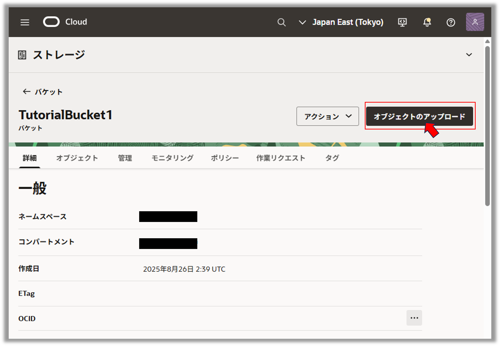

1. 立ち上がった **オブジェクトのアップロード** ウィンドウで **ファイルを選択** リンクを押してローカルPCのファイルを選択するか、またはドラッグ&ドロップでファイルをウィンドウの 「ファイルをドロップするか選択」という場所にドロップします。

    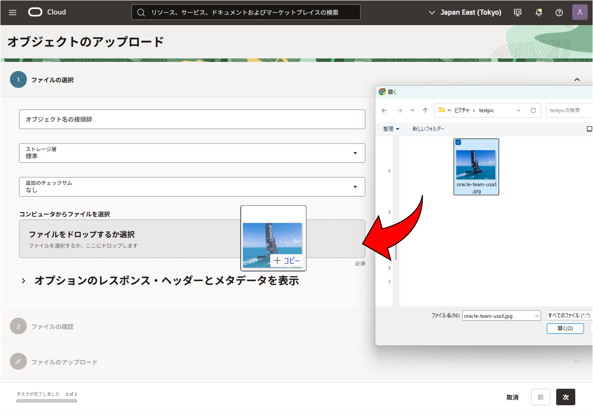


    その他オプションは特に選択しませんが、説明を以下にします。
    - **オブジェクト名の接頭辞** - オブジェクト名の先頭文字列で検索やグルーピングに使う
    - **ストレージ層** - 保存データの利用頻度に応じて選択できる
    - **追加のチェックサム**  - データの整合性確認のために付与するハッシュ値
    - **レスポンスヘッダーとメタデータ**  ‐ オブジェクト取得時に指定ヘッダーやカスタム情報を追加できる

1. オプションは特に指定せず「オブジェクトのアップロード」ボタンを押してアップロードすると、オブジェクトの欄から確認できます。

    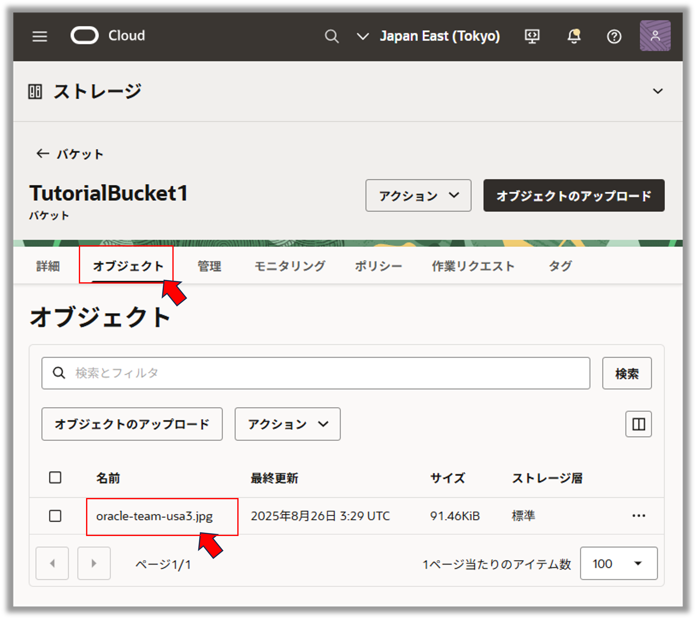

1. アップロードしたオブジェクトの右側の ・・・ メニューから **オブジェクト詳細の表示** を選択し、**ダウンロード** ボタンを押して、オブジェクトが正しくダウンロードできることを確認します。

    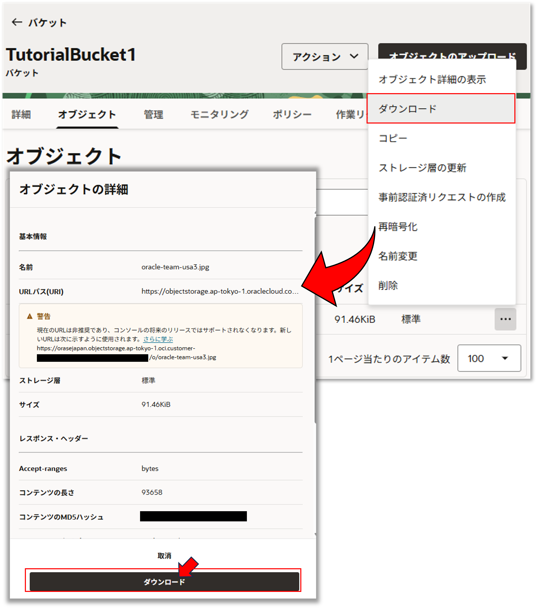


<a id="4_PAR"></a>
## 4. 事前認証済リクエストの作成

事前認証リクエスト(Pre-Authenticated Request) は、Oracle Cloud Infrastructure の認証されたユーザー以外のメンバーに対して、オブジェクトへのアクセス権限を付与する際に利用します。

事前認証リクエストは、バケット単位またはオブジェクト単位で作成でき、個別に読取、書込、読み書きの権限を設定することができ、また有効期限を設定することができます。リクエストを生成すると一意のランダムなアクセスURLが生成されます。

今回は、先ほどアップロードしたオブジェクトに対する読み取り権限を付与する事前認証リクエストを作成します。

1. 先ほどアップロードしたオブジェクトの右側の ・・・ メニューから **事前認証済リクエストの作成** を選択します

1. 立ち上がった **事前認証済リクエストの作成** ウィンドウに以下の項目を入力し、 **事前認証済リクエストの作成** ボタンを押します

    - **名前** - 任意 (画面上では TutorialPreAuthReq と入力しています)
    - **事前認証済リクエスト・ターゲット** - *オブジェクト* を選択
    - **アクセス・タイプ** - *オブジェクトに対する読み取りを許可* を選択
    - **有効期限** - デフォルトのまま

    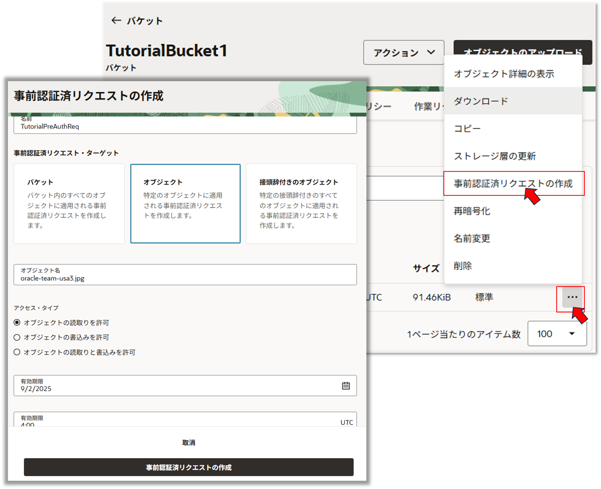

1. 事前認証リクエストの作成が完了すると、リクエストURLが生成されます。ウィンドウに表示された情報を確認し、**事前認証済リクエストのURL** ボックスの右にあるアイコンをクリックして、URLをクリップボードにコピーします


    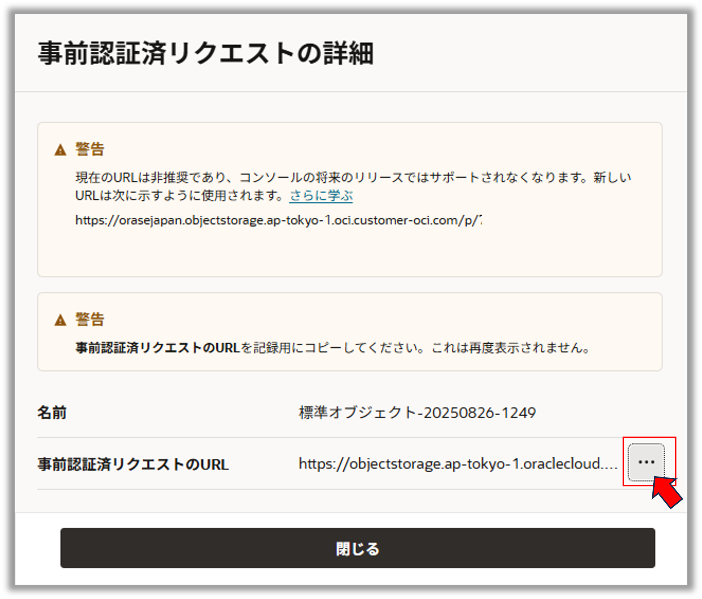

     
   この事前認証済リクエストのページは一度しか表示できません。間違って閉じた場合はもう一度、事前認証済リクエストを作成します。
   

1. 別のブラウザを開き、コピーしたURLをアドレスバーにペーストします
    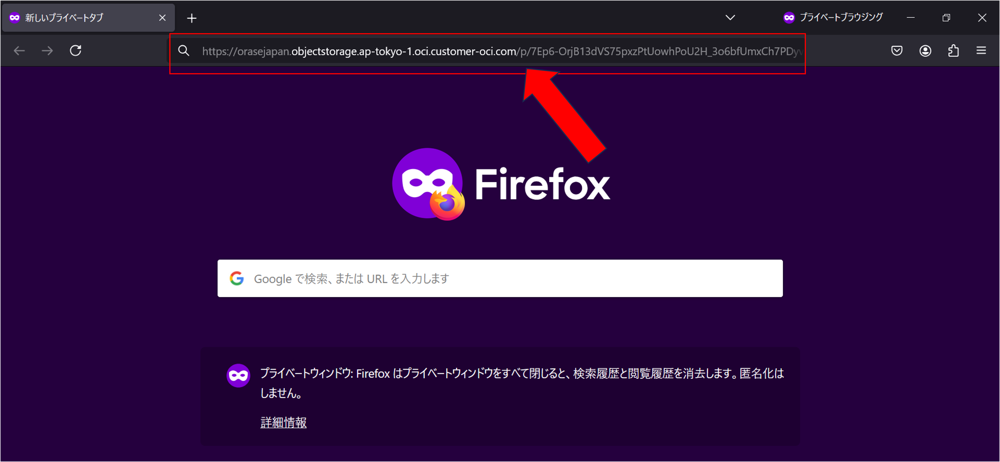


    
   同じブラウザでもOKですが、OCIコンソールを操作しているものとは異なるブラウザ(例えば現在使用しているブラウザがFirefoxならChrome)を立ち上げることで、Oracle Cloud Infrastructure の認証をスキップしていることがより明確に理解できます
   


    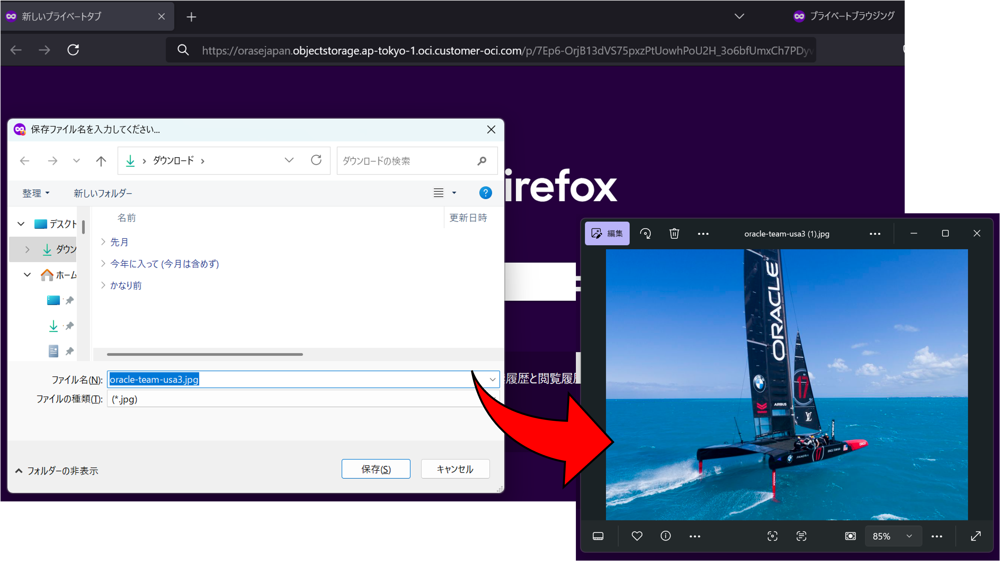
    <br>

    ファイルがダウンロードされ、事前認証済リクエストが正しく機能していることが確認できます。ここではオブジェクトをダウンロードして表示しています。

    
    
   ブラウザからアクセスした場合にファイルのダウンロードが行われず、ウィンドウ内で情報が表示される場合があります。アクセス時の挙動については、ファイルタイプとブラウザの設定に依存します。
   

1. 作成済み事前認証済リクエストを確認します<br>
コンソール画面に戻り、上部の **「管理」** の欄を選択します。作成した事前認証済リクエストが表示されます。右側の ・・・ メニューから **「事前認証済リクエストの削除」** を選択し、先ほど作成した事前認証済リクエストを削除します。

   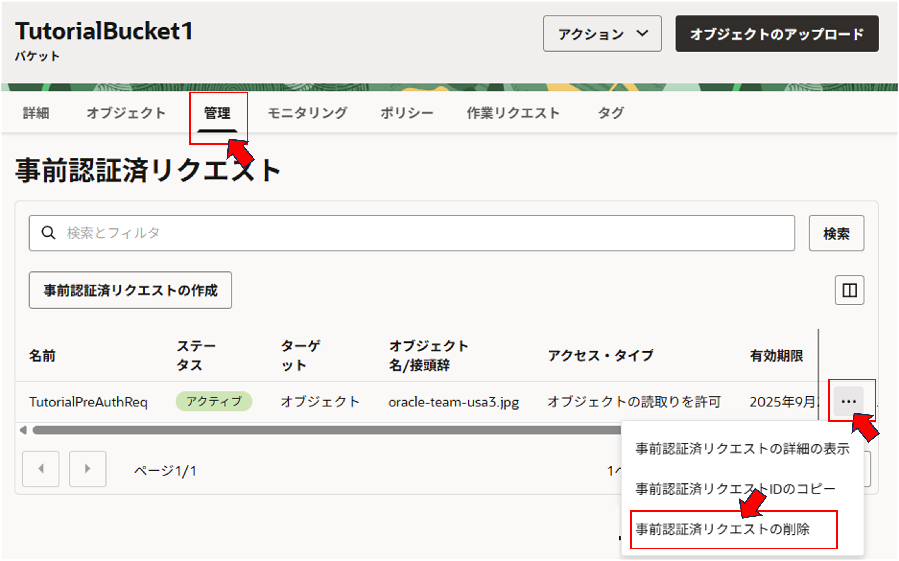


1. 先ほどファイルをダウンロードした、別のブラウザに戻り、リロードボタンを押して再度ファイルのダウンロードを試みます

1. 以下のようなエラーメッセージが表示され、認証が拒否されたことを確認します

    ```{"code":"NotAuthenticated","message":"The required information to complete authentication was not provided."}```

    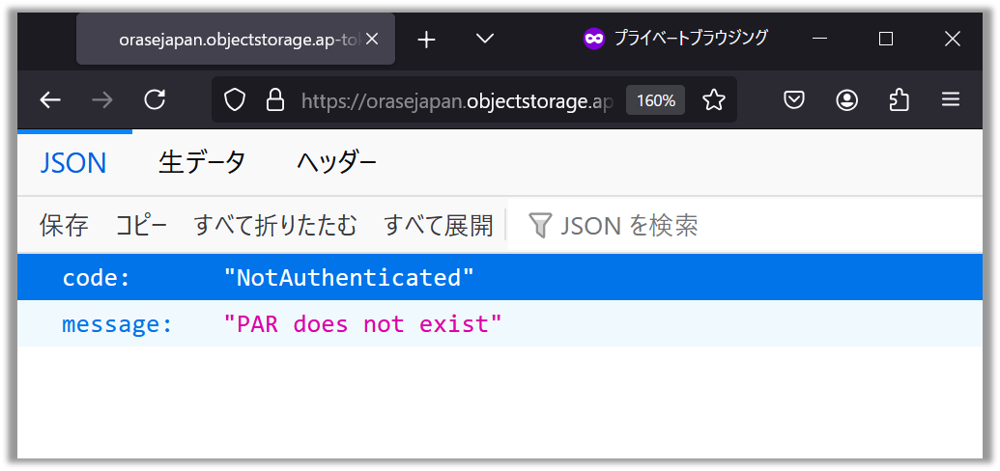

以上で、この章の作業は終了です。


**チュートリアル一覧に戻る :** [入門編 - Oracle Cloud Infrastructure を使ってみよう](..)