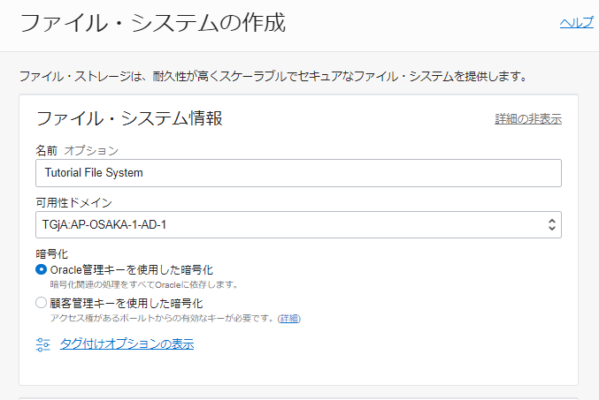
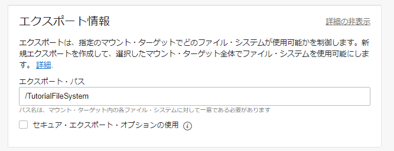
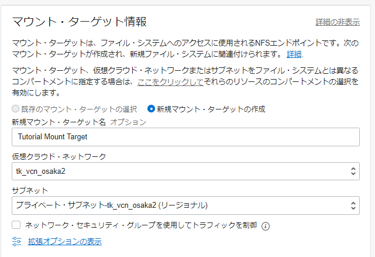
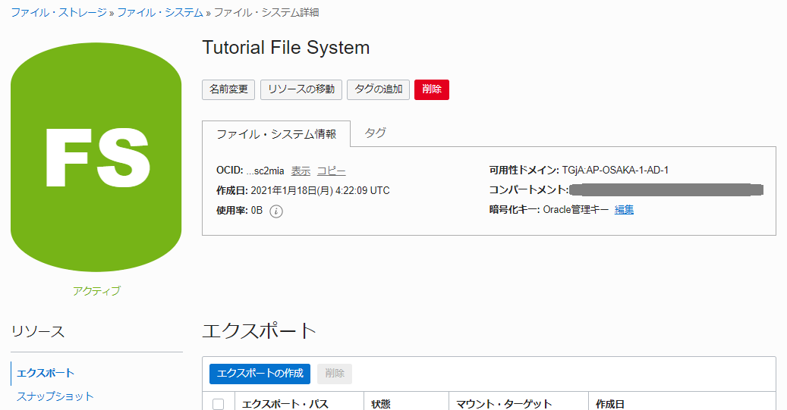
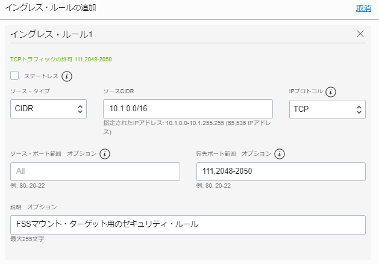
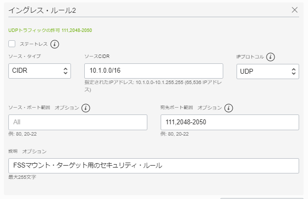
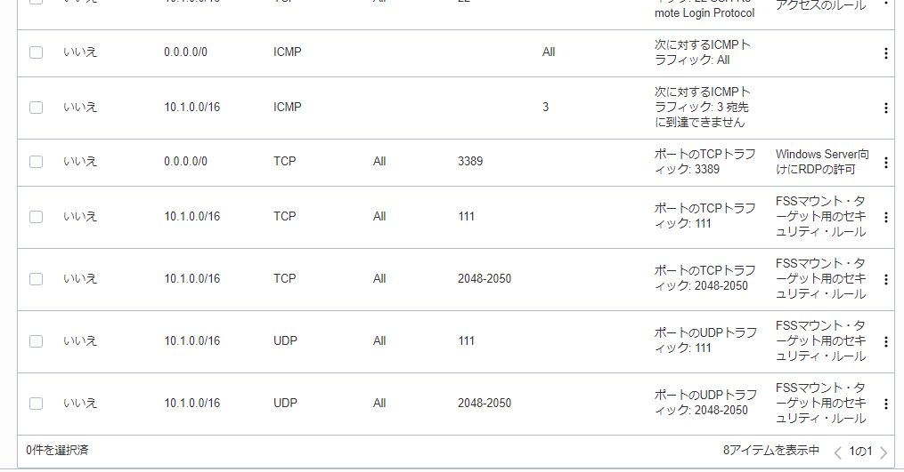

ブロックボリュームはとても便利なサービスですが、残念ながら複数のインスタンスから同時に使える共有ストレージとして使うには、ユーザー自身で共有ファイルシステムを構築する必要があります。しかし共有のストレージボリュームを使いたい場合にも、Oracle Cloud Infrastructure（OCI）にはファイル・ストレージ・サービス(FSS)という便利な NFSv3 対応の共有ストレージ・ボリュームのマネージド・サービスがあります。このチュートリアルでは、FSS を利用して複数のインスタンスから利用できる共有ボリュームを利用する方法について確認していきます。

**所要時間 :** 約20分

**前提条件 :**

1. [インスタンスを作成する - Oracle Cloud Infrastructureを使ってみよう(その3)](https://oracle-japan.github.io/ocitutorials/beginners/creating-compute-instance/) を通じてコンピュート・インスタンスの作成が完了していること
2. [ブロック・ボリュームをインスタンスにアタッチする - Oracle Cloud Infrastructureを使ってみよう(その4)](https://community.oracle.com/docs/DOC-1019345) を通じてブロック・ボリュームのアタッチが完了していること


**注意 :** チュートリアル内の画面ショットについては Oracle Cloud Infrastructure の現在のコンソール画面と異なっている場合があります。

# 1. ファイルシステムの作成

まずは、OCIのコンソールからファイル・システム・サービスのメニューから共有ファイルシステムを作成します。コンソールからファイルシステムを作成すると、コンピュート・インスタンスからアクセスするマウント・ターゲットも同時に作成されます。マウント・ターゲットを作成すると、後から複数のファイルシステムをそこに紐づけることができます。APIやコマンドライン・インタフェース(CLI)を利用した場合は、ファイルシステムとマウント・ターゲットを個別に作成することができます。

1. コンソールメニューから **ファイル・ストレージ → ファイル・システム** を選択します

2. 適切なリージョンとコンパートメントを選んでいることを確認したら、 **ファイル・システムの作成** ボタンを押します
   

3. 立ち上がってきた **ファイル・システムの作成** ウィンドウの **ファイル・システム情報** フィールドにある **詳細の編集** を押して以下の項目を編集します

   - **名前** - 任意 (画面では **Tutorial File System** と入力しています)
   - **可用性ドメイン** - 任意のものを選択
   - **暗号化** - ORACLE管理キーを使用した暗号化（デフォルト）
   - **タグ** - (設定不要)
     

4. **エクスポート情報** フィールドの **詳細の編集** を押して以下の項目を編集します

   - **エクスポート・パス** - 任意 (画面ではデフォルトの **/TutorialFileSystem** のままです)
   - **セキュア・エクスポート・オプションの使用** - チェックなし(デフォルト)
     

5. **マウント・ターゲット情報** フィールドの **詳細の編集** を押して以下の項目を編集します

   - **新規マウント・ターゲットの作成** を選択(デフォルト)
   - ***新規マウント・ターゲット名*** - 任意 (画面では **Tutorial Mount Target** と入力しています)
   - **仮想クラウドネットワーク** -  と同じ仮想クラウド・ネットワーク(VCN) を選択
   - **サブネット** - 任意のサブネットを選択。ここではプライベート・サブネットを選択しています。
   - 

6. 一番下の **作成** ボタンを押します。
   成功すると、ファイルシステムとマウントターゲットが作成されます。
   

   

7. **使用率** が **0B** となっているのを確認します。これは、作成したばかりなのでまだファイルシステムのサイズが 0 Byteであることを示しています。ファイルシステムサービスは、従量制課金のサービスなので、作成したばかりのこの段階では課金は発生せず、ファイルを配置するとその容量に応じて課金が増えていくようになっています。

8. また、下部の **エクスポート** フィールドには、**Tutorial Mount Target** というマウントターゲットの **/TutorialFileSystem** というエクスポートパスに、このファイルシステムがエクスポートされていることがわかります。
   **Tutorial Mount Target** というマウントターゲットへのリンクをクリックして、マウントターゲットの詳細画面に遷移します。

9. 作成したマウント・ターゲットの詳細情報で、**IP address** の欄を確認します。例えば以下の例では、**10.1.1.3** と表示されています。これはVCN内の **10.1.1.3** というIPアドレスで、先ほど作成したファイルシステムがエクスポートされていることを示しています。
   

   

# 2. VCNのセキュリティリストの設定

作成したファイルシステムは、VCNの中のプライベートIPを持つマウントポイントにてエクスポートされています。このマウントポイントに対して、VCN内にあるインスタンス、データベース、コンテナから NFS プロトコルでアクセスすることができますが、初期状態では VCN に存在するファイアウォール (セキュリティ・リスト) によって NFS プロトコルの通信はブロックされてしまいます。

このステップでは、VCNおよびサブネットに割り当てられているセキュリティ・リストのルールを追加して、NFS通信に必要な TCP の 111、2048、2049、2050 番ポートと、UDPの 111、2048番ポートの通信を許可します。

1. コンソールメニューから **ネットワーキング → 仮想クラウド・ネットワーク** を選択し、先ほどマウント・ターゲットを作成したVCNを選択します。

2. 左下の **リソース** メニュー内の **サブネット** をクリックします。

3. マウント・ターゲットを配置したサブネットを選択します。

4. サブネットに紐づけられている **セキュリティ・リスト** の名前をクリックします。QuickStartテンプレートでVCNを作成している場合は、**Default Security List for XXX** と、もしくは、**プライベート・サブネット - VCN名のセキュリティ・リスト** という名前のセキュリティ・リストが一つ表示されているはずです。そちらのリンクをクリックします。

5. 開いたセキュリティ・リストの詳細画面で、 **イングレス・ルールの追加** ボタンを押します。

6. 立ち上がってきた **イングレス・ルールの追加** ウィンドウの **イングレス・ルール1** フィールドに以下の情報を追加します

   - **ステートレス** - チェックなしのまま
   - **ソース・タイプ** - CIDR (デフォルト)
   - **ソースCIDR** - VCNのCIDR を入力
   - **IPプロトコル** - TCP (デフォルト)
   - **ソース・ポート範囲** - 入力なし
   - **宛先ポート範囲** - 111,2048-2050
   - **説明** - 任意（ここでは、FSSマウント・ターゲット用のセキュリティ・ルール）と記載しています。
     

7. **+別のイングレス・ルール** というボタンをクリックし、開いたフィールドに以下の情報を追加します

   - **ステートレス** - チェックなしのまま
   - **ソース・タイプ** - CIDR (デフォルト)
   - **ソースCIDR** - VCNのCIDR を入力
   - **IPプロトコル** - **UDP**
   - **ソース・ポート範囲** - 入力なし
   - **宛先ポート範囲** - 111,2048-2050
   - **説明** - 任意（ここでは、FSSマウント・ターゲット用のセキュリティ・ルール）と記載しています。
   - 

8. 下部の **イングレス・ルールの追加** ボタンを押して変更を確定します。

9. **イングレス・ルール** に4つのエントリーが追加されたことを確認します。
   

   

# 3. ファイルシステムのマウント

作成したファイルシステムは、マウントターゲットにエクスポートされている状態なので、このままNFSクライアントからネットワーク越しにアクセスすることができます。

このステップでは、作成済みの Oracle Linux 7.x のインスタンスからネットワーク越しにファイルシステムをマウントする方法を実施します。


1. 任意のターミナルソフトを起動し、 で作成したインスタンス (または任意のLinuxインスタンス) に ssh 接続します。

2. 以下のコマンドで、NFSクライアントを含むパッケージをインストールします

   ```
   $ sudo yum -y install nfs-utils
   ```

3. ファイルシステムをマウントするマウントポイントを作成します

   ```
   $ sudo mkdir -p /mnt/TutorialFileSystem
   ```

4. 以下のコマンドでマウントします

   ```
   $ sudo mount 10.x.x.x:/TutorialFileSystem /mnt/TutorialFileSystem
   ```

   **10.x.x.x** の部分と、 **/TutorialFileSystem** の部分を、それぞれご自身が作成したマウントターゲットのIPアドレスと、ファイルシステムのエクスポートパスで書き換えてください。

5. プロンプトがエラーなく帰ってくると、マウントが成功しています。以下のコマンドでマウントされたことを確認します。

   ```
   $ df -h
   ```

   マウントが成功していると、以下のように、指定したマウントターゲットにNFSボリュームが見えています。

   

   

# 4. (オプション) スナップショットの作成

Oracle Cloud Infrastructure の File Storage Service では、スナップショット機能をサポートしています。スナップショットを利用することで、ある時点のファイルシステムの情報を断面として保管し、将来その時点の情報が必要になった場合にファイルとして閲覧したり、復元したりできるようになります。スナップショットはGUIコンソール、APIなどもサポートしていますが、ここではファイルシステムをマウントしている Linux インスタンスのターミナルからスナップショットを取得する方法を見ていきます。

> File Storage Servie のスナップショットは、コピー・オン・ライトによって取得されます。これはある時点からの差分のデータのみをデータとして保管し、元データはそのまま残すような仕組みのため、データバックアップとしての用途には適していません。ファイルシステムそのものの破損に対処するためにバックアップが必要になる場合は、スナップショットと組み合わせて必ずデータのコピーを他のブロック・ボリュームやオブジェクト・ストレージなどに取得するようにしてください。


1. 以下のコマンドで、マウントしているファイルシステム上に **testfile** というファイルを作成します。

   ```
   $ cd /mnt/TutorialFileSystem
   $ sudo touch testfile
   $ ls
   testfile
   ```

2. **.snapshot** というディレクトリの下に、任意の名前のディレクトリ (下記の例では**testsnapshot**) を作成します

   ```
   $ sudo mkdir ./.snapshot/testsnapshot
   ```

   少し間が空いてプロンプトが帰ってきます。これでスナップショットが作成されています。

3. 先ほど作成した **testfilie** というファイルを削除します

   ```
   $ sudo rm testfile
   ```

4. ファイルが削除されていることを確認します

   ```
   $ ls
   ```

5. 先ほど取得した **testsnapshot** というスナップショットの中身を確認します

   ```
   $ ls .snapshot/testsnapshot
   testfile
   ```

   スナップショットの中には、先ほど削除した **testfile** というファイルが残っていることがわかります。

6. 以下のコマンドで、 **testfile** をスナップショットから復元します。

   ```
   $ sudo cp .snapshot/testsnapshot/testfile .
   ```

7. 復元したファイルを確認します

   ```
   $ ls
   testfile
   ```

8. 作成したスナップショットは、GUIコンソールからも確認できます。
   コンソールメニューの **ファイル・ストレージ → ファイル・システム** にアクセスし、作成した**ファイルシステム名**のリンクをクリックします

9. **リソース** メニューから **スナップショット** を選択します

10. 先ほど作成した testsnapshot という名前のスナップショットがあることを確認します。
    


以上でこのチュートリアルは終了です。
