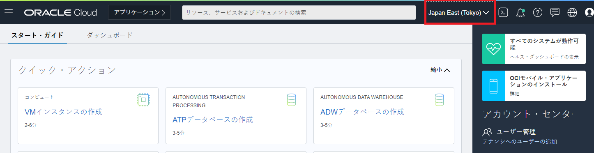

この文書は Oracle Blockchain Platform（OBP）のインスタンス作成方法をステップ・バイ・ステップで紹介するチュートリアルです。

```
この文書は、2021年4月時点での最新バージョン(21.1.2)を元に作成されています。
```

<br>

# 1. 準備

## 1.1 Oracle Cloud の環境を準備する

Oracle Cloud のアカウントを準備します。現在、OBP は無料トライアル期間（Free Trial Credit）および Always Free で利用できるサービスには含まれていないため、有償アカウントが必要です。

## 1.2 Oracle Cloud にサイン・インする

OBP インスタンスは、**Oracle Cloud Infrastructure コンソール**（以降 OCI コンソール）から作成します。ここでは、前の手順で作成した **テナント管理ユーザー** で OCI コンソールにアクセスします。

こちらのチュートリアルもあわせてご確認ください。

- [その 1 - OCI コンソールにアクセスして基本を理解する](https://oracle-japan.github.io/ocitutorials/beginners/getting-started/)

1.  Web ブラウザで、以下の URL にアクセスします。

    - https://cloud.oracle.com

1.  **Cloud Account Name （クラウドアカウント名）** を入力し、**Next** をクリックします。  
    **Cloud Account Name** には、Oracle Cloud 契約時、もしくはトライアル環境を申し込んだ際に払い出される一意の ID（クラウド・アカウント）を入力します。

      

1.  左側の **Single Sign-On (SSO)** の下の **Continue** をクリックします。  
    左側の Single Sign-On (SSO) は、IDCS で認証されます。ここでサイン・インできれば、条件の「1. IDCS ユーザーであること」は OK となります。

      

1.  **ユーザー名** と **パスワード** を入力し、サイン・インをクリックします。

    

1.  OCI コンソールが表示されます。

    

## 1.3 コンパートメントの作成

```
この手順は必須ではありません。
ただし、セキュリティ上の理由から、Oracleでは、既存のルート・コンパートメントを使用するのではなく、
新規コンパートメントを作成して使用することを強くお薦めします。
```

OBP インスタンスを作成する際に、**コンパートメント(Compartment)** を指定します。必要に応じて OBP インスタンスが利用するコンパートメントを事前に作成します。
ここでは、ルート・コンパートメント配下に **OBP** コンパートメントを作成します。

1. OCI コンソールを開き、左上のメニュー → **「アイデンティティ」→「コンパートメント」** を選択します。

   

1. **「コンパートメントの作成」** をクリックします。

   

1. **「名前」** と **「説明」** を入力し、**「コンパートメントの作成」** をクリックします（ここでは OBP コンパートメントを作成）。

   

1. **OBP** コンパートメントが作成されます。

   

# 2. OBP インスタンスの作成

OBP インスタンスを作成します。

## 2.1 OBP インスタンスのプラットフォーム・ロールについて

OBP はパーミッション型のブロックチェーンプロトコルである Hyperledger Fabric をベースとしたブロックチェーンプラットフォームです。OBP のひとつのインスタンスは、Hyperledger Fabric におけるひとつの Organization に対応しています。

OBP はひとつ～複数のインスタンス（また、OBP 以外の Hyperledger Fabric の Organization）でブロックチェーン・ネットワークを構成することができます。OBP インスタンス作成時に、「プラットフォーム・ロール」の項目で、インスタンス作成と同時にブロックチェーン・ネットワークを新たに作成する（→Founder インスタンス）か、既存のブロックチェーン・ネットワークに参加することを前提にインスタンスを作成する（Participant インスタンス）かを選ぶことになります。

プラットフォーム・ロールはインスタンス作成後には変更できないため、ブロックチェーン・ネットワークを作成するのか、既存のブロックチェーン・ネットワークに参加するのかを適切に判断してからインスタンス作成を始めてください。

## 2.2 OBP インスタンスの作成

1. OCI コンソールを開きます。

1. OBP インスタンスを作成するデータリージョンを選択します（ここでは **Japan East(Tokyo)** を選択）。

   

1. 左上のメニューをクリックし、**「Blockchain Platform」** をクリックします。

   

1. 画面左の「コンパートメント」で、**OBP インスタンスを作成するコンパートメント** （ここでは OBP コンパートメント）を選択し、**「ブロックチェーン・プラットフォームの作成」** をクリックします。

   

1. **「インスタンス名」** と **「説明」** を入力し、**「プラットフォーム・ロール」**を適切に選択し、**「作成」** をクリックします。

   

   > **Memo**  
   > インスタンス名は、Hyperledger Fabric における Organization 名として扱われます。

1. OBP インスタンスの作成（プロビジョニング）が開始されます。プロビジョニング中のインスタンス名（ここでは gen2founder）をクリックします

   

1. しばらく（15 分程度）待つと、OBP インスタンスの作成が完了します。OBP インスタンスがアクティブであることを確認します、

   

## 2.3 OBP インスタンス作成完了後のサービス・コンソールの確認

```
この手順は必須ではありません。
```

1. OBP インスタンスの詳細画面から、「サービス・コンソール」をクリックします。

   

1. OBP のサービス・コンソールが開きます。以下の画面はそれぞれプラットフォーム・ロールで新規のネットワーク作成を選んだ場合（Founder インスタンス）の場合のもの、既存のネットワークに参加（Participant インスタンス）を選んだ場合のものです。

   
   <br>
   

## 2.4 OBP インスタンスの作成オプションについて

OBP インスタンスを作成する際に、いくつかのオプションを選択することができます。ここでは、前述のインスタンス作成時に指定しなかったものも含め、そのオプションについて説明します（※ **_太字斜体_** がデフォルト設定）

1. **プラットフォーム・ロール**
   ブロックチェーン・ネットワークを作成するのか、既存のブロックチェーン・ネットワークに参加するのかのオプションです。

   - **_新規のネットワークを作成します_** （インスタンス作成と同時にブロックチェーン・ネットワークを新たに作成します。）

   - 既存のネットワークに参加します （既存のブロックチェーン・ネットワークに参加するためのインスタンスを作成します）

1. **エディション**
   インスタンスに割り当てられる CPU、メモリ、ストレージのリソースのサイズおよび利用料金に係わるオプションです。

   - **_標準_** （2 OCPU と 50GB のストレージ固定）

   - ENTERPRISE （さらに Small: 4 OCPU／Medium: 8 OCPU／Large: 16 OCPU／X-Large: 32 OCPU のいずれかのシェイプを選択する。OCPU 数はインスタンス作成後に変更可能。ストレージは 150GB が付属しており、インスタンス作成後に 1TB 単位で追加可能。）

1. **サードパーティ CA 証明書アーカイブ**

   - **_なし_** （インスタンスに付随する Certificate Authority の発行する自己署名証明書をインスタンス内のノードの証明書として発行します。）

   - CA アーカイブをアップロード （アップロードした証明書の Certificate Authority を中間 CA としてノード用の証明書を発行します。）

<br>

以上でこのチュートリアルは終了です。
