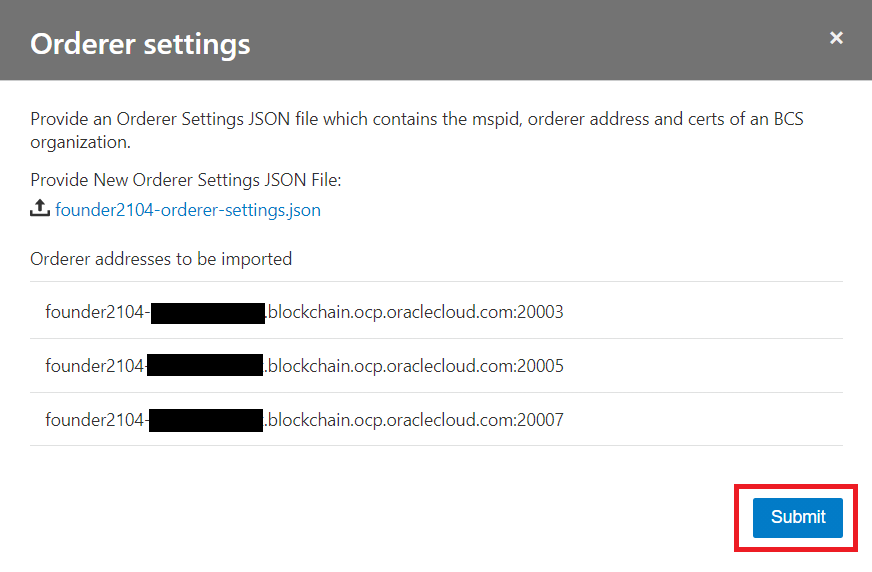

この文書は Oracle Blockchain Platform（OBP） の Participant インスタンスをブロックチェーン・ネットワークに参加させる方法をステップ・バイ・ステップで紹介するチュートリアルです。

このチュートリアルではふたつの OBP インスタンスでブロックチェーン・ネットワークを構成していますが、3 以上のインスタンスから成るブロックチェーン・ネットワークを構成する場合にも、基本的に同一の手順で実施可能です。

```
この文書は、2021年4月時点での最新バージョン(21.1.2)を元に作成されています。
```

- **前提 :**

  - [Oracle Blockchain Platform のインスタンス作成](../01_01_create_instance/)を完了
  - Founder インスタンスと Participant インスタンスそれぞれのインスタンスを所持

<br>

# 0. 前提の理解

## 0.1 Founder インスタンスと Participant インスタンス

OBP はパーミッション型のブロックチェーンプロトコルである Hyperledger Fabric をベースとしたブロックチェーンプラットフォームです。OBP はひとつ～複数のインスタンスでブロックチェーン・ネットワークを構成することができます。

OBP インスタンス作成時に、「プラットフォーム・ロール」の項目で、インスタンス作成と同時にブロックチェーン・ネットワークを新たに作成する（→Founder インスタンス）か、既存のブロックチェーン・ネットワークに参加することを前提にインスタンスを作成する（→Participant インスタンス）かを選択します。

Founder インスタンスの場合は、作成したブロックチェーン・ネットワークに参加した状態でインスタンスが作成されるため、そのままで各種のオペレーションが可能です。

一方、Participant インスタンスの場合は、まずブロックチェーン・ネットワークへの参加が必要です。

## 0.2 このチュートリアルでの例となるインスタンス名とブロックチェーン・ネットワーク構成

このチュートリアルの例では、 _Founder2104_ というインスタンス名の Founder インスタンスと、 _Member2104_ というインスタンス名の Participant インスタンスを扱います。

Founder2104 によって作成されたブロックチェーン・ネットワークに、Member2104 を参加させていきます。

# 1 Participant インスタンスの証明書を Founder インスタンスに取り込む

Founder インスタンスに Participant インスタンスをブロックチェーン・ネットワークのメンバーとして認識させるため、Participant インスタンスの Organization 証明書を Founder インスタンスにアップロードし取り込ませます。

## 1.1 Participant インスタンスの証明書をダウンロード

Participant インスタンスの OBP サービス・コンソールから、Organization 証明書をダウンロードします。

1.  OCI コンソールを開きます。

1.  OBP インスタンスの存在するデータリージョンを選択します（ここでは **Japan East(Tokyo)** を選択）。

    

1.  左上のメニューをクリックし、**「Blockchain Platform」** をクリックします。

    

1.  画面左の「コンパートメント」で、**OBP インスタンスの存在するコンパートメント** （ここでは gaku.nakamura コンパートメント）を選択します。

    

1.  選択したデータリージョン、コンパートメントに存在するインスタンスの一覧が表示されます。**Participant インスタンス** （ここでは member2104）をクリックします。

    

1.  インスタンス詳細画面が表示されます。**サービス・コンソール** をクリックします。

    

1.  サービス・コンソールが開き、ダッシュボードが表示されます。上部のメニューから**Network** をクリックします。

    

1.  Network ページが表示されます。表示されている Organization の一覧から、**自身の Organization の行の右側にあるメニューボタン**から、**Export Certificates**をクリックします。

    

1.  Organization 証明書ファイルがダウンロードされます。このファイルは後続の手順で必要になります。

    

## 1.2 Participant インスタンスの証明書を Founder インスタンスにアップロード

Founder インスタンスの OBP サービス・コンソールから、Participant インスタンスの Organization 証明書をアップロードし取り込みます。

1.  先程の手順と同様に、OBP インスタンスの一覧を表示します。**Founder インスタンス** （ここでは founder2104）をクリックします。

    

1.  インスタンス詳細画面が表示されます。**サービス・コンソール** をクリックします。

    

1.  サービス・コンソールが開き、ダッシュボードが表示されます。上部のメニューから**Network** をクリックします。

    

1.  Network ページが表示されます。**Add Organizations**をクリックします。

    

1.  開いたダイアログで、**Upload Organization Certificates**をクリックします。

    

1.  ファイル選択ダイアログで、Participant インスタンスの証明書を選択し、アップロードします。

1.  アップロードしたファイルが表示に反映されていることを確認し、**Add**をクリックします。

    

1.  成功メッセージが表示されていることを確認し、**Finish**をクリックします。

    

1.  Network ページが表示されます。Founder インスタンスからは Participant インスタンスがブロックチェーン・ネットワークのメンバーとして認識され、Organization 一覧に表示されるようになっています。

    

# 2 Founder インスタンスの証明書を Founder インスタンスに取り込む

Participant インスタンスからも自身が参加したブロックチェーン・ネットワークを認識できるようにする必要があります。このために、Founder インスタンスの Orderer の設定ファイルを Participant インスタンスにアップロードし取り込ませます。

## 2.1 Founder インスタンスの Orderer 設定ファイルをダウンロード

Founder インスタンスの OBP サービス・コンソールから、Ordering Service 設定ファイルをダウンロードします。

1.  先程の手順と同様に、**Founder** のサービス・コンソールを開きます。上部のメニューから**Network** をクリックします。

    

1.  Network ページが表示されます。表示されている Organization の一覧から、**自身の Organization の行の右側にあるメニューボタン**から、**Export Orderer Settings**をクリックします。

    

1.  Orderer 設定ファイルがダウンロードされます。このファイルは後続の手順で必要になります。

    

## 2.2 Orderer 設定ファイルを Participant インスタンスにアップロード

Participant インスタンスの OBP サービス・コンソールから、Orderer 設定ファイルをアップロードし取り込みます。

1.  先程の手順と同様に、**Participant** のサービス・コンソールを開きます。上部のメニューから**Network** をクリックします。

    

1.  Network ページが表示されます。**Orderer Settings**をクリックし、開いたメニューから**Import**を選択します。

    

1.  開いたダイアログで、**Upload Orderer Settings**をクリックします。

    

1.  ファイル選択ダイアログで、Orderer 設定ファイルを選択し、アップロードします。

1.  アップロードしたファイルが表示に反映されていることを確認し、**Submit**をクリックします。

    

1.  Network ページが表示されます。Participant インスタンスが自身の参加したブロックチェーン・ネットワークを認識し、Founder インスタンスが Organization 一覧に表示されるようになっています（表示されていない場合は右上の更新ボタンをクリックすると表示がリフレッシュされて表示されるようになります）。

    

1.  また、ブロックチェーン・ネットワークに参加したことで Participant インスタンスのコンソールでも Founder インスタンスと同様に様々な機能が使えるようになっています。Dashboard ページを開くと、リソースやトランザクション状況などが表示されるようになっています。

    

<br>

以上でこのチュートリアルは終了です。
