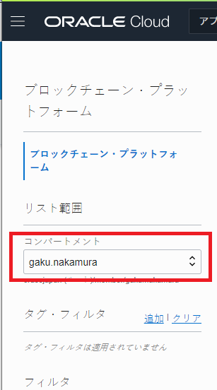
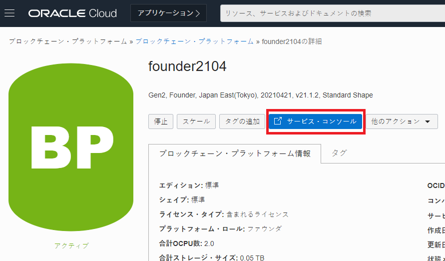
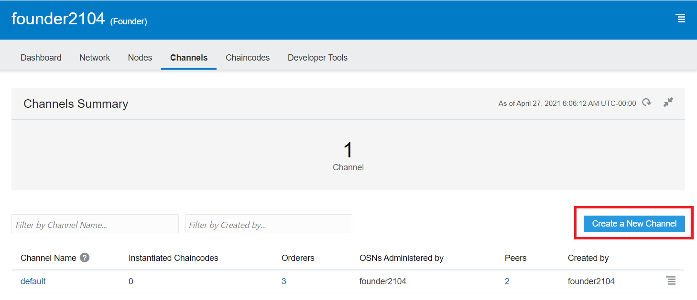
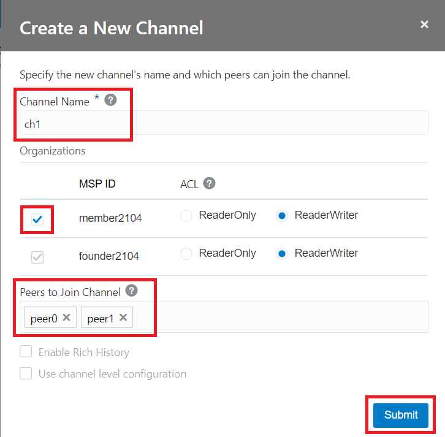
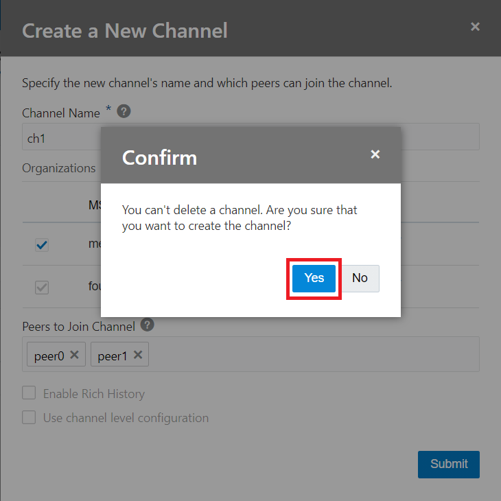
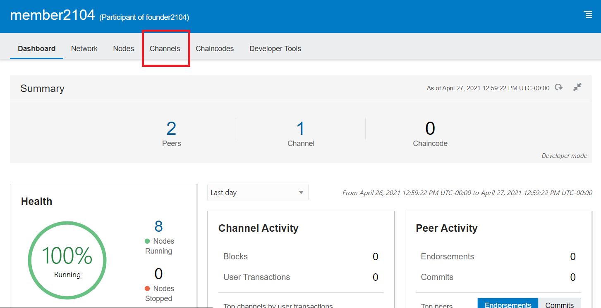
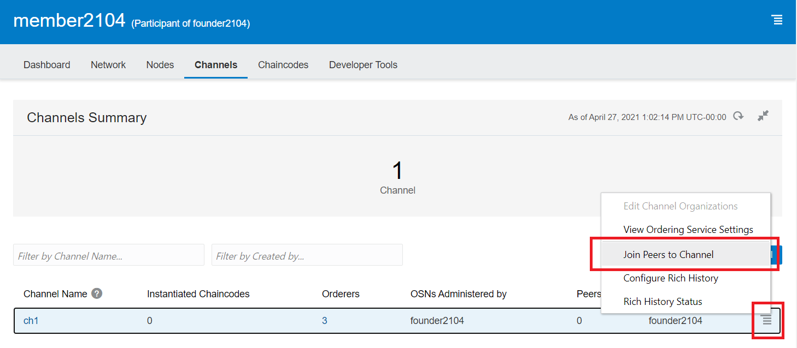

この文書は Oracle Blockchain Platform（OBP）で Channel を作成する方法、および Channel への インスタンスとPeer ノードの追加をステップ・バイ・ステップで紹介するチュートリアルです。

```
この文書は、2021年4月時点での最新バージョン(21.1.2)を元に作成されています。
```

- **前提 :**

  - [Oracle Blockchain Platform のインスタンス作成](../01_01_create_instance/)を完了

<br>

# 0. 前提の理解

## 0.1 Hyperledger Fabric における Channel

OBP はパーミッション型のブロックチェーンプロトコルである Hyperledger Fabric をベースとしたブロックチェーンプラットフォームです。

Hyperledger Fabric では、ブロックチェーン・ネットワークの中でのデータとロジックの共有範囲の制御などのための機能として、Channel という仕組みを備えています。Channel はブロックチェーン・ネットワークに対してある種のサブネットワークとして機能し、Channel ごとに参加する Organization、Peer、Orderer を構成したり、動作させる Chaincode を定義したりすることなどができます。

Channel はまず Organization レベルで参加し、その後 Organization 内で配下の Peer や Orderer を追加する、という 2 層での所属関係があります。

## 0.2 このチュートリアルでのブロックチェーン・ネットワーク構成

このチュートリアルの例では、 _Founder2104_ という Founder インスタンスと、 _Member2104_ という Participant インスタンスから成るブロックチェーン・ネットワークとなっています。

なお、ここでの例では Founder インスタンスで Channel を作成し、Participant インスタンスをその Channel に作成していますが、Participant インスタンスで Channel を作成し、Founder インスタンスや他の Participant インスタンスを参加させることも可能です。その際も手順はほぼ同様です。

# 1 Founder インスタンスで Channel を作成する

Founder インスタンスで Channel を作成します。

1.  OCI コンソールを開きます。

1.  OBP インスタンスの存在するデータリージョンを選択します（ここでは **Japan East(Tokyo)** を選択）。

    

1.  左上のメニューをクリックし、**「Blockchain Platform」** をクリックします。

    

1.  画面左の「コンパートメント」で、**OBP インスタンスの存在するコンパートメント** （ここでは gaku.nakamura コンパートメント）を選択します。

    

1.  選択したデータリージョン、コンパートメントに存在するインスタンスの一覧が表示されます。**Founder インスタンス** （ここでは founder2104）をクリックします。

    

1.  インスタンス詳細画面が表示されます。**サービス・コンソール** をクリックします。

    

1.  サービス・コンソールが開き、ダッシュボードが表示されます。上部のメニューから**Channels** をクリックします。

    

1.  Channels ページが表示されます。**Create a New Channel**をクリックします。

    

1.  Channel 情報入力ダイアログが表示されます。任意の**Channel 名**（例では*ch1*）を入力します。また、参加させたい Organization（OBP インスタンス）があれば**Organizations の欄でチェック**をしておきます（例では*member2104*を追加）。そして、自身の Peer ノードのうち、Channel に加えたい**Peer ノードを Peers to Join Channel で追加**しておきます。準備ができたら**Submit**をクリックします。

    

> **Memo**  
> Organization および Peer ノードは、Channel 作成時点で追加しなかった場合には後からも追加できます（手順は後述）。

1.  確認ダイアログが表示されます。Channel は一度作成すると削除できない（Hyperledger Fabric の仕様）ので注意してください。問題なければ**Yes**をクリックします。

    

1.  Channels ページが表示されます。しばらく（～ 1,2 分程度）待っていると、作成した Channel が反映されます（右上の更新ボタンをクリックすると表示がリフレッシュされます）。

    

# 2 作成された Channel に Participant インスタンスの Peer ノードを追加する

先程作成した Channel について、Participant インスタンスは Organization レベルでは参加していますが、まだ Participant インスタンス配下の Peer ノードはいずれも Channel に加えられていません。Channel に Peer ノードを追加していきます。

1.  先程の手順と同様に、**Participant** のサービス・コンソールを開きます。上部のメニューから**Channels** をクリックします。

    

1.  Channels ページが表示されます。表示されている Channel の一覧で、**追加したい Channel の右側にあるメニューボタン**から、**Join Peers to Channel**をクリックします。

    

1.  表示されたダイアログで、Channel に加えたい**Peer ノードを Peers to Join Channel で追加**し、**Join**をクリックします。

    

1.  Channels ページが表示されます。Channel 一覧の Peers 欄には、その Channel に参加している自身の配下の Peer ノード数が表示されます。追加分が反映されていることを確認してください（右上の更新ボタンをクリックすると表示がリフレッシュされます）。

    

<br>

以上でこのチュートリアルは終了です。
