Oracle Blockchain Platform（OBP）でHyperledger Fabricのプロトコルにおけるアイデンティティ、およびアイデンティティを構成する証明書および秘密鍵に関連する操作、設定などを説明します。

この文書は、2021年8月時点での最新バージョン(21.2.1)を元に作成されています。

- **前提 :**

  - [Oracle Blockchain Platform のインスタンス作成](../01_1_create_instance/)を完了

# 0. 前提の理解

## 0.1. Hyperledger Fabricにおけるアイデンティティ

Hyperledger Fabricではネットワーク内の各種コンポーネント（Peer、Orderer、CA）およびクライアントアプリケーションそれぞれに対してX.509証明書（およびペアとなる秘密鍵）にカプセル化されたアイデンティティを割り当てています。また、これら各アイデンティティは必ずひとつのOrganizationに属しており、階層化されたアイデンティティ構造が採用されています。

各Organizationでは、配下のコンポーネントおよびクライアントアプリケーション用のアイデンティティを自身のCA（Certificate Authority）を用いて発行します。CAの実装は通常、Fabric CAを用います。

Hyperledger FabricではPKIが採用されており、これらOrganizationと個々のアイデンティティの階層構造はPKIの階層構造と結びついています。

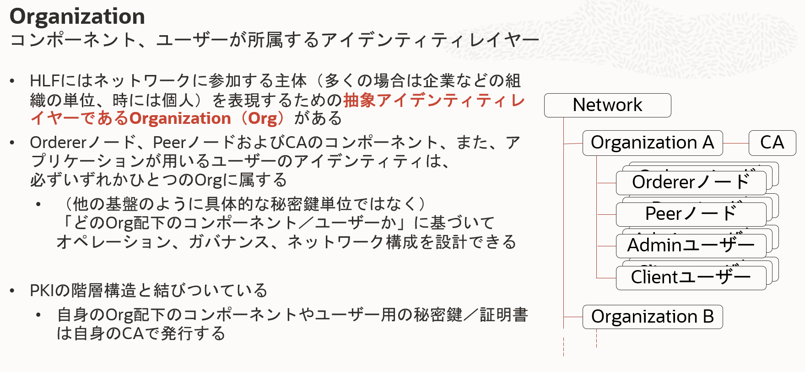

## 0.2. Oracle Blockchain Platformでのアイデンティティ

OBPは、上述のHyperledger Fabricのアイデンティティの仕組みを基本的にはそのまま用いています。一方で、以下の点で構築と運用の利便性、容易性が向上しています。

- 最初の管理者アイデンティティや各種証明書がインスタンス作成時に自動作成される
- コンポーネントの用いるアイデンティティはコンポーネント作成時に自動作成される
- REST Proxy経由でのChaincode実行に用いるアイデンティティは、REST Proxyが保持する

このチュートリアルでは、以下についてそれぞれ説明していきます。

- インスタンス生成時に自動作成される各種証明書と管理者秘密鍵のコンソールからのダウンロード方法
- REST Proxy経由でのChaincode実行に用いられるアイデンティティの設定方法
- Fabric CA Clientを用いて証明書＆秘密鍵を生成する方法（ _準備中_ ）

## 0.3. トランザクション実行者アイデンティティの確認方法

このチュートリアルで説明する各種アイデンティティは、いずれもクライアントアプリケーションがトランザクション実行（のリクエスト）に用いるアイデンティティとして使用されます。

トランザクションの実行者のアイデンティティは、OBPコンソール上では以下のように確認できます。

1. Oracle Blockchain Platformのサービス・コンソールを開きます。

1. **Channels**のページを開き、一覧から任意のChannelを選んで**Channel名のリンク**をクリックします。

    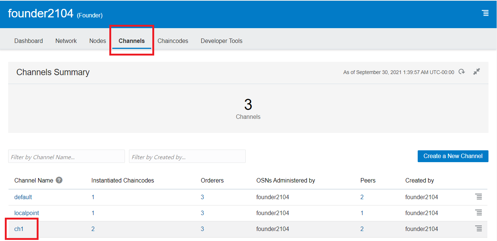

1. 選んだChannelの台帳（Ledger）に含まれるBlockの表示ページが開きます。一覧からUser Transactions（システムトランザクションではなく、ユーザーChaincodeの実行に係るトランザクション）が1以上の**任意のBlock**を選びます。

    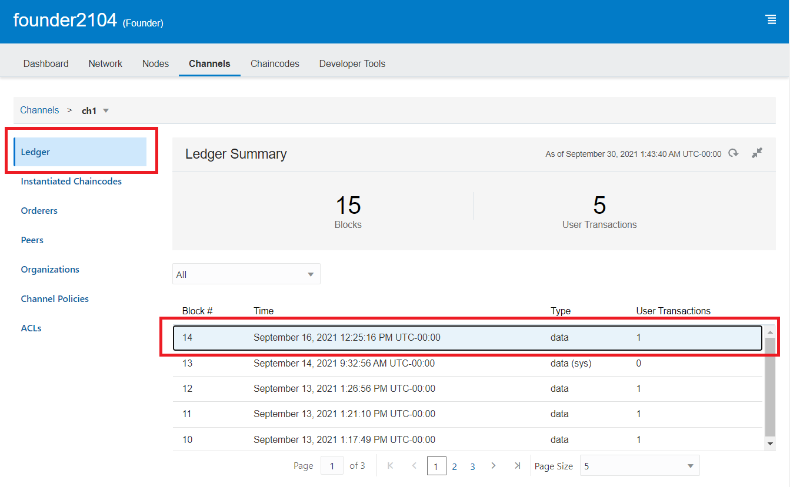

1. ページ下部に選んだBlockに含まれるトランザクションの一覧が表示されます。任意のトランザクションを選び、左側の**三角ボタン**をクリックするとトランザクションの詳細が表示されます。**Transaction Initiator**欄に表示されているのがトランザクション実行者のアイデンティティです（例では _founder2104_ というOrganizationの _restuser1_ というアイデンティティ）。

    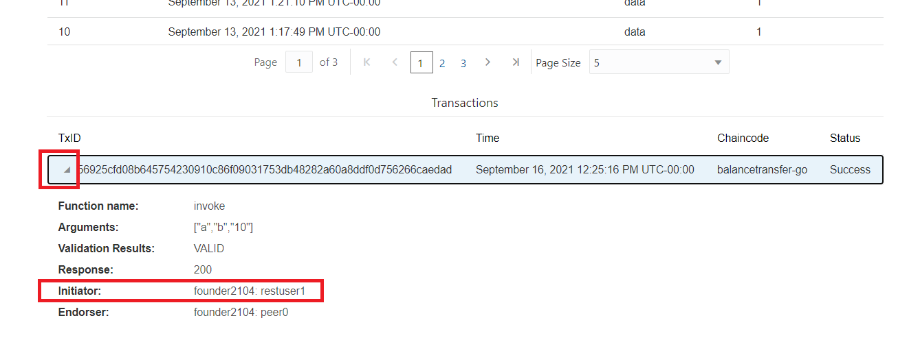

# 1. コンソールからの各種マテリアルのダウンロード方法

## 1.1. 各種証明書のダウンロード

コンソールからは以下いずれかの方法で各種証明書（管理者、CA、TLS、コンポーネントの証明書）がダウンロードできます。

- **証明書内容記載ファイルのダウンロード**：コンソールの**Networkページ**から、自身のOrganizationの行の右側の**メニューボタン**をクリックし、**Export Certificates**を選択します。各種証明書内容が一括して記載された単一のファイルがダウンロードされます。

    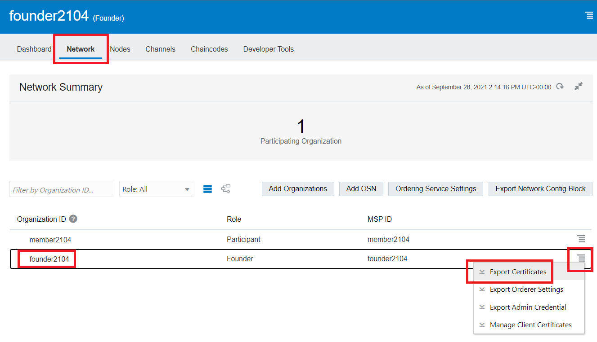

- **クライアントアプリケーション配置用証明書ファイルのダウンロード**：コンソールの**Developer Toolsページ**から**Application Developmentのセクション**を選び、**OBPのセクション**から**Download the development package**をクリックします。ダウンロードされたZIPファイルには、クライアントアプリケーション内に配置するためのフォルダ構造の中に各種証明書ファイルが格納されています。

    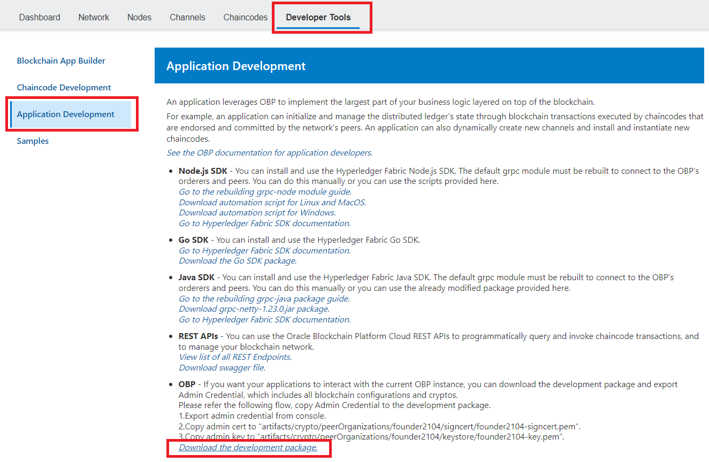

## 1.2. 管理者秘密鍵のダウンロード

コンソールの**Networkページ**から、自身のOrganizationの行の右側の**メニューボタン**をクリックし、**Export Admin Credential**を選択します。管理者秘密鍵と証明書が含まれるZIPファイルがダウンロードされます。

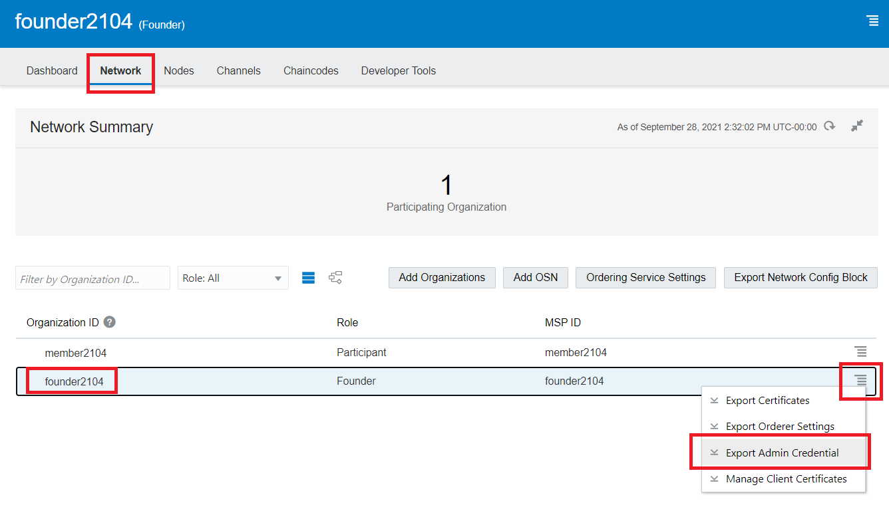

# 2. REST Proxy経由でのChaincode実行時のアイデンティティの設定

OBPでは、アプリケーションとChaincodeを中継する役割を持つREST Proxyというコンポーネントを独自に備えています。REST ProxyにはFabric SDKが組み込まれており、また、Hyperledger Fabricネットワークのユーザーアイデンティティを保持しています。**これにより、アプリケーションはREST APIを呼び出すことで、REST Proxyを介してChaincodeを実行できます。**この際、アプリケーションはREST Proxyに対して、Oracle Cloudのユーザーアカウント（**IDCSユーザー**）を用いて認証、認可されます。

ここではREST Proxy経由でChaincodeを実行する際に用いられるアイデンティティの設定方法について説明します。REST Proxy経由でのChaincode実行方法については、[こちらのチュートリアル](../03_2_restcall_chaincode/)を参照ください。

アイデンティティを作成しておくと、REST Proxy経由でのChaincode実行のREST APIを実行する際のパラメータによりそのアイデンティティを指定できるようになります。また、IDCSユーザーとアイデンティティを紐付けておくと、そのIDCSユーザーでREST APIを実行した際に自動的に紐付けたアイデンティティが用いられるようになります。

## 2.1. REST Proxyが用いるアイデンティティの作成

1. Oracle Blockchain Platformのサービス・コンソールを開きます。

1. **Nodes**のページを開き、一覧から**REST Proxyの行の右側のメニューボタン**をクリックします。表示されたメニューから**View or manage enrollments**を選択します。

    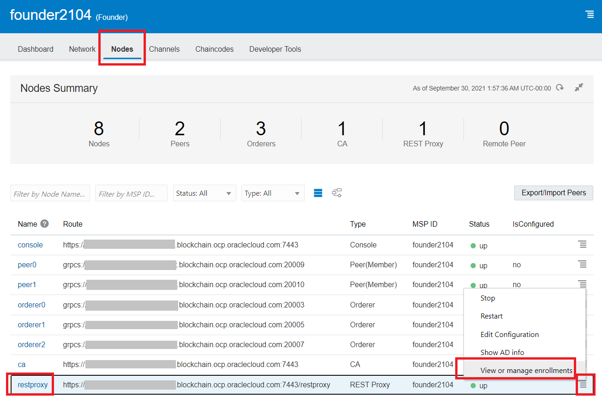

1. REST Proxyの用いるアイデンティティ管理のダイアログが表示されます。左側にアイデンティティ一覧が表示されます。デフォルトでは**defaultuser**のアイデンティティが用意されています。**Create New Enrollment**をクリックします。

    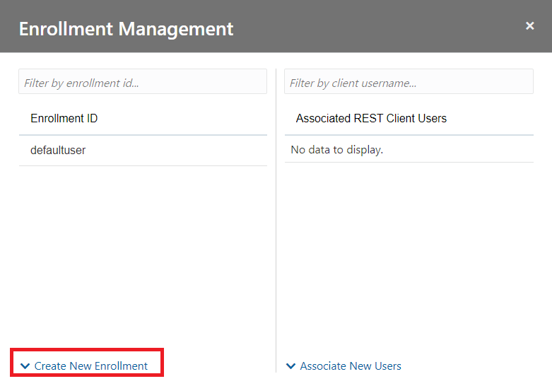

1. アイデンティティ名の入力欄が開きます。**任意の名前（例では _test1_ ）を入力**して、**Enroll**をクリックします。

    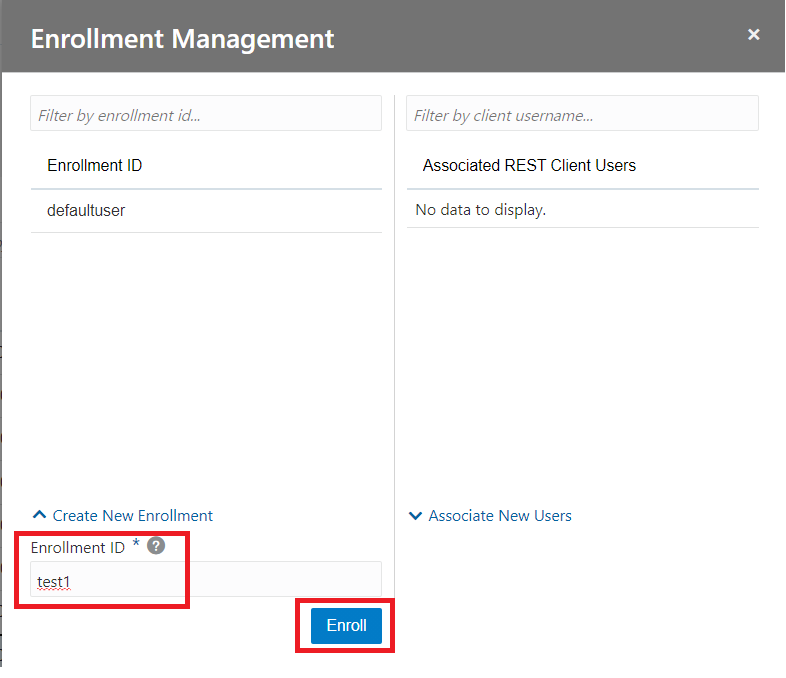

1. 成功すると、アイデンティティ一覧に作成したアイデンティティが表示されます。

    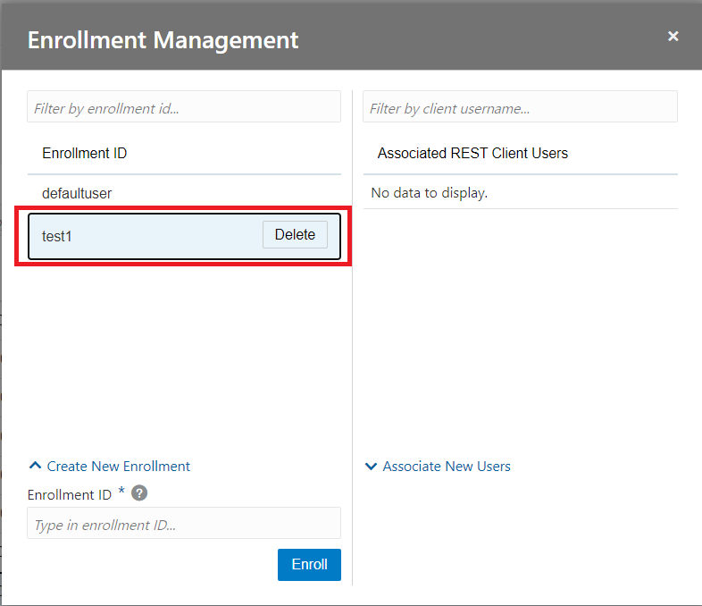

## 2.2. IDCSユーザーとアイデンティティの紐付け

1. アイデンティティの作成と同様の手順でREST Proxyの用いるアイデンティティ管理のダイアログを表示します。

1. アイデンティティ一覧からIDCSユーザーを紐付けるアイデンティティを選択します。例では _test1_ を選択しています。

    

1. **Associate New Users**をクリックすると、IDCSユーザーの入力欄が表示されます。紐付けたいIDCSユーザーID（例では _xxxxxxxx@oracle.com_ )を入力し、**Associate**をクリックします。

    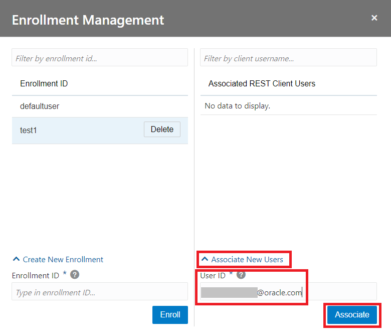

1. 成功すると、紐付けされたユーザー一覧に入力したIDCSユーザーが表示されます。

    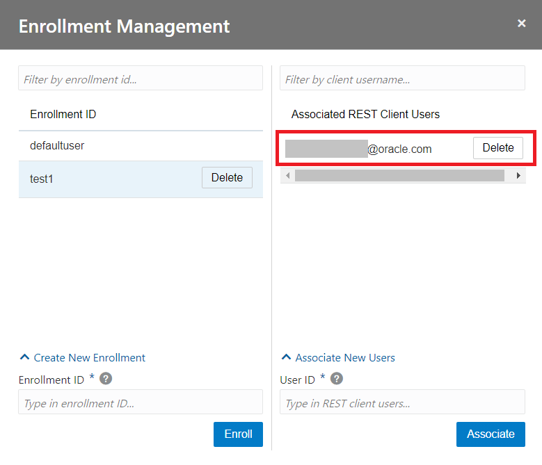

# 3. Fabric CA Clientでのアイデンティティの作成とその管理( _準備中_ ) 