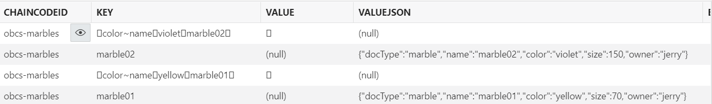

Oracle Blockchain Platformのリッチヒストリーデータベース機能を用いてブロックチェーン台帳からデータベースに複製したデータをより使いやすくするため、JSONを展開しつつデータを抽出するビューを作成する方法を説明します。

この文書は、2022年11月時点での最新バージョン(22.3.2)を元に作成されています。

- **前提 :**

  - [リッチヒストリーデータベースの設定方法](../06_1_rich_history/)を完了
  - 複製先のOracle Databaseへのアクセス
      - 複製先のテーブルの参照、ビューの作成などの権限を持ったデータベースユーザーを用いる必要があります

# 0. 前提の理解

## 0.1. リッチヒストリーデータベース機能で複製されたデータの活用

Oracle Blockchain Platform（OBP）のリッチヒストリーデータベース機能は、OBPインスタンスの持つブロックチェーン台帳のデータをブロックチェーン外部のリレーショナルデータベース（Oracle Database）に複製する機能です。この機能の概要については[リッチヒストリーデータベースの設定方法](../06_1_rich_history/)を参照ください。

一度データベースに複製してしまえば、データは一般的なスキルやツールを用いることで集計、分析、他のデータとの統合、Oracle Database付属のローコードアプリケーション開発ツールであるAPEXから利用など、様々に活用することができます。


## 0.2. 複製されたデータを活用するうえでの留意点

以下のスライドで説明されている通り、Channelごとに複製先のテーブルが作成され、ブロックチェーン台帳からデータが複製されてきます。


次の画像はあるChannelから複製したStateテーブルのサンプルです。


この複製されてきた状態のまま利用しても良いのですが、以下の理由によりやや使いづらい場合があるでしょう。

+ **複数Chaincodeに由来するデータが単一のテーブルに混ざって格納されている**
    
    複製元のChannel内に複数のChaincodeが稼働している場合、複製先のテーブルにも複数のChaincode由来のデータが混在することになります。また、ユーザー側で明示的にデプロイさせ稼働させているUser Chaincodeのデータの他に、Chaincodeデプロイなどの際に暗黙的に動作するSystem ChaincodeであるLSCC(Lifecycle System Chaincode)のデータも複製されます。

    一方で、集計、分析、統合などの操作の対象としたいデータは多くの場合、特定のひとつのUser Chaincode由来のものに限られます。操作のたびにいちいちWHERE句でChaincodeを指定するのはやや手間です。

+ **JSON形式でデータが格納されている**（場合がある）
    
    Chaincode内でデータをWorld Stateに保存する際、Key-ValueのValueをJSON形式にすることがしばしばあります（リッチクエリ利用との関連）。リッチヒストリーデータベース機能では、複製元のValueがJSON形式だった場合、`VALUEJSON`カラムに複製します。

    Oracle DatabaseではJSONを扱うための方法（ドット記法やJSON_VALUE関数など）を用いることで、JSON内の要素の値を指定して扱うことができます。ただ、いちいちこれを行うのは値がカラムに直接展開されている場合に比較してやや手間です。また、集計、分析などで大規模なクエリを頻繁に行う場合には、JSONの展開は性能面でもやや不利になると考えられるため気をつけておきたいところです。

こうしたポイントを解消するため、ここではリッチヒストリーデータベースにその複製されたデータに対して、ビューとマテリアライズド・ビューを用いてJSONの内容をカラムに展開しつつデータを抽出する方法を、例を挙げて紹介します。

# 1. 複製先でJSONデータをカラムに展開しつつ抽出する

## 1.1. ここでの例に用いるChaincodeとそのデータ

ここではOracle Blockchain Platformのコンソール上で実行できるサンプルChaincodeである**Marbles（obcs-marbles）**のデータを例として扱います。

このMarblesは非常にシンプルなChaincodeで、扱うデータはValueが以下のようなJSON形式のMarble（ビー玉）アセットです。KeyはValueの中にもあるnameの値と同じ（以下では"marble01"）です。

```json
{
  "docType": "marble",
  "name": "marble01",
  "color": "yellow",
  "size": 70,
  "owner": "jerry"
}
```

また、アセットデータの他に、色を指定したレンジクエリ検索を可能にするためのインデックス情報のデータも保存されています。アセットデータは`VALUEJSON`カラムに値が入っているのに対し、インデックス情報はValueがJSON形式でないため、`VALUEJSON`ではなく`VALUE`カラムに値が入っていることに注意してください。なおここで"□"と表示されているのは区切り文字として使われている特殊な文字です。



## 1.2. ビューに抽出、展開する

複製されたMarblesのデータを含むStateテーブルから、以下のようなデータにしたビューを作成します。

1. 対象であるMarblesのChaincodeのデータだけに絞る（chaincodeid = 'obcs-marbles'）
2. ↑のうち、色インデックス情報を除いてアセットデータだけに絞る
3. アセットデータのJSONの内容をカラムに展開する

ビューを作成するDDLは以下のようになります。※`SIZE`が予約語であるためダブルクォートで囲っています。

```sql
CREATE OR REPLACE VIEW ch4_state_marbles_view AS
SELECT s.valuejson.name, s.valuejson.color, s.valuejson."size".number() AS size_num, s.valuejson.owner
FROM "founder2104_ch4_state" s
WHERE chaincodeid = 'obcs-marbles'
  AND valuejson IS NOT NULL
ORDER BY name;
```

できたVIEWをDESCRIBEしてみると以下のようになります。JSONで数値型になっていたsizeの要素はNUMBER型で扱っています。

```
DESCRIBE ch4_state_marbles_view;

名前       Nullかどうか タイプ            
-------- -------- -------------- 
NAME              VARCHAR2(4000) 
COLOR             VARCHAR2(4000) 
SIZE_NUM          NUMBER         
OWNER             VARCHAR2(4000) 
```

SELECTすると以下のようになりました。もともとJSON内の要素だったname、color、size、ownerがそれぞれのカラムに展開されて扱いやすくなりました。

```
SELECT * FROM ch4_state_marbles_view;

NAME     COLOR  SIZE_NUM OWNER 
-------- ------ -------- ----- 
marble01 yellow       70 jerry 
marble02 violet      150 jerry 
```

## 1.3. マテリアライズド・ビューの場合

マテリアライズド・ビューの作成も基本的にビューと同様です。DDLは以下のようになります。

```sql
CREATE MATERIALIZED VIEW ch4_state_marbles_m_view AS
SELECT s.valuejson.name, s.valuejson.color, s.valuejson."size".number() AS size_num, s.valuejson.owner
FROM "founder2104_ch4_state" s
WHERE chaincodeid = 'obcs-marbles'
  AND valuejson IS NOT NULL
ORDER BY name;
```