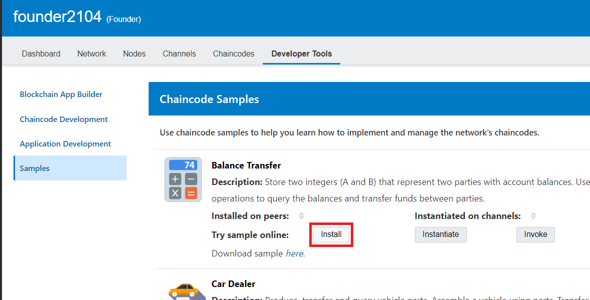
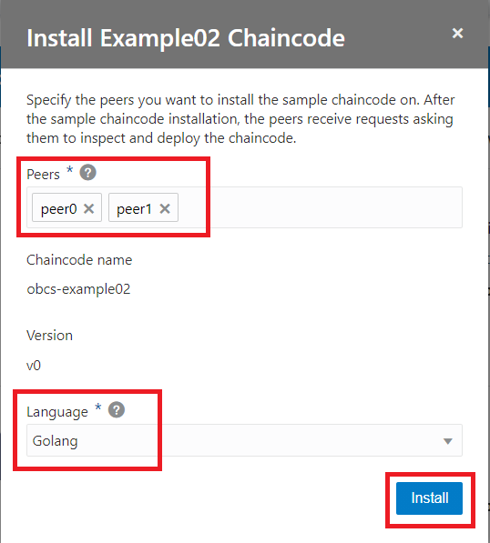
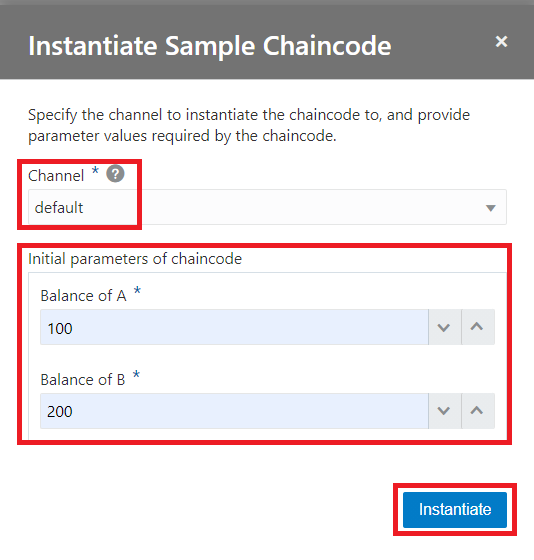
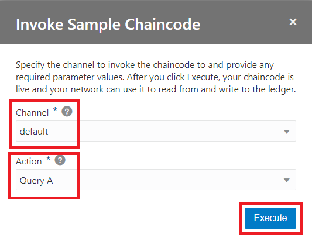
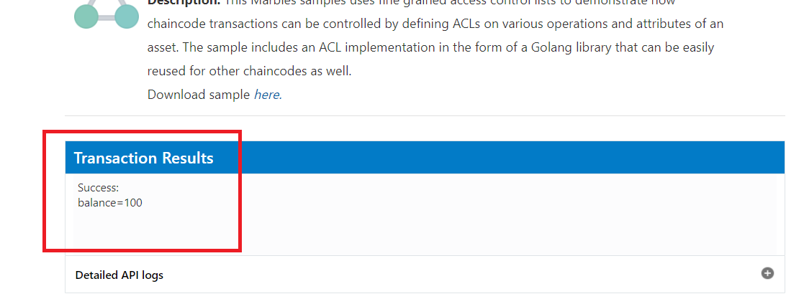

この文書はOracle Blockchain Platformに付属するサンプルChaincodeのダウンロード方法、コンソールからの実行方法を紹介するチュートリアルです。

この文書は、2021年8月時点での最新バージョン(21.2.1)を元に作成されています。

- **前提 :**

  - [Oracle Blockchain Platform のインスタンス作成](../01_1_create_instance/)を完了

# 0. サンプルChaincodeについて

Oracle Blockchain Platform（OBP）にはいくつかのChaincodeサンプルが付属しています。サンプルのうち一部はコンソール上で実行可能になっており、また、一部はソースコードをダウンロード可能です。

記事執筆時点で、以下のサンプルが提供されています。

- **Balance Transfer**: AとBのふたつの口座間での残高のやり取りを表現するシンプルなサンプルです。コンソール上で実行可能、ソースコードのダウンロードが可能です。
- **Car Dealer**: 自動車メーカーとディーラーの間でのパーツおよび自動車のやり取りなど、サプライチェーンのトレーサビリティを表現したサンプルです。パーツから自動車の組み立てもデータ構造として表現されています。コンソール上で実行可能、ソースコードのダウンロードが可能です。
- **Marbles**: 色や大きさ、所有者などの属性を持ったMarble（おはじき）を題材としたNFTのサンプルです。内容としてはHyperledger FabricのChaincodeサンプルのMarblesとほぼ同じもので、台帳の範囲クエリやリッチクエリなど、ひととおりの操作が含まれています。コンソール上で実行可能です。
- **Marbles with Fine Grained ACLs**: 上記のMarblesにFine-Grained Access Control Libraryを用いたアクセス制御を追加したものです。ソースコードのダウンロードが可能です。

# 1. サンプルChaincodeのダウンロード

サンプルChaincodeのソースコードのダウンロードについて説明します。

1. Oracle Blockchain Platformのサービス・コンソールを開きます。

1. **Developer Tools**のページを開き、左側メニューから**Samples**のセクションを選択します。
  
    

1. ソースコードのダウンロード可能なサンプルについては、"Download sample **here**"のリンクからダウンロード可能です。

# 2. サンプルChaincodeのコンソール上での実行

サンプルChaincodeのコンソール上での実行について説明します。

サンプルChaincodeは、（通常のChaincodeのデプロイと同じく）①Peerへのインストール　→　②Instantiate　の2段階のデプロイプロセスを経て実行可能になります。

ここでは、Balance Transferのサンプルを例に説明していきます。他のコンソール上で実行可能なサンプルも同様の手順で実行できます。

## 2.1 Chaincodeのインストール

1. Oracle Blockchain Platformのサービス・コンソールを開きます。

1. **Developer Tools**のページを開き、左側メニューから**Samples**のセクションを選択します。
  
    

1. コンソール上で実行可能なサンプルについては、Install、Instantiate、Invokeのボタンが有効になっています。Installのボタンをクリックします。

    

1. フォームが開きます。以下を指定したうえで**Install**をクリックします。

    - **Peers**: ChaincodeをインストールするPeerノードを選択します。例ではPeer0、Peer1を指定しています。
    - **Language**: 複数の言語バージョンのサンプルが用意されている場合、インストールする言語を選べます。例ではGoを指定しています。なお、機能やインターフェースは基本的に同一です。

    

1. インストールに成功すると自動的にフォームが閉じ、**"Installed on Peers:"**の表示にインストール済Peerノード数が反映されます。

    

## 2.2 ChaincodeのInstantiate

1. 続いて、**Instantiate**をクリックします。

    

1. フォームが開きます。以下を指定したうえで**Instantiate**をクリックします。

    - **Channel**: Chaincodeを稼働させるChannelを選択します。例ではdefaultを指定しています。
    - **Initial parameters of chaincode**: ChaincodeのInstantiate時に実行される初期化関数（init()関数）の引数を指定します。項目はサンプルごとに異なります。以下はBalance Transferでの例です。
        - **Balance of A**: 口座Aの初期残高です。例では100を指定しています。 
        - **Balance of B**: 口座Bの初期残高です。例では200を指定しています。 

    

1. Instantiateが実行中である旨のメッセージがフォームに表示されます。Instantiate完了には数分程度の時間がかかります。フォームを閉じます。

    

1. Instantiateが完了すると、サービス・コンソール上部の通知欄に通知されます。クリックすると成功／失敗メッセージが表示されます。成功メッセージが出ていればInstantiateは完了です。

    

    また、ページを再読込すると、**"Instantiated on Channels:"**の表示にも反映されます。

    

## 2.3 Chaincodeの実行

1. 続いて、**Invoke**をクリックします。

    

1. フォームが開きます。以下を指定したうえで**Execute**をクリックします。

    - **Channel**: ChaincodeがInstantiate済のChannelのうち、今回実行するChannelを選択します。例ではdefaultを指定しています。
    - **Actions**: 実行するChaincodeの機能（関数）を指定します。候補はサンプルごとに異なります。例ではQuery A（口座Aの残高をクエリ）を指定しています。指定したActionによっては更に、追加で引数の指定の欄が開きます。

    

1. フォームは自動的に閉じます。戻ってきたSamplesページの下部の**Transaction Results**欄に結果が表示されています。例では、口座Aの残高である100が表示されています。

    

 
以上でこのチュートリアルは終了です。