このハンズオンでは、OCI API Gatewayを利用して簡単にAPIを集約・公開する手順をご紹介します。

条件
----------------------

- クラウド環境
  - 有効なOracle Cloudアカウントがあること


1.OCI API Gatewayプロビジョニングのための事前準備 
-------------------

ここでは、OCI API Gatewayをプロビジョニングするための事前準備を行います。

### 1-1. VCNの作成


VCNを作成済みの方は1-2.イングレス・ルールの追加に進んでください。 


Oracle Cloudのダッシューボードにログインし、ダッシューボード画面のハンバーガメニューで"ネットワーキング" => "仮想クラウド・ネットワーキング"をクリックします。


表示された画面左下の"スコープ"内の"コンパートメント"をクリックし、ルートコンパートメントを選択します。ルートコンパートメントはOracle Cloudの登録時に設定した名称になります。既に選択されている場合は、この手順はスキップしてください。

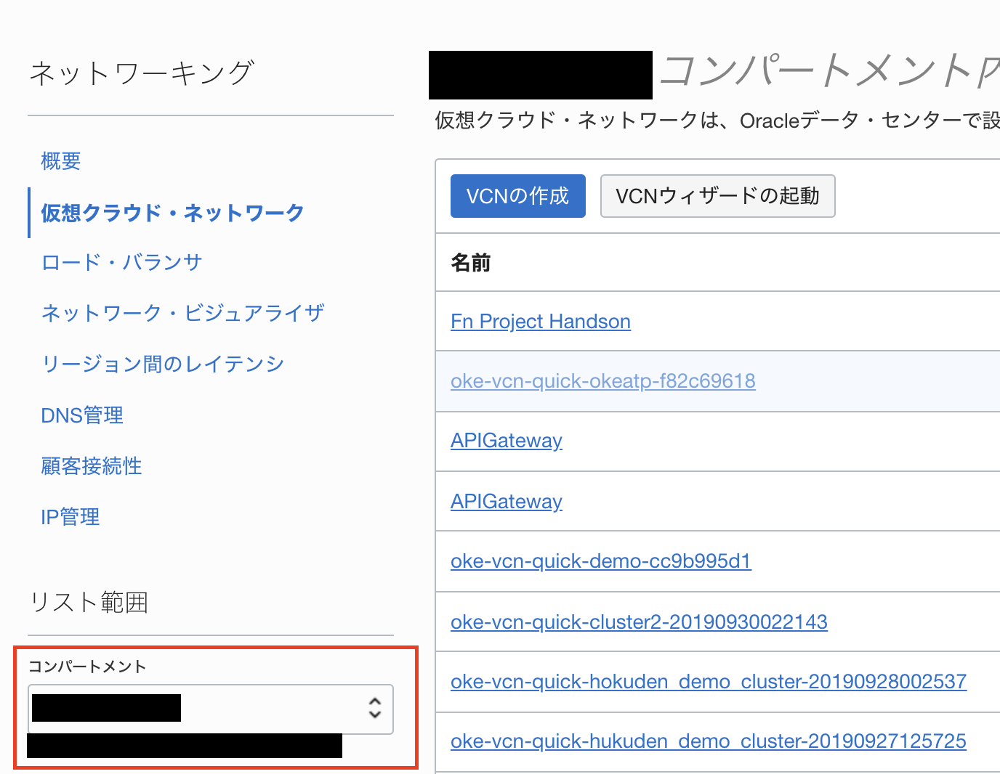

"VCNウィザードの起動"をクリックします。

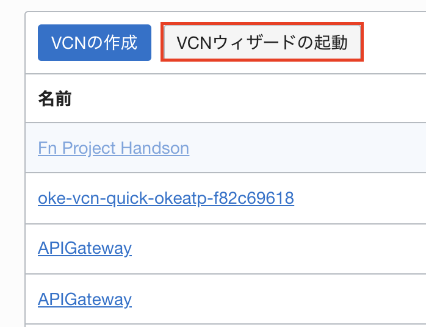

"VPN接続およびインターネット接続性を持つVCN"を選択し、"ワークフローの開始"をクリックします。

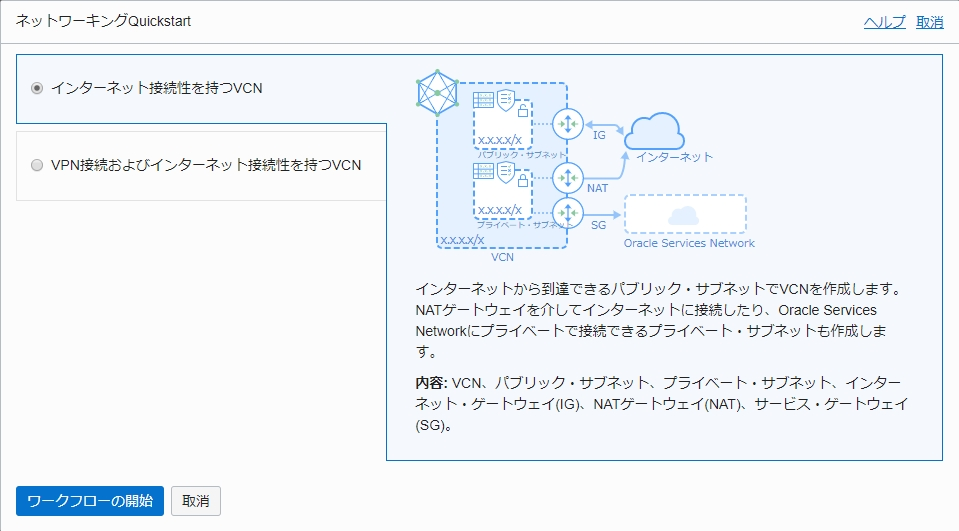

以下の情報を入力し、"次"をクリックします。

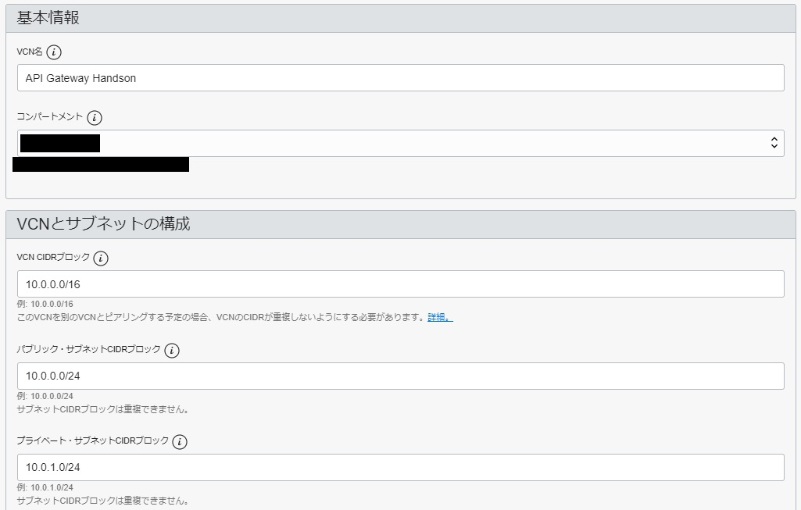


* VCN名：任意の名前(こだわりがなければ"API Gateway Handson")
* コンパートメント：ルートコンパートメント
* VCN CIDRブロック：`10.0.0.0/16`
* パブリック・サブネットCIDRブロック：`10.0.0.0/24`
* プライベート・サブネットCIDRブロック：`10.0.1.0/24`

"作成"をクリックし、作成が完了したら、"仮想クラウド・ネットワークの表示"をクリックします。  
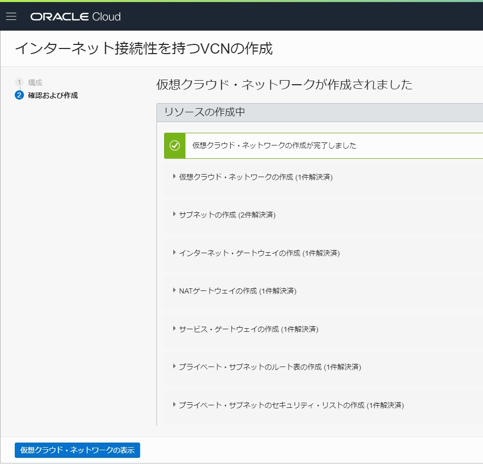

作成したVCNが確認できれば、VCN(ネットワーク)の作成は終わりです。


### 1-2. イングレス・ルールの追加

OCI API Gatewayは、デフォルトでは開いていないポート443で通信します。 ポート443のトラフィックを許可するには、サブネットに対してイングレス・ルールを追加する必要があります。

OCIコンソールにログインし、[ネットワーキング]に移動して、[仮想クラウド・ネットワーク]をクリックします。


[コンパートメント]からOCI API Gatewayで利用するコンパートメント(今回はルートコンパートメント)を選択して、OCI API Gatewayで利用するVCNリンクをクリックします。  

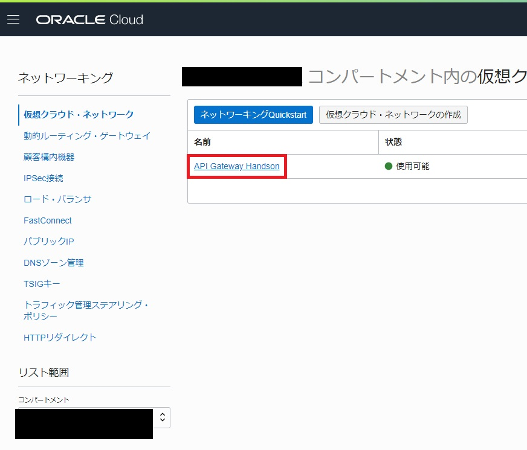

OCI API Gatewayで利用するサブネットリンクをクリックします。  
今回は、パブリックサブネット("API Gateway Handson"で作成した場合は"パブリック・サブネット-API Gateway Handson(リージョナル)")を選択してください。

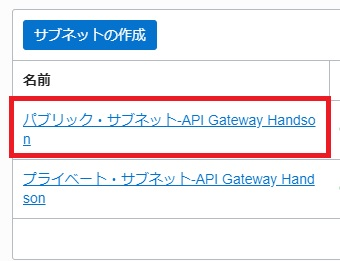

[Default Security List for ...]リンクをクリックします。

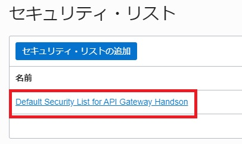

[イングレス・ルールの追加]をクリックします。

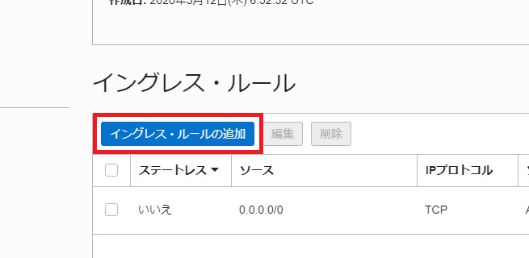

以下項目を入力して、[イングレース・ルールの追加]をクリックします。

+ ステートレス：チェックをオフにする（デフォルト値）
+ ソースCIDR：`0.0.0.0/0`
+ IPプロトコル：`TCP`（デフォルト値）
+ 宛先ポート範囲：`443`

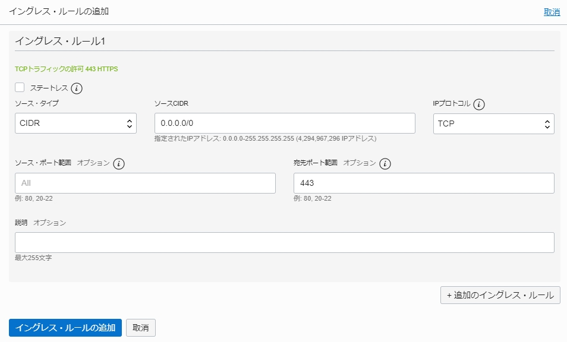

新しいイングレス・ルールが追加されます。


以上で、OCI API Gatewayプロビジョニングのための事前準備は完了です。  

2.OCI API GatewayへのAPIのデプロイ・公開  
------

### 2-1.OCI API Gatewayの作成

OCIコンソールにログインし、[開発者サービス]に移動して、[APIゲートウェイ]をクリックしてから、次の操作を行います。

[ゲートウェイの作成]をクリックして、次を指定します。

+ 名前：新しいゲートウェイの名前。今回は、"api-gateway-handson"

+ タイプ：パブリック

+ コンパートメント：OCI API Gatewayリソースを作成するコンパートメントの名前(今回はルートコンパートメントを指定)

+ 仮想クラウド・ネットワーク：OCI API Gatewayで使用するVCNの名前。[1-1. VCNの作成](#1-1-vcnの作成)の手順に沿ってVCNを作成している場合は、"API Gateway Handson"

+ サブネット：VCNのパブリック・サブネットの名前。[1-1. VCNの作成](#1-1-vcnの作成)の手順に沿ってVCNを作成している場合は、"パブリック・サブネット-API Gateway Handson"

[作成]をクリックします。

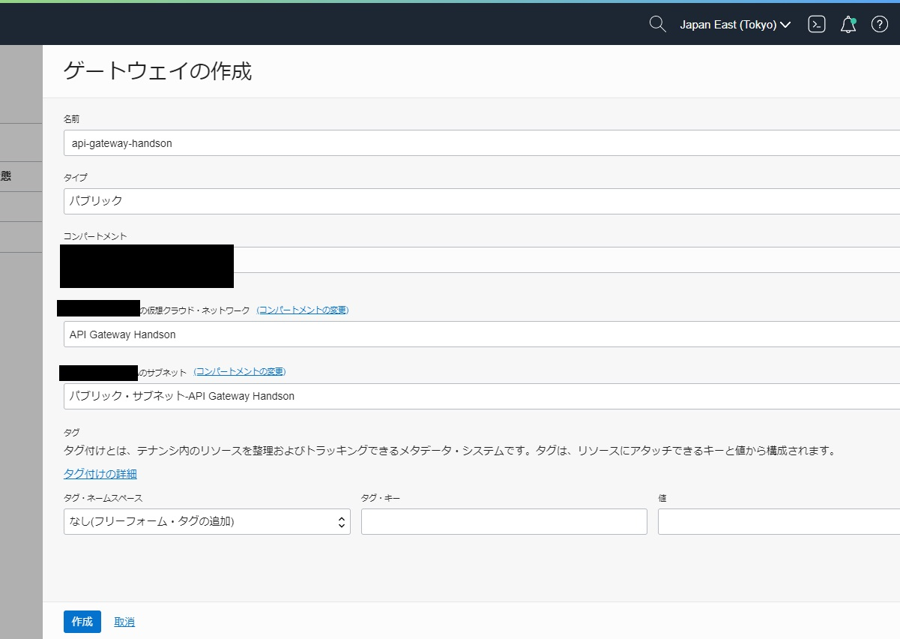

新しいAPIゲートウェイが作成されると、[ゲートウェイ]ページのリストに`アクティブ`と表示されます。  
`アクティブ`になるまでには5-10分程度かかることがあります。

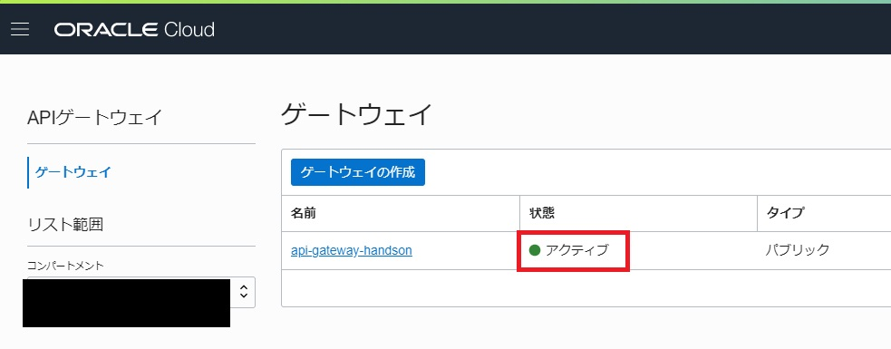

### 2-2.OCI API GatewayへのAPIのデプロイ

[ゲートウェイ]ページで、前に作成したAPIゲートウェイの名前をクリックします。

画面左側にあるメニューの[リソース]で[デプロイメント]をクリックし、[デプロイメントの作成]をクリックします。

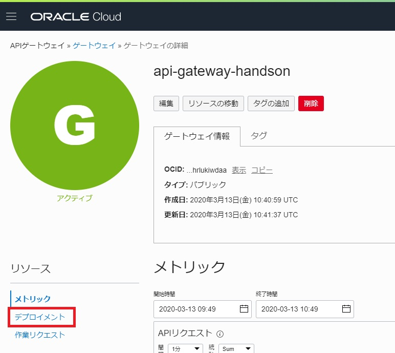

基本情報内、以下のように内容を指定して、[次]をクリックします。

+ 名前：デプロイメントの名称。今回は`hands-on deployment`
+ パス接頭辞：APIのパス。今回は、`/v1`

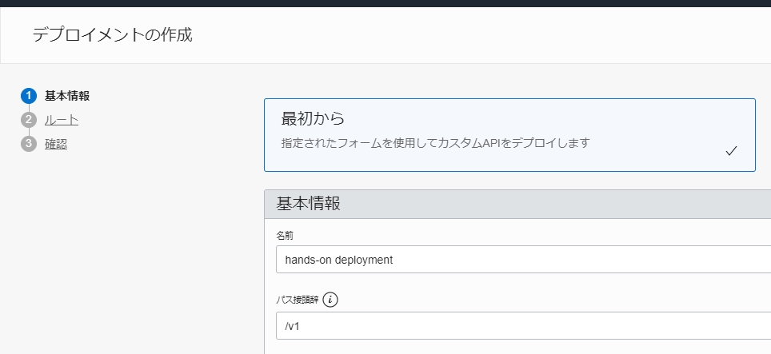


今回のハンズオンでは単純化のために、公開されているAPIを利用して手順を作成しています。   異なる複数のエンドポイントをまとめ、一つのデプロイメントとして管理できるメリットをご体験ください。 

y
[1のルーティング]セクションで次を指定します。

+ パス：`/weather/{point}`
+ メソッド：`GET`
+ タイプ：`HTTP`
+ URL：`https://api.weather.gov/points/${request.path[point]}`

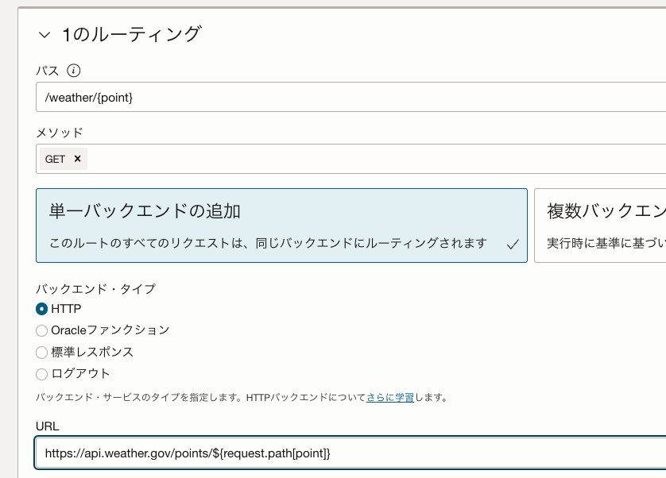


このバックエンドサービスは米国の天気情報が取得できるサービスです。`緯度,経度`をURLで渡す必要があります。 パスの`{point}`は変数として扱うことができるため、`${request.path[point]}`の形式で取得し、バックエンドサービスに受け渡しています。 


[別のルート]をクリックし、[2のルーティング]セクションで次を指定して、[次]をクリックします。

+ パス：`/cowsay/echo`
+ メソッド：`GET`
+ タイプ：`HTTP`
+ URL：`https://ocitutorials.paasdocs.work/cowsay/${request.query[msg]}`
+ SSL検証の無効化： チェック


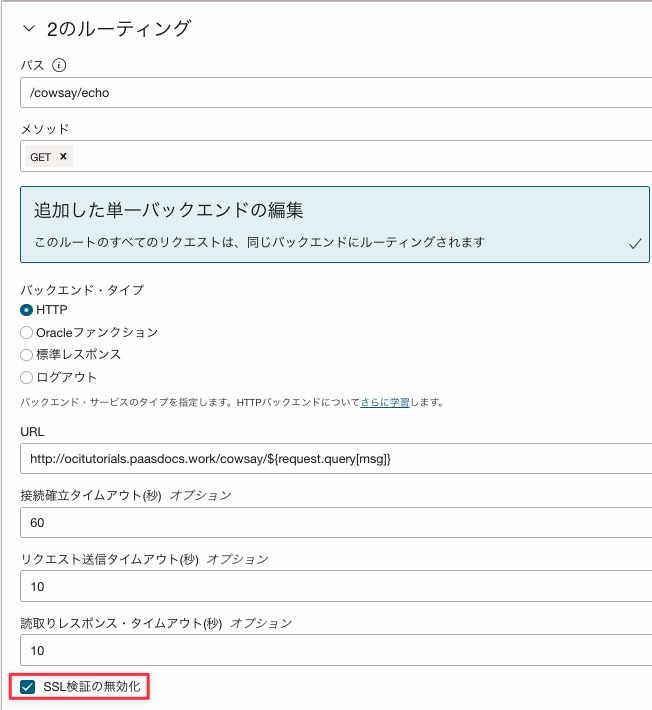


このバックエンドサービスはOKEハンズオンでも利用されているソースをAPIにして公開したものです。`/cowsay/say`のエンドポイントにアクセスすると牛のアスキーアートが返されます。 `${request.query[msg]}`の形式で渡した文字列をパラメータを取得しURLのクエリパラメータに利用することができます。 


新しいAPIデプロイメント用に入力した詳細を確認し、[作成]をクリックして作成します。

新しいAPIデプロイメントが作成されると、APIデプロイメントのリストにアクティブとして表示されます。

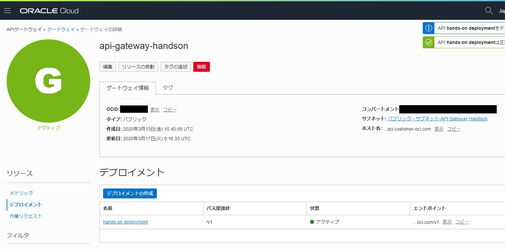

APIデプロイメントのリストで、作成したばかりの新しいAPIデプロイメントのエンドポイントの横にある[コピー]をクリックして、エンドポイントをコピーし、テキストエディタ等に保持しておきます。


エンドポイントは以下のようになります。

```
https://xxxxxxxxxxxxxxxxxxxxxxxxxxxxx.apigateway.ap-tokyo-1.oci.customer-oci.com/v1
```

### 2-3.動作確認
任意のコマンドラインツール、もしくは任意のAPI実行ツールを用いてAPIを実行します。

先ほどコピーしたデプロイメントのエンドポイントに、`weather/37.5293,-122.2658`を付け足してください。以下のようになります。
```
https://xxxxxxxxxxxxxxxxxxxxxxxxxxxxx.apigateway.ap-tokyo-1.oci.customer-oci.com/v1/weather/37.5293,-122.2658
```
以下の`curl`コマンドを実行します。

```
curl -X GET "https://<ご自身のAPIエンドポイント>.apigateway.ap-tokyo-1.oci.customer-oci.com/v1/weather/37.5293,-122.2658"
```
Oracle本社付近の天気情報が取得できます。


デプロイメントのエンドポイントに、`cowsay/echo?msg=api-gateway`を付け足してください。以下のようになります。
```
https://xxxxxxxxxxxxxxxxxxxxxxxxxxxxx.apigateway.ap-tokyo-1.oci.customer-oci.com/v1/cowsay/echo?msg=say
```
以下の`curl`コマンドを実行します。

```
curl -X GET "https://<ご自身のAPIエンドポイント>.apigateway.ap-tokyo-1.oci.customer-oci.com/v1/cowsay/echo?msg=say
```
牛のアスキーアートが`Moo!`という文言を返します。


これで、OCI API Gatewayとを利用してAPIのデプロイと公開ができました。  
また、異なるエンドポイントのサービスを一つのゲートウェイにまとめて管理することができるようになりました。

お疲れ様でした！
