OCI DevOps は、OCI 上に CI/CD 環境を構築するマネージドサービスです。  
ここでは、OCI DevOps を利用するための事前準備を行います。

## 前提条件

- クラウド環境
  - Oracle Cloud のアカウント（Free Trial）を取得済みであること

## 事前準備の流れ

- 1.OCI Notifications セットアップ

- 2.動的グループ/ポリシー セットアップ

- 3.プロジェクトの作成

  1.OCI Notifications セットアップ

---

### 1-1 トピックとサブスクリプションの設定

OCI DevOps では、OCI Notifications サービスの「トピック」と「サブスクリプション」の設定が必要となります。  
この設定をしておくことで、登録したメールアドレスに OCI DevOps から通知を受け取ることができます。


OCI Notifications は、安全、高信頼性、低レイテンシおよび永続的にメッセージを配信するためのサービスです。 本ハンズオンでは、電子メールアドレスに対して配信を行いますが、他にも Slack/SMS/PagerDuty などに通知を行うことができます。 また詳細は[こちら](https://docs.oracle.com/ja-jp/iaas/Content/Notification/Concepts/notificationoverview.htm)のページをご確認ください。


#### 1-1-1 トピックの作成

左上のハンバーガーメニューをクリックして、「開発者サービス」-「通知」を選択します。

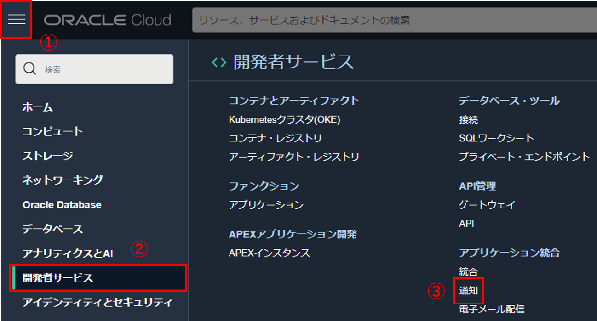

「トピックの作成」ボタンをクリックします。



トピックの名前はテナンシで一意になります。 集合ハンズオンなど複数人で同一環境を共有されている皆様は、`oci-devops-handson-01`や`handson-tn`などの名前のイニシャルを付与し、名前が重複しないようにしてください。


「名前」に「oci-devops-handson」と入力します。

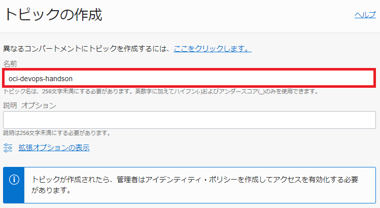

「作成」ボタンをクリックします。


「アクティブ」になることを確認します。

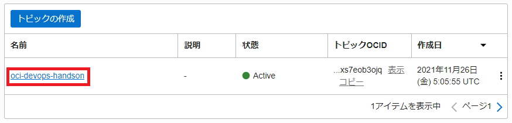

以上でトピックの作成は完了です。

#### 1-1-2 サブスクリプションの作成

左メニュー「サブスクリプション」を選択します。

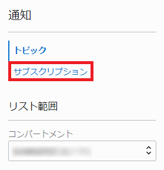

「サブスクリプションの作成」ボタンをクリックします。


「電子メール」にご自身のメールアドレスを入力します。

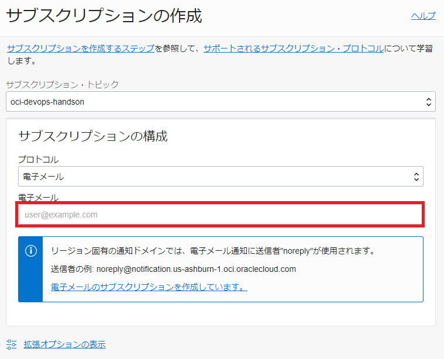

「作成」ボタンをクリックします。


設定したメールアドレスに、以下の内容のメールが届きます。「Confirm subscription」をクリックして、サブスクリプションを有効にします。

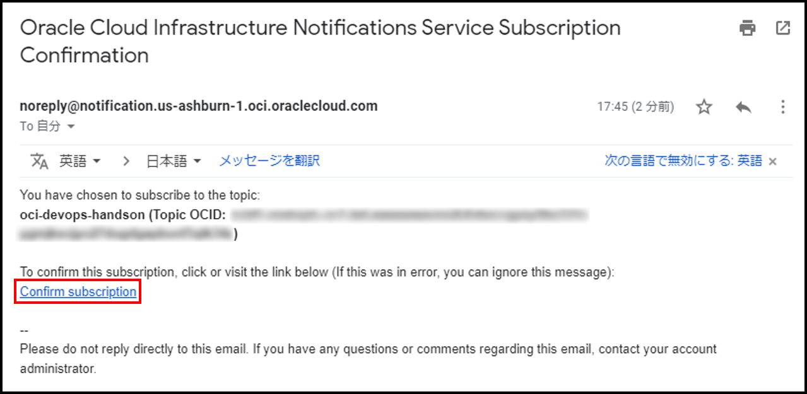

以下の画面が表示されれば完了です。

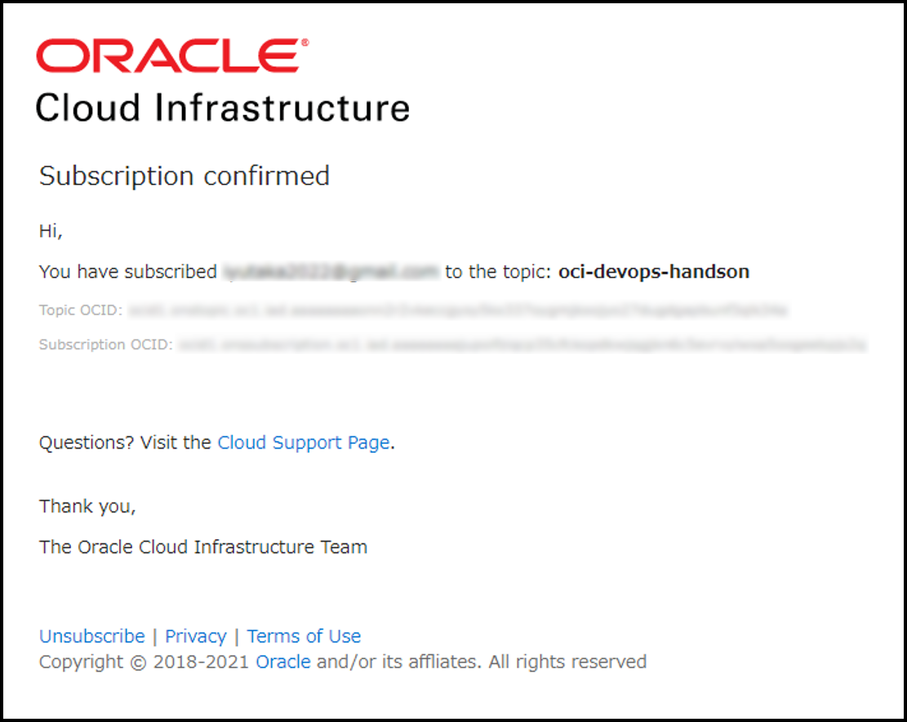

アクティブになっていることを確認します。  
アクティブになっていない場合は、ブラウザを更新してください。

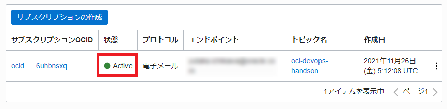

以上で、サブスクリプションの作成は完了です。

## 2.動的グループ/ポリシー セットアップ

### 2-1 動的グループとポリシーの作成

ここでは、OCI DevOps を利用するための動的グループとポリシーの作成を行います。


Oracle Cloud Infrastrcture には動的グループという考え方があります。 動的グループの詳細は[こちら](https://docs.oracle.com/ja-jp/iaas/Content/Identity/Tasks/managingdynamicgroups.htm)のページをご確認ください。 また、設定した動的グループは、ポリシーを利用することにより、OCI 上のリソースやインスタンスを主体とした操作を実現できます。 ポリシーの詳細は[こちら](https://docs.oracle.com/ja-jp/iaas/Content/Identity/Concepts/policygetstarted.htm#Getting_Started_with_Policies)のページをご確認ください。


#### 2-1-1 OCI DevOps で利用する動的グループ

OCI DevOps を利用する上で、必要となる動的グループを作成します。  
OCI DevOps で設定する動的グループは以下となります。

| 動的グループ             | ルール                                                                                          | 説明                                                              |
| ------------------------ | ----------------------------------------------------------------------------------------------- | ----------------------------------------------------------------- |
| OCI_DevOps_Dynamic_Group | All {resource.type = ‘devopsrepository’, resource.compartment.id = ‘コンパートメント OCID’}     | OCI DevOps のコード・リポジトリを利用するために必要な動的グループ |
| OCI_DevOps_Dynamic_Group | All {resource.type = ‘devopsbuildpipeline’, resource.compartment.id = ‘コンパートメント OCID’}  | ビルド・パイプラインを利用するために必要な動的グループ            |
| OCI_DevOps_Dynamic_Group | All {resource.type = ‘devopsdeploypipeline’, resource.compartment.id = ‘コンパートメント OCID’} | デプロイメント・パイプラインを利用するために必要な動的グループ    |


Oracle Cloud Infrastrcture にはコンパートメントという考え方があります。 コンパートメントは、クラウド・リソース(インスタンス、仮想クラウド・ネットワーク、ブロック・ボリュームなど)を分類整理する論理的な区画で、この単位でアクセス制御を行うことができます。また、OCI コンソール上に表示されるリソースのフィルタとしても機能します。 コンパートメントの詳細は[こちら](https://docs.oracle.com/ja-jp/iaas/Content/Identity/Tasks/managingcompartments.htm)のページをご確認ください。



動的グループの名前はテナンシで一意になります。 集合ハンズオンなど複数人で同一環境を共有されている皆様は、`OCI_DevOps_Dynamic_Group_01`や`OCI_DevOps_Dynamic_Group_tn`などの名前のイニシャルを付与し、名前が重複しないようにしてください。


#### 2-1-2 OCI DevOps で利用するポリシー

OCI DevOps を利用する上で、必要となるポリシーを作成します。
ポリシーは以下となります。

| ポリシー                                                                                                     | 説明                                                                            |
| ------------------------------------------------------------------------------------------------------------ | ------------------------------------------------------------------------------- |
| Allow dynamic-group OCI_DevOps_Dynamic_Group to manage devops-family in compartment id コンパートメント OCID | OCI DevOps の各機能を利用するために必要なポリシー                               |
| Allow dynamic-group OCI_DevOps_Dynamic_Group to manage all-artifacts in compartment id コンパートメント OCID | OCI DevOps が OCIR やアーティファクト・レジストリを管理するために必要なポリシー |
| Allow dynamic-group OCI_DevOps_Dynamic_Group to use ons-topics in compartment id コンパートメント OCID       | OCI DevOps が OCI Notifications サービスを利用するために必要なポリシー          |


今回は、簡易的にハンズオンを実施するために、コンパートメント内の全てのリソースやインスタンスを動的グループとして含める設定を行なっています。 本来は、各サービスのタイプを指定して動的グループを作成することになります。


### 2-2 動的グループとポリシーの設定

今回のハンズオンでは、スクリプトを利用して、動的グループとポリシーを設定します。  
サンプルコードをダウンロードします。

上部メニューの「Cloud 　 Shell」アイコンをクリックして、Cloud Shell を起動します。


起動画面

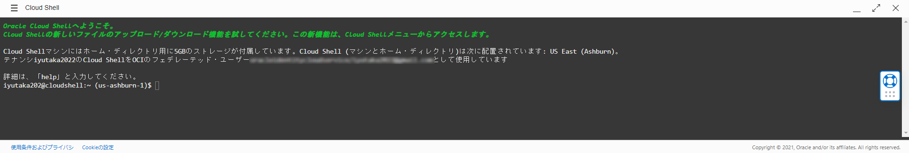

起動後、以下コマンドを実行します。

```sh
wget https://raw.githubusercontent.com/oracle-japan/devops-commons-script/master/common_prepare.sh
```

**_コマンド結果_**

```sh
--2022-04-05 00:55:37--  https://raw.githubusercontent.com/oracle-japan/devops-commons-script/master/common_prepare.sh
Resolving raw.githubusercontent.com (raw.githubusercontent.com)... 185.199.109.133, 185.199.110.133, 185.199.111.133, ...
Connecting to raw.githubusercontent.com (raw.githubusercontent.com)|185.199.109.133|:443... connected.
HTTP request sent, awaiting response... 200 OK
Length: 1195 (1.2K) [text/plain]
Saving to: ‘common_prepare.sh.1’

100%[==============================================================================================================================================================================================================================================>] 1,195       --.-K/s   in 0s

2022-04-05 00:55:37 (66.7 MB/s) - ‘common_prepare.sh’ saved [1195/1195]
```

ダウンロードしたスクリプトを実行します。

```sh
chmod +x ./common_prepare.sh
```

```sh
sh ./common_prepare.sh
```

**_コマンド結果_**

```sh
ocid1.tenancy.oc1..xxxxxxxxxxxxxxxxxxxxxxxxxxxxxxxxxxxxxxxxxxxxxxxxxxxxxxxxxxxx
{
  "data": {
    "compartment-id": "ocid1.tenancy.oc1..xxxxxxxxxxxxxxxxxxxxxxxxxxxxxxxxxxxxxxxxxxxxxxxxxxxxxxxxxxxx",
    "defined-tags": {
      "Oracle-Tags": {
        "CreatedBy": "oracleidentitycloudservice/xxxxxxxxxxx@xxxxx",
        "CreatedOn": "2021-11-18T07:41:49.264Z"
      }
    },
    "description": "OCI_DevOps_Dynamic_Group",
    "freeform-tags": {},
    "id": "ocid1.dynamicgroup.oc1..xxxxxxxxxxxxxxxxxxxxxxxxxxxxxxxxxxxxxxxxxxxxxxxxxxxxxxxxxxxx",
    "inactive-status": null,
    "lifecycle-state": "ACTIVE",
    "matching-rule": "Any {resource.id = 'ocid1.tenancy.oc1..xxxxxxxxxxxxxxxxxxxxxxxxxxxxxxxxxxxxxxxxxxxxxxxxxxxxxxxxxxxx'}, {instance.id = 'ocid1.tenancy.oc1..xxxxxxxxxxxxxxxxxxxxxxxxxxxxxxxxxxxxxxxxxxxxxxxxxxxxxxxxxxxx'}",
    "name": "OCI_DevOps_Dynamic_Group",
    "time-created": "2021-11-18T07:41:49.350000+00:00"
  },
  "etag": "5f604e055e624ed3f993aafb2052b775bd37da0e"
}
{
  "data": {
    "compartment-id": "ocid1.tenancy.oc1..xxxxxxxxxxxxxxxxxxxxxxxxxxxxxxxxxxxxxxxxxxxxxxxxxxxxxxxxxxxx",
    "defined-tags": {
      "Oracle-Tags": {
        "CreatedBy": "oracleidentitycloudservice/xxxxxxxxxxx@xxxxx",
        "CreatedOn": "2021-11-18T07:41:50.746Z"
      }
    },
    "description": "OCI_DevOps_Policy",
    "freeform-tags": {},
    "id": "ocid1.policy.oc1..xxxxxxxxxxxxxxxxxxxxxxxxxxxxxxxxxxxxxxxxxxxxxxxxxxxxxxxxxxxx",
    "inactive-status": null,
    "lifecycle-state": "ACTIVE",
    "name": "OCI_DevOps_Policy",
    "statements": [
      "Allow dynamic-group member-takuya.niita_dynamic_group to manage devops-family in compartment ocid1.policy.oc1..xxxxxxxxxxxxxxxxxxxxxxxxxxxxxxxxxxxxxxxxxxxxxxxxxxxxxxxxxxxx",
      "Allow dynamic-group member-takuya.niita_dynamic_group to manage all-artifacts in compartment ocid1.policy.oc1..xxxxxxxxxxxxxxxxxxxxxxxxxxxxxxxxxxxxxxxxxxxxxxxxxxxxxxxxxxxx",
      "Allow dynamic-group member-takuya.niita_dynamic_group to use ons-topics in compartment ocid1.policy.oc1..xxxxxxxxxxxxxxxxxxxxxxxxxxxxxxxxxxxxxxxxxxxxxxxxxxxxxxxxxxxx"
    ],
    "time-created": "2021-11-18T07:41:50.880000+00:00",
    "version-date": null
  },
  "etag": "31c9339700c6132a1b6205df041ad52fcf66be51"
}
```

これで、ポリシーの設定は完了です。

## 3.プロジェクト

ここでは、OCI DevOps インスタンスを作成し、プロジェクトを作成します。

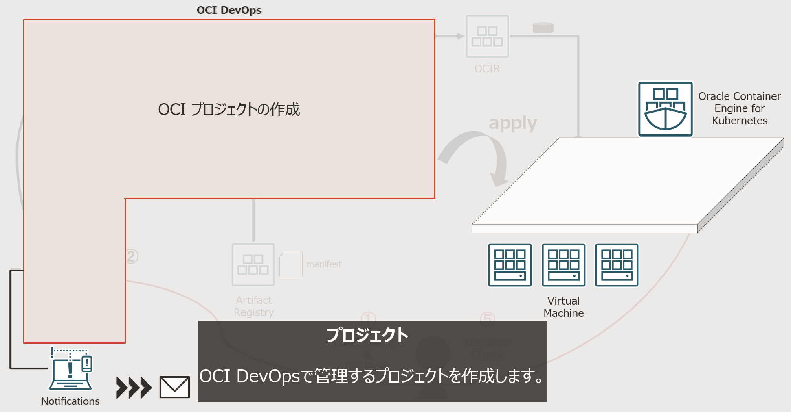

### 3-1 プロジェクトの作成

OCI DevOps は、プロジェクト単位で管理する仕組みです。最初にプロジェクトを作成します。

左上にあるハンバーガーメニューから「開発者サービス」-「プロジェクト」を選択します。

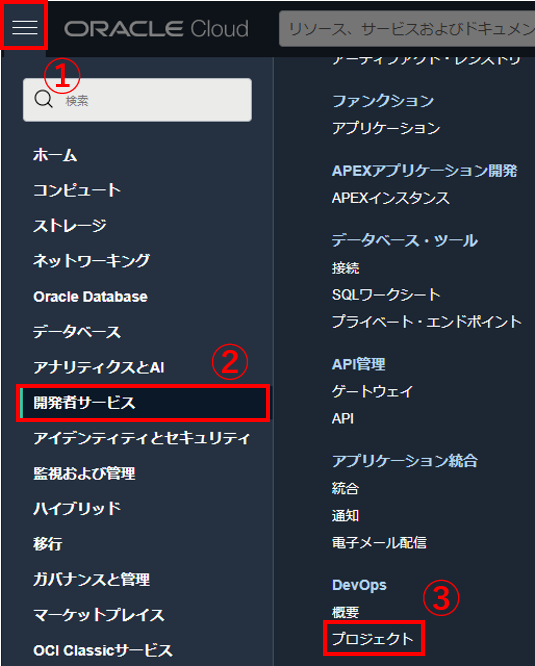

「DevOps プロジェクトの作成」ボタンをクリックします。


「プロジェクト名」に「oci-devops-handson」と入力して、「トピックの選択」ボタンをクリックします。

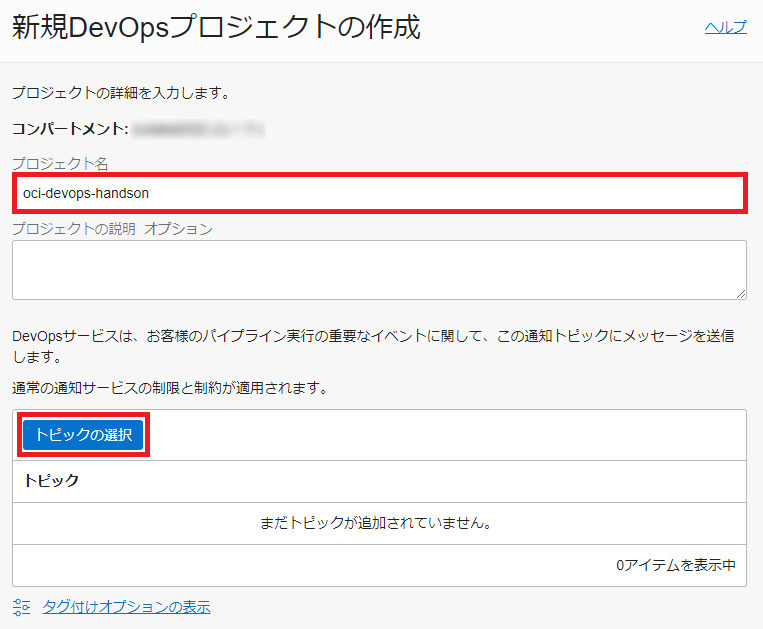


プロジェクト名はテナンシで一意になります。 集合ハンズオンなど複数人で同一環境を共有されている皆様は、`oci-devops-handson-01`や`oci-devops-handson-tn`などの名前のイニシャルを付与し、名前が重複しないようにしてください。


「トピック」が「oci-devops-handson」であることを確認します。

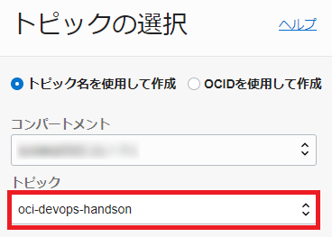

「トピックの選択」ボタンをクリックします。


「DevOps プロジェクトの作成」ボタンをクリックします。


ロギングを有効化するために、「ログの有効化」ボタンをクリックします。

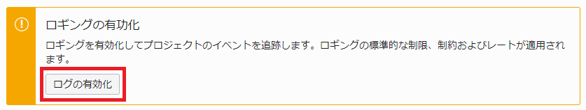

赤枠の箇所をクリックして有効化します。

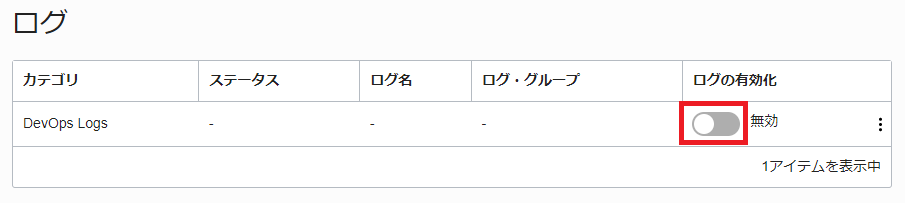

そのままの状態で、「ログの有効化」ボタンをクリックします。

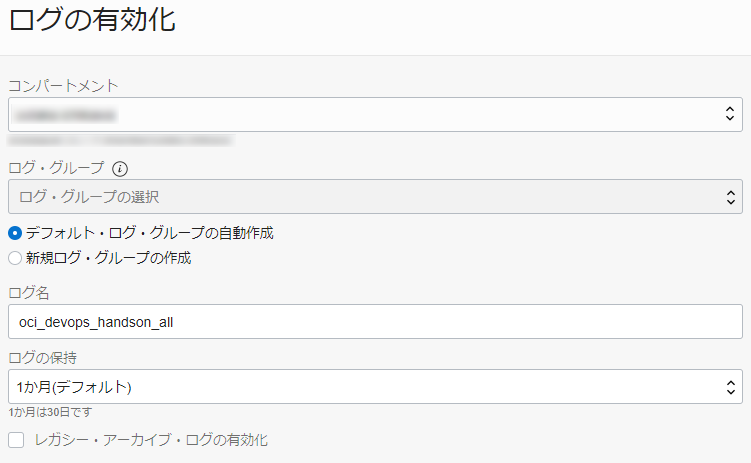


左メニューの「ログ」を選択して、「Active」となっていることを確認します。

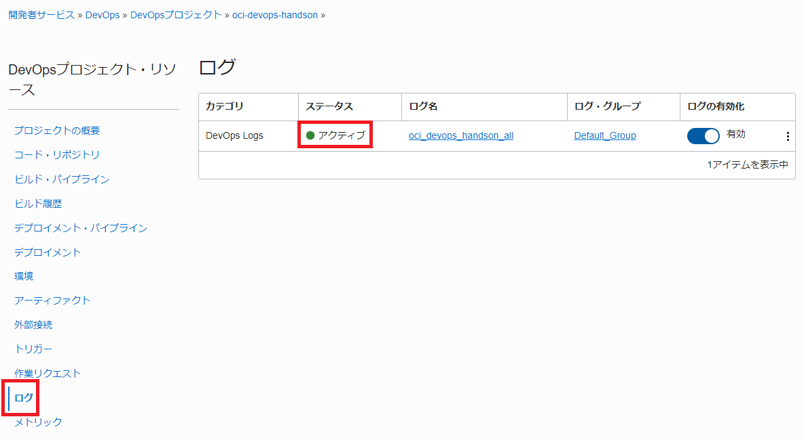

以上で、プロジェクトの作成は完了です。

この後はそれぞれ以下のハンズオン手順に従ってください。

[初級編 - Oracle Cloud Infrastructure(OCI) DevOps ことはじめ-Compute 編-](../devops-for-beginners-compute/)

[初級編 - Oracle Cloud Infrastructure(OCI) DevOps ことはじめ-OKE 編-](../devops-for-beginners-oke/)

[初級編 - Oracle Cloud Infrastructure(OCI) DevOps ことはじめ-Oracle Functions 編-](../devops-for-beginners-functions/)
