このハンズオンでは、OCI API GatewayとOracle Functionsを組み合わせて、簡単なアプリケーションを開発する手順をご紹介します。

条件
----------------------

- クラウド環境
  - 有効なOracle Cloudアカウントがあること

- 事前環境構築
  - [Fn Projectハンズオン](/ocitutorials/cloud-native/fn-for-beginners/)が完了していること
  - [Oracle Functionsハンズオン](/ocitutorials/cloud-native/functions-for-beginners/)が完了していること

1.サンプルアプリケーションのデプロイ
-------------------

ここでは、サンプルアプリケーションのデプロイを行います。  

ここでデプロイするFunctionは、渡されたパラメータを使用して、QRコードの画像を作成するアプリケーションです。  

まずは、githubからハンズオン用の資材をcloneします。  
[Oracle Functionsことはじめ](/ocitutorials/cloud-native/functions-for-beginners/)で利用したCloud Shellにログインします。  
Gitコマンドは既にCloud Shellにインストールされています。

以下のコマンドを実行します。
```sh
git clone https://github.com/oracle-japan/apigw-functions-handson.git
```

apigw-functions-handsonディレクトリに移動します。

```sh
cd apigw-functions-handson
```

Oracle Functionsを使用してFunctionをデプロイします。  
fn-generate-qrcodeディレクトリに移動します。

```sh
cd fn-generate-qrcode
```

fn-generate-qrcodeをデプロイします。

```sh
fn -v deploy --app helloworld-app
```

最後に以下のような出力が得られます：

```
~~~略~~~
Updating function fn-generate-qrcode using image nrt.ocir.io/xxxxxxxx/workshop/fn-generate-qrcode:0.0.2...
Successfully created function: fn-generate-qrcode with nrt.ocir.io/xxxxxxxx/workshop/fn-generate-qrcode:0.0.2
```

これで、Functionsのデプロイは完了です。

2.OCI API Gatewayプロビジョニングの事前準備
-------------------

ここでは、OCI API Gatewayをプロビジョニングするための事前準備を行います。

### 2-1.イングレス・ルールの追加

OCI API Gatewayは、デフォルトでは開いていないポート443で通信します。 ポート443のトラフィックを許可するには、サブネットに対してイングレス・ルールを追加する必要があります。

OCIコンソールにログインし、[ネットワーキング]に移動して、[仮想クラウド・ネットワーク]をクリックします。


[コンパートメント]からOCI API Gatewayで利用するコンパートメント(今回はルートコンパートメント)を選択して、OCI API Gatewayで利用するVCNリンクをクリックします。  
VCNは[Oracle Functionsことはじめ](/ocitutorials/cloud-native/functions-for-beginners/)で作成したVCNを利用してください。


OCI API Gatewayで利用するサブネットリンクをクリックします。  
今回は、パブリックサブネット("Oracle Functions Handson"で作成した場合は"パブリック・サブネット-Oracle Functions Handson(リージョナル)")を選択してください。


[Default Security List for ...]リンクをクリックします。


[イングレス・ルールの追加]をクリックします。

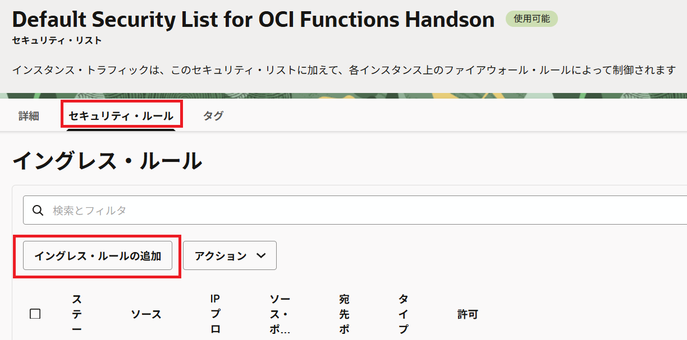

以下項目を入力して、[イングレース・ルールの追加]をクリックします。

+ ステートレス：チェックをオフにする（デフォルト値）
+ ソースCIDR：`0.0.0.0/0`
+ IPプロトコル：`TCP`（デフォルト値）
+ 宛先ポート範囲：`443`

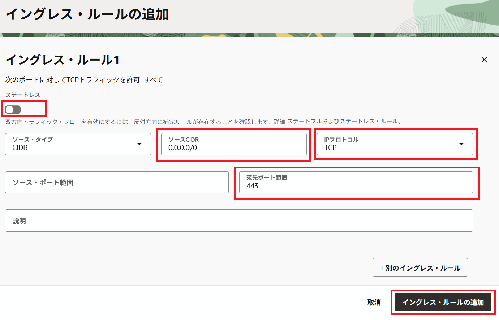

新しいイングレス・ルールが追加されます。

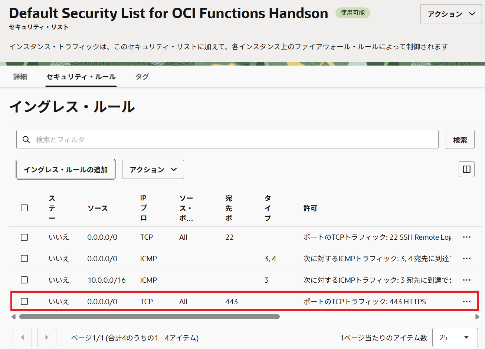

### 2-2.動的ポリシーの作成

OCI API GatewayでOracle Functionsを利用するための動的ポリシーの作成を行います。  


Visual Builder Studio上の仮想マシン・テンプレート名の重複は許容されていません。 集合ハンズオンなど同一の環境でハンズオンを実施されている方は、仮想マシン・テンプレート名が重複しない様に語尾に任意の文字列(名前のイニシャル等)を追加してください。 


+ 動的グループを作成します。

OCIコンソールにログインし、[アイデンティティ]をクリックして、[動的グループ]をクリックします。


[動的グループの作成]をクリックします。

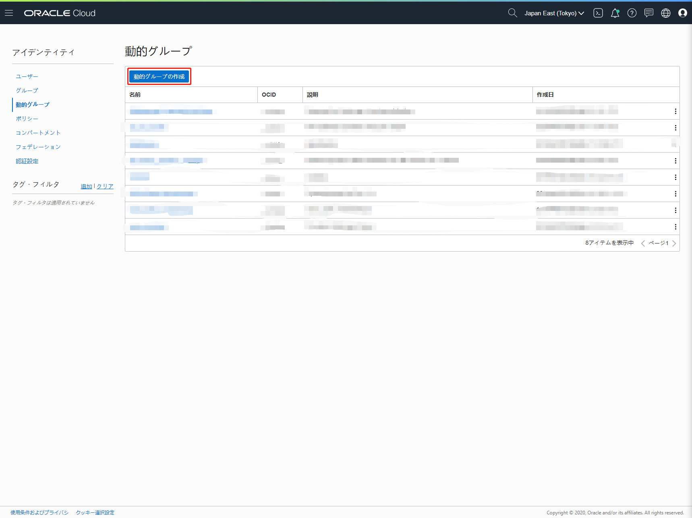

以下項目を入力して、[動的グループの作成]をクリックします。

+ 名前：任意。今回は`api_gw_grp`
+ 説明：任意。今回は`API Gateway Dynamic Group`
+ ルール1：`<compartment-ocid>`は[アイデンティティ]⇒[コンパートメント]に移動して、OCI API Gatewayで使用するコンパートメント(今回はルートコンパートメント)を開いて、該当OCIDを記入します。
  ```
  ALL {resource.type = 'ApiGateway', resource.compartment.id = '<compartment-ocid>'}
  ```

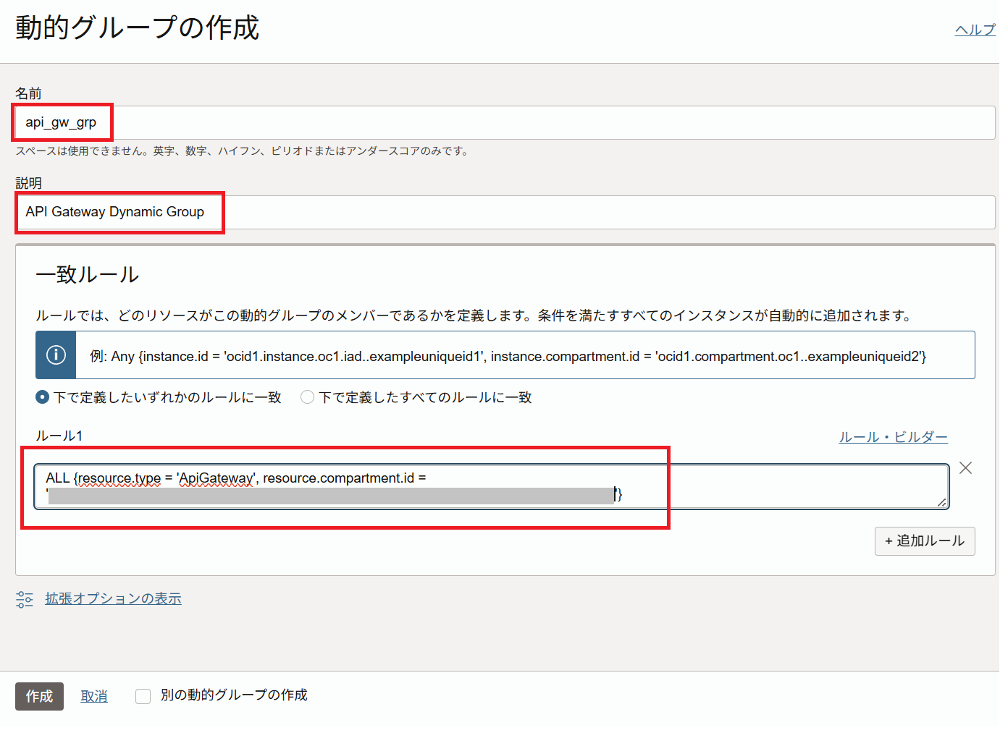

+ ポリシーを作成します。

OCIコンソールにログインし、[アイデンティティ]をクリックして、[ポリシー]をクリックします。

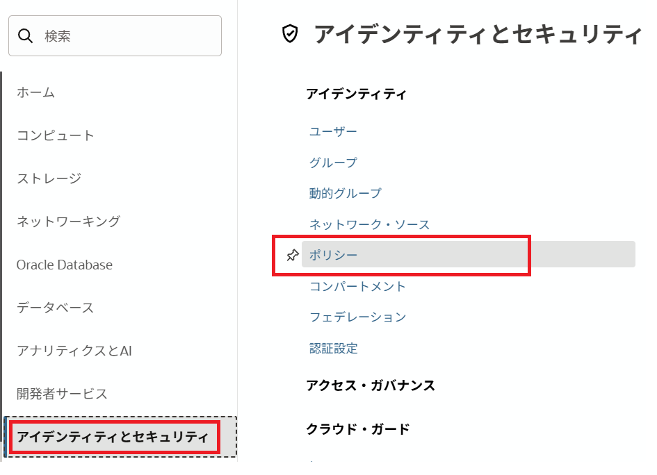

[コンパートメント]からOCI API Gatewayで利用するコンパートメント(今回はルートコンパートメント)を選択して、[ポリシーの作成]をクリックします。


以下項目を入力して、[作成]をクリックします。

+ 名前：任意。今回は`APIGW_Policy`
+ 説明：任意。今回は`APIGW_Policy`
+ `手動エディタの表示`にチェック
+ ポリシー・ビルダー：以下のポリシーを入力します。
    ```
    Allow dynamic-group api_gw_grp to use functions-family in tenancy
    ```

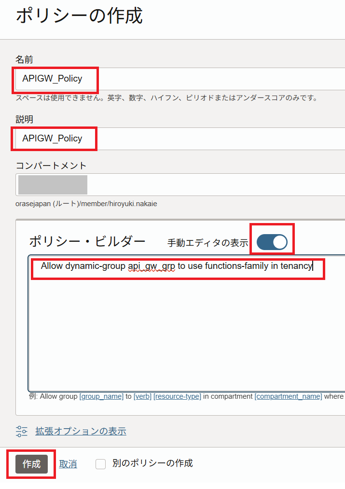

以上で、OCI API Gatewayプロビジョニングの事前準備は完了です。  

3.OCI API GatewayへのOracle Functionsデプロイと動作確認
------

### 3-1.OCI API Gatewayの作成

OCIコンソールにログインし、[開発者サービス]に移動して、[API管理] => [ゲートウェイ]をクリックしてから、次の操作を行います。

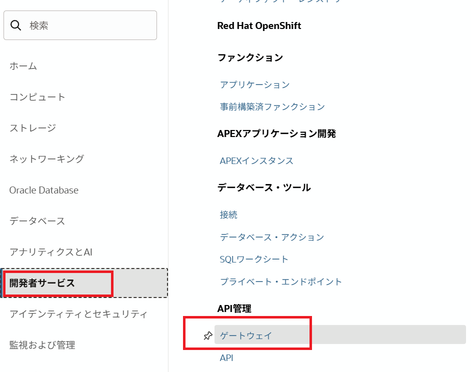

[ゲートウェイの作成]をクリックして、次を指定します。

+ 名前：新しいゲートウェイの名前。今回は、"workshop-api-gateway"

+ タイプ：パブリック

+ コンパートメント：OCI API Gatewayリソースを作成するコンパートメントの名前。今回はルートコンパートメントを指定。

+ 仮想クラウド・ネットワーク：OCI API Gatewayで使用するVCNの名前。今回は、[Oracle Functionsことはじめ](/ocitutorials/cloud-native/functions-for-beginners/)で作成したVCNを指定してください。

+ サブネット：VCNのサブネットの名前。今回は、[Oracle Functionsことはじめ](/ocitutorials/cloud-native/functions-for-beginners/)で作成したVCNのパブリック・サブネットを指定してください。

[作成]をクリックします。

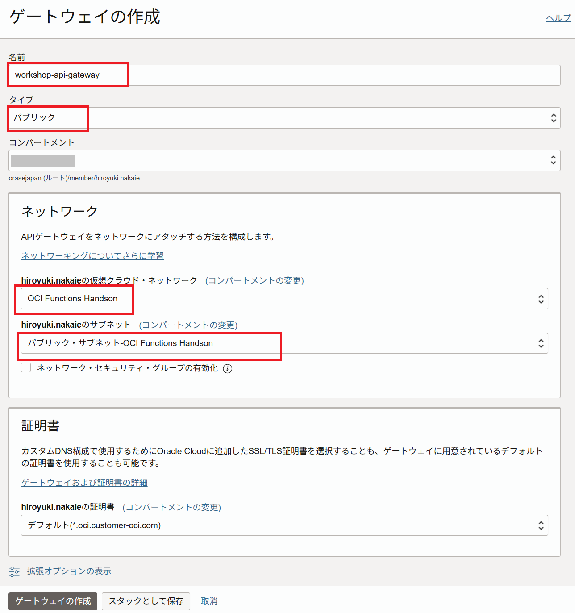

新しいAPIゲートウェイが作成されると、[ゲートウェイ]ページのリストに`アクティブ`と表示されます。  
`アクティブ`になるまでには5-10分程度かかることがあります。


### 3-2.OCI API GatewayへのOracle Functionsへのデプロイ

[ゲートウェイ]ページで、前に作成したAPIゲートウェイの名前をクリックします。

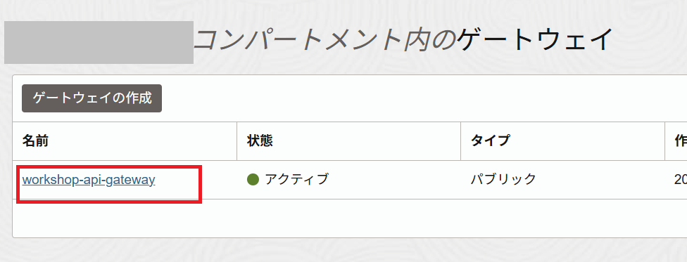

画面左側にあるメニューの[リソース]で[デプロイメント]をクリックし、[デプロイメントの作成]をクリックします。

[最初から]をクリックし、[基本情報]については以下を入力します。

+ 名前：新しいAPIデプロイメントの名前。今回は、workshop-api-deployment
+ パス接頭辞：APIデプロイメントに含まれるすべてのルートのパスに追加するパスプレフィックス。今回は`/v1`
+ コンパートメント：新しいAPIデプロイメントを作成するコンパートメント(今回はルートコンパートメント)

[APIリクエスト・ポリシー]内の[CORS]セクションの[編集]をクリックします。

後続の手順で構築するWebサーバからOCI API Gatewayへのアクセスを許可するために以下の設定を行います。  
[オリジン]内の[許可されるオリジン]に`*`と入力し、[変更の保存]をクリックします。

以下のような状態になっていれば問題ありません。[次]をクリックします。


[認証]では、今回は`認証なし`を選択し、[次]をクリックします。 



オリジン間リソース共有Cross-Origin Resource Sharing (CORS) は、追加の HTTP ヘッダーを使用して、あるオリジンで動作しているウェブアプリケーションに、異なるオリジンにある選択されたリソースへのアクセス権を与えるようブラウザーに指示するための仕組みです。   呼び出し元から異なるドメインへのリソースへアクセスを行うためにはCORSの設定が必要になります。 今回はハンズオンをスムーズに体験頂くために`*`を指定しましたが、実際は適切なオリジン名を入力する必要があります。   詳細は[オリジン間リソース共有 (CORS)](https://developer.mozilla.org/ja/docs/Web/HTTP/CORS)をご確認ください。 


[1のルーティング]セクションで次を指定して、[次]をクリックします。

+ パス：APIのパス。今回は、/fn-generate-qrcode
+ メソッド：APIのメソッドを指定します。今回は、`GET`
+ タイプ：バックエンド・サービスのタイプを指定します。今回は、`Oracle Functions`
+ アプリケーション：Oracle Functionsのアプリケーションを指定します。今回は、`helloworld-app`
+ 機能名：Oracle Functionsの機能名を指定します。今回は、`fn-generate-qrcode`

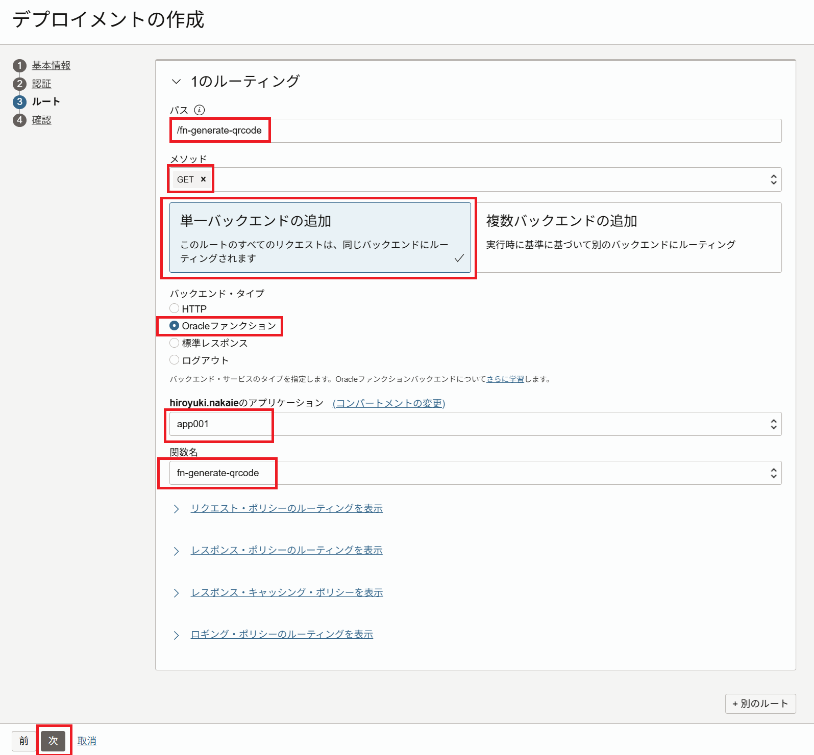

新しいAPIデプロイメント用に入力した詳細を確認し、[作成]をクリックして作成します。

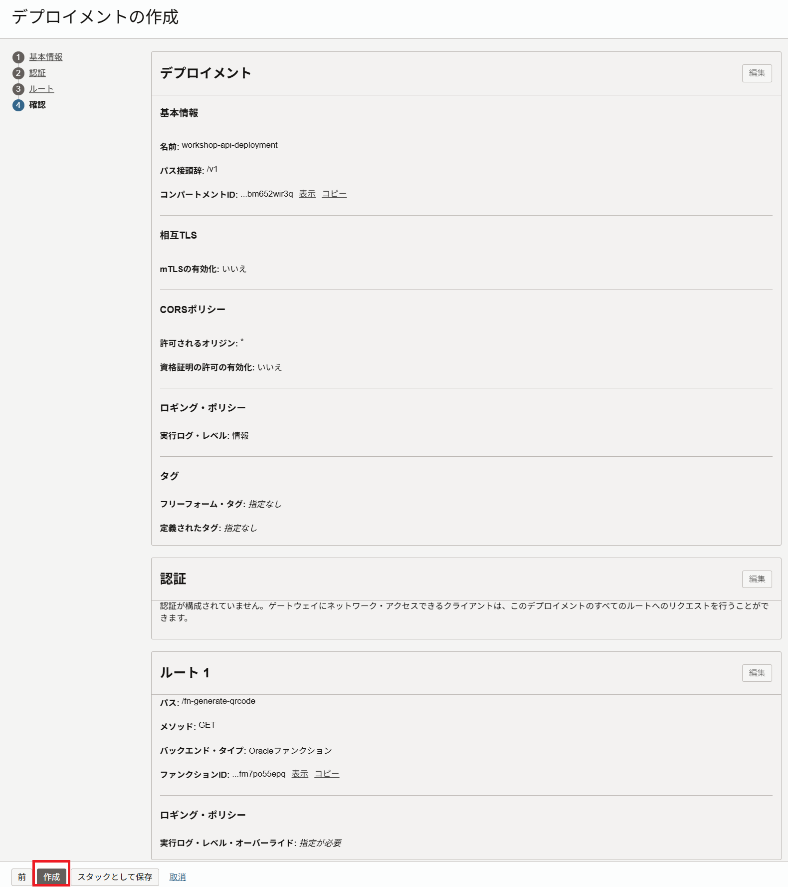

新しいAPIデプロイメントが作成されると、APIデプロイメントのリストにアクティブとして表示されます。

APIデプロイメントのリストで、作成したばかりの新しいAPIデプロイメントのエンドポイントの横にある[コピー]をクリックして、エンドポイントをコピーし、テキストエディタ等に保持しておきます。


エンドポイントは以下のようになります。

```
https://xxxxxxxxxxxxxxxxxxxxxxxxxxxxx.apigateway.ap-tokyo-1.oci.customer-oci.com/v1
```

### 3-3.動作確認

今回のハンズオンでは、サンプルアプリケーションを利用して、OCI API Gateway経由でOracle Functionsを呼び出します。  
今回は、[Fn Projectハンズオン](/ocitutorials/cloud-native/fn-for-beginners/)で作成したコンピュートインスタンスを利用して、
フロントエンドアプリを構築します。

サンプルアプリケーションをpullするために、Gitコマンドをインストールします。

```sh
sudo yum -y install git-all
```

以下のコマンドを実行します。
```sh
git clone https://github.com/oracle-japan/apigw-functions-handson.git
```

apigw-functions-handsonディレクトリ(git cloneした資材ディレクトリ)に移動します。
```sh
cd apigw-functions-handson/front-app
```

サンプルアプリケーションの`main.js`にある`API_URL`を修正します。
```sh
vi js/main.js
```

3行目の`API_URL`を修正します。

$(function () {

    const sampleURL = "API_URL?contents=";
    const qrName = "qr.png";

    function getDataUrl(url, callback) {
        let image = new Image();
        image.crossOrigin = "anonymous";
        image.src = url;
        image.onload = function () {
            let canvas = document.createElement('canvas');
            canvas.width = this.naturalWidth;
            canvas.height = this.naturalHeight;

            canvas.getContext('2d').drawImage(this, 0, 0);
            callback(canvas.toDataURL('image/png'));
        }
    }

    $("#button1").click(function () {
(以下略)


`API_URL`は`https://<OCI API Gatewayのエンドポイント>/<パス接頭辞>/<APIのパス>`の形式になります。  
今回は以下の形式になります。`<APIデプロイメントのエンドポイント>`を手順3－2でコピーしたエンドポイントに修正してください。

```js
const sampleURL = "<APIデプロイメントのエンドポイント>/fn-generate-qrcode?contents=";
```

例えば以下のようになります。(XXXXの部分は各自のOCI API Gatewayのエンドポイントにより異なります)

```js
const sampleURL = "https://XXXXXXXXXXXXXXXXXXXXXXXXX.apigateway.ap-tokyo-1.oci.customer-oci.com/v1/fn-generate-qrcode?contents=";
```
  
サンプルアプリケーションをHTTPサーバーへデプロイします。

HTTPサーバーをインストールします。

```sh
sudo yum install -y httpd
```

サンプルアプリケーションを`/var/www/html`へコピーします。

```sh
sudo cp -r ./* /var/www/html/
```

HTTPサーバーを起動します。

```sh
sudo systemctl start httpd
```

HTTPサーバーのデフォルトポート80で通信を行うようにするためにイングレスルールを追加します。

OCIコンソールにログインし、[ネットワーキング]に移動して、[仮想クラウド・ネットワーク]をクリックします。


[コンパートメント]からOCI API Gatewayで利用するコンパートメント(今回はルートコンパートメント)を選択して、OCI API Gatewayで利用するVCNリンクをクリックします。  
VCNは[Fn Projectハンズオン](/ocitutorials/cloud-native/fn-for-beginners/)で作成したVCNを利用してください。


OCI API Gatewayで利用するサブネットリンクをクリックします。  
今回は、パブリックサブネット("Oracle Functions Handson"で作成した場合は"パブリック・サブネット-Oracle Functions Handson(リージョナル)")を選択してください。


[Default Security List for ...]リンクをクリックします。


[イングレス・ルールの追加]をクリックします。

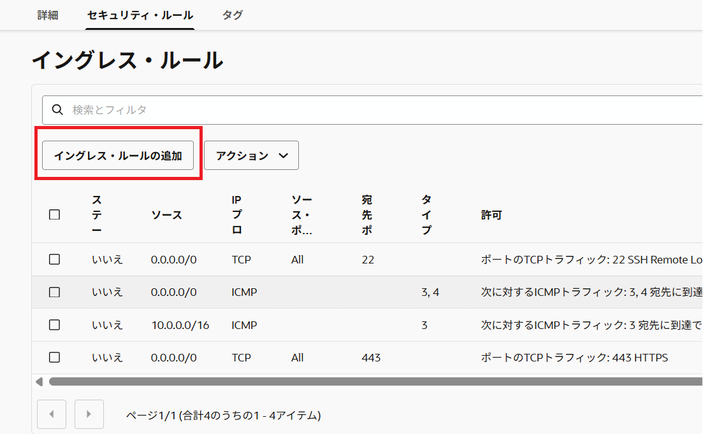

以下項目を入力して、[イングレース・ルールの追加]をクリックします。

+ ステートレス：チェックをオフにする（デフォルト値）
+ ソースCIDR：`0.0.0.0/0`
+ IPプロトコル：`TCP`（デフォルト値）
+ 宛先ポート範囲：`80`

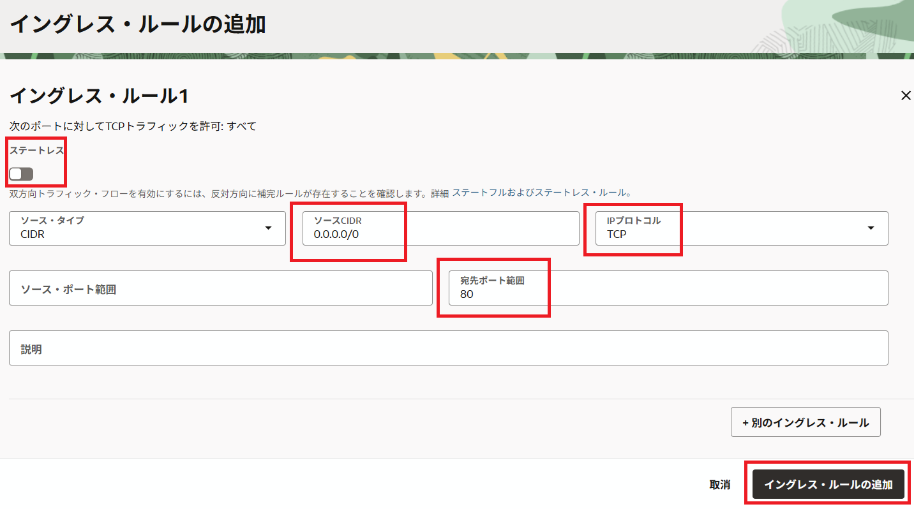

新しいイングレス・ルールが追加されます。

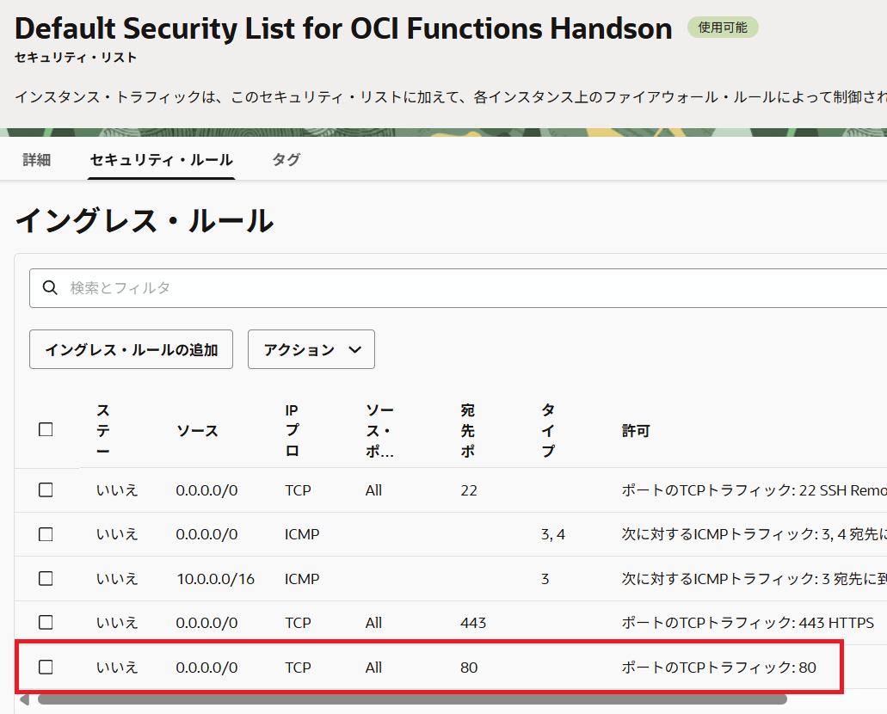

また、コンピュートインスタンス側ののFirewallについてもポート80で通信できるように設定します。

```sh
sudo firewall-cmd --add-port=80/tcp --permanent
```

```sh
sudo firewall-cmd --reload
```

ブラウザーを開き、コンピュートインスタンスのパブリックIPでアクセスします。サンプルアプリケーションが表示されます。

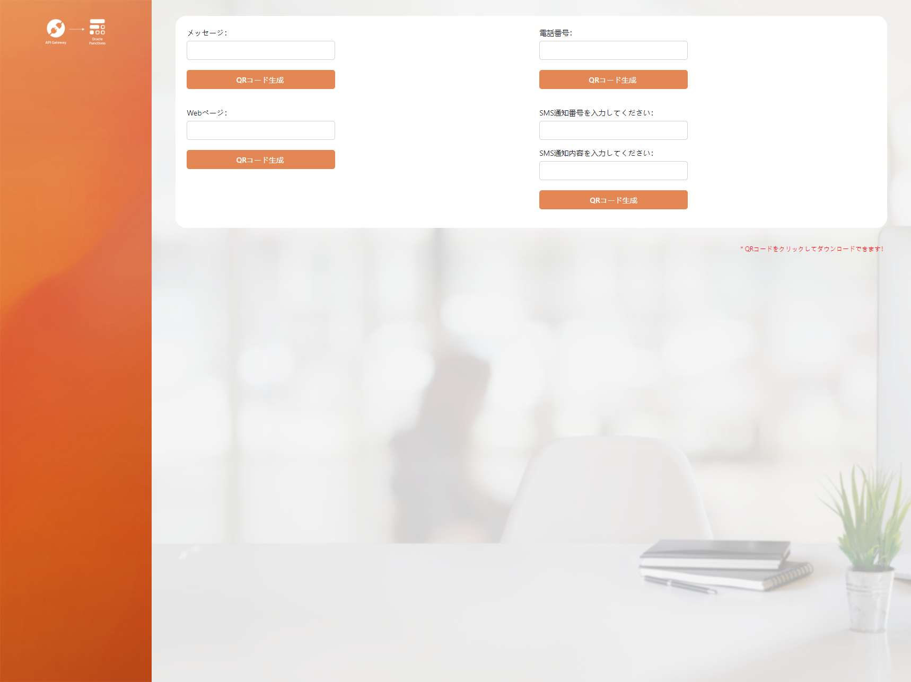

QRコードを作成してみます。以下項目にそれぞれのテスト内容を入力して、それぞれの[QAコード生成]をクリックします。

+ メッセージ：oracle

+ 電話番号：08012345678

+ Webページ：www.oracle.com

+ SMS通知番号を入力してください：08012345678

+ SMS通知内容を入力してください：oracle

それぞれのQRコードが作成されます。QRコードをクリックして、ダウンロードできます。

手元にあるスマートフォンでスキャンして、電話するとか、Webページに移動するとかの機能が実行されます。（以下の画像にあるQRコードをスキャンできます）

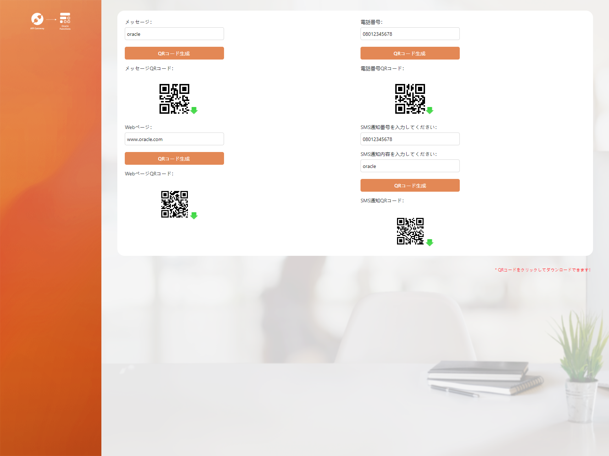

これで、OCI API GatewayとOracle Functionsを利用した簡単なサーバレスアプリケーションが構築できました。  
お疲れ様でした！