OCI Functionsは、Oracleが提供するオープンソースのFaaSプラットフォームであるFn Projectのマネージドサービスです。  
このエントリーでは、OCI Functions環境構築から動作確認までの手順を記します。
 
条件
----------------------
- クラウド環境
    * 有効なOracle Cloudアカウントがあること
    * [Fn Projectハンズオン](/ocitutorials/cloud-native/fn-for-beginners/)が完了していること(このハンズオンの理解を深めるため)

1.Cloud Shellのセットアップ
-------------------
本ハンズオンではOKEクラスターを操作するいくつかのCLIを実行するための環境としてCloud Shellと呼ばれるサービスを使用します。
Cloud ShellはOracle CloudコンソールからアクセスできるWebブラウザベースのコンソールです。
Cloud Shellには、OCI CLIをはじめとして、次のようないくつかの便利なツールおよびユーティリティの現在のバージョンがインストールされています。
詳細は、[公式ドキュメントの記載](https://docs.cloud.oracle.com/ja-jp/iaas/Content/API/Concepts/cloudshellintro.htm)をご確認ください。

インストール済みツール |
-|
Git |
Java |
Python (2および3) |
SQL Plus |
kubectl |
helm |
maven |
gradle |
terraform |
ansible |
fn |


Cloud Shellは開発専用ではなく、一時的にOCIコマンドを実行したい場合などライトなご利用を想定したサービスであるため、実運用時はCLI実行環境を別途ご用意ください。 


OCIコンソール上で右上にあるターミナルのアイコンをクリックします。

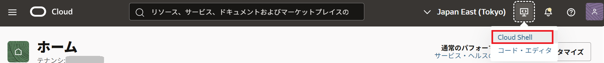


しばらく待つと、Cloud Shellが起動されます。　　

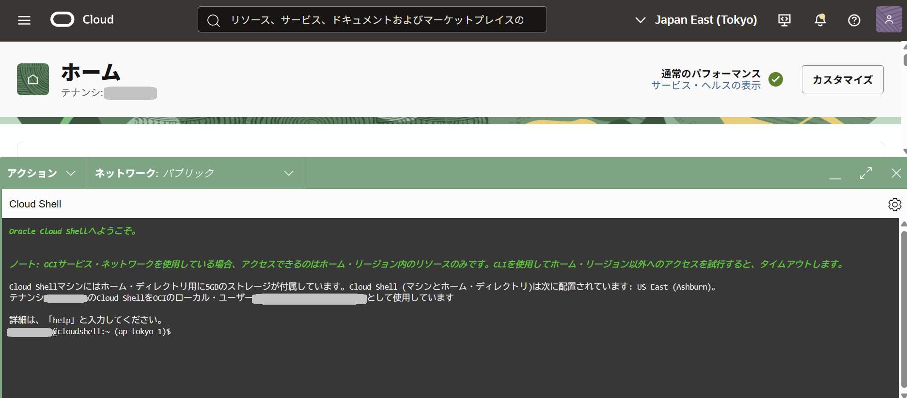

デフォルトでは、Cloud Shellが利用しているCPUアーキテクチャが`ARM`である可能性があります。  
今回は、`X86_64`を利用したいので、利用するCPUアーキテクチャを修正します。  

Cloud Shellの左側にある`アーキテクチャ`をクリックします。  

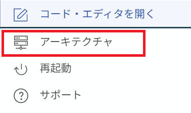

希望するアーキテクチャを`X86_64`に変更し、`確認して再起動`をクリックします。  

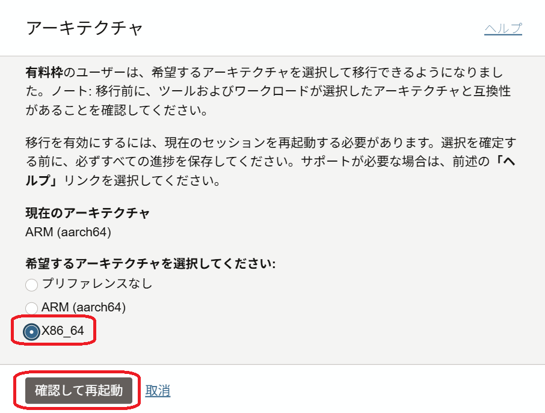

インスタンスの再起動というダイアログが表示されたら、`再起動`をクリックします。  

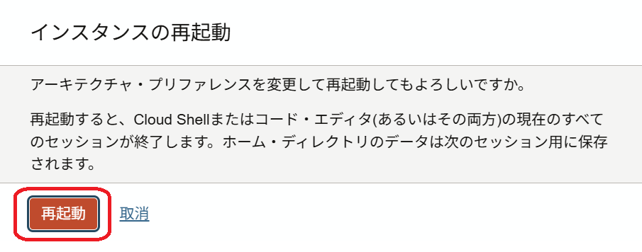

しばらくすると、Cloud Shellが起動します。

起動後に以下のコマンドで確認してみましょう。  
このハンズオンに必要なCLI(`fn`コマンド)はデフォルトでインストール済みです。  

```
fn --version
```

以下のような結果となれば、`fn`コマンドは正常にインストールされています。
```
fn version 0.6.33
```

以上で、準備作業は完了です。

2.OCI Function Hello World
---------------------------------------------------
ここでは、OCI Functionsを動作させるための環境を構築します。  

### 2-1. OCI Functionsが利用するVCNの作成
Oracle Cloudのダッシューボードにログインし、ダッシューボード画面のハンバーガメニューで`ネットワーキング`=>`仮想クラウド・ネットワーキング`をクリックします。

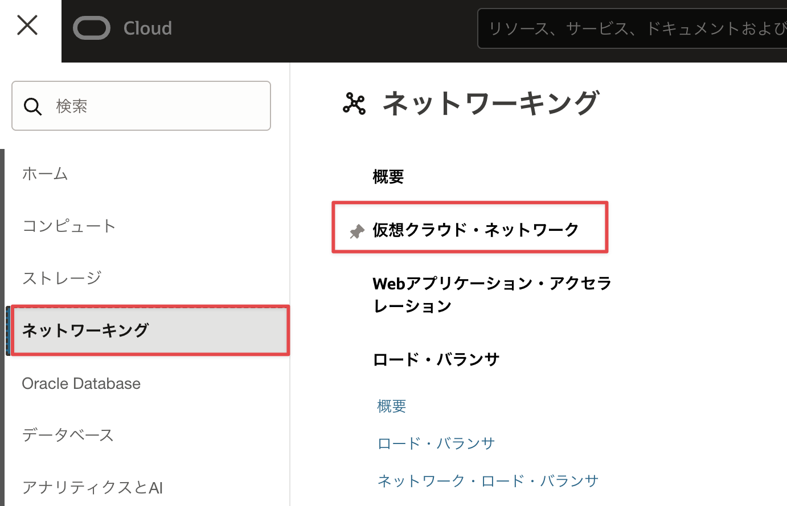

`VCNウィザードの起動`をクリックします。

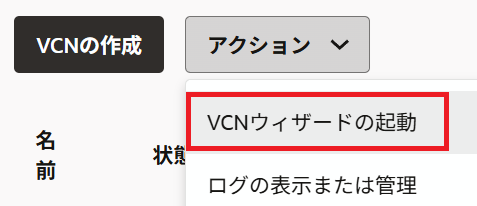

`インターネット接続性を持つVCNの作成`を選択し、`VCNウィザードの起動`をクリックします。

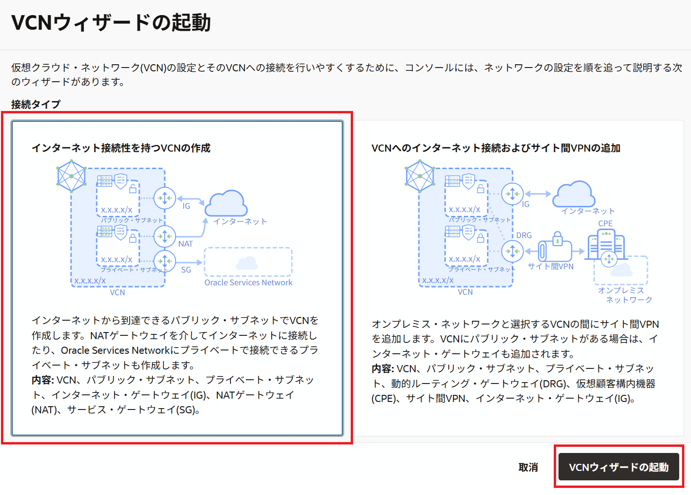

VCN名に任意の名前(こだわりがなければ`OCI Functions Handson`)を入力し、他はデフォルトのまま、`次`をクリックします。

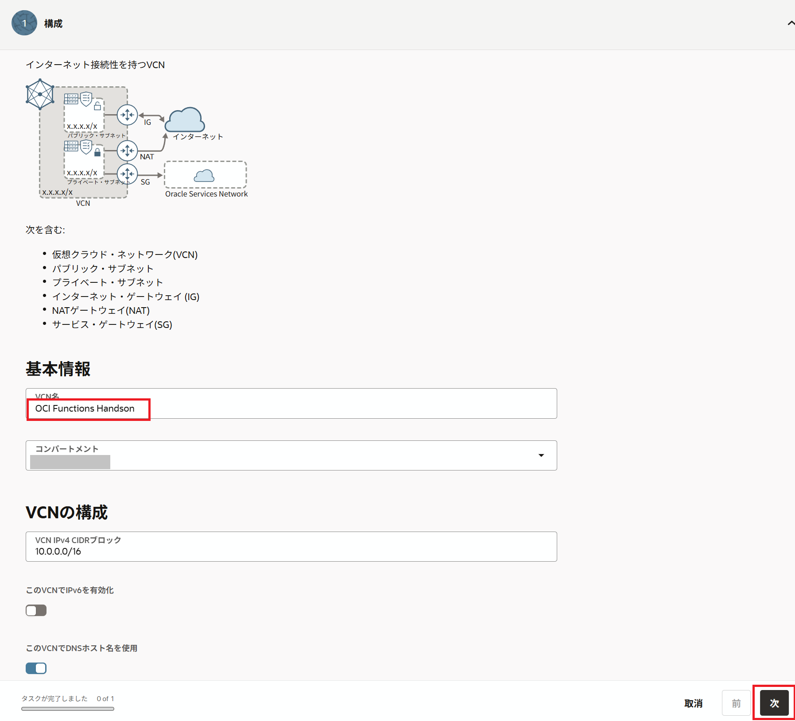

`作成`をクリックします。

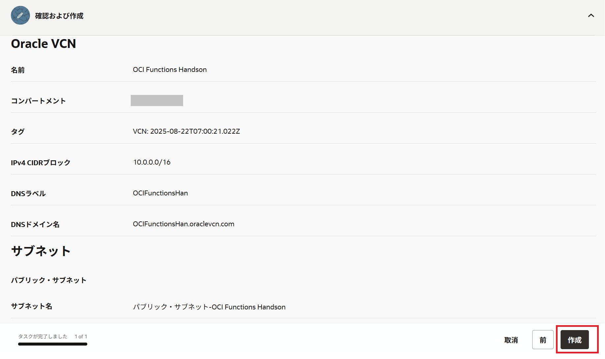

以上で、VCN(ネットワーク)の作成は終わりです。

### 2-2. OCI Functionsのアプリケーションの作成
ここでは、OCI Functionsのアプリケーションの作成を行います。

OCIのコンソールに移り、`開発者サービス`の`ファンクション`をクリックします。
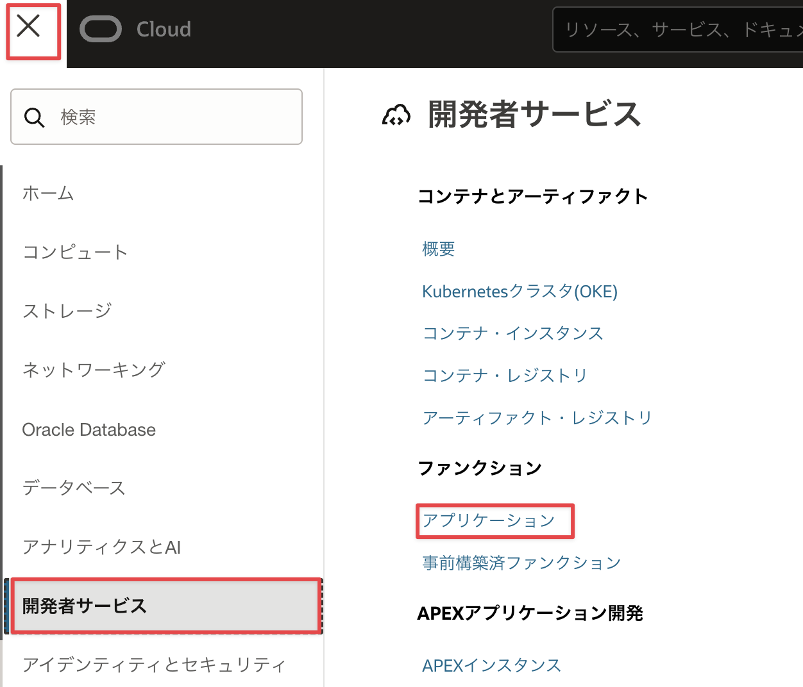

`アプリケーションの作成`をクリックします。
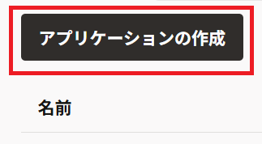

名前に`helloworld-app`と入力、VCNに[2-1. OCI Functionsが利用するVCNの作成](#2-1-oracle-functionsが利用するvcnの作成)で作成したネットワーク名を選択、サブネットにVCNに紐づくパブリックサブネットを選択、シェイプに`GENERIC_X86`を選択し、`作成`をクリックします。
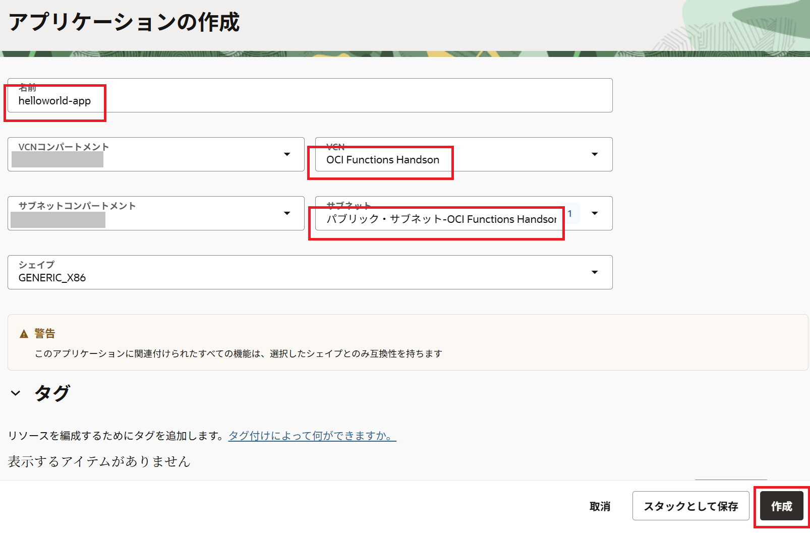

以上で、OCI Functionsのアプリケーションの作成は完了です。

### 2-3. OCI Functionsのサンプルアプリケーション実行

ここでは、OCI Functionsのサンプルアプリケーションを実行します。  
アプリケーションの実行にはいくつかの手順が必要ですが、[2-2. OCI Functionsのアプリケーションの作成](#2-2-OCI Functionsのアプリケーションの作成)で作成したアプリケーションにスタートガイドがあるので、こちらの手順をベースに実施します。  

先ほど作成したアプリケーションをクリックします。  

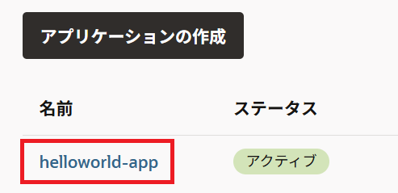

`スタート・ガイド`にある`ガイドの表示`をクリックします。  

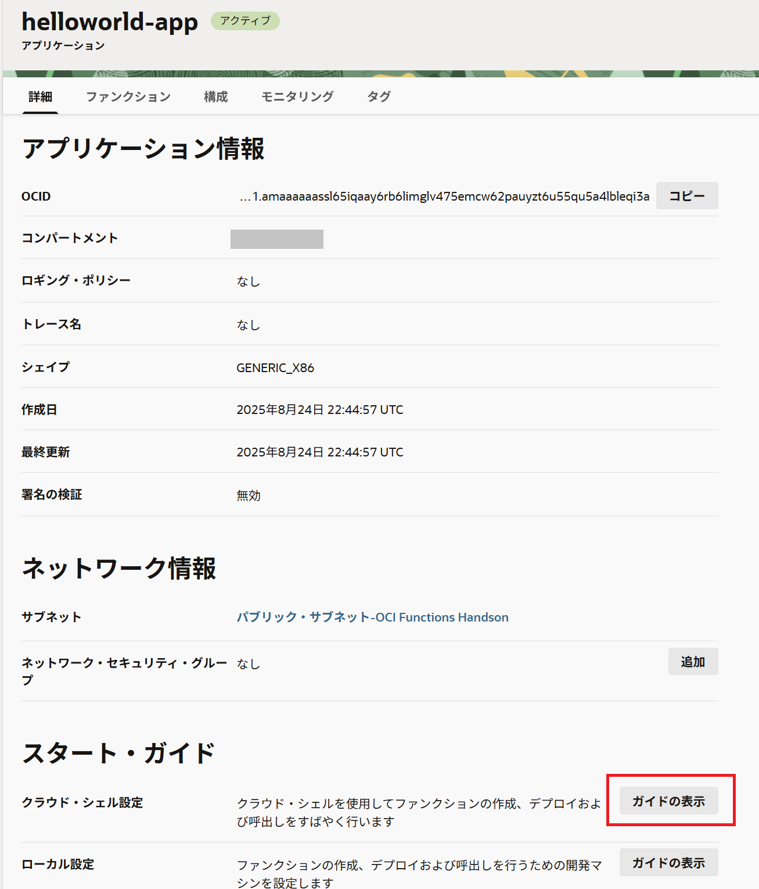

こちらにJavaのサンプルアプリケーション実行までを整理した手順があるので、こちらをベースに移行の手順を実施します。  

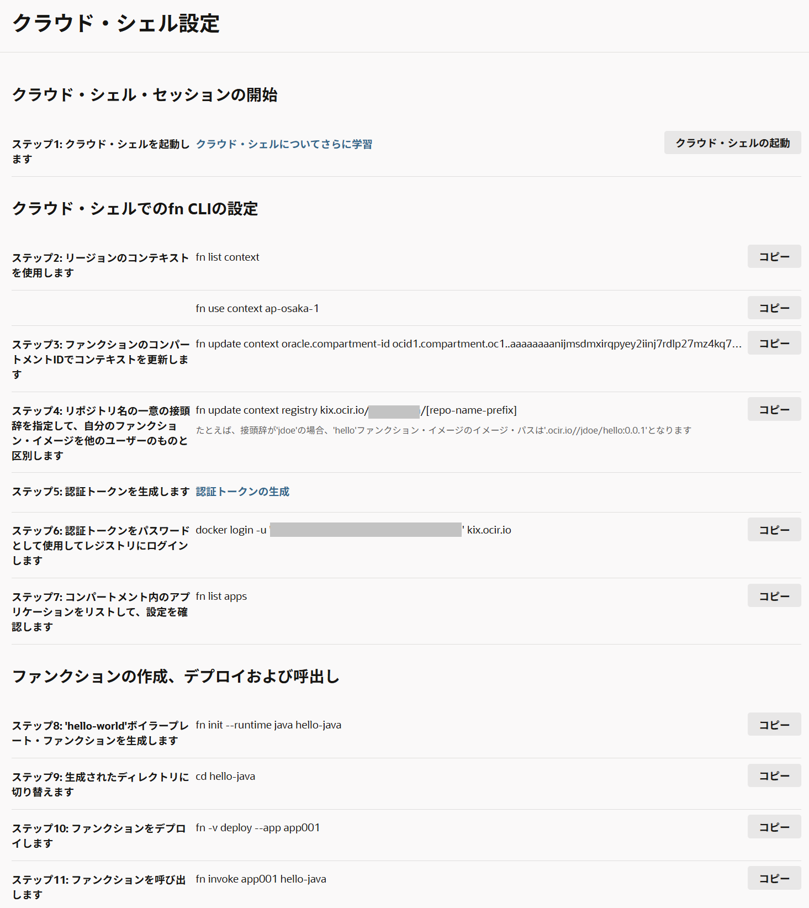

ステップ1～3については、ガイドにあるコマンドをCloud Shell上でそのまま実行してください。  

ステップ4については、[repo-name-prefix]を任意のコンテナイメージ名に置き換えてCloud Shell上で実行してください。  



集合ハンズオンなどの1つの環境を複数人で共有している場合、コンテナイメージパスが重複する場合があります。  
その場合は、コンテナイメージ名にイニシャルを付与するなど、重複をしないようにコンテナイメージ名をきめてください。  



ステップ5については、ガイドのリンクをクリックします。　　

画面を下にスクロールし、トークンの生成"をクリックします。
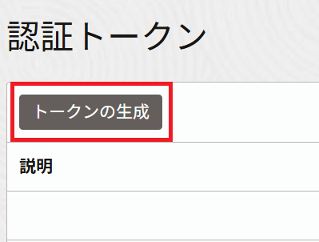

"説明"に"This token is used for OCI Functions Handson"と入力し、"トークンの生成"をクリックします。
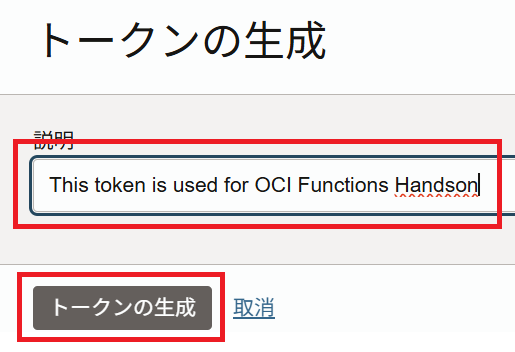

以下の画面が表示されるので、"コピー"をクリックし、これを手元のテキストエディタなどにペーストしておきます。
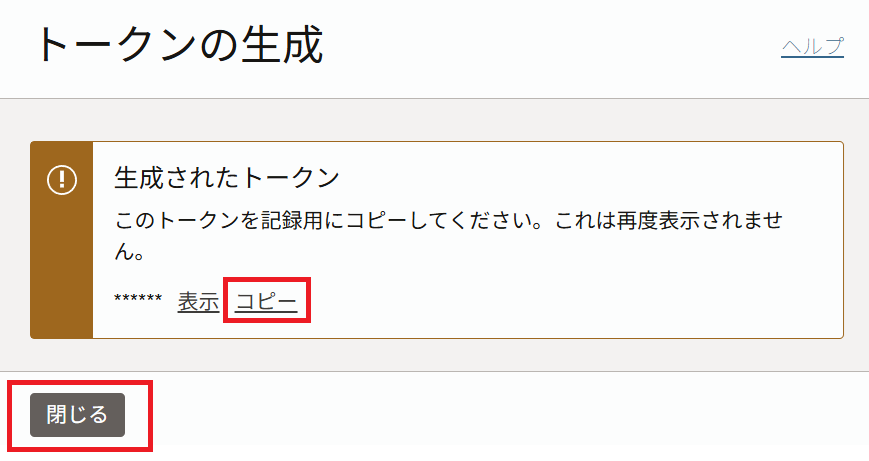

ステップ6以降については、ガイドにあるコマンドをCloud Shell上でそのまま実行してください。  

ステップ11の実行後に以下が表示されれば、OCI Functionsを無事に実行できています。  

```sh
cloudshell:hello-java (ap-tokyo-1)$ fn invoke helloworld-app hello-java
Hello, world!
```
