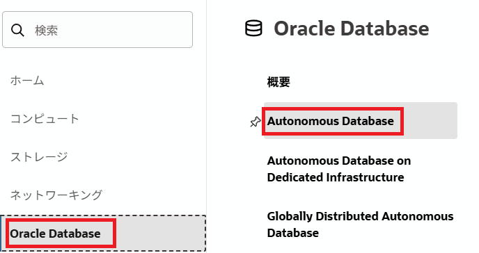
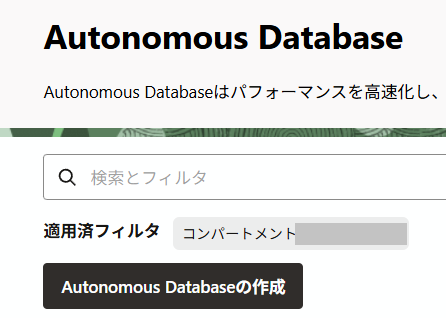
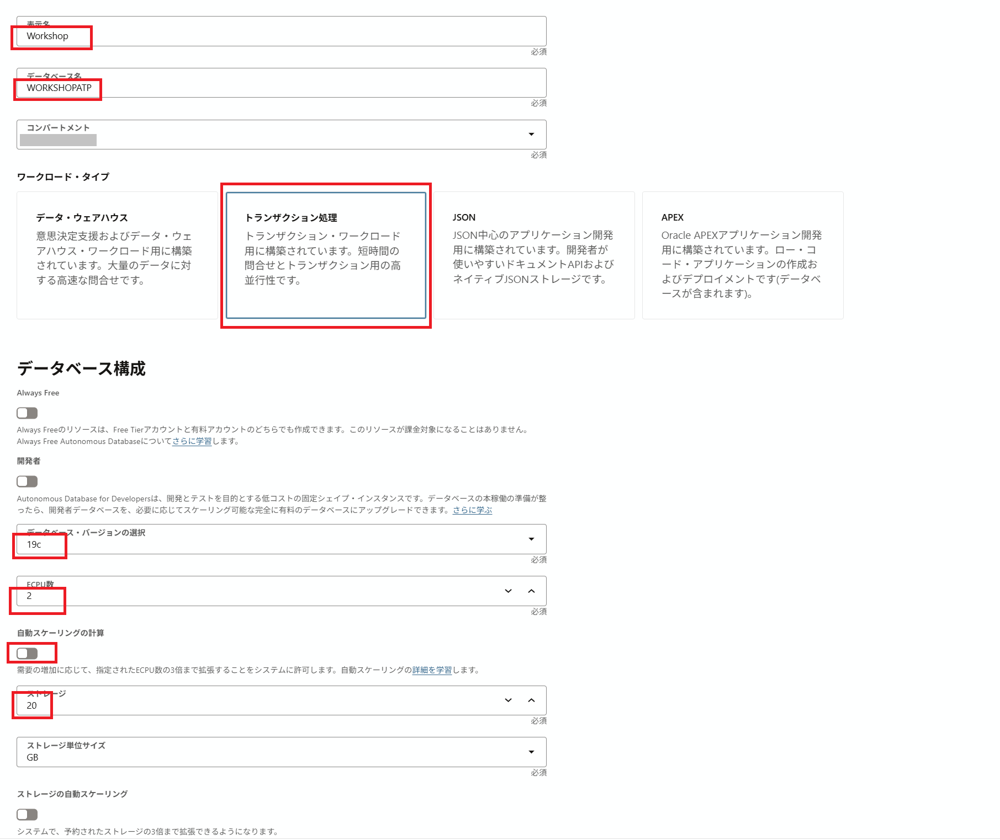
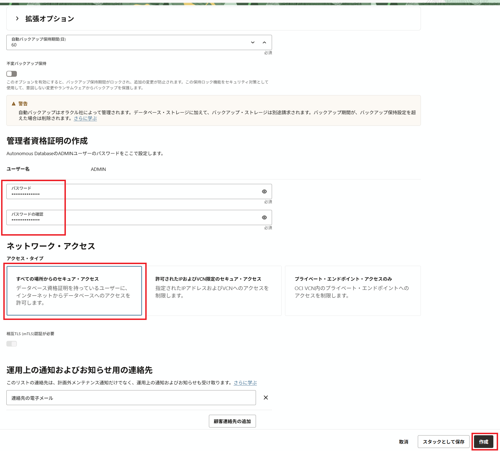
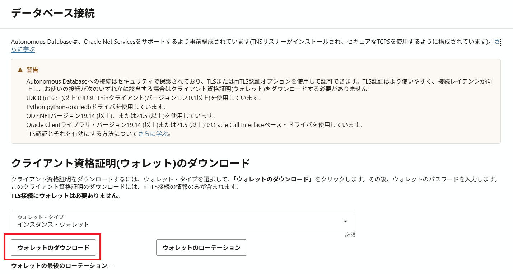
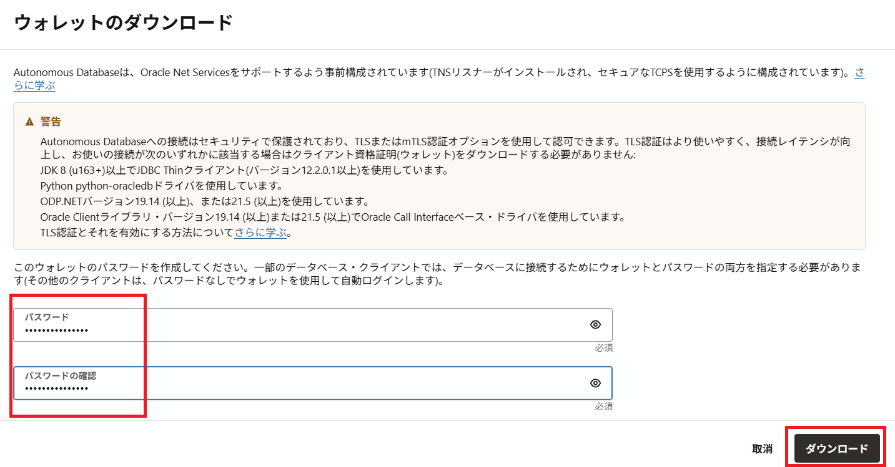
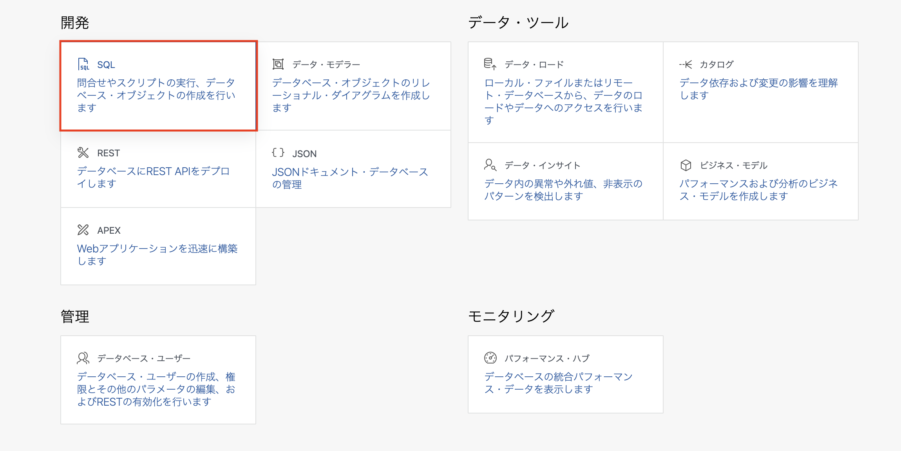
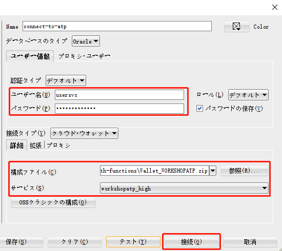
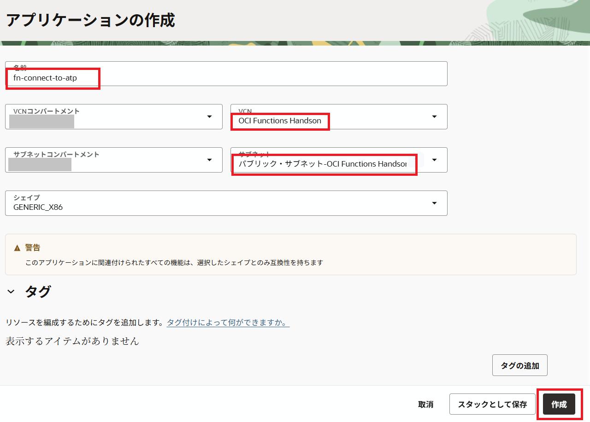

このセッションでは、Oracle FunctionsからORDS(Oracle REST Data Services)という仕組みを利用してATPに接続し、データを取得する方法について説明します。
ORDSはデフォルトでATPに組み込まれている仕組みです。


ATPはORDSを利用してRESTfulインターフェースでのアクセスを行うことができます。   ORDS(Oracle REST Data Services)の詳細については[Autonomous Databaseを使用したOracle REST Data Servicesの開発](https://docs.oracle.com/cd/E83857_01/paas/atp-cloud/atpug/ords-rest.html#GUID-3D237239-2239-45A1-A77D-1028CD18F83A)をご確認ください。 


このハンズオンが完了すると、以下のようなコンテンンツが出来上がります。


条件
----------------------

- クラウド環境
  - 有効なOracle Cloudアカウントがあること

- 事前環境構築
  - [Fn Projectハンズオン](/ocitutorials/cloud-native/fn-for-beginners/)が完了していること
  - [Oracle Functionsハンズオン](/ocitutorials/cloud-native/functions-for-beginners/)が完了していること
  - ローカル端末にSQL Developerがインストールされていること
    - ダウンロードは[こちら](https://www.oracle.com/tools/downloads/sqldev-downloads.html)から

1.事前準備
-------------------
ここでは、ATPのプロビジョニングとORDSの設定を行います。

### 1-1.ATPのプロビジョニング

OCIコンソールのハンバーガーメニューから[データベース]で、[Autonomous Transaction Processing]をクリックします。



Autonomous Databaseの作成画面で、使用するコンパートメントを選択して、「Autonomous Databaseの作成」をクリックします。



以下項目を入力して、「Autonomous Databaseの作成」をクリックします。

+ コンパートメント：使用するコンパートメントを選択
+ 表示名：表示名を入力。今回は、`Workshop ATP`
+ データベース名：今回は、`WORKSHOPATP`
+ ワークロード・タイプの選択：トランザクション処理
+ データベース・バージョンの選択：`19c`
+ ECPU数：`2`
+ ストレージ(GB)：`20`
+ 自動スケーリング：チェックをオフ
+ パスワード：パスワードを入力
+ パスワードの確認：再度パスワードを入力
+ ネットワーク・アクセスの選択：すべての場所からのセキュア・アクセス





しばらくすると、「利用可能」のステータスになります。  

次に、Autonomous Databaseの詳細の画面で、「データベース接続」をクリックします。


「ウォレットのダウンロード」をクリックします。



（セキュリティルールに準拠する任意の）ウォレットのパスワードを入力して、「ダウンロード」をクリックします。後でローカルのOracle SQL Developerで接続するときに使用します。



これで、ATPのプロビジョニングは完了です。

### 2-2.ORDSサービスのベースURLの取得

Autonomous Databaseの詳細の画面で、「ツール構成」をクリックします。

「Webアクセス(ORDS)」の枠にある「パブリック・アクセスURL」の「コピー」をクリックして、コピーされたURLをメモ帳に書き留めてください。  
これはORDSサービスのベースURL(`ords_base_url`)です。  
この値は後続の手順で使用するので、テキストエディタなどに保存しておきます。  


### 2-3.ORDSサービスの有効化

Autonomous Databaseの詳細の画面で、「データベース・アクション」「SQL」をクリックします。



以下のコマンドを入力して、「スクリプトの実行」(またはF5)をクリックして、新しいユーザーを作成します。

```sql
CREATE USER usersvc IDENTIFIED BY [PASSWORD];
```

今回は、
```sql
CREATE USER usersvc IDENTIFIED BY PasswOrd__8080;
```

とします。

ユーザー`usersvc`に対して、必要な権限を付与します。
```sql
GRANT "CONNECT" TO usersvc;
GRANT "RESOURCE" TO usersvc;
GRANT UNLIMITED TABLESPACE TO usersvc;
```

ローカルのOracle SQL Developerを開いて、ダウンロードしたWalletファイルを使用して、作成されたユーザー`usersvc`で接続します。




検証用のテーブル`users`を作成します。

```sql
CREATE TABLE users ( 
"ID"  VARCHAR2(32 BYTE) DEFAULT ON NULL sys_guid(), 
"FIRST_NAME"  VARCHAR2(50 BYTE) COLLATE "USING_NLS_COMP"
            NOT NULL ENABLE, 
"LAST_NAME"  VARCHAR2(50 BYTE) COLLATE "USING_NLS_COMP"
            NOT NULL ENABLE, 
"USERNAME"  VARCHAR2(50 BYTE) COLLATE "USING_NLS_COMP"
            NOT NULL ENABLE, 
"CREATED_ON"  TIMESTAMP(6) DEFAULT ON NULL current_timestamp, 
CONSTRAINT "USER_PK" PRIMARY KEY ( "ID" )
);
```

サンプルデータを登録します。

```sql
INSERT INTO users VALUES (
    '8C561D58E856DD25E0532010000AF462',
    'todd',
    'sharp',
    'tsharp',
    current_timestamp
);

INSERT INTO users VALUES (
    '8C561D58E858DD25E0532010000AF462',
    'jeff',
    'smith',
    'thatjeff',
    current_timestamp
);

COMMIT;
```

ここからは、ORDSに関する設定を行っていきます。  

作業するスキーマに対してRESTアクセスを有効にします。

```sql
BEGIN
    ords.enable_schema(
        p_enabled => true, 
        p_schema => 'USERSVC', 
        p_url_mapping_type => 'BASE_PATH', 
        p_url_mapping_pattern => 'usersvc',
        p_auto_rest_auth => true
    );

    COMMIT;
END;
```

呼び出しの認証トークンを生成できるように、必要な権限を作成します。  
今回はRoleにSQL Developerを利用します。

```sql
DECLARE
    l_roles     owa.vc_arr;
    l_modules   owa.vc_arr;
    l_patterns  owa.vc_arr;
BEGIN
    l_roles(1) := 'SQL Developer';
    l_patterns(1) := '/users/*';
    ords.define_privilege(
        p_privilege_name => 'rest_privilege',
        p_roles => l_roles, 
        p_patterns => l_patterns, 
        p_modules => l_modules,
        p_label => '',
        p_description => '', 
        p_comments => NULL
    );
    COMMIT;
END;
```

権限に関連付けられたOAuthクライアントを作成します。

```sql
BEGIN
    oauth.create_client( 
        p_name => '[Descriptive Name For Client]', 
        p_grant_type => 'client_credentials', 
        p_owner => '[Owner Name]', 
        p_description => '[Client Description]', 
        p_support_email => '[Email Address]',　
        p_privilege_names => 'rest_privilege'
    );

    COMMIT;
END;
```

今回は、

```sql
BEGIN
    oauth.create_client(
        p_name => 'Rest Client', 
        p_grant_type => 'client_credentials', 
        p_owner => 'USERSVC', 
        p_description => 'Rest Client',
        p_support_email => 'oracle@oracle.com',
        p_privilege_names => 'rest_privilege'
    );

    COMMIT;
END;
```

とします。

クライアントアプリケーション用にロールを作成し、権限を付与します。  
今回はRoleにSQL Developerを利用します。

```sql
BEGIN
    OAUTH.grant_client_role(
        p_client_name => 'Rest Client',
        p_role_name => 'SQL Developer'
    );
    COMMIT;
END;
```

これで、次のものを取得できます：`client_id`　`client_secret`

```sql
SELECT id, name, client_id, client_secret
FROM   user_ords_clients;
```

`client_id`および`client_secret`は、REST呼び出し用の認証トークンを生成するために使用します。  
これらの値については、後続の手順で使用するので、テキストエディタなどに保存しておいてください。  

次にテーブルへのORDSアクセスを有効にします。

```sql
BEGIN
    ords.enable_object(
        p_enabled => true, 
        p_schema => 'USERSVC', 
        p_object => 'USERS', 
        p_object_type => 'TABLE', 
        p_object_alias => 'users', 
        p_auto_rest_auth => false
    );
    COMMIT;
END;
```

今回は、以下のエンドポイントを作成して、`username`でユーザ情報を取得するよう定義します。

```sql
BEGIN
    ords.define_service(
        p_module_name => 'users', 
        p_base_path => 'users/', 
        p_pattern => 'user/:username', 
        p_method => 'GET', 
        p_source_type => ords.source_type_collection_item,
        p_source => 'SELECT id, username, first_name, last_name, created_on FROM users WHERE username = :username OFFSET 0 ROWS FETCH NEXT 1 ROWS ONLY');

    COMMIT;
END;
```

これで、ORDSサービスの設定は完了です。


3.Oracle Functionsの作成
-------------------
ここでは、Oracle Functionsの作成とデプロイを行います。

OCIコンソールのハンバーガーメニューをクリックして、「開発者サービス」に移動して、「ファンクション」をクリックします。

Oracle Functionsに使用する予定のリージョンを選択します（Fn Project CLIコンテキストで指定されたDockerレジストリと同じリージョンを推奨します）。  

Fn Project CLIコンテキストで指定されたコンパートメントを選択します。

「アプリケーションの作成」をクリックして、次を指定して、「作成」をクリックします。

+ 名前：このアプリケーションに最初のFunctionをデプロイし、Functionを呼び出すときにこのアプリケーションを指定。今回は、`fn-connect-to-atp`
+ VCN：Functionを実行するVCN。今回は、[Oracle Functionsハンズオン](/ocitutorials/cloud-native/functions-for-beginners/)で作成したVCNを指定。
+ サブネット：Functionを実行するサブネット。今回は、[Oracle Functionsハンズオン](/ocitutorials/cloud-native/functions-for-beginners/)で作成したVCNのパブリック・サブネットを指定。



[Oracle Functionsハンズオン](/ocitutorials/cloud-native/functions-for-beginners/)で利用したCloud Shellにログインします。  

デプロイ前にFunctionsを実行するために環境変数をいくつか設定します。

```
fn config app fn-connect-to-atp client_id [client_id]
```

+ `client_id`：クライアントID。2-3で取得した値を使用します

```
fn config app fn-connect-to-atp client_secret [client_secret]
```

+ `client_secret`：クライアントシークレット。[2-3.ORDSサービスの有効化](#2-3ordsサービスの有効化)で取得した値を使用します

```
fn config app fn-connect-to-atp ords_base_url [ords_base_url][p_url_mapping_pattern]
```

+ `ords_base_url`：ORDSサービスのベースURL。[2-3.ORDSサービスの有効化](#2-2ordsサービスのベースurlの取得)で取得した値を使用します
+ `p_url_mapping_pattern`：今回は、`usersvc`


機密情報を含む構成変数は、常に暗号化する必要があります。今回はシンプルな手順にするために特に暗号化は実施しませんが、実際に使用する場合は、[キー管理を使用する方法](https://blogs.oracle.com/developers/oracle-functions-using-key-management-to-encrypt-and-decrypt-configuration-variables)を確認してください。 


ワークショップ用のコンテンツをcloneし、ディレクトリに移動します。

```sh
git clone https://github.com/oracle-japan/connect-to-atp-with-functions.git
```

```sh
cd connect-to-atp-with-functions
```

以下のコマンドを実行して、`fn-connect-to-atp`というFunctionをデプロイします。

```sh
fn -v deploy --app fn-connect-to-atp
```

これで、Function作成とデプロイは完了です。

4.ATPへのアクセス確認  
-------------------
ここでは、デプロイしたFunctionsを利用してATPへのアクセス確認を行います。

今回は、Functionsにデータ検索条件としてユーザー名を渡して実行します。

```
echo -n "tsharp" | fn invoke fn-connect-to-atp fn-connect-to-atp
```

以下のような出力を得られます。

```
{"id":"8C561D58E856DD25E0532010000AF462","username":"tsharp","firstName":"todd","lastName":"sharp","createdOn":1586772847781}
```

これで、ORDSを利用してATPへのアクセスを行うことができました！  
お疲れ様でした！
