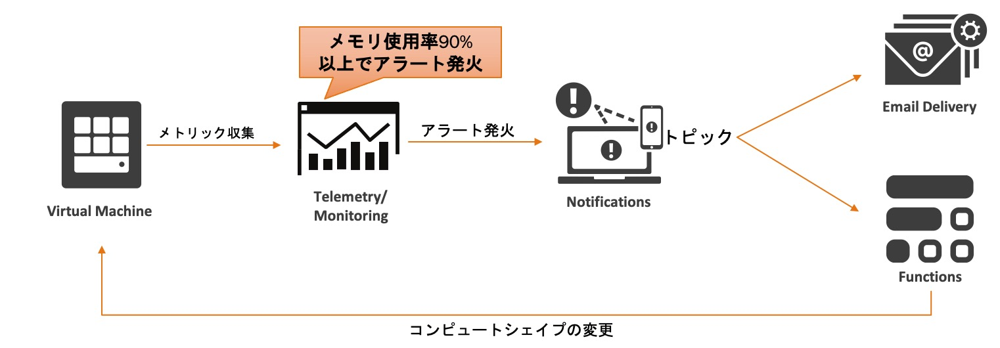
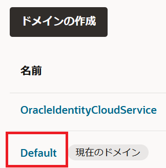
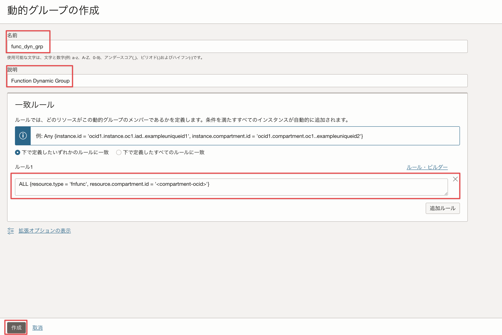
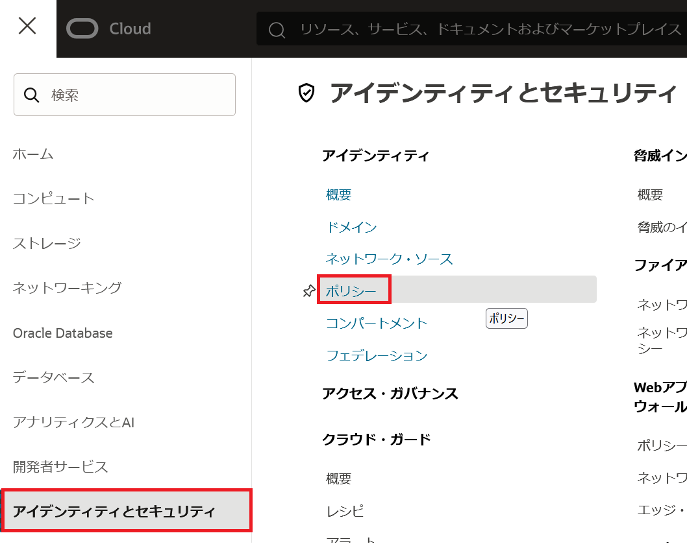
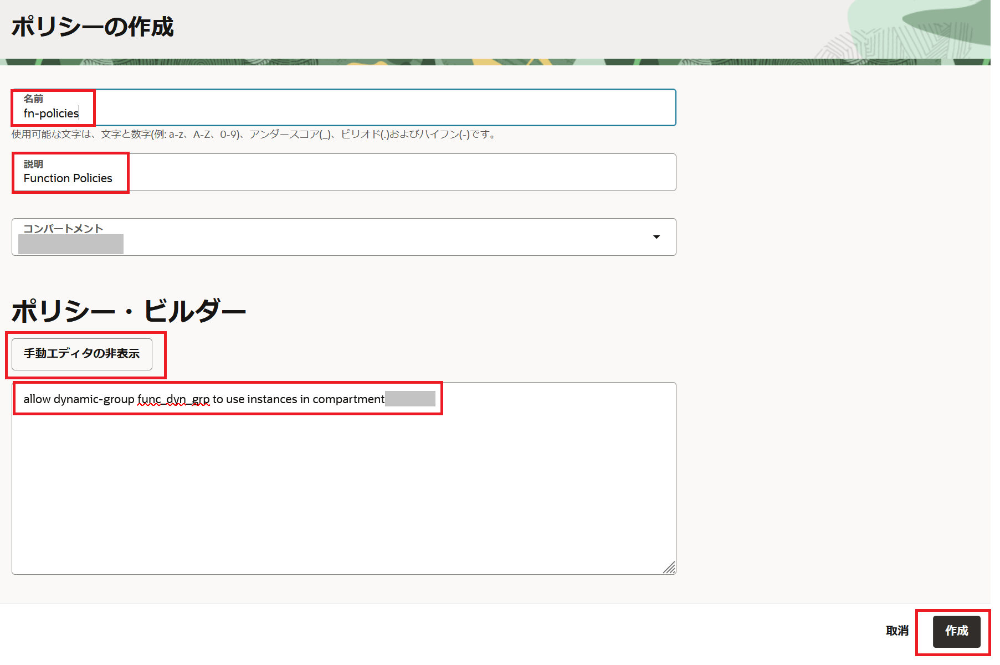
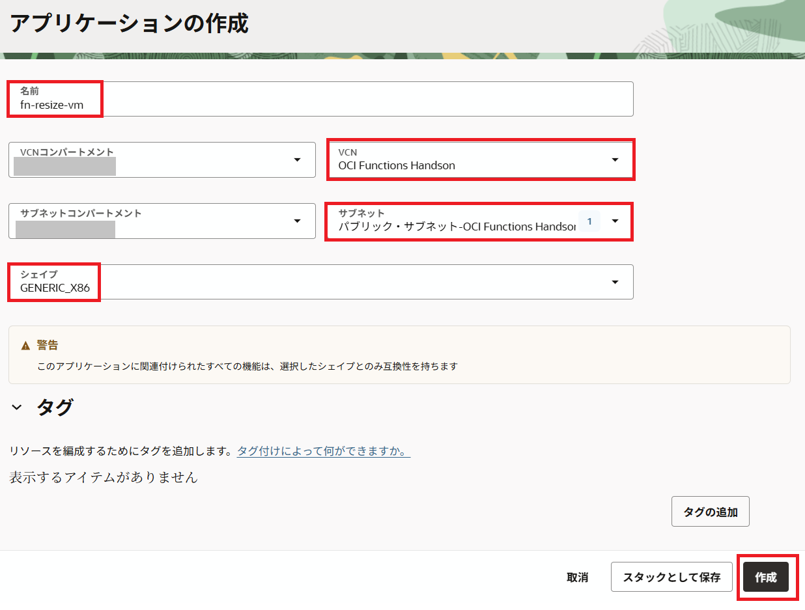
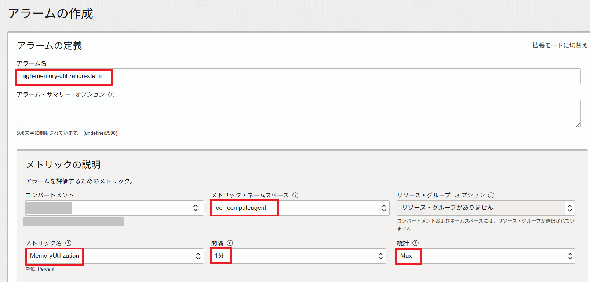
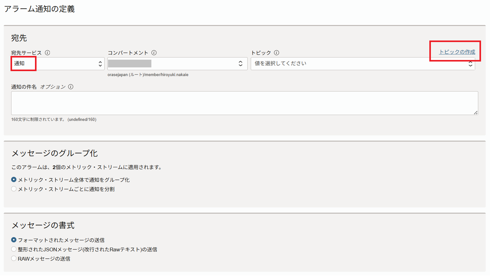
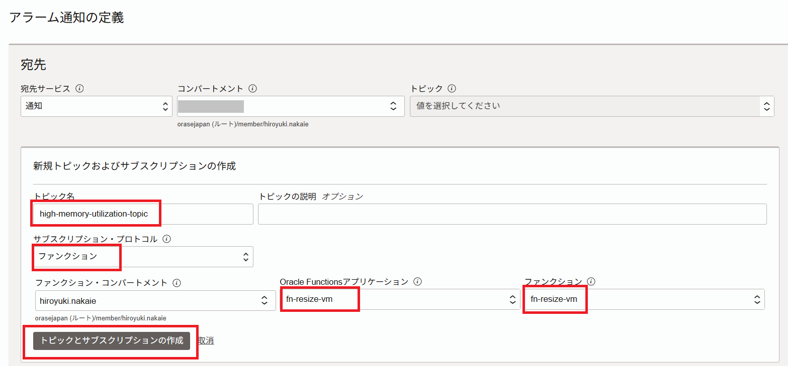
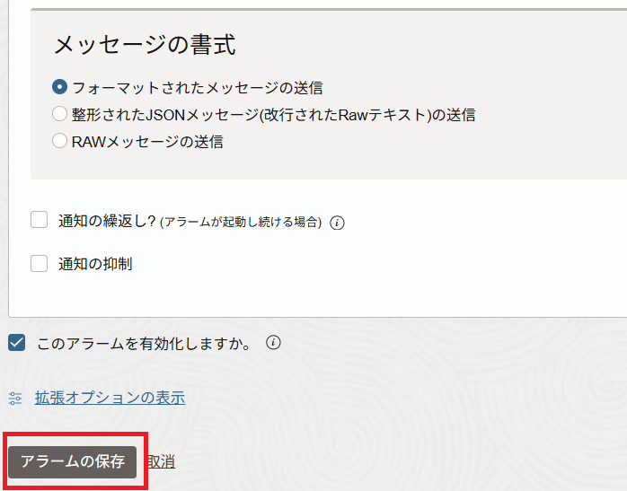

このハンズオンでは、想定したメモリ使用率を超える仮想マシン (VM) のシェイプをOCI Functionsを利用して動的に変更する手順を記載します。


このハンズオンでは、動作確認のために意図的にVMのメモリ使用率を上昇させるコマンドを使用します。そのため、商用環境などでは絶対に行わないでください。 また、使用する仮想マシン (VM) についてもテスト用として用意したものを使用するようにしてください。 


条件
----------------------

- クラウド環境
  - 有効なOracle Cloudアカウントがあること

- 事前環境構築
  - [Fn Projectハンズオン](/ocitutorials/cloud-native/fn-for-beginners/)が完了していること
  - [OCI Functionsハンズオン](/ocitutorials/cloud-native/functions-for-beginners/)が完了していること

このハンズオンが完了すると、以下のようなコンテンツが作成されます。



1.事前準備
-------------------

このステップでは、OCI Functionsから仮想マシン (VM) を操作するための動的グループとポリシーの設定を行います。


動的グループを使用すると、Oracle Cloud Infrastructureコンピュータ・インスタンスを(ユーザー・グループと同様に)プリンシパルのアクターとしてグループ化し、ポリシーを作成できます。  そうすることで、インスタンスがOracle Cloud Infrastructureサービスに対してAPIコールを実行できるようにします。 詳細は[動的グループの管理](https://docs.cloud.oracle.com/ja-jp/iaas/Content/Identity/Tasks/managingdynamicgroups.htm)をご確認ください。 


OCIコンソールのハンバーガーメニューをクリックして、`アイデンティティとセキュリティ`⇒`ドメイン`に移動します。


`Default `をクリックします。



画面左にある`アイデンティティ・ドメイン`の`動的グループ`をクリックします。


`動的グループの作成`をクリックします。


以下項目を入力して、「作成」をクリックします。

  - 名前：動的グループの名前。今回は、`func_dyn_grp`
  - 説明：動的グループの説明。今回は、`Function Dynamic Group`
  - ルール1：`ALL {resource.type = 'fnfunc', resource.compartment.id = '<compartment-ocid>'}`(compartment.idは各自で使用するコンパートメントOCIDへ変更してください。)



OCIコンソールのハンバーガーメニューをクリックして、`アイデンティティとセキュリティ`⇒`ポリシー`に移動します。



`ポリシーの作成`をクリックします。


以下項目を入力して、「作成」をクリックします。

  - 名前：ポリシーの名前。今回は、`fn-policies`
  
  - 説明：ポリシーの説明。今回は、たとえば、`Function Policies`

  - 手動エディタの表示：チェックを入れる
  
  - ポリシー・ビルダー：`allow dynamic-group func_dyn_grp to use instances in compartment xxxxxx`(compartment名は各自で使用するコンパートメント名へ変更してください。)	


[アイデンティティ]⇒[コンパートメント]に移動して、使用するコンパートメント(今回はルートコンパートメント)を開いて、該当OCIDを確認します。 

  


これで、動的グループの作成とポリシーの作成は完了しました。

2.OCI Functionsの作成  
-------------------

このステップでは、仮想マシン (VM) のシェイプを変更するOCI Functionsのデプロイを行います。

OCIコンソールのハンバーガーメニューをクリックして、`開発者サービス`の`ファンクション`をクリックします。

`アプリケーションの作成`をクリックして、次を指定して、「作成」をクリックします。

+ 名前：アプリケーション名を指定。今回は、`fn-resize-vm`
+ VCN：Functionを実行するVCNを指定。今回は、[OCI Functionsことはじめ](/ocitutorials/cloud-native/functions-for-beginners/)で作成したVCNを指定。
+ サブネット：Functionを実行するサブネット。今回は、[OCI Functionsことはじめ](/ocitutorials/cloud-native/functions-for-beginners/)で作成したVCNのサブネットを指定。
+ Shape: FunctionsのCPUアーキテクチャを指定。今回は、`GENERIC_X86`



[OCI Functionsことはじめ](/ocitutorials/cloud-native/functions-for-beginners/)で利用したCloud Shellにログインします。

ワークショップ用のコンテンツをクローニングします。

```sh
git clone https://github.com/oracle-japan/functions_resize_vmshape.git
```

```sh
cd functions_resize_vmshape/fn-resize-vm
```

次を入力して、`fn-resize-vm`というPython言語で作成されたFunctionをデプロイします。

```sh
fn -v deploy --app fn-resize-vm
```

これで、Function作成とデプロイは完了しました。


3.アラームの作成
-------------------

このステップでは、OCIコンソールを使用してアラームを作成していきます。

OCIコンソールハンバーガーメニューを開きます。`監視および管理`で、`アラーム定義`をクリックします。


`アラームの作成`をクリックします。


以下のパラメータを入力します。

- アラーム名：アラーム名を指定。今回は`high-memory-utilization-alarm`

- メトリックの説明:

    - コンパートメント: ご自身のコンパートメントを指定。今回はルートコンパートメントを指定。

    - メトリック・ネームスペース: `oci_computeagent`

    - メトリック名:`MemoryUtilization`(メモリ使用率)

    - 間隔:`1m`

    - 統計:`Max`(最大)

    

- トリガールール:

    - 演算子:`greater than`

    - 値:`90`

    - トリガー遅延分数 :`1`


「アラーム通知の定義」の「宛先」にファンクションを選択します。

   - 宛先サービス:「通知」

   - コンパートメント: ご自身のコンパートメントを指定。今回はルートコンパートメントを指定。

   - トピック: `トピックの作成`をクリック

     
     トピックとファンクションを既に作成している場合は、新しいトピックを作成する代わりに、ここでそのトピックを選択できます。
     
   - トピック名: `high-memory-utilization-topic`
     
     - サブスクリプションプロトコル:ファンクション
     
     - ファンクション・コンパートメント: ルートコンパートメントを指定。
     
     - ファンクション・アプリケーション: `fn-resize-vm`
     
     - ファンクション: `fn-resize-vm`

`トピックとサブスクリプションの作成`をクリックします。



「アラーム通知の定義」から作成されたトピックを選択して、`アラームの保存`をクリックします。

   


Notificationサービスはファンクションや電子メールの他にもHTTPS(カスタムURL)/PagerDuty/Slackに対する通知を行うことができます。 


これで、アラームの作成は完了です。

4.仮想マシン (VM) のメモリ使用率の延伸  
-------------------

このステップでは、[Fn Projectハンズオン](/ocitutorials/cloud-native/fn-for-beginners/)で作成したコンピュートインスタンスを利用して動作確認を行います。

現在VMのシェイプを確認します。例えば、以下の例では現状のスペックが`1 OCPU/16GB RAM`になっています。


以下のコマンドをコンピュートインスタンス上で実行し、メモリ使用率を徐々にあげていきます。

```
/dev/null < $(yes) &
```

以下のように10プロセス程度をバックグランド実行で起動します。
```
[opc@instance]$ 
[opc@instance]$ /dev/null < $(yes) &
[1] 2370
[opc@instance]$ /dev/null < $(yes) &
[2] 2372
[opc@instance]$ /dev/null < $(yes) &
[3] 2374
[opc@instance]$ /dev/null < $(yes) &
[4] 2376
[opc@instance]$ /dev/null < $(yes) &
[5] 2378
[opc@instance]$ /dev/null < $(yes) &
[6] 2380
[opc@instance]$ /dev/null < $(yes) &
[7] 2382
[opc@instance]$ /dev/null < $(yes) &
[8] 2384
[opc@instance]$ /dev/null < $(yes) &
[9] 2387
[opc@instance]$ /dev/null < $(yes) &
[10] 2389
[opc@instance]$ 
```

以下のコマンドを実行し、メモリ使用率を確認しましょう。
3秒間隔で表示されますが、徐々に空きメモリが減っていくことが確認できます。

```
free -h -s 3 
```

```
              total        used        free      shared  buff/cache   available
Mem:            14G        5.5G        8.6G         16M        288M        8.7G
Swap:          8.0G          0B        8.0G

              total        used        free      shared  buff/cache   available
Mem:            14G        5.6G        8.5G         16M        288M        8.5G
Swap:          8.0G          0B        8.0G

              total        used        free      shared  buff/cache   available
Mem:            14G        5.7G        8.4G         16M        288M        8.5G
Swap:          8.0G          0B        8.0G

              total        used        free      shared  buff/cache   available
Mem:            14G        5.8G        8.3G         16M        288M        8.3G
Swap:          8.0G          0B        8.0G

              total        used        free      shared  buff/cache   available
Mem:            14G        5.9G        8.2G         16M        288M        8.2G
Swap:          8.0G          0B        8.0G

              total        used        free      shared  buff/cache   available
Mem:            14G        6.0G        8.1G         16M        288M        8.1G
Swap:          8.0G          0B        8.0G

              total        used        free      shared  buff/cache   available
Mem:            14G        6.1G        8.0G         16M        288M        8.0G
Swap:          8.0G          0B        8.0G

              total        used        free      shared  buff/cache   available
Mem:            14G        6.3G        7.9G         16M        288M        7.9G
Swap:          8.0G          0B        8.0G

              total        used        free      shared  buff/cache   available
Mem:            14G        6.4G        7.8G         16M        288M        7.8G
Swap:          8.0G          0B        8.0G

              total        used        free      shared  buff/cache   available
Mem:            14G        6.5G        7.6G         16M        288M        7.7G
Swap:          8.0G          0B        8.0G
```

5分～10分程度経つと、メモリ使用率が90%を超えるとFunctionが呼び出され、VMを再起動します。

その後、Functionにより`1 OCPU/1GB RAM`スケールアップされたVMが起動されます。(10程度かかります)

これで、OCI Functionsを使用して、VMシェイプの変更に成功しました！

お疲れ様でした！
