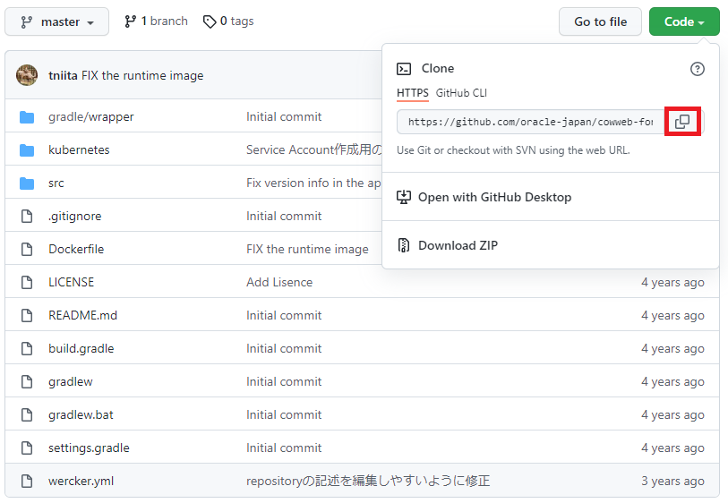

Oracle Container Engine for Kubernetes（以下 OKE）は、Oracle のマネージド Kubernetes サービスです。  
このハンズオンでは、OKE にサンプルアプリケーションをデプロイするプロセスを通して、Kubernetes そのものの基本的な操作方法や特徴を学ぶことができます。

このカテゴリには以下のサービスが含まれます。

- Oracle Container Engine for Kubernetes (OKE):
  : フルマネージドな Kuberentes クラスターを提供するクラウドサービスです。
- Oracle Cloud Infrastructure Registry (OCIR):
  : フルマネージドな Docker v2 標準対応のコンテナレジストリを提供するサービスです。

## 前提条件

- クラウド環境
  _ Oracle Cloud のアカウントを取得済みであること
  _ [OKE ハンズオン事前準備](/ocitutorials/cloud-native/oke-for-commons/)を実施済みであること

  1.コンテナイメージの作成

---

ここでは、サンプルアプリケーションが動作するコンテナイメージを作成します。

### 1.1. ソースコードを Clone する

今回利用するサンプルアプリケーションは、oracle-japan の GitHub アカウント配下のリポジトリとして作成してあります。

[サンプルアプリケーションのリポジトリ](https://github.com/oracle-japan/cowweb-for-wercker-demo)にアクセスして、`Code`ボタンをクリックします。

ソースコードを取得する方法は 2 つあります。一つは git のクライアントで Clone する方法、もう一つは ZIP ファイル形式でダウンロードする方法です。ここでは前者の手順を行いますので、展開した吹き出し型のダイアログで、URL の文字列の右側にあるクリップボード型のアイコンをクリックします。

これにより、クリップボードに URL がコピーされます。



Cloud Shell または Linux のコンソールから、以下のコマンドを実行してソースコードを Clone します。

    git clone [コピーしたリポジトリのURL]

続いて、Clone してできたディレクトリをカレントディレクトリにしておきます。

    cd cowweb-for-wercker-demo

### 1.2. コンテナイメージを作る

コンテナイメージは、Dockerfile と呼ばれるコンテナの構成を記述したファイルによって、その内容が定義されます。

サンプルアプリケーションのコードには作成済みの Dockerfile が含まれていますので、その内容を確認してみます。以下のコマンドを実行してください。

    cat Dockerfile

```dockerfile
# 1st stage, build the app
FROM maven:3.8.4-openjdk-17-slim as build

WORKDIR /helidon

# Create a first layer to cache the "Maven World" in the local repository.
# Incremental docker builds will always resume after that, unless you update
# the pom
ADD pom.xml .
RUN mvn package -Dmaven.test.skip -Declipselink.weave.skip

# Do the Maven build!
# Incremental docker builds will resume here when you change sources
ADD src src
RUN mvn package -DskipTests

RUN echo "done!"

# 2nd stage, build the runtime image
FROM openjdk:17-jdk-slim
WORKDIR /helidon

# Copy the binary built in the 1st stage
COPY --from=build /helidon/target/cowweb-helidon.jar ./
COPY --from=build /helidon/target/libs ./libs

CMD ["java", "-jar", "cowweb-helidon.jar"]

EXPOSE 8080
```

Dockerfile の内容を見ると、FROM で始まる行が 2 つあることがわかります。最初の FROM から始まる数行は、jdk がインストールされたコンテナイメージ内にサンプルアプリケーションのコードをコピーし、さらに`mvn package`を実行してアプリをビルドしています。

次の FROM から続く一連の処理は、jdk がインストールされたコンテナイメージを基に、アプリの実行ユーザーの作成、ビルドしてできた jar ファイルのコピー、コンテナ起動時に実行するコマンドの設定などを行っています。

それではこの Dockerfile を使ってコンテナイメージを作成します。以下のコマンドを実行してください。

    docker image build -t [リポジトリ名]/cowweb:v1.0 .


`docker image build`コマンドを実行した際に、`container-registry.oracle.com`と`docker.io`のどちらからイメージをダウンロードするかを選択するよう求められる場合があります。この場合は、`docker.io`を選択するようにしてください。


このコマンドにおいて`リポジトリ名`には任意の文字列を指定できますが、通常はプロジェクト名やユーザー名などを小文字にしたものを指定します。例えば、以下のようなコマンドになります。

    docker image build -t oke-handson/cowweb:v1.0 .

以下のように、`Successfully tagged`のメッセージで処理が終了していれば、イメージのビルドは完了です。

```
Sending build context to Docker daemon  128.5kB
Step 1/13 : FROM maven:3.8.4-openjdk-17-slim as build
Trying to pull repository docker.io/library/maven ...
3.8.4-openjdk-17-slim: Pulling from docker.io/library/maven
f7a1c6dad281: Pull complete
ea8366d5a4a5: Pull complete
bff4abe573cd: Pull complete
3f92e41bef06: Pull complete
6581ea1ec5a5: Pull complete
de879b0c951f: Pull complete
ac1236d673e3: Pull complete
Digest: sha256:150deb7b386bad685dcf0c781b9b9023a25896087b637c069a50c8019cab86f8
Status: Downloaded newer image for maven:3.8.4-openjdk-17-slim
 ---> 849a2a2d4242
Step 2/13 : WORKDIR /helidon
 ---> Running in 503337c170c7
Removing intermediate container 503337c170c7
 ---> e456a937870a
Step 3/13 : ADD pom.xml .
 ---> fadb77529253
Step 4/13 : RUN mvn package -Dmaven.test.skip -Declipselink.weave.skip
 ---> Running in 190344b19870

...（中略）...

Step 9/13 : WORKDIR /helidon
 ---> Running in ede9941ef284
Removing intermediate container ede9941ef284
 ---> ed9214bcc7e8
Step 10/13 : COPY --from=build /helidon/target/cowweb-helidon.jar ./
 ---> 72e6abc15a88
Step 11/13 : COPY --from=build /helidon/target/libs ./libs
 ---> 039c2d539641
Step 12/13 : CMD ["java", "-jar", "cowweb-helidon.jar"]
 ---> Running in b579e0845ce9
Removing intermediate container b579e0845ce9
 ---> 9344c0c557ac
Step 13/13 : EXPOSE 8080
 ---> Running in d19e9f20932b
Removing intermediate container d19e9f20932b
 ---> 5e997bb463db
Successfully built 5e997bb463db
Successfully tagged oke-handson/cowweb:v1.0
```

実際にビルドされたイメージは、`docker image ls`コマンドで確認することができます。

    docker image ls

```
REPOSITORY           TAG                     IMAGE ID            CREATED             SIZE
oke-handson/cowweb   v1.0                    a328bfaffb52        4 minutes ago       428MB
<none>               <none>                  042346419526        5 minutes ago       505MB
openjdk              17-jdk-slim             37cb44321d04        4 months ago        408MB
maven                3.8.4-openjdk-17-slim   849a2a2d4242        5 months ago        425MB
```

`oke-handson/cowweb`の名前のイメージが作成されていることがわかります。

アプリケーションのコンテナイメージは、ソースコードのビルドには maven がインストールされたコンテナを利用し、アプリケーションの実行環境には openjdk がインストールされたコンテナを利用しています。このため、maven や openjdk といった名前のついたイメージも表示されます。

これらのコンテナは、アプリケーションのコンテナイメージの作成時に、自動的にダウンロードされて利用されています。

## 2.OCIR へのプッシュと OKE へのデプロイ

### 2.1. OCIR を利用するための事前準備

OCIR は Oracle が提供するコンテナレジストリのマネージドサービスです。ここでは、1.3.で作成したコンテナイメージを OCIR にプッシュ（アップロード）します。

OCIR に docker コマンドからアクセスするため、OCI のユーザーアカウントに必要な設定をしていきます。

OCI コンソール画面右上の人型のアイコンをクリックし、展開したプロファイルからユーザ名(oracleidentitycloudservice/<ユーザ名>)をクリックします。


タブの中にある`トークンおよびキー`をクリックして、トークンの作成画面に遷移します。


`トークンの生成`ボタンをクリックします。


[Geterate Token]ダイアログで、トークンの用途を説明する情報（任意の文字列）を入力し、`トークンの生成`ボタンをクリックします。


ダイアログに生成したトークンが表示されます。右側の３点ドットクリックして表示されるメニューの中から、`コピー`をクリックするとトークンの内容がクリップボードに保存されます。その後、`閉じる`をクリックします。


このトークンはあとの手順で利用するため、テキストエディタ等にペーストするなどして控えておいてください。

### 2.2. OCIR にリポジトリを作成

OCIR にビルドしたコンテナイメージを格納するリポジトリを作成します。  
ハンバーガーメニューから、「開発者サービス」-「コンテナ・レジストリ」を選択します。


左メニューにあるコンパートメントのプルダウンメニューから対象のコンパートメントを選択します。


「リポジトリの作成」ボタンをクリックします。


以下の設定を行い、「リポジトリの作成」ボタンをクリックします。

- コンパートメント：対象のコンパートメント
- リポジトリ名：oke-handson/cowweb
- アクセス：パブリック


OCIR のリポジトリ名はテナンシで一意になります。 集合ハンズオンなど複数人で同一環境を共有されている皆様は、`oke-handson-01/cowweb`や`oke-handson-tn/cowweb`などの名前のイニシャルを付与し、名前が重複しないようにしてください。



リストに作成したリポジトリがあることを確認します。


### 2.3. OCIR にコンテナイメージをプッシュする

それでは、コンテナイメージを OCIR にプッシュします。

まず、`docker login`コマンドで OCIR にログインします。ログイン先のレジストリを指定するにあたり、ホストされているデータセンターリージョンに合わせて適切なリージョンコードを指定する必要があります。

ご自身の環境に合わせて、下表から適切なリージョンコードを見つけてください。

| リージョン     | リージョンコード |
| -------------- | ---------------- |
| ap-tokyo-1     | nrt              |
| ap-osaka-1     | kix              |
| ap-melbourne-1 | mel              |
| us-ashburn-1   | iad              |
| us-phoenix-1   | phx              |
| ap-mumbai-1    | bom              |
| ap-seoul-1     | icn              |
| ap-sydney-1    | syd              |
| ca-toronto-1   | yyz              |
| ca-montreal-1  | yul              |
| eu-frankfurt-1 | fra              |
| eu-zurich-1    | zrh              |
| sa-saopaulo-1  | gru              |
| uk-london-1    | lhr              |
| sa-santiago-1  | scl              |
| ap-hyderabad-1 | hyd              |
| eu-amsterdam-1 | ams              |
| me-jeddah-1    | jed              |
| ap-chuncheon-1 | yny              |
| me-dubai-1     | dxb              |
| uk-cardiff-1   | cwl              |
| us-sanjose-1   | sjc              |

次に、OCIR にログインするためにオブジェクト・ストレージ・ネームスペースを確認します。

オブジェクト・ストレージ・ネームスペースは、OCI コンソール画面右上の人型のアイコンをクリックし、展開したプロファイルからテナンシ:<テナンシ名>から確認します。


テナンシ情報のオブジェクト・ストレージ設定からオブジェクト・ストレージ・ネームスペースの値を確認します。OCIR へのアクセスする際に使用するため、値をテキストファイルにコピー＆ペーストするなどして控えておいてください。



オブジェクト・ストレージ・ネームスペースはテナントに対し 1 つ割り当てられます。リージョン内のすべてのコンパートメントにまたがり使用されます。任意の文字列が設定され、変更することはできません。


次に、以下のコマンドで OCIR にログインします。

    docker login [リージョンコード].ocir.io

例えば、東京リージョン(nrt)をご利用の場合は、以下のコマンドでログインします。

    docker login nrt.ocir.io

ユーザー名、パスワードの入力を求めるメッセージが表示されますので、以下のように入力してください。

- ユーザー名: [オブジェクト・ストレージ・ネームスペース]/[ユーザー名] （例: nrzftilbveen/oracleidentitycloudservice/yoi.naka.0106@gmail.com）
- パスワード: [2.1.で作成したトークン文字列]


ここで入力するパスワードは OCI コンソールにログインする際のパスワードとは異なるのでご注意ください


以下のように`Login Succeeded`というメッセージが表示されれば、ログイン成功です。

```
Username: nrzftilbveen/Handson-001
Password:
Login Succeeded
```

続いて、OCIR の形式に合わせてコンテナイメージのタグを更新します。`docker tag`コマンドを実行してくさい。

    docker image tag [リポジトリ名]/cowweb:v1.0 [リージョンコード].ocir.io/オブジェクト・ストレージ・ネームスペース]/[リポジトリ名]/cowweb:v1.0

[リージョンコード]と[オブジェクト・ストレージ・ネームスペース]は、これまでの手順で指定したものと同じものを指定します。リポジトリ名には`docker build`のときにしてしたものと同じ文字列を指定してください。

例えば、以下のように指定します。

    docker image tag oke-handson/cowweb:v1.0 nrt.ocir.io/nrzftilbveen/oke-handson/cowweb:v1.0

この操作によって、コンテナイメージにプッシュ先のレジストリを指定する情報を追加しています。これを行わない場合、コンテナイメージはデフォルトのレジストリが指定されたものとみなされ、Docker 社が提供する Docker Hub というレジストリが利用されてしまいます。

これで準備が整いましたので、実際に OCIR にイメージをプッシュします。以下のコマンドを実行してください。

    docker image push [リージョンコード].ocir.io/[オブジェクト・ストレージ・ネームスペース]/[リポジトリ名]/cowweb:v1.0

例えば、以下のように指定します。

    docker image push nrt.ocir.io/nrzftilbveen/oke-handson/cowweb:v1.0

以下のような実行結果となれば、プッシュが成功しています。

```
The push refers to repository [nrt.ocir.io/nrzftilbveen/oke-handson/cowweb]
d07a2053e8fb: Pushed
93ed7a751af8: Pushed
20dd87a4c2ab: Pushed
78075328e0da: Pushed
9f8566ee5135: Pushed
v1.0: digest: sha256:5769c194f3861f71c9fd43eb763813676aaba0b41acf453fb6a09a1af7525c82 size: 1367
```


集合ハンズオンなどで、コンテナレジストリを複数のユーザーで共有している場合、以下のようなメッセージとなることがあります。

```sh
60dc38cb0cd5: Layer already exists
ea75a4331573: Layer already exists
20dd87a4c2ab: Layer already exists
…
```

これは既にレジストリに存在するものと同じ内容をアップロードしたときに表示されるものですので、手順をそのまま続行して問題ありません。


それでは、OCIR にコンテナが保存されていることを確認してみましょう。OCI コンソールの画面で左上のメニューを展開し、`開発者サービス`－`コンテナ・レジストリ`をクリックします。


リポジトリの一覧が表示されます。この中に、指定した名前のコンテナがあることを確認してください。


これでレジストリへのコンテナイメージの格納は完了しました。
以上で、OCIR へのコンテナイメージの格納は完了です。

### 2.4. OKE へのデプロイ

それでは、いよいよ OKE クラスターにアプリケーションのコンテナをデプロイします。

OKE を始めとして、Kubernetes のクラスターにコンテナをデプロイするには、クラスター上の配置情報を manifest と呼ばれるファイルに記述しておく必要があります。

サンプルアプリケーションのコードには作成済みの manifest ファイルが含まれていますので、その内容を確認してみます。以下のコマンドを実行してください。

```
cat ./kubernetes/cowweb.yaml
```

```sh
kind: Deployment
apiVersion: apps/v1
metadata:
  name: cowweb
spec:
  replicas: 2
  selector:
    matchLabels:
      app: cowweb
  template:
    metadata:
      labels:
        app: cowweb
        version: v1
    spec:
      containers:
        - name: cowweb
          image: ${region-code}.ocir.io/${tenancy}/${repository}/cowweb:v1.0
          imagePullPolicy: IfNotPresent
          ports:
            - name: api
              containerPort: 8080
    ...（以下略）...
```

このファイルによって、サンプルアプリケーションのコンテナが、クラスター上にどのように配置されるかが定義されています。例えば、6 行目にある`replicas:2`という記述は、このコンテナが、2 つ立ち上げられて冗長構成を取るということを意味しています。


実際に Kubernetes 上でコンテナが動作する際には、Pod と言われる管理単位に内包される形で実行されます。上記の manifest では、サンプルアプリのコンテナを内包する Pod が、2 つデプロイされることになります。


22 行目には、実際にクラスター上で動かすコンテナイメージが指定されています。現在の記述内容は、ご自身環境に合わせた記述にはなっていませんので、この部分を正しい値に修正してください。具体的には、2.2.で`docker image push`コマンドを実行する際に指定した文字列と同じ内容に修正してください。

    [リージョンコード].ocir.io/[オブジェクト・ストレージ・ネームスペース]/[リポジトリ名]/cowweb:v1.0

例えば、以下のような文字列となります。

    nrt.ocir.io/nrzftilbveen/oke-handson/cowweb:v1.0

次に、cowweb-service.yaml という manifest ファイルの内容を確認してみます。

```
cat ./kubernetes/cowweb-service.yaml
```

```sh
kind: Service
apiVersion: v1
metadata:
  name: cowweb
  labels:
    app: cowweb
  annotations:
    oci.oraclecloud.com/load-balancer-type: "lb"
    service.beta.kubernetes.io/oci-load-balancer-shape: "flexible"
    service.beta.kubernetes.io/oci-load-balancer-shape-flex-min: "10"
    service.beta.kubernetes.io/oci-load-balancer-shape-flex-max: "30"
spec:
  type: LoadBalancer
  selector:
    app: cowweb
  ports:
    - port: 80
      targetPort: 8080
      name: http
```

この manifest ファイルは、クラスターに対するリクエストのトラフィックを受け付ける際のルールを定義しています。`type: LoadBalancer`という記述は、クラスターがホストされているクラウドサービスのロードバランサーを自動プロビジョニングし、その LB に来たトラフィックをコンテナに届けるという意味です。

それでは、Kubernetes 上でサンプルアプリケーションのコンテナを動かしてみます。まずは、クラスターを区画に分けて管理するための領域である、namespace を作成します。以下のコマンドで、namespace 名は任意の文字列を指定できます。  
今回は"handson"という namespace 名で作成します。

    kubectl create namespace handson

デフォルトの Namespace を上記で作成したものに変更しておきます。これを行うと、以降、kubectl の実行の度に Namespace を指定する必要がなくなります。

    kubectl config set-context $(kubectl config current-context) --namespace=handson

次に、manifest ファイルをクラスターに適用し、Pod や Service をクラスター内に作成します。

```
kubectl apply -f ./kubernetes/cowweb.yaml
```

```
kubectl apply -f ./kubernetes/cowweb-service.yaml
```

以下のコマンドを実行して、リソースの構成が完了しているかどうかを確認することができます。

    kubectl get pod,service

すべての Pod の STATUS が Runnig であることと、cowweb という名前の Service があることが確認できれば、リソースの作成は完了です（Service の EXTERNAL-IP は、ロードバランサーが実際に作成されるまで表示されません。その場合は少し時間を置いて上記コマンドを再実行してください）。

```
NAME                          READY   STATUS    RESTARTS   AGE
pod/cowweb-695c65b665-sgcdk   1/1     Running   0          17s
pod/cowweb-695c65b665-vh825   1/1     Running   0          17s

NAME                 TYPE           CLUSTER-IP      EXTERNAL-IP       PORT(S)        AGE
service/cowweb       LoadBalancer   10.96.229.191   130.***.***.***   80:30975/TCP   1m
```


集合ハンズオンなどで、一つのクラウド環境を複数のユーザーで共有している場合、利用可能なロードバランサー数の上限に達して正常に Service が作成できない場合があります。  
そのような場合は、ロードバランサーのシェイプ（対応可能なトラフィック量）を変更して、サービスの作成を行ってみてください。
具体的には以下のコマンドを実行します。

```sh
# 作ってしまったServiceを削除
kubectl delete -f ./kubernetes/cowweb-service.yaml
```

これは既にレジストリに存在するものと同じ内容をアップロードしたときに表示されるものですので、手順をそのまま続行して問題ありません。



実際に Kubernetes 上でコンテナが動作する際には、Pod と言われる管理単位に内包される形で実行されます。上記の manifest では、サンプルアプリのコンテナを内包する Pod が、2 つデプロイされることになります。


上の例では、IP アドレス 130.**_._**.\*\*\*の 80 番ポートでロードバランサーが公開されておりここにリクエストを送信すると、アプリケーションにアクセスできることを意味しています。この IP アドレスをテキストエディタ等に控えておいてください。

これでクラスターへのデプロイは完了しましたので、実際に動作確認してみます。以下のコマンドを実行してください。

    curl "http://[ロードバランサーのIP]/cowsay/say"

ローカルで動作確認したときと同様、以下のようなアスキーアートが表示されれば、アプリケーションが正常に動作しています。

```
 ______
< Moo! >
 ------
        \   ^__^
         \  (oo)\_______
            (__)\       )\/\
                ||--WWW |
                ||     ||
```

おめでとうございます。これで、OKE クラスターで実際にアプリケーションを動かすことができました！

## 3.Kubernetes 上のオブジェクトの確認

ここからは、先ほどデプロイしたサンプルアプリケーションを利用して Kubernetes 上のオブジェクトを確認しながら、Kubernetes の基本的な特徴をみていきます。  
まずは、Depoyment からです。

### 3.1. Deployment オブジェクトの確認

Deployment は、Pod のレプリカ数（冗長構成での Pod の数）や、Pod が内包するコンテナの指定など、動作させたいコンテナに関連する構成情報を定義するオブジェクトです。  
ここまでの手順で、Deployment オブジェクトをクラスター上に作成済みであり、その事によって、サンプルアプリケーションがクラスタで動作しています。

では、Deployment オブジェクトの情報を確認してみましょう。クラスターに存在する Deployment の一覧を取得するには以下のコマンドを実行します。

```
kubectl get deployments
```

```
NAME     READY   UP-TO-DATE   AVAILABLE   AGE
cowweb   2/2     2            2           3m53s
```

先に作成した cowweb という名前の Deployment があることがわかります。DESISRED, CURRENT などの値が 2 となっているのは、2 つの Pod を動かすように指定しており、その指定通りに Pod が可動していることを表しています。

この Deployment の情報をもっと詳しく調べるには、以下のコマンドを実行します。

```
kubectl describe deployments/cowweb
```

```
Name:               cowweb
Namespace:          handson-030
CreationTimestamp:  Thu, 31 Jan 2019 17:34:44 +0000
Labels:             <none>
Annotations:        deployment.kubernetes.io/revision: 1
...（中略）...
NewReplicaSet:   cowweb-57885b669c (2/2 replicas created
Events:
  Type    Reason             Age   From                   Messag
  ----    ------             ----  ----                   ------
  Normal  ScalingReplicaSet  23m   deployment-controller  Scaled up replica set cowweb-57885b669c to 2
```

この Deployment に関する様々な情報が表示されますが、特によく参照するのは、最後の Events 以下に表示される内容です。

これは、この Pod にまつわって発生した過去のイベントが記録されているもので、Pod が正常に起動しなかったときなど、特にトラブルシュートの場面で手がかりとなる情報を得るのに役立ちます。

### 3.2. Pod の標準出力の表示

ここからは、Pod オブジェクトについてみていきます。  
まず、Pod の情報を標準出力を表示するなどして確認してみます。  
Kubernetes 上で動作するアプリケーションの動作状況を確認する上で最もシンプルな方法は、Pod の標準出力確認することです。Pod の標準出力を表示するには、以下のコマンドを実行します。

    kubectl logs [Pod名]

ここで指定する Pod 名は、Pod の一覧を表示して表示される 2 つの Pod のうちのどちらかを指定してください。

```
kubectl get pods
```

```
NAME                      READY   STATUS    RESTARTS   AGE
cowweb-57885b669c-9dzg4   1/1     Running   0          43m
cowweb-57885b669c-r7l4g   1/1     Running   0          43m
```

この場合、例えば以下のようなコマンドとなります。

```
kubectl logs cowweb-57885b669c-9dzg4
```

```
...（中略）...
2022.08.25 05:09:44 INFO com.oracle.jp.cowweb.CowsayResource Thread[helidon-server-1,5,server]: I'm working...

2022.08.25 05:09:44 INFO com.oracle.jp.cowweb.CowsayResource Thread[helidon-server-2,5,server]: I'm working...

2022.08.25 05:09:49 INFO com.oracle.jp.cowweb.CowsayResource Thread[helidon-server-3,5,server]: I'm working...

2022.08.25 05:09:49 INFO com.oracle.jp.cowweb.CowsayResource Thread[helidon-server-4,5,server]: I'm working...

2022.08.25 05:09:54 INFO com.oracle.jp.cowweb.CowsayResource Thread[helidon-server-1,5,server]: I'm working...
```

これが、Pod の標準出力の内容を表示した結果です。Kubernetes はクラスター内で動作するコンテナに対して、定期的に死活確認を行っています。このサンプルアプリケーションでは、死活監視のリクエストが来たときに上記のようなログを出力するように実装してあります。


コンテナの死活監視の機能は livenessProbe と呼ばれます。  
死活確認の手段としては、以下の 3 通りの方法がサポートされています。

1. 特定のエンドポイントに HTTP GET リクエストを送信する
2. 所定のコマンドを実行する
3. TCP Socket のコネクションの生成を行う

また、Pod の起動時にも、コンテナの起動状態をチェックするために同様の確認が行われます。  
サポートされるチェックの手段は livenessProbe と同じですが、こちらは readinessProbe と呼ばれます。


#### 3.2.1. Pod の環境変数の確認

Pod に設定されている環境変数を確認するには、Pod 内にアクセスして`env`コマンドを実行する必要があります。

まず、Pod 内から任意のコマンドを実行するには`kubectl exec`コマンドを用います。

    kubectl exec [Pod名] -- [実行したいコマンド]

[実行したいコマンド]に`env`を当てはめて実行すると、指定した Pod 内でそれが呼び出され、環境変数を出力することができます。

    kubectl exec [Pod名] -- env

`kubectl exec`を利用すると、Pod のシェルに入ることも可能です。

    kubectl exec -it [Pod名] -- /bin/sh


`kubectl exec`を利用すると、任意のコンテナをクラスター内に立ち上げて、そのコンテナのシェルを利用することができます。このテクニックはトラブルシューティングの場面で有用です。 例えば、クラスターで動作するアプリに期待通りにアクセス出来ないような状況において、クラスター内から curl を実行して疎通確認を行うことで、問題の切り分けに役立てるといったことが可能です。


## 4.アプリケーションのスケーリング

ここでは、Deployment に対してレプリカの数を指定することによって、Pod のスケールアウト/インを試してみます。

### 4.1. スケールアウト

Deployment に対してレプリカの数を指定することによって、その Deployment が管理する Pod の数を増減することができます。

レプリカの数を変更するには、`kubectl scale`コマンドを使用します。以下のように実行することで、cowweb の Pod を管理する Deployment に対して、レプリカ数を 4 にするよう指示します。

    kubectl scale deployments/cowweb --replicas=4

Pod の一覧を表示してみます。

    kubectl get pods

すると、4 つの Pod が構成されていることがわかります。

    NAME                      READY   STATUS    RESTARTS   AGE
    cowweb-57885b669c-4h5l4   0/1     Running   0          7s
    cowweb-57885b669c-9dzg4   1/1     Running   0          1h
    cowweb-57885b669c-hxvpz   0/1     Running   0          7s
    cowweb-57885b669c-r7l4g   1/1     Running   0          1h

上の例では、一部の Pod は起動中の状態です。少し時間が経過すると全ての Pod の STATUS が Running になります。

### 4.2. Service によるルーティングの様子の確認

この時点で、クラスターには 4 つの cowweb の Pod がデプロイされている状態です。この状態で、Pod に対するアクセスが負荷分散される様子を確認してみましょう。

cowweb には、環境変数の変数名を指定することで、その値を答えてくれる仕掛けがしてあります。これを利用して Pod のホスト名を応答させることで、負荷分散の動きを見てみます。

動作確認で実行した curl コマンドの URL に`?say=HOSTNAME`というクエリを追加して、以下のようなコマンドを実行してみてください。

    curl "http://[ロードバランサーのIP]/cowsay/say?say=HOSTNAME"

このコマンドを何度か繰り返すと、その度に異なるホスト名が返ってくることがわかります。

```
 _________________________
< cowweb-57885b669c-r7l4g >
 -------------------------
        \   ^__^
         \  (oo)\_______
            (__)\       )\/\
                ||----w |
                ||     ||
```

```
 _________________________
< cowweb-57885b669c-hxvpz >
 -------------------------
        \   ^__^
         \  (oo)\_______
            (__)\       )\/\
                ||----w |
                ||     ||
```

### 4.3. スケールイン

Pod 数を縮小することも当然ながら可能です。スケールアウトで行ったように、`kubectl scale`コマンドでレプリカ数を指定して減らすことが可能です。

他の方法として、Deployment の manifest ファイルで現在より少ない replica 数を記述しておき、その manifest をクラスターに適用することで同様のことが可能になります。

最初にサンプルアプリケーションをデプロイしたときに利用した manifest ファイルには、レプリカ数に 2 を指定してありますので、これを適用することで 4->2 にスケールインしてみます。

    kubectl apply -f ./kubernetes/cowweb.yaml

Pod の一覧を表示すると、2 個に減っていることがわかります。

```
kubectl get pods
```

```
NAME                      READY   STATUS    RESTARTS   AGE
cowweb-57885b669c-9dzg4   1/1     Running   0          1h
cowweb-57885b669c-r7l4g   1/1     Running   0          1h
```


現実の場面では、スケールアウト・インのような運用操作は、全て manifest を編集してそれを適用するオペレーションとすることをおすすめします。manifest をソースコード管理システムで管理することによって、クラスターの構成変更をコードとして追跡可能になるためです。


## 5.Pod の自動復旧

Kubernetes には、障害が発生して Pod がダウンしたときに、自動的に新たな Pod を立ち上げ直す機能が備わっています。

Pod を削除することによって障害に相当する状況を作り、自動復旧される様子を確認してみましょう。

Pod を削除するには、以下のコマンドを実行します。

    kubectl delete [Pod名]

例えばこのようなコマンドとなります（実際の Pod 名は、`kubectl get pods`コマンドで確認してください）。

    kubectl delete pod cowweb-57885b669c-9dzg4

この後すぐに Pod の一覧を表示すると、削除した Pod の Pod 名はなく、新しい名前の Pod が起動していることがわかります。

```
NAME                      READY   STATUS    RESTARTS   AGE
cowweb-57885b669c-5mgrb   0/1     Running   0          7s    <- 新たに起動したPod
cowweb-57885b669c-r7l4g   1/1     Running   0          1h
```

Deployment オブジェクトによって Pod 数を 2 個に指定されています。Pod が削除されて 1 つになると、Kubernnetes は指定された数との差分を検知して自動的に Pod を立ち上げてくれます。

以上で本チュートリアルは終了です。
