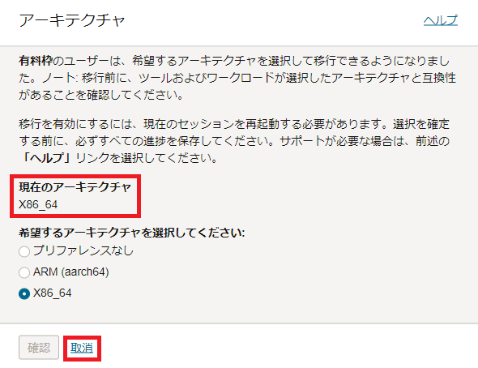
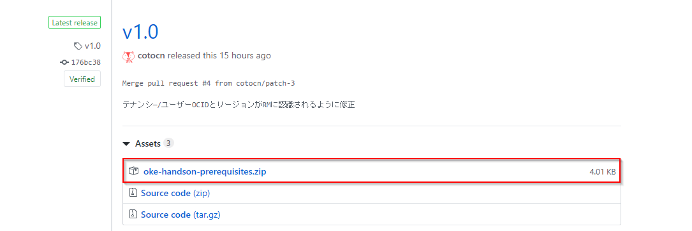
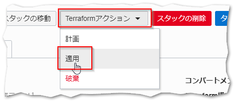
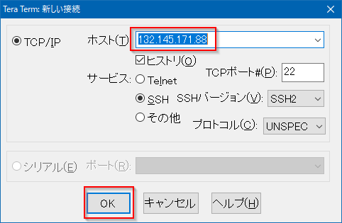

マネージド Kubernetes サービスである Oralce Container Engine for Kubernetes(OKE)を中心とした、コンテナ・ネイティブなサービス群です。

Oracle Container Engine for Kubernetes（以下 OKE）は、Oracle のマネージド Kubernetes サービスです。この共通手順では、OCI や OKE を操作するため CLI 実行環境の構築（Resource Manager を使用）と、OKE を使って Kubernetes クラスターをプロビジョニングするまでの手順を記します。

## 前提条件

- クラウド環境
  - Oracle Cloud のアカウントを取得済みであること

## ハンズオン環境のイメージ


## 1.OKE クラスターのプロビジョニング

ここでは、OKE クラスターのプロビジョニングを行います。ここでの手順を実施することにより、OKE のコントロールプレーンと Kubernetes クラスターの構築が同時に行われます。


はじめに、OCI コンソール画面左上のハンバーガーメニューを展開し、`開発者サービス`⇒`Kubernetesクラスタ (OKE)`を選択します。


クラスタ一覧画面で、`クラスタの作成`をクリックします。


次のダイアログで`クイック作成`を選択し、`続行`をクリックします。


次のダイアログで、任意の名前を入力し、バージョンを選択します。ここではデフォルトのまま進めていきます。


`Kubernetes APIエンドポイント`には今回はデフォルトの`パブリック・エンドポイント`を選択します。


管理者は、クラスタの Kubernetes API エンドポイントを、プライベート・サブネットまたはパブリック・サブネットに構成することができます。 VCN ルーティングとファイアウォール・ルールを使うことで、Kubernetes API エンドポイントへのアクセスを制御し、オンプレミスもしくは同一 VCN 上に構築した踏み台サーバからのみアクセス可能にすることができます。  


`Kubernetesワーカー・ノード`には今回`プライベート`を選択します。これは、
ワークロードに応じて、ワーカーノードにパブリック IP を付与する必要がある場合は、`パブリック`を選択してください。


プライベートかパブリックによって、ワーカーノードに付与される IP アドレスの種類が変わります。 プライベートは、ワーカーノードがプライベート IP のみを付与された状態でプロビジョニングを行います。 ワーカーノードにパブリック IP を付与する必要がある場合は、`パブリック`を選択してください。


`シェイプ`には、今回`VM.Standard.E3.Flex`を選択します。
このシェイプは、OCPU とメモリ(RAM)を柔軟に変更することができるようになっています。  
今回は、1oCPU/16GB で作成します。



OKE では、VM、ベアメタル、GPU、HPC などの様々なシェイプをご利用頂くことができます。 また、プロセッサ・アーキテクチャとしても、Intel/AMD/ARM ベースのインスタンスから選択頂くことができます。 ワークロードに応じて、適切なシェイプを選択してください。  


ノードの数はワーカーノードの数を指定します。デフォルトで「3」が指定されていますが、本ハンズオンでは最小構成である「1」に変更してください。  



ノードはリージョン内の可用性ドメイン全体（または、東京リージョンなど単一可用性ドメインの場合、その可用性ドメイン内の障害ドメイン全体）に可能な限り均等に分散されます。 実運用の際は可用性を考慮し、適切なノード数を指定してください。  


そして、ダイアログの下まで移動し`次`をクリックします。

次のダイアログは入力内容を確認し、`クラスタの作成`をクリックします。

クリックすると「基本的なクラスタの確認」が表示されるので、`基本的なクラスタを作成`にチェックを入れて、`続行`をクリックします。



拡張クラスタは、基本クラスタで提供される機能に加えて、Virtual Nodes、アドオン機能、WorkloadIdentity、SLA 等の機能を利用できます。クラスタごとに課金が発生します。 詳細は[こちら](https://docs.oracle.com/ja-jp/iaas/Content/ContEng/Tasks/contengcomparingenhancedwithbasicclusters_topic.htm)を参照してください。


デフォルトの設定では、クラスタが必要とするネットワークリソース等の構成が自動的に行われます。途中経過がダイアログに表示されますので、左下に「タスクが完了しました」というメッセージが表示されるまで待った後、`閉じる`ボタンをクリックします。


クラスタの詳細画面表示されたら、`クラスタ・ステータス`に表示される内容を確認してください。この時点では`作成中`と表示されますが、プロビジョニングが完了すると`アクティブ`となります（完了までにはおおよそ 5 ～ 10 分程度かかります）。


クラスタが完成するまでの間に次章「3 . CLI 実行環境(Cloud Shell)の準備」の手順を進めてください。


## 2.CLI 実行環境(Cloud Shell)の準備

つぎに OKE クラスターなどの CLI を実行するための環境を準備します。


本ハンズオンでは OKE クラスターを操作するいくつかの CLI を実行するための環境として Cloud Shell と呼ばれるサービスを使用します。
Cloud Shell は Oracle Cloud コンソールからアクセスできる Web ブラウザベースのコンソールです。
Cloud Shell には、OCI CLI をはじめとして、次のようないくつかの便利なツールおよびユーティリティの現在のバージョンがインストールされています。
詳細は、[公式ドキュメントの記載](https://docs.cloud.oracle.com/ja-jp/iaas/Content/API/Concepts/cloudshellintro.htm)をご確認ください。

| インストール済みツール |
| ---------------------- |
| Git                    |
| Java                   |
| Python (2 および 3)    |
| SQL Plus               |
| kubectl                |
| helm                   |
| maven                  |
| gradle                 |
| terraform              |
| ansible                |


Cloud Shell は開発専用ではなく、一時的に OCI コマンドを実行したい場合などライトなご利用を想定したサービスであるため、実運用時は CLI 実行環境を別途ご用意ください。


OCI コンソール上で右上にあるターミナルのアイコンをクリックし、`Cloud Shell`をクリックします。


しばらく待つと、Cloud Shell が起動します。

Cloud Shell は、ARM(aarch64)と X86_64 のアーキテクチャを選択できます。こちらのチュートリアルは、X86_64 をベースに構成されています。そのため、アーキテクチャのタイプを確認します。もし、ARM(aarch64)が選択されている場合は、X86_64 に変更して、Cloud Shell を再起動します。

最初に、「アクション」-「アーキテクチャ」選択します。


「現在のアーキテクチャ」が ARM(aarch64) の場合は、X86_64 を選択して、「確認して再起動」ボタンをクリックします。  
「現在のアーキテクチャ」が X86_64 の場合は、そのまま、「取消」を選択してください。


Cloud Shell 再起動後、「アクション」-「アーキテクチャ」選択します。そして、X86_64 であることを確認して、「取消」を選択します。



Cloud Shell の操作に入ります。  
Cloud Shell は、必要な CLI はデフォルトでインストール済みです。  
例えば以下のようなコマンドを実行できます。

```
kubectl version --client
```

以下のような結果となれば、kubectl は正常にインストールされています。

```
Client Version: vX.XX.X
```

上記は、kubectl（Kubernetes の管理用のコマンドラインツール）の、バージョン情報を表示するコマンドとその結果です。

以上で、準備作業は完了です。

## 3.kubectl のセットアップ


次に、kubectl のセットアップを行って実際にクラスターにアクセスしてみます。

OCI コンソール画面左上のハンバーガーメニューを展開し、`開発者サービス`⇒`Kubernetes Clusters (OKE)`を選択します。


先の手順で作成しておいた`cluster1`の名前をクリックします。



ここからの手順を進めるには、OKE クラスターのプロビジョニングが完了している必要があります。 クラスターの詳細画面で、`クラスタ・ステータス`が`アクティブ`となっていることを確認してください。まだ`作成中`だった場合には、ステータスが変わるまで少しお待ち下さい。


クラスターの詳細画面で、画面右上の`アクション`をクリックし、表示される選択肢の中から`クラスタへのアクセス`をクリックします。


「自分のクラスタへのアクセス」というダイアログが表示されます。  
OKE へのアクセス方法は「Cloud Shell アクセス」と「ローカル・アクセス」の 2 種類が存在します。  
今回は CLI 環境として Cloud Shell を利用するので、「Cloud Shell アクセス」でアクセスを行います。  
ダイアログ上部の「Cloud Shell アクセス」をクリックします。

表示されたダイアログの中に kubetctl の設定ファイルを取得するためのコマンドが表示されます。


まず Cloud Shell を起動します。
既に起動している場合は本手順は必要ありません。
Cloud Shell の起動はダイアログに表示されている「Cloud Shell の起動」をクリックするか、[3-1. Cloud Shell を起動する](#3-1-cloud-shellを起動する)を参照してください。


別途クライアント環境を作成された方は作成した環境にログインし、ホームディレクトリ(`/home/opc`)からコマンドを実行してください。また、コマンドは「ローカル・アクセス」のコマンドを実行してください。


次にアクセス・コマンドですが、こちらは OCI CLI の設定ファイル取得用のコマンドを実行しています。  
右端の「コピー」をクリックしてコピーし、Cloud Shell にペーストして実行します。  
（以下の例はダミーの値で埋めたものですので、実際のコマンドはダイアログからコピーしてください）

    oci ce cluster create-kubeconfig --cluster-id ocid1.cluster.oc1.iad.xxxxxxxxxxxxxxxxxxxxxxxxxxxxxxxxxxxxxxxxxxx --file $HOME/.kube/config --region ap-tokyo-1  --token-version 2.0.0  --kube-endpoint PUBLIC_ENDPOINT


kubectl コマンドはデフォルトで`$HOME/.kube/config`というパスのファイルを読み込む仕様になっています。 詳細は、kubectl コマンドに関する[公式ドキュメントの記載](https://kubernetes.io/docs/tasks/access-application-cluster/configure-access-multiple-clusters/#set-the-kubeconfig-environment-variable)を参照ください。


最後に、以下のコマンドを実行して、kubectl の動作確認をしてみます。

    kubectl get nodes

以下のような実行結果になれば、正常にクラスターにアクセスできています。

    NAME        STATUS   ROLES   AGE   VERSION
    10.0.10.2   Ready    node    20s   v1.21.5

以上で、OKE で Kubernetes クラスターをプロビジョニングし、利用を開始するまでの手順は完了です。  
この後はそれぞれ実施するハンズオンの手順に従ってください。

[初級編 - OKE でアプリケーションを動かしてみよう](../oke-for-beginners/)

[中級編 - OKE でサンプルアプリケーションのデプロイと CI/CD を体験してみよう](../oke-for-intermediates/)

[上級編 - OKE でサンプルマイクロサービスアプリケーションをデプロイしてオブザバビリティツールを利用してみよう](../oke-for-advances/)

## 4.【オプション】CLI 実行環境(VM インスタンス)の作成

手順 5 はオプションになっており、ハンズオン実施にあたっては基本的に不要な手順になります。  
OKE を操作するためのクライアントを、Cloud Shell ではなく VM インスタンスで作成したい方や Oracle Cloud Infrastructure 上のマネージド Terraform サービスである`Resource Manager`に興味がある方は是非参考にしてください。

### 4-1. OCI コンソールにアクセスする

OCI コンソールにブラウザからアクセスします。お持ちのクラウドアカウントを使って[サインイン](https://cloud.oracle.com/ja_JP/home)します。


- 1．Sign In をクリックします
- 2．クラウドアカウント名（テナント名）を入力します
- 3．「Next」をクリックします
- 4．クラウドユーザー名とパスワードを入力して「サイン・イン」をクリックします

### 4-2. Resource Manager を利用して環境を構築する

本節での作業は、OCI の Resource Manager と呼ばれるサービスを使って実施します。手作業で VM インスタンスの作成、CLI のインストール、ポリシーの設定などを行うこともできますが、Resource Manager を利用することでこれらの手順を自動化・省力化することが可能です。


[Resource Manager](https://docs.oracle.com/cd/E97706_01/Content/ResourceManager/Concepts/resourcemanager.htm)は、テキストで記述した構成情報に基づいて、Oracle Cloud 上の複数のリソースをまとめて作成/変更/削除することができる、構成管理サービスです。 Resource Manager では Terraform の形式で構成情報を記述します。  



#### 4-2-1. スタックの作成

Resource Manager を利用するには、構成情報を記述したテキストファイルを作成し、それらを zip アーカイブにまとめておく必要があります。Resource Manager アーカイブは既に作成済みです。  
[こちら](https://github.com/oracle-japan/oke-handson-prerequisites/releases/tag/v1.4)からダウンロードしてください。



`oke-handson-prerequisites.zip`というファイルをダウンロードしてください。

次に、画面左上のハンバーガーメニューを展開し、`開発者サービス`⇒`リソース・マネージャ`を選択します。


リソース・マネージャの画面で、`スタックの作成`をクリックします。


スタックはリソース・マネージャ サービスによって管理される Terraform コマンドの実行環境です。ここで Resource Manager アーカイブをアップロードしてスタックを作成することで、アップロードされた Terraform テンプレートの実行環境がクラウド上に構成されます。

スタックの作成画面で、`マイ構成`を選択し、`.zipファイルをここにドロップします または 参照`と表示された領域にダウンロードした Resource Manager アーカイブをドロップし、下部にある`TERRAFORMのバージョン`を`1.0.x`に変更します。  
その後`次`をクリックします。


Resource Manager が自動的に各環境毎の`TENANCY_OCID`と`COMPARTMENT_OCID`と`Region`の変数に適切な値を投入します。変数が投入されていることを確認し、`次`をクリックします。



Oracle Cloud Infrastructure は、北米、東京を含む多数のデータセンターを利用可能です。ここではアカウント作成時に設定されたホームリージョンのまま、手順を進めていきます。 [リージョンと可用性ドメイン](https://docs.oracle.com/cd/E97706_01/Content/General/Concepts/regions.htm)


入力内容の確認画面が表示されますので、`作成`をクリックしてスタックの作製を実行します。


スタックの作製が完了すると、作成済みのスタックの詳細画面が表示されます。


#### 4-2-2. ジョブの実行

それでは実際にスタックを実行して環境の構成を行っていきます。

スタックの詳細画面で`Terraformアクション`メニューを展開し`適用`をクリックします。



「適用」ダイアログで`適用`をクリックします。


これで、クライアント環境の構成と OKE クラスターの作成に必要なジョブが開始されます。

ジョブの完了には数分程度かかりますが、その間、ログに表示される内容を確認してみてください。Resource Manager はクラウドの環境内で Terraform を実行しており、その結果として標準出力に出力される内容がログに表示されます。


ジョブの状態が「成功」になったら、正常にジョブが完了しています。


### 4-3. CLI 実行環境にログインする

ジョブの実行が完了したら、実際に CLI の実行環境に接続してみましょう。画面左下にある`出力`をクリックしてください。


ここでは、ジョブを実行した結果作られたリソースに関連する情報を、確認することができます。ここまで正常に完了していれば、`oke-client`と`private_key_pem`という情報が表示されているはずです。これらは、それぞれ CLI 実行環境の IP アドレスと SSH 秘密鍵です。


`oke-client`は、値をテキストファイルにコピー＆ペーストするなどして控えておいてください。

`private_key_pem`の値は、`コピー`という部分をクリックするとクリップボードに値が保存されます。こちらは、新たにテキストエディタを起動してペーストし、「privatekey.pem」というファイル名で保存しておいてください。


次に、デスクトップにある Tera Term のショートカットアイコンをダブルクリックし、Tera Term を起動します。「Tera Term: 新しい接続」というダイアログが表示されたら、`ホスト`に上の手順で控えた IP アドレスを入力し、`OK`をクリックします。



「セキュリティ警告」というダイアログが表示されたら、何も変更せずに`続行`をクリックします。


「SSH 認証」というダイアログが表示されたら、以下のように値を設定して`OK`をクリックします。

| 項目                 | 入力値                                                                                                    |
| -------------------- | --------------------------------------------------------------------------------------------------------- |
| ユーザー名           | opc                                                                                                       |
| ラジオボックスの選択 | `RSA/DSA/EDCSA/ED25519を使う`をオンにし、上の手順で保存した秘密鍵のファイルを(privatekey.pem)を選択する。 |
| （上記以外）         | （デフォルトのまま）                                                                                      |


CLI 実行環境への接続が成功すると、以下のようなコンソール出力が表示されます。

    Last login: Fri Aug  2 04:21:15 2019 from 156.151.8.3
    [opc@oke-client ~]$

必要な CLI はこの時点でインストール済みですので、例えば以下のようなコマンドを実行することが可能です。

```
kubectl version --client --short
```

以下のような結果となれば、kubectl は正常にインストールされています。

```
Client Version: vX.XX.X
```

上記は、kubectl（Kubernetes の管理用のコマンドラインツール）の、バージョン情報を表示するコマンドとその結果です。

以上で、CLI 実行環境の作成は完了です。

### 4-4. OCI CLI のセットアップ

OKE クラスターを利用するための OCI CLI 環境をセットアップします。

#### 4-4-1. テナンシの OCID の確認

OCI CLI のセットアップでは、CLI をどのテナンシのユーザーアカウントとして実行するかを設定するために、テナンシ、ユーザーの OCID（識別子）が必要になります。はじめに、このテナンシの OCID を取得しておきます。

OCI コンソール画面右上の人型のアイコンをクリックし、展開したプロファイルから`テナンシ:<テナンシ名>`をクリックします。


テナンシ情報`OCID`の右側にある`コピー`をクリックすると、テナンシ OCID がクリップボードにコピーされます。

この値は後の手順で利用しますので、テキストエディタにペーストするなどして控えておいてください。


#### 4-4-2. ユーザーの OCID の確認

次にテナンシの OCID を取得しておきます。
OCI コンソール画面右上の人型のアイコンをクリックし、展開したプロファイルから`ユーザ名`(oracleidentitycloudservice/<ユーザ名>)をクリックします。


ユーザ情報が表示されますので、`OCID`の右側にある`コピー`をクリックすると、ユーザ OCID がクリップボードにコピーされます。


この値は後の手順で利用しますので、テキストエディタにペーストするなどして控えておいてください。

#### 4-4-3. OCI CLI のセットアップ

それでは、OCI CLI のセットアップを行います。
[Cloud Shell を起動](#3-1-cloud-shellを起動する)し、以下
のコマンドを実行してください。

    oci setup config


別途クライアント環境を作成された方は作成した環境にログインし、ホームディレクトリ(`/home/opc`)からコマンドを実行してください。


セットアップをおこなうためのインタラクションが開始されますので、提示される質問に対して、下表のように入力してください。

| 質問                                                                                                                                                                                                                                                                          | 応答操作                                                    |
| ----------------------------------------------------------------------------------------------------------------------------------------------------------------------------------------------------------------------------------------------------------------------------- | ----------------------------------------------------------- |
| Enter a location for your config [/home/opc/.oci/config]                                                                                                                                                                                                                      | なにも入力せず`[Return]`                                    |
| Enter a user OCID                                                                                                                                                                                                                                                             | 先の手順で確認したユーザーの OCID を入力                    |
| Enter a tenancy OCID                                                                                                                                                                                                                                                          | 先の手順で確認したテナンシの OCID を入力                    |
| Enter a region by index or name(e.g. 1: ap-chiyoda-1, 2: ap-chuncheon-1, 3: ap-hyderabad-1, 4: ap-melbourne-1, 5: ap-mumbai-1, 6: ap-osaka-1, 7: ap-seoul-1, 8: ap-sydney-1, 9: ap-tokyo-1, 10: ca-montreal-1, 11: ca-toronto-1, 12: eu-amsterdam-1, 13: eu-frankfurt-1, ...) | CLI 実行環境の作成時に指定したリージョン(数字でも OK)を入力 |
| Do you want to generate a new RSA key pair? (If you decline you will be asked to supply the path to an existing key.) [Y/n]                                                                                                                                                   | `Y + [Return]`                                              |
| Enter a directory for your keys to be created [/home/opc/.oci]                                                                                                                                                                                                                | なにも入力せず`[Return]`                                    |
| Enter a name for your key [oci\_api\_key]                                                                                                                                                                                                                                     | なにも入力せず`[Return]`                                    |
| Enter a passphrase for your private key (empty for no passphrase)                                                                                                                                                                                                             | なにも入力せず`[Return]`                                    |

CLI から Oracle Cloud 環境の操作をおこなう際は、コマンドの実行の度に認証が行われます。この認証のための鍵はあらかじめ Oracle Cloud 上のユーザーアカウントに設定しておく必要があります。

上記の OCI CLI のセットアップの中で鍵ペアが作成されていますので、公開鍵をユーザーアカウントに設定していきます。

まず、Tera Term で以下のコマンドを実行し、公開鍵を表示しておきます。

    cat ~/.oci/oci_api_key_public.pem

続いてコンソールに移り、ユーザー詳細画面へ遷移します。


ユーザーの詳細画面をスクロールして`APIキー`をクリックします。


`公開キーの追加`をクリックします。


「公開キーの追加」ダイアログの入力欄が表示されます。  
今回は、`公開キーの貼付け`をクリックし、先ほと Tera Term に表示した公開鍵をペーストし、`追加`ボタンをクリックします（`-----BEGIN PUBLIC KEY-----`と`-----END PUBLIC KEY-----`の行も含めてペーストします）。  
公開キーをファイルで登録したい場合には、`公開キー・ファイルの選択`をクリックし、公開キーを登録します。


以上で OCI CLI のセットアップは完了です。
