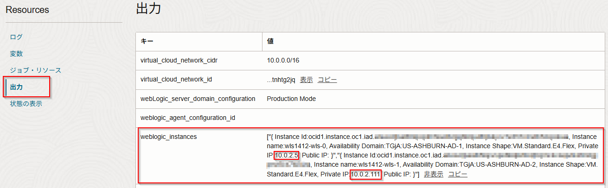
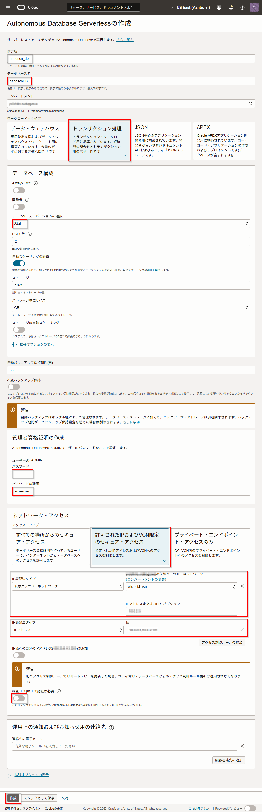
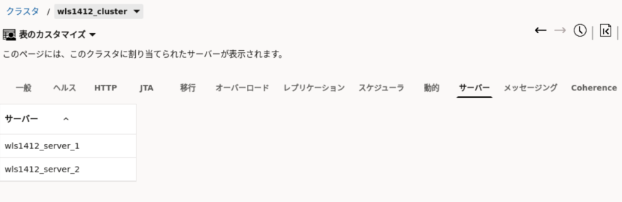
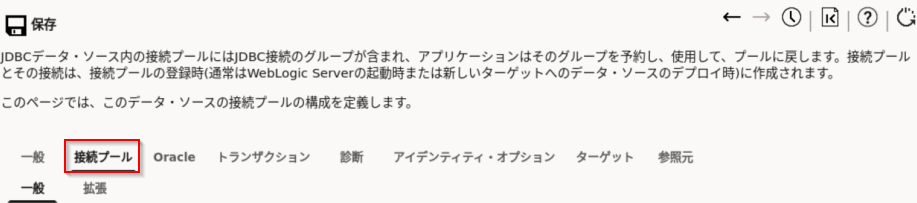

本ハンズオンではWebLogic for OCI(14.1.2)のサーバーの起動・停止、データソースの作成、サンプルアプリケーションのデプロイ、そしてロードバランサー経由での動作確認までの基本的な操作手順について学習します。

前提条件
---
- クラウド環境
    * Oracle Cloudのアカウントを取得済みであること

- [WebLogic Server for OCI(14.1.2)をプロビジョニングしてみよう](../wls-for-oci-1412-provisioning)を実施済みであること
    * 本ハンズオンではこちらで作成したWebLogic Server for OCI(14.1.2)の環境と踏み台インスタンスにインストールしたWebLogic Remote Consoleを利用して操作を行います。

ハンズオンの全体像
---

1. 事前準備を行う(ADBの作成、sqlplusのインストールなど)
1. WebLogicにデータソースの設定を行う
1. WebLogicにアプリケーションをデプロイする
1. Load Balancerからアプリケーションにアクセスする

事前準備
---

### データベースをセットアップする

#### 1. Autonomous Databaseをプロビジョニングする 

左上のハンバーガーメニューを展開して、「Oracle Database」から「Autonomous Database」を選択します。


「Autonomous Databaseの作成」をクリックします。  


Autonomous Database Serverlessの作成では以下のように入力・設定します。





- 上部の入力項目

    項目 | 値
    -|-
    表示名 | **handson_db**
    データベース名 | **handsonDB**
    ワークロード・タイプ | **トランザクション処理**
    パスワード | **Welcome1234!**
    パスワードの確認 | **Welcome1234!**

- データベース構成

    項目 | 値
    -|-
    データベース・バージョンの選択 |**23ai**


<pre><code>curl -X POST https://example.com/api</code></pre>


- ネットワーク・アクセス

    項目 | 値
    -|-
    アクセス・タイプ |**許可されたIPおよびVCN限定のセキュア・アクセス**
    アクセス制御ルール① | ・IP表記法タイプ => **仮想クラウドネットワーク**<br><br>・xxxの仮想クラウドネットワーク => **[2. WebLogic Server for OCIをプロビジョニングする](../wls-for-oci-1412-provisioning/#2-weblogic-server-for-oci%E3%82%92%E3%83%97%E3%83%AD%E3%83%93%E3%82%B8%E3%83%A7%E3%83%8B%E3%83%B3%E3%82%B0%E3%81%99%E3%82%8B)で作成されたvcn(手順通りだとwls1412-vcn)**<br><br>・IPアドレスまたはCIDR => **管理サーバーのプライベートIP,管理対象サーバのプライベートIP**(※例:10.0.X.1,10.0.X.2、詳細は表下のNote参照)
    アクセス制御ルール②<br>(※「アクセス制御ルールの追加」ボタンを押して追加) | ・IP表記法タイプ => **IPアドレス**<br><br>・値 => **踏み台インスタンスのパブリックip**
    相互TLS(mTLS)認証が必要 | **チェックを外す**


WebLogic for OCIをプロビジョニングした後の画面の出力部分のweblogic_instancesに含まれています。   例:以下の場合、「10.0.2.5,10.0.2.111」を入力。  


入力、設定すると以下のようになります。



「作成」をクリックします。


ステータスが「使用可能」になったら、「データベース接続」をクリックします。


DB接続の「接続文字列」で「TLS認証」を「TLS」に変更し、TNS名_highの接続文字列をコピーして保存しておきます。こちらは後の手順で使用します。


#### 2. SQL PlusとSQL Clientをインストールする

アプリケーションで使用するデータを登録するため、踏み台インスタンスへSQL PlusとSQL Clientをインストールします。

以下のコマンドを実行します。

[こちらのサイト](https://yum.oracle.com/repo/OracleLinux/OL8/oracle/instantclient23/x86_64/index.html)から **oracle-instantclient-sqlplus-23.x.x.xx.xx-x.el8.x86_64.rpm** と **oracle-instantclient-basic-23.x.x.xx.xx-x.el8.x86_64.rpm** をそれぞれダウンロードします。

以下のコマンドを実行してインストールします。

    $ sudo rpm -ivh oracle-instantclient-basic-23.x.x.xx.xx-x.el8.x86_64.rpm

    $ sudo rpm -ivh oracle-instantclient-sqlplus-23.x.x.xx.xx-x.el8.x86_64.rpm

以下のコマンドで正しくインストールされているか確認します。

    $ sqlplus -v

    SQL*Plus: Release 23.0.0.0.0 - for Oracle Cloud and Engineered Systems
    Version 23.7.0.25.01

#### 3. サンプルデータを登録する 

次にサンプルのテーブルとデータを登録します。
[こちら](https://github.com/oracle-samples/db-sample-schemas/archive/refs/tags/v23.3.tar.gz)からサンプルSQL(db-sample-schemas-23.3.tar.gz)をダウンロードして踏み台インスタンスの任意の場所に置きます。

以下のコマンドを実行し、ファイルを解凍します。

    $ sudo tar -xvzf db-sample-schemas-23.3.tar.gz

こちらのサンプルは複数のファイルが含まれています。今回登録するのはhuman_resourcesなので、対象のディレクトリへ移動します。

    $ cd db-sample-schemas-23.3/human_resources

以下のコマンドを実行し、sqlplusで作成したATPに接続します。

    $ sqlplus admin/'<ATP作成時に入力したパスワード>'@'<前の手順で確認したTNS名_highの接続文字列>'  

例えば以下のようになります。(xxxxの部分は各自のATPにより異なります)

    $ sqlplus admin/'Welcome1234!'@'(description= (retry_count=20)(retry_delay=3)(address=(protocol=tcps)(port=1521)(host=adb.us-phoenix-1.oraclecloud.com))(connect_data=(service_name=xxxxxxxxxxxxxxx_handsondb_high.adb.oraclecloud.com))(security=(ssl_server_dn_match=yes)))'

<!--
接続できたら、以下のコマンドを実行してPDBの名前を確認します。

    SQL> select pdb_name from cdb_pdbs;

    PDB_NAME
    --------------------------------------------------------------------------------
    XXXXXXXXXXXXXXX_HANDSONDB

以下のコマンドを実行してPDBに切り替えます。

    SQL\> alter session set container = XXXXXXXXXXXXXXX_HANDSONDB;
    Session altered.
-->

サンプルデータを登録するSQLを実行します。いくつか質問が表示されます。  
HRユーザのパスワードにはハンズオンで利⽤する **Welcome1234!** を指定します。  
Tablespace名は任意ですが今回は **data** を指定します。  
Schemaの上書きは **YES** を指定します。  

    SQL> @hr_install.sql

    Thank you for installing the Oracle Human Resources Sample Schema.
    This installation script will automatically exit your database session
    at the end of the installation or if any error is encountered.
    The entire installation will be logged into the 'hr_install.log' log file.

    Enter a password for the user HR: Welcome1234!
    Enter a tablespace for HR [DATA]: data
    Do you want to overwrite the schema, if it already exists? [YES|no]: YES

確認のため、HRユーザでATPに接続できることを確認し、データが登録されていることを確認します。

    $ sqlplus hr/'Welcome1234!'@'(description= (retry_count=20)(retry_delay=3)(address=(protocol=tcps)(port=1521)(host=adb.us-phoenix-1.oraclecloud.com))(connect_data=(service_name=xxxxxxxxxxxxxxx_handsondb2_high.adb.oraclecloud.com))(security=(ssl_server_dn_match=yes)))'

    SQL*Plus: Release 23.0.0.0.0 - for Oracle Cloud and Engineered Systems on Mon Apr 28 06:15:40 2025
    Version 23.7.0.25.01

    Copyright (c) 1982, 2024, Oracle.  All rights reserved.

    Last Successful login time: Sun Apr 27 2025 09:41:32 +00:00

    Connected to:
    Oracle Database 23ai Enterprise Edition Release 23.0.0.0.0 - for Oracle Cloud and Engineered Systems
    Version 23.8.0.25.05

    SQL> select employee_id,first_name,last_name from employees;
    EMPLOYEE_ID FIRST_NAME LAST_NAME
    ----------- -------------------- -------------------------
    100 Steven King
    101 Neena Kochhar
    102 Lex De Haan
    103 Alexander Hunold
    :
    :
    205 Shelley Higgins
    206 William Gietz
    107 rows selected.
    SQL> exit

### サンプルアプリケーションを取得する

[こちら](./WLSHandsOn.zip)から本ハンズオンで使うサンプルアプリケーションを取得します。
適当な場所に解凍しておきます。

WebLogic Remote Consoleについて学習する
---

### 1. 管理対象サーバーを停止・起動する 

ここでは管理対象サーバーを停止・起動する手順について学習します。
WebLogic for OCIではノード・マネージャ、マシン、管理対象サーバが既に構成された状態でプロビジョニングされます。そのため、デフォルトの状態でもRemote Consoleから管理サーバ、管理対象サーバの起動停止を行うことができます。

[こちらの手順](../wls-for-oci-1412-provisioning)で構築されたWebLogic Serverではマシン、ノードマネージャ、管理サーバー、及び管理対象サーバーは以下のような構成になっています。


#### マシン、ノード・マネージャを確認する

最初に構成されているマシン、ノード・マネージャを確認します。

「ツリーの編集」－「環境」ー「マシン」を開くと、いくつかマシンが作成されていることが確認できます。


さらにその中の任意のマシンを選んで「ノード・マネージャ」のタブを開くと、マシンにノード・マネージャが構成されていることが確認できます。


#### クラスタを確認する

次にクラスタを確認します。

「ツリーの編集」ー「環境」ー「クラスタ」から作成されているクラスタを確認できます。


任意のクラスタを開いて、「サーバー」タブからクラスタに登録されているサーバーを確認することができます。



#### 管理対象サーバーを停止・起動する

次にサーバーの停止・起動を学習します。
「モニタリング・ツリー」から「環境」－「サーバー」を開きます。


サーバーの中から任意の管理対象サーバーにチェックして表の上にある「シャットダウン」から「ただちに強制停止」をクリックします。


以下のメッセージが表示されます。


サーバーの状態が変わるので、行をクリックして開きます。


詳細を開くとサーバーがシャットダウンされていることが確認できます。


一覧に戻って、今度は停止したサーバーを起動します。先ほどのサーバーにチェックして「起動」ボタンをクリックします。


以下のメッセージが表示されます。


しばらくするとサーバーが「実行中」状態になります。


### 2. JDBCデータ・ソースの作成 

この演習では、WebLogic Server上のアプリケーションがデータベースに効率的に接続するためのサービスであるJDBCデータ・ソースを作成します。WebLogic Serverでは、下表のように5種類のデータ・ソースを利用できます。今回はシングルのOracle Databaseへ接続するため汎用データ・ソースを作成します。

| <nobr>データ・ソースの種類</nobr> | 概要 |
|----|----|
| 汎用データ・ソース | 単体のデータベースまたは１つのデータベース・サービスに接続する場合に適用 |
| マルチ・データ・ソース | 複数のデータベースや複数のデータベース・サービスに接続し負荷分散やフェイルオーバーを行う場合に適用 (Oracle RACにも利用可能) |
| GridLink データ・ソース | Oracle RACのサービスに接続し、RAC側の死活状況や負荷状況を受信しながら動的な負荷分散や高速なフェイルオーバーなどの高度な機能を利用する場合に適用 |
| プロキシ・データソース | データ・ソースの参照を仲介するデータ・ソースで、条件に応じて参照するデータ・ソースを自動で切り替える場合に適用。マルチテナント機能の利用時に、テナントに応じて接続先データベースを変更するなど |
| UCP データ・ソース | Oracle Databaseが提供するコネクション・プーリング機構を使った、高パフォーマンス、高可用性機能を利用する場合に適用 |

#### 作成するJDBCデータ・ソースの構造

今回、下図のようなJDBCデータ・ソースを作成します。


設定項目 | 設定値
-|-
データ・ソース種類 | 汎用データ・ソース
データベースのタイプ | Oracle Database
名前 | orahr
JNDI名 | jdbc/orahr
データベース・ドライバ | *Oracle's Driver (Thin) for Application Continuity; Versions:Any
データベース名 | test
ホスト名 | test
ポート | 1521
データベース・ユーザー名 | hr
パスワード | Welcome1234!
ターゲットとなるサーバー | wls1412_cluster
接続プール初期数 | 5
接続プール最小数 | 5
接続プール最大数 | 5

#### JDBCデータ・ソースの作成

データ・ソースを作成します。
「ツリーの編集」から「サービス」－「データ・ソース」を開きます。


「新規」をクリックします。


次の画面では以下のように入力します。

| 設定項目 | 設定値 |
-|-
| 名前 | orahr |
| JNDI名 | jdbc/orahr |
| ターゲット | wls1412_clusterにチェック、「>」を押して選択済へ |
| データ・ソース・タイプ | 汎用データ・ソース |


※以下はデータ・ソース・タイプを選択すると表示されます。

| 設定項目 | 設定値 |
-|-
| データベース・タイプ | Oracle |
| データベース・ドライバ | *Oracle's Driver (Thin) for Application Continuity; Versions:Any |
| グローバル・トランザクション・プロトコル(※データベース・ドライバを選択すると表示されます) | OnePhaseCommit |
| データベース名 | test |
| ホスト名 | test |
| ポート | 1521 |
| データベース・ユーザー名 | hr |
| パスワード | Welcome1234! |


Autonomous Databaseに接続する場合、ここで入力する値は次の画面で書き換えることとになるので、任意の値で構いません。 



入力したら「作成」をクリックします。


自動的にデータ・ソースの詳細画面に遷移します。
接続先を設定するため「接続プール」タブに遷移します。



「接続プール」ー「一般」タブのURLに以下の文字列を入力します。

- **jdbc:oracle:thin:@<[こちらの手順](#:~:text=こちらは後の手順で使用します。)で確認した接続文字列>**<br>例えば以下のようになります。

```
jdbc:oracle:thin:@(description= (retry_count=20)(retry_delay=3)(address=(protocol=tcps)(port=1521)(host=adb.us-phoenix-1.oraclecloud.com))(connect_data=(service_name=xxxxxxxxxxxxxxx_handsondb_high.adb.oraclecloud.com))(security=(ssl_server_dn_match=yes)))
```

「初期容量」、「最大容量」、「最小容量」に「5」を指定し、「保存」をクリックします。


次に接続テストをします。  
「一般」タブに移動して、タブのすぐ下にある「構成のテスト」をクリックして接続テストします。  
成功したら青いダイアログが表示されます。  


右上のカートアイコン🛒から、「変更のコミット」をクリックします。
これにより、保存内容がドメインに反映されます。（もし保存内容を破棄する場合は、「すべての変更の取消し」ボタンを選択します。）


メッセージに「変更は正常にコミットされました。」が表示されることを確認します。


#### JDBCデータ・ソースの監視項目の追加

JDBCデータ・ソースには様々な種類の監視項目が用意されており、リモート・コンソールからその監視項目のスナップショット値を表示できます。このハンズオンでは、作成した汎用データ・ソースorahrに対してリモート・コンソールで表示する監視項目を追加します。

「モニタリング・ツリー」で、「サービス」＞「データ・ソース」＞「JDBCデータ・ソース・ランタイムMBean」から「orahr」　を選択します。


　デフォルトでは「サーバー」、「名前」、「タイプ」、「アクティブな接続の平均数」…などのすべての項目が表示されています。

ここに、必要な情報だけを表示するために、「表のカスタマイズ」を選択します。


下図のように、「使用可能」リストボックスに利用できる監視項目が表示されます。

この中から、以下の項目を選択して「選択済の列」に移動します。

- 名前
- サーバー
- 有効
- 状態
- ドライバ名
- 接続待機の最大数
- 最大待機秒数
- 現在の容量
- 現在アクティブな接続の数


下図のようになっていることを確認し、「適用」ボタンをクリックします。


汎用データ・ソース orahrの監視項目が更新されていることを確認します。


なお、今回追加した中で特に4つの監視項目について以下の表にて説明します。

監視項目 | 概要
-|-
現在の容量 | 接続プール中の現在のコネクション数
現在アクティブな接続の数 | 現在、アプリケーションから利用されているコネクション数
接続待機の最大数 | コネクションを取得するのに待機が発生したアプリケーション数で最大の値。<br>0より高い値の場合、待機が発生していることになり、接続プールの最大容量が足りないか、または長時間コネクションを解放しない、またはリークを発生させているアプリケーションが存在する可能性がある
最大待機時間 | アプリケーションがコネクションを取得するまで待機した時間で最も長いもの。単位は秒。<br>基本的に0が望ましい。特に接続プールのパラメータである「接続予約のタイムアウト（デフォルト10秒）」の値に近い場合は迅速に改善する必要がある。その場合、接続プールの最大容量を見直すか、長時間コネクションを開放しない、またはリークを発生させているアプリケーションが無いかを調査する。

引き続き、JDBCデータ・ソース作成後の接続テストを行います。

#### JDBCデータ・ソースの接続テスト

JDBCデータ・ソースは作成途中または作成後にデータベースへの接続テストが行えます。

このハンズオンでは、作成した汎用データ・ソース orahrの接続テストを行います。

画面左側の「モニタリング・ツリー」で、「サービス」＞「データ・ソース」＞「JDBCデータ・ソース・ランタイムMBean」＞「orahr」を選択します。


テストタブをクリックします。


表の中のテスト結果に「サーバーxxxのorahrのテストは成功しました。」と表示されることを確認します。


### 3. アプリケーションのデプロイ 

この演習では、WebLogic Serverにアプリケーションのデプロイ（配布）を行い、アプリケーションの動作確認を行います。今回はDeptEmpという名前のアプリケーションを、クラスタwls1412_clusterをターゲットにデプロイします。これは、前の演習で作成したJDBCデータ・ソース orahrを使用してHRスキーマのDepartments表とEmployees表にアクセスするサンプルのアプリケーションです。アプリケーション(DeptEmp.war)は[こちら](#%E3%82%B5%E3%83%B3%E3%83%97%E3%83%AB%E3%82%A2%E3%83%97%E3%83%AA%E3%82%B1%E3%83%BC%E3%82%B7%E3%83%A7%E3%83%B3%E3%82%92%E5%8F%96%E5%BE%97%E3%81%99%E3%82%8B)で取得したzipファイル(WLSHandsOn.zip)の中にあります。


| 設定項目 | 設定値 |
-|-
| アプリケーションのファイル | WLSHandsOn/DeptEmp.war |
| アプリケーション名 | DeptEmp |
| ターゲット | wls1412_cluster |

上記以外の設定項目はデフォルトのままとします。

リモート・コンソールを用いてデプロイを行う場合、まずドメインに対してアプリケーションの「インストール」を行います。アプリケーションは停止または起動状態でインストールすることができます。

#### アプリケーションのインストール

まず、ドメインに対しアプリケーションの「インストール」を行います。

画面左側の「ツリーの編集」から、「デプロイメント」＞「アプリケーション・デプロイメント」を選択します。


「⊕ 新規」をクリックします。


以下の項目を入力します。

| 設定項目 | 設定値 |
-|-
| 名前 | DeptEmp |
| ターゲット | wls1412_clusterを選択済へ |
| ソース | [こちらで取得したサンプル](#%E3%82%B5%E3%83%B3%E3%83%97%E3%83%AB%E3%82%A2%E3%83%97%E3%83%AA%E3%82%B1%E3%83%BC%E3%82%B7%E3%83%A7%E3%83%B3%E3%82%92%E5%8F%96%E5%BE%97%E3%81%99%E3%82%8B)からDeptEmp.warを指定 |
| デプロイメント時 | アプリケーションを起動しない(※文字が見切れているので注意) |


デプロイメント時には「アプリケーションの起動」というオプションがあり、こちらを選択するとデプロイ時に自動的にアプリケーションが起動状態になります。 



「⊕ 作成」ボタンをクリックします。


右上のカートアイコン🛒から、「変更のコミット」をクリックします。
これにより、保存内容がドメインに反映されます。（もし保存内容を破棄する場合は、「すべての変更の取消し」ボタンを選択します。）


メッセージに「変更は正常にコミットされました。」が表示されることを確認します。


以上でアプリケーションDeptEmpの「インストール」は完了です。

### 4. アプリケーションを起動する 

次に、アプリケーションDeptEmpの「起動」を行います。

「モニタリング・ツリー」から「デプロイメント」－「アプリケーション管理」を開きます。


先ほどデプロイしたDeptEmpが準備完了の状態になっています。  
DeptEmpにチェックして「起動」ボタンをクリックします。


「すべてのリクエストを処理」をクリックします。


以下のメッセージが表示されます。


しばらくするとDeptEmpの状態がアクティブに更新されます。


### 5. LoadBalancerからアプリケーションへアクセスする

最後にデプロイしたアプリケーションへアクセスします。
WebLogic Serverはプライベート・ネットワークに配置しているので直接アクセスすることができません。
なので、LoadBarancer経由でアプリケーションへアクセスします。

プロビジョニング時に作成されたLoadBarancerはデフォルトで管理サーバーと管理対象サーバーがバックエンドに設定されています。  


LoadBarancerのパブリックIPを確認して、アプリケーションを開きます。  
OCIのコンソールメニューから「ネットワーキング」－「ロード・バランサ」－「ロード・バランサ」から作成されたLoadBarancerの詳細画面を開いて、パブリックIPを確認します。


もしくは、WebLogic for OCIをプロビジョニングした後の画面の出力部分のload_balancer_ipでも確認できます。


`https://{LoadBarancerのパブリックIP}/DeptEmp` をブラウザで開きます。
デプロイしたアプリケーションが表示されます。


部門一覧から何か選択して「表示」ボタンをクリックすると所属する従業員の一覧が下に表示されます。


以上です。