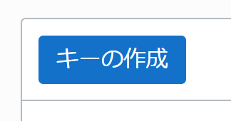
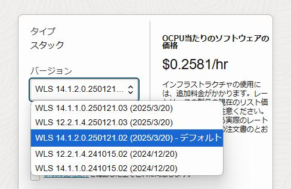
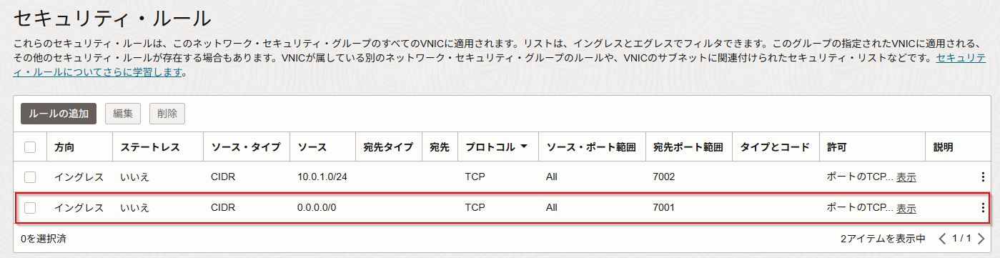

本ハンズオンでは、以下の構成を作成します。  
マーケットプレイスから環境を作成すると、VCN（仮想クラウド・ネットワーク）やロードバランサーが自動的に構成され、プライベートネットワーク上にWebLogicがインストールされたインスタンスが作成されます。また、外部からのアクセス用に踏み台サーバー（Bastion）とパブリックサブネットも自動的に作成されます。  
今回はプロビジョニングした後、踏み台サーバーにWebLogic Remote Consoleをインストールして、WebLogicの管理サーバーへアクセスする手順を学習します。

前提条件
---
- クラウド環境
    * Oracle Cloudのアカウントを取得済みであること

ハンズオンの全体像
---

1. WebLogic Server for OCI(UCM)環境を作成する
1. 踏み台インスタンスにVNC Viewerでアクセスする
1. 踏み台インスタンスにWebLogic Remote Consoleをインストールする
1. WebLogic Remote Consoleで管理サーバーへアクセスする

事前準備
---
### 1. SSHキーペアを用意する 
任意のSSHキーペアをご用意ください。  
新たに作成する場合は、左上のハンバーガーメニューを展開して、「コンピュート」から「インスタンス」を選択し、「インスタンスの作成」をクリックします。  
作成画面より、SSHキーの「秘密キー」と「公開キー」の両方をダウンロードし、利用します。

### 2. OCI VaultでSecretを作成する
WebLogic Server for OCIでは、WebLogic作成時の管理用パスワードは[OCI Vault](https://docs.oracle.com/ja-jp/iaas/Content/KeyManagement/Concepts/keyoverview.htm)にて管理します。

左上のハンバーガーメニューを展開して、「アイデンティティとセキュリティ」から「ボールト」を選択します。

「ボールトの作成」をクリックします。 

名前に「handson vault」と入力し、「ボールトの作成」をクリックします。


ボールトの作成には数分かかる場合があります。適宜ブラウザの更新を行ってください。 


作成したボールト名をクリックし、「キーの作成」をクリックします。  

名前に「handson key」と入力し、「キーの作成」をクリックします。

「シークレット」をクリックし、「シークレットの作成」をクリックします。

名前に「wlsadmin」と入力し、暗号化キーは「handson key」を選択し、シークレットコンテンツは「welcome1」と入力し、「シークレットの作成」をクリックします。

<!--
### 3. アプリケーションの取得
[こちら](https://objectstorage.us-ashburn-1.oraclecloud.com/p/kKrDQg6Tfj6f_PO7hJYfVEVsFIDCUVtdy7_WuI6N8wPXd1Po4SCoYAciOWkCG-c_/n/orasejapan/b/wls4oci/o/TodoApp-0.0.1-SNAPSHOT.war)より、本ハンズオンで利用するアプリケーションをダウンロードしてください。  
-->

### 3. OCI IAMで権限の設定を行う(Optional)
WebLogic Server for OCI の利用には以下の2種類のポリシー設定が必要です。  
あらかじめこれらの権限設定を実施した上で、WebLogic Server for OCIによるプロビジョニングを行います。
 - WebLogic Server for OCI環境の管理者が所属するグループに対するポリシー
    - WebLogic Server for OCI のWebコンソールの利用や作成後のリソース/環境の管理に必要な権限
 - WebLogic Server for OCI が利用する動的グループに対するポリシー
   - WebLogic Server for OCIがプロビジョニングを行う際に必要な権限  
この手順では、ルート・コンパートメントにプロビジョニングを行うため、自動でこれらの権限が設定されます。

環境の作成
---
WebLogic Server環境を作成します。

### 1. マーケットプレイスにてスタックを起動する

左上のハンバーガーメニューを展開して、「マーケットプレイス」から「すべてのアプリケーション」を選択します。

検索欄に「Oracle WebLogic Server Enterprise Edition UCM」と入力し、先頭に出てくるパネルをクリックします。

バージョンは14.1.2.0を選択します。  


`14.1.2.0.***` の `***` の部分はキャプチャと異なる場合があります。 


チェックボックスにチェックを入れ、「スタックの起動」をクリックします。

### 2. WebLogic Server for OCIをプロビジョニングする

最初の **スタック情報** の画面はそのまま「Next」をクリックします。

次に **変数の構成** の画面では以下のように入力・選択します。





- Stack Configuration

    項目 | 値
    -|-
    Resource Name Prefix | **wls1412**
    SSH Public Key | [1. SSHキーペアを用意する](#1-ssh%E3%82%AD%E3%83%BC%E3%83%9A%E3%82%A2%E3%82%92%E7%94%A8%E6%84%8F%E3%81%99%E3%82%8B)で作成したSSH Keyを選択。 
    OCI Policies | ご利用の環境によって選択してください。
    Create a Virtual Cloud Network | **チェックする**
    Provision Load Balancer | **チェックする**
    Enable Secured Production Mode | **チェックを外す**

- Virtual Cloud Networking

    項目 | 値
    -|-
    Virtual Cloud Network Name | **vcn**

- WebLogic Domain Configuration

    項目 | 値
    -|-
    Validated Secret for WebLogic Server Admin Password | [2. OCI VaultでSecretを作成する](#2-oci-vault%E3%81%A7secret%E3%82%92%E4%BD%9C%E6%88%90%E3%81%99%E3%82%8B)で作成したSecretを選択
    Java Development Kit version | **jdk21**

- WebLogic Server Compute Instance

    項目 | 値
    -|-
    Node Count | **2**

入力、選択すると以下のようになります。
確認出来たら「Next」をクリックします。

**確認** の画面で「作成」をクリックします。





**成功** になったら、踏み台インスタンスのパブリックIPと管理サーバーが入っているインスタンスのプライベートIPを確認しておきます。左下にある「出力」から **bastion_instance_public_ip(※1ページ目)**, **weblogic_server_administration_console(※2ページ目)**, **weblogic_instances(※2ページ目)** のipアドレス部分をそれぞれどこかにコピーして保存しておきます。こちらは後の手順で使用します。

  

### 3. WebLogic Remote Console のインストール

WebLogic Remote ConsoleはインストールベースのGUIアプリケーションであるため、踏み台インスタンスにVNC Viwerからアクセスして操作を行います。

#### 3.1 踏み台インスタンスにVNC環境を構築する

最初に踏み台インスタンスにVNC環境を構築します。   
sshでアクセスして以下のコマンドを順番に実行します。


踏み台インスタンスのパブリックipは直前の手順で確認した **bastion_instance_public_ip** の値です。 


    $ sudo yum update -y --nobest

    $ sudo yum groupinstall "Server with GUI" -y

    $ sudo yum install tigervnc-server -y

次にVNC環境のパスワードを設定します。**vncpasswd** のコマンドを実行し、任意のパスワードを設定します。ここでは**handson**。  
view-only passwordの質問は **n** を入力します。

    $ vncpasswd
    Password:
    => handson
    Verify:
    => handson
    Would you like to enter a view-only password (y/n)?
    => n

以下のコマンドを実行して、**/etc/tigervnc/vncserver.users** に **:1=opc** を追加します。

    $ echo ":1=opc" | sudo tee -a /etc/tigervnc/vncserver.users > /dev/null

**/etc/tigervnc/vncserver.users** が以下のようになっていることを確認します。

    # TigerVNC User assignment
    # 
    # This file assigns users to specific VNC display numbers.
    # The syntax is <display>=<username>. E.g.:
    #
    # :2=andrew
    # :3=lisa
    :1=opc

以下のコマンドを実行し、vncserverを起動、サービスに登録します。

    $ sudo systemctl daemon-reload
    $ sudo systemctl start vncserver@:1.service
    $ sudo systemctl enable vncserver@:1.service

以下のコマンドを実行し、firewallの5901ポートを解放します。

    $ sudo firewall-cmd --add-port=5901/tcp --permanent --zone=public
    $ sudo firewall-cmd --reload

#### 3.2 VCNのセキュリティグループのポートを開放する

VNCにアクセスするためにはVCNのネットワーク・セキュリティ・グループ(またはセキュリティリスト)も5901ポートを解放する必要があります。

OCIにログインし、「ネットワーキング」ー「仮想クラウド・ネットワーク」から[2. WebLogic Server for OCIをプロビジョニングする](#2-weblogic-server-for-oci%E3%82%92%E3%83%97%E3%83%AD%E3%83%93%E3%82%B8%E3%83%A7%E3%83%8B%E3%83%B3%E3%82%B0%E3%81%99%E3%82%8B)で作成されたVCN(本手順の場合は**wls1412-vcn**)を開いて、左下のメニューから「ネットワーク・セキュリティ・グループ」をクリックして、踏み台のセキュリティ・グループである **wls1412-bastion-nsg** をクリックして開きます。

「ルールの追加」をクリックして、5901ポートをイングレスに追加します。

追加したら、以下のように表示されます。

次に同様の手順で、管理サーバーのネットワーク・セキュリティ・グループ(wls1412-admin-server-nsg)の7001ポートをイングレスに追加します。

追加すると以下のように表示されます。

以上で設定は完了しました。VNC Viewer等を使って踏み台環境へアクセスします。
画面サイズや色などはお好みで調整ください。

#### 3.3 踏み台インスタンスにWebLogic Remote Consoleをインストールする

次にWebLogic Remote Consoleをダウンロード・インストールします。
VNC Viewer等でアクセスした環境のターミナルで以下のコマンドを実行します。

    $ wget https://github.com/oracle/weblogic-remote-console/releases/download/v2.4.16/weblogic-remote-console-2.4.16-linux.rpm
    $ sudo yum install -y libXScrnSaver
    $ sudo rpm -ivh weblogic-remote-console-2.4.16-linux.rpm

### 4. WebLogic Remote Console からWebLogic 管理サーバへアクセスする

インストールが完了したら、WebLogic Remote Consoleを開きます。

パスワードが求められるので任意の値を入力します。

Startup Taskでは **Add Admin Server Connection Provider** を選択して「Choose」をクリックします。

**Admin Server Connection Provider** の画面では以下のように入力し、「OK」をクリックします。   
{private ip}はプロビジョニングした後のジョブで出力された**weblogic_server_administration_console**のIPアドレス部分の値です。

項目 | 値
-|-
Connection Provider Name | wls1412
User Name | weblogic
Password | welcome1
URL | http://{private ip}:7001

アクセスが成功すると以下の画面が表示されます。

デフォルトでは言語が英語に設定されているので、日本語に変更します。

左上のFileから「Preferences」をクリックします。

Language/LocaleからJapaneseを選択して、Remote Consoleを一旦閉じて開きなおします。

Remote Consoleが日本語化されます。

### 5. WebLogic Remote Console について

Oracle WebLogic Remote Consoleは、Oracle WebLogic Serverドメインを管理するグラフィカル・ユーザー・インタフェースです。

WebLogic Remote Consoleは、REST APIを使用して柔軟性を提供し、様々な環境のドメインに接続できるようにします: クラウド内の物理または仮想マシン、コンテナまたはKubernetesポッド内。 また、WebLogic Remote Consoleを使用して、WebLogic Deploy Tooling (WDT)メタデータ・モデルを管理できます - つまり、ドメイン・テンプレートを作成し、同じ環境内で管理できます。

WebLogic Remote Consoleは、WebLogic Server 12.2.1.4.0以降と互換性があり、関連するWebLogic Serverリリースで使用可能な機能と一致するようにユーザー・インタフェースを調整します。

WebLogic Remote Consoleを使用して、次の操作を行うことができます:

- WebLogic Serverのインスタンスとクラスタの管理
- WDTメタデータ・モデルの作成および変更
- アプリケーションのデプロイ、管理およびモニター
- ユーザー、グループ、ロールの管理などのセキュリティ・パラメータの構成
- データベース接続性(JDBC),およびメッセージング(JMS)などのWebLogic Serverサービスの構成

詳細は[こちら](https://oracle-japan-oss-docs.github.io/weblogic-remote-console/docs/)のドキュメントを参照してください。

#### WebLogic Remote Console 4つのパースペクティブについて

リモート・コンソールでは異なる領域に特化した4つのパースペクティブに分かれてドメインを管理します。

パースペクティブ | アイコン | 説明
-|-|-
ツリーの編集 |  | WebLogic Server ドメインの編集可能なビュー。 変更を加えてドメインにコミットする場合は、このパースペクティブを使用します。
構成ビュー・ツリー |  | WebLogic Server ドメインの読み取り専用ビュー。 変更を加えずにドメインの現在の設定を確認する場合は、このパースペクティブを使用します。
モニタリング・ツリー |  | 実行中のドメインのランタイム統計の概要。 サーバーごとの統計、またはドメイン内のすべてのサーバーを集計した統計を表示できます。 たとえば、Server1 で実行されているアプリケーションと、1 つ以上のサーバーで実行されているアプリケーションを比較します。 モニタリング・ツリーでは、サーバーやアプリケーションの起動や停止などの制御操作も提供されます。
セキュリティ・データ・ツリー |  | セキュリティ領域内のセキュリティ・プロバイダーのデータの編集可能なビュー。 これには、ユーザー、グループ、ポリシーなどが含まれます。

  
ツリーの編集と構成ビュー・ツリーのパースペクティブは似ていますが、2つの別々のConfiguration MBean から生成されるため、2つのパースペクティブの間には明確な違いが生じます。
1. 「ツリーの編集」で行われた変更は、コミットするまで、または非動的変更の場合はサーバーを再起動するまで、構成ビュー・ツリーには表示されません。
2. 動的に計算されたドメインコンテンツの一部は「ツリーの編集」に表示されません。たとえば、以下の項目が該当します。
      - 動的クラスター（およびそのサーバー）
      - 状況に応じた構成
      - システムプロパティを使用してコマンドラインから行った変更
      - プロダクションモード関連の設定の一部変更  
編集可能なConfiguration MBeanと読み取り専用のConfiguration MBeanの違いの詳細については、以下を参照してください。  
- [Oracle WebLogic Server のドメイン構成の理解における構成変更の管理](https://docs.oracle.com/pls/topic/lookup?ctx=en/middleware/fusion-middleware/weblogic-remote-console/administer&id=DOMCF-GUID-223E202F-DA06-45C3-B297-E66655F4E9AB)



#### WebLogic Remote Console ドメイン編集手順の変更

WebLogic Server 14.1.1以前の管理コンソールではドメインに対して追加の構成や変更を行う場合に、「チェンジ・センター」で、「ロックして編集」ボタンを推してロックを獲得し、「変更のアクティブ化」ボタンを選択して変更を確定させるという手順でしたが、リモート・コンソールでは「ツリーの編集」で追加の構成や変更を行うとカート🛒に変更が追加され、カートから「変更のコミット」をすることで変更を確定させるという手順に変わりました。

- WebLogic 14.1.1 以前の管理コンソールでのドメイン更新の流れ
1. 「ロックして編集」ボタンでロックを獲得
2. ドメインの追加の構成や変更
3. 「変更のアクティブ化」ボタンで変更を確定

- WebLogic 14.1.2 以降のリモート・コンソールでのドメイン更新の流れ
1. 「ツリーの編集」からドメインの追加の構成や変更(更新内容はカートに追加される)
2. カートの「変更のコミット」ボタンで変更を確定
