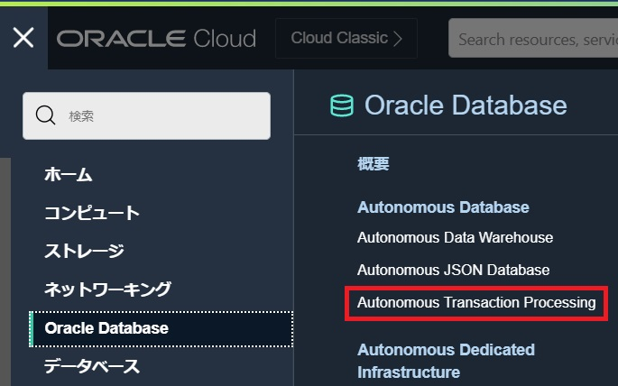
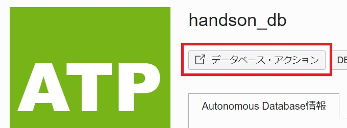
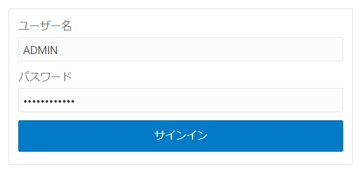

<!--
---
title: "WebLogic Server for OKEにアプリケーションをデプロイしてみよう"
description: "OCIが提供するWebLogic Server for OKEを利用して、JavaEEアプリケーションのコンテナ化を体験していただけるコンテンツです。"
order: "2102"
tags:
---

前提条件
---
  * Oracle Cloudのアカウントを取得済みであること
  * [WebLogic Server for OCIをプロビジョニングしてみよう](/ocitutorials/cloud-native/wls-for-oci-provisioning/)を実施済みであること
  * [WebLogic Server for OKEをプロビジョニングしてみよう](/ocitutorials/cloud-native/wls-for-oke-provisioning/)を実施済みであること

ハンズオンの全体像
---

1. データベースのスキーマを作成
1. WebLogic Server for OCI の環境から移行ファイルを抽出
1. 移行ファイルを編集
1. WebLogic Server for OKE に移行ファイルを適用  

1.データベースのスキーマを作成
---

左上のハンバーガーメニューを展開して、「Oracle Database」から「Autonomous Transaction Processing」を選択します。


データベース・アクションをクリックします。  


「ユーザー名」に`ADMIN`、「パスワード」に`Welcome1234!`と入力します。※セッションの関係で、入力の必要がない場合があります。


「SQL」のパネルをクリックします。  


以下のSQLをワークシートに貼り付け、**F5を押下し**全文を実行し、移行先環境が利用するスキーマを作成します。  
```
-- USER SQL
CREATE USER "DEST" IDENTIFIED BY "Welcome1234!";

-- ADD ROLES
GRANT CONNECT TO DEST;
GRANT RESOURCE TO DEST;
ALTER USER DEST DEFAULT ROLE CONNECT,RESOURCE;

-- ENABLE REST
BEGIN
    ORDS.ENABLE_SCHEMA(
        p_enabled => TRUE,
        p_schema => 'DEST',
        p_url_mapping_type => 'BASE_PATH',
        p_url_mapping_pattern => 'dest',
        p_auto_rest_auth=> TRUE
    );
    commit;
END;
/

-- QUOTA
ALTER USER DEST QUOTA UNLIMITED ON DATA;
```

画面右上、「ADMIN」をクリックし、「サインアウト」をクリック


「サインイン」をクリックし、「ユーザー名」に`DEST`と入力し、「次」をクリックします。  
その後、「パスワード」に`Welcome1234!`と入力し、DESTユーザーでログインします。

「SQL」のパネルをクリックします。  


　   
以下のSQLをワークシートに貼り付け、**F5を押下し**全文を実行。
```
CREATE TABLE "DEST"."TODO_HEAD" 
    (	
        "RID" NUMBER(10,0), 
        "STATUS" NUMBER(2,0), 
        "TITLE" VARCHAR2(100 BYTE), 
        "MEMO" VARCHAR2(1000 BYTE), 
        "IMPORTANCE" NUMBER(2,0), 
        "INCHARGE" NUMBER(10,0), 
        "CREATE_DATE" DATE, 
        "MODIFY_DATE" DATE
    );

INSERT INTO "DEST"."TODO_HEAD"
    (
        "RID", 
        "STATUS", 
        "TITLE", 
        "MEMO", 
        "IMPORTANCE", 
        "INCHARGE", 
        "CREATE_DATE", 
        "MODIFY_DATE"
    ) VALUES (
        0, 
        0,
        'TODO TITLE',
        'TODO MEMO',
        0,
        1000,
        sysdate,
        sysdate
    );
```

2.移行ファイルの抽出
---
WebLogic Deploy Tooling (WDT)を利用して、アプリケーションなどの移行ファイルを移行元環境より抽出します。

### 2.1. WDT をインストールする

コンソール右上、OCI Cloud ShellのアイコンをクリックしてOCI Cloud Shellを開きます。


WDTをダウンロードします。
    
    wget https://github.com/oracle/weblogic-deploy-tooling/releases/download/release-2.3.2/weblogic-deploy.zip

WDTとSSH KeyをSCPで転送します。

    scp -i <SSH Keyのパス> \
    -o ProxyCommand='ssh -i <SSH Keyのパス> \
    -W %h:%p opc@<base-bastion-instanceのパブリックIP>' \
    ~/weblogic-deploy.zip <SSH Key> opc@<base-wls-0のプライベートIP>:~/

以下コマンドを実行し、移行元のWebLogicインスタンス(base-wls-0)にSSHログインします。

    ssh -i <SSH Keyのパス> \
    -o ProxyCommand='ssh -i <SSH Keyのパス> \
    -W %h:%p opc@<base-bastion-instanceのパブリックIP>' \
    opc@<base-wls-0のプライベートIP>

rootユーザーにスイッチします。
    
    sudo su - 

WDTとSSH Keyをoracleユーザーが利用できるようにします。

    mv /home/opc/weblogic-deploy.zip /home/oracle/
    mv <SSH Key> /home/oracle/

    chown oracle:oracle /home/oracle/weblogic-deploy.zip
    chown oracle:oracle <SSH Key>

oracleユーザーにスイッチします。
    
    sudo su - oracle

WDTをunzipします。

    unzip weblogic-deploy.zip

WDTスクリプトの権限変更を行います。
    
    chmod +x weblogic-deploy/bin/*.sh

### 2.2. 移行ファイルを抽出する

以下の`discoverDomain`コマンドを利用して、移行ファイルの抽出を行います。
```
weblogic-deploy/bin/discoverDomain.sh \
    -oracle_home $MW_HOME \
    -domain_home $DOMAIN_HOME \
    -archive_file ./source.zip \
    -model_file ./source.yaml \
    -variable_file source.properties \
```

3.移行ファイルの編集とアップロード
---
Cloud Shell上のVimなど任意のテキストエディタで、移行ファイル(WDTモデルファイル)を編集します。  

### 3.1. source.propertiesファイルの編集
`source.properties`は、モデルファイル(`source.yaml`)で利用する変数をまとめたファイルです。
`JDBC.Handson.user.Value`は`DEST`と入力します。

```
JDBC.Handson-DB.user.Value=DEST
```

### 3.2. source.yamlファイルの編集
`source.yaml`は、WebLogicドメインをモデル化したファイルです。

`domainInfo`フィールドと`topology`フィールドをすべて削除します。


`resouces`フィールドと`appDeployments`フィールドのみが残ります。 


`Handson`フィールド下の`Target`は`base_cluster`を`demo00_cluster`と変更します。
```yaml
resources:
    JDBCSystemResource:
        Handson DB:
            Target: demo00-cluster #変更
```
`TodoApp-0.0.1-SNAPSHOT`フィールド下の`Target`は`base_cluster`を`demo00_cluster`と変更します。
```yaml
appDeployments:
    Application:
        TodoApp-0.0.1-SNAPSHOT:
            SourcePath: wlsdeploy/applications/TodoApp-0.0.1-SNAPSHOT.war
            ModuleType: war
            Target: demo00-cluster #変更
```

`StagingMode: stage`を`appDeployments`内の`Target: demo00_cluster`の下に追加します。
```yaml
appDeployments:
    Application:
        TodoApp-0.0.1-SNAPSHOT:
            SourcePath: wlsdeploy/applications/TodoApp-0.0.1-SNAPSHOT.war
            ModuleType: war
            Target: demo00-cluster
            StagingMode: stage #追加
```

`resources`の`JDBCDriverParams`以下を書き換えます。
```yaml
resources:
### 中略 ###
                JDBCDriverParams:
                    DriverName: oracle.jdbc.OracleDriver
                    PasswordEncrypted: '@@SECRET:@@ENV:DOMAIN_UID@@-datasource-secret:password@@' #変更
                    URL: '@@SECRET:@@ENV:DOMAIN_UID@@-datasource-secret:url@@' #変更
                    Properties:
                        oracle.net.tns_admin:
                            Value: /u01/shared/atp_wallet #変更
                        user:
                            Value: '@@PROP:JDBC.Handson-DB.user.Value@@' #変更
                        javax.net.ssl.keyStore: #追加
                            Value: /u01/shared/atp_wallet/keystore.jks #追加
                        javax.net.ssl.keyStoreType: #追加
                            Value: JKS #追加
                        javax.net.ssl.keyStorePassword: #追加
                            Value: '@@SECRET:@@ENV:DOMAIN_UID@@-keystore-secret:password@@' #追加
                        javax.net.ssl.trustStore: #追加
                            Value: /u01/shared/atp_wallet/truststore.jks  #追加
                        javax.net.ssl.trustStoreType:  #追加
                            Value: JKS #追加
                        javax.net.ssl.trustStorePassword:  #追加
                            Value: '@@SECRET:@@ENV:DOMAIN_UID@@-keystore-secret:password@@' #追加
                        oracle.jdbc.fanEnabled:
                            Value: false
                        oracle.net.ssl_version:
                            Value: '1.2'
                        oracle.net.ssl_server_dn_match:
                            Value: true
```

### 3.3. 移行ファイルをアップロードする

以下のファイル(移行ファイルと[WebLogic Server for OCIをプロビジョニングしてみよう](/ocitutorials/cloud-native/wls-for-oci-provisioning/)で取得したWallet)をWebLogic Server for OKE プロビジョニング時に作成されたファイル・ストレージにアップロードします。
- `source.properties`
- `source.yaml`
- `source.zip`
- `Wallet_handsonDB.zip`
    
    scp -o ProxyCommand="ssh -W %h:%p opc@<Bastion_Instance_Public_IP>" \
    source.* Wallet_handsonDB.zip opc@<Admin_Instance_Private_IP>:/u01/shared/

`<Bastion_Instance_Public_IP>`と`<Admin_Instance_Private_IP>`はOCIの管理コンソールから確認ができます。  
Computeインスタンスの一覧、もしくは
`開発者サービス -> リソース・マネージャ -> ジョブ -> 対象のジョブ -> 出力`  
から確認が可能です。

4.WebLogic Server for OKE に移行ファイルを適用
---

### 4.1. Walletをファイル・ストレージ上に展開

AdminインスタンスにSSHログインします。`<private_key>`はプロビジョニング時に指定したものを利用してください。
    
    ssh -i <private_key> opc@<Admin_Instance_Private_IP> \
    -o ProxyCommand="ssh -W %h:%p -i <private_key> opc@<Bastion_Instance_Public_IP>"

SSHでログインしたら、以下のコマンドを実行してください。`<ATPのOCID>`はOCIコンソールから確認が可能です。
    
    unzip /u01/shared/Wallet_handsonDB.zip -d /u01/shared/atp_wallet

### 4.2. DB接続用Secretの作成

以下2つのコマンドを実行し、3.2の手順でyamlに設定したDB接続用のSecretを作成します。
    
    kubectl create secret generic demo00-datasource-secret \
    --from-literal=password=Welcome1234! \
    --from-literal=url=jdbc:oracle:thin:@handsondb_tp \
    -n demo00-ns

    
    kubectl create secret generic demo00-keystore-secret \
    --from-literal=password=Oracle1234! \
    -n demo00-ns

### 4.3. UpdateDomainジョブの実行

`update domain`ジョブから`パラメータ付きビルド`を選択します。
パラメータは以下のように入力し、「ビルド」ボタンをクリックします。

- Domain_Name : ドメイン名
- Base Imageの欄は何も選択しないでください
- Archive_Source : Shared File System
- Archive_File_Location : /u01/shared/source.zip
- Domain_Model_Source : Shared File System
- Model_File_Location : /u01/shared/source.yaml
- Variable_Source : Shared File System
- Variable_File_Location : /u01/shared/source.properties

### 4.4. アプリケーションの動作確認を行う
`<パブリックLBのIP>`を置き換えて、アプリケーションにアクセスします。
    
    https://<パブリックLBのIP>/todo    

IPはOCIのコンソールや、kubectlで確認することができます。
自動で構成されたパブリックIPは左上ナビゲーション・メニュー -> ネットワーキング -> ロード・バランサから確認できます。


kubectlで確認する場合は、管理ホストで以下のコマンドを実行してください。
    
    kubectl -n wlsoke-ingress-nginx get svc

-->