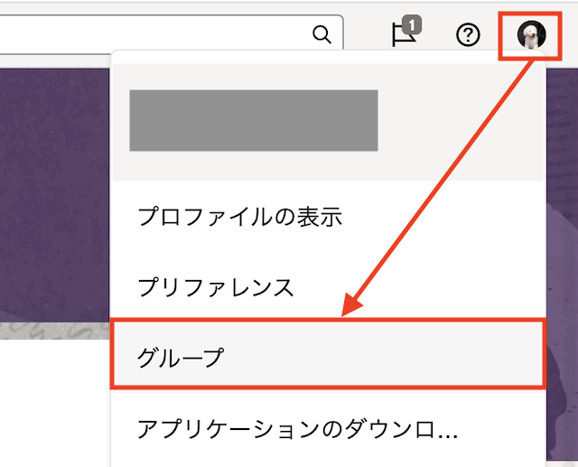
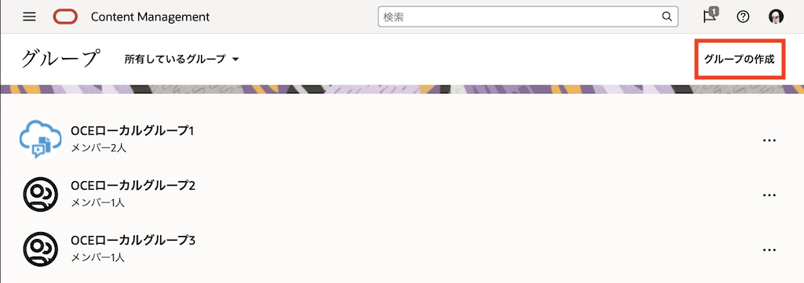
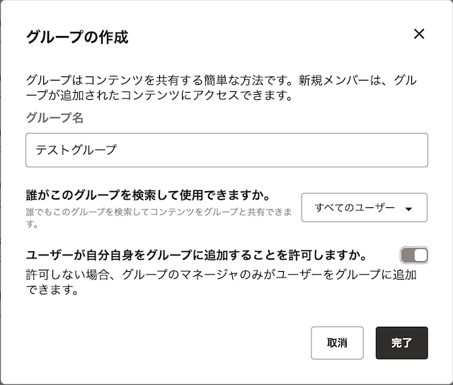
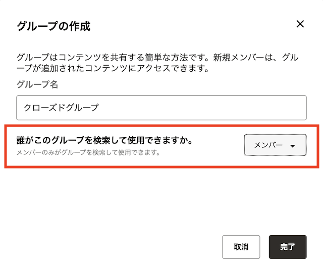
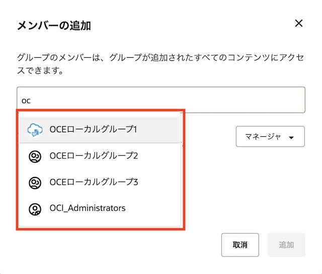

**目次に戻る**: [Oracle Content Management のファイル共有機能を使ってみよう【初級編】](../using_file_sharing)

複数のユーザーをグループとしてまとめることで、フォルダへのメンバー追加などがとても簡単にできるようになります。

例えば、**複数のプロジェクト共有フォルダ** へのアクセス権限設定で利用されている **グループX** があります。このグループXに新規ユーザー（Aさん）を追加するだけで、複数のプロジェクト共有フォルダへのアクセス権限設定を **「まとめて」「抜け漏れなく」「必要最小限の操作」** で付与されます。

同様に、プロジェクトメンバーであるBさんが人事異動によりこのプロジェクトから外れる場合も、グループXからBさんを外す（グループXから削除する）だけで、複数のプロジェクト共有フォルダへのアクセス権限を **「まとめて」「抜け漏れなく」「必要最小限の操作」** で削除できます。

このようにグループを活用することで、各種リソースに対するアクセス権限割り当てなどを効率化できます。

OCMで利用できるグループは2種類あります

+ **IDCS グループ**
    + Oracle Identity Cloud Service(IDCS)で作成・管理するグループ
    + IDCS の管理コンソールを利用して管理します。詳細は、IDCS のマニュアルを参照
        + [Manage Oracle Identity Cloud Service Groups](https://docs.oracle.com/en/cloud/paas/identity-cloud/uaids/manage-oracle-identity-cloud-service-groups1.html)
    + 想定されるユースケース
        + お客様環境内の Active Directory で管理する組織情報を利用したアクセス権限設定を行う場合
        + OCM インスタンスを利用するユーザーに対して、デフォルトでアクセス権限を与えたい場合(就業規則など全従業員がアクセスする全社共有フォルダ)

+ **グループ**
    + OCM インスタンス内部で作成・管理されるグループ
    + OCM のグループメニューより作成・管理（後述）
    + 想定されるユースケース: プロジェクトや作業グループ、チームなど、特定の目的のために構成されたグループ単位で権限設定を行う場合

このチュートリアルでは、**OCMインスタンス内部で管理するグループ(=グループ)** について説明します。

グループには3つの考え方があり、目的や用途で使い分けることができます

| |パブリック・グループ|プライベート・グループ|クローズド・グループ|
|-|-|-|-|
| **グループの表示・閲覧** |パブリックグループの検索より誰でも確認可|パブリックグループの検索より誰でも確認可|グループのメンバーのみ確認可 グループに参加していないメンバーは表示/閲覧不可|
| **メンバー追加** |自分自身でグループに参加可|マネージャ権限を持つメンバーのみ可|マネージャ権限を持つメンバーのみ可|


この文書は、2021年11月時点での最新バージョン(21.11.1)を元に作成されてます。   チュートリアル内の画面ショットについては、現在のコンソール画面と異なっている場合があります。   


**前提条件**
- [Oracle Content Management インスタンスを作成する](../create_oce_instance)
- OCM の利用ユーザーに OCM インスタンスの **CECStandardUser** もしくは **CECEnterpriseUser** アプリケーション・ロールが付与されていること

 

# 1. グループを作成する
## 1.1 パブリックグループを作成する

1. 右上のユーザーアイコンをクリックし、**「グループ」** をクリックします。

    

1. **「グループの作成」** をクリックします。

    

    1. グループ名を入力します。ここでは **テストグループ** を入力します

    1. **「誰がグループを検索して使用できますか？」** を選択します。ここでは **「すべてのユーザー」** を選択します

    1. **「ユーザーが自分自身をグループに追加することを許可しますか？」** を **スイッチON** に設定します

    1. **「完了」** をクリックします。

        

        > **[TIPS]**  
        > この条件で作成すると、すべてのユーザーが検索して使用でき、かつ、ユーザーが自分自身をグループ に登録できるパブリックグループが作成されます

1. テストグループが作成されます。

## 1.2 プライベートグループを作成する

+ プライベートグループを作成する場合は、**「ユーザーが自分自身をグループに追加することを許可しますか？」** を **スイッチOFF** で作成します

    

## 1.3 クローズドグループを作成する

+ クローズドグループを作成する場合は、**「誰がグループを検索して使用できますか？」** で **「メンバー」** を選択し、作成します

    

# 2. パブリック・グループに参加する
## 2.1 パブリック・グループに参加する

1. **グループ→パブリック・グループの検索** を選択します

1. 参加したいパブリック・グループのメニューをクリック→ **「グループに参加」** を選択します

    

## 2.2 パブリック・グループへの参加を取り消す

1. 自分が所属しているパブリック・グループを表示し、**「グループへの参加を取消」** を選択します

    

1. 確認のダイアログが表示されます。**「OK」** をクリックします

# 3. グループにメンバーを追加/削除する

グループへのメンバー追加・削除は、**グループの所有者（グループを作成したユーザー）** もしくは、**グループにマネージャとして参加しているユーザー** が実行できます。

グループに **メンバー** として参加するユーザーは、メンバーの追加・削除はできません

なお、追加メンバーを選択する際に、**既存のグループ** や **IDCSグループ** を指定することもできます（グループの入れ子設定ができます）

1. グループのメニューをクリック→ **「メンバーの追加」** を選択します

    

    1. 追加メンバーを検索し、選択します

    1. 「これらのユーザーは何を実行できますか？」で、**メンバー** もしくは **マネージャ** を選択します（ここではメンバーを選択）

    1. **「追加」** をクリックします

        

1. グループにメンバーが追加されます

1. メンバーを **削除** する場合は、削除するメンバー（ここでは「OCEローカルグループ2」）のメニューをクリック→**「削除」** を選択します

    

1. 確認のダイアログが表示されます。**「はい」** をクリックします

1. グループからメンバーが削除されます

 

以上でこのチュートリアルは終了です。

**目次に戻る**: [Oracle Content Management のファイル共有機能を使ってみよう【初級編】](../using_file_sharing)
