**目次に戻る**: [Oracle Content Management のファイル共有機能を使ってみよう【初級編】](../using_file_sharing)

ローカル環境から、クラウド上の OCM にファイルを登録する方法は複数あります。ここでは、**圧縮ファイル（ZIP形式のファイル）** を利用し、複数のフォルダやファイルをまとめて登録・更新する方法を紹介します


この文書は、2022年4月時点での最新バージョン(22.4.3)を元に作成されてます。   チュートリアル内の画面ショットについては、現在のコンソール画面と異なっている場合があります。   


**前提条件**
- [Oracle Content Management インスタンスを作成する](../create_oce_instance)
- OCM の利用ユーザーに OCM インスタンスの **CECStandardUser** もしくは **CECEnterpriseUser** アプリケーション・ロールが付与されていること
- **ADMINISTRATION:システム→一般→ファイルとアセットの制限** で、ファイル・タイプ（拡張子）で **zip** が登録されていないこと（ブロックされていないこと）

 

# 1. 圧縮ファイルを準備する

- クライアント環境で圧縮ファイルを準備します。ここでは以下の階層のフォルダおよびファイルを用意し、圧縮します。圧縮後のファイル名は **「テストフォルダアーカイブ.zip」** です

  ~~~
  テストフォルダ
      サブフォルダ2
          テスト文書2.docx
      サブフォルダ3
          テスト文書3.docx
      テスト文書1.docx
  ~~~

  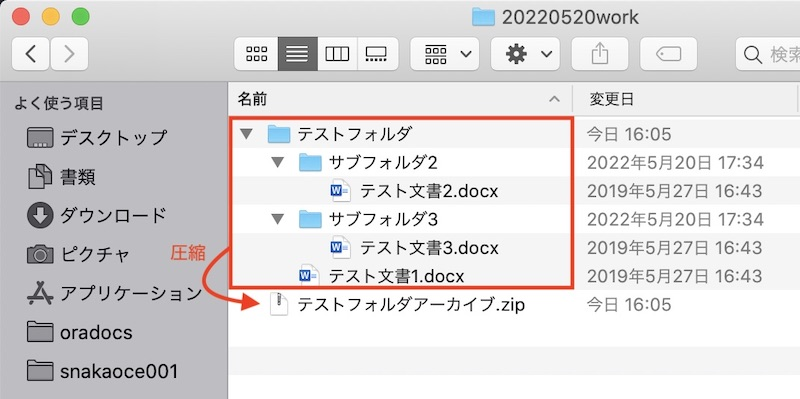

  > **【注意事項】**  
  > 圧縮ファイルを作成する際は、UTF-8形式で作成します。UTF-8以外の形式（例えばShift-JIS）で作成された圧縮ファイルの場合、OCM内での解凍処理がエラーとなります。詳細は [Extract Multiple Files From A Compressed File](https://docs.oracle.com/en/cloud/paas/content-cloud/managing-content/extract-multiple-files-compressed-file.html)、および [Doc ID 2863638.1](https://support.oracle.com/epmos/faces/DocumentDisplay?id=2863638.1) をご確認ください

- 圧縮ファイル（ここでは `テストフォルダアーカイブ.zip`）をOCMのフォルダにアップロードします

 

# 2. 圧縮ファイルをOCM内で解凍する

圧縮ファイルを解凍する時は、いくつかのオプションを選択します。

- **新規フォルダの作成** （`デフォルト`）
- **既存フォルダの選択**
  - 両方のファイル保持（重複時はファイル名を変更して登録）
  - 既存のファイルを置換（重複時は新規リビジョンとして登録）
  - 重複ファイルを無視（重複時は登録しない）

## 2.1 「新規フォルダの作成」を選択して解凍する

この場合、解凍先として指定したフォルダ直下に、圧縮ファイル名（ここでは`テストフォルダアーカイブ`）の新しいフォルダを作成し、その配下に圧縮されたフォルダ・ファイルを解凍します。また、解凍時は、圧縮ファイル作成時の階層を維持します

1. 圧縮ファイル（テストフォルダアーカイブ.zip）→ **「解凍」** をクリックします

    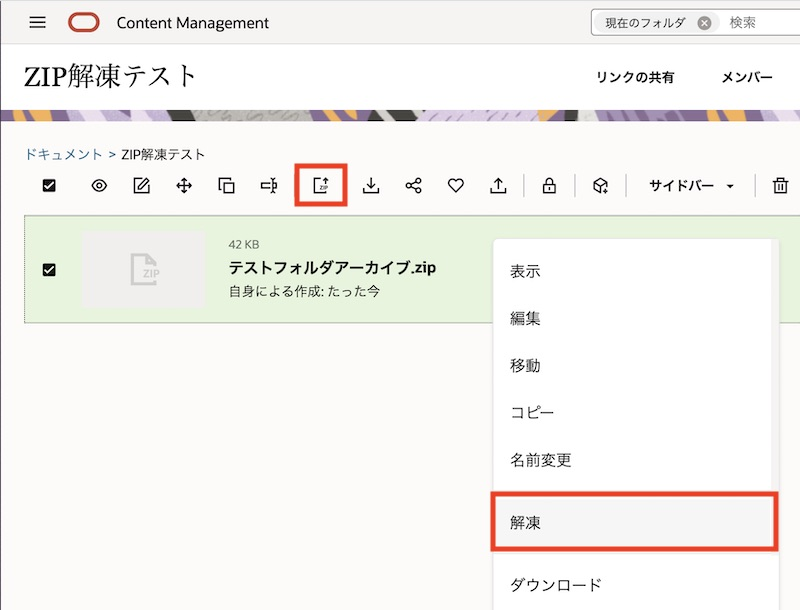

1. **「新規フォルダの作成」** が選択されていることを確認し、解凍先の宛先フォルダを選択します。ここでは、圧縮ファイルが登録されているフォルダ（`ZIP解凍テスト`）を選択し、**「解凍」** をクリックします

    

1. 解凍処理が実行されます。圧縮ファイル名の **「テストフォルダアーカイブ」** フォルダが作成され、その配下に「テストフォルダ」があり、さらにその下に「サブフォルダ2」 「サブフォルダ3」が作成され、それぞれのフォルダ内にファイルが登録されます

    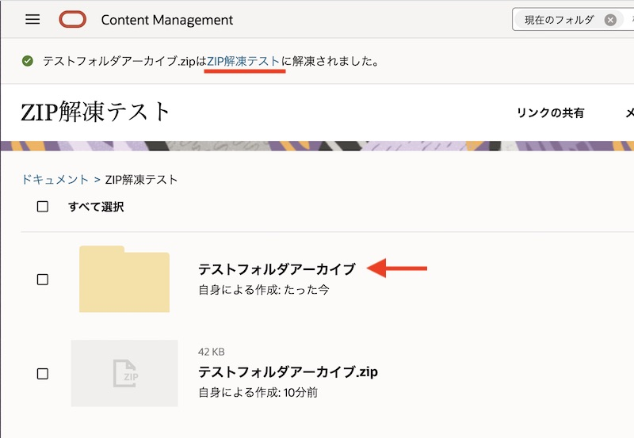

    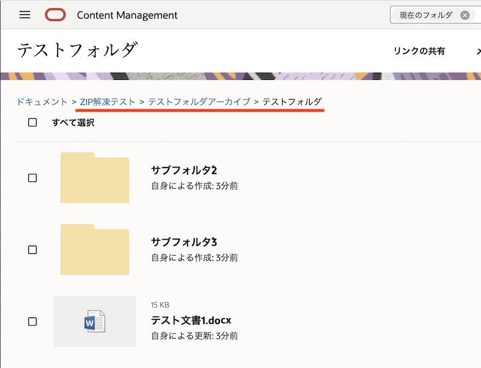

    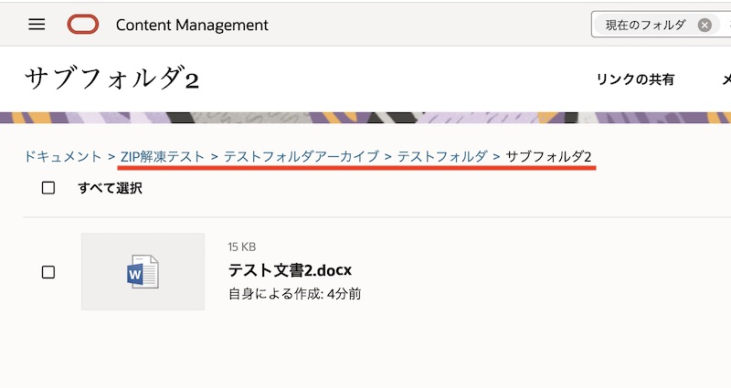

## 2.2 「既存フォルダの選択」→「既存のファイルを置換」を選択して解凍する

この場合、解凍先として指定したフォルダ直下に、圧縮されたフォルダ・ファイルを解凍します。また、解凍時は、圧縮ファイル作成時の階層を維持します。さらに、同じ名前のファイルが存在する場合は、新規リビジョンとして登録されます

1. 圧縮ファイル（テストフォルダアーカイブ.zip）→ **「解凍」** をクリックします

1. **「既存のフォルダの選択」** を選択します

1. 解凍先の宛先フォルダを指定します。ここでは、**「テストフォルダアーカイブ」** を選択し、**「解凍」** をクリックします

    

1. **「既存のファイルを置換」** を選択し、 **「適用」** をクリックします。解凍処理が実行されます

    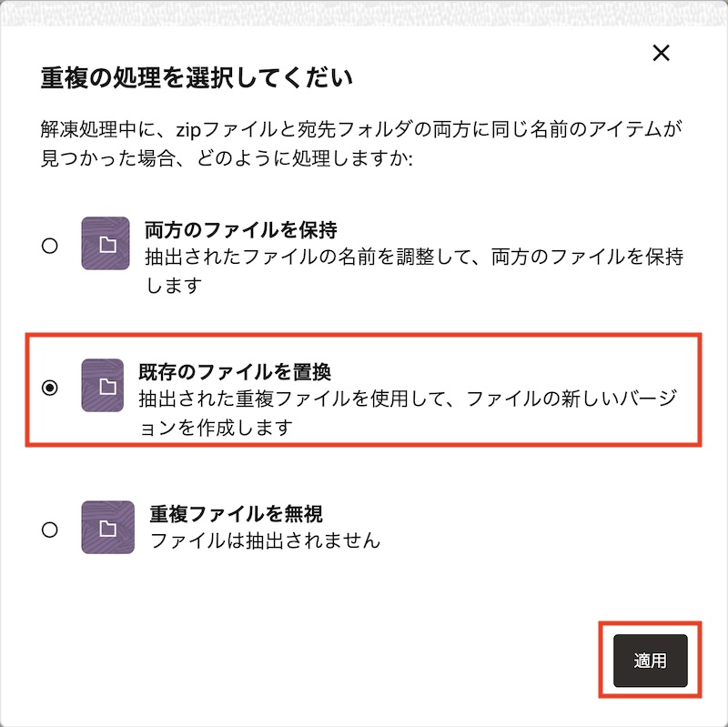

1. **「テストフォルダアーカイブ」** 以下を確認します。フォルダ階層はそのままで、ファイルは新規バージョンが追加されている（`テスト文書1.docx`が`v2`となっている）ことを確認します

    

    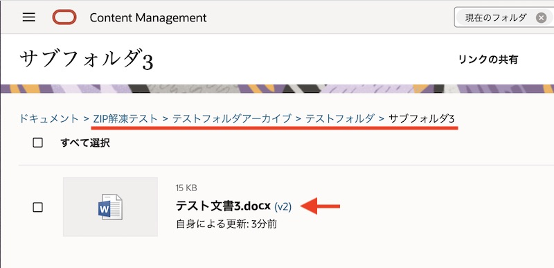

## 2.3 「既存フォルダの選択」→「重複ファイルを無視」を選択して解凍する

1. 2.2 と同じ手順を繰り返し、圧縮ファイルを解凍します。この際 **「既存のフォルダの選択」** を選択し、宛先フォルダは、**「テストフォルダアーカイブ」** を選択します

1. 重複の処理で **「重複ファイルを無視」** を指定し、**「適用」** をクリックします。解凍処理が実行されます

    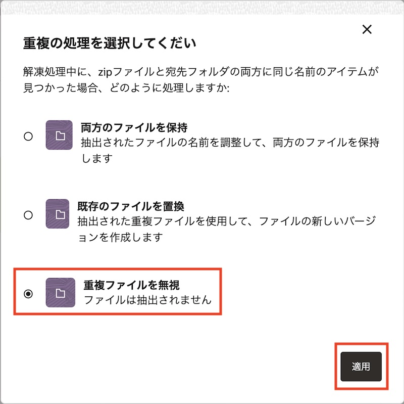

1. 解凍先を確認します。ファイルは新規リビジョンの登録や別名の新規ファイルの登録が **されていない** （`テスト文書1.docx`が`v2`のまま）ことを確認します

    

## 2.4 「既存フォルダの選択」→「両方のファイルを維持」を選択して解凍する

1. 2.2 と同じ手順を繰り返し、圧縮ファイルを解凍します。この際 **「既存のフォルダの選択」** を選択し、宛先フォルダは、**「テストフォルダアーカイブ」** を選択します

1. 重複の処理で **「両方のファイルを維持」** を指定し、**「適用」** をクリックします。解凍処理が実行されます

    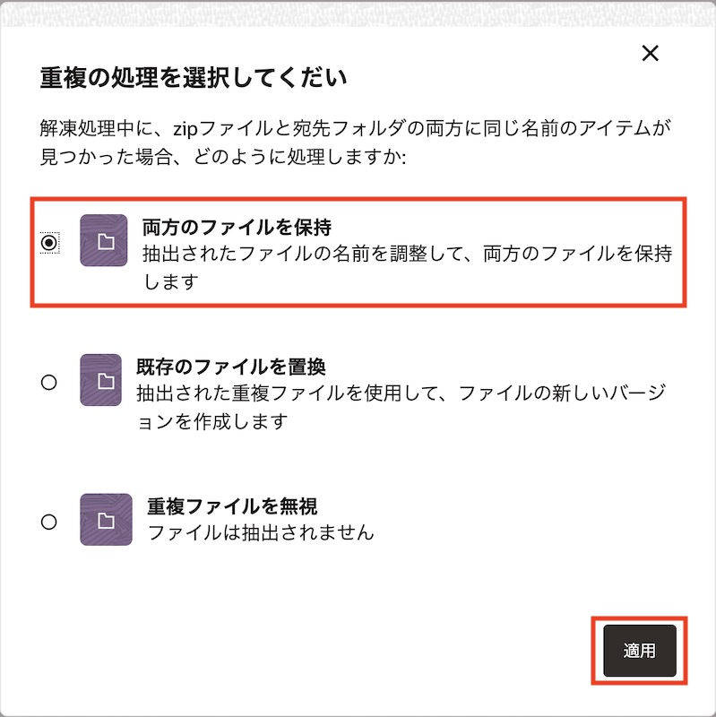

1. 解凍先を確認します。既存のファイル（`テスト文書1.docx`）はそのままに、別名に変更された新しいファイル（`テスト文書1(2).docx`）が登録されていることを確認します

    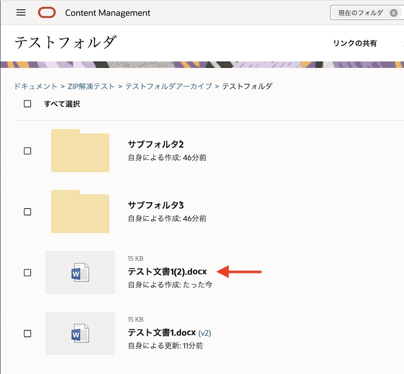

    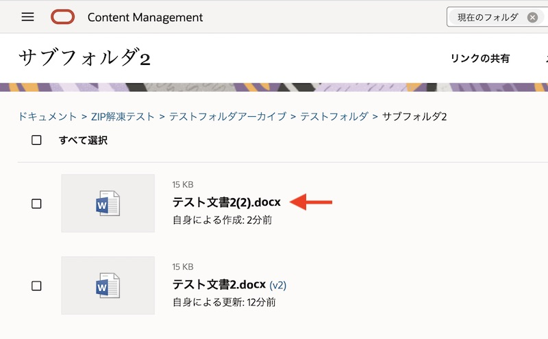

 

以上でこのチュートリアルは終了です。

**目次に戻る**: [Oracle Content Management のファイル共有機能を使ってみよう【初級編】](../using_file_sharing)
