**目次に戻る**: [Oracle Content Management のファイル共有機能を使ってみよう【初級編】](../using_file_sharing)

**外部ユーザー(External User)** とは組織外のユーザーのことで、OCMユーザーから招待された(=アクセス権限が付与された)フォルダおよびその配下でのみファイル・フォルダ操作ができます

# 説明

外部ユーザーと通常のOCMユーザーの主な違いは以下の表の通りです
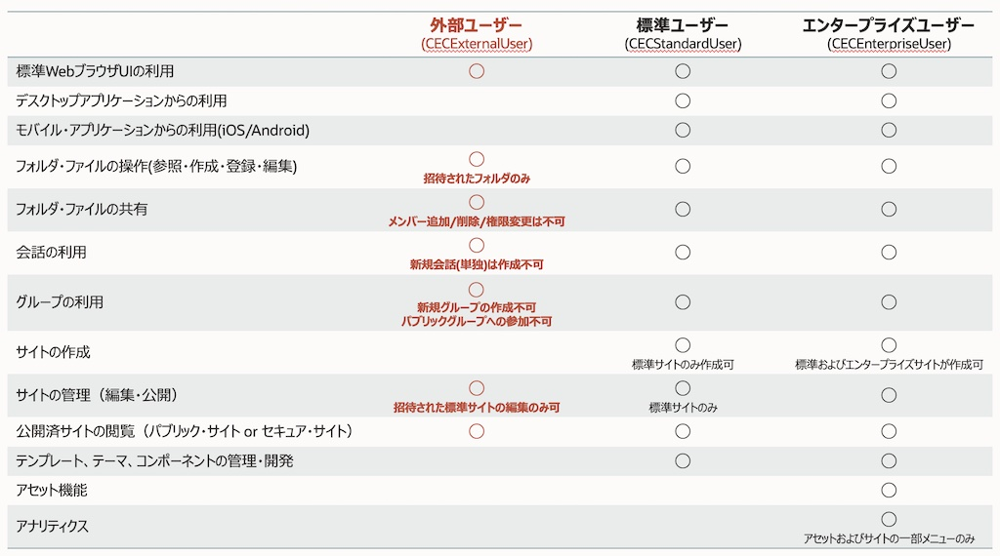

**外部ユーザー利用時の注意点**
- OCMの[プライベート・インスタンス](https://docs.oracle.com/en/cloud/paas/content-cloud/administer/create-private-instance-using-fastconnect.html#GUID-0A7538DD-E5EB-465B-8E44-93803C566DAF)では、外部ユーザーはサポートされていません
- 外部ユーザーを利用する前に、サービス管理者が外部ユーザー機能の有効化が必要です。有効化の手順は[Oracle Content Managementサービス管理者向け作業ガイド](../ocm_admin_guide)の[2.1.2 外部ユーザーの設定](../ocm_admin_guide/#212-外部ユーザーの設定)をご確認ください
- 外部ユーザーを招待できるのは、**CECStandardUser**もしくは**CECEnterpriseUser**アプリケーション・ロールが付与されたユーザーのみです。外部ユーザーが、別の外部ユーザーを招待することはできません
- 外部ユーザー招待時に付与できるアクセス権限は、**参照者(Viewer)**、**ダウンロード実行者(Downloader)**、**コントリビュータ(Contributor)** の3つです。マネージャ(Manager)は付与できません
- 外部ユーザーは、**OCMのWebブラウザ・インタフェースのみ**利用できます。デスクトップ・アプリケーションおよびモバイル・アプリケーションは利用できません


この文書は、2023年6月時点での最新バージョン(23.5.2)を元に作成されてます。   チュートリアル内の画面ショットについては、現在のコンソール画面と異なっている場合があります。   


**前提条件**
- OCMインスタンスが作成済であること(以下の作成手順参照)
    - [OCI IAM Identity Domain環境でOracle Content Managementインスタンスを作成する](../create_ocm_instance_IdentityDomain)
    - [Oracle Content Management インスタンスを作成する](../create_oce_instance)
- OCMの利用ユーザーにOCMインスタンスの**CECStandardUser**もしくは**CECEnterpriseUser**アプリケーション・ロールが付与されていること
    - [OCI IAM Identity Domain環境でOracle Content Managementインスタンスの利用ユーザーを作成する](../create_identitydomain_group_user)
    - [Oracle Content Management インスタンスの利用ユーザーを作成する](../create_idcs_group_user)をご確認ください。

 

# 1. フォルダに外部ユーザーを招待する

## 1.1 アカウント未作成の外部ユーザーを招待する(新規招待)

Identity Domains(もしくはIDCS)にアカウントが作成されていない組織外のユーザーを、外部ユーザーとして新規に招待します

1. OCMにサイン・インし、**ドキュメント**を開きます

1. 外部ユーザーを招待するフォルダを作成します(ここでは`000_プロジェクト共有`を作成します)

1. フォルダを選択し、**メンバー**をクリックします

1. `外部ユーザーにフォルダ・アクセスおよびメンバーシップを許可します`が有効であることを確認し、**メンバーを追加**をクリックします
    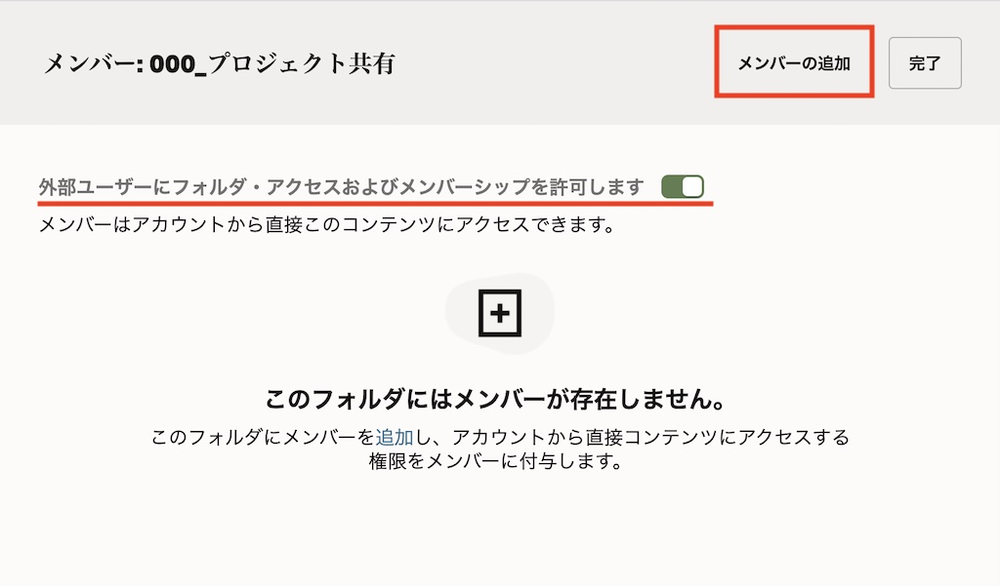

1. 招待する外部ユーザーの完全なメールアドレス(例:`white.smith@example.com`)を入力します

1. **First name(姓)**、**Last name(名)** を入力し、**Country code(国コード)** を選択します

1. `これらのユーザーは何を実行できますか`で、招待する外部ユーザーに付与するアクセス権限を選択します。ここでは**コントリビュータ**権限を付与します

1. **Invite(招待)** をクリックします
    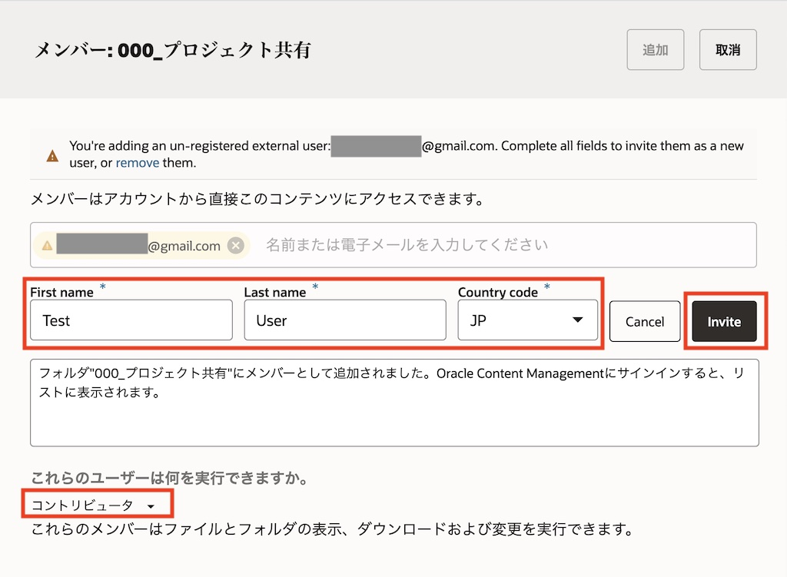

1. 最後に**追加**をクリックします
    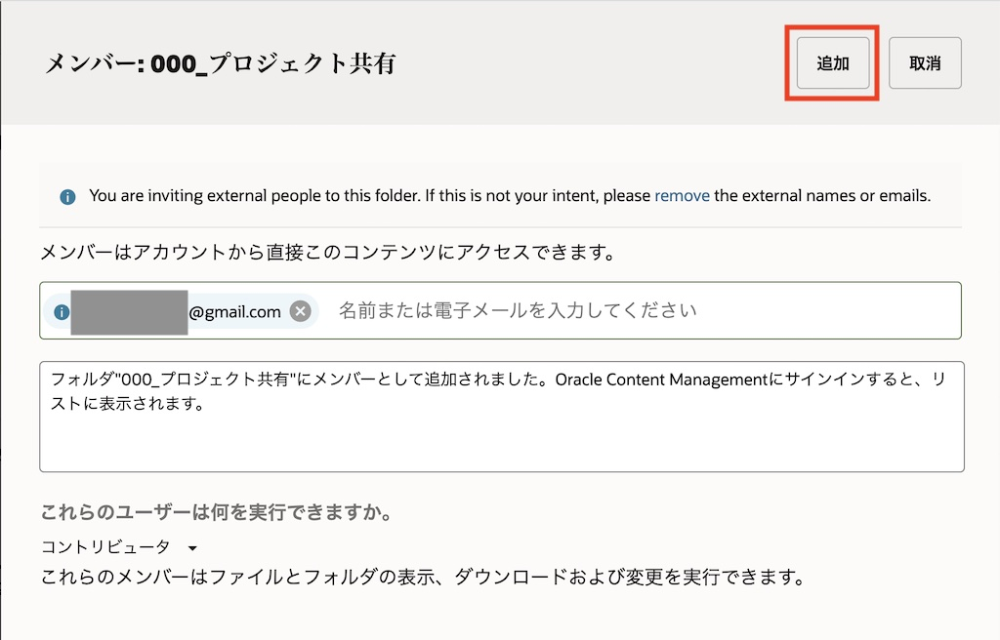

1. 外部ユーザーの招待が完了します
    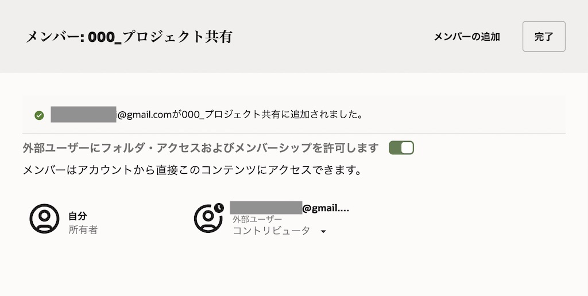

1. フォルダに招待した外部ユーザーのメールアドレスに、通常のユーザー作成時と同じくアカウント・アクティベーションのメールが送信されます。受信メールの**Activate Your Account**をクリックし、アクティベーションを実行します

    > **【TIPS】**  
    > アカウント・アクティベーションには**有効期限**があります。メール受信後は、有効期限内にアクティベーションを実行してください

1. OCMから自動送信されるWelcomeメールに従い、**外部ユーザー**としてOCMインスタンスにサイン・インします。招待されたフォルダにアクセスできることを確認します
    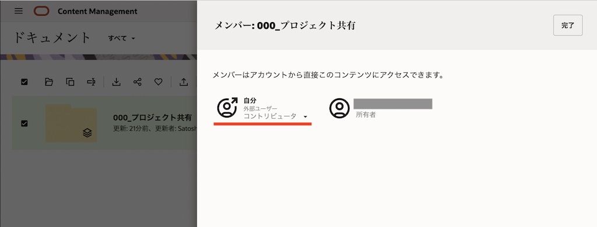
    
    > **【TIPS】**  
    > 外部ユーザー招待時に設定したCountry code(国コード)で、Welcomeメールの言語が変わります。例えば、Country codeを**JP(日本)**と設定した場合は**日本語**のWelcomeメールが送信されます

1. 最上位階層に個人フォルダを**作成できない**ことを確認します
    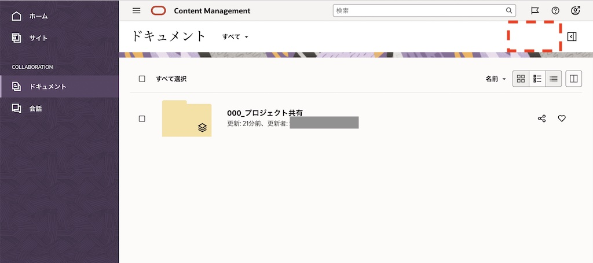

    > **【TIPS】**  
    > 外部ユーザーはOCMユーザーに招待されたフォルダ配下でのみファイルやフォルダを操作できますが、最上位階層に個人フォルダ(=自分が所有者のフォルダ)は作成できません


外部ユーザーとして招待されたユーザーは、**IDCS(Identity Domains)にユーザー情報が自動登録**されます。加えて、OCMインスタンスの**CECExternalUserアプリケーション・ロールが自動付与**されます  


## 1.2 アカウント作成済の外部ユーザーを招待する(既存外部ユーザーの招待)

Identity Domains(もしくはIDCS)にアカウントが作成済で、かつCECExternalUserアプリケーション・ロールが付与済の外部ユーザーを、フォルダにメンバー追加します

1. OCMにサイン・インし、**ドキュメント**を開きます

1. 外部ユーザーを招待するフォルダを選択し、**メンバー**をクリックします

1. `外部ユーザーにフォルダ・アクセスおよびメンバーシップを許可します`が有効であることを確認し、**メンバーを追加**をクリックします

1. 招待する外部ユーザーの完全なメールアドレス(例:`white.smith@example.com`)を入力します。アカウント作成済の場合のみ、追加する外部ユーザーの候補が表示されます
   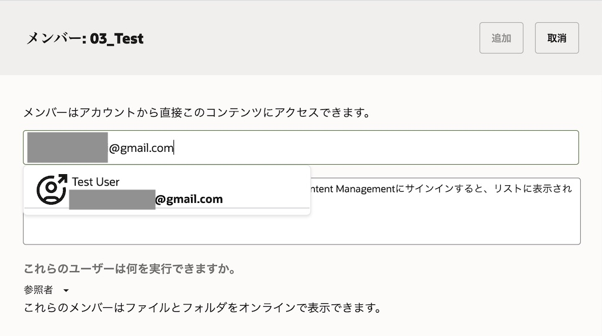

1. `これらのユーザーは何を実行できますか`で、招待する外部ユーザーに付与するアクセス権限を選択します。ここでは**参照者**権限を付与します

1. **追加**をクリックします

1. 招待された外部ユーザーでOCMインスタンスにアクセスします。招待されたフォルダにアクセスできることを確認します
   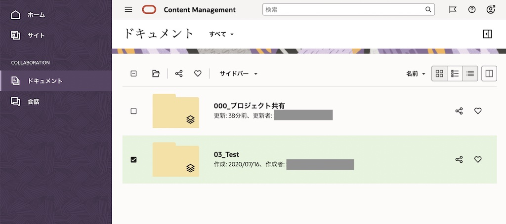

 

# 2. 外部ユーザーをフォルダから削除する

1. OCMにサイン・インし、**ドキュメント**を開きます

1. 外部ユーザーを削除するフォルダを選択し、**メンバー**をクリックします

1. 外部ユーザーに付与された権限(ここでは**コントリビュータ**)をクリックし、**削除**を選択します
   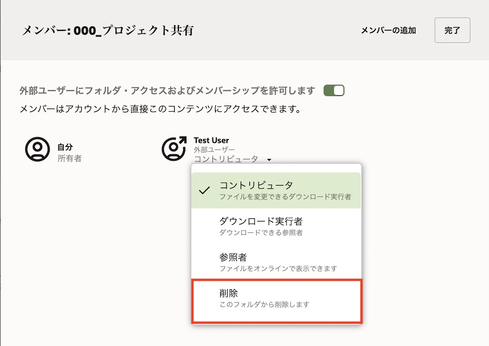

1. 確認のダイアログが表示されます。**はい**をクリックします

1. **完了**をクリックします

1. 外部ユーザーでOCMインスタンスにアクセスします。削除されたフォルダに**アクセスできない**ことを確認します
   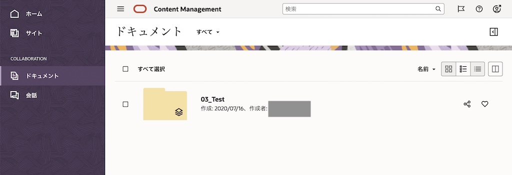


フォルダから削除された外部ユーザーのアカウントは、**IDCS(Identity Domains)に登録されたまま**となります。今後の利用が想定されない場合は、IDCS(Identity Domains)の管理者に依頼し、**外部ユーザーのアカウント情報の削除**を推奨します 


 

以上でこのチュートリアルは終了です。

**目次に戻る**: [Oracle Content Management のファイル共有機能を使ってみよう【初級編】](../using_file_sharing)
