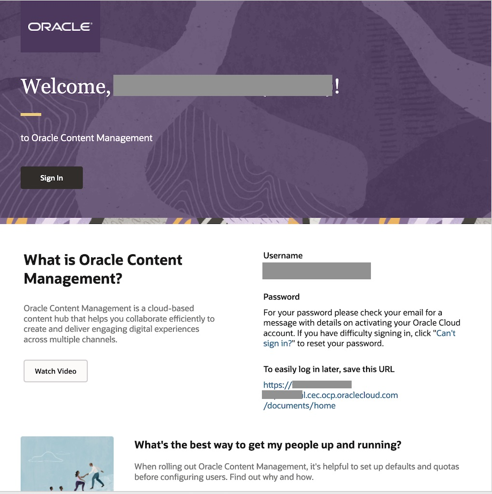
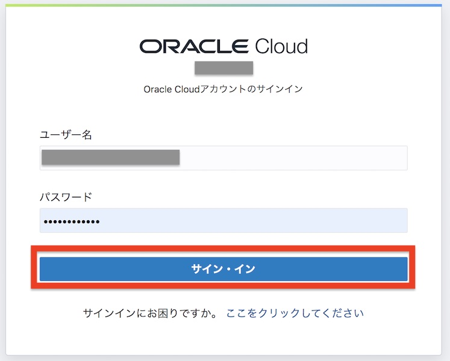
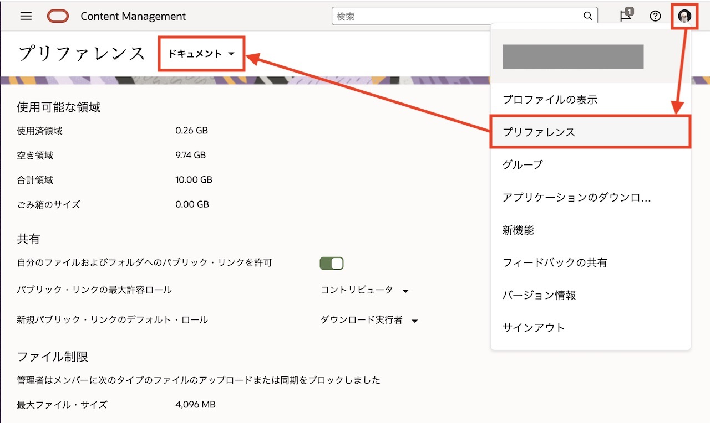
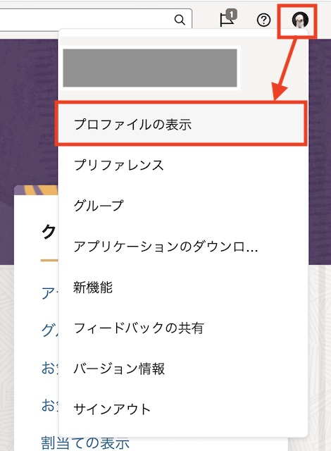
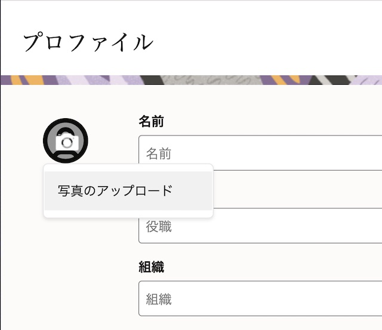

**目次に戻る**: [Oracle Content Management のファイル共有機能を使ってみよう【初級編】](../using_file_sharing)

まず最初に OCM インスタンスにサインインします。次に、OCM を使い始めるにあたり、自分が利用可能な容量を確認します。

最後に、プリファレンスやプロファイルを設定し、自分が使いやすいようにカスタマイズします


この文書は、2021年11月時点での最新バージョン(21.11.1)を元に作成されてます。   チュートリアル内の画面ショットについては、現在のコンソール画面と異なっている場合があります。   


**前提条件**
- [Oracle Content Management インスタンスを作成する](../create_oce_instance)
- OCM の利用ユーザーに OCM インスタンスの **CECStandardUser** もしくは **CECEnterpriseUser** アプリケーション・ロールが付与されていること

 

# 1. OCM インスタンスにサインインする

## 1.1 OCM ホームを開く

1. OCM インスタンスにサインインします。OCM インスタンスの URL は、サービス管理者によるユーザー追加時に自動送信されるメールに記載されます  

      

    **通知メールの説明**

    |項目|説明|
    |---|---|
    |差出人| *Oracle Content Management \<no-reply@oracle.com\>* |
    |件名| *Welcome to Oracle Content Management* |
    |本文| 英語のみ。本文中の **TO EASILY LOG IN LATER, SAVE THIS URL** もしくは **SIGN IN** を確認します |

1. 通知メールのURLをクリックし、OCM インスタンスにアクセスします。なお、OCM インスタンスのURLの形式は以下の通りです。

    ~~~
    https://<OCEInstance>-<CloudAccount>.cec.ocp.oraclecloud.com/documents/home
    <OCEInstance>:  OCEインスタンス名
    <CloudAccount>: クラウドアカウント名（テナンシー名）
    ~~~

1. ユーザーIDとパスワードを入力し、**「サイン・イン」** をクリックします

    

    > **[TIPS]**  
    > パスワードを忘れてしまった場合は、サインイン画面下部の **「ここをクリックしてください」** をクリックし、パスワードの再設定をしてください

1. OCM のホーム画面が開きます

    

## 1.2 プリファレンスの確認と変更

プリファレンスより、自分に割り当てられた使用可能な容量を確認できます。また、プリファレンスをデフォルト設定から変更し、自分が使いやすいように変更します。

1. このインスタンスで自分が使用可能な容量を確認します。**右上のユーザーアイコン→プリファレンス→ドキュメント** をクリックします。

1. 「使用可能な領域」の「空き領域」が現在利用可能な容量となります（この場合 9.74GB が使用可能な容量です）

    

    > **[MEMO]**  
    > ユーザーへの割当て容量は、この OCMインスタンスのサービス管理者により管理されます

1. 必要に応じて、プリファレンスのその他の項目を設定・変更します

    + **一般:** 表示言語およびタイムゾーンを設定します

        

    + **通知:** 会話でフラグ設定された場合の通知設定を変更できます

    + **会話:** 会話機能利用時の動作を設定します

    + **ドキュメント:** このインスタンスにおける割当て容量、ファイル制限（登録不可なファイル拡張子および最大ファイルサイズ）を確認できます。また、パブリック・リンク機能に関するデフォルトの動作をカスタマイズできます。なお、サービス管理者により、このインスタンスの全体的な共有ルールが設定されている場合、ここにあるオプションの一部は使用できないことがあります

    + **リンクされたデバイス:** このインスタンスに接続したモバイル端末もしくはデスクトップ・アプリケーションの一覧が表示されます。「取消」をクリックされたデバイスは、接続が取り消され、サインインからやり直しとなります。また、取消しを実行されたデバイスに格納されているすべてのローカル・コンテンツは削除されます

    + **バージョン情報:** このインスタンスのバージョン情報が確認できます

## 1.3 （オプション）プロファイルの変更

~~~
この手順は必須ではありません。
~~~

1. プロファイルを変更する場合は、**ユーザーアイコン→プロファイルの表示** をクリックします

    

1. **「プロファイルの編集」** をクリックし、プロファイル情報を編集します

1. ユーザーアイコンの画像を変更する場合、ユーザー・アイコンをクリックし、**「写真のアップロード」** をクリックします

    

1. ローカル環境より写真を選択し、**「OK」** クリックします

1. プロファイルの編集が完了したら **「更新」** をクリックします

 

以上でこのチュートリアルは終了です。

**目次に戻る**: [Oracle Content Management のファイル共有機能を使ってみよう【初級編】](../using_file_sharing)
