

OCM のアセット管理機能のビジネス・リポジトリを利用し、請求書などの電子ファイルをデジタルアセットとして長期保管する方法をステップ・バイ・ステップで紹介するチュートリアルです。


この文書は、2022年3月時点での最新バージョン(22.3.1)を元に作成されてます。   チュートリアル内の画面ショットについては Oracle Content Management の現在のコンソール画面と異なっている場合があります。   


**前提条件**
- [Oracle Content Management インスタンスを作成する](../create_oce_instance)
- OCM の利用ユーザーに、少なくとも下記4つのOCMインスタンスのアプリケーション・ロールが付与されていること
    - **CECContentAdministrator**
    - **CECDeveloperUser**
    - **CECEnterpriseUser**
    - **CECRepositoryAdminisrrator**

    > **[Memo]**  
    > ユーザーの作成とアプリケーションロールの付与手順は、[Oracle Content Management インスタンスの利用ユーザーを作成する](../create_idcs_group_user) をご確認ください。

 

# 0. 説明

## ビジネスリポジトリ

アセット管理機能のリポジトリには、**ビジネスリポジトリ** と **アセットリポジトリ** の2つのタイプがあります。ビジネスリポジトリに格納されたアセットは、アセットリポジトリに格納されたアセットと区別するため、**ビジネス・アセット** と呼びます

また、ビジネス・リポジトリに格納されたビジネス・アセットは、アセット・リポジトリに格納されたアセットの **1/100** で請求されます。

### (補足)アセットリポジトリとビジネスリポジトリの違い

- アセット・リポジトリ
  - 登録されたコンテンツの呼称は **アセット**
  - 登録されたアセットのWebサイト公開やAPI公開を目的としたリポジトリ
  - リポジトリ機能リリース時(2018年8月)から存在するリポジトリ
  - 1アセット = 1課金対象アセット
- ビジネス・リポジトリ
  - 登録されたコンテンツの呼称は **ビジネスアセット**
  - 登録されたビジネスアセットの保管/アーカイブを目的としたリポジトリ
  - 2021年4月リリース(21.2.2)
  - 100ビジネスアセット = 1課金対象アセット

    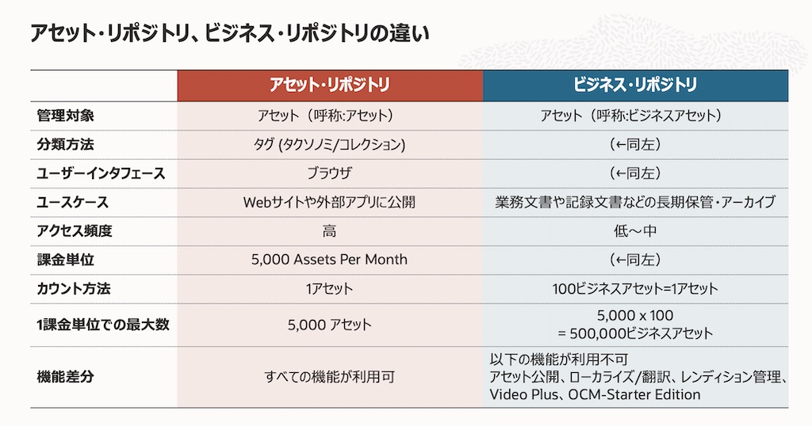

## アセット・タイプとデジタル・アセット・タイプ

アセット・タイプは、アセットに必要な情報（属性）を定義したものです。アセットタイプには、**コンテンツタイプ** と **デジタルアセットタイプ** の2つのタイプが存在します。デジタルアセットタイプは、**格納できるファイルのメディアタイプ** と **ファイルを説明する様々な属性のグループ** のセットです

### (補足)コンテンツタイプとデジタルアセットタイプの違い

- コンテンツタイプ
  - コンテンツ・アイテムに含める情報を指定するフレームワーク
  - 様々なデータ型(テキスト、長いテキスト、日付、数値、ブール、参照、埋込みコンテンツなど)のデータ・フィールドのグループを定義
  - 事前定義済みのコンテンツ・タイプはありません
  - 例）記事、ニュース、製品情報など
- デジタルアセットタイプ
  - デジタル・アセットに含める情報を定義
  - 格納できるファイル・メディア・タイプ（MIMEタイプ=ファイル拡張子）と、ファイルを説明するための様々なデータ型の属性のグループを定義　
  - 画像ファイルに含まれるEXIF情報（日付、時刻、場所、解像度など）も含む
  - 事前定義済みのデジタル・アセット・タイプ（`File` `Image` `Video`）があります
  - 例）プロモーション画像、トレーニング動画、領収書など

    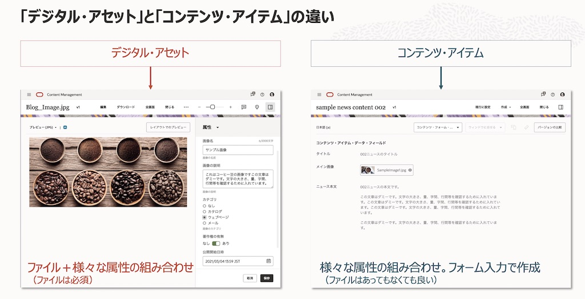

# 1. 準備

OCMのアセット管理機能を利用するための準備作業を行います。ビジネス・リポジトリ、デジタル・アセット・タイプをそれぞれ作成し、関連付けを行います。

## 1.1 ビジネスリポジトリを作成する

1. OCM インスタンスにアクセスします。OCM インスタンスの URL は以下の通りです。

    - *https://\<OCEInstance\>-\<CloudAccount\>.cec.ocp.oraclecloud.com/documents/home*
        - *\<OCEInstance\>*  OCMインスタンス名
        - *\<CloudAccount\>* クラウドアカウント名（テナンシー名）

1. OCM のホーム画面が表示されます。左ナビゲーションのADMINISTRATIONの **「コンテンツ」** をクリックします

1. コンテンツの右隣のメニューで「リポジトリ」が選択されていることを確認し、**「作成」→「ビジネス・リポジトリ」** をクリックします

    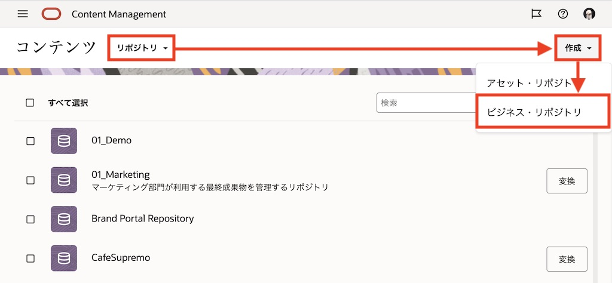

1. プロパティの「名前」に、ビジネスリポジトリの名前を入力します。ここでは **Sample Business Repository** を入力します

1. 言語の「デフォルト言語」で **日本語 (ja)** を選択します

1. 右上の **「保存」** をクリックします

    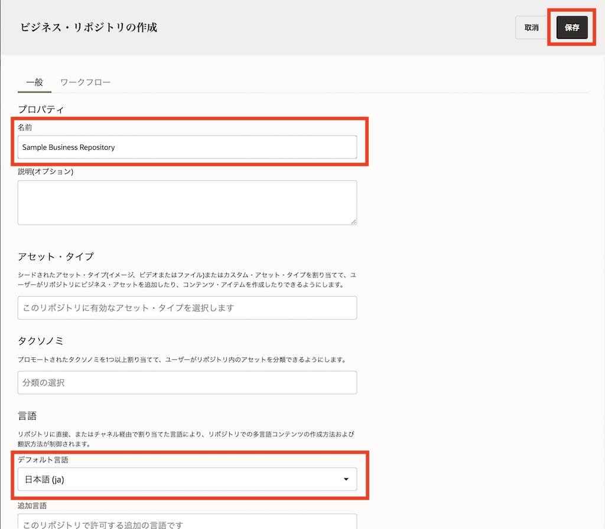

    > **[Memo]**  
    > リポジトリ作成時に「スマート・コンテンツ」を有効（スイッチON）にすると、**AI による画像認識技術を活用した画像の自動タグ付け機能** が動作します。これら自動的に付加されたタグは、**スマート・コンテンツ・タグ（スマート・タグ）** として表示されます。なお、付加されたスマート・コンテンツ・タグの追加・変更・削除はできません

1. 以上でビジネス・リポジトリの作成は完了です

## 1.2 デジタルアセットタイプを作成する

デジタルアセットタイプを作成します。ここでは、pdfなどのファイル拡張子のファイルを登録でき、以下3つのデータ・フィールド（属性）を持つ **請求書(Invoice)** というデジタルアセットタイプを作成します。

|フィールドの名前|表示名|データフィールド|単一/複数|必須|
|-|-|-|-|-|
|vendor_name|取引先企業名|テキスト|単一|ー|
|invoice_amount|取引金額|10進数|単一|ー|
|invoice_date|取引年月日|日付|単一|ー|

1. コンテンツの右横の「リポジトリ▼」をクリックし、プルダウンメニューから **「アセット・タイプ」** を選択します

1. 事前定義済のアセットタイプの **File** を選択し、**「コピー」** をクリックします

    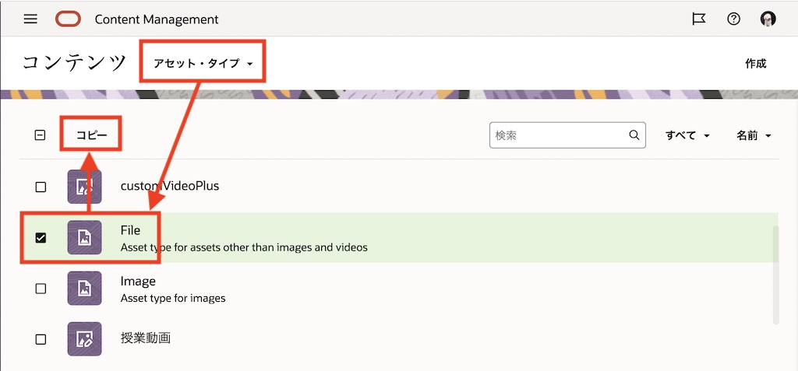

1. File アセットタイプから新しいデジタルアセットタイプ **請求書(Invoice)** を作成します。以下を入力し、**「作成」** をクリックします

    - 名前: **Invoice**
    - 表示名: **請求書**
    - 説明: (任意)

        

1. 請求書アセットタイプが作成されます。「メディア・タイプ」タブに、pdfなどのファイル拡張子があらかじめ選択されていることを確認します

1. 3つの属性を定義します。最初に **取引先企業名（vendor_name）** を定義します

    1. 「データ・フィールド」の **「テキスト」** を、「ここにデータ・フィールドをドロップして定義を追加」にドラッグ&ドロップします

        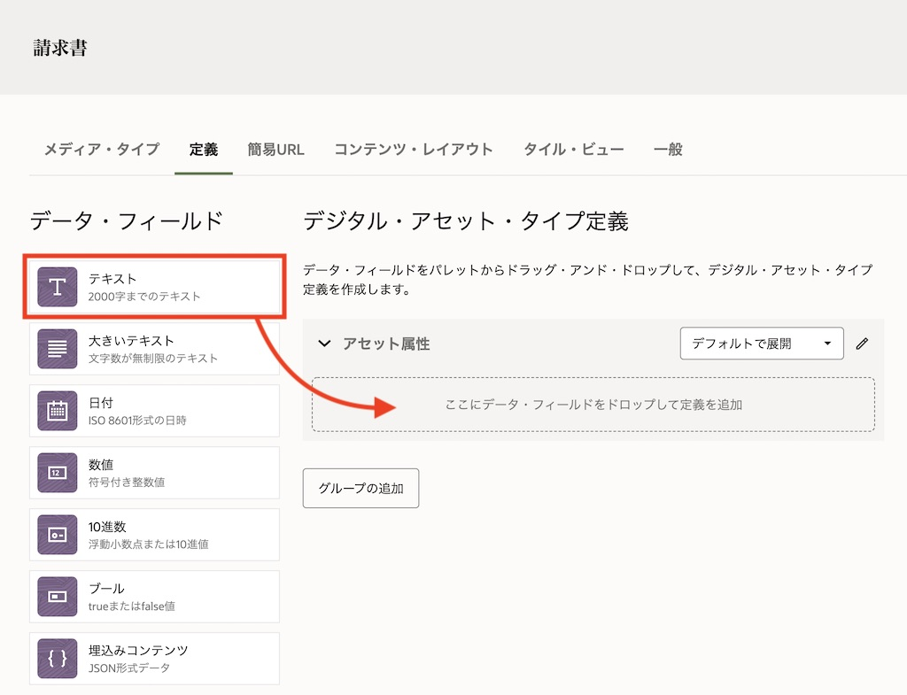

    1. 「テキスト設定」ダイアログが表示されます。以下の通りに入力し、**「次」** をクリックします

        - このフィールドの表示名の指定:　**取引先企業名**
        - このデータ・フィールドの説明を指定して…:　(任意)
        - このフィールドの名前の指定:　**vendor_name**
        - データ・フィールドの指定:　**単一の値**
        - このフィールドにはコンテンツが必要です:　**チェックを外す**
        - 翻訳: **すべてチェックを外す**

    1. 「②外観」を設定します。以下の通りに設定し、最後に **「OK」** をクリックします
        - データ・フィールドの外観: **「単一テキスト・ボックス」**
        - 長さの検証: **チェックを入れる**
        - 最小: **0**
        - 最大: **30**

            

1. 取引先企業名（vendor_name）フィールドが作成されました。

1. 同じ手順を繰り返し、**取引金額（invoice_amount）** を作成します。  

    1. データ・フィールドの **「10進数」** を、先ほど作成した「取引先企業名」の下にドラッグ&ドロップします

        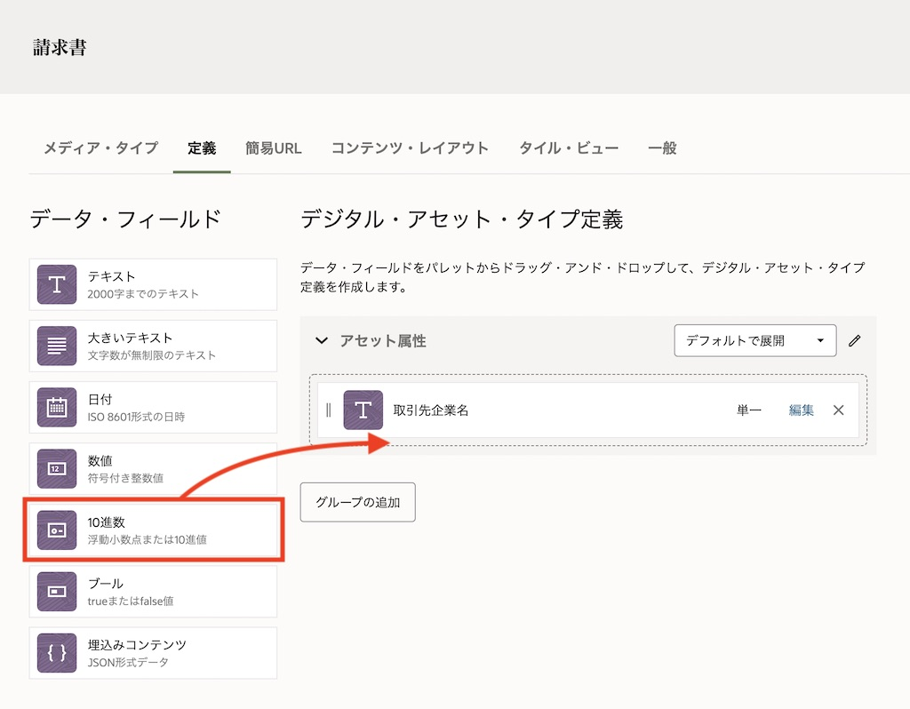

    1. 以下の通り「10進数設定」を入力し、**「次」** をクリックします
        - このフィールドの表示名の指定:　**取引金額**
        - このデータ・フィールドの説明を指定して…:　(任意)
        - このフィールドの名前の指定:　**invoice_amount**
        - データ・フィールドの指定:　単一の値(変更不可)
        - このフィールドにはコンテンツが必要です:　**チェックを外す**
        - 翻訳: **すべてチェックを外す**

    1. 「②外観」を設定し、**「OK」** をクリックします
        - データ・フィールドの外観:　**数のスピナー**
        - デフォルト値:　(未入力)
        - 数値範囲の検証: **チェックを外す**

          

1. 「取引金額」が作成されました。最後に **取引年月日( invoice_date)** フィールドを作成します。  

    1. データ・フィールドの **「日付」** を「取引金額」の下にドラッグ&ドロップします

        

    1. 「日付設定」を入力し、**「次」** をクリックします
        - このフィールドの表示名の指定:　**取引年月日**
        - このデータ・フィールドの説明を指定して…:　(任意)
        - このフィールドの名前の指定：　**invoice_date**
        - データ・フィールドの指定：　単一の値(変更不可)
        - このフィールドにはコンテンツが必要です：　**チェックを外す**
        - 翻訳: **すべてチェックを外す**

    1. 「②外観」を設定し、**「OK」** をクリックします
        - データ・フィールドの外観：　**日付ピッカー**
        - デフォルト値:　(未入力)
        - 日付範囲の検証: **チェックを外す**

          

1. 右上の **「保存」** をクリックします

    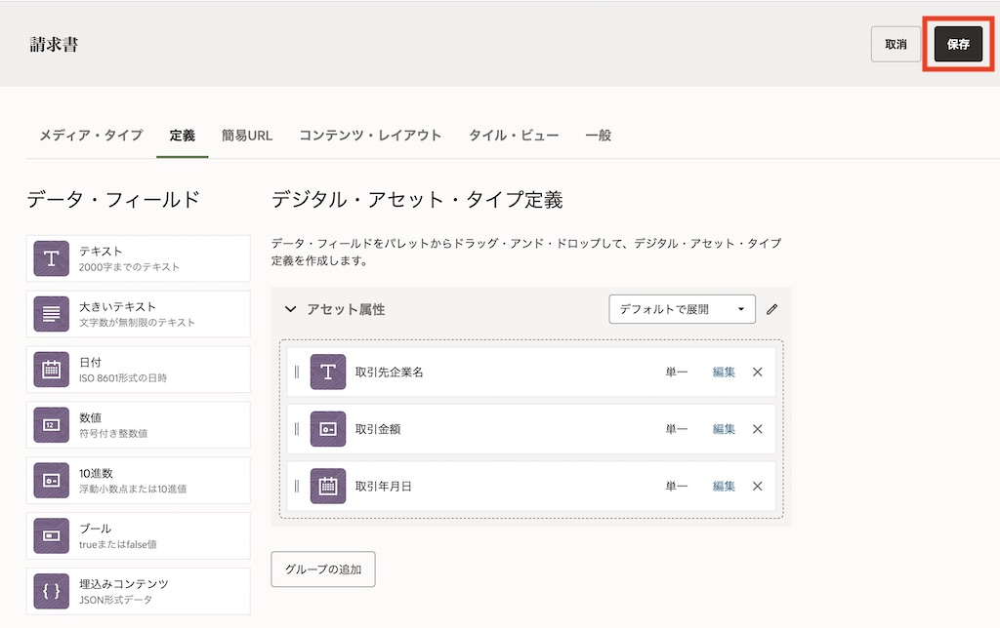

1. 「アセット・タイプは正常に保存されました」が表示されることを確認します。以上で、請求書デジタルアセットタイプの作成は完了です

## 1.3 デジタルアセットタイプをリポジトリに関連付けする

前の手順で作成したデジタルアセットタイプ(請求書)を、リポジトリ(Sample Business Repository) で利用できるように、リポジトリの設定を変更します。

1. 「コンテンツ」の右隣のプルダウンメニューで **「リポジトリ」** を選択します

1. **Sample Business Repository** のチェックボックスにチェックをいれ、**「編集」** をクリックします

1. 「アセット・タイプ」で **請求書** を選択します

1. 右上の **「保存」** をクリックし、編集内容を保存します。以上で、リポジトリの設定は完了です

    

 

# 2. 請求書アセットを登録する

前の手順で、OCM のアセット管理機能を利用する準備ができました。ここからは、作成したビジネスリポジトリに請求書アセットを登録します。

## 2.1 請求書の電子ファイルをビジネスリポジトリに追加する

リポジトリに請求書の電子ファイル（サンプル）をアップロードします。アップロード時に、属性情報の設定も合わせて行います

1. 左ナビゲーションより **「アセット」** をクリックします

1. フィルタパネルより、**「Sample Business Repository」** を選択します

1. 右上の **「追加」→「このコンピュータから追加」** をクリックします

    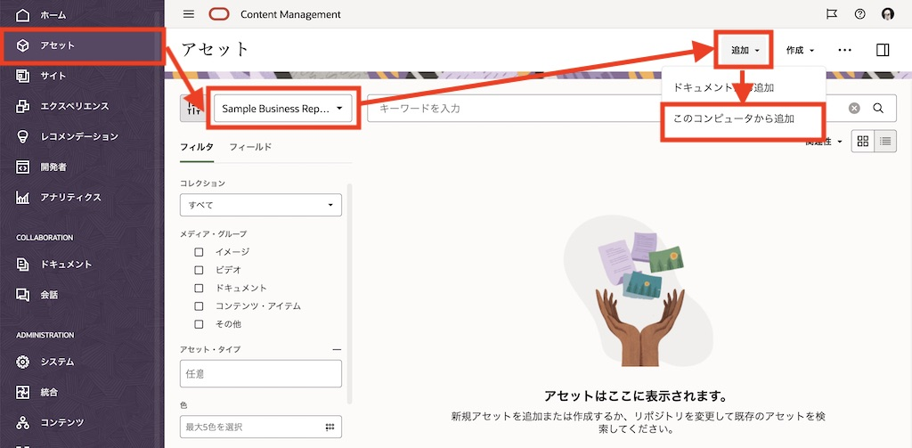

1. ローカルPCから任意のpdfファイルを請求書ファイルとして選択します

1. 「リポジトリに追加」ダイアログが表示されます。先ほど選択したサンプル請求書ファイルを選択します

1. アセット・タイプで **請求書** が選択されていることを確認します

1. サンプル請求書ファイルが選択されていることを確認し、**「属性の編集」** をクリックします

    

1. 「属性の編集」パネルが開きます。以下の通りに取引先企業名、取引金額、取引日付をそれぞれ入力し、**「完了」** をクリックします
    - 取引先企業名: **ABC株式会社**
    - 取引金額: **10000**
    - 取引日付: **2022/2/28**

      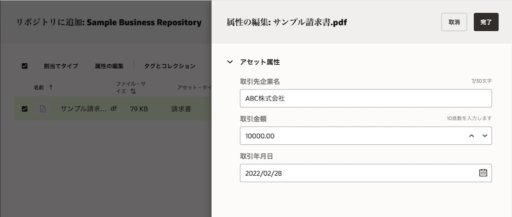

1. **「完了」** をクリックします

    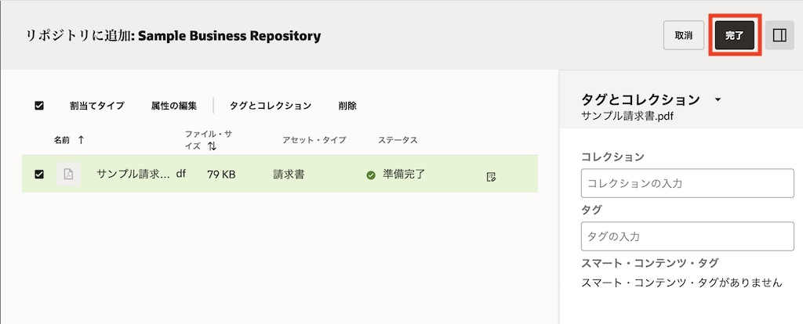

1. リポジトリに、サンプル請求書ファイルが「請求書」アセットタイプで登録され、表示されることを確認します

    

    > **[Memo]**  
    > jpg 形式の画像ファイルをアップロードしても「一致するアセット・タイプがありません」のエラー請求書アセットとして登録できません。これは、請求書アセットタイプの「メディア・タイプ」で、**jpgのファイル拡張子が追加されていない** ために発生します。  
    > jpg ファイルを請求書アセットとして登録できるようにするには、ADMINISTRATION:コンテンツ→アセット・タイプより「請求書」アセットタイプの「メディア・タイプ」に jpg(image/jpeg)を追加してください  
    > 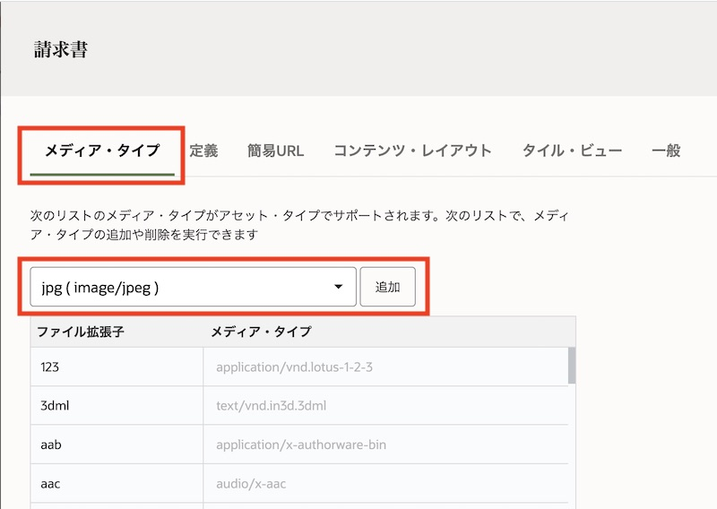

## 2.2 請求書アセットの属性を更新する

1. 請求書アセットを選択し、右クリック→ **「属性を編集する」** をクリックします

    

1. 属性編集画面が開きます。以下の通りに **取引先企業名のみ** を更新します
    - 取引先企業名(変更前): ABC株式会社
    - 取引先企業名(変更前): **ABCD株式会社**

1. 編集後は **「保存」** をクリックし、編集内容を保存します

    

1. サンプル請求書アセットの **v0.2** をクリックします。右パネルに「プロパティ」の「アクティビティ」タブが開き、アクティビティ（更新履歴）を確認できます

    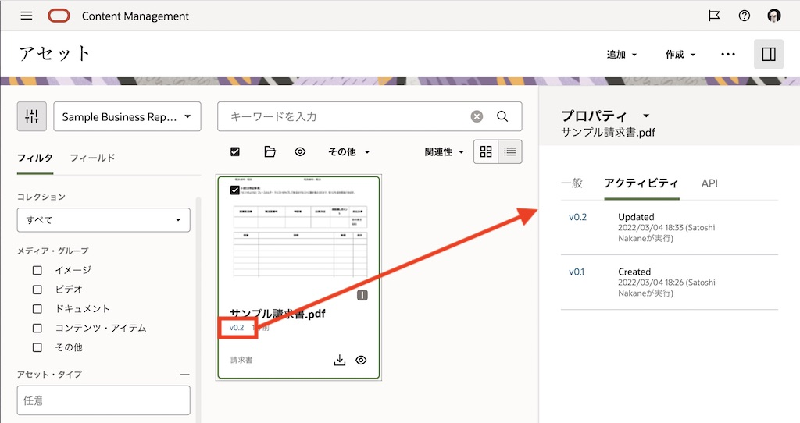

## 2.3 請求書アセットを検索する

アセットページより、ビジネスリポジトリ内のアセットを検索します

1. アセットページを開き、Sample Business Repository を選択します

1. 左バネルより **「フィールド」タブ** を選択し、以下の通りに選択します

    - アセット・タイプ: **請求書**
    - フィールド: **取引先企業名**
    - 演算子: **次と等しい**
    - 値: **ABCD株式会社**

1. アセットが検索されることを確認します

    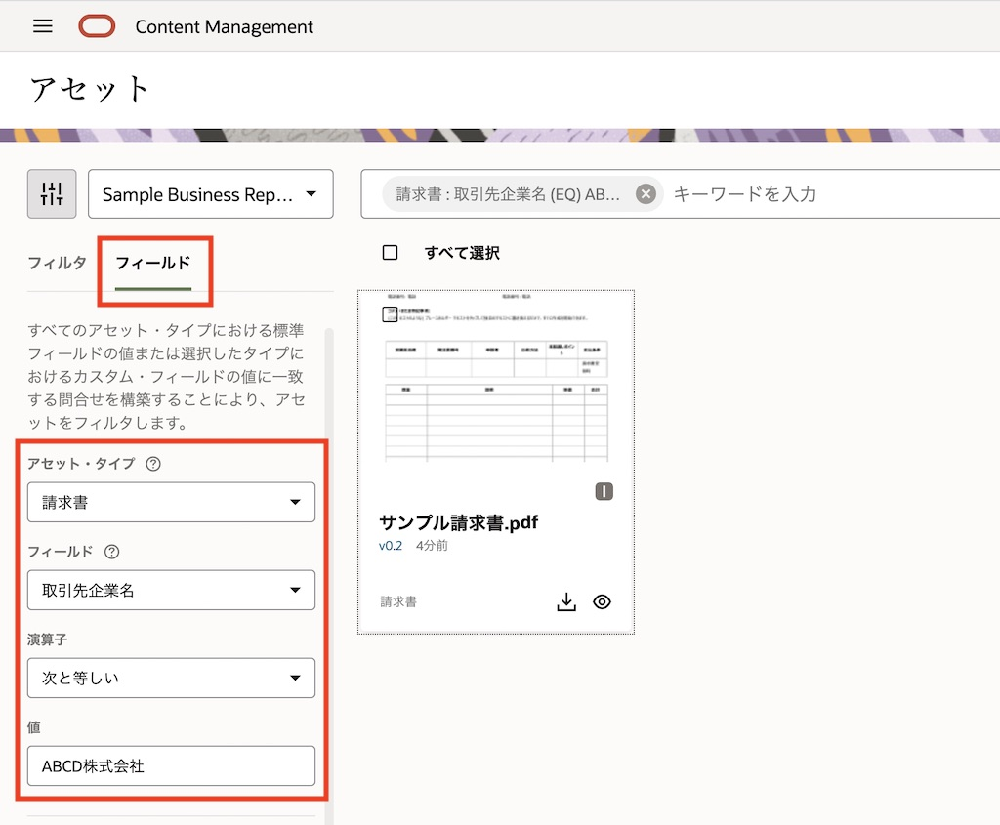

1. 同じ検索条件で、値を **ABC株式会社** に変更し、検索を再実行します。**検索されないこと** を確認します。（検索は最新のバージョンに対して実行され、過去バージョンに対しては実行されません）

    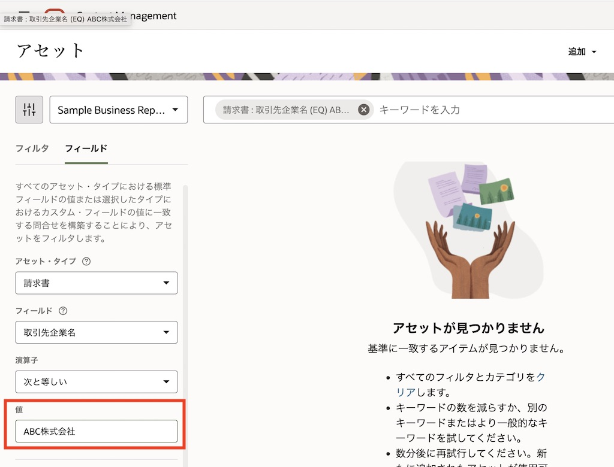

 

以上でこのチュートリアルは終了です。

 

[ページトップへ戻る](#top)
