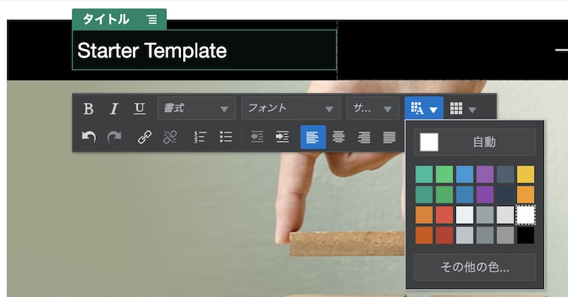
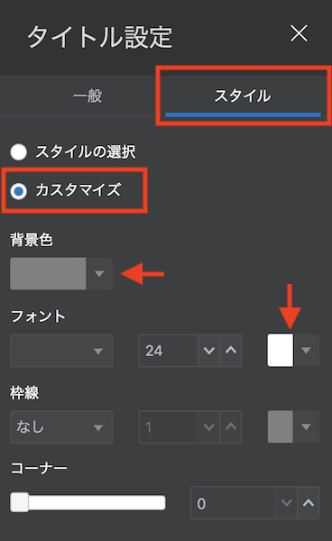

OCE のサイト作成機能を利用し、Web サイト（スタンダードサイト）を作成・公開する方法をステップ・バイ・ステップで紹介するチュートリアルです。ここでは、Web サイトの作成〜編集〜公開までの基本的な手順をハンズオン形式で習得します。

さらに、フォルダに登録される複数ドキュメントをWebページからダウンロードできる「資料ダウンロード」ページの作成方法も、あわせて習得します

~~~
この文書は、2020年6月時点での最新バージョン(20.2.3)を元に作成されてます
~~~

**前提条件**
- [Oracle Content and Experience インスタンスを作成する](../create_oce_instance)
- OCE の利用ユーザーに OCE インスタンスの **CECStandardUser** もしくは **CECEnterpriseUser** アプリケーション・ロールが付与されていること

    > **[Memo]**  
    > ユーザーの作成とアプリケーションロールの付与手順は、[Oracle Content and Experience インスタンスの利用ユーザーを作成する](../create_idcs_group_user) をご確認ください。

<br>

# 0. はじめに

OCE のサイト機能は、Web や HTML などの技術に詳しくないビジネスユーザーが、ドラッグ&ドロップなどの直感的な操作で Web サイトを作成し、公開することができます。また、OCEは、レスポンシブ Web デザイン（Bootstrap）に対応した事前定義済のテンプレート（ひな型）を複数パターン提供します。これらを利用することで、パソコンやスマートフォン/タブレットに対応した Web サイトを、すばやく、簡単に、低コストで作成・公開できます

また、OCE が提供する **ファイル共有機能** や **アセット機能** とシームレスな機能統合がされているため、ドラッグ&ドロップなどのとても簡単な操作で、ドキュメントやアセットを Web サイト上に掲載し、公開することができます

OCE は、以下の2種類のサイトを作成・公開できます。サイト作成時に選択することができます（※サイト・ガバナンス機能が無効化されている場合のみ）

- **スタンダード（標準）サイト**
    - OCE のドキュメントや会話で管理するファイル、フォルダ、会話をWebサイト上に掲載できるサイト
    - 利用例: ランディングページ、イベントサイト、サービスサイト、社内サイト（資料の共有・ダウンロード）　など

- **エンタープライズサイト**
    - スタンダードサイトで利用できるファイル、フォルダ、会話に加えて、アセット・リポジトリで管理するデジタル・アセットやコンテンツ・アイテムも掲載できるサイト
    - 利用例: 企業サイト、製品・サービスの情報提供サイト、ニュースサイト、ブログサイト　など
    - エンタープライズサイトの作成方法は、こちらのチュートリアルで紹介
        - [Oracle Content and Experience を Webコンテンツ管理(Web CMS) として利用しよう【初級編】](../66_webcms)


# 1. サイトの作成

サイトを作成します。

今回は、社内の営業部門に所属する営業および技術者を対象とした **社内向け製品情報提供サイト** を、OCE の **スタンダードサイト** で作成します。サイトの作成イメージは以下の通りです

- ホームページ

    

- 製品資料ページ

    


    > **[Memo]**  
    > スタンダードサイトを作成するには、ユーザーに **CECStandardUser** もしくは **CECEnterpriseUser** ロールの付与が必要です。サイトガバナンスが有効化されている場合、管理者がテンプレートを公開しないなぎり、サイトメニューからサイトを作成できません。代替え手段として「開発者」→「テンプレート」より、テンプレートを選択し「サイトの作成」を実行することができます

## 1.1 新規サイトの作成

1. OCE にサインインします

1. 左ナビゲーションの **「サイト」** をクリックします

1. **「作成」** をクリックします

    

1. テンプレートを選択します。ここでは、**StarterTemplate** を選択します

    

    > **[TIPS]**  
    > テンプレート選択時に StarterTemplate が表示されない場合、OCE インスタンスのサービス管理者に連絡し、デフォルト・サイト・テンプレートのインストールとテンプレートへのメンバー追加（アクセス権限の設定）を依頼してください

1. タイプで **「標準」** を選択し、**「次」** をクリックします

    

1. 以下を入力し、**「終了」** をクリックします
    - 名前: **sampleStandardSite**
    - 説明: （任意）

        

        >**[Memo]**  
        > 名前は、サイトにアクセスするURL（サイトURL）として利用されます。利用できるのは、アルファベット、数字、アンダースコア( _ )、ハイフン( - ) です。スペース( )を入力した場合は、自動的にハイフン( - )に置換されます

1. サイトが作成されます

    


##  1.2 サイト・セキュリティの設定

サイト・セキュリティを設定し、サイトの公開範囲を設定します。サイトの公開範囲には、以下2パターンがあります

- **パブリック**
    - 誰でも参照可能な Web サイト（公開範囲の制限なし）
- **セキュア**
    - ユーザーIDおよびパスワードにより認証され、かつアクセス権限を持つユーザーのみが参照できるWebサイト（公開範囲の制限あり）
    - アクセスできるユーザーは、「クラウド・ユーザー」「訪問者」「サービス・ユーザー」「特定のユーザー」より選択

今回作成するサイトは社内向けの製品情報提供サイトなので、サイト・セキュリティは **「セキュア」** を、アクセスできるユーザーは **「クラウド・ユーザー」** をそれぞれ設定します


1. **sampleStandardSite** を選択し、右クリック→ **「プロパティ」** をクリックします

    

1. **「サイト・セキュリティ」** タブをクリックします

1. 「このサイトにアクセスするすべての人にサインインを要求します」で、**「はい」** を選択します

1. 「オンラインのときにこのサイトにアクセスできるユーザー」で **「クラウド・ユーザー」** が選択されていることを確認し、**「保存」** をクリックします

    

    >**[Memo]**  
    > 「クラウド・ユーザー」とは、OCE インスタンスが利用する IDCS にユーザー・アカウントを持つすべての IDCS ユーザーを意味します（OCE インスタンスへのアクセス権の有無は関係ありません）。その他のサイト・セキュリティは、下記ドキュメントをご確認ください  
    > - [Understand Site Security](https://docs.oracle.com/en/cloud/paas/content-cloud/creating-experiences/understand-site-security.html)


# 2. サイトの編集

サイトを編集します。今回は、下記のようなページ構成のサイトを作成します

```html
ホーム
  |
  +--製品資料（製品資料のダウンロードページ：新規作成）
  |
  +--Private Policy（既存ページのまま）
```

## 2.1 サイト編集画面の起動

1. **sampleStandardSite** を選択し、**「開く」** をクリックします

    

1. サイトの編集画面（Site Builder）が表示されます。**「ベース・サイト▼」** をクリックし、**「新規更新の作成」** を選択します

    

1. 「新規更新の名前の指定」に **update** と入力し、**「OK」** をクリックします

    

1. 「update」に切り替わっていることを確認します。表示側にあるスイッチを **「編集」** モードに切り替えます

    

1. サイトが編集モードに切り替わります。編集側にあるスイッチを **「表示」** モードに切り替えます。サイトの表示モードに戻ります

    

1. サイト編集のプロセスは、次の通りです。

    

    - **新規更新の作成:** ベースサイトのコピーが「更新」として作成されます。「更新」は複数作成できます
    - **サイトの編集:** ベースサイトからコピーされた「更新」を編集します
    - **サイトの保存:** ベースサイトからコピーされた「更新」の編集内容を保存します（「更新」の上書き保存）
    - **サイトのコミット:** ベースサイトからコピーし、編集された更新を、ベースサイトにコピー（上書き保存）します


## 2.2 サイトのページ構成の編集

1. サイトを **「編集」** モードに切り替えます

1. 左サイドバーの **「ページ」** をクリックします

1. **「Home」** が選択されていることを確認し、**「ページの追加」** をクリックします

    

1. 以下の通りに入力し、**「閉じる」** をクリックします
    - ページ・タイプ: **Webページ**
    - ページ名: **製品資料**
    - ページURL: **product**
    - オーバーライド: **選択する**
    - ページ・レイアウト: **index.html** を選択
    - モバイル・ページ・レイアウト: **「デスクトップと同じ」** を選択

        

1. **「製品資料」** ページを、Home ページと Developing Template の間にドラッグ&ドロップで移動します

    

1. 今回のチュートリアルで利用しないページ（Developing Templates、Detail Page）を削除します。

    1. **Developing Template** をクリックします

    1. **「ゴミ箱」** アイコンをクリックします。続けて **「OK」** をクリックします

        

    1. 同じ手順で、**Detail Page** も削除します

1. 最終的には、以下のページ構成となります。サイト上のナビゲーションメニューもページ構成の通りに表示されます

    

1. **「保存」** をクリックします

    


## 2.3 Home ページの編集

1. Home ページをクリックします

1. ページ上に「タイトル」コンポーネントと「段落」コンポーネントが配置され、それぞれにサンプルのテキストが入力されています。サンプルテキストを削除し、適切な文言に変更します。以下は変更例です

    - **タイトル:** *社内向け製品情報提供サイトへようこそ！*
    - **段落:** *この社内サイトは、営業部門の皆さまに対して、最新の製品情報を提供します…（以降省略）*

        

        >**[Memo]**  
        >タイトルも段落も WYSIWYG エディタで編集でき、文字の装飾やスタイルの変更、URLの挿入、画像や表の挿入などが可能です。それぞれのコンポーネントの利用方法は、下記ドキュメントもあわせてご確認ください
        >
        > - [タイトル/Titles](https://docs.oracle.com/en/cloud/paas/content-cloud/creating-experiences/titles.html )
        > - [段落/Paragraphs](https://docs.oracle.com/en/cloud/paas/content-cloud/creating-experiences/paragraphs.html)

1. 左サイドバーの **「セクション・レイアウト」** をクリックします

1. 段落コンポーネントの下にセクション・レイアウトの **「2列」** を、ドラッグ&ドロップで配置します

    

    >**[Memo]**  
    >セクション・レイアウトは、コンポーネントの配置を自動的に調整します。「2列」以外にも、「3列」「スライダ」「タブ」などのパターンが提供されています。詳細は、下記ドキュメントのSection Layout を合わせてご確認ください
    >
    > - [セクション・レイアウト/Section Layout](https://docs.oracle.com/en/cloud/paas/content-cloud/creating-experiences/understand-layouts.html)

1. 配置したセクション・レイアウト「2列」の **メニュー** をクリックし、**「設定」** をクリックします

    

1. **「カスタム設定」** をクリックします

    

1. 以下の通りに入力し、**「< 戻る」** をクリックします
    - 最初の列の幅(%): **50**
    - 2番目の列の幅(%): **50**
    - レスポンシブ・ブレーク・ポイント: **768**
    - レスポンシブ動作: **2番目の列を最初の列の下に移動**

        

1. 右上の **「 X 」** をクリックし、設定画面を閉じます

1. セクション・レイアウトの **「最初の列」** にコンポーネントを配置します。

    1. 左サイドバーの **「コンポーネント」→「シード」** をクリックします

        

    1. **「イメージ」** コンポーネントを、セクション・レイアウトの **「最初の列」** にドラッグ＆ドロップします

        

    1. 「最初の列」に配置した「イメージ」コンポーネントの下に **「タイトル」** コンポーネントをドラッグ＆ドロップします。その下に **「段落」** コンポーネントを、さらにその下に **「ボタン」** コンポーネント配置します

        

    1. **「イメージ」** コンポーネントをクリックします

    1. **メニュー** をクリックし、**「設定」** をクリックします

        

    1. **「選択」** をクリックします

        

    1. ドキュメント・フォルダが開きます。フォルダから任意の画像を選択し、**「OK」** をクリックします

        

        > **[TIPS]**  
        >フォルダに必要な画像がない場合、この画面上の **「アップロード」** をクリックし、ローカル環境の画像ファイルをフォルダにアップロードし、それを選択することができます

    1. **「タイトル」「代替テキスト」「キャプション」** に **「製品資料のダウンロード」** と入力します

    1. 右上の **「 X 」** をクリックし、イメージ設定を閉じます

        

        >**[Memo]**  
        > イメージコンポーネントは、画像をページ上に配置する場合に利用します。スタンダードサイトの場合、ドキュメント・フォルダから画像を選択します。下記ドキュメントも合わせてご確認ください
        >
        > - [イメージ/Images](https://docs.oracle.com/en/cloud/paas/content-cloud/creating-experiences/images.html)

    1. **「タイトル」** コンポーネントをクリックし、**「製品資料のダウンロード」** と入力します

    1. **「段落」** コンポーネントをクリックし、任意のテキストを入力します

        

    1. **「ボタン」** コンポーネントをクリックし、**メニュー→「設定」** 選択します

    1. 「ラベル」と「タイトル」に **「製品資料ページへ」** と入力します。さらに、「位置合わせ」で **「中央」** を選択します

    1. **「リンク」** タブをクリックします

        

    1. 「リンク・タイプの選択」から **「サイト・ページ」** を選択します。続けて「ページ」より **「製品資料」** を選択します

    1. 右上の **「 X 」** をクリックし、ボタン設定を閉じます

        

        >**[Memo]**  
        > 「ボタン」コンポーネントは、サイト・ページのリンクだけでなく、外部 Web サイトへのリンクや、ファイルのダウンロードやプレビューなども指定できます。詳しい利用方法は、下記ドキュメントを合わせてご確認ください
        >
        > - [ボタン/Button](https://docs.oracle.com/en/cloud/paas/content-cloud/creating-experiences/buttons.html)

1. 同じ手順を繰り返し、「セクション・レイアウト」の **「第2列」** に Privacy Policy ページの紹介とリンクを作成します。作成イメージは以下の通りです

    

1. **「保存」** をクリックします。以上で、Home ページの編集は終了です


## 2.4 製品資料ページの編集

### 2.4.1 フォルダに製品資料を登録する

1. 左ナビゲーションより **「ドキュメント」** をクリックします。**「作成」** をクリックし、**「サイト作成チュートリアル」** フォルダを作成します

    

1. 「サイト作成チュートリアル」フォルダの下に、**「製品カテゴリA」** と **「製品カテゴリB」** のフォルダを作成します

    

1. 「製品カテゴリA」と「製品カテゴリB」のフォルダに、Web サイト上に掲載する資料をアップロードします。ここでは、それぞれのフォルダに、2つのPowerPoint資料をアップロードしてあります

    

### 2.4.2 製品ページの編集

1. サイト編集画面を開き、**「製品資料」** ページを編集モードで開きます。ページには、ロゴもナビゲーションもありません

    

    >**[Memo]**  
    > ページ上の真ん中に「＋」がある点線の長方形は「スロット」です。サイト作成者は、スロットの領域内にコンポーネントを配置し、ページを編集します。なお、スロットは、テンプレートの開発時に、開発者が定義します

1. ページの左上の logocontainer スロットに、コンポーネント→**シード→「タイトル」** コンポーネントを配置します

    

1. タイトルコンポーネントに **「Starter Template」** と入力し、文字の色を **白(White)** にします

    

1. サイトナビゲーションを表示するためのカスタムコンポーネントを配置します。左サイドバーの **「シード」** をクリックし、**「カスタム」** を選択します

    

1. ページ右上の **navMenu** スロットに、**「NavMenu」** コンポーネントを配置します。この際、コンポーネントの検索ボックスに `nav` と入力すると、NavMenu コンポーネントが見つけやすくなります

    

1. サイトナビゲーションが表示されます

    

1. slot-content スロットに、コンポーネントを配置します

    1. 左サイドバーの「カスタム」を **「シード」** に切り替えます

    1. ページ中央の slot-content スロットに **「タイトル」** コンポーネントを 配置し、**「製品資料ページ」** と入力します

        

    1. **「セクション・レイアウト」** より **「2列」** を、「タイトル」コンポーネントの下に配置します

        

    1. 「2列」のメニュー→ **「設定」→「カスタム設定」** を開き、以下の通りの設定します

        - 最初の列の幅(%): **50**
        - 2番目の列の幅(%): **50**
        - レスポンシブ・ブレーク・ポイント: **768**
        - レスポンシブ動作: **2番目の列を最初の列の下に移動**

            

    1. 「2列」の設定メニューを閉じます

    1. 「セクション・レイアウト」の「最初の列」に **「タイトル」** コンポーネントを配置し、**「製品カテゴリA」** と入力します

        

    1. タイトルコンポーネントの設定メニュー→ **「設定」→「スタイル」** を選択します

    1. **「カスタマイズ」** を選択し、背景色とフォントの色を、それぞれ以下の通りに変更します

        

    1. 「タイトル」コンポーネントの設定メニューを閉じます。背景色と文字の色が変更されていることを確認します

    1. 「最初の列」の「タイトル」コンポーネントの下に **「ファイル・リスト」** コンポーネントを配置します

        

        >**[Memo]**  
        >ファイル・リストコンポーネントは、選択したフォルダに保管されるファイルを一覧表示します。フォルダ・リストコンポーネントと組み合わせて利用することで、複数フォルダに含まれるファイル一覧を表示できます。詳細は、下記ドキュメントをあわせてご確認ください
        >
        > - [ファイル・リスト/File Lists](https://docs.oracle.com/en/cloud/paas/content-cloud/creating-experiences/file-lists.html)
        > - [フォルダ・リスト/Folder Lists](https://docs.oracle.com/en/cloud/paas/content-cloud/creating-experiences/folder-lists.html)

    1. 「ファイル・リスト」の設定メニュー→ **「設定」→「カスタム設定」** をクリックします

        

    1. **「選択」** をクリックします

        

    1. フォルダの選択画面が表示されます。前の手順で作成した **「製品カテゴリA」** を選択し、**「OK」** をクリックします

        

    1. フォルダ権限の選択で **「サイト・ビジターのアクセス：ダウンロード実行者」** を選択します

    1. **表示オプション** を以下の通りに選択します

        

    1. 「カスタム設定」を閉じます。続けて、「ファイル・リストの設定」を閉じます

    1. 表示モードに切り替えます

    1. 「製品カテゴリA」フォルダ内の資料が一覧表示されます。ダウンロード・アイコンをクリックすると、資料がダウンロードされることを確認します

        

1. **編集モード** に切り替えます。

1. 同じ手順を繰り返し、セクション・レイアウトの **「第2列」** を編集します。今回は **「ファイル・リスト」** コンポーネントで **「製品カテゴリB」** フォルダを選択します

    

1. 表示モードに切り替えます。それぞれのフォルダに格納された資料のダウンロードできることを確認します

1. 編集内容を **「保存」** します


## 2.5 編集内容のコミット

1. **「コミット」** をクリックします

    

1. 確認のダイアログを確認し、**「コミット」** をクリックします

1. 編集内容がベース・サイトに上書き保存されます

1. サイト編集画面を閉じます


# 3. サイトの公開

## 3.1 サイトの公開とオンライン化

作成したサイトを公開します。

1. 左ナビゲーションより **「サイト」** をクリックします。**sampleStandardSite** を選択し、**「公開」** をクリックします

    

1. サイトが公開されるのを確認し、**「オンラインにする」** をクリックします

    

1. 確認のダイアログが表示されます。**「確認して続行」** にチェックを入れ、**「オンラインにする」** をクリックします

1. サイトがオンライン状態に遷移し、サイトへのアクセスが可能になります

    

## 3.2 サイトの確認

公開（オンライン化）されたサイトにアクセスし、動作を確認します

1. 公開したサイト（ここでは sampleStandardSite）を選択し、**「プロパティ」** をクリックします

    

1. **「サイトURL」** をコピーします

    

1. 別ブラウザを開き、先ほどコピーしたサイトURLを開きます。

1. **ユーザーIDとパスワードを入力するサイン・イン画面** が表示されます。ID/パスワードを入力し、サイン・インをクリックすると、サイトが表示されます

    

1. ブラウザの横幅を小さくすると、それに合わせてWebサイトの表示も変更されます（レスポンシブWebデザイン）。また、Home ページや製品情報ページでは、「2列」のセクション・レイアウトが縦表示（最初の列の下に2列目が表示）に切り替わることも確認します

    

## 3.3 フォルダに資料を追加する

ファイル・リストで作成した資料ダウンロードは、選択したフォルダのドキュメントをリアルタイムで参照します。そのため、フォルダにドキュメントを1件追加すると、Web サイト上の製品資料ページもドキュメントが1件追加されます。また、フォルダからドキュメントを削除すると、Web サイト上の製品資料ページからも削除されます

1. OCE のドキュメントを開き、「サイト作成チュートリアル」→ **「製品カテゴリA」** フォルダを開きます

1. 新規ドキュメントを1件アップロードします（ここでは、サンプル資料A-3.pptx を追加）

    

1. 3.2 項で開いた sampleStandardSite サイトをリロードします。製品カテゴリAに資料が1件追加されていることを確認します

    

<br>

以上でこのチュートリアルは終了です。
