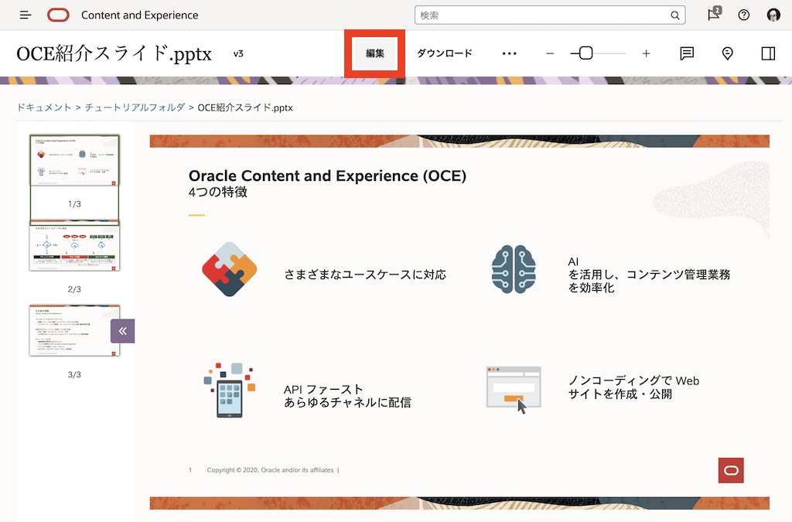
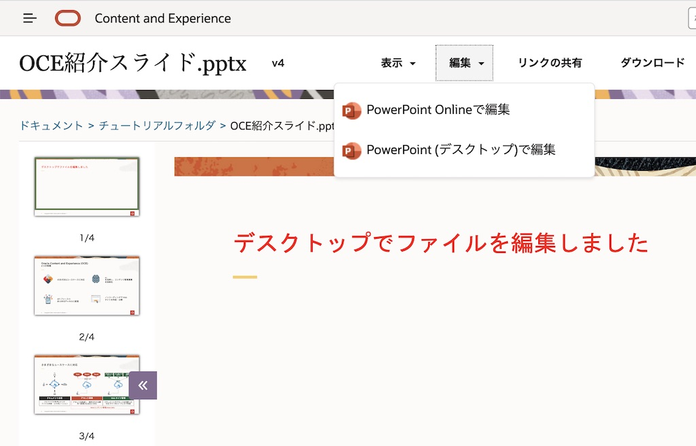
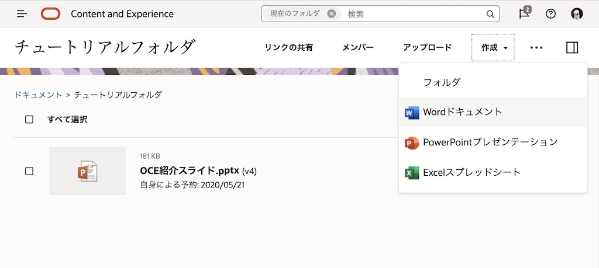
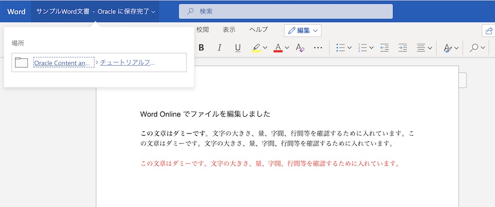
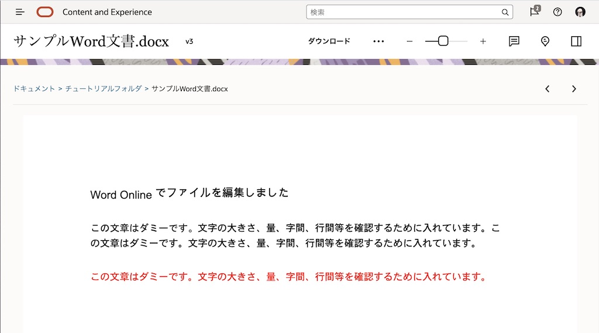

**目次に戻る**: [Oracle Content Management のファイル共有機能を使ってみよう【初級編】](../using_file_sharing)

**OCM のデスクトップ・アプリケーション** がクライアント環境にインストールされている場合、ローカル環境の Office アプリケーションと連携したファイルの編集および OCM インスタンス上への自動保存ができます。

また、サービス管理者により Microsoft Office Online 連携機能が有効化されている場合、Office Online サービス（Microsoft 365サービス）でのファイル編集、新規作成、OCM への自動保存ができます


この文書は、2021年11月時点での最新バージョン(21.11.1)を元に作成されてます。   チュートリアル内の画面ショットについては、現在のコンソール画面と異なっている場合があります。   


**前提条件**
- [Oracle Content Management インスタンスを作成する](../create_oce_instance)
- OCM の利用ユーザーに OCM インスタンスの **CECStandardUser** もしくは **CECEnterpriseUser** アプリケーション・ロールが付与されていること
- クライアント環境に **OCMのデスクトップ・アプリケーション** がインストールされていること。デスクトップ・アプリケーションの利用は、こちらのチュートリアルをご確認ください
    - [11. デスクトップ・アプリケーション（Oracle Content Management のファイル共有機能を利用しよう）](../11_desktop_application)

 

# 1. ファイルの編集

## 1.1 Office アプリケーションで編集

1. ファイルを選択し、**「編集」** をクリックします（もしくはファイルをプレビューした状態で「編集」をクリック）

    

1. 確認のダイアログが表示されます。**「はい」** をクリックします

1. デスクトップ・アプリケーションと自動連携し、対応する Office アプリケーションでファイルが開きます

1. Office アプリケーションでファイルを編集し、保存します

1. 保存したファイルは、OCM インスタンス上の **同じファイルの新規バージョンとして自動的に保存** （ここでは **v4** として保存）されます

1. Web ブラウザをリロードします。新規バージョンのファイルが表示されます

    

## 1.2 Office Online での編集

管理者により Microsoft Office Online 連携機能が有効化されている場合、「編集」は **「PowerPoint（デスクトップ）で編集」** に変更され、さらに **「PowerPoint Onlineで編集」** など、対応するOffice サービスでの編集が可能となります

> **[TIPS]**  
> Office Online 連携を利用する場合、Microsoft 社の Office 365 サービス（Microsoft 365）のサブスクリプションが別途必要です

1. **「編集」→「PowerPoint Onlineで編集」** をクリックします

    

1. 対応するOffice Online サービス（ここではPowerPoint Online）が開きます

    

1. Office Online でファイルを編集した場合、その内容は OCM インスタンス上の同じファイルの新規バージョンとして自動的に保存されます

## 1.3 Office Online を利用した Office ファイルの新規作成

管理者により Microsoft Office Online 連携機能が有効化されている場合、ユーザーは OCM の Web ブラウザ UI から Office ファイルを直接作成できます

> **[TIPS]**  
> Office Online 連携を利用する場合、Microsoft 社の Office 365 サービス（Microsoft 365）のサブスクリプションが別途必要です

1. フォルダを開き、**「作成」** をクリックします。「Wordドキュメント」「PowerPointプレゼンテーション」「Excelスプレッドシート」が選択できます。ここでは、**「Wordドキュメント」** を選択します

    

1. 「名前」を入力し、**「作成」** をクリックします

    

1. Word Online が開きます。ファイルを編集すると、その内容は OCM インスタンス上の同じファイルの新規バージョンとして自動的に保存されます

1. OCM のフォルダに戻る場合は、画面右上の **「*ファイル名* - Oracle に保存完了」** をクリックし、OCMのフォルダ（ここでは「チュートリアルフォルダ」）をクリックします

    

1. OCMのフォルダ内に保管されるWordファイルを表示(Webプレビュー)します。Word Online で作成した内容が、OCMに登録されていることが確認できます

    

 

以上でこのチュートリアルは終了です。

**目次に戻る**: [Oracle Content Management のファイル共有機能を使ってみよう【初級編】](../using_file_sharing)
