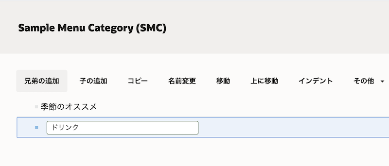

このチュートリアルは Oracle Content and Experience (OCE) のタクソノミ機能を利用し、リポジトリ内のアセットを分類する方法をステップ・バイ・ステップで紹介するチュートリアルです。

~~~
この文書は、2021年4月時点での最新バージョン(21.2.1)を元に作成されてます
~~~

**前提条件**
- [Oracle Content and Experience インスタンスを作成する](../create_oce_instance)
- [Oracle Content and Experience を Headless CMS として使ってみよう【初級編】](../41_asset_headless)
- [Oracle Content and Experience を Webコンテンツ管理(Web CMS) として利用しよう【初級編】](../62_webcms)

<br>

# 0. 説明

## タクソノミ（Taxonomy）

タクソノミ（Taxonomy）は、情報を階層構造で整理したものです。OCEのタクソノミ機能は、コンテンツ開発者により作成され、明確に定義されたカテゴリによりアセットを階層構造で分類します。タクソノミでアセットを分類することで、ユーザーはカテゴリをドリルダウンすることで、必要なアセットを簡単に探すことができます

OCEのタクソノミ機能については、以下のドキュメントをあわせてご確認ください

- [Manage Taxonomies](https://docs.oracle.com/en/cloud/paas/content-cloud/managing-assets/manage-taxonomies.html#GUID-D000D075-7963-478D-A67C-47DCC6070104)


このチュートリアルで作成するカテゴリ（Sample Menu Category）を以下に示します

  ```
  季節のオススメ
  ドリンク
    コーヒー
    ティー
    ジュース
  フード
    デザート
    サンドイッチ
    スナック
  ```

この例では、3つの上位カテゴリ「季節のオススメ」「ドリンク」「フード」があります。「季節のオススメ」カテゴリには子カテゴリがありませんが、「ドリンク」と「フード」のカテゴリにはいくつかの子カテゴリがあります。子カテゴリには、それぞれ独自の子カテゴリを設定できます。

## このチュートリアルの流れ

1. [ タクソノミの作成](#1-タクソノミの作成)
1. [ アセットリポジトリでタクソノミを利用する](#2-アセットリポジトリでタクソノミを利用する)
1. [ サイト機能でタクソノミを利用する](#3-サイト機能でタクソノミを利用する)

<br />

# 1. タクソノミの作成

## 1.1 タクソノミの作成とプロモート

管理画面よりタクソノミを作成します。作成するタクソノミは、前に説明した「Sample Menu Category」です。


1. OCE インスタンスにアクセスし、左ナビゲーションのADMINISTRATION の **「コンテンツ」** をクリックします

1. 「コンテンツ」の右隣のメニューから **「タクソノミ」** を選択し、**「作成」** をクリックします

    

1. タクソノミを作成します。ここでは以下の通りに入力し、**「作成」** をクリックします

    - 名前: **Sample Menu Category**
    - 省略形: **SMC**
    - 説明: （任意）

        

        > **[Memo]**  
        > **名前** には特殊文字を利用することはできません。また、**省略形** を入力しない場合は、名前の最初の3文字が使用されます。

1. タクソノミの作成画面が表示されます。ここからタクソノミ（カテゴリ）を作成します。作成するタクソノミは以下の通りです

    ```
    季節のオススメ
    ドリンク
      コーヒー
      ティー
      ジュース
    フード
      デザート
      サンドイッチ
      スナック
    ```

    1. **「カテゴリの追加」** をクリックします

        

    1. カテゴリ名に **「季節のオススメ」** を入力します

        

    1. 「季節のオススメ」を選択したまま、**「兄弟の追加」** をクリックします

        

    1. **「ドリンク」** を入力します

        

    1. 同じ手順を繰り返し、「ドリンク」の兄弟として **「フード」** を作成します

        

1. 「ドリンク」の子カテゴリを追加します。

    1. 「ドリンク」を選択したまま、**「子の追加」** をクリックします

        

    1. 子カテゴリに **「コーヒー」** を入力します

        

    1. 同じ手順を繰り返し、「ドリンク」の子カテゴリに **「ティー」** と **「ジュース」** を追加します

        

    1. 子カテゴリの順番を変える場合は、子カテゴリを選択し、ドラッグ&ドロップで移動します。ここでは、「コーヒー」を「ドリンク」カテゴリ内の最初に移動します

        

    1. 「ドリンク」の子カテゴリの順番を「コーヒー」「ティー」「ジュース」とします。

        

1. 同じ手順を繰り返し「フード」カテゴリ内に **「デザート」「サンドイッチ」「スナック」** の子カテゴリを追加します

    

1. **「完了」** をクリックします。


    > **[Memo]**  
    > 作成したタクソノミは「ドラフト」状態となります。ドラフト状態のタクソノミは、リポジトリ内で利用できません


## 1.2 タクソノミのプロモート

作成したタクソノミを確定させ、リポジトリ内で利用できるように「プロモート」を実行します。

1. `Sample Menu Category`を選択し、**「プロモート」** をクリックします

    

1. **「このタクソノミの公開を許可します」** と **「確認して続行」** にチェックを入れ、**「プロモート」** をクリックします

    

1. `Sample Menu Category`が「プロモート済」になります


## 1.3 リポジトリにタクソノミを関連付け    

前の手順でプロモートしたタクソノミを、リポジトリで利用できるようにします。ここでは、Sample Content Repository を利用します。


1. 左ナビゲーションのADMINISTRATION の **「コンテンツ」→「リポジトリ」** をクリックします

1. `Sample Content Repository`を選択し、**「編集」** をクリックします

1. タクソノミで **「Sample Menu Repository」** を選択し、**「保存」** をクリックします

    

## 1.4 (説明)タクソノミのステータス

  | 状態 | 説明 |
  | :--- | :--- |
  | ドラフト | 作成途中（編集中）のタクソノミ<br />リポジトリへの関連付け不可 |
  | プロモート済 | 作成（編集）が完了した確定済のタクソノミ<br />リポジトリへの関連付けが可能<br />関連付けされたリポジトリ内での利用が可能 |
  | 公開済 | リポジトリに関連付けされた公開チャネルに対して公開されたのタクソノミ<br />関連付けされたリポジトリ内での利用が可能<br />オンライン状態のWebサイトやREST API for Content Deliveryより参照・利用が可能 |

<br />

# 2. アセットリポジトリでタクソノミを利用する

## 2.1 アセットにタクソノミを関連付けする

リポジトリ内でタクソノミが利用できることを確認します。さらに、アセットをタクソノミで分類します。

1. 左ナビゲーションの「アセット」の`Sample Content Repository`を開きます

1.  「フィルタ」タブの隣の「カテゴリ」をクリックします。`Sample Menu Category(SMC)`が表示されます

    

1. 任意のコンテンツ・アイテム（ここでは`Sample News Content 001`）を選択し、**「カテゴリ」** をクリックします

    

1. 「カテゴリ」パネルが表示されます。**「カテゴリの追加」** をクリックします

1.  「ドリンク」を開き、子カテゴリの **「コーヒー」** にチェックを入れ、**「追加」** をクリックします

    

1. コンテンツ・アイテムにSample Menu Category(SMC)の「ドリンク」→「コーヒー」カテゴリが設定されます。

    >**[Memo]**  
    > アセットにカテゴリが設定されると、再カテゴリ化(Recategorized)のアイコンが付加されます。再カテゴリ化されたアセットを公開すると、アイコンは削除されます。もう一度カテゴリを編集すると、再カテゴリ化のアイコンが表示されます
    > フィルタメニューの「再カテゴリ化」を選択すると、再カテゴリ化状態のアセットを一覧表示できます


<br />


## 2.2 タクソノミを利用して、アセットを絞り込み表示する

タクソノミを利用し、アセットを絞り込み表示します。

1. 左ナビゲーションの「アセット」の`Sample Content Repository`を開きます

1. 「フィルタ」タブの隣の **「カテゴリ」** をクリックします。

1. `Sample Menu Category(SMC)`が選択されていることを確認し、「ドリンク」を開き **「コーヒー」** にチェックを入れます。カテゴリ設定したコンテンツ・アイテム（ここでは`Sample News Content 001`）のみが表示されます

    

1. 「コーヒー」のチェックを外します

1. **「すべての子を含める」** が選択されていることを確認し、上位カテゴリの **「ドリンク」** にチェックを入れます。カテゴリ設定したコンテンツ・アイテム（ここでは`Sample News Content 001`）のみが表示されます

    > **[Memo]**  
    > カテゴリメニューの「すべての子を含める」が選択されているため、「ドリンク」の子カテゴリが関連付けられたすべてのアセットが表示されます

    

1. 「ドリンク」のチェックを外します。リポジトリ内のすべてのアセットが表示されます

<br />

# 3. サイト機能でタクソノミを利用する

`firstSite`の`Home`ページは、コンテンツ・リスト・コンポーネントで `SampleNewsType` のコンテンツ・アイテムを一覧表示しています。ここでは、作成したタクソノミ（`Sample Content Repository`）を利用し、一覧表示するコンテンツ・アイテムをフィルタします。


## 3.1 コンテンツ・リストコンポーネントでタクソノミを利用する

コンテンツ・リスト・コンポーネントで表示するコンテンツ・アイテムを、タクソノミ（カテゴリ）を利用してフィルタします。

1. `firstSite` のサイト編集画面を開きます

1. スイッチを **「編集」** に切り替え、編集モードにします

1. ページに配置済の **コンテンツ・リストコンポーネント** を選択し、**「設定」** をクリックします

1. 設定パネルが開きます。 **「カテゴリの選択」** をクリックします

    

1. タクソノミの選択画面が開きます。`Sample Menu Category(SMC)`を選択し、「ドリンク」を開き、**「コーヒー」** にチェックを入れます。最後に「OK」をクリックします

    

1. 設定パネルを閉じます。「コーヒー」カテゴリが設定されたコンテンツ・アイテム（ここでは Sample News Content 001のみ）が表示されます

    


1. サイトを **「保存」** します。続けて **「コミット」** します


## 3.2 サイトを再公開し、オンラインサイトを確認する

サイトを公開（再公開）し、オンラインサイトを確認します。

1. firstSite を **「再公開」** します。その際に **「サイトと、サイトの公開チャネルのターゲット対象になっているすべてのアセットを公開」** を選択します。

1. 再公開が完了したことを確認し、オンラインサイトを確認します。オンラインサイトのURLは、サイトのプロパティより確認します。コンテンツ・アイテムが **表示されない** ことを確認します

    

    > **[Memo]**  
    > コンテンツ・アイテムが表示されない理由は、タクソノミがfirstSiteの公開チャネルに対して、公開されていないため


## 3.3 タクソノミを公開し、オンラインサイトで確認する

タクソノミをサイトの公開チャネルに対して公開し、オンラインサイトを再確認します。

1. タクソノミを公開します。左ナビゲーションのADMINISTRATION の **「コンテンツ」→「タクソノミ」** をクリックします

1. **Sample Menu Category** を選択し、**「公開」** をクリックします

    

1. 公開チャネルの選択で、**firstSiteのみ** を選択します。**「確認して続行」** にチェックを入れ、**「公開」** をクリックします

    

1. Sample Menu Categoryが **v1** で公開済になります

    

1. もう一度、firstSite のオンラインサイトを再表示します。カテゴリ設定されたコンテンツ・アイテムのみが表示されることを確認します

    

    > **[TIPS]**  
    > コンテンツ・アイテムが表示されない場合は、以下の操作を実施してください  
    > (1)オンラインサイトを表示している Web ブラウザのキャッシュをクリアし、終了する  
    > (2)ADMINISTRATION:システム→一般を開き、「コンテンツ配信ネットワーク」の「パージ」をクリックし、CDN上のコンテンツ・キャッシュをクリアする  
    > (3) Webブラウザを起動し、firstSite にアクセスする  


<br>

以上でこのチュートリアルは終了です。
