このチュートリアルはOracle Content and Experience(OCE)で作成するWebサイトの **サイト・セキュリティ** と **サイト・ガバナンス** の設定方法をステップ・バイ・ステップで紹介するチュートリアルです

~~~
この文書は、2021年5月時点での最新バージョン(21.2.2)を元に作成されてます
~~~

**前提条件**

- [Oracle Content and Experience インスタンスを作成する](../create_oce_instance)

また、以下のチュートリアルを実施済みで、OCEのサイト作成と公開の手順について習得済みであることが望ましい

- [Oracle Content and Experience のサイト機能を使ってみよう【初級編】](../61_create_site)

 
 

# 1. サイト・セキュリティ

## 1.1 説明

OCEのサービス管理者は、ユーザーが作成・公開するWebサイトの **サイト・セキュリティ(=公開範囲)** を制限できます。サイトの公開範囲は **パブリック** と **セキュア** の2パターンで、それぞれの特徴は以下の通りです。

- **パブリック**
    - 公開範囲の制限なし
    - 誰でも参照可能なWebサイト
    - 主な利用例
        - コーポレートサイト、ブランドサイト、キャンペーンサイトなど

- **セキュア**
    - 公開範囲の制限あり
    - IDCSに登録されるユーザーIDおよびパスワードにより認証され、サイト管理者により設定されたアクセス権限を持つユーザーのみが参照できるWebサイト
    - 公開範囲は「クラウド・ユーザー」「訪問者」「サービス・ユーザー」「特定のユーザー」より選択（以下の表を参照）
    - 主な利用例
        - イントラサイト、代理店専用サイト、会員専用サイトなど

            | 公開範囲 | サイトにアクセスできるユーザー |
            | - | - |
            | **クラウド・ユーザー** | OCEインスタンスが利用するIDCSにユーザー登録されたIDCSユーザー。OCEインスタンスへのアクセス権の有無は関係ありません |
            | **訪問者** | OCEインスタンスの`CECSitesVisitor`アプリケーションロールが付与されたユーザー |
            | **サービス・ユーザー** | OCEインスタンスの`CECStandardUser`もしくは`CECEnterpriseUser`アプリケーションロールが付与されたユーザー |
            | **特定のユーザー** | Webサイトの訪問者として個別に追加されたユーザー、もしくは追加されたグループに所属するユーザー |

            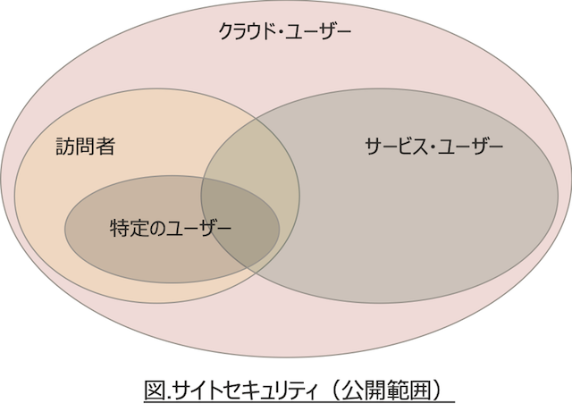

サイト・セキュリティは、**(1)サービス管理者によるOCEインスタンス単位での設定** が可能です。さらに、**(2)サイト単位での設置** できます。

## 1.1.1 インスタンス単位でのサイト・セキュリティ設定

サービス管理者は、**ADMINISTRATION:システム → サイト** よりOCEインスタンス単位のサイト・セキュリティを構成できます。それぞれの項目は以下の通りです

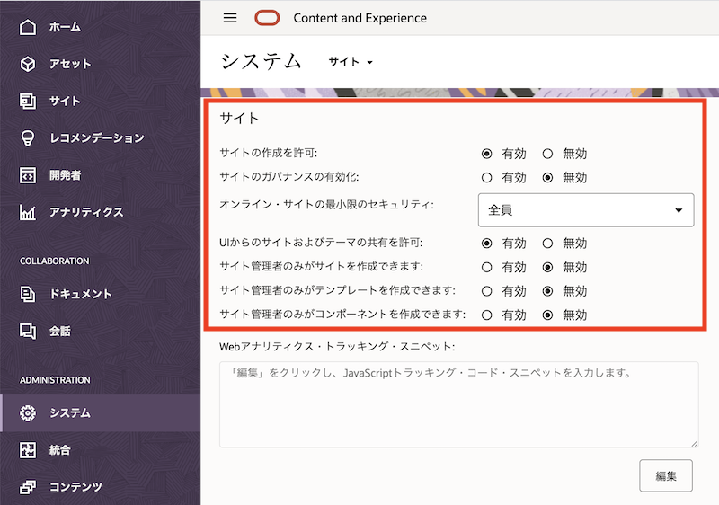

- **サイトの作成を許可**
    - **有効**: サイトの作成可【デフォルト】
    - **無効**: サイトの作成不可

- **サイトのガバナンスの有効化**
    - **有効**: サイト・ガバナンス機能を有効化します
    - **無効**: サイト・ガバナンス機能を無効化します【デフォルト】

      > **[Memo]**  
      > 詳細は 2項にて説明

- **オンライン・サイトの最小限のセキュリティ**
    - **全員**: パブリックサイト。認証不要で誰でもアクセスできるサイト【デフォルト】
    - **クラウド・ユーザー**: IDCSユーザーがアクセスできるセキュアサイト
    - **サービス・ユーザー**: OCEインスタンスへのアクセス権(`CECStandardUser`もしくは`CECEnterpriseUser`のロール)を持つユーザーがアクセスできるセキュアサイト
    - **特定のクラウド・ユーザー**: 指定されたクラウド・ユーザーのみアクセスできるセキュアサイト
    - **特定のサービス・ユーザー**: 指定されたサービス・ユーザーのみアクセスできるセキュアサイト

      > **[Memo]**  
      > サイトガバナンスが無効の場合のみ設定できます

- **UIからのサイトおよびテーマの共有を許可**
    - **有効**: WebブラウザUIからサイトおよびテーマを共有できる【デフォルト】
    - **無効**: WebブラウザUIからサイトおよびテーマを共有できない

      > **[Memo]**  
      > 「無効」に設定した場合、REST API for Sites Management もしくは OCE Toolkit(CLIツール)を利用してサイトおよびテーマを共有できます  
      > デフォルト設定は **有効** です

- **サイト管理者のみがサイトを作成できます**
- **サイト管理者のみがテンプレートを作成できます**
- **サイト管理者のみがコンポーネントを作成できます**
    - **有効**: サイト管理者ロール(`CECSitesAdministrator`)が付与されたユーザーのみが、サイト、テンプレート、コンポーネントを作成できる
    - **無効**: だれでもサイト、テンプレート、コンポーネントを作成できる【デフォルト】

### 1.1.2【重要】サイト・セキュリティの設定

OCEインスタンス作成直後のデフォルト設定は、**ユーザーはファイルやアセットを利用して、公開範囲=パブリックのWebサイトを作成・公開できる** です。OCEに登録・管理されるファイルやアセット次第では、デフォルト設定のままでは利用ポリシーとして適切ではないことも考えられます。

そのため、OCEのサービス管理者は「OCEインスタンスの利用方法」や「登録されるアセットやファイルの種類」などを考慮し、**ユーザーにOCEインスタンスへのアクセス権限を付与する前** に、OCEインスタンスのサイト・セキュリティを構成することを推奨します

- サイト・セキュリティの構成例
    - 例1) OCEを社内外とのファイル共有でのみ利用（サイト機能は利用しない）
        - **サイトの作成を許可** を **無効** に設定
        - サイト機能をユーザーに利用させない
    - 例2) OCEを社内のファイル共有と社内サイトの管理・公開で利用（サイトの公開範囲を制限して利用）
        - **サイトの作成を許可** を **有効** に設定
        - **オンライン・サイトの最小限のセキュリティ** を **サービス・ユーザー** に設定
        - サイト機能で作成できるWebサイトにアクセスできるユーザーは、OCEへのアクセス権限を持つユーザーのみ

 

## 1.2. サイト・セキュリティを構成する

OCEインスタンスのサイト・セキュリティを構成します。ここでは「OCEを社内のファイル共有と社内サイトの管理・公開で利用」と想定し、サイト・セキュリティを構成します

設定するサイト・セキュリティは以下の通りです

  | 項目 | 設定 |
  | --- | --- |
  | サイトの作成を許可 | **有効** |
  | サイトのガバナンスの有効化 | **無効** |
  | オンライン・サイトの最小限のセキュリティ | **サービス・ユーザー** |

1. OCE インスタンスに、`CECServiceAdministrator`ロールが付与されたユーザーでサインインします

1. **ADMINISTRATION:システム → サイト** を開きます

1. 以下の通りに設定します。その他の項目はデフォルト設定のままとします

    - サイトの作成を許可: **有効**
    - サイトのガバナンスの有効化: **無効**
    - オンライン・サイトの最小限のセキュリティ: **サービス・ユーザー**

        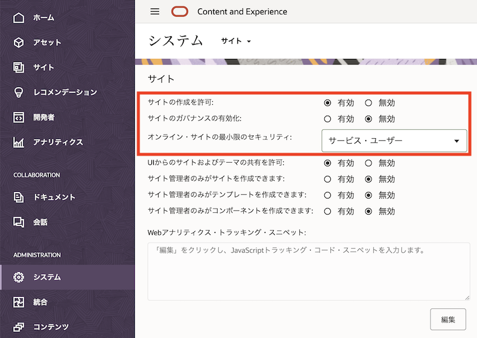

1. 画面を最下部までスクロールし、**保存** をクリックします

    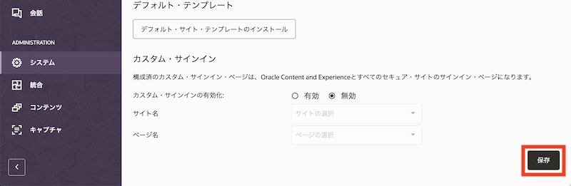

 

## 1.3 サイトを作成する

先ほどの設定通りのサイト・セキュリティでWebサイトが作成されることを確認します

1. 左ナビゲーションで **サイト** をクリックします

1. **作成** をクリックします

    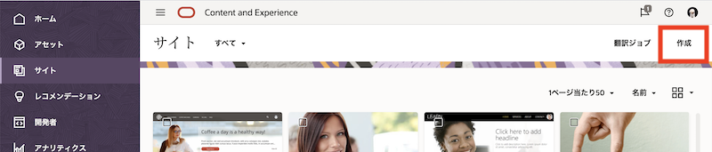

1. 任意のテンプレートを選択します（ここでは`Access`を選択）

    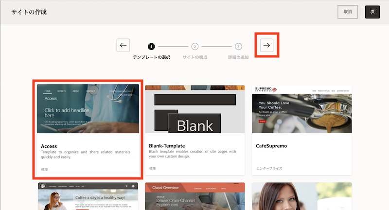

    > **[Memo]**  
    > テンプレートが表示されない場合、OCEインスタンスのサービス管理者に連絡し、デフォルト・サイト・テンプレートのインストールとテンプレートへのメンバー追加（アクセス権限の設定）を依頼してください

1. アクセス・セキュリティの項目が **サービス・ユーザー** であることを確認します。タイプで **標準** を選択し、**右矢印（→）** をクリックします

    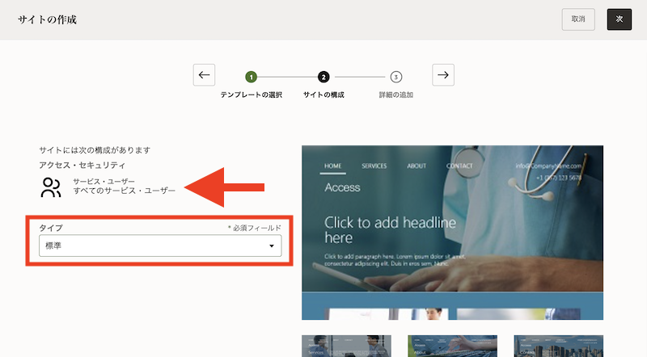

1. 任意のサイト名（ここでは`DemoIntraSite`）を入力し、**右矢印（→）** をクリックします

    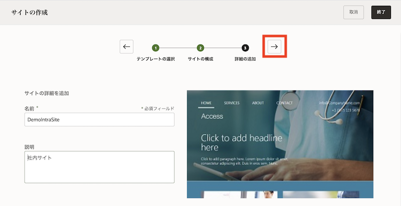

1. サイトが作成されます。作成されたサイトを選択し、**プロパティ** をクリックします

    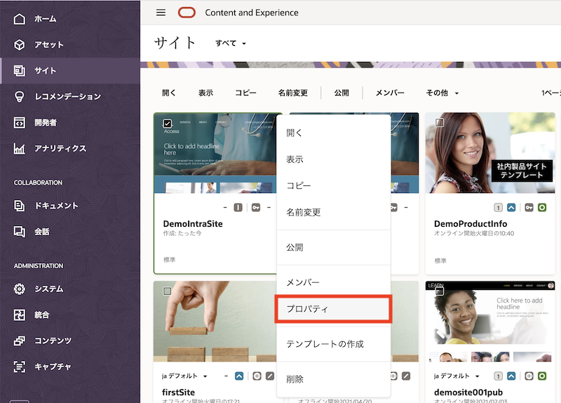

1. **セキュリティ** タブをクリックします

1. 「オンラインのときにこのサイトにアクセスできるユーザー」で、**サービス・ユーザー** が選択されていることを確認します。また、「特定のユーザー」の選択項目のみが表示され、「訪問者」や「クラウドユーザー」を選択する項目が表示されないことを確認します

    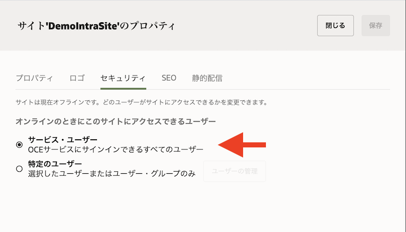

1. **閉じる** をクリックします。

### 【説明】サイト単位のサイトセキュリティの設定

- サイト・セキュリティを変更できるのは、その **サイトの所有者**、もしくは **マネージャ権限を付与されたユーザー** です
- パブリック→セキュア（もしくはその逆）のようなサインイン要件が異なるサイト・セキュリティ変更をする場合、サイトステータスを **オフライン状態** にする必要があります
- サイト・セキュリティを変更する際、サービス管理者が設定した **オンライン・サイトの最小限のセキュリティ** を超えるようなアクセス権限を設定することはできません
    - 例) オンライン・サイトの最小限のセキュリティが **クラウド・ユーザー** の場合
        - 作成されるサイトの公開範囲は **クラウド・ユーザー**
        - 「クラウド・ユーザー」→「訪問者」「サービスユーザー」への変更可
        - 「クラウド・ユーザー」→「公開」への変更不可

 

## 1.4 サイトを公開する

1. サイトを公開します。作成されたサイトを選択し、**公開** をクリックします

1. 作成されたサイトを選択し、**オンラインにする** をクリックします。サイトをオンライン状態（外部から閲覧可能な状態）にします

1. サイトの **プロパティ** を表示し、**サイトURL** をコピーします

    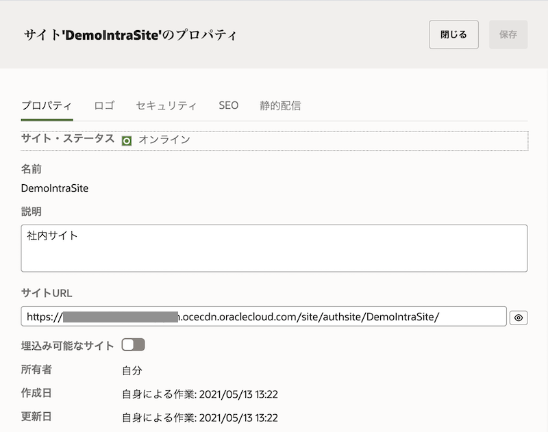

1. コピーしたサイトURLをOCEにサインインしていないブラウザを開きます

1. ユーザーIDとパスワードを入力すると、Webサイトにアクセスできます

    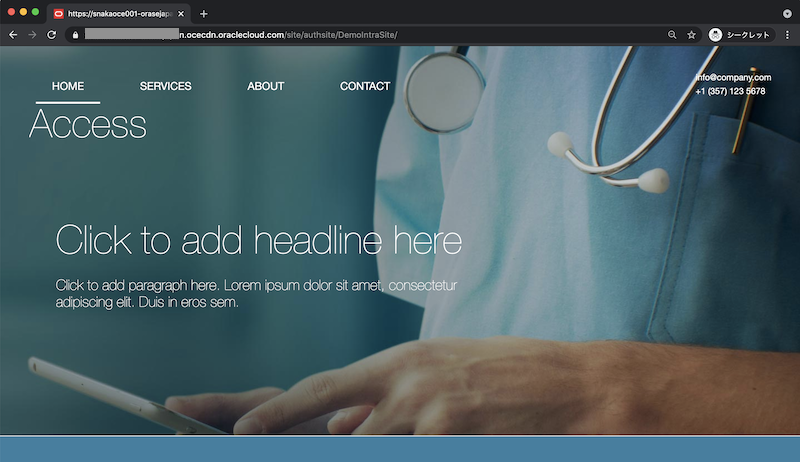

 
 

# 2. サイト・ガバナンス

## 2.1 説明

サイト・ガバナンスを使用すると、ユーザーは企業ポリシーやブランディングに準拠したサイトを簡単に作成できます。また、サイト管理者は、ユーザーによるサイトの作成や承認などのステータスを一元化的に管理できます。

サイト・ガバナンスが提供する機能は以下の通りです

1. **サイト管理者が承認したテンプレートをユーザーに提供**
    - サイト管理者は企業のポリシーやブランディング、ビジネス要件に応じたテンプレートを準備・有効化することで、エンドユーザーに利用させることができます
    - サイト管理者はテンプレートに対して、作成されるサイトのタイプ（標準/エンタープライズ）やセキュリティ（公開範囲）、有効期限、言語、サイト作成時の承認要否、テンプレートを利用できるユーザーの制限、などを設定できます

1. **サイト作成のリクエストと承認**
    - ユーザーは、管理者によって有効化されたテンプレートを選択し、サイト名などの必要最小限の項目入力をするだけで、サイト作成をリクエストできます
    - サイト・ガバナンスにより作成されたサイトは、必ずサイト管理者が設定したガイドラインに準拠し、サイト管理者が承認したサイトのみが作成されます

1. **サイトの一元管理**
    - サイト管理者は、どのユーザーがサイト作成をリクエストしたのか？作成途中や公開中のサイトなどを一元的に管理・監視できます
    - 必要に応じてサイトのステータスを確認・変更できるため、サイト全体の管理・運用を効率化します

 

## 2.2 サイト・ガバナンス機能の有効化

サイト・ガバナンスを利用するためには、システム設定より機能を有効化します（デフォルトは無効）

1. OCEインスタンスにシステム管理者(`CECServiceAdministrator`)権限を持つユーザーでサインインします

1. **ADMINISTRATION:システム → サイト** を開きます

1. 「サイトのガバナンスの有効化」を **有効** を選択します

    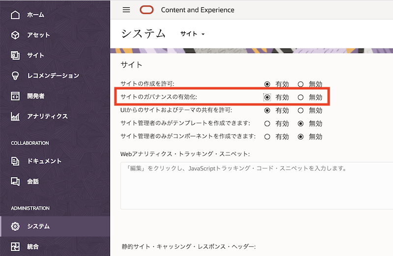

    > **[Memo]**  
    > サイトガバナンスを有効化すると、**オンライン・サイトの最小限のセキュリティ** の項目は非表示となります。サイト・ガバナンスを利用する場合、オンライン・サイトの最小限のセキュリティはテンプレート単位で設定します

1. 画面を最下部までスクロールし、**保存** をクリックします

 

## 2.3 テンプレートの構成と有効化

サイト管理者でテンプレートのポリシーとオーディエンスを構成し、有効化します

1. OCEインスタンスにサイト管理者(`CECSitesAdministrator`)権限を持つユーザーでサインインします

1. **開発 → テンプレート** を開きます

1. テンプレートを開きます。今回は `Access` テンプレートをクリックしますします

    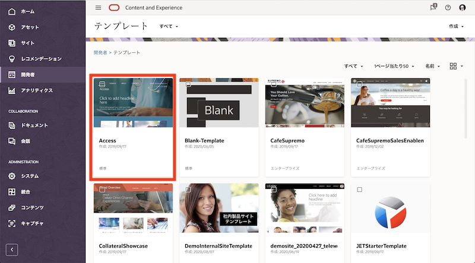

1. **ポリシー** タブをクリックし、以下の通りポリシーを設定します

    - タイプ: 標準(設定済/変更不可)
    - 承認: **管理者**
    - 最小セキュリティ: **クラウド・ユーザー**
    - サイトの有効期限: **なし**

        

1. **オーディエンス** タブをクリックし、「このテンプレートを使用してサイトを作成できるユーザー」で **全員** を選択します

    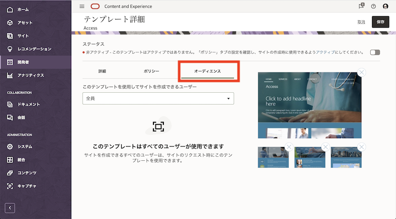

1. ステータスのスイッチをクリックし、**アクティブ** に切り替えます

    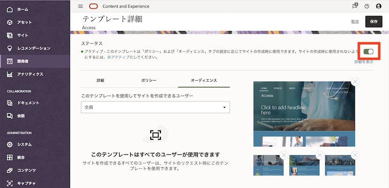

1. **保存** をクリックします

 

## 2.4 サイト作成リクエストの送信

サイトを作成します。サイトガバナンスが有効化されている場合、サイト作成リクエストがサイト管理者に送信されます。サイト管理者による承認操作が行われるまで、サイト作成処理は実行されません

1. OCEインスタンスに一般ユーザー(`CECStandardUser` or `CECEnterpriseUser`)権限でサインインします

1. **サイト** を開き、**作成** をクリックします

    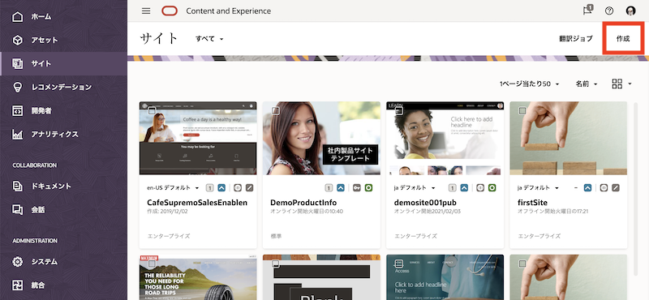

1. テンプレートを選択します。ここでは、先ほど有効化した **Access** テンプレートを選択します

    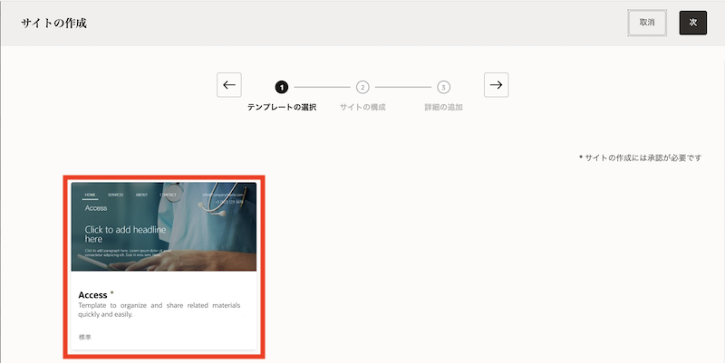

1. タイプ、アクセス・セキュリティ、承認を確認します。2.3項で設定したテンプレートの構成通りであることを確認し、**「次」** をクリックします

    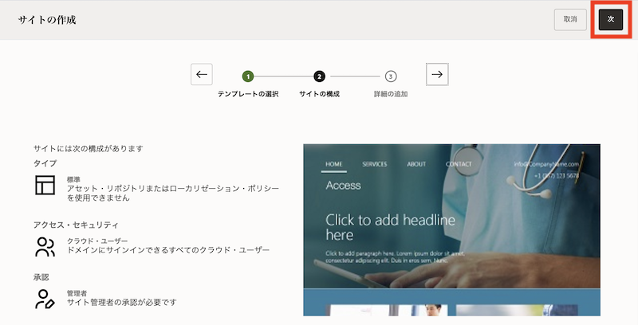

1. 名前、説明、理由を入力します。ここでは以下の通りに入力し、**終了** をクリックします

    - 名前: **governancesite1**
    - 説明: (任意)
    - 理由: (任意)

        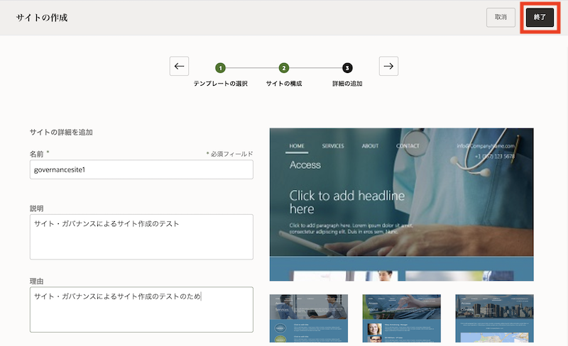

1. サイト作成リクエストがサイト管理者に送信されます

    > **[Memo]**  
    > このタイミングではサイトは作成されません。サイト管理者の承認後に、サイトが作成されます  
    > サイト管理者ロール(CECSitesAdministrator)が付与されたユーザーがサイト作成リクエストを送信すると、承認無しにサイトが作成されます

1. **サイト → リクエスト** を選択します。承認待ちのサイト作成リクエストを確認できます

    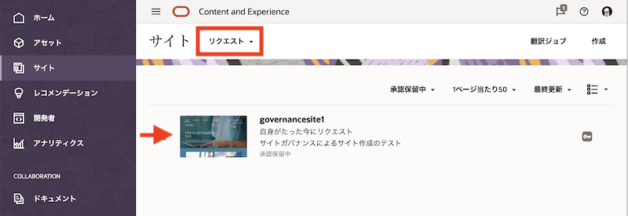

 

## 2.5 サイト作成リクエストの承認

サイト作成リクエストは、サイト管理者が承認します。承認後、サイト作成処理が実行されます。
承認後に作成されたサイトは、サイト作成リクエストを送信したユーザーが編集・公開ができます。さらに、サイト管理者(`CECSitesAdministrator`)権限を持つユーザーもアクセスが可能です

1. OCEインスタンスにサイト管理者(`CECSitesAdministrator`)権限でサインインします

1. **サイト → リクエスト** を開きます。先ほど送信されたサイト作成リクエストが確認できます

1. リクエストをクリックし、内容を確認します。問題がなければ、**承認** をクリックします

    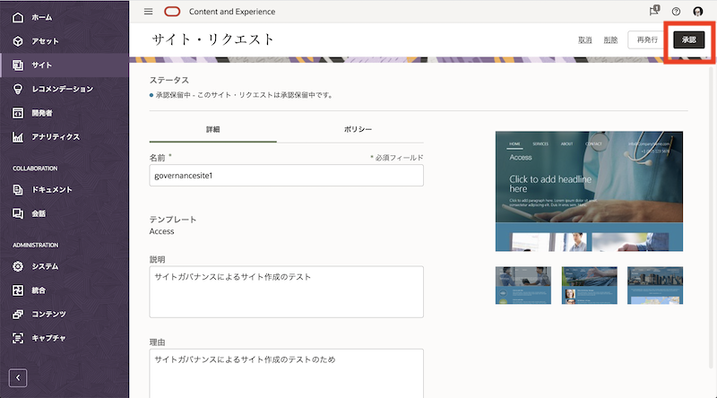

1. サイトが作成されます。作成されたサイトのプロパティを表示し、2.3項で設定したタイプ(=標準)およびサイト・セキュリティ(=クラウド・ユーザー)でサイトが作成されていることを確認します

    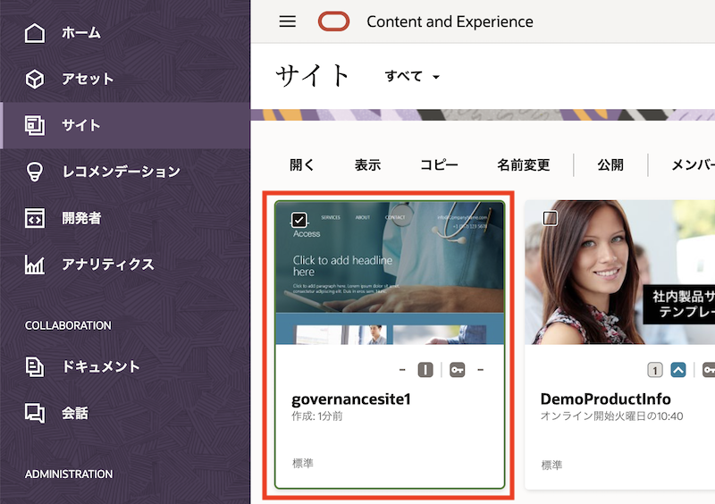

    > **[Memo]**  
    > 作成されたサイトは、サイト作成リクエストを送信したユーザーが編集・公開できます。また、サイト管理者(CECSitesAdministrator)権限を持つユーザーもアクセスが可能です

 

以上でこのチュートリアルは終了です。
