このチュートリアルは、OCM でカスタムテンプレートを自作する手順について、ステップ・バイ・ステップで紹介します。なお、ここではテンプレート(Templates)やテーマ(Themes)の違いについて簡単に紹介します。


  | |テーマ(Themes)|テンプレート(Templates)|
  | :- | :- | :- |
  | **概要** |- サイトの全体的な見た目(デザイン)を定義したもの<br />- サイトの各ページ同士で視覚的な統一感を与える<br />- テーマはテンプレートに含まれる<br/>|- Webサイトを作成する際に利用する「ひな形」<br />- 「事前定義済テンプレート」と「カスタムテンプレート」の2つ<br />- Webサイト作成時の起点として利用 |
  | **構成要素** |- ページ・レイアウト(html)<br />- スタイルシート(css)<br />- JavaScript<br />- 画像など<br />- 構成ファイル|- **テーマ** <br />- ページ<br />- ページ内のサンプルコンテンツ(アセット、ファイルなど)<br />- ページ内のカスタムコンポーネント|


また、詳細については下記チュートリアルや製品ドキュメントをご確認ください。

- OCMチュートリアル
  - [Oracle Content Management で作成したサイトのバナー画像を変更しよう - 2.テンプレートおよびテーマについて ](../72_change_banner/#2-%E3%83%86%E3%83%B3%E3%83%97%E3%83%AC%E3%83%BC%E3%83%88%E3%81%8A%E3%82%88%E3%81%B3%E3%83%86%E3%83%BC%E3%83%9E%E3%81%AB%E3%81%A4%E3%81%84%E3%81%A6)

- 製品ドキュメント
  - [About Templates](https://docs.oracle.com/en/cloud/paas/content-cloud/creating-experiences/templates.html)
  - [About Themes](https://docs.oracle.com/en/cloud/paas/content-cloud/creating-experiences/themes.html)
  - [Create a Site Template from Bootstrap or a Website Design Template](https://docs.oracle.com/en/cloud/paas/content-cloud/creating-experiences/create-site-template-bootstrap-or-website-design-template.html)



この文書は、2022年6月時点での最新バージョン(22.5.2)を元に作成されてます。   チュートリアル内の画面ショットについては Oracle Content Management の現在のコンソール画面と異なっている場合があります。   


<br />

# 1. 前提条件

- [Oracle Content Management インスタンスを作成する](../create_oce_instance)

- OCM の利用ユーザーに、少なくとも下記3つのOCMインスタンスのアプリケーション・ロールが付与されていること
    - **CECEnterpriseUser**
    - **CECDeveloperUser**
    - **CECServiceAdministrator**

      > **[Memo]**  
      > ユーザーの作成とアプリケーションロールの付与手順は、[Oracle Content Management インスタンスの利用ユーザーを作成する](../create_idcs_group_user) をご確認ください。  

- OCMのサービス管理者により、**デフォルト・テンプレートがインストール済** であること。また、デフォルト・テンプレートの **StarterTemplate** がユーザーに共有されていること

- OCMのデスクトップアプリケーションがクライアント端末にインストール済で、OCMインスタンスとの接続が完了していること。インストールおよび接続方法は[その11: デスクトップ・アプリケーション](../11_desktop_application)をご確認ください

なお、必須ではないが、事前に以下チュートリアルを実施済みで、OCMのサイト作成機能の利用方法を理解していることが望ましい

- [Oracle Content Management のサイト機能を使ってみよう【初級編】](../61_create_site/)
- [Oracle Content Management を Webコンテンツ管理(Web CMS) として利用しよう【初級編】](../62_webcms)

<br>


# 2. 自作するWebサイトのモックアップを準備する

OCMのカスタムテンプレートとして利用するWebサイトの「モックアップ」を準備します。このチュートリアルでは、Start Bootstrapの **Bare** を使用します


モックアップとは、色やレイアウトなどのビジュアルデザインを表現した表面上の完成されたWebサイトのこと。Webサイト内の動作や機能の実装は必須ではありません 



1. 以下のURLにアクセスし、**Free Download** をクリックします

    - [https://startbootstrap.com/template/bare](https://startbootstrap.com/template/bare)

      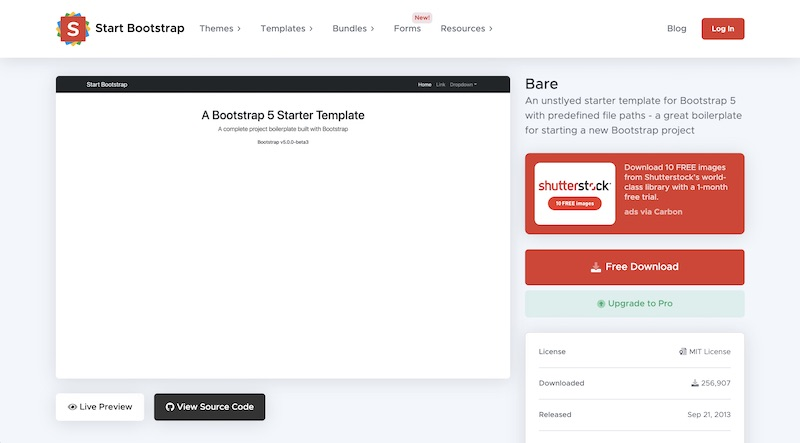

1. 取得したZIPファイルを任意のフォルダに解凍します。解凍すると、以下のようなフォルダ構成で展開されます

    ~~~
    startbootstrap-bare-gh-pages
        index.html
        assets
            favicon.ico
        css
            style.css
        js
            script.js
    ~~~

    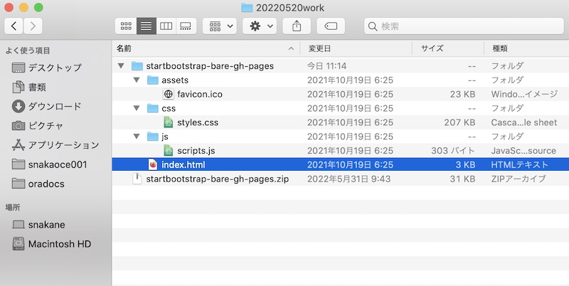

1. **index.html** をWebブラウザで開き、デザインが崩れていないか確認します


<br/>

# 3. カスタムテンプレート開発用のサイトを作成する

カスタムテンプレートは、OCM上の既存サイトより作成されます。ここでは、カスタムテンプレート開発用の新規サイトを作成します

カスタムテンプレートを作成する際は、OCMのデフォルト・テンプレートの **StarterTemplate** を利用します。StarterTemplateは、サイト作成時に作成サイト専用のテーマ(Theme)がコピーして作成されます。そのため、テーマ内のファイルを更新することで、デザインがカスタマイズされたサイトの作成が容易になります


## 3.1 新規サイトの作成

1. ブラウザでOCMインスタンスにアクセスします

1. サイト→ **「作成」** をクリックします

    1. 「テンプレートの選択」で **Starter Template** を選択します

        

    1. 「サイトの構成」のタイプで **標準** を選択します

        

    1. 「詳細の追加」の **「名前」** にサイト名を入力します。ここでは **CustomStartBootstrap** と入力し、**「終了」** をクリックします

        > **【TIPS】**  
        > OCMインスタンス内で、サイト名はユニークする必要があります。名前が重複するサイトを作成すると、エラーとなり作成に失敗します  

        

1. しばらくすると、サイトが作成されます

1. 開発者→ **「すべてのテーマ表示」** をクリックし、先ほど作成されたサイト専用のテーマ **CustomStartBootstrapTheme** が存在することを確認します

    > **【TIPS】**  
    > Starter Templateから作成されたサイトのテーマは、**(サイト名)Theme** で作成されます  

    


## 3.2 テーマをローカル環境に同期する

テーマを編集する際は、デスクトップ・アプリケーションを利用し、ローカル環境に同期すると便利です。

1. タスクバーの「デスクトップアイコン」をクリックします

1. **「同期化するフォルダを選択」** をクリックします

    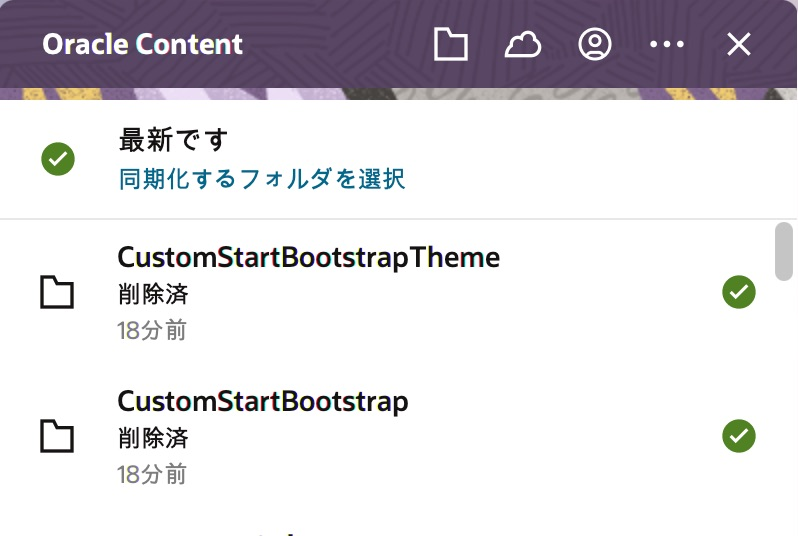

1. **「サイト・アセット」** タブをクリックします

    > **【TIPS】**  
    > 「サイト・アセット」タブが表示されていない場合は、Oracle Contentのメニュー→プリファレンス→ **Enable Syncing Sites Assets** を有効化（選択）します

1. 先ほど作成したカスタムテンプレート開発用サイトのテーマ **CustomStartBootstrapTheme** を選択し、**「完了」** をクリックします

    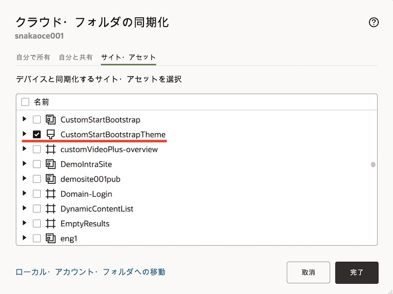

1. **CustomStartBootstrapTheme** がローカル環境に同期されます

1. **CustomStartBootstrapTheme** のフォルダ構成を確認します。以下のような構成となります

    ~~~
    CustomStartBootstrapTheme
        assets                /* JavaScript、CSS、画像、およびレイアウトで参照されるその他のサポートファイルを管理 */
            css               /* スタイルシート */
                style.css
                navbar.css
            js                /* JavaScriptファイル */
                topnav.js
            img               /* 画像ファイル */
            plugin
        designs
            default
                design.css
                design.json
                facebook.png
                  :
        layouts               /* ページ・テンプレートのためのHTMLファイル。サイトのページを表示する際に使用*/
            index.html
              :
        responsepages
            404.html
        _folder_icon.png
        viewport.json
        components.json
    ~~~

    

## 3.3 テーマ内にWebサイトのファイルをコピーする

2.項で取得したモックアップのファイルを、3.2項でローカルに同期したテーマ内のフォルダにコピーします。ここでは、以下の通りにコピーします

  | モックアップのファイル |→| コピー先のテーマのフォルダ |
  | :- | - | :- |
  | htmlファイル | | `CustomStartBootstrapTheme/layouts/` |
  | cssファイル | | `CustomStartBootstrapTheme/assets/css/` |
  | jsファイル | | `CustomStartBootstrapTheme/assets/js/` |
  | 画像ファイル | | `CustomStartBootstrapTheme/assets/img/` |

1. startbootstrap-bare-gh-pages/**index.html** を、`CustomStartBootstrapTheme/layouts/`フォルダにコピーします

1. startbootstrap-bare-gh-pages/css/**style.css** を、`CustomStartBootstrapTheme/assets/css/`フォルダにコピーします

1. startbootstrap-bare-gh-pages/js/**script.js** を、`CustomStartBootstrapTheme/assets/js/`フォルダにコピーします

    


## 3.4 テーマ内にコピーしたhtmlファイルを編集する

テーマ内にコピーした **index.html** ファイルをエディタで開き、テーマ内の環境にあわせて編集します  

1. テーマ内にコピーした **CustomStartBootstrapTheme/layouts/index.html** をエディタで開きます

1. スタイルシートとJavaScriptへのパスを以下の通りに修正します

    | 修正前 | 修正後 |
    | :- | :- |
    | href="css/styles.css" | `href="_scs_theme_root_/assets/css/styles.css"` |
    | src="js/scripts.js" | `src="_scs_theme_root_/assets/js/scripts.js"` |

    > **【TIPS】**  
    > `_scs_theme_root_` は、OCMのテーマ(Theme)が使用されている環境にあわせて、自動的に変換されます。今回の場合は、`_scs_theme_root_` → `_themes/CustomStartBootstrapTheme/` と変換されます

    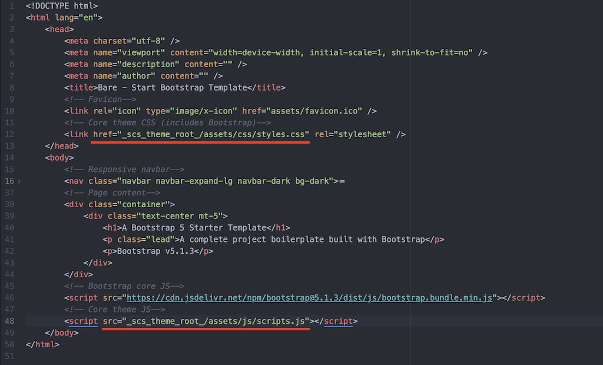


1. OCMのレイアウトファイルとして利用するための必須タグを、index.htmlに追加します

    1. `<head>` タグの直後に、以下を追加します

        ```html
          <!-- Avoid FOUC issue in FF with async loading of style sheets -->
          <style> body { opacity: 0; }</style>
        ```

    1. `</head>` タグの直前に、以下を追加します

       ```html
          <!-- Custom styles for this template -->
          <link rel="stylesheet" type="text/css" href="_scs_theme_root_/designs/_scs_design_name_/design.css">

          <!--$SCS_RENDER_INFO-->
          <!--$SCS_SITE_HEADER-->
          <!--$SCS_PAGE_HEADER-->
        ```


    1. `</body>` タグの直前に、以下を追加します

        ```html
          <!-- SCS JS libraries -->
          <script data-main="/_sitescloud/renderer/renderer.js" src="/_sitescloud/renderer/require.js"></script>
          <!--$SCS_PAGE_FOOTER-->
          <!--$SCS_SITE_FOOTER-->

          <!-- Avoid FOUC issue in FF with async loading of style sheets -->
          <style> body { opacity: 1; }</style>
        ```

    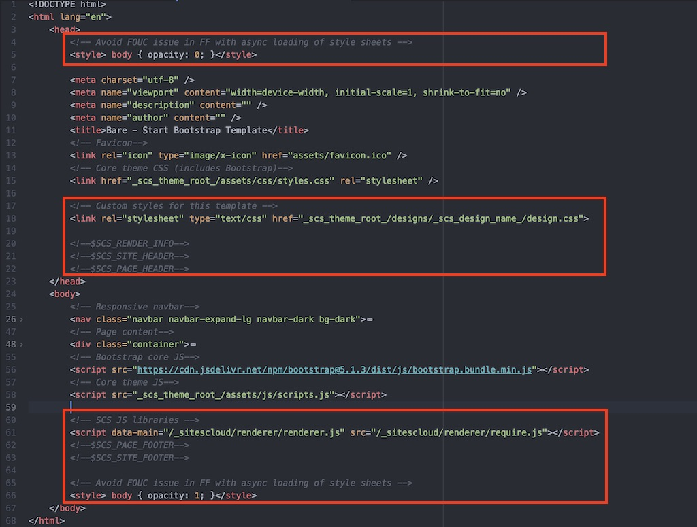


1. 保存します。デスクトップアイコンを確認し、クラウド上に **index.html** が反映されるのを確認します

    > **【TIPS】**  
    > index.htmlファイルに追加した `<!--$SCS_RENDER_INFO-->` などのトークンやタグについては、以下製品ドキュメントをご確認ください  
    > [About Layouts](https://docs.oracle.com/en/cloud/paas/content-cloud/creating-experiences/layouts.html)


## 3.5 確認

サイト編集画面を開き、サイトが表示されるかを確認します

1. OCMにアクセスし、サイト→**「CustomStartBootstrap」** を選択し、**「開く」** をクリックします

    

1. サイト編集画面に、2.項で取得したモックアップ StartBootstrap が表示されることを確認します

1. 新規更新（ここでは`update`）を作成し、編集モードに切り替えます。編集モードでもStartBootstrapが表示されることを確認します

    

<br />

# 4. 編集領域を追加する

ここでは、ページ内に **スロット(slot)** という編集領域を追加します。スロットをページに追加することで、サイト編集画面よりコンポーネントを配置し、編集が可能になります。

スロットは、class属性に **scs-slot** の値を持つレイアウト内のDIV要素です。スロットを定義することで、サイト編集ユーザーはサイトのコンテンツを入力するためのコンポーネントをページに追加できるようになります。**scs-slot** class属性を割り当てることにより、複数のDIV要素をスロットとして定義できます。

  > **【TIPS】**  
  > 各スロットには、一意の **id属性** が必要です  
  > スロットをネストすることはできませんが、CSSを使用してスロットをオーバーレイすることにより、スロットのネストが可能です。これを行う場合は、**コンポーネントグループまたはセクションレイアウト** を使用します  

さらに **scs-responsive** のクラス属性値を持つスロットは、ブラウザのビューポートが解像度を変更すると、コンテンツを更新します。これにより、スロットを大きなデスクトップディスプレイまたは小さなモバイルデバイスに対応してレンダリングできます。

## 4.1 スロットを追加する

1. ローカルに同期した **CustomStartBootstrapTheme/layouts/index.html** をエディタで開きます

1. `<body>` 内のオリジナルのテキストの直下に、以下を追加します

    ```html
    <div id="mainContentSlot" class="scs-slot scs-responsive"></div>
    ```

    

1. **index.html** を保存し、クラウド上に反映されるのを待ちます


## 4.2 確認

1. サイト編集画面を開いているブラウザをリロードします

1. サイト編集画面を編集モードで開きます。StartBootstrapのオリジナルテキストの下に、**スロット mainContentSlot** の領域が表示されることを確認します

    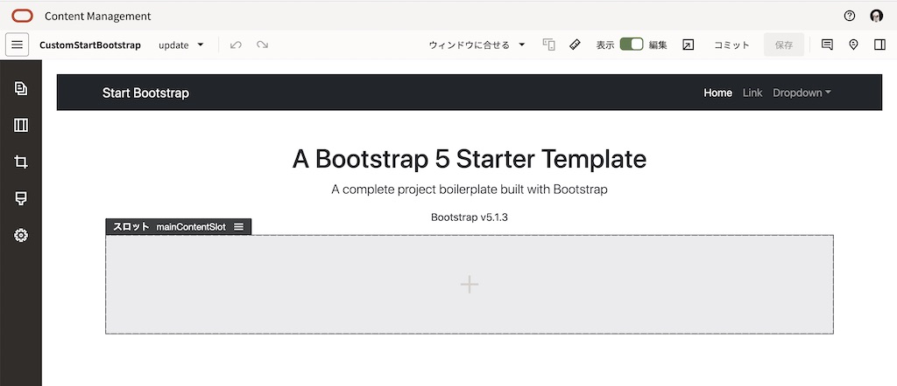

1. 任意のコンポーネントをドラッグ&ドロップで配置し、編集します（ここでは **段落** を配置）

    

1. 表示モードに切り替え、保存します

    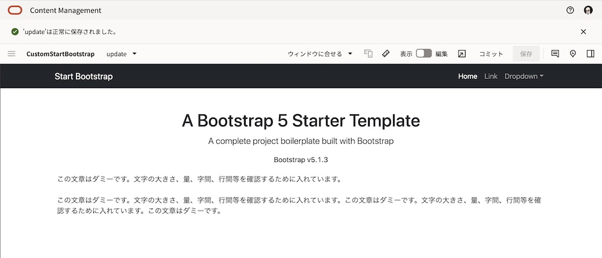

<br />

# 5. ヘッダーロゴとナビゲーションを表示する

現在のナビゲーションを確認すると、CustomStartBootstrapサイトで定義されたページとは異なるナビゲーションメニューが表示されます。これは、取り込んだindex.htmlにハードコーディングされたナビゲーションメニューが記述されているためです。ここでは、OCMのページで定義されたナビゲーションメニューを動的に取り込み、表示するように構成します


## 5.1 ナビゲーションを表示するカスタムコンポーネントをインポートする

OCMのサイト毎に定義されたナビゲーション（階層）を動的に取り込んて表示するには、OCMが提供するSites Rendering API (SCSRenderAPI)を利用し、JavaScriptによるコーディングを行います。詳細は、以下ドキュメントををご確認ください

- [Site Navigation](https://docs.oracle.com/en/cloud/paas/content-cloud/creating-experiences/site-navigation.html)
- [Sites Rendering API](https://docs.oracle.com/en/cloud/paas/content-cloud/sites-rendering-api/index.html)

今回は、事前に作成したカスタムコンポーネント(StartBootstrap-NavMenu)をインポートし、動的ナビゲーションを表示します

1. 以下リンクより、カスタムコンポーネント(StartBootstrap-NavMenu)をローカル環境にダウンロードします

    - [StartBootstrap-NavMenu.zip](/ocitutorials/content-management/78_create_custom_template/StartBootstrap-NavMenu.zip)

1. OCMにアクセスし、開発者→ **「すべてのコンポーネントの表示」** をクリックします

1. 右上の **作成→「コンポーネントのインポート」** をクリックします

    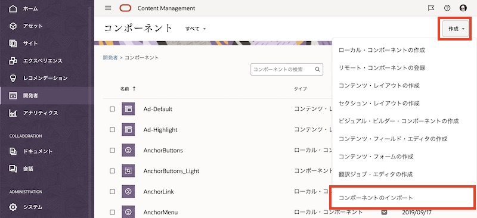

1. ローカルにダウンロードしたStartBootstrap-NavMenu.zip を任意のフォルダにアップロードします

1. アップロードしたコンポーネントを選択し、**「OK」** をクリックします

    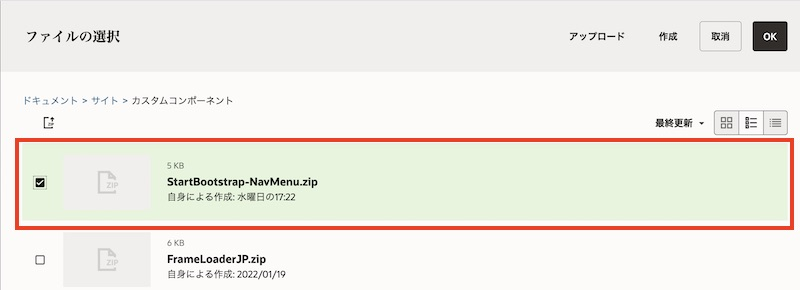


## 5.2 index.htmlを編集する

1. ローカルに同期した **CustomStartBootstrapTheme/layouts/index.html** をエディタで開きます

1. `<nav>〜</nav>` のコードを削除し、以下のコードを追加します

    ```html
    <link href="_scs_theme_root_/assets/css/navbar.css" rel="stylesheet" />
    <div class="header row">
      <div class="logocontainer scs-slot col-9 col-md-5" id="logocontainer"></div>
      <div class="menucontainer scs-slot col-3 col-md-7" id="navMenu"></div>
    </div>
    ```

    

1. **保存** し、クラウド上に反映されるのを待ちます


## 5.3 navbar.cssを編集する

1. ローカルに同期した **CustomStartBootstrapTheme/assets/css/navbar.css** をエディタで開きます

1. `.menucontainer` を以下の通りに修正します

    ```css
    .menucontainer {
        padding-right: 8vw;
        margin: 0;
        min-height: 72px;
        height: 72px;
        display: flex;
        align-items: center;
    }
    ```

    

1. **保存** し、クラウド上に反映されるのを待ちます


## 5.4 サイトを編集する

1. サイト編集画面を開いているブラウザをリロードし、編集モードに切り替えます

1. `navMenu`スロット内の **NavMenuコンポーネントを削除** します

    

1. `logocontainer` スロットのロゴテキストを、**Start Bootstrap** に変更します

    

1. **コンポーネント→カスタム** より、5.1項でアップロードした **StartBootstrap-NavMenu** を選択し、ドラッグ&ドロップで`navMenu`スロット内に配置します

    

1. 配置した **StartBootstrap-NavMenu** の設定パネルを開き、位置合わせを **右寄せ** に変更します

    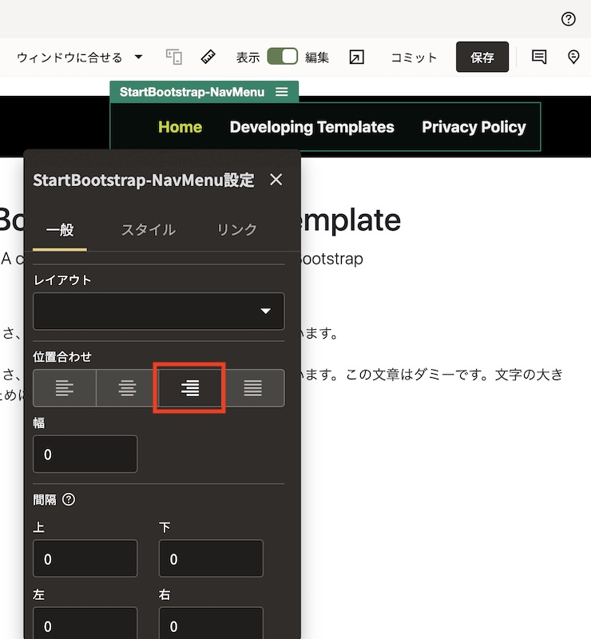

1. 設定パネルを閉じ、**保存** します


## 5.5 確認

1. サイト編集画面を編集モードで表示します。ロゴテキストとナビゲーションが正しく表示されることを確認します

1. 左サイドナビの **ページ** を開きます。ページで定義されたナビゲーション構成が、Webサイトのナビゲーションと一致していることを確認します

    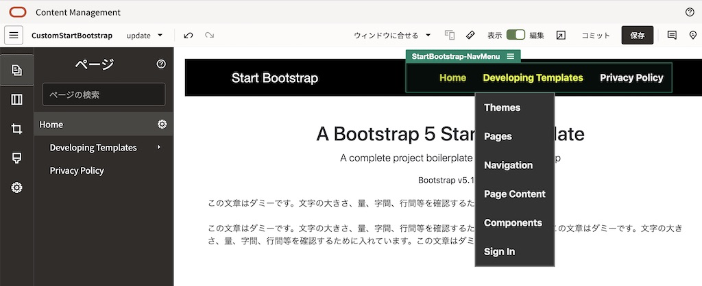

1. **「ウィンドウに合わせる▼」** より、ページの表示サイズを切り替えます。モバイルのサイズでもロゴテキストとナビゲーションがレスポンシブで表示されることを確認します

    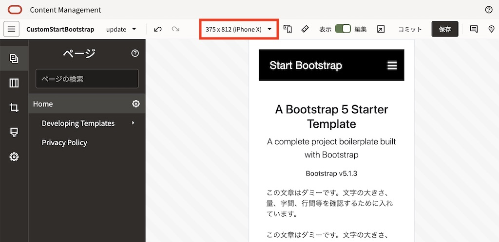

1. ページでナビゲーションを新規追加したり、表示順序を変えたりします。変更内容がサイト側に反映されることを確認します（ここでは **Privacy Policy** と **Developing Templates** の表示順序を入れ替えました）

    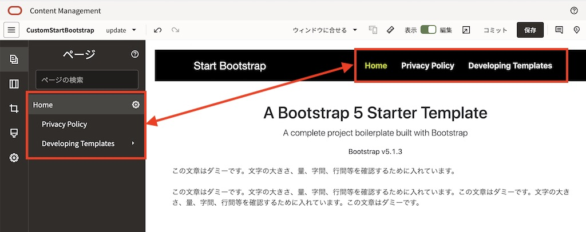

1. サイトを **保存** します。続けて **コミット** します

1. サイト編集画面を閉じます

<br />

# 6. 作成したサイトをテンプレートとして登録する

作成したサイトはテンプレートとして登録することができます。テンプレートとして登録することで、ユーザーが新しいサイトを作成する際に、今の状態のサイトをサイト作成時の **開始点** として利用できます

1. CustomStartBootstrapサイトを選択し、**「テンプレートの作成」** をクリックします

    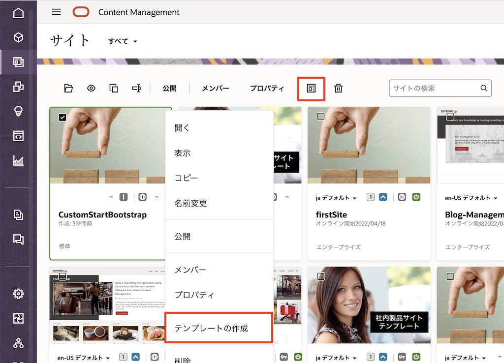

1. **名前** と **説明** を入力します。ここでは以下の通りに入力し、**「テンプレートの作成」** をクリックします

    - 名前: **CustomStartBootstrapTemplate**
    - 説明: (任意)

      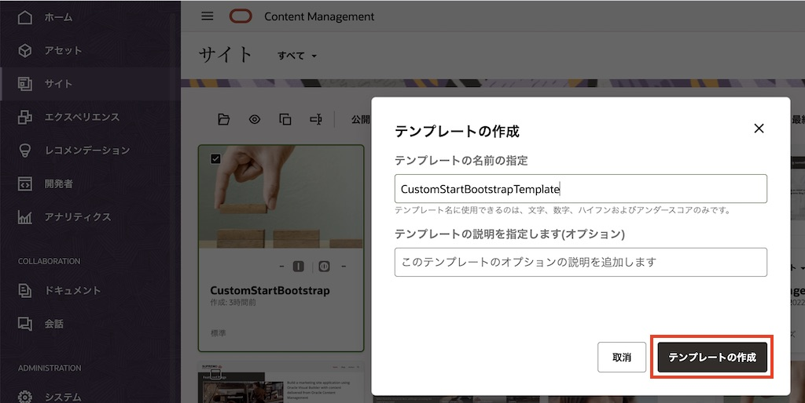

1. 「'CustomStartBootstrapTemplate'が **テンプレート** に作成されました」の **テンプレート** をクリックします

    

1. **CustomStartBootstrapTemplateが存在する** ことを確認します

    

1. サイトに戻り、先ほど作成した **CustomStartBootstrapTemplate** を指定して、新しいサイトを作成します

    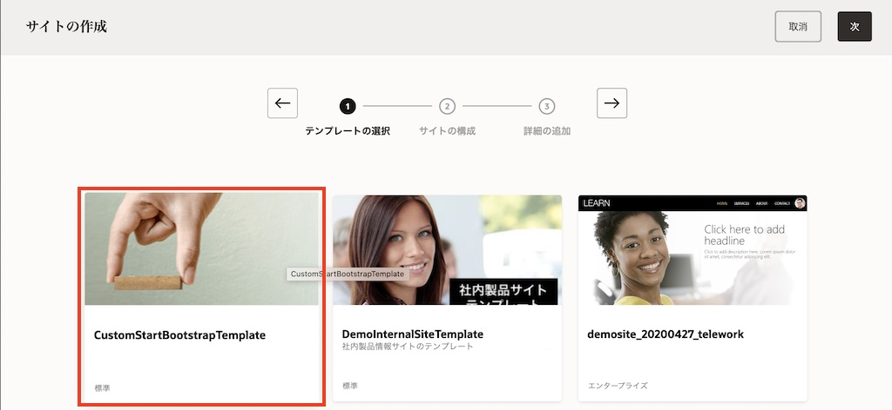

1. 5.3項で公開したサイトと同じサイトが作成されることを確認します

    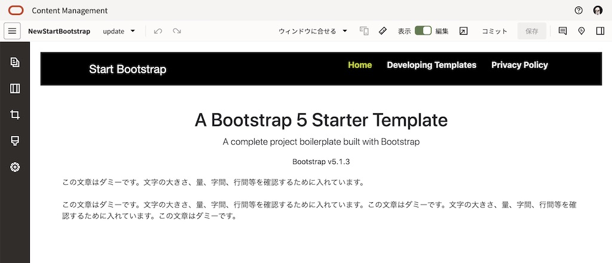

<br>

以上でこのチュートリアルは終了です。
