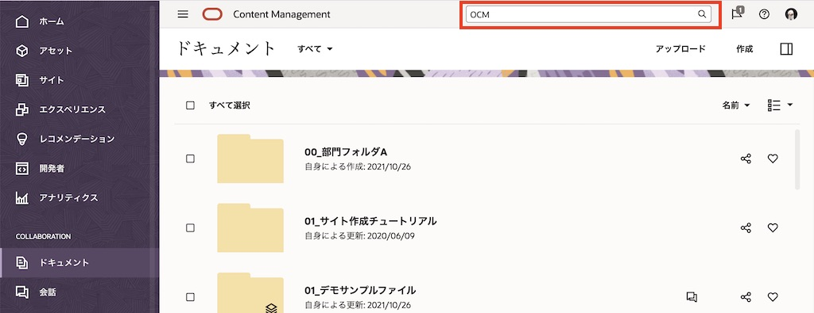
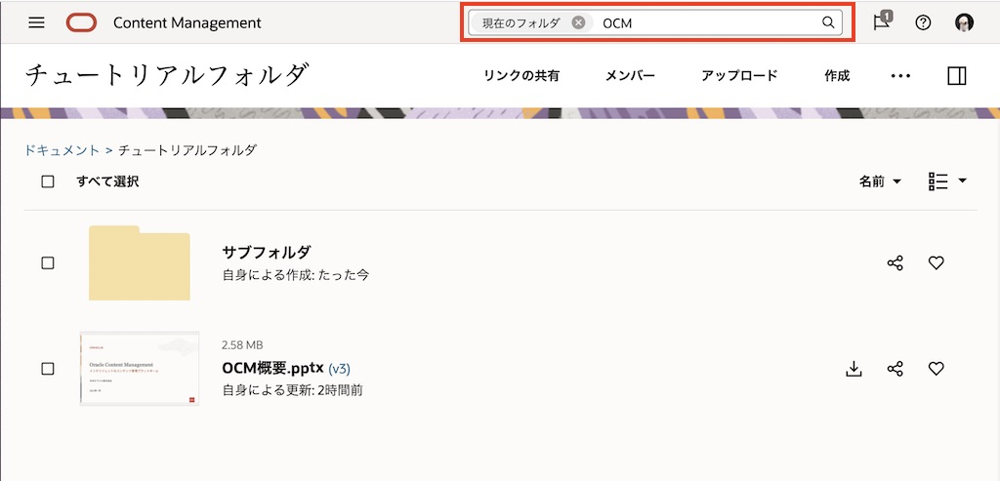
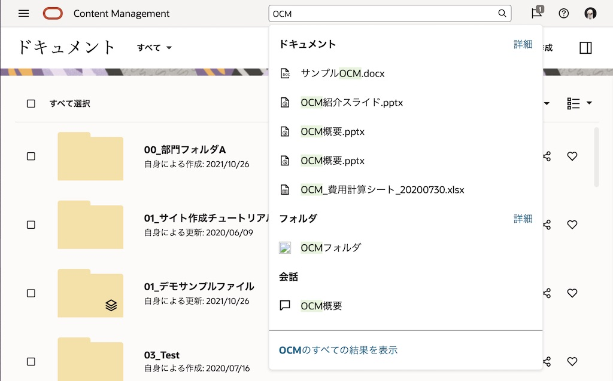

**目次に戻る**: [Oracle Content Management のファイル共有機能を使ってみよう【初級編】](../using_file_sharing)

OCM の画面上部の検索ボックスより、ファイル、フォルダ、会話、メッセージ、ハッシュタグ、ユーザー、グループを横断的に検索することができます。特定のフォルダ配下のみを限定的に検索する場合は、そのフォルダを開いた状態で、検索を実行します。

**検索機能に関する補足事項**

+ ファイルの検索対象は **名前、説明、ファイルの内容（文書内の単語など）、ファイル拡張子、ファイルの最終変更者の名前** です。また、ファイルやフォルダに関連付けられているカスタム・メタデータ、タグ、会話で使用されているハッシュ・タグおよび会話内のユーザーも検索対象となります

+ 全文検索対象のファイル形式は、以下のドキュメントをご確認ください

    + [Supported Image and Business File Formats](https://docs.oracle.com/en/cloud/paas/content-cloud/administer/supported-file-formats.html)

+ ファイルやフォルダ、会話へのアクセス権限がない場合、検索条件を満たす場合でも検索結果に表示されません

+ **最新の検索結果が表示されるには若干のタイムラグがある場合があります。** たとえば、`Report` という語を検索し、`Report` という語をその中に含む別のドキュメントを追加した場合、数秒間その最新のドキュメントは検索結果で返されません。

+ バージョン管理されているファイルは、**最新バージョンが検索対象** となります

    + （例）v3, v2, v1 の3バージョンが管理される .docx ファイルの場合、**v3** のファイルのみが検索対象となります

+ 検索では **大文字/小文字は区別されません**。つまり、`report` で検索した場合と `Report` で検索した場合の結果は同じです。

+ 検索演算子を利用できます。検索演算子も大文字小文字を区別しません。つまり、`NOT` と `not` は同じです

    + **AND 検索** : and または空白スペース(   )

    + **OR 検索** : or またはカンマ( , )

    + **NOT 検索** : not またはマイナス ( - )

+ 100を超える共有フォルダ（自分が共有したか、自分と共有されたフォルダ）がある場合、グローバル検索では期待される結果が返されないことがあります。検索は、**まずお気に入り共有フォルダで行われてから、最大100個の他の共有フォルダで行われます。** 検索前に一部のフォルダをお気に入りとして指定し、検索結果を向上させることができます。

+ **サイズが10MBを超えるアイテムは、全文検索で候補として表示されません。** アイテムは、名前全体を検索すると見つけられます。


この文書は、2021年11月時点での最新バージョン(21.11.2)を元に作成されてます。   チュートリアル内の画面ショットについては、現在のコンソール画面と異なっている場合があります。   


**前提条件**
- [Oracle Content Management インスタンスを作成する](../create_oce_instance)
- OCM の利用ユーザーに OCM インスタンスの **CECStandardUser** もしくは **CECEnterpriseUser** アプリケーション・ロールが付与されていること

 

# 1. ファイルの検索

## 1.1 ファイルを検索する

1. OCM のドキュメント・ホームを開きます

1. 検索ボックスに検索キーワード（ここでは `OCM`）を入力し、**虫眼鏡アイコン** をクリックします（もしくは、キーボードの **Enter** を押下）

    

1. ドキュメント、会話、ハッシュタグなどの検索結果が表示されます。検索キーワードはハイライト表示されます

1. **「"(検索キーワード)"を含むその他のドキュメント」** をクリックし、ドキュメントのみの検索結果を表示します。この場合 **「"OCM"を含むその他のドキュメント」** をクリックします

    

1. ドキュメント（ファイルおよびフォルダ）の検索結果のみが表示されます。以下画面ショットの通り、検索条件に合致すればフォルダも検索結果に表示されます

    

    > **【TIPS】**  
    > 検索結果に表示されるダウンロードアイコンをクリックすると、そのファイルを直接ダウンロードできます

## 1.2 フォルダ内を検索する

1. 検索するフォルダ（ここでは「チュートリアルフォルダ」）を開きます

1. 検索ボックスに検索キーワードを入力し、**虫眼鏡アイコン** をクリックします（もしくは、キーボードの **Enter** を押下）

    

1. 指定したフォルダ配下のみの検索結果が表示されます

    

## 1.3 Type-ahead 検索

入力された検索キーワードに合致すると思われる候補を自動表示します。Type-ahead 検索はファイル、フォルダ、会話の **「名前」** が検索対象となります

1. 検索ボックスに検索キーワードを入力します（ここでは `OCM` と入力）

1. 検索結果がリスト形式で表示されます

    

 

以上でこのチュートリアルは終了です。

**目次に戻る**: [Oracle Content Management のファイル共有機能を使ってみよう【初級編】](../using_file_sharing)
