この文書は Oracle Content Management(OCM) のインスタンス作成方法をステップ・バイ・ステップで紹介するチュートリアルです。


この文書は、2021年11月時点での最新バージョン(21.10.2)を元に作成されてます。   チュートリアル内の画面ショットについては、現在のコンソール画面と異なっている場合があります。   


 

# 1. 準備

## 1.1 OCM インスタンス作成手順の説明

インスタンスの作成手順は以下の通りです

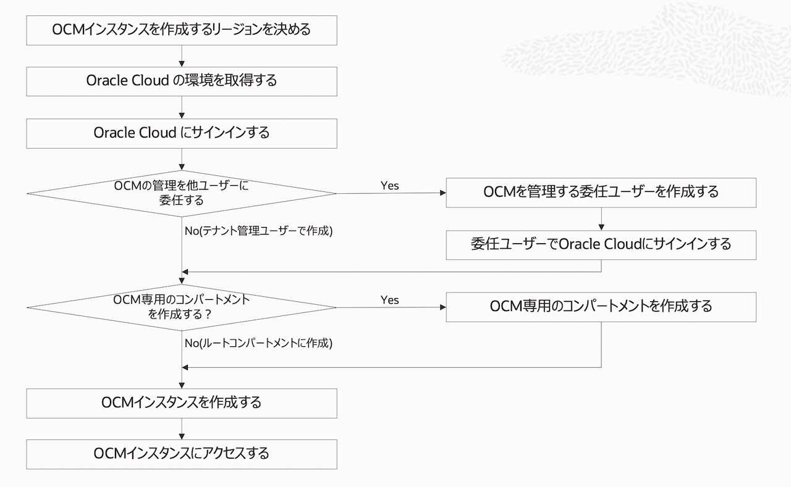

このチュートリアルでは、以下の条件で作成します
+ ホームリージョンは **US East(Ashburn)** を選択
+ インスタンスの作成ユーザーは **テナント管理ユーザー**
+ コンパートメントを作成(コンパートメント名=**OCE**)
+ ライセンス・タイプは **Premium Edition** を選択

## 1.2 Oracle Cloud の環境を準備する

Oracle Cloud のアカウントを準備します。無料のトライアル環境も利用することもできますので、この機会に取得してみましょう。

なお、トライアル環境の取得には認証用のSMSを受け取ることができる携帯電話と、有効なクレジットカードの登録が必要です（希望しない限り課金されませんので、ご安心ください）
- [Oracle Cloud 無料トライアルを申し込む](https://www.oracle.com/jp/cloud/free/)

トライアル環境のサインアップ手順はこちらをご確認ください。
- [Oracle Cloud 無料トライアル・サインアップガイド(PDF)](https://faq.oracle.co.jp/app/answers/detail/a_id/6492)
- [Oracle Cloud 無料トライアルに関するよくある質問(FAQ)](https://www.oracle.com/jp/cloud/free/faq.html)

##  1.3 Oracle Cloud にサイン・インする

OCM インスタンスは、**Oracle Cloud Infrastructure コンソール**（以降OCIコンソール）から作成します。ここでは、前の手順で作成した **テナント管理ユーザー** で OCI コンソールにアクセスします

こちらのチュートリアルもあわせてご確認ください

+ [その1 - OCIコンソールにアクセスして基本を理解する](/ocitutorials/beginners/getting-started/)

1. Webブラウザで、以下のURLにアクセスします

    + https://cloud.oracle.com

1. **Cloud Account Name （クラウドアカウント名）** を入力し、**Next** をクリックします。  
**Cloud Account Name** には、Oracle Cloud 契約時、もしくはトライアル環境を申し込んだ際に払い出される一意のID（クラウド・アカウント）を入力します

    

1. **Single Sign-On (SSO)** のIdentity Providersで **oracleidentitycloudservice** が選択されていることを確認し、その下の **Continue** をクリックします。  

    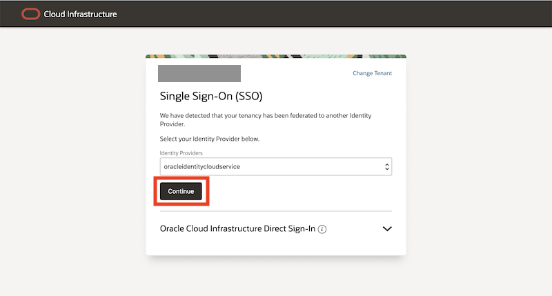

1. **ユーザー名** と **パスワード** を入力し、サイン・インをクリックします

    

1. OCI コンソールが表示されます

    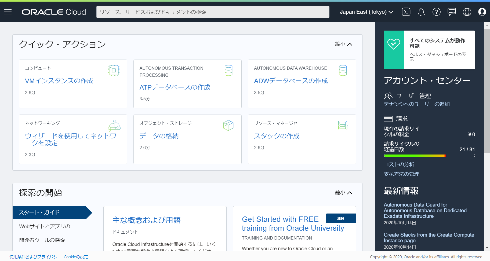

## 1.4 委任ユーザーを作成する

~~~
この手順は必須ではありません。
委任ユーザーを作成せず、テナント管理ユーザーで OCM インスタンスを作成する場合は、ここをスキップして次の手順を実施してください
~~~

### 1.4.1 説明

OCM インスタンスの作成を実行するユーザーは、下記条件を満たす必要があります

+ **Oracle Identity Cloud Service (以降IDCS) よりフェデレーションされたユーザー (=IDCS ユーザー) であること**
+ **IDCS の OCI_Administrators グループに所属していること (=OCI の管理権限が付与されていること)**

### 1.4.2 IDCSコンソールを開き、IDCSユーザー（委任ユーザー）を作成する

IDCSコンソールにアクセスし、OCI_Administrators グループに所属するIDCSユーザー(=委任ユーザー)を作成します

1. OCIコンソールに Oracle Cloud 環境を取得した際に作成した **テナント管理ユーザー** でサインインします。

1. OCI コンソールの右上のユーザーアイコンをクリックし、**「サービス・ユーザー・コンソール」** をクリックします

    

1. ホームリージョンのデータセンター(ここではAshburnが所属するNorth America)を選択し、Oracle Identity Cloud Service の **「管理コンソール」** をクリックします

    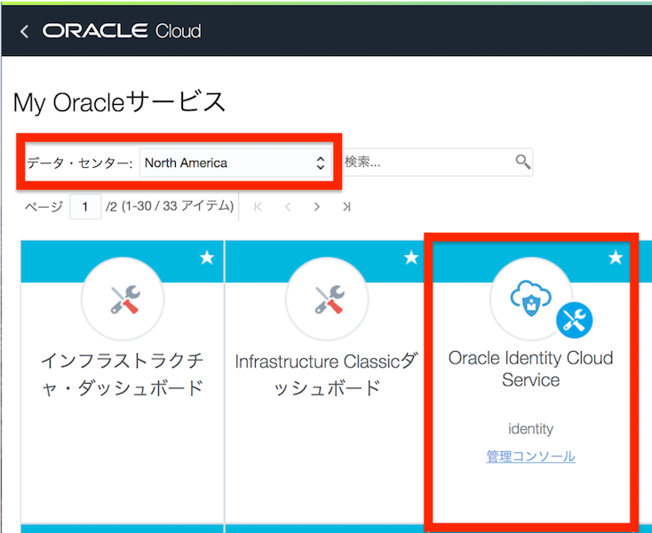

1. IDCS コンソールが開きます。左ナビゲーションの **「ユーザー」** をクリックします

    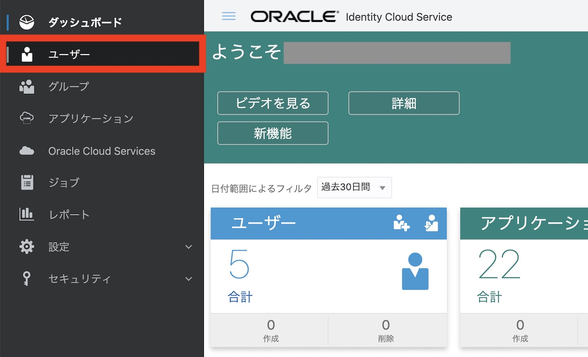

1. **「追加」** をクリックします

    

1. **「名」「姓」「ユーザー名/電子メール」** を入力し、**「次」** をクリックします

    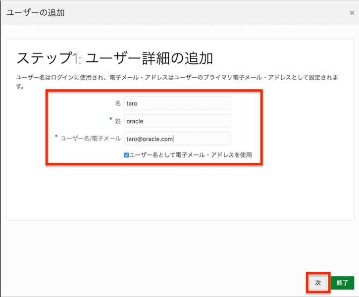

1. **OCI_Administrators** グループを選択し、**「終了」** をクリックします

    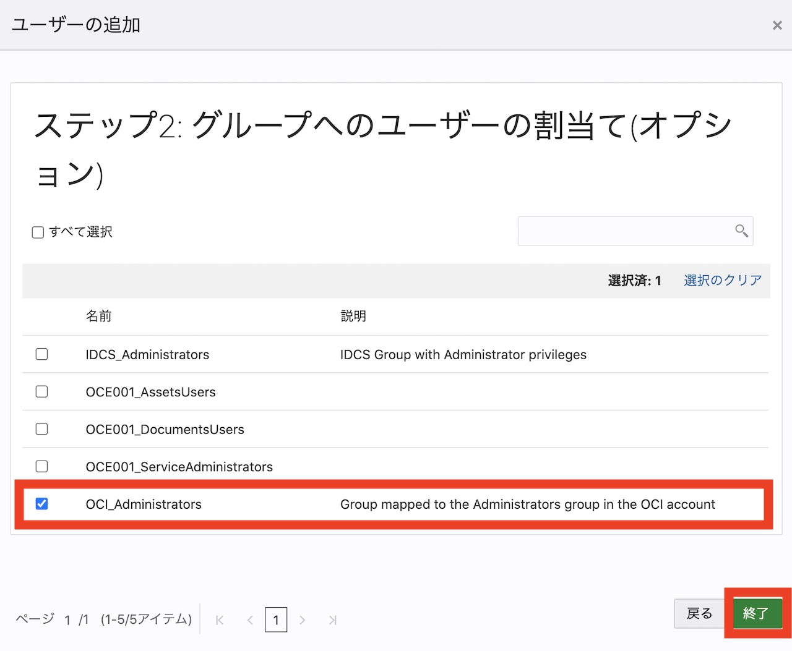

1. 作成した委任ユーザーに対してメールが送信されます。仮パスワードを利用し、OCIコンソールにサインインします。この時にパスワードの再設定します

1. 委任ユーザーで OCM インスタンスを作成する場合は、このまま次の手順を実施します

## 1.5 コンパートメントの作成

~~~
この手順は必須ではありません。
ただし、セキュリティ上の理由から、Oracleでは、既存のルート・コンパートメントを使用するのではなく、
新規コンパートメントを作成して使用することを強くお薦めします。
~~~

OCM インスタンスを作成する際に、**コンパートメント(Compartment)** を指定します。必要に応じて OCM インスタンスが利用するコンパートメントを事前に作成します。
ここでは、ルート・コンパートメント配下に **OCE** コンパートメントを作成します

1. OCI コンソールを開き、左上のメニュー→ **「アイデンティティとセキュリティ」→「コンパートメント」** を選択します

    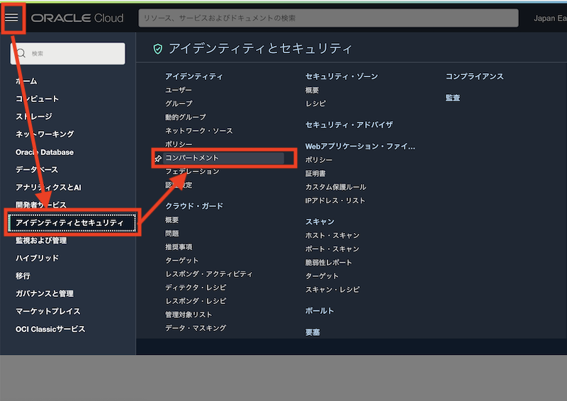

1. **「コンパートメントの作成」** をクリックします

    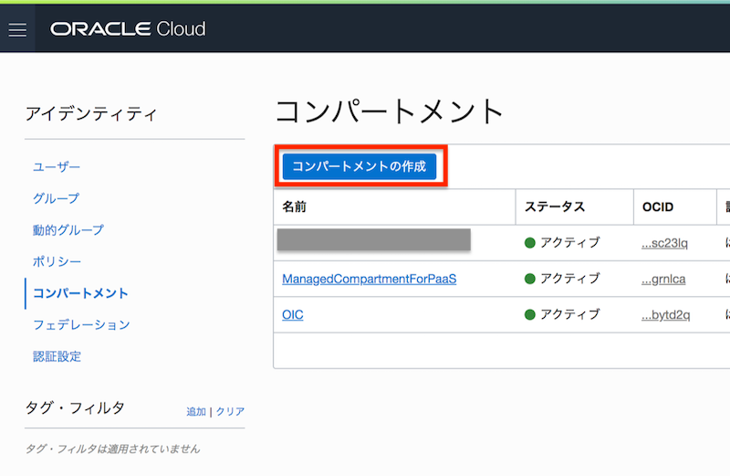

1. **「名前」** と **「説明」** を入力し、**「コンパートメントの作成」** をクリックします（ここでは OCE コンパートメントを作成）

    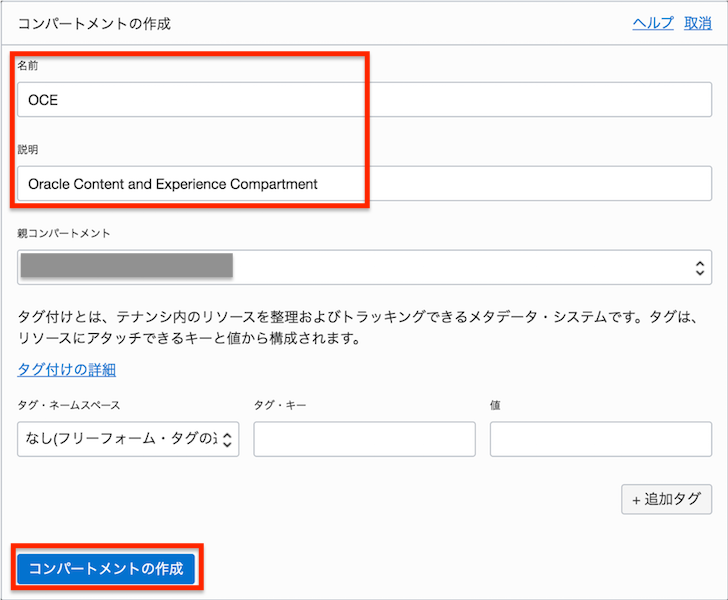

1. **OCE** コンパートメントが作成されます

    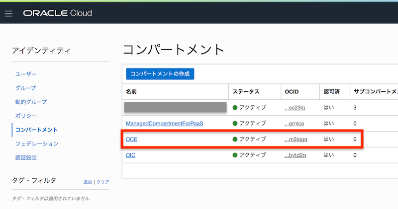

# 2. OCM インスタンスの作成

インスタンスを作成します。ここでは、ホームリージョンである `US East(Ashburn)` で作成します

## 2.1 OCM インスタンスを作成するリージョンについて

インスタンスは、**OCI のホームリージョンが所属するデータ・リージョン内に作成** することを推奨します。

OCI のホームリージョンではないデータ・リージョンで OCM インスタンスを作成する場合、OCM インスタンスを作成するリージョンと同一のデータ・リージョンの IDCS をユーザー管理に使用しなければいけない（=ホームリーションにあるOCIとのフェデレーションが事前定義されたPrimaryのIDCSを利用できない）、という制限があるため

-  例）OCI のホームリージョンが **東京(ap-tokyo-1)** の場合

    - APAC データ・リージョン内のリージョン（東京、大阪、ソウル、シドニーほか）にOCMインスタンスを作成

        - APAC データリージョンの IDCS を利用（Primary の IDCS。OCIとのフェデレーションが事前定義済）

    - NA（北米）データ・リージョン内のリージョン（Ashburn、Phoenixほか）にOCMインスタンスを作成

        - NA(北米)データリージョンの IDCS を利用（Primary ではない IDCS。OCI とのフェデレーション設定なし）

        - ユーザー情報の管理が Primary の IDCS と NA の IDCS で別々の管理となる

- **参考情報**

  - [Creating OCE Instance On Non-Primary Region Rejected With "404" or "400" Error (Doc ID 2596621.1)](https://support.oracle.com/epmos/faces/DocumentDisplay?id=2596621.1)

  - [Data Regions for Platform and Infrastructure Services](https://www.oracle.com/cloud/data-regions.html#northamerica)

## 2.2 OCM インスタンスの作成

1. OCI コンソールを開きます

1. OCM インスタンスを作成するホームリージョン（例: Japan East(Tokyo) など）を選択します。このでは **US East(Ashburn)** を選択しています

    

1. 左上のメニューをクリックし、**「開発者サービス」→「コンテンツ管理」→「インスタンス」** をクリックします

    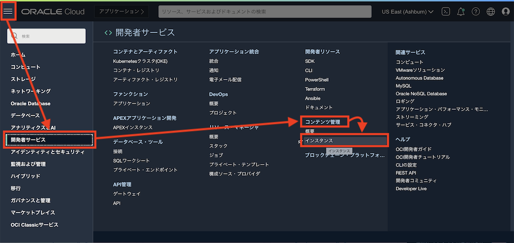

1. 画面左の「コンパートメント」より、**OCMインスタンスを作成するコンパートメント** （ここでは **OCE** コンパートメント）を選択し、**「インスタンスの作成」** をクリックします

    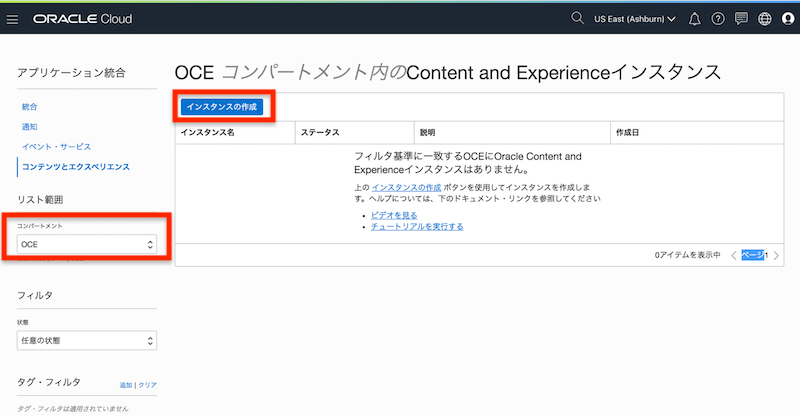

    1. **「インスタンス名」** と **「説明」** を入力します

    1. **「コンパートメント」** にあらかじめ選択したものが設定されていることを確認します（この場合 **OCE** コンパートメントを選択）。選択されていない場合は、ここでコンパートメントを選択します

    1. **「License Type(ライセンス・タイプ)」** を選択します（ここでは **Premium Edition** を選択）。ライセンス・タイプの詳細は [2.4 OCMインスタンスの作成オプションについて](#24-ocmインスタンスの作成オプションについて) をご確認ください

    1. **「インスタンスの作成」** をクリックします

        

    >**[TIPS]**  
    >インスタンス名は、OCE インスタンスにアクセスする際の URL に含まれます（下記URLの \<OCE Instance\> に該当）  
    > https://\<OCE Instance\>-\<Cloud account\>.cec.ocp.oraclecloud.com/documents/home

1. インスタンスの作成（プロビジョニング）が開始されます。プロビジョニング中のインスタンス名（ここでは OCE002）をクリックします

    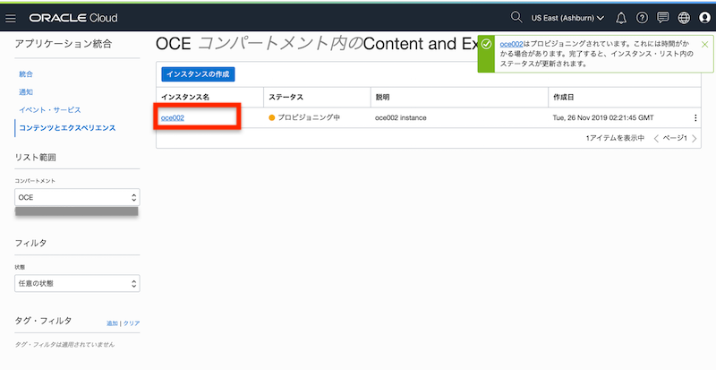

1. しばらく待つと、OCM インスタンスの作成が完了します。OCM インスタンスがアクティブであることを確認します

    

1. OCM インスタンス詳細の **「インスタンスのオープン」** をクリックします

    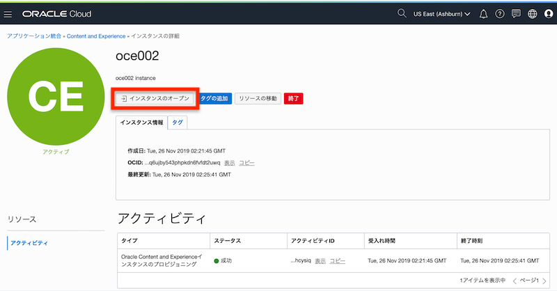

1. OCM インスタンスのホーム画面が開きます

    

## 2.3 OCM インスタンスの作成完了後の確認

~~~
この手順は必須ではありません
~~~

OCM インスタンスの作成により、OCI に以下のリソースが自動的に作成されます。必要に応じて確認してください

- オブジェクトストレージに OCM 専用のバケットが自動生成されます

  - バケット名の指定や変更はできません

  - OCM インスタンス利用中は削除しないでください

- ルート・コンパートメントに ***OCE_Internal_Storage_Policy*** のポリシーが自動生成されます。ポリシーを確認するには、「アイデンティティとセキュリティ」→「ポリシー」で、ルート・コンパートメントを選択します

  - このポリシーは、OCM インスタンス利用中は削除しないでください

また、OCM インスタンス作成ユーザーに対して、`Welcome to Oracle Cloud. Your Content Management service is ready for use` の通知メールが送信されます

## 2.4 OCMインスタンスの作成オプションについて

OCMインスタンスを作成する際に、様々なオプションを選択することができます。ここでは、そのオプションについて説明します（※ ***太字斜体*** がデフォルト設定）

1. **ライセンス・タイプ**

    - ***Premium Edition*** (OCMのフル機能を利用できる新規ライセンスを取得)

    - BYOL Edition (所有するOracle WebCenterライセンスを持ち込む)

    - Starter Edition (OCMの[機能限定版](https://docs.oracle.com/en/cloud/paas/content-cloud/administer/starter-vs-premium-edition.html)ライセンスを取得。**Always Free** の対象)

1. **インスタンス・タイプ**

    - ***プライマリ*** (プライマリーインスタンス。本番環境等で利用)

    - プライマリでない (非プライマリーインスタンス。本番用のプライマリインスタンスとは別に開発/検証/災害対策等の環境として利用。Starter Edition選択時は項目選択不可)

1. **アップグレード・スケジュール**

    - ***即時アップグレード*** (新しいリリースが利用可能になったら即座にアップグレードされる)

    - アップグレードの遅延 (新しいリリースが利用可能になっても、1リリースサイクル遅れてアップグレードされる。Starter Edition選択時は項目選択不可)

1. **インスタンスのアクセスタイプ**

    - ***パブリック*** (パブリックなインターネットを経由したアクセス)

    - プライベート (OCI FastConnect による閉域網アクセス。Starter Edition選択時は項目選択不可)

1. **代替のIdentity Cloud Serviceの使用**

    - デフォルトのIDCSインスタンスではない別のIDCSインスタンスを、OCMユーザーの管理で利用する場合のみ指定（例:本番環境と開発環境でユーザー管理を別々にしたい）

    - 「IDCSドメイン名」と「IDCSドメインID」を指定する

    - Starter Edition選択時は項目選択不可

以下のマニュアルも合わせてご確認ください  
- [Create Your Oracle Content Management Service Instance](https://docs.oracle.com/en/cloud/paas/content-cloud/administer/create-your-oracle-content-management-service-instance.html)

 

以上でこのチュートリアルは終了です。
