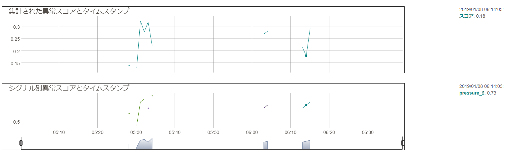

# Anomaly Detection（異常検出）サービスについて

異常検出とは、データ内のまれな項目、イベント、または観察結果のうち、予想と大きく異なるものを識別することです。 これは、公益事業、航空、輸送、製造などの業界における資産の監視、メンテナンス、予後監視などのいくつかのシナリオに使用できます。  
Oracleの異常検出サービスのアルゴリズムは、Oracle が特許を取得した多変量時系列異常検出アルゴリズムであり、元々は Oracle Labs によって開発され、いくつかの業界で使用されてきました。  
OCIの異常検出サービスは、ユーザーがアップロードしたデータを取得し、アルゴリズムを使用してモデルをトレーニングし、カスタマイズされた機械学習モデルを作成し、クラウドでホストします。 その後、ユーザーは新しいデータをエンドポイントに送信して、検出された異常の結果を取得できます。  
OCIの異常検出サービスは、サーバーレスのマルチ・テナント・サービスです。認証されたユーザーはOCI CLI、SDK、または Cloud Console を通じてREST API にアクセスできます。

# OCIコンソールからAnomaly Detectionサービスを使う

## 前提条件

* Oracle Cloud のアカウントを取得済みであること

## ポリシーの設定

OCI Anomaly Detection（異常検出）を利用するために、テナンシ管理者は次の手順に従って、ポリシーを設定する必要があります。  
OCI コンソール画面左上のハンバーガーメニューを展開し、「アイデンティティとセキュリティ」 > 「ポリシー」を選択します。


「ポリシーの作成」をクリックします。


ポリシーの作成情報を入力します。

* 名前：任意の名前
* 説明：ポリシーの説明
* コンパートメント：利用するコンパートメントを選択
* 手動エディタの表示：選択
* ポリシー・ステートメント：
  + テナント内のすべてのユーザーが異常検出サービスを使用できるようにする場合：
    - `allow any-user to manage ai-service-anomaly-detection-family in tenancy`
  + ユーザー・グループへのアクセスを制限する場合：
    - `allow group <group-name> to manage ai-service-anomaly-detection-family in tenancy`

「作成」をクリックします。


異常検出サービスは、カスタマイズされたモデルを構築するためにデータを必要とするため、ユーザーはデータへのアクセス許可を付与するポリシーも追加する必要があります。この記事では、Oracle オブジェクト・ ストレージをデータ・ソースとして使用するため、管理者は次のポリシーも追加する必要があります。

```
allow any-user to manage object-family in tenancy
```

## データの理解とサンプル・データのダウンロード

時系列異常検出モデルをトレーニングするために、適切なデータ・フォーマットが必要です。  
このセッションでは、データの要件と形式について説明し、例としていくつかのサンプル・データセットを提供します。また、データ資産を作成して、モデルをトレーニングするために、Oracle オブジェクト・ストレージにアップロードします。

### データの要件

異常検出サービスのコア・アルゴリズムは、多変量異常検出アルゴリズムであり、トレーニング・データに関する 2 つの要件があります。

* トレーニング・データには異常がなく (外れ値がなく)、正常なデータのみが含まれている必要があります。
* トレーニング・データは、すべての属性やシグナルの完全な値の範囲で、すべてのシナリオをカバーする必要があります。

さらに、アルゴリズムには、データ型、属性の最小数、およびトレーニング・データの観察に関するいくつかの要件もあります。

-	データは、CSV 形式で、1つの列はタイムスタンプを表し、他の列は観察値（数値属性/シグナル/センサー）を表します。タイムスタンプ列は重複なしで、順に並びます。
-	トレーニング・データには 1 つ以上の属性を含めることができます。2022 年 1 月の時点でのリリースでは最大 300 個の属性があります。
-	少なくとも 1 つの属性には欠損値がありません。
-	トレーニング・データの数は、少なくとも属性の数の 8 倍または 80 のいずれか大きい方である必要があります。

テスト・データには、トレーニング・データ・セットと一致するタイムスタンプや数値属性などの列のみを含める必要もあります。タイムスタンプによって順序付けられます。詳細については、OCI 異常検出ドキュメント内の「[Training and Testing Data Requirements](https://docs.oracle.com/en-us/iaas/Content/anomaly/using/data-require.htm)」を参照してください。

### データ・フォーマットの要件

異常検出サービスは、Oracle Object Storage、Oracle Autonomous Transaction Processing (ATP)、InfluxDB など、複数のタイプのデータ・ソースを受け入れます。ATP または InfluxDB をデータ・ソースとして使用する方法については、[https://docs.oracle.com/en-us/iaas/Content/services.htm](https://docs.oracle.com/en-us/iaas/Content/services.htm) でご参照ください。  
ここでは、Oracleオブジェクト・ストレージを例として要件を説明します。他のタイプのデータ・ソースも類似にしています。  
Oracleオブジェクト・ストレージの場合、サービスはCSV形式とJSON形式の2つのデータ形式を受け入れます。データには 1 つのタイムスタンプとその他の数値属性のみを含める必要があり、タイムスタンプは ISO 8601 形式を満たす最初の列にする必要があります。

#### CSV形式

CSV 形式のデータには、カンマ区切りの行が必要です。最初の行はヘッダー、その他の行はデータです。最初の列はタイムスタンプ列です。欠損値(NULL)は許可されます。データはタイムスタンプで並べ替えられ、ブール値のフラグ値は数値 (0/1) に変換される必要があります。最終行に改行を入れないでください。

```csv
timestamp, sensor1, sensor2, sensor3, sensor4, sensor5
2020-07-13T14:03:46Z, ,0.6459, -0.0016, -0.6792, 0
2020-07-13T14:04:46Z, ,0.1756, -0.5364, -0.1524, 1
2020-07-13T14:05:46Z, ,0.4132, -0.029, 0.679, 0
```

#### JSON形式のデータの例

同様に、JSON 形式のデータには、タイムスタンプと数値属性のみを含める必要があります。欠損値は、引用符なしで null としてコード化されます。

```json
{
  "requestType": "INLINE",
  "signalNames": ["sensor1", "sensor2", "sensor3", "sensor4", "sensor5", "sensor6", "sensor7", "sensor8", "sensor9", "sensor10"],
  "data": [
    {"timestamp": "2012-01-01T08:01:01.000Z", "values": [1, 2.2, 3, 1, 2.2, 3, 1, 2.2, null, 4]},
    {"timestamp": "2012-01-02T08:01:02.000Z", "values": [1, 2.2, 3, 1, 2.2, 3, 1, 2.2, 3, null]}
  ]
}
```

#### サンプル・データのダウンロード

トレーニング ・データとテスト・データを理解するために、以下の2 つのサンプル データセットが用意されています。

* [トレーニング・データ（CSV形式）](https://raw.githubusercontent.com/oracle-japan/ai-services-tutorials/main/anomaly-detection/demo-training-data.csv)：タイムスタンプ列と10個の信号を含む10, 000個の観測値
* [テスト・データ（JSON形式）](https://raw.githubusercontent.com/oracle-japan/ai-services-tutorials/main/anomaly-detection/demo-testing-data.json): タイムスタンプ列と10個の信号を含む10, 000個の観測値

## Object Storageへのアップロード

サンプルのトレーニング・データをオブジェクト・ストレージにアップロードします。  
OCI コンソール画面左上のハンバーガーメニューを展開し、「ストレージ」 > 「バケット」を選択します。


コンパートメントを選択し、「パケットの作成」をクリックします。


任意のバケット名を入力し、「作成」をクリックします。


サンプルのトレーニング ・データ・ファイルをアップロードします。  
「アップロード」をクリックします。「フィアルを選択」リンクをクリックし、ファイルを選択します。  
「アップロード」をクリックします。


## 異常検出プロジェクトの作成

ここでは、異常検出プロジェクトを作成し、オブジェクト ・ストレージにデータをアップロードし、データ資産を作成する方法を紹介します。

### プロジェクトの作成

プロジェクトは、複数のデータ資産、モデル、デプロイを同じワークスペースに整理する方法です。
OCI コンソール画面左上のハンバーガーメニューを展開し、「アナリティクスとAI」 > 「異常検出」を選択します。


プロジェクトを配置するコンパートメントを選択し、「プロジェクトの作成」をクリックします。
プロジェクト名と説明を入力し、「作成」をクリックします。


### データ・アセットの作成

前にアップロードされたオブジェクト・ ストレージを参照するデータ ・アセットを作成します。
作成したプロジェクトをクリックし、開きます。


「データ・アセット」メニューを選択し、「データ・アセットの作成」をクリックします。  
データを格納するオブジェクト ・ストレージのコンパートメントを指定し、名前と説明を入力します。  
タイプから「Oracle Object Storage」を選択し、パケットを選択し、トレーニング・データを選択し、 「ボタンの作成」 をクリックします。


数秒後、作成したデータ・アセットが表示されます。


Oracle Autonomous Transaction Processing (ATP) や InfluxDB などの他のタイプのデータ ソースの構成方法については、この「[Adding Data Assets](https://docs.oracle.com/en-us/iaas/Content/anomaly/using/add-data-assets.htm#add-data-assets)」を参照してください。

### 「モデルの作成とトレーニング」 ボタンを使用して、データ・アセットの作成(オプション)

モデルの作成とトレーニングでは、既存のデータセットを選択するか、新しいデータセットを作成するかを選択できます。  
「モデルの作成とトレーニング」ボタンをクリックします。


「新規データ・アセットの作成」を選択します。


前の手順と同様に、タイプから「Oracle Object Storage」を選択し、必要な情報を入力し、 「作成」 をクリックします。


## 異常検出モデルのトレーニングと検出

ここでは、異常検出モデルをトレーニングし、新しいデータを使用して予測を行う方法を紹介します。

### モデルの作成

モデルを作成するには、3 つのステップが必要です。

-	作成した適切なコンパートメントとデータ・アセットを選択
-	トレーニング・パラメータを設定
-	モデルをトレーニングする

作成したプロジェクトをクリックし、開きます。


「モデルの作成とトレーニング」をクリックします。


作成されたデータ・アセットがドロップ・ダウン・メニューに表示されます。 「次へ」ボタンをクリックします。


FAPとTrain Fraction Ratioを指定できます。これらのデフォルト値は、0.01 と 0.7 (70%) です。  
ここではデフォルトのままにし、「次へ」をクリックします。


**ターゲット誤警報確率（FAP: False Alarm Probability）**

異常でないものが異常として判断してしまう誤警報をどれだけ許容できるかの数字です。数字が高いほど、誤警報として判断される異常の可能性が高いことを示します。  
通常、FAPは、実際のビジネス・シナリオでの異常のパーセンテージとほぼ同じレベルに設定でき、0.01または1％の値が多くのシナリオに比較的適しています。より低いターゲット FAP を指定すると、モデルのトレーニングに時間がかかり、ターゲット FAP に到達しない可能性があることに注意してください。  
FAP = sum(各シグナルの異常の数) / (シグナルの数 * タイムスタンプの数)

**トレーニング分割率**

学習データのうち、どれだけの割合のデータでトレーニングし、残りのどれだけの割合でモデルの性能評価をするかを決めます。デフォルト値の0.7は、トレーニングにデータの70％を使用し、残りの30％でモデルのパフォーマンス評価に利用されます。


「作成」をクリックし、モデルの作成とトレーニングが開始されます。


今回のサンプル・データだと、だいたい10分から15分ぐらいかかります。


### 新しいデータで異常の検出

新しいデータから異常を検出します。 ユーザーは、クラウド・コンソールまたはエンドポイントを使用して、テスト・データを送信できます。
作成したモデルの「異常の検出」ボタンをクリックします。


サンプル・データのJSONファイルをアップロードし、「検出」ボタンをおします。


検出結果はすぐに表示されます。




### グラフの見方

異常を検知したシグナル（今回はTemperature_3、Temperature_2、Pressure_2）と全体の異常判断がタイムスタンプ毎に表示されています。  
オレンジ色のグラフが実際のデータ、紫色のグラフが予測データです。赤い線が入っているのが、全体をもって「異常」と検知された箇所になります。  
集計された異常スコアが全体での異常スコアで、特定の時間の異常の重要性を示します。  
シグナル別異常スコアが個別のシグナルの異常スコアで、異常と判定された時間で、どのデータ・シグナルが主な原因か、わかりやすく表示されています。  
異常検出データをJSONでエクスポート可能です。  
タイムスタンプ毎の配列でデータポイント毎の、実際のデータ、予測値、異常スコア、そして全体の異常スコアがエクスポートできます。

```json
[{
  "timestamp": "2019-01-07T21:28:10.000_00:00",
  "anomalies": [{
    "signalName": "temperature_3",
    "actualValue": -2.3941492028804823,
    "anomalyScore": 0.6991412894959958
  }],
  "score": 0.17062950252017466
}, ...]
```
